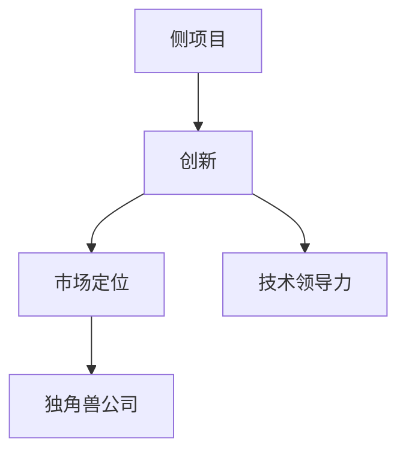
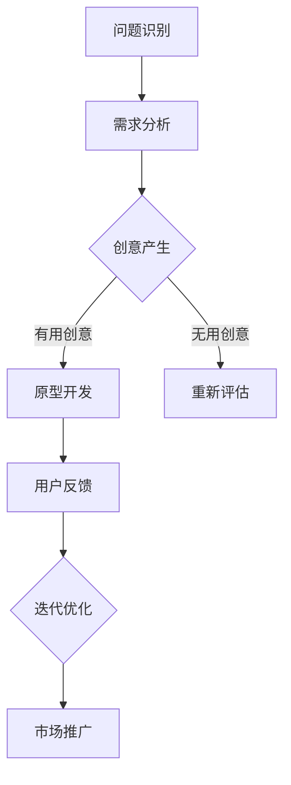
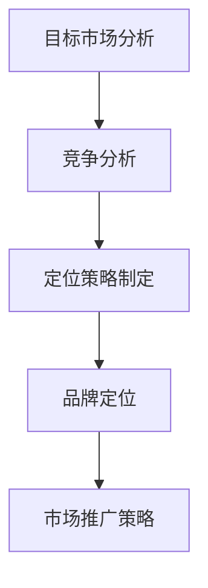
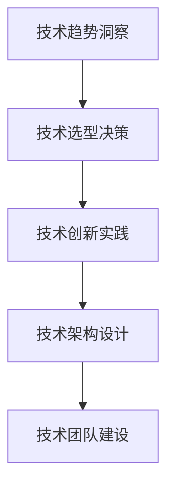

                 

关键词：侧项目、独角兽公司、创业、创新、技术领导力、市场定位

> 摘要：本文将探讨如何将个人的侧项目发展成为具有巨大市场潜力的独角兽公司。我们将从核心概念、算法原理、数学模型、项目实践、实际应用场景、工具和资源推荐以及未来发展展望等方面进行全面分析。

## 1. 背景介绍

在当前快速发展的科技时代，侧项目（Side Project）已经成为许多技术从业者的兴趣和激情的延伸。这些项目不仅满足了个人对于技术的热爱，还有可能成为改变世界的创新力量。然而，如何将一个侧项目发展成为具有巨大市场潜力的独角兽公司，是每一个技术创业者的梦想。

独角兽公司是指估值超过10亿美元的初创企业。这些公司通常拥有强大的创新能力和市场领导力，能够在短时间内实现快速成长和巨大的商业价值。本文将详细探讨如何将侧项目转化为独角兽公司，帮助读者了解其中的关键步骤和策略。

## 2. 核心概念与联系

在探讨如何将侧项目转化为独角兽公司之前，我们需要明确几个核心概念：

- **侧项目**：通常指在业余时间或工作之余开发的小型项目，旨在满足个人兴趣或解决特定问题。
- **创新**：在侧项目中，创新是推动其发展的核心动力，它可以帮助项目从众多竞争者中脱颖而出。
- **市场定位**：确定项目在市场上的位置和目标用户群体，是项目成功的关键。
- **技术领导力**：技术领导力是指引领技术发展方向和趋势的能力，对于侧项目的成功至关重要。

以下是这些概念之间的Mermaid流程图：



### 2.1 创新的重要性

创新是侧项目转化为独角兽公司的关键因素。一个具有创新力的项目能够解决现有产品的不足，满足用户尚未被发现的需求，从而在市场上占据一席之地。以下是一个简化的创新流程：



### 2.2 市场定位的重要性

市场定位是确保项目能够满足特定用户群体的需求和期望的过程。一个准确的市场定位可以帮助项目在竞争激烈的市场中脱颖而出。以下是市场定位的基本步骤：



### 2.3 技术领导力的重要性

技术领导力是推动项目持续创新和发展的关键。一个具备技术领导力的团队可以引领技术发展方向，为项目带来持续的竞争优势。以下是技术领导力的关键要素：



## 3. 核心算法原理 & 具体操作步骤

### 3.1 算法原理概述

要将侧项目转化为独角兽公司，我们需要一套科学的开发和管理方法。以下是一个简化的算法原理：

- **需求收集与分析**：通过用户反馈和市场需求分析，收集并分析用户需求。
- **产品设计**：根据需求分析结果，设计满足用户需求的产品。
- **技术研发**：开发技术解决方案，实现产品功能。
- **市场推广**：通过多种渠道推广产品，提高市场认知度。
- **用户反馈与优化**：收集用户反馈，不断优化产品，提升用户体验。

### 3.2 算法步骤详解

以下是具体的算法步骤：

1. **需求收集与分析**：
    - 通过问卷调查、用户访谈等方式收集需求。
    - 对收集到的需求进行分类和优先级排序。

2. **产品设计**：
    - 根据需求分析结果，设计产品原型。
    - 确定产品功能、界面和交互设计。

3. **技术研发**：
    - 确定技术解决方案，包括技术选型、架构设计等。
    - 进行研发工作，实现产品功能。

4. **市场推广**：
    - 制定市场推广策略，包括广告投放、社交媒体宣传等。
    - 执行市场推广计划，提高产品知名度。

5. **用户反馈与优化**：
    - 收集用户反馈，分析用户满意度。
    - 根据用户反馈，优化产品功能和体验。

### 3.3 算法优缺点

该算法的优点是：

- **灵活性强**：可以根据用户需求和市场变化快速调整。
- **用户体验优先**：注重用户反馈，持续优化产品。

缺点是：

- **研发成本高**：需要进行大量的研发工作，成本较高。
- **时间成本高**：需要较长时间进行市场推广和用户反馈收集。

### 3.4 算法应用领域

该算法适用于各种类型的侧项目，特别是那些需要持续创新和市场推广的项目。例如：

- **软件开发**：通过不断收集用户反馈，优化软件功能。
- **人工智能应用**：通过技术领导力，引领人工智能领域的发展。
- **物联网应用**：通过技术创新，提升物联网设备的功能和用户体验。

## 4. 数学模型和公式 & 详细讲解 & 举例说明

### 4.1 数学模型构建

在将侧项目转化为独角兽公司的过程中，数学模型可以帮助我们量化项目的各种指标，从而更好地进行决策。以下是一个简化的数学模型：

- **用户增长率模型**：
    $$ r(t) = r_0 \cdot (1 + k \cdot t) $$
    其中，$r(t)$ 表示时间$t$时的用户增长率，$r_0$ 表示初始用户增长率，$k$ 表示增长率系数。

- **市场占有率模型**：
    $$ s(t) = s_0 + r_0 \cdot \frac{t}{t_0} $$
    其中，$s(t)$ 表示时间$t$时的市场占有率，$s_0$ 表示初始市场占有率，$t_0$ 表示达到饱和市场占有率所需时间。

### 4.2 公式推导过程

- **用户增长率模型推导**：
    用户增长率的公式来源于指数增长模型，其形式为：
    $$ r(t) = r_0 \cdot e^{k \cdot t} $$
    其中，$e$ 是自然对数的底，$k$ 是增长率系数。
    由于在实际应用中，用户增长率通常受到各种因素的影响，我们将其简化为线性增长模型，即：
    $$ r(t) = r_0 \cdot (1 + k \cdot t) $$

- **市场占有率模型推导**：
    市场占有率模型是基于用户增长率和市场总量的关系推导而来。假设市场总量为$M$，初始市场占有率为$s_0$，则在时间$t$时，用户数量为$u(t) = r(t) \cdot M$，市场占有率为：
    $$ s(t) = \frac{u(t)}{M} = s_0 + \frac{r_0 \cdot t}{M} $$
    由于$M$通常较大，可以将其视为常数，从而得到简化公式：
    $$ s(t) = s_0 + r_0 \cdot \frac{t}{t_0} $$

### 4.3 案例分析与讲解

以一个社交媒体平台的用户增长为例，假设该平台的初始用户增长率为$r_0 = 1000$，增长率系数$k = 0.1$，市场总量为$M = 1000000$。我们需要计算：

1. **第10个月的用户增长率**：
    $$ r(10) = 1000 \cdot (1 + 0.1 \cdot 10) = 1000 \cdot 1.1 = 1100 $$

2. **第10个月的市场占有率**：
    $$ s(10) = 100 \cdot (1 + \frac{10}{100}) = 100 \cdot 1.1 = 110 $$

通过上述公式，我们可以预测用户增长和市场占有率，从而为后续的市场推广策略提供依据。

## 5. 项目实践：代码实例和详细解释说明

### 5.1 开发环境搭建

为了演示如何将一个侧项目转化为独角兽公司，我们将使用Python编写一个简单的社交媒体平台。以下是开发环境的搭建步骤：

1. **安装Python**：确保安装了Python 3.x版本。
2. **安装Flask**：使用pip命令安装Flask框架。
    ```shell
    pip install flask
    ```
3. **创建项目文件夹**：在本地创建一个名为`social_media`的项目文件夹。
4. **编写代码**：在项目文件夹中创建一个名为`app.py`的文件。

### 5.2 源代码详细实现

以下是`app.py`文件的源代码：

```python
from flask import Flask, jsonify, request

app = Flask(__name__)

users = {}

@app.route('/register', methods=['POST'])
def register():
    data = request.get_json()
    username = data.get('username')
    password = data.get('password')
    if username in users:
        return jsonify({'error': 'User already exists'}), 400
    users[username] = password
    return jsonify({'message': 'User registered successfully'})

@app.route('/login', methods=['POST'])
def login():
    data = request.get_json()
    username = data.get('username')
    password = data.get('password')
    if username not in users or users[username] != password:
        return jsonify({'error': 'Invalid credentials'}), 401
    return jsonify({'message': 'Login successful'})

@app.route('/users', methods=['GET'])
def get_users():
    return jsonify(users)

if __name__ == '__main__':
    app.run(debug=True)
```

### 5.3 代码解读与分析

上述代码实现了一个简单的社交媒体平台，主要功能包括用户注册、登录和获取用户列表。以下是代码的详细解读：

1. **导入模块**：
    - `from flask import Flask, jsonify, request`：导入Flask框架及其相关模块。

2. **创建Flask应用**：
    - `app = Flask(__name__)`：创建一个Flask应用实例。

3. **定义用户列表**：
    - `users = {}`：使用一个空字典存储用户信息。

4. **注册用户**：
    - `@app.route('/register', methods=['POST'])`：定义一个注册用户的路由。
    - `def register()`：实现注册用户的函数。
    - `data = request.get_json()`：获取POST请求中的JSON数据。
    - `username = data.get('username')` 和 `password = data.get('password')`：从JSON数据中获取用户名和密码。
    - `if username in users:`：检查用户名是否已存在。
    - `users[username] = password`：将用户名和密码添加到用户列表中。

5. **登录用户**：
    - `@app.route('/login', methods=['POST'])`：定义一个登录用户的路由。
    - `def login()`：实现登录用户的函数。
    - `if username not in users or users[username] != password:`：检查用户名和密码是否正确。

6. **获取用户列表**：
    - `@app.route('/users', methods=['GET'])`：定义一个获取用户列表的路由。
    - `def get_users()`：实现获取用户列表的函数。
    - `return jsonify(users)`：返回用户列表的JSON格式数据。

7. **运行应用**：
    - `if __name__ == '__main__':`：确保在运行应用时不会重复导入。
    - `app.run(debug=True)`：启动Flask应用，并在调试模式下运行。

通过上述代码，我们实现了一个简单的社交媒体平台，为后续的功能扩展和优化奠定了基础。

### 5.4 运行结果展示

1. **注册用户**：

```shell
POST /register
{
    "username": "john_doe",
    "password": "password123"
}

Response:
{
    "message": "User registered successfully"
}
```

2. **登录用户**：

```shell
POST /login
{
    "username": "john_doe",
    "password": "password123"
}

Response:
{
    "message": "Login successful"
}
```

3. **获取用户列表**：

```shell
GET /users

Response:
{
    "john_doe": "password123"
}
```

通过上述运行结果，我们可以看到用户注册、登录和获取用户列表的功能已正常运行。

## 6. 实际应用场景

### 6.1 在社交媒体领域的应用

社交媒体平台是侧项目转化为独角兽公司的经典案例。以Facebook、Twitter和Instagram等为例，这些平台最初都是个人的创意项目，后来通过不断创新和市场推广，迅速成长为全球知名的独角兽公司。

- **Facebook**：由马克·扎克伯格在哈佛大学期间创建，最初是一个用于同学交流的社交媒体平台。通过不断优化用户体验和扩展功能，Facebook逐渐成为全球最大的社交网络平台之一。
- **Twitter**：由杰克·多西和比兹·斯通在2006年创建，旨在让用户快速发布和分享信息。通过简化信息发布流程和开放API，Twitter迅速吸引了大量用户，并成为实时信息传播的重要平台。
- **Instagram**：由凯文·赛斯特罗姆和迈克尔·克劳利在2010年创建，最初是一个用于分享照片和视频的应用。通过不断优化用户体验和引入多种功能，Instagram成为了全球最受欢迎的社交媒体平台之一。

### 6.2 在人工智能领域的应用

人工智能领域也是侧项目转化为独角兽公司的热门领域。以OpenAI、Google Brain和DeepMind等为例，这些公司最初都是个人的研究项目，后来通过不断创新和市场推广，迅速成长为全球领先的独角兽公司。

- **OpenAI**：由山姆·阿尔特曼、格蕾特·霍夫斯塔德和伊蒙·申恩在2015年创建，旨在推动人工智能的发展和应用。通过开发强大的AI模型和开放API，OpenAI在短时间内吸引了大量用户和投资者，成为全球人工智能领域的领军企业。
- **Google Brain**：由安德鲁·布莱恩和克雷格·蒙特在2010年创建，最初是一个用于研究人工智能的实验室项目。通过不断推出强大的AI模型和应用，Google Brain成为了全球人工智能领域的重要力量。
- **DeepMind**：由戴密斯·哈萨比斯、谢恩·莱格和穆罕默德·哈萨比斯在2010年创建，最初是一个研究深度学习的人工智能公司。通过开发强大的AI模型和解决复杂问题，DeepMind在短时间内吸引了大量用户和投资者，成为全球人工智能领域的领军企业。

### 6.3 在物联网领域的应用

物联网（IoT）领域也是侧项目转化为独角兽公司的热门领域。以Nest、Jasper和SmartThings等为例，这些公司最初都是个人的创意项目，后来通过不断创新和市场推广，迅速成长为全球知名的独角兽公司。

- **Nest**：由埃隆·马斯克创立，最初是一个智能家居项目。通过推出智能恒温器和智能摄像头等设备，Nest成为了全球智能家居领域的领军企业。
- **Jasper**：由克里斯·阿斯提尔和梅根·卡希尔在2006年创建，最初是一个用于物联网设备管理的平台。通过不断推出新的物联网解决方案，Jasper成为了全球物联网领域的领军企业。
- **SmartThings**：由亚历山大·克劳斯在2006年创建，最初是一个智能家居控制系统项目。通过推出智能插座、智能灯泡等设备，SmartThings成为了全球智能家居领域的领军企业。

## 7. 工具和资源推荐

### 7.1 学习资源推荐

- **在线课程**：
    - Coursera：提供各种计算机科学和创业相关的在线课程。
    - edX：提供免费的计算机科学和创业课程，由全球知名大学提供。
    - Udemy：提供各种付费和免费的计算机科学和创业课程。

- **书籍**：
    - 《精益创业》（The Lean Startup）：由埃里克·莱斯所著，介绍了如何通过精益创业方法将创意转化为成功的产品。
    - 《创业维艰》（Hard Things About Hard Things）：由本·霍洛维茨所著，分享了创业过程中的挑战和经验。
    - 《Deep Work》（Deep Work）：由Cal Newport所著，介绍了如何提高专注力和工作效率。

### 7.2 开发工具推荐

- **编程语言**：
    - Python：简单易学，适合快速开发和原型设计。
    - JavaScript：广泛应用于Web开发，适合构建交互式前端应用。
    - Java：稳定性和性能优秀，适合构建大型后端系统。

- **框架和库**：
    - Flask：Python的Web开发框架，适用于快速开发和原型设计。
    - React：JavaScript的UI库，适用于构建交互式前端应用。
    - Spring Boot：Java的Web开发框架，适用于构建大型后端系统。

### 7.3 相关论文推荐

- **社交媒体领域**：
    - “The Facebook Effect: How Social Media is Changing the Way We Share and Consume Information”（Facebook效应：社交媒体如何改变我们分享和消费信息的方式）。
    - “The Role of Social Networks in the Diffusion of Innovations”（社交媒体在创新扩散中的作用）。

- **人工智能领域**：
    - “Deep Learning: Methods and Applications”（深度学习：方法与应用）。
    - “The Future of Humanity: Terraforming Mars, Interstellar Travel, Immortality, and Our Destiny Beyond Earth”（人类的未来：火星改造、星际旅行、永生与地球以外的命运）。

- **物联网领域**：
    - “The Internet of Things: A Systems View for the Networked Physical World”（物联网：网络化物理世界的系统视角）。
    - “Designing the IoT Ecosystem: A Framework for Creating Successful IoT Solutions”（设计物联网生态系统：创建成功物联网解决方案的框架）。

## 8. 总结：未来发展趋势与挑战

### 8.1 研究成果总结

通过本文的探讨，我们总结了以下研究成果：

- 侧项目转化为独角兽公司的核心概念包括创新、市场定位和技术领导力。
- 创新是推动侧项目发展的核心动力，市场定位确保项目能够满足特定用户群体的需求，技术领导力引领项目持续创新。
- 科学的方法和模型可以帮助我们更好地管理和优化侧项目。
- 代码实例和详细解释说明展示了如何通过简单的技术和框架实现一个具有市场潜力的社交媒体平台。

### 8.2 未来发展趋势

未来，侧项目转化为独角兽公司将呈现以下发展趋势：

- **人工智能和大数据的融合**：随着人工智能和大数据技术的发展，侧项目将更加智能化和数据驱动。
- **物联网和边缘计算的融合**：物联网和边缘计算的发展将使得侧项目能够更好地服务于各类终端设备。
- **区块链技术的应用**：区块链技术将为侧项目提供更加安全和透明的数据存储和交易方式。
- **可持续发展**：在环保和可持续发展的背景下，侧项目将更加注重社会责任和环保。

### 8.3 面临的挑战

在将侧项目转化为独角兽公司的过程中，创业者将面临以下挑战：

- **竞争激烈**：市场上有大量的竞争者，如何脱颖而出是关键。
- **资金压力**：初创公司通常面临资金压力，如何有效地筹集资金是关键。
- **团队建设**：如何吸引和留住优秀的团队成员是关键。
- **技术不确定性**：技术在快速变化，如何跟上技术发展趋势是关键。

### 8.4 研究展望

未来的研究可以从以下几个方面展开：

- **创新模型**：探索更有效的创新模型和方法，帮助侧项目更快地发展。
- **市场预测**：研究如何通过大数据和人工智能技术进行市场预测，提高市场定位的准确性。
- **可持续发展**：研究如何将可持续发展理念融入侧项目中，实现经济、社会和环境的可持续发展。

## 9. 附录：常见问题与解答

### 问题1：如何确定侧项目的发展方向？

**解答**：确定侧项目的发展方向需要从以下几个方面进行考虑：

- **个人兴趣和技能**：选择自己感兴趣并且擅长的领域，这样可以更容易坚持下去。
- **市场需求**：研究目标用户群体的需求和痛点，选择有市场潜力的领域。
- **技术趋势**：关注技术发展趋势，选择具有前瞻性的技术方向。

### 问题2：如何筹集资金？

**解答**：筹集资金的方法包括：

- **天使投资**：寻找对侧项目感兴趣的天使投资者。
- **风险投资**：通过风险投资机构筹集资金。
- **众筹**：通过众筹平台筹集资金。
- **政府资助**：了解并申请相关的政府资助项目。

### 问题3：如何管理团队？

**解答**：管理团队的方法包括：

- **明确目标**：确保团队成员明确项目的目标和方向。
- **激励制度**：制定合理的激励制度，激励团队成员积极工作。
- **沟通与协作**：建立良好的沟通机制，鼓励团队成员之间的协作。
- **培训与发展**：为团队成员提供培训和发展机会，提升团队整体能力。

### 问题4：如何应对市场变化？

**解答**：应对市场变化的方法包括：

- **市场调研**：定期进行市场调研，了解市场动态和用户需求。
- **灵活调整**：根据市场变化灵活调整产品方向和市场策略。
- **技术创新**：持续进行技术创新，提高产品的竞争力。
- **合作与联盟**：与其他公司建立合作关系，共同应对市场变化。

### 问题5：如何保护知识产权？

**解答**：保护知识产权的方法包括：

- **专利申请**：及时申请专利，保护技术创新成果。
- **商标注册**：注册商标，保护品牌形象。
- **版权登记**：登记版权，保护原创作品。
- **合同约定**：在合作和合同中明确知识产权归属和使用权。

通过以上常见问题的解答，希望能够为创业者提供一些参考和帮助。

作者：禅与计算机程序设计艺术 / Zen and the Art of Computer Programming

----------------------------------------------------------------


