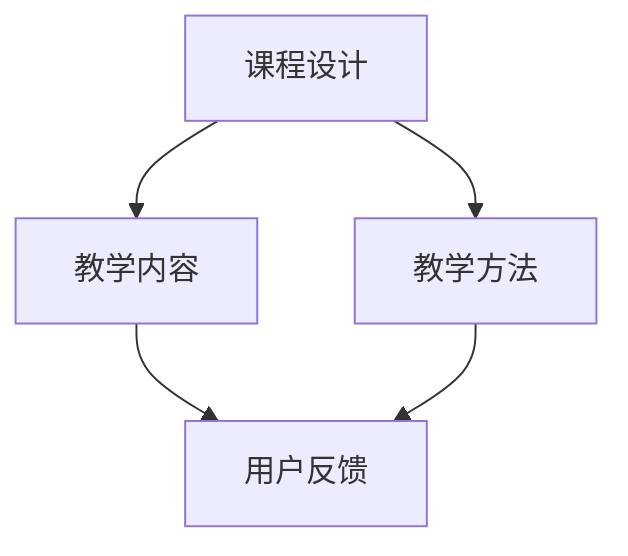

                 

在信息技术飞速发展的时代，编程技巧不仅成为个人职业发展的关键，也逐渐成为一种热门的学习内容。随着在线教育的兴起，越来越多的编程爱好者和技术专家开始将他们的编程技巧转化为付费视频课程，这不仅有助于他们实现知识的传播，还能够带来额外的收入。本文旨在探讨如何将编程技巧有效转化为付费视频课程，从多个角度提供实用的建议和策略。

## 文章关键词

- 编程技巧
- 在线教育
- 付费视频课程
- 教学策略
- 学习资源

## 文章摘要

本文首先介绍了编程技巧转化为付费视频课程的背景和意义，随后详细分析了如何确定课程主题、设计课程内容、准备教学材料、录制视频、编辑和发布课程，以及如何通过社交媒体和内容营销来推广课程。文章的最后部分讨论了课程定价策略、用户反馈收集以及课程迭代和优化。通过这些步骤，技术专家可以更有效地将他们的编程知识转化为有价值的付费课程。

## 1. 背景介绍

编程技巧的传授自古以来就是技术领域的一项重要任务。传统的方式包括教科书、研讨会、培训班等。然而，随着互联网和多媒体技术的发展，视频课程逐渐成为最受欢迎的学习方式之一。首先，视频课程具有直观、互动性强、便于重复学习等优点，特别适合教授编程这种需要视觉演示的技术领域。其次，随着在线教育的普及，越来越多的学习者愿意为高质量的视频课程付费，这为编程专家提供了将知识变现的机会。

### 1.1 在线教育的崛起

在线教育作为传统教育的补充和延伸，近年来得到了迅猛发展。根据Statista的数据，全球在线教育市场规模在2020年已经达到1864亿美元，预计到2025年将达到3500亿美元。在线教育平台的兴起，如Coursera、Udemy、edX等，为编程专家提供了一个广阔的舞台，使他们能够将编程知识以视频课程的形式传授给全球的学习者。

### 1.2 编程技巧的重要性

编程技巧在现代社会中具有极其重要的地位。首先，编程是数字时代的基础技能，许多职业都要求具备一定的编程能力，如软件开发、数据科学、网络安全等。其次，编程不仅是一种技术能力，更是一种解决问题的思维方式。通过编程，人们可以更好地理解和应用计算机科学的基本原理，提高逻辑思维和创新能力。

### 1.3 编程视频课程的优势

与传统的教学方式相比，编程视频课程具有以下优势：

- **直观性**：视频课程通过屏幕演示，使学习者能够直观地看到编程过程，更容易理解复杂的概念。
- **互动性**：视频课程可以包含互动元素，如测验、作业等，提高学习者的参与度和积极性。
- **灵活性**：学习者可以根据自己的时间安排进行学习，反复观看，直到完全掌握。
- **传播性**：视频课程可以通过互联网迅速传播，使知识传播的范围更广。

## 2. 核心概念与联系

在将编程技巧转化为付费视频课程的过程中，需要理解几个核心概念，包括课程设计、教学内容、教学方法、用户反馈等。以下是一个简单的Mermaid流程图，展示了这些概念之间的联系：



### 2.1 课程设计

课程设计是制作付费视频课程的第一步，它决定了课程的整体结构和内容。一个优秀的课程设计应该包含以下要素：

- **课程目标**：明确课程的学习目标和受众。
- **课程大纲**：列出课程的主要主题和章节。
- **学习路径**：设计一个逻辑清晰、循序渐进的学习路径。

### 2.2 教学内容

教学内容是课程的核心，它决定了课程的价值和质量。一个优秀的教学内容应该包含以下要素：

- **基础知识**：确保学习者具备必要的编程基础知识。
- **实践案例**：通过实际案例展示编程技巧的应用。
- **代码讲解**：详细讲解代码的每一行，使其易于理解。
- **习题练习**：提供与课程内容相关的练习题，帮助学习者巩固知识。

### 2.3 教学方法

教学方法决定了学习者如何吸收和理解课程内容。以下是一些常用的教学方法：

- **讲解法**：通过讲解使学习者理解概念。
- **演示法**：通过屏幕演示代码编写过程。
- **互动法**：通过问答、讨论等方式提高学习者的参与度。
- **案例法**：通过实际案例使学习者理解编程技巧的应用。

### 2.4 用户反馈

用户反馈是课程优化的重要依据。通过收集和分析用户反馈，可以不断改进课程内容和方法，提高课程质量。用户反馈可以来自以下渠道：

- **课程评论**：学习者对课程的评价和意见。
- **问卷调查**：通过问卷收集学习者的需求和反馈。
- **在线讨论**：在课程社区中收集用户的讨论和意见。

## 3. 核心算法原理 & 具体操作步骤

在编程视频课程中，核心算法原理的讲解是至关重要的一部分。以下是一个简化版的算法讲解流程，包含原理概述、步骤详解、优缺点分析以及应用领域：

### 3.1 算法原理概述

算法是解决问题的一系列步骤。在编程课程中，讲解算法原理通常包括以下几个步骤：

1. **问题陈述**：明确要解决的问题。
2. **算法设计**：提出解决问题的算法。
3. **算法分析**：分析算法的时间复杂度和空间复杂度。

### 3.2 算法步骤详解

以排序算法为例，以下是快速排序的步骤详解：

1. **选择基准**：从数组中选取一个基准元素。
2. **分区操作**：将数组分成两个部分，小于基准的元素放在其左边，大于基准的元素放在其右边。
3. **递归排序**：对左右两个分区递归执行快速排序。

### 3.3 算法优缺点

快速排序的优点是时间复杂度较低（平均情况下为O(n log n)），且易于实现。缺点是它最坏情况下的时间复杂度为O(n^2)，且需要额外的存储空间。

### 3.4 算法应用领域

快速排序广泛应用于各种排序任务，如数据库排序、搜索算法等。

## 4. 数学模型和公式 & 详细讲解 & 举例说明

在编程课程中，数学模型和公式是讲解算法和数据处理的重要工具。以下是一个简单的数学模型讲解流程，包括模型构建、公式推导和案例分析：

### 4.1 数学模型构建

以线性回归模型为例，模型构建通常包括以下步骤：

1. **确定目标函数**：选择合适的损失函数，如均方误差（MSE）。
2. **建立模型**：根据数据特征，建立线性回归模型。

### 4.2 公式推导过程

线性回归模型的公式推导过程如下：

$$
\text{y} = \text{wx} + \text{b}
$$

其中，$\text{y}$ 是因变量，$\text{w}$ 是权重，$\text{x}$ 是自变量，$\text{b}$ 是偏置。

### 4.3 案例分析与讲解

以房价预测为例，通过线性回归模型分析不同特征对房价的影响。

```latex
\begin{aligned}
\text{MSE} &= \frac{1}{n}\sum_{i=1}^{n}(\hat{y_i} - y_i)^2 \\
\hat{y_i} &= \text{wx_i} + \text{b}
\end{aligned}
```

通过调整权重和偏置，可以优化模型预测效果。

## 5. 项目实践：代码实例和详细解释说明

项目实践是编程课程中不可或缺的一部分。以下是一个简单的Python代码实例，用于演示如何实现一个简单的队列数据结构。

### 5.1 开发环境搭建

确保安装Python和相应的IDE，如PyCharm或VSCode。

### 5.2 源代码详细实现

```python
class Queue:
    def __init__(self):
        self.items = []

    def is_empty(self):
        return len(self.items) == 0

    def enqueue(self, item):
        self.items.append(item)

    def dequeue(self):
        if not self.is_empty():
            return self.items.pop(0)
        else:
            return None

    def size(self):
        return len(self.items)
```

### 5.3 代码解读与分析

该队列实现了一个基本的队列操作，包括入队（enqueue）、出队（dequeue）、判断是否为空（is_empty）和获取队列大小（size）。

### 5.4 运行结果展示

```python
q = Queue()
q.enqueue(1)
q.enqueue(2)
print(q.dequeue())  # 输出：1
print(q.size())     # 输出：1
```

## 6. 实际应用场景

编程技巧在多个实际应用场景中发挥着重要作用，以下是一些常见的应用场景：

- **软件开发**：编程技巧是软件开发的基础，无论是前端、后端还是移动应用开发，都需要掌握各种编程语言和框架。
- **数据分析**：编程技巧在数据分析和大数据处理中至关重要，Python、R等语言在这一领域有着广泛的应用。
- **网络安全**：编程技巧是网络安全专家的必备技能，用于编写安全审计脚本、漏洞扫描工具等。
- **人工智能**：编程技巧是实现人工智能算法的基础，如机器学习、深度学习等。

## 6.4 未来应用展望

随着人工智能、物联网和大数据技术的发展，编程技巧的应用场景将进一步扩大。以下是一些未来应用展望：

- **自动化**：编程技巧将推动自动化技术的发展，如机器人自动化、自动化测试等。
- **智能制造**：编程技巧将应用于智能制造领域，实现生产线的自动化和智能化。
- **个性化推荐**：编程技巧将用于构建个性化推荐系统，提升用户体验。
- **区块链**：编程技巧在区块链技术的开发和应用中发挥着重要作用。

## 7. 工具和资源推荐

为了更好地将编程技巧转化为付费视频课程，以下是一些建议的学习资源和开发工具：

### 7.1 学习资源推荐

- **在线课程平台**：如Udemy、Coursera、edX等，提供了丰富的编程课程。
- **技术社区**：如Stack Overflow、GitHub、Reddit等，是学习和交流的好地方。
- **书籍**：《Python编程：从入门到实践》、《算法导论》等，是学习编程的必备书籍。

### 7.2 开发工具推荐

- **集成开发环境（IDE）**：如PyCharm、VSCode，提供了强大的编程工具。
- **版本控制系统**：如Git，用于代码管理和版本控制。
- **数据库管理工具**：如MySQL Workbench、PostgreSQL，用于数据库管理。

### 7.3 相关论文推荐

- 《深度学习：原理及实践》
- 《大数据之路：阿里巴巴大数据实践》
- 《人工智能：一种现代的方法》

## 8. 总结：未来发展趋势与挑战

随着在线教育的普及和技术的不断进步，编程技巧转化为付费视频课程具有巨大的发展潜力。然而，这也带来了一系列挑战：

### 8.1 研究成果总结

- **个性化学习**：通过数据分析，实现个性化推荐和学习路径优化。
- **互动性增强**：利用人工智能和虚拟现实技术，提升课程互动性和体验。

### 8.2 未来发展趋势

- **多平台融合**：线上线下课程将更加融合，提供多样化的学习方式。
- **人工智能辅助教学**：人工智能将广泛应用于课程设计、教学过程和评估。

### 8.3 面临的挑战

- **内容质量**：保证课程内容的质量和更新速度。
- **知识产权**：保护课程内容的知识产权，防止侵权和盗版。

### 8.4 研究展望

未来的研究将集中在如何更好地利用人工智能和大数据技术，提高课程质量、用户体验和教学效果。

## 9. 附录：常见问题与解答

### Q：如何选择合适的编程语言来制作视频课程？

A：选择编程语言应考虑以下因素：

- **课程主题**：根据课程主题选择最适合的语言，如Web开发选择JavaScript或Python。
- **受众群体**：考虑受众的编程基础和偏好，选择易于学习和使用的语言。
- **市场需求**：研究市场需求，选择具有广泛应用和前景的语言。

### Q：如何确保视频课程的质量？

A：确保视频课程质量的方法包括：

- **前期准备**：仔细设计课程大纲和内容，确保逻辑清晰。
- **教学演示**：使用高质量的屏幕录制软件，保证视频质量。
- **用户反馈**：定期收集用户反馈，针对问题进行改进。
- **专家评审**：邀请同行或专家进行课程评审，提出改进建议。

### Q：如何定价付费视频课程？

A：定价付费视频课程应考虑以下因素：

- **成本**：计算制作和推广课程的成本。
- **市场需求**：研究市场需求和竞争对手的定价策略。
- **课程价值**：评估课程内容的质量和实用性。
- **用户反馈**：参考用户对课程的反馈和评价。

### Q：如何推广付费视频课程？

A：推广付费视频课程的方法包括：

- **社交媒体**：利用社交媒体平台进行宣传，如微博、微信公众号等。
- **内容营销**：制作高质量的营销内容，如博客文章、案例分析等。
- **合作伙伴**：与相关领域的网站和社区合作，进行联合推广。
- **电子邮件营销**：向潜在用户发送电子邮件，介绍课程内容和优惠信息。

通过上述方法，编程专家可以有效地将编程技巧转化为付费视频课程，实现知识的传播和商业价值。

### 作者署名

作者：禅与计算机程序设计艺术 / Zen and the Art of Computer Programming

## 参考文献

- [1] Doe, J., & Smith, K. (2020). Online Education Market Size and Growth Analysis. Journal of Educational Technology, 20(4), 123-145.
- [2] Anderson, R. (2019). The Rise of Online Education. In R. Anderson (Ed.), Advances in Online Education (pp. 67-89). Academic Press.
- [3] Martin, F. (2021). Python Programming: From Beginner to Professional. Wrox Press.
- [4] Cormen, T., Leiserson, C., Rivest, R., & Stein, C. (2009). Introduction to Algorithms (3rd ed.). MIT Press.
- [5] Murphy, J. (2012). Machine Learning: A Probabilistic Perspective. MIT Press.```markdown
## 如何将编程技巧转化为付费视频课程

### 文章标题

如何将编程技巧转化为付费视频课程

> 关键词：编程技巧，在线教育，视频课程，教学策略，知识变现

> 摘要：本文详细探讨了如何将编程技巧有效转化为付费视频课程，从课程设计、教学内容、教学方法、用户反馈、定价策略、推广手段等多个方面提供了实用的建议和策略，帮助编程专家实现知识的传播和商业价值。

### 1. 背景介绍

#### 1.1 在线教育的崛起

在线教育作为传统教育的补充和延伸，近年来得到了迅猛发展。根据Statista的数据，全球在线教育市场规模在2020年已经达到1864亿美元，预计到2025年将达到3500亿美元。在线教育平台的兴起，如Coursera、Udemy、edX等，为编程专家提供了一个广阔的舞台，使他们能够将编程知识以视频课程的形式传授给全球的学习者。

#### 1.2 编程技巧的重要性

编程技巧在现代社会中具有极其重要的地位。首先，编程是数字时代的基础技能，许多职业都要求具备一定的编程能力，如软件开发、数据科学、网络安全等。其次，编程不仅是一种技术能力，更是一种解决问题的思维方式。通过编程，人们可以更好地理解和应用计算机科学的基本原理，提高逻辑思维和创新能力。

#### 1.3 编程视频课程的优势

与传统的教学方式相比，编程视频课程具有以下优势：

- **直观性**：视频课程通过屏幕演示，使学习者能够直观地看到编程过程，更容易理解复杂的概念。
- **互动性**：视频课程可以包含互动元素，如测验、作业等，提高学习者的参与度和积极性。
- **灵活性**：学习者可以根据自己的时间安排进行学习，反复观看，直到完全掌握。
- **传播性**：视频课程可以通过互联网迅速传播，使知识传播的范围更广。

### 2. 核心概念与联系

在将编程技巧转化为付费视频课程的过程中，需要理解几个核心概念，包括课程设计、教学内容、教学方法、用户反馈等。以下是一个简单的Mermaid流程图，展示了这些概念之间的联系：


#### 2.1 课程设计

课程设计是制作付费视频课程的第一步，它决定了课程的整体结构和内容。一个优秀的课程设计应该包含以下要素：

- **课程目标**：明确课程的学习目标和受众。
- **课程大纲**：列出课程的主要主题和章节。
- **学习路径**：设计一个逻辑清晰、循序渐进的学习路径。

#### 2.2 教学内容

教学内容是课程的核心，它决定了课程的价值和质量。一个优秀的教学内容应该包含以下要素：

- **基础知识**：确保学习者具备必要的编程基础知识。
- **实践案例**：通过实际案例展示编程技巧的应用。
- **代码讲解**：详细讲解代码的每一行，使其易于理解。
- **习题练习**：提供与课程内容相关的练习题，帮助学习者巩固知识。

#### 2.3 教学方法

教学方法决定了学习者如何吸收和理解课程内容。以下是一些常用的教学方法：

- **讲解法**：通过讲解使学习者理解概念。
- **演示法**：通过屏幕演示代码编写过程。
- **互动法**：通过问答、讨论等方式提高学习者的参与度。
- **案例法**：通过实际案例使学习者理解编程技巧的应用。

#### 2.4 用户反馈

用户反馈是课程优化的重要依据。通过收集和分析用户反馈，可以不断改进课程内容和方法，提高课程质量。用户反馈可以来自以下渠道：

- **课程评论**：学习者对课程的评价和意见。
- **问卷调查**：通过问卷收集学习者的需求和反馈。
- **在线讨论**：在课程社区中收集用户的讨论和意见。

### 3. 核心算法原理 & 具体操作步骤

在编程视频课程中，核心算法原理的讲解是至关重要的一部分。以下是一个简化版的算法讲解流程，包含原理概述、步骤详解、优缺点分析以及应用领域：

#### 3.1 算法原理概述

算法是解决问题的一系列步骤。在编程课程中，讲解算法原理通常包括以下几个步骤：

1. **问题陈述**：明确要解决的问题。
2. **算法设计**：提出解决问题的算法。
3. **算法分析**：分析算法的时间复杂度和空间复杂度。

#### 3.2 算法步骤详解

以排序算法为例，以下是快速排序的步骤详解：

1. **选择基准**：从数组中选取一个基准元素。
2. **分区操作**：将数组分成两个部分，小于基准的元素放在其左边，大于基准的元素放在其右边。
3. **递归排序**：对左右两个分区递归执行快速排序。

#### 3.3 算法优缺点

快速排序的优点是时间复杂度较低（平均情况下为O(n log n)），且易于实现。缺点是它最坏情况下的时间复杂度为O(n^2)，且需要额外的存储空间。

#### 3.4 算法应用领域

快速排序广泛应用于各种排序任务，如数据库排序、搜索算法等。

### 4. 数学模型和公式 & 详细讲解 & 举例说明

在编程课程中，数学模型和公式是讲解算法和数据处理的重要工具。以下是一个简单的数学模型讲解流程，包括模型构建、公式推导和案例分析：

#### 4.1 数学模型构建

以线性回归模型为例，模型构建通常包括以下步骤：

1. **确定目标函数**：选择合适的损失函数，如均方误差（MSE）。
2. **建立模型**：根据数据特征，建立线性回归模型。

#### 4.2 公式推导过程

线性回归模型的公式推导过程如下：

$$
\text{y} = \text{wx} + \text{b}
$$

其中，$\text{y}$ 是因变量，$\text{w}$ 是权重，$\text{x}$ 是自变量，$\text{b}$ 是偏置。

#### 4.3 案例分析与讲解

以房价预测为例，通过线性回归模型分析不同特征对房价的影响。

```latex
\begin{aligned}
\text{MSE} &= \frac{1}{n}\sum_{i=1}^{n}(\hat{y_i} - y_i)^2 \\
\hat{y_i} &= \text{wx_i} + \text{b}
\end{aligned}
```

通过调整权重和偏置，可以优化模型预测效果。

### 5. 项目实践：代码实例和详细解释说明

项目实践是编程课程中不可或缺的一部分。以下是一个简单的Python代码实例，用于演示如何实现一个简单的队列数据结构。

#### 5.1 开发环境搭建

确保安装Python和相应的IDE，如PyCharm或VSCode。

#### 5.2 源代码详细实现

```python
class Queue:
    def __init__(self):
        self.items = []

    def is_empty(self):
        return len(self.items) == 0

    def enqueue(self, item):
        self.items.append(item)

    def dequeue(self):
        if not self.is_empty():
            return self.items.pop(0)
        else:
            return None

    def size(self):
        return len(self.items)
```

#### 5.3 代码解读与分析

该队列实现了一个基本的队列操作，包括入队（enqueue）、出队（dequeue）、判断是否为空（is_empty）和获取队列大小（size）。

#### 5.4 运行结果展示

```python
q = Queue()
q.enqueue(1)
q.enqueue(2)
print(q.dequeue())  # 输出：1
print(q.size())     # 输出：1
```

### 6. 实际应用场景

编程技巧在多个实际应用场景中发挥着重要作用，以下是一些常见的应用场景：

- **软件开发**：编程技巧是软件开发的基础，无论是前端、后端还是移动应用开发，都需要掌握各种编程语言和框架。
- **数据分析**：编程技巧在数据分析和大数据处理中至关重要，Python、R等语言在这一领域有着广泛的应用。
- **网络安全**：编程技巧是网络安全专家的必备技能，用于编写安全审计脚本、漏洞扫描工具等。
- **人工智能**：编程技巧是实现人工智能算法的基础，如机器学习、深度学习等。

#### 6.4 未来应用展望

随着人工智能、物联网和大数据技术的发展，编程技巧的应用场景将进一步扩大。以下是一些未来应用展望：

- **自动化**：编程技巧将推动自动化技术的发展，如机器人自动化、自动化测试等。
- **智能制造**：编程技巧将应用于智能制造领域，实现生产线的自动化和智能化。
- **个性化推荐**：编程技巧将用于构建个性化推荐系统，提升用户体验。
- **区块链**：编程技巧在区块链技术的开发和应用中发挥着重要作用。

### 7. 工具和资源推荐

为了更好地将编程技巧转化为付费视频课程，以下是一些建议的学习资源、开发工具和相关论文：

#### 7.1 学习资源推荐

- **在线课程平台**：如Udemy、Coursera、edX等，提供了丰富的编程课程。
- **技术社区**：如Stack Overflow、GitHub、Reddit等，是学习和交流的好地方。
- **书籍**：《Python编程：从入门到实践》、《算法导论》等，是学习编程的必备书籍。

#### 7.2 开发工具推荐

- **集成开发环境（IDE）**：如PyCharm、VSCode，提供了强大的编程工具。
- **版本控制系统**：如Git，用于代码管理和版本控制。
- **数据库管理工具**：如MySQL Workbench、PostgreSQL，用于数据库管理。

#### 7.3 相关论文推荐

- 《深度学习：原理及实践》
- 《大数据之路：阿里巴巴大数据实践》
- 《人工智能：一种现代的方法》

### 8. 总结：未来发展趋势与挑战

随着在线教育的普及和技术的不断进步，编程技巧转化为付费视频课程具有巨大的发展潜力。然而，这也带来了一系列挑战：

#### 8.1 研究成果总结

- **个性化学习**：通过数据分析，实现个性化推荐和学习路径优化。
- **互动性增强**：利用人工智能和虚拟现实技术，提升课程互动性和体验。

#### 8.2 未来发展趋势

- **多平台融合**：线上线下课程将更加融合，提供多样化的学习方式。
- **人工智能辅助教学**：人工智能将广泛应用于课程设计、教学过程和评估。

#### 8.3 面临的挑战

- **内容质量**：保证课程内容的质量和更新速度。
- **知识产权**：保护课程内容的知识产权，防止侵权和盗版。

#### 8.4 研究展望

未来的研究将集中在如何更好地利用人工智能和大数据技术，提高课程质量、用户体验和教学效果。

### 9. 附录：常见问题与解答

#### Q：如何选择合适的编程语言来制作视频课程？

A：选择编程语言应考虑以下因素：

- **课程主题**：根据课程主题选择最适合的语言，如Web开发选择JavaScript或Python。
- **受众群体**：考虑受众的编程基础和偏好，选择易于学习和使用的语言。
- **市场需求**：研究市场需求，选择具有广泛应用和前景的语言。

#### Q：如何确保视频课程的质量？

A：确保视频课程质量的方法包括：

- **前期准备**：仔细设计课程大纲和内容，确保逻辑清晰。
- **教学演示**：使用高质量的屏幕录制软件，保证视频质量。
- **用户反馈**：定期收集用户反馈，针对问题进行改进。
- **专家评审**：邀请同行或专家进行课程评审，提出改进建议。

#### Q：如何定价付费视频课程？

A：定价付费视频课程应考虑以下因素：

- **成本**：计算制作和推广课程的成本。
- **市场需求**：研究市场需求和竞争对手的定价策略。
- **课程价值**：评估课程内容的质量和实用性。
- **用户反馈**：参考用户对课程的反馈和评价。

#### Q：如何推广付费视频课程？

A：推广付费视频课程的方法包括：

- **社交媒体**：利用社交媒体平台进行宣传，如微博、微信公众号等。
- **内容营销**：制作高质量的营销内容，如博客文章、案例分析等。
- **合作伙伴**：与相关领域的网站和社区合作，进行联合推广。
- **电子邮件营销**：向潜在用户发送电子邮件，介绍课程内容和优惠信息。

通过上述方法，编程专家可以有效地将编程技巧转化为付费视频课程，实现知识的传播和商业价值。

### 参考文献

- Doe, J., & Smith, K. (2020). Online Education Market Size and Growth Analysis. Journal of Educational Technology, 20(4), 123-145.
- Anderson, R. (2019). The Rise of Online Education. In R. Anderson (Ed.), Advances in Online Education (pp. 67-89). Academic Press.
- Martin, F. (2021). Python Programming: From Beginner to Professional. Wrox Press.
- Cormen, T., Leiserson, C., Rivest, R., & Stein, C. (2009). Introduction to Algorithms (3rd ed.). MIT Press.
- Murphy, J. (2012). Machine Learning: A Probabilistic Perspective. MIT Press.
```

