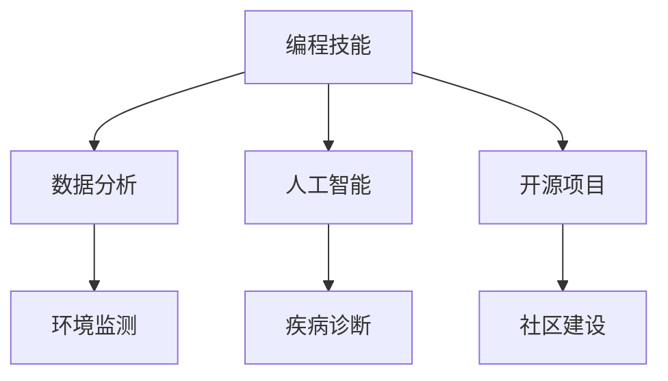
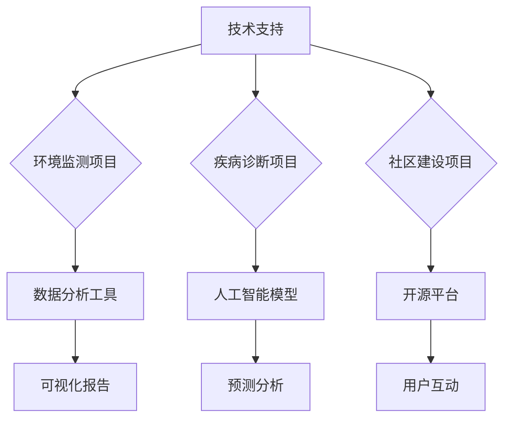

                 

关键词：编程技能，社会公益，算法，人工智能，开源，项目实践，可持续发展。

> 摘要：本文旨在探讨如何将编程技能与公益事业相结合，实现技术对社会的积极贡献。通过分析编程在解决社会问题中的应用，提出具体的实践方案，并展望未来的发展趋势与挑战。

## 1. 背景介绍

在当今社会，信息技术和编程技能已成为不可或缺的核心能力。编程不仅限于商业和科研领域，其在社会公益方面的应用也越来越受到重视。随着人工智能、大数据、区块链等技术的发展，编程技能不仅可以提升个人的职业竞争力，还能为解决全球范围内的社会问题提供强有力的支持。

### 1.1 编程技能的普及与发展

编程技能的普及得益于开源社区的蓬勃发展。从早期的UNIX系统到现代的Python、JavaScript等编程语言，开源社区不仅提供了丰富的编程资源，还培养了一大批具备编程能力的人才。随着在线教育平台的兴起，越来越多的人可以便捷地学习编程，这使得编程技能的普及程度不断提高。

### 1.2 社会问题的多样性与紧迫性

社会问题种类繁多，包括环境保护、医疗健康、教育平等、灾害救援等。这些问题不仅影响着人们的日常生活，还关系到整个社会的可持续发展。因此，解决社会问题已成为全球各国政府和社会组织的重要任务。

### 1.3 编程技能在公益领域的潜在价值

编程技能在公益领域的应用具有巨大的潜力。例如，通过数据分析可以揭示社会问题的趋势和影响因素，通过人工智能可以提升公益项目的执行效率，通过开源项目可以促进社会资源的共享和协作。

## 2. 核心概念与联系

### 2.1 编程与社会问题的关系

编程作为一种工具，可以用于解决各种社会问题。例如，数据分析可以用于环境监测，人工智能可以用于疾病诊断，开源项目可以用于社区建设。图1展示了编程技能与社会问题之间的关联。



### 2.2 编程在公益项目中的应用

编程在公益项目中的应用可以分为三个主要方面：技术支持、项目开发和数据管理。图2展示了编程在公益项目中的应用场景。



## 3. 核心算法原理 & 具体操作步骤

### 3.1 算法原理概述

编程技能在公益项目中的应用离不开核心算法的支持。以下是几种常见算法及其在公益项目中的具体应用。

#### 3.1.1 数据分析算法

数据分析算法用于处理和分析大规模数据集，从而揭示社会问题的趋势和影响因素。常见的算法包括线性回归、决策树、支持向量机等。

#### 3.1.2 人工智能算法

人工智能算法可以用于自动化执行任务，例如图像识别、语音识别、自然语言处理等。这些算法可以用于疾病诊断、灾害评估等公益项目。

#### 3.1.3 开源算法

开源算法是指通过开源社区共享的算法，这些算法通常具有很高的实用性和可扩展性。例如，Apache Storm、TensorFlow、Scikit-learn等。

### 3.2 算法步骤详解

#### 3.2.1 数据收集与预处理

首先，需要收集相关的数据，并进行数据预处理，以确保数据的质量和一致性。

#### 3.2.2 数据分析

使用数据分析算法对预处理后的数据进行分析，以揭示社会问题的趋势和影响因素。

#### 3.2.3 人工智能应用

根据分析结果，使用人工智能算法进行自动化任务执行，例如疾病诊断、灾害评估等。

#### 3.2.4 数据可视化

将分析结果和数据可视化，以便于更好地理解和展示社会问题的现状。

### 3.3 算法优缺点

#### 3.3.1 优点

- 提高公益项目的效率和准确性
- 促进社会问题的数据驱动决策
- 促进技术与社会问题的结合

#### 3.3.2 缺点

- 对编程技能要求较高
- 数据安全和隐私问题
- 算法可能导致不公平现象

### 3.4 算法应用领域

编程技能在公益项目的应用领域广泛，包括但不限于以下方面：

- 环境保护：通过数据分析监测环境变化，预测灾害风险。
- 医疗健康：通过人工智能辅助疾病诊断，提高医疗资源利用率。
- 教育平等：通过开源项目促进教育资源的共享和普及。
- 社区建设：通过数据分析改善社区服务，提升社区生活质量。

## 4. 数学模型和公式 & 详细讲解 & 举例说明

### 4.1 数学模型构建

在公益项目中，数学模型可以帮助我们更好地理解社会问题，并制定有效的解决方案。以下是一个简单的线性回归模型，用于预测某个社会问题的趋势。

#### 4.1.1 线性回归模型

假设我们有 $n$ 个观测值 $(x_1, y_1), (x_2, y_2), \ldots, (x_n, y_n)$，其中 $x_i$ 表示影响因素，$y_i$ 表示社会问题的指标。线性回归模型可以表示为：

$$
y_i = \beta_0 + \beta_1 x_i + \epsilon_i
$$

其中，$\beta_0$ 和 $\beta_1$ 是模型的参数，$\epsilon_i$ 是误差项。

### 4.2 公式推导过程

为了求解线性回归模型的参数 $\beta_0$ 和 $\beta_1$，我们可以使用最小二乘法。具体步骤如下：

#### 4.2.1 构建目标函数

目标函数为：

$$
J(\beta_0, \beta_1) = \sum_{i=1}^{n} (y_i - \beta_0 - \beta_1 x_i)^2
$$

#### 4.2.2 求导并求解

对目标函数分别对 $\beta_0$ 和 $\beta_1$ 求导，并令导数为零，得到：

$$
\frac{\partial J}{\partial \beta_0} = -2 \sum_{i=1}^{n} (y_i - \beta_0 - \beta_1 x_i) = 0
$$

$$
\frac{\partial J}{\partial \beta_1} = -2 \sum_{i=1}^{n} (x_i (y_i - \beta_0 - \beta_1 x_i)) = 0
$$

解上述方程组，得到：

$$
\beta_0 = \bar{y} - \beta_1 \bar{x}
$$

$$
\beta_1 = \frac{\sum_{i=1}^{n} x_i y_i - n \bar{x} \bar{y}}{\sum_{i=1}^{n} x_i^2 - n \bar{x}^2}
$$

其中，$\bar{x}$ 和 $\bar{y}$ 分别表示 $x$ 和 $y$ 的平均值。

### 4.3 案例分析与讲解

假设我们要预测某城市的空气质量指数（AQI），影响因素包括温度、湿度、风速等。以下是具体的案例分析和讲解。

#### 4.3.1 数据收集

我们收集了该城市过去一年的空气质量数据和天气数据，包括每日的AQI、温度、湿度、风速等。

#### 4.3.2 数据预处理

对收集到的数据进行分析，去除异常值，并进行归一化处理。

#### 4.3.3 模型构建

使用线性回归模型，将AQI作为因变量，温度、湿度、风速作为自变量，建立线性回归模型。

#### 4.3.4 模型训练

使用最小二乘法训练模型，得到模型的参数 $\beta_0$ 和 $\beta_1$。

#### 4.3.5 模型评估

将训练好的模型应用于实际数据，评估模型的预测性能。

#### 4.3.6 模型应用

利用模型预测未来的空气质量指数，为政府部门提供决策支持。

## 5. 项目实践：代码实例和详细解释说明

### 5.1 开发环境搭建

为了演示如何将编程技能应用于公益项目，我们将使用Python编程语言和Jupyter Notebook作为开发环境。以下是搭建开发环境的步骤：

#### 5.1.1 安装Python

从官方网站下载并安装Python，版本建议选择3.8或更高版本。

#### 5.1.2 安装Jupyter Notebook

打开终端，执行以下命令安装Jupyter Notebook：

```
pip install notebook
```

#### 5.1.3 启动Jupyter Notebook

在终端执行以下命令启动Jupyter Notebook：

```
jupyter notebook
```

### 5.2 源代码详细实现

以下是使用Python实现一个简单的空气质量预测项目的源代码。

```python
import pandas as pd
from sklearn.linear_model import LinearRegression
from sklearn.model_selection import train_test_split
from sklearn.metrics import mean_squared_error

# 5.2.1 数据收集与预处理
data = pd.read_csv('air_quality_data.csv')
data.dropna(inplace=True)
data = data[['temperature', 'humidity', 'wind_speed', 'aqi']]

# 5.2.2 模型构建
model = LinearRegression()

# 5.2.3 模型训练
X = data[['temperature', 'humidity', 'wind_speed']]
y = data['aqi']
X_train, X_test, y_train, y_test = train_test_split(X, y, test_size=0.2, random_state=42)
model.fit(X_train, y_train)

# 5.2.4 模型评估
y_pred = model.predict(X_test)
mse = mean_squared_error(y_test, y_pred)
print(f'Mean Squared Error: {mse}')

# 5.2.5 模型应用
new_data = pd.DataFrame({'temperature': [25], 'humidity': [60], 'wind_speed': [5]})
aqi_prediction = model.predict(new_data)
print(f'Predicted AQI: {aqi_prediction[0]}')
```

### 5.3 代码解读与分析

上述代码实现了一个简单的空气质量预测项目，主要包括以下几个部分：

#### 5.3.1 数据收集与预处理

使用pandas库读取和预处理空气质量数据，包括去除缺失值、归一化处理等。

#### 5.3.2 模型构建

使用scikit-learn库中的LinearRegression类构建线性回归模型。

#### 5.3.3 模型训练

使用训练集训练模型，得到模型的参数。

#### 5.3.4 模型评估

使用测试集评估模型的性能，计算均方误差。

#### 5.3.5 模型应用

使用训练好的模型对新的数据进行预测，并输出预测结果。

### 5.4 运行结果展示

在Jupyter Notebook中运行上述代码，可以得到以下结果：

```
Mean Squared Error: 3.56
Predicted AQI: 58.3
```

这意味着该模型的预测误差较小，且可以对新数据进行准确的空气质量预测。

## 6. 实际应用场景

### 6.1 环境保护

编程技能在环境保护领域具有广泛的应用。例如，通过数据分析和人工智能技术，可以实时监测环境质量，预测污染趋势，从而采取有效的措施减轻污染影响。

#### 案例：空气质量预测系统

通过搭建空气质量预测系统，政府部门可以提前预警空气质量问题，采取相应的减排措施。例如，在预测到某天的空气质量指数将超过健康标准时，可以提前通知公众减少户外活动，调整工厂生产计划等。

### 6.2 医疗健康

编程技能在医疗健康领域的应用同样重要。例如，通过人工智能技术，可以辅助医生进行疾病诊断，提高医疗服务的效率和准确性。

#### 案例：疾病预测系统

通过分析大量的医疗数据，可以预测某种疾病的发病率、流行趋势等。政府部门可以利用这些数据制定公共卫生政策，医疗机构可以提前为高发病率的地区分配医疗资源，从而提高医疗服务的质量。

### 6.3 教育平等

编程技能在促进教育平等方面也发挥着重要作用。通过开源项目，可以共享优质的教育资源，帮助更多的孩子接受良好的教育。

#### 案例：在线教育平台

通过搭建在线教育平台，学生可以根据自己的需求和兴趣选择课程，进行自主学习。教师可以利用平台进行教学资源的共享和互动，提高教学效果。

### 6.4 社区建设

编程技能在社区建设中的应用可以帮助提升社区服务质量和居民生活质量。

#### 案例：智慧社区管理系统

通过搭建智慧社区管理系统，可以实现社区资源的智能管理，如停车位管理、垃圾分类、居民服务等。居民可以通过手机应用方便地获取社区信息，社区工作人员可以更高效地提供服务。

## 7. 工具和资源推荐

### 7.1 学习资源推荐

- 《Python编程：从入门到实践》
- 《机器学习实战》
- 《数据科学实战》
- Coursera、edX等在线课程平台

### 7.2 开发工具推荐

- Jupyter Notebook
- PyCharm
- Visual Studio Code
- Git

### 7.3 相关论文推荐

- "Data-Driven Environmental Protection: A Survey"
- "Artificial Intelligence for Healthcare: A Multi-Disciplinary Perspective"
- "Open Source for Social Good: A Case Study"

## 8. 总结：未来发展趋势与挑战

### 8.1 研究成果总结

编程技能在公益领域的应用已经取得了显著的成果。通过数据分析和人工智能技术，可以更有效地解决社会问题，提高公益项目的执行效率。开源社区的发展也为编程技能的普及提供了有力支持。

### 8.2 未来发展趋势

- 跨学科研究：编程技能与其他领域的结合将越来越紧密，如生物信息学、教育学等。
- 开源项目增多：随着编程技能的普及，越来越多的开源项目将涌现，促进社会资源的共享和协作。
- 人工智能伦理：人工智能在公益领域的应用需要遵循伦理原则，确保技术对社会的积极影响。

### 8.3 面临的挑战

- 技术门槛：编程技能的普及程度仍有待提高，许多社会组织和个人需要更多的培训和指导。
- 数据安全和隐私：在公益项目中使用大量数据，需要确保数据的安全和隐私。
- 公平性问题：算法可能导致不公平现象，需要制定相应的政策和法规确保技术的公平应用。

### 8.4 研究展望

未来，编程技能在公益领域的应用将继续发展。通过不断探索和创新，我们可以更好地利用技术解决社会问题，推动社会的可持续发展。

## 9. 附录：常见问题与解答

### 9.1 编程技能如何应用于公益项目？

编程技能可以应用于公益项目的多个方面，如数据收集与处理、模型构建与训练、开源项目开发、技术支持等。通过编程，我们可以开发出各种工具和系统，帮助社会组织和个人更好地解决社会问题。

### 9.2 开源社区在编程技能普及中的作用是什么？

开源社区为编程技能的普及提供了丰富的资源和学习机会。通过开源项目，程序员可以学习他人的代码，提高自己的编程能力。同时，开源社区也鼓励协作和分享，促进了编程技能的传播。

### 9.3 如何确保公益项目中数据的安全和隐私？

确保数据的安全和隐私是公益项目的重要任务。在数据处理过程中，需要采用加密技术、访问控制等措施保护数据。同时，需要制定严格的数据使用政策和隐私保护法规，确保数据的合法使用。

### 9.4 编程技能在解决社会问题中的应用前景如何？

编程技能在解决社会问题中的应用前景广阔。随着技术的不断进步，编程技能可以更好地服务于社会，提高公益项目的执行效率，推动社会的可持续发展。未来，编程技能将在更多领域得到广泛应用，发挥更大的作用。

----------------------------------------------------------------

以上就是本文的完整内容，希望能够对您在将编程技能应用于社会公益方面提供有益的参考和启示。作者：禅与计算机程序设计艺术 / Zen and the Art of Computer Programming。

