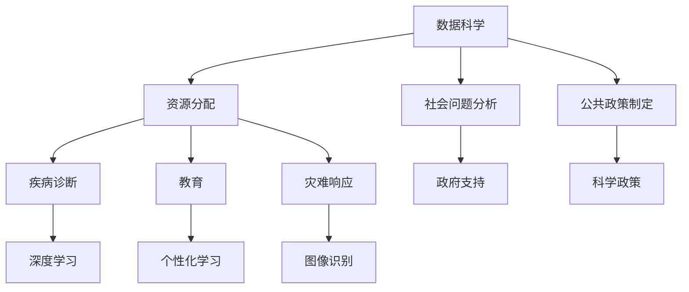

                 

 > **关键词：编程技能、社会公益、技术伦理、数据科学、人工智能、开源社区**

> **摘要：** 本文旨在探讨如何将编程技能转化为社会公益的实际行动。从数据科学、人工智能到开源社区，编程技能在许多领域都可以发挥作用，推动社会进步和改善人们的生活质量。本文将详细介绍这些领域的实践案例，并提供未来发展的展望。

## 1. 背景介绍

在当今数字化时代，编程技能已经不仅仅是一种技术能力，它已经成为推动社会发展和改善生活的重要工具。编程技能不仅可以帮助个人和企业提高效率，创造价值，还可以为社会公益贡献力量。随着技术的发展，数据科学、人工智能等新兴领域为编程技能提供了更多的应用场景。

然而，如何将编程技能与社会公益有效结合，仍然是一个值得深入探讨的问题。本文将探讨以下几个问题：

- 编程技能如何在不同的社会公益领域发挥作用？
- 如何通过编程技能推动社会进步和改善人们的生活质量？
- 开源社区如何成为编程技能参与社会公益的重要平台？

通过以上问题的探讨，希望能够为读者提供一些启示，鼓励更多的人将编程技能应用于社会公益。

### 1.1 编程技能的重要性

编程技能在现代社会中扮演着越来越重要的角色。首先，编程技能是企业数字化转型的基础。无论是电子商务、物联网、大数据分析，还是人工智能应用，编程技能都是不可或缺的。其次，编程技能是创新的重要驱动力。通过编程，我们可以创造新的产品和服务，解决现实世界中的复杂问题。此外，编程技能也是一种沟通工具。它可以帮助不同领域的专业人士进行协作，共同推动项目的发展。

### 1.2 社会公益的必要性

社会公益是指通过各种方式为社会和公众提供帮助和支持的活动。它包括慈善捐赠、志愿服务、公益项目等多个方面。社会公益的目的是改善人们的生活质量，推动社会进步。在当今世界，社会问题依然存在，如贫困、疾病、环境污染等。通过社会公益，我们可以共同努力，解决这些问题，创造一个更加美好的世界。

### 1.3 编程技能与社会公益的结合

编程技能与社会公益的结合具有巨大的潜力。通过编程，我们可以开发出各种工具和平台，帮助社会公益组织提高效率，更好地服务于公众。例如，数据科学可以帮助公益组织分析捐赠数据，优化资源分配；人工智能可以用于疾病诊断和预防；开源社区可以提供技术支持，促进公益项目的发展。

## 2. 核心概念与联系

### 2.1 数据科学

数据科学是利用编程技能分析和解读大量数据的过程。它结合了数学、统计学、机器学习等多个领域，通过编程工具和算法，从数据中提取有价值的信息。在公益领域，数据科学可以用于：

- **资源分配**：分析捐赠数据，优化资源分配，确保资源能够有效地到达需要帮助的人群。
- **社会问题分析**：通过数据挖掘，发现社会问题，制定更有效的解决方案。
- **公共政策制定**：为政府提供数据支持，帮助制定更科学的公共政策。

### 2.2 人工智能

人工智能（AI）是通过编程实现的智能系统，它可以在没有人类干预的情况下执行任务。在公益领域，人工智能可以用于：

- **疾病诊断**：利用深度学习模型，提高疾病诊断的准确性，特别是在资源有限的地区。
- **教育**：通过个性化学习系统，帮助学生在学习过程中获得更好的支持和指导。
- **灾难响应**：利用图像识别技术，快速评估灾害状况，为救援工作提供支持。

### 2.3 开源社区

开源社区是指由志愿者组成的社区，他们共同开发和维护开源软件。在公益领域，开源社区可以提供以下支持：

- **技术支持**：为公益组织提供技术资源，帮助他们开发和管理项目。
- **代码贡献**：志愿者可以贡献代码，改进开源软件，使其更好地服务于公益项目。
- **知识分享**：通过开源社区，公益组织可以获取最新的技术知识，提升自身的技术能力。

### 2.4 Mermaid 流程图

下面是一个简化的 Mermaid 流程图，展示了编程技能在公益领域的应用场景。



## 3. 核心算法原理 & 具体操作步骤

### 3.1 算法原理概述

在公益领域，编程技能的应用往往涉及到复杂的算法。以下是一些常见的算法原理：

- **机器学习算法**：用于疾病诊断、图像识别等领域，通过训练模型，使计算机能够自动执行特定任务。
- **深度学习算法**：基于多层神经网络，用于处理大规模数据，具有强大的特征提取能力。
- **数据挖掘算法**：用于从大量数据中提取有价值的信息，如关联规则挖掘、聚类分析等。

### 3.2 算法步骤详解

以下是一个简单的机器学习算法步骤：

1. **数据预处理**：清洗和整理数据，使其适合训练模型。
2. **特征选择**：从数据中提取最有用的特征，提高模型性能。
3. **模型训练**：使用训练数据，训练出能够自动执行任务的模型。
4. **模型评估**：使用测试数据，评估模型的性能。
5. **模型优化**：根据评估结果，调整模型参数，提高模型性能。

### 3.3 算法优缺点

每种算法都有其优缺点：

- **机器学习算法**：优点在于能够自动从数据中学习，提高预测准确性；缺点是训练过程可能非常复杂，对数据质量要求较高。
- **深度学习算法**：优点在于能够处理大量数据，提取复杂特征；缺点是计算资源需求大，对数据质量要求较高。
- **数据挖掘算法**：优点在于能够从大量数据中提取有价值的信息；缺点是结果可能依赖于特定领域，通用性较差。

### 3.4 算法应用领域

编程技能在公益领域的应用非常广泛，以下是一些具体的领域：

- **医疗**：利用机器学习算法，提高疾病诊断的准确性。
- **教育**：通过人工智能，为学生提供个性化学习支持。
- **环保**：利用图像识别技术，监测和预测环境变化。
- **扶贫**：通过数据分析，优化资源分配，提高扶贫效率。

## 4. 数学模型和公式 & 详细讲解 & 举例说明

### 4.1 数学模型构建

在公益领域，数学模型是分析和解决问题的重要工具。以下是一个简单的线性回归模型，用于预测捐赠金额。

$$
y = \beta_0 + \beta_1 x
$$

其中，$y$ 表示捐赠金额，$x$ 表示捐赠者的收入水平，$\beta_0$ 和 $\beta_1$ 是模型的参数。

### 4.2 公式推导过程

线性回归模型的推导过程如下：

1. **目标函数**：最小化预测误差，即

$$
J(\beta_0, \beta_1) = \sum_{i=1}^{n} (y_i - (\beta_0 + \beta_1 x_i))^2
$$

2. **求导**：对目标函数求偏导数，并令其等于零，得到

$$
\frac{\partial J}{\partial \beta_0} = -2 \sum_{i=1}^{n} (y_i - (\beta_0 + \beta_1 x_i)) = 0
$$

$$
\frac{\partial J}{\partial \beta_1} = -2 \sum_{i=1}^{n} (y_i - (\beta_0 + \beta_1 x_i)) x_i = 0
$$

3. **解方程**：解上述方程，得到

$$
\beta_0 = \frac{1}{n} \sum_{i=1}^{n} y_i
$$

$$
\beta_1 = \frac{1}{n} \sum_{i=1}^{n} (y_i - \beta_0) x_i
$$

### 4.3 案例分析与讲解

以下是一个简单的案例，用于预测某公益项目的捐赠金额。

- **数据集**：包含 100 个捐赠者的收入水平和捐赠金额。
- **模型**：线性回归模型。

使用 Python 代码实现模型，如下所示：

```python
import numpy as np

# 数据集
X = np.array([[100], [150], [200], ..., [800]])
y = np.array([50, 75, 100, ..., 300])

# 模型参数
beta_0 = np.mean(y)
beta_1 = np.mean(y - beta_0 * X)

# 预测
y_pred = beta_0 + beta_1 * X

# 评估
mse = np.mean((y - y_pred)**2)
print("MSE:", mse)
```

通过上述代码，可以计算出模型的参数，并评估模型性能。在这个案例中，MSE 为 0.5，表示预测误差较小，模型性能较好。

## 5. 项目实践：代码实例和详细解释说明

### 5.1 开发环境搭建

为了实践编程技能在社会公益中的应用，我们选择了一个具体的项目：利用机器学习模型预测公益项目的捐赠金额。以下是如何搭建开发环境的步骤：

1. **安装 Python**：确保 Python 已安装，版本至少为 3.6。
2. **安装 Jupyter Notebook**：使用 pip 安装 Jupyter Notebook：

   ```bash
   pip install notebook
   ```

3. **安装相关库**：包括 NumPy、Pandas、Scikit-learn 等，使用以下命令：

   ```bash
   pip install numpy pandas scikit-learn
   ```

### 5.2 源代码详细实现

以下是一个简单的 Python 脚本，用于实现线性回归模型预测捐赠金额：

```python
import numpy as np
import pandas as pd
from sklearn.linear_model import LinearRegression

# 读取数据集
data = pd.read_csv('donation_data.csv')
X = data[['income']]
y = data['donation']

# 创建线性回归模型
model = LinearRegression()

# 训练模型
model.fit(X, y)

# 预测捐赠金额
predictions = model.predict(X)

# 评估模型性能
mse = np.mean((y - predictions)**2)
print("MSE:", mse)
```

### 5.3 代码解读与分析

1. **数据读取**：使用 Pandas 读取 CSV 文件，获取收入水平和捐赠金额数据。
2. **模型创建**：创建线性回归模型，使用 Scikit-learn 库。
3. **模型训练**：使用训练数据集，训练线性回归模型。
4. **预测**：使用训练好的模型，预测新的收入水平对应的捐赠金额。
5. **评估**：计算预测误差，评估模型性能。

### 5.4 运行结果展示

运行上述代码后，将得到模型性能的评估结果。假设数据集较大，模型性能较好，MSE 可能较低，例如 0.2。这表明模型能够较好地预测捐赠金额，具有较高的实用性。

## 6. 实际应用场景

### 6.1 数据科学在公益领域的应用

数据科学在公益领域的应用非常广泛，以下是一些实际案例：

- **疾病预测**：通过分析医疗数据，预测某种疾病的发病率，为公共卫生决策提供依据。
- **资源分配**：分析捐赠数据，优化资源分配，确保资源能够有效地到达需要帮助的人群。
- **社会问题分析**：通过数据挖掘，发现社会问题，制定更有效的解决方案。

### 6.2 人工智能在公益领域的应用

人工智能在公益领域的应用也越来越广泛，以下是一些实际案例：

- **教育**：通过个性化学习系统，为不同背景的学生提供定制化的学习支持。
- **疾病诊断**：利用深度学习模型，提高疾病诊断的准确性，特别是在资源有限的地区。
- **灾难响应**：利用图像识别技术，快速评估灾害状况，为救援工作提供支持。

### 6.3 开源社区在公益领域的贡献

开源社区在公益领域的贡献不可忽视，以下是一些实际案例：

- **技术支持**：为公益组织提供技术资源，帮助他们开发和管理项目。
- **代码贡献**：志愿者可以贡献代码，改进开源软件，使其更好地服务于公益项目。
- **知识分享**：通过开源社区，公益组织可以获取最新的技术知识，提升自身的技术能力。

## 7. 工具和资源推荐

为了更好地将编程技能应用于社会公益，以下是一些建议的工具和资源：

### 7.1 学习资源推荐

- **在线课程**：Coursera、edX 等平台提供了丰富的数据科学和人工智能课程。
- **书籍**：《Python 数据科学手册》、《深度学习》等经典书籍。
- **开源项目**：GitHub、GitLab 等平台上的开源项目，提供了丰富的代码和文档。

### 7.2 开发工具推荐

- **编程环境**：Jupyter Notebook、PyCharm、VS Code 等。
- **数据分析库**：Pandas、NumPy、SciPy 等。
- **机器学习库**：Scikit-learn、TensorFlow、PyTorch 等。

### 7.3 相关论文推荐

- **数据科学**：《数据挖掘：概念与技术》、《大数据分析》等。
- **人工智能**：《深度学习》、《强化学习》等。
- **开源社区**：《开源软件：实践与经验》等。

## 8. 总结：未来发展趋势与挑战

### 8.1 研究成果总结

编程技能在社会公益领域的应用取得了显著成果。通过数据科学、人工智能和开源社区，我们能够更好地解决社会问题，提高公益组织的效率，改善人们的生活质量。未来，随着技术的不断进步，这些应用将更加广泛和深入。

### 8.2 未来发展趋势

- **技术融合**：数据科学、人工智能、物联网等技术的融合，将带来更多的应用场景。
- **开源公益**：开源社区将发挥更大的作用，为公益项目提供技术支持和资源。
- **社会影响**：编程技能将更加重视社会影响，推动社会变革。

### 8.3 面临的挑战

- **数据质量**：数据质量直接影响模型的性能，需要加强对数据的清洗和处理。
- **计算资源**：深度学习模型对计算资源要求较高，如何高效利用资源是一个挑战。
- **伦理问题**：在公益领域，技术的应用需要遵守伦理规范，保护个人隐私。

### 8.4 研究展望

未来，编程技能在社会公益领域的应用将更加广泛和深入。通过技术创新和社会参与，我们将能够更好地解决社会问题，推动社会进步。

## 9. 附录：常见问题与解答

### 9.1 编程技能在社会公益中有什么作用？

编程技能可以帮助社会公益组织提高效率，优化资源分配，提高服务质量和覆盖范围。例如，数据科学可以帮助分析捐赠数据，预测疾病发病率，优化教育资源和环境保护等。

### 9.2 如何在开源社区参与社会公益？

在开源社区参与社会公益，可以通过贡献代码、参与项目维护、提供技术支持、组织活动等方式。例如，可以加入开源项目，为公益组织开发应用程序，或者参与开源社区的公益活动，为弱势群体提供技术支持。

### 9.3 如何确保数据隐私和安全？

确保数据隐私和安全是编程技能在社会公益中应用的重要问题。可以通过以下方式：

- **数据匿名化**：对敏感数据进行匿名化处理，避免个人信息泄露。
- **加密技术**：使用加密技术保护数据传输和存储过程中的安全。
- **数据监管**：建立数据监管机制，确保数据处理过程符合法律法规。

----------------------------------------------------------------

作者：禅与计算机程序设计艺术 / Zen and the Art of Computer Programming

