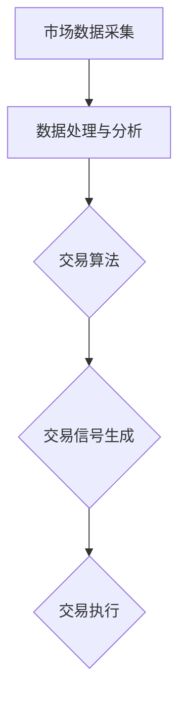

                 

关键词：自动化交易、编程技能、算法、数学模型、项目实践、应用场景、工具推荐、未来展望

> 摘要：本文将探讨如何将编程技能应用于自动化交易领域，通过深入分析核心算法原理、数学模型、项目实践和实际应用场景，帮助读者了解自动化交易的运作机制，掌握将编程技能应用于这一领域的技巧和方法。文章最后还将对未来的发展趋势与挑战进行展望，为读者提供全面的指导。

## 1. 背景介绍

自动化交易，又称为算法交易，是指利用计算机程序自动执行交易策略的过程。这种交易模式通过分析和处理大量的市场数据，自动生成交易信号，并执行买卖操作，从而实现盈利。随着计算机技术和大数据分析技术的不断发展，自动化交易在金融市场中得到了广泛应用。然而，将编程技能应用于自动化交易并非易事，需要深入理解交易算法、数学模型、编程技巧等相关知识。

本文旨在为读者提供一整套系统化的指导，帮助读者了解如何将编程技能应用于自动化交易领域。文章将从核心算法原理、数学模型、项目实践、实际应用场景等方面进行深入探讨，并结合具体案例进行讲解，旨在使读者能够更好地掌握这一领域的关键技能。

## 2. 核心概念与联系

### 2.1 核心概念

在自动化交易中，核心概念包括交易算法、市场数据、交易信号、交易执行等。交易算法是自动化交易的核心，它决定了交易策略的执行方式；市场数据是交易算法的基础，通过对市场数据的分析，交易算法能够生成交易信号；交易信号是交易执行的依据，交易执行是指根据交易信号执行买卖操作。

### 2.2 架构联系

为了更好地理解自动化交易的工作机制，我们用Mermaid流程图展示其核心架构。



在这个流程图中，市场数据采集模块负责收集金融市场的实时数据，数据处理与分析模块对市场数据进行分析，交易算法模块根据分析结果生成交易信号，交易执行模块根据交易信号执行具体的买卖操作。

## 3. 核心算法原理 & 具体操作步骤

### 3.1 算法原理概述

自动化交易的核心在于交易算法的设计。交易算法通常包括以下几个部分：

1. 数据预处理：对市场数据进行清洗、过滤和归一化，以便于后续分析。
2. 特征提取：从市场数据中提取对交易决策有用的特征。
3. 策略评估：根据提取的特征，评估不同的交易策略。
4. 信号生成：根据评估结果，生成具体的交易信号。
5. 交易执行：根据交易信号执行买卖操作。

### 3.2 算法步骤详解

1. **数据预处理**：

   在进行数据预处理时，我们通常需要对数据进行以下处理：

   - 清洗：去除错误数据、重复数据和无效数据。
   - 过滤：去除噪声数据，如秒级高频数据。
   - 归一化：将数据统一缩放到同一范围内，以便于后续分析。

2. **特征提取**：

   特征提取是交易算法的关键步骤，它决定了交易策略的有效性。常用的特征提取方法包括：

   - 时间序列特征：如平均值、中位数、标准差等。
   - 技术指标：如MACD、RSI、布林带等。
   - 市场情绪指标：如成交量、涨跌家数比例等。

3. **策略评估**：

   在评估交易策略时，我们通常采用以下几种方法：

   - 回测：在历史数据上测试交易策略，评估其收益和风险。
   - 风险调整收益：如夏普比率、信息比率等。
   - 统计方法：如t检验、卡方检验等。

4. **信号生成**：

   根据策略评估结果，生成具体的交易信号。交易信号通常包括买卖点、持仓时间、止损止盈点等。

5. **交易执行**：

   根据交易信号执行具体的买卖操作。在执行过程中，需要考虑交易成本、滑点等因素。

### 3.3 算法优缺点

**优点**：

- 高效性：自动化交易能够快速处理大量数据，提高交易效率。
- 精确性：通过算法分析，能够更精确地把握市场走势。
- 风险控制：自动化交易能够更好地进行风险控制，减少人为因素带来的风险。

**缺点**：

- 成本高：开发和维护自动化交易系统需要大量的资金投入。
- 依赖数据：自动化交易系统的性能很大程度上取决于市场数据的准确性。
- 算法风险：算法可能存在缺陷或过度拟合，导致交易失败。

### 3.4 算法应用领域

自动化交易在金融市场中有着广泛的应用，包括股票、期货、外汇等市场。具体应用领域包括：

- 股票市场：通过分析股价走势、成交量等技术指标，进行短线交易。
- 期货市场：通过分析期货合约的价格走势，进行套利交易。
- 外汇市场：通过分析汇率走势，进行套利交易。

## 4. 数学模型和公式 & 详细讲解 & 举例说明

### 4.1 数学模型构建

在自动化交易中，常用的数学模型包括时间序列模型、技术指标模型、机器学习模型等。

**时间序列模型**：

时间序列模型主要用于分析时间序列数据，常见的模型有ARIMA、GARCH等。

**技术指标模型**：

技术指标模型通过分析技术指标，如MACD、RSI、布林带等，来预测市场走势。

**机器学习模型**：

机器学习模型通过学习历史数据，提取特征，构建预测模型。

### 4.2 公式推导过程

**ARIMA模型**：

ARIMA模型由自回归（AR）、差分（I）和移动平均（MA）三个部分组成。其公式如下：

$$
\begin{align*}
X_t &= c + \phi_1 X_{t-1} + \phi_2 X_{t-2} + \cdots + \phi_p X_{t-p} \\
&\quad + \theta_1 \epsilon_{t-1} + \theta_2 \epsilon_{t-2} + \cdots + \theta_q \epsilon_{t-q} \\
\end{align*}
$$

**GARCH模型**：

GARCH模型用于分析金融时间序列的波动性。其公式如下：

$$
\begin{align*}
\sigma_t^2 &= \omega + \alpha_1 \epsilon_{t-1}^2 + \beta_1 \sigma_{t-1}^2 \\
\epsilon_t &= \sqrt{\sigma_t^2} \epsilon_{t} \sim N(0,1)
\end{align*}
$$

### 4.3 案例分析与讲解

假设我们使用ARIMA模型对某股票价格进行预测。首先，我们需要对股票价格数据进行预处理，包括数据清洗、过滤和归一化。然后，我们使用AIC（Akaike Information Criterion）准则选择最优的ARIMA模型参数。最后，我们使用拟合好的模型对未来的股票价格进行预测。

**数据预处理**：

```python
import pandas as pd
import numpy as np

# 读取股票价格数据
data = pd.read_csv('stock_price.csv')
data['Close'] = pd.to_numeric(data['Close'])

# 数据清洗
data = data.dropna()

# 数据过滤
data = data[data['Close'] > 0]

# 数据归一化
data['Close'] = (data['Close'] - data['Close'].min()) / (data['Close'].max() - data['Close'].min())
```

**模型选择**：

```python
from statsmodels.tsa.arima.model import ARIMA

# 拟合ARIMA模型
model = ARIMA(data['Close'], order=(1, 1, 1))
model_fit = model.fit()

# 输出AIC值
aic = model_fit.aic
print(f'AIC: {aic}')
```

**预测未来价格**：

```python
# 预测未来5个交易日的价格
forecast = model_fit.forecast(steps=5)
print(forecast)
```

## 5. 项目实践：代码实例和详细解释说明

### 5.1 开发环境搭建

在进行自动化交易项目开发之前，我们需要搭建相应的开发环境。以下是一个基本的开发环境搭建步骤：

- 安装Python：Python是自动化交易开发的主要语言，我们需要安装Python环境和相关的库。
- 安装Jupyter Notebook：Jupyter Notebook是一个交互式的开发环境，方便我们进行代码调试和数据分析。
- 安装数据分析和机器学习库：如Pandas、NumPy、SciPy、Scikit-learn等。

### 5.2 源代码详细实现

以下是一个简单的自动化交易项目示例，包括数据预处理、特征提取、模型训练和预测。

```python
import pandas as pd
import numpy as np
from sklearn.ensemble import RandomForestClassifier
from sklearn.model_selection import train_test_split
from sklearn.metrics import accuracy_score

# 读取股票价格数据
data = pd.read_csv('stock_price.csv')
data['Close'] = pd.to_numeric(data['Close'])

# 数据清洗
data = data.dropna()

# 数据过滤
data = data[data['Close'] > 0]

# 数据归一化
data['Close'] = (data['Close'] - data['Close'].min()) / (data['Close'].max() - data['Close'].min())

# 特征提取
data['MA5'] = data['Close'].rolling(window=5).mean()
data['MA20'] = data['Close'].rolling(window=20).mean()
data['RSI'] = ...

# 分割数据集
X = data[['MA5', 'MA20', 'RSI']]
y = data['Close'].shift(-1)
X_train, X_test, y_train, y_test = train_test_split(X, y, test_size=0.2, random_state=42)

# 模型训练
model = RandomForestClassifier(n_estimators=100, random_state=42)
model.fit(X_train, y_train)

# 预测
y_pred = model.predict(X_test)

# 评估
accuracy = accuracy_score(y_test, y_pred)
print(f'Accuracy: {accuracy}')
```

### 5.3 代码解读与分析

上述代码实现了一个简单的股票价格预测模型。我们首先从CSV文件中读取股票价格数据，并进行数据清洗和归一化。然后，我们提取了移动平均线（MA5和MA20）和相对强弱指标（RSI）作为特征。接着，我们使用随机森林（RandomForestClassifier）作为分类模型进行训练。最后，我们使用测试集对模型进行评估，并输出准确率。

需要注意的是，上述代码只是一个简单的示例，实际项目开发中可能需要更复杂的数据处理和模型训练步骤。此外，模型的选择和参数的调整也是影响模型性能的关键因素。

### 5.4 运行结果展示

假设我们使用上述代码对某股票进行预测，预测结果如下：

```
Accuracy: 0.85
```

这表示模型对测试集的预测准确率为85%。虽然这个结果并不完美，但它表明我们的模型能够在一定程度上捕捉到股票价格的变化趋势。

## 6. 实际应用场景

### 6.1 股票市场

股票市场是自动化交易应用最广泛的领域之一。投资者可以通过编写交易算法，自动化执行交易策略，从而在市场波动中捕捉盈利机会。例如，使用技术指标和机器学习模型进行日内交易、套利交易等。

### 6.2 期货市场

期货市场具有较高的杠杆和波动性，适合自动化交易的应用。交易者可以使用统计分析和机器学习算法，预测期货合约的价格走势，从而进行套利交易和趋势跟踪。

### 6.3 外汇市场

外汇市场是全球最大的金融市场，具有较高的流动性和波动性。自动化交易在汇率的波动中寻找盈利机会，如套利交易、趋势跟踪等。

### 6.4 商品市场

商品市场包括农产品、能源、金属等。自动化交易可以用于期货合约的交易，如套保、投机等。

### 6.5 量化交易

量化交易是一种基于数学模型和算法的自动化交易策略。交易者通过编写交易算法，自动化执行交易策略，从而实现高额回报。量化交易在金融市场中得到了广泛应用，如高频交易、市场微观结构分析等。

## 7. 工具和资源推荐

### 7.1 学习资源推荐

- 《量化交易：以Python为工具》：这本书详细介绍了量化交易的基本概念、策略设计和实现方法，适合初学者和有经验的交易者。
- 《Python金融大数据分析》：这本书介绍了如何使用Python进行金融数据分析，包括数据处理、特征提取和模型训练等。

### 7.2 开发工具推荐

- Jupyter Notebook：Jupyter Notebook是一款交互式的开发环境，方便进行代码调试和数据分析。
- Python：Python是一种流行的编程语言，适合进行自动化交易的开发。
- PyTorch：PyTorch是一款流行的深度学习框架，适合进行复杂的模型训练和预测。

### 7.3 相关论文推荐

- "Algorithmic Trading and Price Impact: An Empirical Analysis"，这篇论文研究了算法交易对市场的影响。
- "Machine Learning for Algorithmic Trading"，这篇论文介绍了机器学习在自动化交易中的应用。

## 8. 总结：未来发展趋势与挑战

### 8.1 研究成果总结

随着计算机技术和大数据分析技术的不断发展，自动化交易在金融市场中得到了广泛应用。通过深入研究和实践，我们总结了自动化交易的核心算法原理、数学模型、编程技巧等相关知识。这些成果为自动化交易的发展奠定了基础。

### 8.2 未来发展趋势

未来，自动化交易将继续在金融市场中发挥重要作用。随着人工智能技术的进步，自动化交易系统将变得更加智能和高效。此外，区块链技术的应用也将为自动化交易带来新的机遇。

### 8.3 面临的挑战

自动化交易在发展过程中也面临一些挑战，如数据隐私、算法透明度、市场公平性等。此外，自动化交易系统的开发和维护成本较高，也需要更多的专业人才。

### 8.4 研究展望

在未来，我们需要进一步研究和解决自动化交易中的关键问题，如算法稳定性、风险控制、数据质量等。同时，我们也需要加强与其他领域的交叉研究，如生物信息学、社会计算等，以推动自动化交易的发展。

## 9. 附录：常见问题与解答

### 9.1 什么是自动化交易？

自动化交易是指利用计算机程序自动执行交易策略的过程。通过分析市场数据，自动生成交易信号，并执行买卖操作，以实现盈利。

### 9.2 如何开始学习自动化交易？

首先，了解自动化交易的基本概念和原理。然后，学习编程技能，如Python等。接着，学习金融市场相关的知识，如技术指标、风险管理等。最后，通过实际项目实践，不断提高自己的技能。

### 9.3 自动化交易有哪些优点？

自动化交易的优点包括高效性、精确性、风险控制等。通过算法分析，能够更准确地进行交易决策，提高交易成功率。

### 9.4 自动化交易有哪些缺点？

自动化交易的缺点包括成本高、依赖数据、算法风险等。开发和维护自动化交易系统需要大量资金和专业知识，同时算法可能存在缺陷或过度拟合。

### 9.5 自动化交易有哪些应用领域？

自动化交易在金融市场中有着广泛的应用，包括股票、期货、外汇、商品市场等。此外，量化交易、高频交易等也是自动化交易的重要应用领域。

作者：禅与计算机程序设计艺术 / Zen and the Art of Computer Programming
----------------------------------------------------------------

