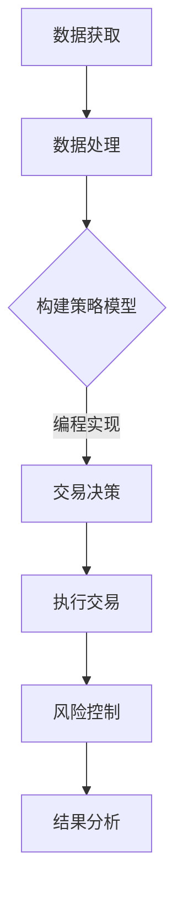

                 

关键词：编程技能、量化交易、算法交易、金融科技、数学模型、代码实例、应用场景、未来展望

> 摘要：本文将探讨如何利用编程技能在量化交易领域中进行实践。通过分析核心概念、算法原理、数学模型以及具体项目实践，本文旨在为读者提供全面、实用的量化交易编程指导。

## 1. 背景介绍

量化交易，又称算法交易，是利用计算机程序自动执行交易策略的一种金融交易方式。随着金融科技的发展，量化交易逐渐成为现代金融市场中不可或缺的一部分。编程技能在量化交易中的应用至关重要，它不仅能够提高交易决策的效率和准确性，还能够应对金融市场中的复杂性和不确定性。

本文将介绍如何将编程技能应用于量化交易，包括核心概念的理解、算法原理的分析、数学模型的构建以及具体项目实践的展示。通过这些内容，读者将能够掌握量化交易的基本原理，并具备编写、调试和优化交易策略的能力。

## 2. 核心概念与联系

### 2.1 量化交易的定义

量化交易是一种基于数学模型和统计分析的交易方法，通过构建交易策略模型，利用计算机程序自动执行交易决策。与传统的手动交易相比，量化交易具有更高的效率、更低的风险和更高的收益潜力。

### 2.2 编程技能的重要性

在量化交易中，编程技能是至关重要的。它不仅涉及到交易策略的构建和实现，还包括数据处理、风险管理和系统优化等方面。熟练掌握编程技能的程序员能够在量化交易中发挥重要作用，提高交易决策的准确性和效率。

### 2.3 量化交易与编程的关联

量化交易与编程的关联体现在以下几个方面：

1. **数据获取和处理**：量化交易需要对大量市场数据进行实时获取和处理，编程技能可以帮助实现数据的清洗、存储和可视化。
2. **交易策略的实现**：编程技能是实现交易策略的关键，通过编写高效的算法，可以自动化交易决策过程。
3. **风险管理和优化**：编程技能有助于构建风险管理模型和优化策略，提高交易决策的效率和准确性。

### 2.4 Mermaid 流程图

以下是一个简化的量化交易流程图，展示了编程技能在不同阶段的应用。



## 3. 核心算法原理 & 具体操作步骤

### 3.1 算法原理概述

量化交易的核心在于构建和实现有效的交易策略。交易策略通常基于统计学和概率论，通过对历史数据进行分析，发现市场趋势和规律，从而预测未来价格走势。

### 3.2 算法步骤详解

1. **数据获取**：首先，需要获取相关的市场数据，包括价格、成交量、波动率等。
2. **数据处理**：对获取的数据进行清洗、预处理，以便后续分析。
3. **特征工程**：根据市场数据，提取有用的特征，如移动平均、相对强弱指标等。
4. **构建模型**：利用统计学方法，如线性回归、决策树、支持向量机等，构建交易策略模型。
5. **模型评估**：通过回测（Backtesting）方法，评估模型的有效性。
6. **参数优化**：根据回测结果，调整模型参数，优化交易策略。
7. **实现交易**：将优化后的模型转化为计算机程序，实现自动化交易。
8. **风险控制**：设定风险控制参数，如止损、止盈等，确保交易风险可控。
9. **结果分析**：对交易结果进行统计分析，调整和优化策略。

### 3.3 算法优缺点

**优点**：
- 提高交易效率和准确性。
- 能够应对市场复杂性和不确定性。
- 能够实现高频交易和跨市场交易。

**缺点**：
- 需要大量的历史数据和计算资源。
- 模型可能过拟合，影响交易效果。
- 需要专业知识和经验，开发和维护成本较高。

### 3.4 算法应用领域

量化交易算法广泛应用于股票、期货、外汇等金融市场。此外，随着区块链技术的发展，量化交易也在加密货币市场中崭露头角。

## 4. 数学模型和公式 & 详细讲解 & 举例说明

### 4.1 数学模型构建

量化交易中的数学模型通常基于统计学和概率论。以下是一个简单的线性回归模型示例：

$$
y = \beta_0 + \beta_1 x_1 + \epsilon
$$

其中，$y$ 表示价格，$x_1$ 表示某个技术指标，$\beta_0$ 和 $\beta_1$ 分别为模型的参数，$\epsilon$ 为随机误差。

### 4.2 公式推导过程

线性回归模型的推导过程如下：

1. **设定目标函数**：最小化误差平方和

$$
J(\theta) = \frac{1}{2m} \sum_{i=1}^{m} (h_\theta(x^{(i)}) - y^{(i)})^2
$$

2. **求导并设置导数为零**：

$$
\frac{\partial J(\theta)}{\partial \theta_1} = \frac{1}{m} \sum_{i=1}^{m} (h_\theta(x^{(i)}) - y^{(i)}) x^{(i)} = 0
$$

$$
\frac{\partial J(\theta)}{\partial \theta_2} = \frac{1}{m} \sum_{i=1}^{m} (h_\theta(x^{(i)}) - y^{(i)}) = 0
$$

3. **求解参数**：

$$
\theta_1 = \frac{1}{m} \sum_{i=1}^{m} (x^{(i)} h_\theta(x^{(i)}) - y^{(i)}) x^{(i)}
$$

$$
\theta_2 = \frac{1}{m} \sum_{i=1}^{m} (h_\theta(x^{(i)}) - y^{(i)}) = y - \theta_1 x
$$

### 4.3 案例分析与讲解

假设我们有一个股票价格数据集，包含开盘价、收盘价、成交量等指标。我们想要构建一个简单的线性回归模型，预测下一日的收盘价。

1. **数据预处理**：对数据进行清洗和归一化处理。
2. **特征选择**：选择合适的技术指标作为特征变量。
3. **模型训练**：使用线性回归算法训练模型。
4. **模型评估**：使用回测方法评估模型性能。
5. **参数优化**：调整模型参数，优化预测效果。

通过以上步骤，我们可以构建一个简单的量化交易策略，实现股票价格的预测和交易。

## 5. 项目实践：代码实例和详细解释说明

### 5.1 开发环境搭建

在开始编写量化交易代码之前，需要搭建合适的开发环境。以下是常用的开发工具和库：

- Python：主流的编程语言，适用于数据分析和算法实现。
- Pandas：Python 的数据操作库，用于数据清洗和处理。
- NumPy：Python 的数学库，用于数据处理和计算。
- scikit-learn：Python 的机器学习库，用于模型训练和评估。

### 5.2 源代码详细实现

以下是一个简单的量化交易策略的实现示例：

```python
import pandas as pd
import numpy as np
from sklearn.linear_model import LinearRegression

# 数据预处理
data = pd.read_csv('stock_data.csv')
data['Close'] = data['Close'].astype(float)
data['Volume'] = data['Volume'].astype(float)

# 特征选择
data['MA_5'] = data['Close'].rolling(window=5).mean()
data['RSI'] = data['Close'].rolling(window=14).apply(lambda x: (max(x) - min(x)) / (max(x) + min(x)))

# 模型训练
X = data[['MA_5', 'RSI']]
y = data['Close']

model = LinearRegression()
model.fit(X, y)

# 模型评估
predictions = model.predict(X)
mse = np.mean((predictions - y) ** 2)
print('MSE:', mse)

# 参数优化
# 根据回测结果，调整模型参数，优化预测效果。

# 实现交易
# 根据预测结果，执行买入、卖出等交易操作。

# 风险控制
# 设置止损、止盈等风险控制参数，确保交易风险可控。

# 结果分析
# 对交易结果进行统计分析，调整和优化策略。
```

### 5.3 代码解读与分析

以上代码实现了基于线性回归模型的量化交易策略。首先，我们从数据集中提取开盘价、收盘价和成交量等指标，并进行数据处理和特征选择。然后，使用线性回归算法训练模型，评估模型性能。接着，根据回测结果，调整模型参数，优化预测效果。最后，根据预测结果，实现买入、卖出等交易操作，并设置风险控制参数。

## 6. 实际应用场景

量化交易在实际应用中具有广泛的应用场景。以下是一些常见的应用场景：

1. **高频交易**：利用计算机程序在短时间内完成大量交易，实现快速盈利。
2. **跨市场交易**：同时操作多个市场，利用不同市场的波动实现收益。
3. **量化对冲**：通过构建对冲策略，降低投资组合的风险。
4. **智能投顾**：为投资者提供个性化的投资建议，实现风险和收益的优化。
5. **市场预测**：利用量化模型预测市场趋势，为投资决策提供支持。

## 7. 工具和资源推荐

### 7.1 学习资源推荐

- 《量化交易：从入门到精通》
- 《金融计量学》
- 《Python金融大数据分析》
- 《高频交易：从基础到实践》

### 7.2 开发工具推荐

- Python：适用于数据分析和算法实现。
- Pandas：数据操作和处理。
- NumPy：数学计算。
- scikit-learn：机器学习库。
- TensorFlow：深度学习框架。

### 7.3 相关论文推荐

- "High-Frequency Trading and Price Dynamics"
- "Market Microstructure in Practice"
- "Machine Learning for Financial Markets"
- "Algorithmic Trading Strategies and Performance Analysis"

## 8. 总结：未来发展趋势与挑战

### 8.1 研究成果总结

近年来，量化交易在金融科技领域取得了显著进展。通过计算机技术和数学模型的结合，量化交易在提高交易效率、降低风险和实现收益最大化方面发挥了重要作用。

### 8.2 未来发展趋势

随着金融科技的快速发展，量化交易将继续向以下几个方向发展：

- **深度学习和人工智能的融合**：利用深度学习和人工智能技术，构建更加智能的交易策略。
- **跨市场、跨品种的量化交易**：通过多市场、多品种的数据分析，实现更广泛的投资机会。
- **量化对冲和风险管理的优化**：通过量化对冲和风险管理策略，降低投资组合的风险。

### 8.3 面临的挑战

尽管量化交易具有广泛的应用前景，但也面临着一些挑战：

- **数据质量和可靠性**：高质量的数据是量化交易的基础，但数据质量和可靠性一直是困扰量化交易的一个问题。
- **算法安全和隐私保护**：量化交易算法的安全性和隐私保护需要得到有效保障。
- **模型过拟合和泛化能力**：构建有效的量化交易模型需要平衡过拟合和泛化能力。

### 8.4 研究展望

未来，量化交易的研究将继续深入，涉及领域将更加广泛。以下是一些值得关注的领域：

- **量子计算在量化交易中的应用**：量子计算具有巨大的计算潜力，有望为量化交易带来革命性的变革。
- **生物特征识别和生物特征分析**：通过生物特征识别和生物特征分析，实现更加个性化的量化交易策略。
- **区块链技术的融合**：区块链技术为量化交易提供了更加安全和透明的交易环境，有望成为量化交易的重要支撑。

## 9. 附录：常见问题与解答

### 9.1 量化交易与高频交易的区别

量化交易和高频交易都是利用计算机程序进行自动交易的方式，但两者的目标和应用场景有所不同。

- **量化交易**：以实现长期稳定的收益为目标，通过构建有效的交易策略，利用历史数据和统计方法进行交易。
- **高频交易**：以获取短期交易利润为目标，通过高频交易策略，在极短的时间内完成大量交易，以赚取微小的利润。

### 9.2 如何选择合适的量化交易策略

选择合适的量化交易策略需要考虑以下几个因素：

- **投资目标**：根据个人的投资目标和风险承受能力，选择适合的交易策略。
- **市场环境**：分析当前的市场环境和趋势，选择适合当前市场的交易策略。
- **数据质量**：高质量的数据是量化交易的基础，选择具有高质量数据的交易策略。
- **算法性能**：评估交易策略的算法性能，包括准确性、稳定性和可靠性。

### 9.3 如何进行量化交易的风险管理

量化交易的风险管理包括以下几个方面：

- **设置止损和止盈**：根据交易策略，设置合理的止损和止盈点，控制交易风险。
- **分散投资**：通过分散投资，降低单一市场或品种的风险。
- **风险管理模型**：利用风险管理模型，对投资组合进行风险评估和优化。
- **风险控制参数的调整**：根据市场变化和交易结果，及时调整风险控制参数，确保交易风险可控。

作者：禅与计算机程序设计艺术 / Zen and the Art of Computer Programming
----------------------------------------------------------------

以上就是本文的完整内容，希望对您在量化交易领域的学习和实践有所帮助。在未来的研究中，我们将继续深入探讨量化交易的技术和应用，为金融科技的发展贡献力量。如果您有任何问题或建议，欢迎在评论区留言讨论。感谢您的阅读！
 

