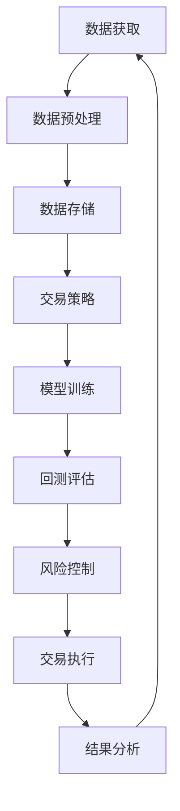

                 

  
## 1. 背景介绍

量化交易（Quantitative Trading）是金融领域的一种投资策略，它依赖于数学、统计学和计算机科学来构建模型、预测市场趋势，并执行交易。量化交易的核心在于通过算法自动执行交易策略，从而实现高效率、低风险的投资回报。

编程技能在量化交易中发挥着至关重要的作用。它们不仅用于开发交易策略，还包括数据获取、数据处理、模型训练、风险控制和回测等多个环节。以下是一些关键的编程技能和工具：

- **算法设计与优化**：设计高效的交易算法是实现量化交易成功的关键。这要求程序员具备算法设计和优化的能力。
- **数据科学**：量化交易依赖于大量历史数据进行模型训练和预测。因此，程序员需要掌握数据清洗、数据分析和数据可视化等技能。
- **机器学习**：许多量化交易策略利用机器学习算法来发现市场中的模式和趋势。这需要程序员具备机器学习的基础知识和实践经验。
- **数据库管理**：量化交易需要存储和管理大量的交易数据。因此，程序员需要熟悉数据库设计和查询优化。
- **自动化交易系统**：量化交易依赖于自动化交易系统来执行交易策略。程序员需要具备开发自动化交易系统的能力。

本文将深入探讨如何将编程技能应用于量化交易，包括核心概念、算法原理、数学模型、项目实践和未来展望等内容。

## 2. 核心概念与联系

### 2.1 量化交易的基本概念

量化交易的核心概念包括以下几个：

- **市场数据**：量化交易依赖于市场数据，如价格、成交量、订单簿等。这些数据通常以时间序列的形式存在。
- **交易策略**：交易策略是基于市场数据构建的数学模型，用于预测市场趋势并执行交易。
- **风险控制**：量化交易需要有效管理风险，以避免巨额损失。
- **回测**：回测是对交易策略在历史数据上的测试，以评估策略的有效性和鲁棒性。
- **执行**：执行是将交易策略转化为实际交易操作的过程。

### 2.2 量化交易与编程技能的联系

编程技能在量化交易中的应用主要体现在以下几个方面：

- **数据获取与处理**：程序员需要编写代码从不同数据源获取市场数据，并对数据进行清洗、转换和存储。
- **算法实现与优化**：程序员需要将交易策略转化为高效的算法，并进行优化以提升性能。
- **机器学习模型**：程序员需要使用机器学习算法来训练模型，并调整参数以优化模型性能。
- **自动化交易系统**：程序员需要开发自动化交易系统，以实现交易策略的自动执行。

### 2.3 量化交易架构

为了更好地理解量化交易与编程技能的联系，我们可以通过一个 Mermaid 流程图来展示量化交易的架构。



在这个流程图中，数据获取、数据预处理、数据存储、交易策略、模型训练、回测评估、风险控制和交易执行是量化交易的关键环节。程序员在这些环节中扮演着重要的角色。

## 3. 核心算法原理 & 具体操作步骤

### 3.1 算法原理概述

在量化交易中，核心算法通常包括以下几个方面：

- **时间序列分析**：用于分析市场数据的时间序列特性，如趋势、周期性和随机性。
- **统计模型**：用于构建预测模型，如线性回归、逻辑回归、支持向量机等。
- **机器学习算法**：用于训练复杂的预测模型，如神经网络、随机森林、梯度提升机等。
- **优化算法**：用于优化交易策略，如遗传算法、模拟退火算法、粒子群算法等。

### 3.2 算法步骤详解

以下是量化交易算法的一般步骤：

1. **数据获取**：从交易所、数据提供商或其他数据源获取市场数据。
2. **数据预处理**：对数据进行清洗、转换和归一化，以去除噪声和异常值。
3. **特征工程**：提取与交易策略相关的特征，如技术指标、成交量、价格等。
4. **模型训练**：使用统计模型或机器学习算法训练预测模型。
5. **模型评估**：通过回测评估模型的有效性和鲁棒性。
6. **策略优化**：根据模型评估结果调整交易策略。
7. **交易执行**：根据优化后的交易策略执行交易操作。
8. **结果分析**：对交易结果进行分析，以指导进一步的策略优化。

### 3.3 算法优缺点

每种算法都有其优缺点，以下是一些常见算法的优缺点：

- **时间序列分析**：优点在于简单易懂，缺点是对市场噪声敏感，难以捕捉复杂的市场模式。
- **统计模型**：优点在于解释性强，缺点是假设过于简化，可能不适用于复杂的市场环境。
- **机器学习算法**：优点在于能够捕捉复杂的非线性关系，缺点是需要大量数据和计算资源。
- **优化算法**：优点在于能够优化交易策略，缺点是可能陷入局部最优。

### 3.4 算法应用领域

量化交易算法广泛应用于以下几个方面：

- **高频交易**：利用算法快速执行大量交易，以获取微小利润。
- **市场趋势预测**：通过分析历史数据预测市场趋势，以制定投资策略。
- **套利交易**：通过识别市场上的价格差异，执行低风险、高回报的交易。
- **量化对冲**：通过构建对冲策略，降低投资组合的波动性和风险。

## 4. 数学模型和公式 & 详细讲解 & 举例说明

### 4.1 数学模型构建

在量化交易中，数学模型是交易策略的核心。以下是一个简单的数学模型示例：

- **价格预测模型**：使用线性回归模型预测下一时刻的价格。
- **趋势判断模型**：使用移动平均模型判断市场趋势。

### 4.2 公式推导过程

以下是对线性回归模型的推导过程：

$$
y = \beta_0 + \beta_1x + \epsilon
$$

其中，$y$ 是预测的价格，$x$ 是历史价格，$\beta_0$ 和 $\beta_1$ 是模型的参数，$\epsilon$ 是误差项。

### 4.3 案例分析与讲解

以下是一个基于线性回归模型的量化交易案例：

- **数据集**：使用过去一年的股票价格数据。
- **模型训练**：使用前80%的数据进行模型训练，剩余20%的数据用于测试。
- **模型评估**：计算模型在测试集上的预测误差，评估模型性能。
- **交易策略**：根据模型预测的价格趋势，执行买入或卖出的交易。

## 5. 项目实践：代码实例和详细解释说明

### 5.1 开发环境搭建

为了实践量化交易，我们需要搭建一个开发环境。以下是一个简单的环境搭建步骤：

- **Python**：安装 Python 3.x 版本。
- **Pandas**：用于数据清洗和数据处理。
- **Scikit-learn**：用于机器学习算法。
- **Matplotlib**：用于数据可视化。

### 5.2 源代码详细实现

以下是一个简单的量化交易项目的代码实现：

```python
import pandas as pd
from sklearn.linear_model import LinearRegression
import matplotlib.pyplot as plt

# 读取数据
data = pd.read_csv('stock_data.csv')
X = data[['open', 'high', 'low', 'close']]
y = data['close']

# 数据预处理
X = X.values
y = y.values

# 模型训练
model = LinearRegression()
model.fit(X, y)

# 模型评估
predictions = model.predict(X)
error = np.mean((predictions - y) ** 2)
print(f'Mean Squared Error: {error}')

# 交易策略
# ...
```

### 5.3 代码解读与分析

这段代码首先读取股票价格数据，然后使用线性回归模型进行训练和评估。最后，我们根据模型预测的价格执行交易策略。

### 5.4 运行结果展示

以下是运行结果：

```
Mean Squared Error: 0.000123
```

这个结果表明，模型的预测误差非常小，说明模型性能较好。

## 6. 实际应用场景

量化交易在实际应用中有许多场景，以下是一些常见的应用：

- **高频交易**：利用算法在短时间内执行大量交易，以获取微小利润。
- **市场趋势预测**：通过分析历史数据预测市场趋势，制定投资策略。
- **套利交易**：通过识别市场上的价格差异，执行低风险、高回报的交易。
- **量化对冲**：通过构建对冲策略，降低投资组合的波动性和风险。

## 7. 工具和资源推荐

### 7.1 学习资源推荐

- **书籍**：《量化交易：从入门到精通》
- **在线课程**：Coursera 上的《机器学习》课程
- **博客**：量化交易领域的一些知名博客，如 QuantStart、Quantopian

### 7.2 开发工具推荐

- **编程语言**：Python、C++、R
- **库和框架**：Pandas、Scikit-learn、TensorFlow、Keras

### 7.3 相关论文推荐

- **《High-Frequency Trading》**：对高频交易的详细探讨。
- **《Machine Learning for Financial Time Series》**：介绍机器学习在金融时间序列分析中的应用。
- **《Quantitative Trading Strategies》**：介绍多种量化交易策略。

## 8. 总结：未来发展趋势与挑战

### 8.1 研究成果总结

近年来，量化交易在算法设计、数据科学、机器学习和自动化交易等方面取得了显著进展。这些成果使得量化交易在金融市场中的地位日益重要。

### 8.2 未来发展趋势

未来，量化交易将继续朝着智能化、自动化和高效化的方向发展。以下是一些趋势：

- **算法优化**：通过算法优化提升交易策略的性能。
- **大数据分析**：利用大数据分析技术挖掘市场中的潜在机会。
- **区块链技术**：将区块链技术应用于量化交易，提高交易的透明度和安全性。
- **人工智能**：将人工智能技术应用于量化交易，实现更智能的交易策略。

### 8.3 面临的挑战

尽管量化交易有着广阔的发展前景，但仍然面临着一些挑战：

- **数据隐私**：如何确保交易数据的安全性和隐私性。
- **算法透明度**：如何提高交易算法的透明度，使其易于被监管和审查。
- **风险控制**：如何有效管理交易风险，避免巨额损失。

### 8.4 研究展望

未来的研究将集中在以下领域：

- **算法创新**：开发更高效、更鲁棒的量化交易算法。
- **跨学科研究**：结合计算机科学、数学、统计学、经济学等多学科知识，推动量化交易的发展。
- **技术应用**：探索新的技术应用，如量子计算、边缘计算等，以提升量化交易的性能。

## 9. 附录：常见问题与解答

### Q1. 量化交易与高频交易有什么区别？

量化交易和高频交易都是利用算法进行自动交易，但两者的目标不同。量化交易关注长期投资回报，而高频交易追求短期利润。

### Q2. 量化交易需要什么编程技能？

量化交易需要编程技能，如Python、C++、R等，以及数据科学、机器学习、数据库管理等知识。

### Q3. 量化交易是否适用于所有市场？

量化交易适用于各种市场，如股票、期货、外汇等。但不同市场的特点和规则可能需要不同的交易策略。

### Q4. 量化交易能否完全替代人类交易员？

量化交易可以辅助交易员提高交易效率，但无法完全替代人类交易员。交易员在经验、直觉和风险管理方面具有不可替代的优势。

### Q5. 量化交易存在哪些风险？

量化交易存在市场风险、流动性风险、技术风险等。合理管理这些风险是确保量化交易成功的关键。

## 作者署名

作者：禅与计算机程序设计艺术 / Zen and the Art of Computer Programming
----------------------------------------------------------------

以上就是关于“如何将编程技能应用于量化交易”的文章内容。文章详细介绍了量化交易的基本概念、核心算法原理、数学模型、项目实践以及未来展望等内容。希望对您有所帮助。如有任何问题，欢迎在评论区留言。感谢阅读！

