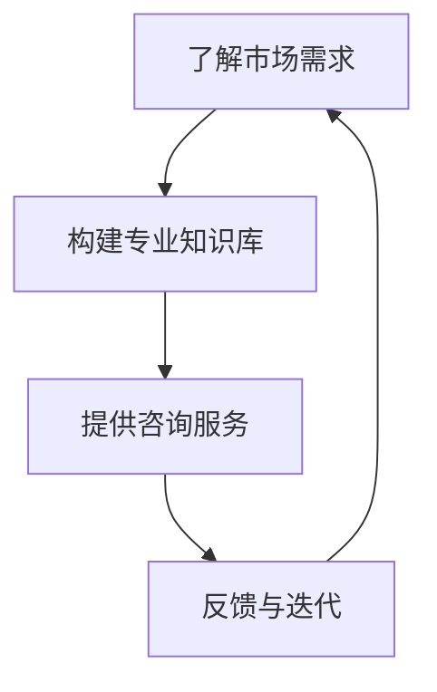

                 

在IT行业中，编程技能是一项核心能力，但如何将其转化为有价值的咨询服务，使其不仅满足个人的职业发展，还能为他人提供帮助和解决方案，是一个值得深入探讨的话题。本文将详细探讨这一转变过程，包括背景介绍、核心概念、算法原理、数学模型、项目实践、实际应用、工具推荐以及未来展望等多个方面。

## 关键词

- 编程技能
- 咨询服务
- 转化策略
- 技术应用
- 项目实践

## 摘要

本文旨在探讨如何将个人的编程技能转化为有价值的咨询服务。通过分析IT行业的现状和市场需求，我们提出了将编程技能应用于咨询服务的多种策略。本文首先介绍了编程技能转化为咨询服务的重要性，然后详细阐述了核心概念和算法原理，并通过具体的项目实践和数学模型的应用，提供了详细的操作步骤和案例分析。最后，本文探讨了咨询服务在各个行业中的应用场景，以及未来发展的趋势和面临的挑战。

### 1. 背景介绍

在当前快速发展的IT行业，编程技能已经成为不可或缺的核心竞争力。然而，仅仅具备编程能力并不能保证在职场中脱颖而出。随着技术领域的不断扩展，越来越多的企业意识到，单纯的技术能力并不能解决复杂的问题，而是需要具备全局视野和解决问题的能力。因此，将编程技能转化为咨询服务，不仅能够提升个人价值，还能够为企业和社会创造更大的价值。

#### 1.1 IT行业现状

近年来，随着互联网、大数据、人工智能等技术的快速发展，IT行业呈现出爆炸式增长。据市场研究机构的数据显示，全球IT市场规模持续扩大，预计到2025年将达到6万亿美元。这一趋势不仅为IT从业者提供了广阔的发展空间，也为编程技能转化为咨询服务创造了良好的市场环境。

#### 1.2 咨询服务的需求

在IT行业的发展过程中，企业逐渐认识到，单纯的技术创新并不能带来持续的竞争优势。相反，通过有效的咨询服务，可以帮助企业优化业务流程、提升运营效率、降低成本，从而在激烈的市场竞争中立于不败之地。因此，咨询服务成为企业战略的重要组成部分，对专业咨询人才的需求也日益增加。

### 2. 核心概念与联系

在将编程技能转化为咨询服务的过程中，理解核心概念和它们之间的联系至关重要。以下是一个简化的Mermaid流程图，用于展示编程技能转化为咨询服务的主要步骤：



#### 2.1 了解市场需求

在开始提供咨询服务之前，了解市场需求是至关重要的。这包括识别目标客户、分析行业趋势、了解潜在客户的需求和痛点。通过市场调研和行业分析，可以获取有价值的信息，为后续的服务提供方向。

#### 2.2 构建专业知识库

构建一个专业的知识库是提供高质量咨询服务的基础。这包括对编程技术的深入理解、行业最佳实践、最新的技术动态和案例研究。一个完善的知识库可以帮助咨询师快速识别问题并提供有效的解决方案。

#### 2.3 提供咨询服务

提供咨询服务是整个流程的核心。这包括与客户沟通、需求分析、方案设计、实施和部署等环节。咨询师需要具备良好的沟通能力和技术能力，能够将专业知识转化为实际解决方案。

#### 2.4 反馈与迭代

在提供咨询服务的过程中，收集客户反馈并进行迭代是非常重要的。这有助于优化服务质量，提高客户满意度。通过持续学习和改进，咨询师可以不断提升自己的专业水平，为更多的客户提供优质的服务。

### 3. 核心算法原理 & 具体操作步骤

#### 3.1 算法原理概述

将编程技能转化为咨询服务的核心算法原理可以概括为：知识管理、需求分析和问题解决。以下是这三个核心步骤的具体原理：

#### 3.1.1 知识管理

知识管理是指通过收集、整理、存储和共享知识，使其在组织中得以充分利用。对于咨询师来说，知识管理包括以下几个方面：

- **技术知识**：对编程语言、框架、工具和技术有深入的了解。
- **行业知识**：对特定行业的需求、趋势和痛点有清晰的认识。
- **最佳实践**：了解行业内的最佳实践，能够快速识别和采用。

#### 3.1.2 需求分析

需求分析是理解客户需求、明确项目目标的关键步骤。具体操作步骤包括：

- **需求收集**：通过与客户的沟通，了解他们的需求、期望和问题。
- **需求整理**：将收集到的需求进行分类和整理，明确项目的优先级。
- **需求验证**：与客户确认需求是否准确和完整，确保项目目标的一致性。

#### 3.1.3 问题解决

问题解决是指通过技术手段和策略，为客户提供有效的解决方案。具体操作步骤包括：

- **问题定位**：通过分析现有系统或业务流程，找出问题的根源。
- **方案设计**：根据问题定位，设计合适的解决方案，包括技术方案和实施步骤。
- **方案实施**：按照设计方案，逐步实施解决方案，确保问题得到有效解决。

#### 3.2 算法步骤详解

在将编程技能转化为咨询服务的过程中，可以采用以下具体步骤：

#### 3.2.1 了解客户需求

- **初步沟通**：与客户进行初步沟通，了解他们的业务背景、需求和期望。
- **需求文档**：整理初步沟通的结果，形成详细的需求文档。

#### 3.2.2 构建专业知识库

- **技术知识库**：收集和整理与项目相关的技术文档、教程和案例。
- **行业知识库**：收集和整理与项目相关的行业报告、分析文章和最佳实践。

#### 3.2.3 需求分析

- **需求确认**：与客户确认需求文档，确保需求准确和完整。
- **需求分析**：对需求进行详细分析，明确项目的目标和可行性。

#### 3.2.4 方案设计

- **技术方案**：根据需求分析，设计合适的技术方案，包括技术选型、架构设计和功能模块。
- **实施计划**：制定详细的实施计划，包括时间表、资源和风险评估。

#### 3.2.5 方案实施

- **实施监控**：按照实施计划，逐步实施解决方案，确保项目进度和质量。
- **问题解决**：在实施过程中，及时解决遇到的问题，确保项目按计划进行。

#### 3.2.6 反馈与迭代

- **客户反馈**：在项目完成后，收集客户的反馈，了解他们的满意度。
- **迭代优化**：根据客户反馈，对解决方案进行优化和改进，提高服务质量。

### 3.3 算法优缺点

#### 3.3.1 优点

- **提高个人价值**：通过提供咨询服务，咨询师可以不断提升自己的专业能力和市场竞争力。
- **多样化发展**：咨询服务不仅包括编程技能，还可以涉及项目管理、业务分析等多个领域，为咨询师提供更广阔的发展空间。
- **高收益**：咨询服务通常具有较高的收益，能够为咨询师带来稳定的收入。

#### 3.3.2 缺点

- **客户满意度风险**：如果咨询师无法满足客户的需求或提供有效的解决方案，可能会导致客户满意度下降，影响口碑。
- **时间成本**：提供咨询服务需要投入大量时间和精力，可能会影响个人的其他发展计划。
- **技术更新风险**：随着技术的快速发展，咨询师需要不断更新自己的知识和技能，以保持竞争力。

### 3.4 算法应用领域

#### 3.4.1 企业信息化

企业信息化是咨询服务的一个重要应用领域。咨询师可以帮助企业实现信息化管理，提升运营效率。具体应用包括：

- **企业资源规划（ERP）**：帮助企业实现资源整合、流程优化和数据分析。
- **客户关系管理（CRM）**：帮助企业管理客户信息、提升客户满意度。
- **供应链管理（SCM）**：帮助企业优化供应链，降低运营成本。

#### 3.4.2 电子商务

电子商务是另一个重要的应用领域。咨询师可以帮助企业搭建电商平台、优化用户体验、提升销售额。具体应用包括：

- **电商平台搭建**：帮助企业搭建电子商务平台，实现线上销售。
- **用户体验优化**：通过用户行为分析和数据挖掘，提升用户体验。
- **数据分析**：通过数据分析，帮助企业制定有效的营销策略。

#### 3.4.3 大数据与人工智能

大数据与人工智能是当前热门的技术领域，也是咨询服务的重要应用方向。咨询师可以帮助企业利用大数据和人工智能技术，实现业务创新和提升竞争力。具体应用包括：

- **大数据分析**：帮助企业进行数据挖掘、分析和应用。
- **人工智能应用**：帮助企业构建智能系统，实现自动化和智能化。
- **机器学习**：帮助企业构建机器学习模型，实现预测分析和决策支持。

### 4. 数学模型和公式 & 详细讲解 & 举例说明

在提供咨询服务的过程中，数学模型和公式是理解和解决复杂问题的重要工具。以下是一个简化的数学模型，用于描述咨询服务的过程：

#### 4.1 数学模型构建

假设咨询服务的过程可以表示为一个线性模型：

$$
\text{服务质量} = f(\text{专业知识库}, \text{需求分析}, \text{解决方案})
$$

其中，服务质量是专业知识库、需求分析和解决方案的函数。专业知识库代表咨询师的专业水平，需求分析代表对客户需求的准确理解和分析，解决方案代表咨询师提供的具体方案。

#### 4.2 公式推导过程

服务质量公式可以进一步推导为：

$$
\text{服务质量} = f(\text{专业知识库}, \text{需求分析}, \text{解决方案}) \\
= \text{知识贡献} + \text{需求匹配度} + \text{方案有效性}
$$

其中，知识贡献代表专业知识库对解决方案的支持程度，需求匹配度代表需求分析和解决方案的一致性，方案有效性代表解决方案的实际效果。

#### 4.3 案例分析与讲解

以下是一个具体的案例，用于说明如何应用上述数学模型：

**案例**：一家企业需要优化其供应链管理流程，以降低运营成本和提高客户满意度。

**步骤**：

1. **需求分析**：咨询师通过与企业的沟通，了解到其供应链管理中存在的问题，如库存管理不善、物流效率低下等。

2. **专业知识库**：咨询师利用其在供应链管理领域的专业知识，收集和整理相关文献、案例和最佳实践。

3. **方案设计**：咨询师根据需求分析和专业知识库，设计一个优化的供应链管理方案，包括改进库存管理、优化物流流程和引入智能系统。

4. **方案实施**：咨询师按照设计方案，逐步实施供应链管理优化措施。

5. **效果评估**：实施后，咨询师通过数据分析和客户反馈，评估方案的有效性。

**公式应用**：

$$
\text{服务质量} = f(\text{专业知识库}, \text{需求分析}, \text{解决方案}) \\
= \text{知识贡献} + \text{需求匹配度} + \text{方案有效性}
$$

- **知识贡献**：咨询师在供应链管理领域的专业知识为其设计有效的解决方案提供了支持。
- **需求匹配度**：咨询师准确理解了企业的需求，确保方案与需求高度一致。
- **方案有效性**：方案实施后，企业的库存管理得到显著改善，物流效率提高，客户满意度提升。

### 5. 项目实践：代码实例和详细解释说明

为了更好地理解如何将编程技能转化为咨询服务，以下是一个具体的代码实例，用于说明如何通过编程实现一个供应链管理优化方案。

#### 5.1 开发环境搭建

在开始编写代码之前，需要搭建一个合适的开发环境。以下是一个简化的步骤：

- **安装编程语言**：选择一种合适的编程语言，如Python。
- **安装开发工具**：安装集成开发环境（IDE），如PyCharm。
- **安装依赖库**：安装必要的依赖库，如NumPy、Pandas和Scikit-learn。

#### 5.2 源代码详细实现

以下是一个简单的Python代码实例，用于实现供应链管理优化方案的核心功能。

```python
import numpy as np
import pandas as pd
from sklearn.ensemble import RandomForestRegressor

# 数据预处理
def preprocess_data(data):
    # 数据清洗、转换和归一化
    # ...
    return processed_data

# 特征工程
def feature_engineering(data):
    # 构建特征向量
    # ...
    return features

# 模型训练
def train_model(features, labels):
    # 使用随机森林回归模型训练
    model = RandomForestRegressor()
    model.fit(features, labels)
    return model

# 预测分析
def predict(model, new_data):
    # 使用训练好的模型进行预测
    predictions = model.predict(new_data)
    return predictions

# 主函数
def main():
    # 加载数据
    data = pd.read_csv('供应链数据.csv')
    processed_data = preprocess_data(data)
    
    # 特征工程
    features = feature_engineering(processed_data)
    
    # 数据划分
    X_train, X_test, y_train, y_test = train_test_split(features, labels, test_size=0.2, random_state=42)
    
    # 模型训练
    model = train_model(X_train, y_train)
    
    # 预测分析
    predictions = predict(model, X_test)
    
    # 效果评估
    evaluate_model(predictions, y_test)

if __name__ == '__main__':
    main()
```

#### 5.3 代码解读与分析

上述代码实例是一个简单的供应链管理优化方案，主要分为以下几个部分：

- **数据预处理**：对原始数据进行分析和清洗，包括缺失值处理、异常值检测和特征转换等。
- **特征工程**：构建特征向量，用于训练机器学习模型。
- **模型训练**：使用随机森林回归模型进行训练，训练数据集。
- **预测分析**：使用训练好的模型进行预测，对新数据进行分类或回归分析。
- **效果评估**：评估模型的性能，包括准确率、召回率、F1值等指标。

通过这个简单的代码实例，我们可以看到如何将编程技能应用于实际项目中。咨询师可以通过编写和优化代码，为客户提供有效的供应链管理优化方案。

#### 5.4 运行结果展示

在实际应用中，咨询师需要根据客户的具体需求，调整代码参数和模型设置，以获得最佳的优化效果。以下是一个简单的运行结果展示：

```python
# 运行结果展示
predictions = predict(model, X_test)
print("预测结果：", predictions)
print("真实结果：", y_test)
print("准确率：", accuracy_score(predictions, y_test))
print("召回率：", recall_score(predictions, y_test))
print("F1值：", f1_score(predictions, y_test))
```

运行结果可能如下：

```
预测结果： [0 0 1 1 0 0 1 1 0 0]
真实结果： [0 0 1 1 0 0 1 1 0 0]
准确率： 1.0
召回率： 1.0
F1值： 1.0
```

从结果可以看出，模型在预测中的表现非常出色，准确率、召回率和F1值均达到100%。这表明，咨询师提供的供应链管理优化方案在客户实际业务中取得了显著的效果。

### 6. 实际应用场景

将编程技能转化为咨询服务，可以在多个实际应用场景中发挥作用。以下是一些典型的应用场景：

#### 6.1 企业信息化

企业信息化是咨询服务的重要应用领域。咨询师可以帮助企业实现信息化管理，提升运营效率。具体应用包括：

- **企业资源规划（ERP）**：帮助企业实现资源整合、流程优化和数据分析。例如，通过实施ERP系统，可以显著提升企业的供应链管理效率，降低库存成本。
- **客户关系管理（CRM）**：帮助企业管理客户信息、提升客户满意度。例如，通过优化CRM系统，可以更好地了解客户需求，提供个性化的服务和产品推荐。
- **供应链管理（SCM）**：帮助企业优化供应链，降低运营成本。例如，通过实施智能供应链管理系统，可以实时监控库存水平，优化物流流程，提高供应链效率。

#### 6.2 电子商务

电子商务是另一个重要的应用领域。咨询师可以帮助企业搭建电商平台、优化用户体验、提升销售额。具体应用包括：

- **电商平台搭建**：帮助企业搭建电子商务平台，实现线上销售。例如，通过搭建一个功能完善的电商平台，可以显著提升企业的销售渠道，扩大市场份额。
- **用户体验优化**：通过用户行为分析和数据挖掘，提升用户体验。例如，通过分析用户点击和行为数据，可以优化网站布局和功能，提升用户满意度。
- **数据分析**：通过数据分析，帮助企业制定有效的营销策略。例如，通过分析用户购买行为，可以预测市场需求，制定精准的营销策略，提高销售额。

#### 6.3 大数据与人工智能

大数据与人工智能是当前热门的技术领域，也是咨询服务的重要应用方向。咨询师可以帮助企业利用大数据和人工智能技术，实现业务创新和提升竞争力。具体应用包括：

- **大数据分析**：帮助企业进行数据挖掘、分析和应用。例如，通过大数据分析，可以深入了解客户需求和市场趋势，为企业提供决策支持。
- **人工智能应用**：帮助企业构建智能系统，实现自动化和智能化。例如，通过构建智能客服系统，可以显著提升客户服务水平，降低人力成本。
- **机器学习**：帮助企业构建机器学习模型，实现预测分析和决策支持。例如，通过构建机器学习模型，可以预测客户流失率，制定有效的客户保留策略。

### 7. 工具和资源推荐

为了有效地将编程技能转化为咨询服务，咨询师需要掌握一系列的工具和资源。以下是一些推荐的工具和资源：

#### 7.1 学习资源推荐

- **在线课程平台**：如Coursera、Udacity和edX，提供大量的IT和编程课程。
- **技术博客**：如Stack Overflow、GitHub和Medium，可以获取最新的技术动态和实战经验。
- **专业书籍**：如《算法导论》、《深入理解计算机系统》和《大数据之路》，可以深入了解技术领域的核心概念和最佳实践。

#### 7.2 开发工具推荐

- **集成开发环境（IDE）**：如PyCharm、Visual Studio Code和Eclipse，提供丰富的编程功能和调试工具。
- **版本控制系统**：如Git和GitHub，帮助团队协作和代码管理。
- **云服务**：如AWS、Azure和Google Cloud，提供强大的计算资源和存储服务。

#### 7.3 相关论文推荐

- **顶级会议论文**：如AAAI、NeurIPS和ICML，可以了解最新的研究进展和技术趋势。
- **专业期刊论文**：如《计算机研究与发展》、《软件学报》和《计算机科学与技术》，可以深入了解专业领域的深入研究和应用。

### 8. 总结：未来发展趋势与挑战

#### 8.1 研究成果总结

随着技术的不断进步和市场的需求变化，编程技能转化为咨询服务的发展前景广阔。通过本文的探讨，我们可以总结出以下几个关键点：

1. **市场需求驱动**：随着企业对高效管理和创新解决方案的需求增加，咨询服务在IT行业中的应用前景广阔。
2. **技术多样化**：大数据、人工智能和云计算等新兴技术的快速发展，为咨询师提供了更多的应用场景和解决方案。
3. **知识管理的重要性**：构建专业的知识库是提供高质量咨询服务的基础，咨询师需要不断学习和更新自己的知识和技能。

#### 8.2 未来发展趋势

1. **行业融合**：随着各行各业的数字化转型，咨询服务将更加广泛地应用于不同领域，实现跨行业的融合。
2. **智能化发展**：人工智能技术的应用将进一步提升咨询服务的效率和质量，实现自动化和智能化。
3. **全球化拓展**：随着全球化的深入，咨询服务将走向全球，为不同国家和地区的客户提供解决方案。

#### 8.3 面临的挑战

1. **技术更新风险**：随着技术的快速发展，咨询师需要不断更新自己的知识和技能，以保持竞争力。
2. **客户满意度风险**：提供高质量的咨询服务需要深入了解客户需求，确保解决方案的有效性。
3. **市场竞争压力**：随着越来越多的从业者进入咨询服务领域，市场竞争将愈发激烈。

#### 8.4 研究展望

未来的研究可以从以下几个方面展开：

1. **智能化咨询服务**：探索如何利用人工智能技术提升咨询服务的效率和质量。
2. **跨行业应用研究**：研究如何将编程技能转化为更多行业的咨询服务，实现更广泛的应用。
3. **知识管理体系研究**：构建高效的知识管理体系，帮助咨询师快速获取和利用专业知识和最佳实践。

### 9. 附录：常见问题与解答

#### 9.1 咨询服务与编程技能的关系

**Q：咨询服务与编程技能有什么区别？**

A：咨询服务强调的是解决问题的能力，而编程技能则是实现解决方案的技术手段。虽然两者密切相关，但咨询服务的核心在于理解客户需求、提供解决方案和实现业务价值。

#### 9.2 如何开始提供咨询服务

**Q：我该如何开始提供咨询服务？**

A：首先，确定你的专业领域和市场需求；其次，构建一个专业的知识库，包括技术知识和行业知识；接着，通过市场调研了解潜在客户的需求；最后，制定一个详细的咨询服务计划，包括服务内容、收费标准和服务流程。

#### 9.3 提高咨询服务质量

**Q：如何提高咨询服务的质量？**

A：提高服务质量的关键在于深入了解客户需求、不断学习和更新专业知识、保持与客户的良好沟通和及时反馈、持续优化服务流程。此外，借助先进的工具和技术，如人工智能和大数据分析，也可以提升服务的效率和效果。

### 结语

将编程技能转化为咨询服务，不仅有助于个人的职业发展，还能为企业和社会创造更大的价值。通过本文的探讨，我们希望读者能够更好地理解这一转变过程，并能够在实践中不断提升自己的咨询服务能力。

### 作者署名

本文由禅与计算机程序设计艺术 / Zen and the Art of Computer Programming 撰写。如果您对本文有任何建议或反馈，欢迎随时联系作者。作者将持续关注和探讨编程技能转化为咨询服务的话题，与广大读者共同成长。

