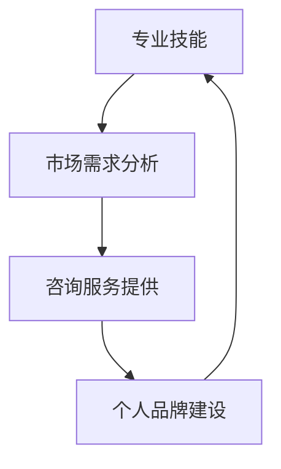

                 

关键词：编程技能、咨询服务、转换策略、技术顾问、个人品牌、市场需求

> 摘要：在信息技术高速发展的时代，编程技能已经成为许多企业和个人不可或缺的能力。本文旨在探讨如何将个人的编程技能转化为有价值的咨询服务，为编程人才提供从技能到商业的转化路径。

## 1. 背景介绍

随着全球数字化转型的深入，编程技能的应用领域日益广泛。从软件开发、数据科学到人工智能、区块链，编程已成为推动技术创新和业务增长的核心驱动力。然而，对于许多拥有优秀编程技能的人来说，如何将这些技能有效地转化为收入来源仍是一个挑战。

本文将讨论如何将编程技能转化为咨询服务，帮助程序员和企业更好地理解这一转化过程，并探索相关策略和市场机会。

## 2. 核心概念与联系

在将编程技能转化为咨询服务时，我们需要理解以下几个核心概念：

1. **专业技能**：这是您在编程领域的专长，包括语言、框架、工具和算法。
2. **市场需求**：了解客户的需求，包括他们面临的问题和挑战。
3. **咨询服务**：提供专业意见、解决方案和培训服务，帮助客户提高效率和实现目标。
4. **个人品牌**：建立专业形象，提升市场认可度和信任度。

以下是一个简单的 Mermaid 流程图，展示这些概念之间的联系：



## 3. 核心算法原理 & 具体操作步骤

### 3.1 算法原理概述

将编程技能转化为咨询服务，可以采用以下三个核心步骤：

1. **技能评估与定位**：了解自己的编程技能和专长，将其定位到市场需求较高的领域。
2. **客户需求挖掘**：通过市场调研和客户访谈，挖掘潜在客户的需求和痛点。
3. **定制化服务提供**：根据客户需求，提供定制化的编程解决方案或培训服务。

### 3.2 算法步骤详解

#### 3.2.1 技能评估与定位

1. **自我评估**：回顾自己的编程经历，识别出最擅长和感兴趣的领域。
2. **市场调研**：研究行业趋势和热门技术，了解哪些技能具有更高的市场需求。
3. **技能定位**：结合自我评估和市场调研结果，确定自己的核心技能和定位。

#### 3.2.2 客户需求挖掘

1. **市场调研**：通过社交媒体、行业论坛和客户访谈，了解潜在客户的需求和痛点。
2. **需求分类**：将收集到的需求进行分类，识别出高频次和紧迫性的问题。
3. **需求分析**：分析需求背后的业务目标和挑战，确定解决方案的方向。

#### 3.2.3 定制化服务提供

1. **方案设计**：根据需求分析，设计合适的解决方案或培训方案。
2. **服务交付**：提供高质量的编程服务，确保客户的问题得到有效解决。
3. **反馈收集**：收集客户反馈，不断优化服务质量和解决方案。

### 3.3 算法优缺点

#### 优点：

1. **灵活性强**：可以根据市场需求和客户需求灵活调整服务内容。
2. **高附加值**：提供专业意见和定制化服务，创造更高的商业价值。
3. **可持续性**：随着技能的提升和市场的扩大，业务可持续增长。

#### 缺点：

1. **竞争激烈**：市场中存在大量具有相似技能的咨询师，需要不断提升自身竞争力。
2. **前期投入大**：需要进行市场调研和客户挖掘，需要一定的时间和资源投入。

### 3.4 算法应用领域

将编程技能转化为咨询服务的算法原理和步骤可以应用于多个领域，包括：

1. **软件开发与架构设计**：为企业提供软件开发的咨询和架构设计服务。
2. **数据科学与人工智能**：为企业提供数据分析和人工智能解决方案。
3. **系统优化与性能调优**：为企业的现有系统提供性能优化和故障排查服务。

## 4. 数学模型和公式 & 详细讲解 & 举例说明

在将编程技能转化为咨询服务的过程中，我们可以借助以下数学模型和公式来指导我们的决策：

### 4.1 数学模型构建

#### 4.1.1 客户满意度模型

$$
\text{Customer Satisfaction} = \frac{\text{Quality of Service}}{\text{Customer Expectation}}
$$

其中，$Quality \ of \ Service$ 表示服务提供方的服务质量，$Customer \ Expectation$ 表示客户的期望值。

#### 4.1.2 转化率模型

$$
\text{Conversion Rate} = \frac{\text{Number of Leads}}{\text{Total Visitors}} \times 100\%
$$

其中，$Number \ of \ Leads$ 表示转化成客户的数量，$Total \ Visitors$ 表示网站或渠道的访问总量。

### 4.2 公式推导过程

#### 4.2.1 客户满意度模型推导

客户满意度模型是基于满意度公式的变形。在满意度分析中，通常使用以下公式：

$$
\text{Customer Satisfaction} = \frac{\text{Quality of Product}}{\text{Price of Product}} \times \text{Service Experience}
$$

在将编程技能转化为咨询服务时，我们将产品替换为服务，价格视为时间成本，服务体验替换为服务质量，从而得到上述公式。

#### 4.2.2 转化率模型推导

转化率模型是基于流量转化率的变形。在数字营销中，转化率通常用于衡量网站或营销渠道的有效性。公式表示为：

$$
\text{Conversion Rate} = \frac{\text{Number of Conversions}}{\text{Total Visitors}} \times 100\%
$$

在将编程技能转化为咨询服务时，我们将转化量替换为潜在客户数量，访问量替换为网站或渠道的访问量，从而得到上述公式。

### 4.3 案例分析与讲解

#### 4.3.1 客户满意度模型应用案例

假设一位编程咨询师提供了高质量的服务，客户对其服务的期望值为5，最终客户满意度为4。那么，根据客户满意度模型，我们可以计算出：

$$
\text{Customer Satisfaction} = \frac{4}{5} = 0.8
$$

这意味着该咨询师的服务质量略低于客户的期望值，需要进一步提升服务质量。

#### 4.3.2 转化率模型应用案例

假设一位编程咨询师在网站上的月均访问量为1000人，其中转化成客户的有100人。那么，根据转化率模型，我们可以计算出：

$$
\text{Conversion Rate} = \frac{100}{1000} \times 100\% = 10\%
$$

这意味着该咨询师的网站转化率为10%，需要进行进一步的营销优化。

## 5. 项目实践：代码实例和详细解释说明

### 5.1 开发环境搭建

在进行编程技能转化为咨询服务的过程中，搭建一个良好的开发环境至关重要。以下是一个简单的开发环境搭建示例：

```bash
# 安装 Python 3
sudo apt-get update
sudo apt-get install python3

# 安装 VSCode
sudo apt-get install code

# 安装 Node.js
curl -sL https://deb.nodesource.com/setup_16.x | sudo -E bash -
sudo apt-get install nodejs

# 安装数据库（以 MySQL 为例）
sudo apt-get install mysql-server
```

### 5.2 源代码详细实现

以下是一个简单的 Python 代码实例，用于演示如何根据客户需求提供定制化的编程解决方案：

```python
# 客户需求：实现一个简单的计算器程序

def add(a, b):
    return a + b

def subtract(a, b):
    return a - b

def multiply(a, b):
    return a * b

def divide(a, b):
    if b != 0:
        return a / b
    else:
        return "除数不能为 0"

def main():
    print("欢迎来到简易计算器！")
    while True:
        print("请选择操作：1. 加法 2. 减法 3. 乘法 4. 除法 5. 退出")
        choice = int(input())
        if choice == 1:
            a = float(input("请输入第一个数："))
            b = float(input("请输入第二个数："))
            result = add(a, b)
            print(f"{a} + {b} = {result}")
        elif choice == 2:
            a = float(input("请输入第一个数："))
            b = float(input("请输入第二个数："))
            result = subtract(a, b)
            print(f"{a} - {b} = {result}")
        elif choice == 3:
            a = float(input("请输入第一个数："))
            b = float(input("请输入第二个数："))
            result = multiply(a, b)
            print(f"{a} * {b} = {result}")
        elif choice == 4:
            a = float(input("请输入第一个数："))
            b = float(input("请输入第二个数："))
            result = divide(a, b)
            print(f"{a} / {b} = {result}")
        elif choice == 5:
            print("感谢使用简易计算器，再见！")
            break
        else:
            print("请输入有效的操作选项。")

if __name__ == "__main__":
    main()
```

### 5.3 代码解读与分析

以上代码实现了一个简单的命令行计算器程序，用于演示如何根据客户需求提供定制化的编程解决方案。程序的主要功能包括加法、减法、乘法和除法操作，并允许用户根据需求进行选择。

1. **功能模块化**：程序将不同功能封装成独立的函数，便于维护和扩展。
2. **用户交互**：程序通过循环和输入输出实现与用户的交互，提高用户体验。
3. **异常处理**：程序在除法操作中加入了异常处理，避免除数为 0 的情况。

### 5.4 运行结果展示

运行上述代码，用户将看到以下界面：

```
欢迎来到简易计算器！
请选择操作：1. 加法 2. 减法 3. 乘法 4. 除法 5. 退出
1
请输入第一个数：10
请输入第二个数：5
10 + 5 = 15
请选择操作：1. 加法 2. 减法 3. 乘法 4. 除法 5. 退出
5
10 / 5 = 2.0
请选择操作：1. 加法 2. 减法 3. 乘法 4. 除法 5. 退出
2
请输入第一个数：7
请输入第二个数：3
7 - 3 = 4
请选择操作：1. 加法 2. 减法 3. 乘法 4. 除法 5. 退出
5
感谢使用简易计算器，再见！
```

## 6. 实际应用场景

编程技能转化为咨询服务在实际应用场景中具有广泛的应用，以下是一些具体的例子：

### 6.1 软件开发与架构设计

**案例**：一家初创公司需要开发一款社交媒体应用，但由于缺乏专业的软件开发人员，他们找到了一位拥有丰富经验的编程咨询师。咨询师通过对项目需求进行分析，提供了详细的软件架构设计和技术方案，帮助公司顺利完成了产品开发。

### 6.2 数据科学与人工智能

**案例**：一家金融机构希望利用人工智能技术提升风险管理能力。他们聘请了一位数据科学咨询师，通过分析大量金融数据，设计并实现了基于机器学习的风险预测模型，显著提升了公司的风险管理水平。

### 6.3 系统优化与性能调优

**案例**：一家电商公司的网站在高峰期出现了性能问题，影响了用户体验。他们邀请了一位系统优化咨询师，通过对网站架构和数据库进行优化，解决了性能瓶颈，提高了网站的响应速度和稳定性。

## 7. 未来应用展望

随着信息技术的不断发展，编程技能转化为咨询服务的应用前景将更加广阔。以下是未来可能的发展趋势：

### 7.1 人工智能与自动化

随着人工智能和自动化技术的发展，编程咨询师的角色将更加多样化和高级化，涉及更多复杂的技术领域，如深度学习、自然语言处理和自动化流程优化。

### 7.2 云计算与大数据

云计算和大数据技术的普及，将推动编程咨询师在云服务架构、数据存储和数据分析领域的专业需求，为咨询师提供更多的发展机会。

### 7.3 区块链技术

区块链技术的应用日益广泛，编程咨询师将能够在区块链应用开发、智能合约编写和分布式系统设计等方面发挥重要作用。

## 8. 工具和资源推荐

为了更好地将编程技能转化为咨询服务，以下是几款实用的工具和资源推荐：

### 8.1 学习资源推荐

1. **Coursera**：提供丰富的在线课程，涵盖编程、数据科学和人工智能等多个领域。
2. **Udemy**：提供各种编程和技术课程的在线学习平台。
3. **freeCodeCamp**：一个免费的编程学习社区，提供大量的编程教程和练习。

### 8.2 开发工具推荐

1. **Visual Studio Code**：一款功能强大的开源代码编辑器，适合编程开发。
2. **Git**：一款分布式版本控制系统，用于代码管理和协作开发。
3. **Docker**：一款容器化技术，用于简化应用部署和运行环境。

### 8.3 相关论文推荐

1. **"The Art of Computer Programming"**：由计算机科学大师 Donald E. Knuth 编写的经典计算机科学著作。
2. **"Deep Learning"**：由深度学习领域专家 Ian Goodfellow、Yoshua Bengio 和 Aaron Courville 共同撰写的深度学习权威著作。
3. **"The Hundred-Page Machine Learning Book"**：由 Andriy Burkov 编写，适合初学者快速掌握机器学习基础。

## 9. 总结：未来发展趋势与挑战

随着信息技术的快速发展，编程技能转化为咨询服务将迎来更多的机遇和挑战。未来，咨询师需要不断提升自己的技能，关注新兴技术趋势，同时掌握有效的市场推广策略，以在激烈的市场竞争中脱颖而出。

### 9.1 研究成果总结

本文系统地探讨了如何将编程技能转化为咨询服务，从核心概念、算法原理、数学模型到实际应用，为编程人才提供了一套完整的转化路径。

### 9.2 未来发展趋势

随着人工智能、云计算、大数据等技术的发展，编程咨询师将在更多领域发挥重要作用，为企业和个人提供定制化的技术解决方案。

### 9.3 面临的挑战

咨询师需要面对激烈的市场竞争、不断更新的技术要求和客户需求的变化，同时需要不断提升自身的专业能力和市场洞察力。

### 9.4 研究展望

未来，我们可以进一步研究如何利用人工智能和大数据技术提升编程咨询服务的效率和质量，探索新的商业模式和应用场景，为编程人才创造更多价值。

## 附录：常见问题与解答

### Q：如何评估自己的编程技能？

A：可以通过完成项目、参与编程竞赛和在线编程挑战来评估自己的编程技能。此外，还可以参考行业标准和技术认证，了解自己在不同编程领域的能力水平。

### Q：如何找到合适的客户？

A：可以通过社交媒体、行业论坛和专业社群等渠道寻找潜在客户。此外，还可以参加行业会议、技术讲座和线下活动，扩大人脉圈，提高知名度。

### Q：如何提升个人品牌？

A：可以通过撰写技术博客、发表专业论文、参与开源项目和在线课程等方式提升个人品牌。此外，还可以利用社交媒体平台分享自己的经验和见解，树立专业形象。

### Q：如何定价自己的咨询服务？

A：可以根据市场调研、客户需求和自身的专业技能水平来确定咨询服务定价。一般来说，高端咨询服务的价格较高，而入门级别的价格较低。

### Q：如何确保服务质量？

A：可以通过建立严格的流程管理、设定明确的服务标准和定期进行客户满意度调查来确保服务质量。此外，还可以接受客户的反馈，不断优化服务内容和体验。

### Q：如何平衡工作与生活？

A：可以通过合理规划工作时间和任务优先级，确保工作和生活之间的平衡。此外，还可以培养健康的生活习惯，如定期锻炼、保持良好的作息时间等。## 致谢

本文的撰写得益于众多前人的智慧和经验，特此致以诚挚的感谢。同时，感谢所有在编程领域辛勤工作的同行们，以及支持和鼓励我的朋友们。没有你们，这篇博客文章无法顺利完成。

