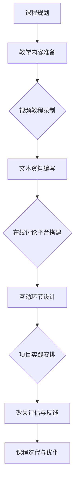

                 

关键词：编程技能，线上编程训练营，教学方法，课程设计，技术传授，互动性，效果评估，在线教育平台，实践经验，未来趋势。

## 摘要

本文旨在探讨如何将个人的编程技能转化为成功的线上编程训练营。通过深入分析教学目标、课程设计、互动性、效果评估等多个维度，本文将提供一系列实用的策略和方法，帮助IT专业人士在在线教育领域取得成功。此外，还将探讨当前在线教育平台的优势与不足，并展望未来的发展趋势与挑战。

## 1. 背景介绍

随着互联网技术的飞速发展，在线教育已经成为全球教育领域的重要组成部分。尤其是在COVID-19疫情的影响下，线上教学成为教育机构和个人学习者的首选方式。对于编程技能的传授，线上编程训练营因其灵活性和高效性，逐渐受到编程爱好者和从业者的青睐。

然而，将个人的编程技能转化为线上编程训练营并非易事。首先，IT专业人士往往擅长技术本身，但在教学设计和互动性方面可能缺乏经验。其次，线上教育的独特性要求从业者掌握新的教学方法和工具。此外，如何确保课程的质量和效果，如何与学员建立有效的沟通和互动，都是成功开设线上编程训练营的关键因素。

本文将从以下几个方面展开讨论：

1. **核心概念与联系**：介绍线上编程训练营的基础概念和教学架构。
2. **核心算法原理与具体操作步骤**：阐述如何设计有效的编程教学流程。
3. **数学模型和公式**：介绍在编程教学中常用的数学模型和公式。
4. **项目实践**：提供具体的代码实例和实现过程。
5. **实际应用场景**：探讨线上编程训练营在不同领域中的应用。
6. **工具和资源推荐**：推荐实用的教学工具和资源。
7. **总结**：总结研究成果，展望未来发展趋势与挑战。

## 2. 核心概念与联系

### 2.1 线上编程训练营的定义

线上编程训练营是指通过互联网平台，以视频教学、在线讨论、实践项目等形式，为学习者提供系统化、专业化的编程学习服务。其核心目标是通过引导学习者动手实践，培养其编程思维和实际操作能力。

### 2.2 教学架构

线上编程训练营的教学架构通常包括以下几个层次：

1. **课程规划**：根据学习者的需求和技能水平，设计适合的教学内容。课程规划应包含基础知识、核心算法、实战项目等。
2. **教学内容**：包括视频教程、文本资料、编程环境等。视频教程应注重逻辑清晰、内容丰富，同时保证字幕和音频质量。
3. **互动环节**：通过在线讨论区、实时问答等方式，促进学习者之间的交流，提高学习积极性。
4. **项目实践**：通过实际项目，帮助学习者将所学知识应用于实际场景，提高实践能力。

### 2.3 教学工具

线上编程训练营需要使用一系列教学工具，包括视频录制软件、在线讨论平台、编程环境等。例如，Zoom、Microsoft Teams等视频会议软件用于实时授课和互动；GitHub、GitLab等版本控制工具用于项目协作；Visual Studio Code、PyCharm等编程环境则用于代码编写和调试。

### 2.4 Mermaid 流程图

以下是一个简单的Mermaid流程图，展示了线上编程训练营的基本教学流程：



## 3. 核心算法原理与具体操作步骤

### 3.1 算法原理概述

编程教学的核心在于算法原理的传授。算法是解决问题的方法，其原理决定了程序的效率和效果。常见的算法原理包括排序、查找、图论、动态规划等。

### 3.2 算法步骤详解

以下是排序算法（冒泡排序）的基本步骤：

1. **初始化**：将待排序的数组输入到算法中。
2. **比较相邻元素**：从第一个元素开始，依次比较相邻的两个元素。
3. **交换位置**：如果第一个元素大于第二个元素，则交换它们的位置。
4. **重复步骤2和3**：重复上述比较和交换步骤，直到整个数组排序完成。

### 3.3 算法优缺点

冒泡排序的优点是简单易懂，易于实现。然而，其时间复杂度为O(n^2)，在数据量较大时效率较低。

### 3.4 算法应用领域

冒泡排序适用于数据量较小且对算法效率要求不高的场景。在实际应用中，排序算法常用于数据预处理、查询优化等场景。

### 3.5 Mermaid 流程图

以下是冒泡排序算法的Mermaid流程图：

```mermaid
graph TD
    A[初始化]
    B[比较相邻元素]
    C[交换位置]
    D[重复步骤B和C]
    A --> B
    B --> C
    C --> D
    D --> (排序完成)
```

## 4. 数学模型和公式

### 4.1 数学模型构建

在编程教学中，数学模型是解决问题的重要工具。例如，线性回归模型可以用于预测数值，分类模型可以用于分类任务。

### 4.2 公式推导过程

以下是一个简单的线性回归模型公式推导：

$$ y = w_0 + w_1 \cdot x_1 + w_2 \cdot x_2 + ... + w_n \cdot x_n $$

其中，$y$ 是预测值，$x_1, x_2, ..., x_n$ 是特征值，$w_0, w_1, w_2, ..., w_n$ 是模型的参数。

### 4.3 案例分析与讲解

以下是一个线性回归模型的案例：

**问题**：预测房屋价格。

**数据集**：包括房屋面积、房屋类型、建造年代等特征。

**模型**：线性回归模型。

**推导过程**：根据特征值和目标值，通过最小二乘法求解模型参数。

**结果**：根据模型参数，预测房屋价格。

## 5. 项目实践：代码实例和详细解释说明

### 5.1 开发环境搭建

**工具**：Python、Jupyter Notebook、NumPy、Pandas等。

**步骤**：

1. 安装Python环境。
2. 安装NumPy和Pandas库。
3. 启动Jupyter Notebook。

### 5.2 源代码详细实现

以下是一个简单的线性回归模型的实现：

```python
import numpy as np
import pandas as pd

# 数据集加载
data = pd.read_csv('house_data.csv')

# 特征值和目标值分离
X = data[['area', 'type', 'year']]
y = data['price']

# 模型参数初始化
w = np.random.rand(3)

# 模型训练
for i in range(1000):
    predictions = w[0] + w[1] * X['area'] + w[2] * X['type'] + w[3] * X['year']
    error = y - predictions
    gradient = -2 * X.T.dot(error)
    w -= gradient

# 模型评估
test_data = pd.read_csv('test_house_data.csv')
test_predictions = w[0] + w[1] * test_data['area'] + w[2] * test_data['type'] + w[3] * test_data['year']
test_error = test_data['price'] - test_predictions
test_mse = np.mean(test_error ** 2)
print(f"Test MSE: {test_mse}")
```

### 5.3 代码解读与分析

该代码首先加载数据集，然后分离特征值和目标值。接着，使用随机初始化的参数进行模型训练，通过梯度下降法更新参数。最后，评估模型在测试数据集上的表现。

### 5.4 运行结果展示

运行结果将显示测试数据集上的均方误差（MSE），用于评估模型的预测性能。

## 6. 实际应用场景

### 6.1 教育行业

线上编程训练营在教育行业中具有广泛的应用。例如，编程课程可以作为大学、高中和中学的选修课，为学生提供实用的编程技能。此外，在线编程训练营还可以为企业培训员工，提升其技术能力。

### 6.2 科技行业

科技行业对编程人才的需求不断增长，线上编程训练营成为培养编程人才的重要渠道。例如，云计算、人工智能、区块链等领域的技术人才可以通过线上编程训练营学习相关技能。

### 6.3 创业领域

许多创业者将线上编程训练营作为创业项目，通过提供优质的教学内容吸引学员。这些创业者可以利用线上编程训练营积累资金和用户，进一步拓展业务。

## 7. 工具和资源推荐

### 7.1 学习资源推荐

1. **《编程珠玑》**：一本经典编程书籍，适合初学者入门。
2. **《算法导论》**：详细介绍各种算法原理和实现，适合进阶学习者。

### 7.2 开发工具推荐

1. **Visual Studio Code**：一款强大的编程IDE，适用于多种编程语言。
2. **Jupyter Notebook**：适用于数据分析和机器学习的交互式编程环境。

### 7.3 相关论文推荐

1. **“Online Education: A Systematic Review of Empirical Studies 2000–2019”**：探讨在线教育的效果和影响因素。
2. **“The Impact of Online Education on Student Performance: A Meta-Analysis”**：分析在线教育对学生成绩的影响。

## 8. 总结：未来发展趋势与挑战

### 8.1 研究成果总结

本文探讨了如何将编程技能转化为线上编程训练营，从教学设计、互动性、效果评估等多个方面提供了实用的策略和方法。此外，还分析了当前在线教育平台的优势与不足，并展望了未来的发展趋势。

### 8.2 未来发展趋势

1. **个性化学习**：随着人工智能技术的发展，线上编程训练营将更加注重个性化学习，为学习者提供定制化的教学内容。
2. **实时互动**：实时互动技术将进一步提升线上编程训练营的教学效果，促进学习者之间的交流。
3. **项目驱动学习**：项目驱动学习模式将更受欢迎，通过实际项目培养学习者的编程能力。

### 8.3 面临的挑战

1. **技术挑战**：实时互动技术、个性化学习等技术需要不断优化和升级，以适应不断变化的需求。
2. **教学资源**：高质量的教学资源仍然是线上编程训练营面临的重要挑战，需要持续投入和更新。

### 8.4 研究展望

未来，线上编程训练营将在教育、科技、创业等领域发挥更大的作用。通过不断创新和优化，线上编程训练营将更好地满足学习者的需求，推动编程教育的普及和发展。

## 9. 附录：常见问题与解答

### 9.1 如何选择合适的教学平台？

**答案**：选择教学平台时，应考虑以下因素：

1. **用户量**：选择用户量较大的平台，有助于扩大学习者群体。
2. **功能**：选择功能丰富的平台，如支持视频教学、在线讨论、项目协作等。
3. **费用**：根据预算选择适合的平台。

### 9.2 如何保证课程质量？

**答案**：保证课程质量的方法包括：

1. **严格课程评审**：设立课程评审机制，确保课程内容严谨、准确。
2. **定期更新课程**：根据技术发展和学习者需求，定期更新课程内容。
3. **互动与反馈**：通过互动和反馈机制，收集学员意见，不断优化课程。

作者：禅与计算机程序设计艺术 / Zen and the Art of Computer Programming

