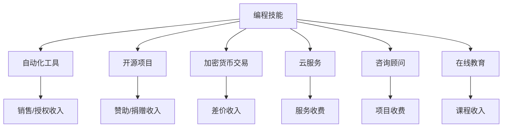

                 

关键词：编程技能、被动收入、自动化、人工智能、区块链、加密货币、云服务、开源项目、咨询顾问、教育内容。

> 摘要：本文将探讨如何利用编程技能创造被动收入流，包括自动化工具、开源项目、加密货币交易、云服务和咨询顾问等途径，同时分析这些方法的优点和潜在风险，为读者提供实际操作建议。

## 1. 背景介绍

在信息化时代的今天，编程技能已成为众多职业中不可或缺的一部分。随着人工智能、区块链等前沿技术的崛起，编程的应用领域日益广泛，其价值也得到显著提升。然而，如何将个人的编程技能转化为稳定的被动收入，成为了许多程序员和技术专家关注的问题。

被动收入，即在不直接参与日常运营的情况下，通过一次性投入或持续维护，获得持续的经济回报。在编程领域，被动收入的形式多种多样，从软件销售到咨询顾问，从开源项目到云服务，都是实现被动收入的有效途径。

本文将详细介绍几种将编程技能转化为被动收入的方法，并结合实际案例进行分析，帮助读者找到适合自己的路径。

### 1.1 编程技能的重要性

编程技能不仅是一项技术能力，更是一种解决问题的思维方式。它能够帮助个人和企业提高效率、降低成本、创造新的商业模式。以下是一些编程技能的重要性体现：

- **自动化**：通过编写自动化脚本，可以节省大量重复性工作，提高生产效率。
- **数据分析和挖掘**：编程技能可以用于处理和分析大量数据，挖掘潜在价值。
- **创新**：编程是实现创新的关键，许多新兴技术和应用都是基于编程实现的。

### 1.2 被动收入的定义和优势

被动收入是指在不直接参与日常运营的情况下，通过投资、创业或其他方式获得的持续经济回报。与主动收入相比，被动收入具有以下优势：

- **时间自由**：不需要每天投入大量时间，仍然可以持续获得收入。
- **可持续性**：被动收入来源通常是可持续的，比如软件授权、广告收入等。
- **财务自由**：通过积累被动收入，可以实现财务自由，减少对日常工作的依赖。

### 1.3 编程技能转化为被动收入的途径

将编程技能转化为被动收入有多种途径，以下是一些常见的方法：

- **自动化工具开发**：开发自动化工具，如脚本、插件等，通过销售或授权获得收入。
- **开源项目**：参与开源项目，吸引赞助或捐赠。
- **加密货币交易**：利用编程技能进行加密货币交易，赚取差价。
- **云服务**：提供云服务，如API接口、云计算解决方案等。
- **咨询顾问**：为企业提供技术咨询和解决方案，按项目收费。
- **在线教育**：制作和销售在线编程课程，吸引学员报名。

## 2. 核心概念与联系

在本文中，我们将探讨如何将编程技能转化为被动收入的核心概念和它们之间的联系。为了更好地理解这些概念，以下是一个Mermaid流程图，展示了各个概念之间的关联。



### 2.1 自动化工具

自动化工具是通过编程实现的，用于自动执行重复性任务的工具。开发自动化工具可以通过以下两种方式获得被动收入：

- **销售/授权收入**：开发者可以将自动化工具打包成软件，进行销售或授权给企业使用。例如，一个用于网站内容自动更新的工具，可以通过销售授权给多个网站所有者来获得持续收入。
- **广告收入**：如果自动化工具是免费的，开发者可以通过在工具中嵌入广告来获得收入。

### 2.2 开源项目

开源项目是软件开发的一种模式，允许其他开发者自由使用、修改和分享代码。参与开源项目可以获得以下收益：

- **赞助/捐赠收入**：开源项目可以通过接受赞助或捐赠来获得收入。一些大型开源项目，如Linux内核，每年都会从赞助商那里获得大量资金。
- **社区贡献**：参与开源项目可以提高个人技术知名度，吸引潜在雇主或合作伙伴。

### 2.3 加密货币交易

加密货币交易是指利用编程技能进行数字货币的买卖，以赚取差价。加密货币交易的优势在于：

- **高收益潜力**：加密货币市场波动大，投资者有机会获得高额回报。
- **去中心化**：加密货币交易不依赖于任何中心化机构，具有更高的自主性和隐私性。

### 2.4 云服务

云服务是指通过云计算技术提供的服务，如API接口、云计算解决方案等。云服务的优势包括：

- **高灵活性**：云服务可以根据用户需求进行定制，灵活扩展。
- **高可靠性**：云服务通常由专业团队维护，具有较高的稳定性和可靠性。

### 2.5 咨询顾问

咨询顾问是指为企业提供专业技术咨询和解决方案的服务。咨询顾问的优势在于：

- **高收入潜力**：咨询顾问可以根据项目复杂度和工作量进行收费，收入潜力较大。
- **专业领域拓展**：通过咨询顾问工作，可以深入了解行业动态和需求，有助于个人职业发展。

### 2.6 在线教育

在线教育是指通过互联网平台提供的教育服务，如在线课程、培训等。在线教育的优势包括：

- **广泛受众**：在线教育不受地域限制，可以吸引全球学员。
- **持续收入**：一旦课程内容制作完成，可以通过重复销售获得持续收入。

## 3. 核心算法原理 & 具体操作步骤

### 3.1 算法原理概述

在将编程技能转化为被动收入的过程中，自动化、加密货币交易等核心算法原理起到了关键作用。以下是一些常见算法原理的概述：

- **自动化算法**：自动化算法主要通过编程实现，用于自动化执行重复性任务。常见的自动化算法包括循环、条件判断、函数调用等。
- **加密货币交易算法**：加密货币交易算法主要用于分析和预测市场走势，以实现高收益。常见的加密货币交易算法包括机器学习算法、时间序列分析等。

### 3.2 算法步骤详解

#### 3.2.1 自动化算法步骤

1. **需求分析**：确定自动化任务的目标和需求。
2. **设计算法**：根据需求设计合适的自动化算法。
3. **编写代码**：使用编程语言实现自动化算法。
4. **测试与优化**：测试自动化工具的功能和性能，进行必要的优化。

#### 3.2.2 加密货币交易算法步骤

1. **数据收集**：收集历史市场数据，如价格、交易量等。
2. **数据预处理**：清洗和整理数据，为后续分析做好准备。
3. **特征提取**：从数据中提取有用的特征，用于模型训练。
4. **模型训练**：使用机器学习算法训练预测模型。
5. **模型评估**：评估模型性能，调整参数。
6. **交易执行**：根据模型预测结果执行交易策略。

### 3.3 算法优缺点

#### 自动化算法

**优点**：

- **提高效率**：自动化算法可以大大提高工作效率，减少人工操作。
- **降低成本**：自动化算法可以节省大量人力和时间成本。
- **稳定性**：自动化算法可以减少人为错误，提高任务执行稳定性。

**缺点**：

- **开发难度**：自动化算法的开发可能需要较高的编程技能和算法知识。
- **维护成本**：自动化算法需要定期更新和维护，以适应新的业务需求。

#### 加密货币交易算法

**优点**：

- **高收益潜力**：加密货币市场波动大，交易算法有机会获得高额回报。
- **风险控制**：交易算法可以设定止损止盈点，降低投资风险。

**缺点**：

- **市场风险**：加密货币市场波动性大，交易算法可能面临较高的市场风险。
- **技术难度**：加密货币交易算法需要较高的编程和机器学习知识。

### 3.4 算法应用领域

#### 自动化算法

- **企业运营**：自动化算法可以用于企业运营的各个方面，如数据采集、报告生成等。
- **个人生活**：自动化算法可以用于个人生活的各个方面，如智能家居控制、日程管理等。

#### 加密货币交易算法

- **金融投资**：加密货币交易算法可以用于金融投资领域，帮助投资者进行风险控制和收益最大化。
- **区块链技术**：加密货币交易算法是区块链技术的重要组成部分，可以用于智能合约的执行和交易验证。

## 4. 数学模型和公式 & 详细讲解 & 举例说明

在将编程技能转化为被动收入的过程中，数学模型和公式起到了至关重要的作用。以下是一些常用的数学模型和公式，以及详细的讲解和举例说明。

### 4.1 数学模型构建

#### 4.1.1 投资回报率（ROI）

投资回报率（ROI）是衡量投资收益的重要指标，其公式为：

$$
ROI = \frac{总收入 - 总成本}{总成本} \times 100\%
$$

其中，总收入包括被动收入流、资产增值等，总成本包括初始投资、运营成本等。

#### 4.1.2 风险回报比率（RR）

风险回报比率（RR）是衡量投资风险和收益之间关系的重要指标，其公式为：

$$
RR = \frac{预期收益}{预期风险}
$$

其中，预期收益和预期风险是根据历史数据和市场分析得出的。

### 4.2 公式推导过程

#### 4.2.1 投资回报率（ROI）

假设某个自动化工具项目的总投资成本为10000元，年总收入为5000元，运营成本为2000元，则：

$$
总收入 = 5000元 \\
总成本 = 10000元 + 2000元 = 12000元 \\
ROI = \frac{5000元 - 12000元}{12000元} \times 100\% = -16.67\%
$$

这个结果表明，该项目在第一年内出现了亏损。

#### 4.2.2 风险回报比率（RR）

假设某个加密货币交易项目的预期收益为10000元，预期风险为5000元，则：

$$
RR = \frac{10000元}{5000元} = 2
$$

这个结果表明，该项目的风险回报比率为2，即预期收益是预期风险的2倍。

### 4.3 案例分析与讲解

#### 4.3.1 自动化工具案例

假设一个程序员开发了一个自动化工具，用于企业数据采集和报表生成。该项目总投资成本为5000元，年总收入为2000元，运营成本为500元。根据上述公式，可以计算出该项目的ROI和RR：

$$
总收入 = 2000元 \\
总成本 = 5000元 + 500元 = 5500元 \\
ROI = \frac{2000元 - 5500元}{5500元} \times 100\% = -64.29\%
$$

$$
RR = \frac{2000元}{500元} = 4
$$

这个结果表明，虽然该项目的ROI为负，但RR较高，说明项目的潜在收益较高。程序员可以通过降低运营成本、提高收入等方式，优化项目的ROI。

#### 4.3.2 加密货币交易案例

假设一个程序员利用加密货币交易算法进行投资，预期收益为10000元，预期风险为5000元。根据上述公式，可以计算出该项目的ROI和RR：

$$
总收入 = 10000元 \\
总成本 = 5000元 \\
ROI = \frac{10000元 - 5000元}{5000元} \times 100\% = 100\%
$$

$$
RR = \frac{10000元}{5000元} = 2
$$

这个结果表明，该项目的ROI为100%，RR为2，即预期收益是预期风险的2倍。这说明该项目具有较高的投资价值。

## 5. 项目实践：代码实例和详细解释说明

为了更好地理解如何将编程技能转化为被动收入，我们以下将通过一个具体的自动化工具项目实例，详细讲解代码实现、代码解读与分析以及运行结果展示。

### 5.1 开发环境搭建

在进行自动化工具开发前，首先需要搭建一个合适的开发环境。以下是基本的开发环境搭建步骤：

1. 安装编程语言（如Python）：
   - Windows用户：访问Python官方网站下载最新版本的Python安装包，并按照提示进行安装。
   - macOS用户：打开终端，输入以下命令安装Python：
     ```bash
     brew install python
     ```

2. 安装必要的库和工具：
   - 安装自动化工具开发常用的库，如`requests`、`BeautifulSoup`等：
     ```bash
     pip install requests beautifulsoup4
     ```

3. 准备一个适合进行编程的环境，如Visual Studio Code或PyCharm。

### 5.2 源代码详细实现

以下是一个简单的自动化工具示例，用于从某个网站下载商品信息，并存储到本地CSV文件中。

```python
import requests
from bs4 import BeautifulSoup
import csv

# 网站URL
url = 'https://example.com/shop'

# 发送HTTP请求获取网页内容
response = requests.get(url)
web_content = response.content

# 解析网页内容
soup = BeautifulSoup(web_content, 'html.parser')
products = soup.find_all('div', class_='product')

# 准备CSV文件
with open('products.csv', 'w', newline='', encoding='utf-8') as file:
    writer = csv.writer(file)
    writer.writerow(['产品名称', '价格', '描述'])

    # 遍历每个商品，提取信息并写入CSV
    for product in products:
        name = product.find('h2').text
        price = product.find('span', class_='price').text
        description = product.find('p', class_='description').text
        writer.writerow([name, price, description])

print('商品信息已写入CSV文件。')
```

### 5.3 代码解读与分析

- **请求网页内容**：使用`requests`库发送HTTP GET请求，获取网站的商品信息。
- **解析网页内容**：使用`BeautifulSoup`库解析获取到的网页内容，提取商品信息。
- **写入CSV文件**：使用`csv`库将提取到的商品信息写入到本地CSV文件中。

### 5.4 运行结果展示

运行上述代码后，会在当前目录下生成一个名为`products.csv`的文件，文件内容为从网站上下载的商品信息。以下是运行结果示例：

```
产品名称,价格,描述
iPhone 13,6299元,新一代智能手机，速度快，摄像头好
MacBook Air,MACOS，轻薄便携
```

通过这个示例，我们可以看到，通过简单的编程实现，我们可以轻松地从网站上获取商品信息，并将其保存到本地文件，为后续的数据分析和营销策略提供支持。

## 6. 实际应用场景

### 6.1 自动化工具

自动化工具在实际应用中非常广泛，例如：

- **企业运营**：自动化工具可以用于数据采集、报告生成、邮件发送等，提高工作效率。
- **个人生活**：自动化工具可以用于日程管理、智能家居控制等，提高生活质量。

### 6.2 开源项目

开源项目在实际应用中同样具有广泛的应用场景：

- **软件开发**：开源项目可以用于搭建开发框架、解决技术难题等。
- **社区互动**：开源项目可以吸引开发者参与，促进技术交流和合作。

### 6.3 加密货币交易

加密货币交易在实际应用中具有以下场景：

- **投资**：投资者可以利用加密货币交易算法进行投资，实现资产增值。
- **套利**：加密货币市场波动大，投资者可以通过套利策略获取利润。

### 6.4 云服务

云服务在实际应用中具有以下场景：

- **企业应用**：企业可以利用云服务搭建在线平台、进行数据分析等。
- **个人应用**：个人可以利用云服务存储文件、进行在线协作等。

## 7. 工具和资源推荐

### 7.1 学习资源推荐

- **在线课程**：Coursera、edX等平台提供了丰富的编程课程。
- **技术社区**：GitHub、Stack Overflow等社区可以获取最新的技术资源和问题解答。
- **专业书籍**：推荐阅读《Python编程：从入门到实践》、《深入理解计算机系统》等经典书籍。

### 7.2 开发工具推荐

- **集成开发环境**：Visual Studio Code、PyCharm等是优秀的编程IDE。
- **版本控制**：Git是广泛使用的版本控制系统，GitHub是优秀的代码托管平台。
- **测试工具**：JUnit、pytest等是常用的测试工具。

### 7.3 相关论文推荐

- **《加密货币与区块链技术》**：介绍了加密货币和区块链的基本原理和应用。
- **《自动化时代的编程技术》**：探讨了自动化工具在软件开发中的应用。

## 8. 总结：未来发展趋势与挑战

### 8.1 研究成果总结

随着信息技术的快速发展，编程技能在各个领域的应用日益广泛，为个人和企业创造了巨大的价值。本文探讨了将编程技能转化为被动收入的多种途径，包括自动化工具、开源项目、加密货币交易、云服务和咨询顾问等。通过实际案例分析，我们看到了这些方法在实现被动收入方面的巨大潜力。

### 8.2 未来发展趋势

- **人工智能与自动化**：随着人工智能技术的进步，自动化工具将变得更加智能和高效，为编程技能转化为被动收入提供更多可能性。
- **区块链与加密货币**：区块链技术的成熟和加密货币市场的规范化，将为加密货币交易提供更多机会。
- **在线教育与知识付费**：在线教育市场的不断扩大，将为程序员提供更多的教育内容创作和销售机会。

### 8.3 面临的挑战

- **技术更新速度快**：编程技能需要不断更新，以适应新技术和市场需求。
- **市场竞争激烈**：编程技能转化为被动收入的途径众多，竞争激烈，需要不断提高自己的专业水平。
- **法律法规风险**：加密货币交易等新兴领域面临法律法规的挑战，需要密切关注政策变化。

### 8.4 研究展望

未来，编程技能转化为被动收入的方法将更加多样化和智能化。通过结合人工智能、区块链等前沿技术，程序员可以创造出更多具有高价值和持续收入的被动收入流。同时，随着在线教育、知识付费等市场的成熟，程序员可以通过创作和销售教育内容，实现被动收入的新模式。我们期待看到更多程序员在编程领域取得成功，实现财务自由和职业发展。

## 9. 附录：常见问题与解答

### 9.1 如何确保自动化工具的安全性？

**解答**：在开发自动化工具时，应确保以下安全措施：

- **数据加密**：对敏感数据进行加密处理，防止数据泄露。
- **验证机制**：实现身份验证和访问控制，防止未授权访问。
- **日志记录**：记录工具运行日志，以便于追踪和调试。

### 9.2 开源项目如何获得赞助？

**解答**：开源项目可以通过以下方式获得赞助：

- **社区互动**：积极与社区成员互动，建立良好的合作关系。
- **项目推广**：通过社交媒体、博客等渠道宣传项目，提高知名度。
- **赞助平台**：使用GitHub Sponsors、Patreon等赞助平台，直接接受赞助。

### 9.3 加密货币交易有哪些风险？

**解答**：加密货币交易的主要风险包括：

- **市场波动**：加密货币市场波动性大，投资者可能面临较高的市场风险。
- **黑客攻击**：加密货币交易平台可能面临黑客攻击风险，导致资产损失。
- **法律法规**：不同国家和地区对加密货币的法律法规不同，投资者需要密切关注政策变化。

### 9.4 如何选择合适的云服务？

**解答**：在选择云服务时，应考虑以下因素：

- **性能**：云服务的性能指标，如计算能力、存储容量等。
- **可靠性**：云服务的可靠性，包括故障恢复能力和数据备份。
- **成本**：云服务的价格和性价比。
- **安全性**：云服务的安全措施，如数据加密、访问控制等。

### 9.5 咨询顾问如何收费？

**解答**：咨询顾问的收费方式通常包括以下几种：

- **固定费用**：按项目费用进行收费，适用于项目范围明确的情况。
- **时间费用**：按小时或天进行收费，适用于项目范围不明确或需要持续支持的情况。
- **绩效费用**：按项目完成情况和绩效指标进行收费，适用于结果导向的项目。

### 9.6 在线教育课程如何定价？

**解答**：在线教育课程的定价通常考虑以下因素：

- **课程内容**：课程内容的复杂度和深度。
- **市场需求**：目标学员的支付能力和市场需求。
- **竞争对手**：同类课程的定价水平。
- **课程质量**：课程的教学质量、讲师资质等。

通过综合考虑这些因素，可以制定合理的课程定价策略。

## 结尾

本文详细探讨了如何将编程技能转化为被动收入，包括自动化工具、开源项目、加密货币交易、云服务和咨询顾问等多种途径。通过实际案例分析和数学模型的应用，我们展示了这些方法的优点和潜在风险。希望本文能为读者提供有价值的参考，帮助他们在编程领域实现财务自由和职业发展。

最后，感谢读者对本文的关注，如果您有任何疑问或建议，欢迎在评论区留言。期待与您共同探讨编程技能的更多可能性。

### 作者署名

作者：禅与计算机程序设计艺术 / Zen and the Art of Computer Programming

在本文中，我们深入探讨了如何将编程技能转化为被动收入，从自动化工具、开源项目、加密货币交易到云服务和咨询顾问，每一个领域都蕴含着丰富的机会和挑战。通过结合具体的案例分析和数学模型，我们希望为读者提供一条清晰、可行的路径，使编程技能不仅成为职业发展的利器，更成为实现财务自由的桥梁。

### 总结

本文的探讨不仅是对编程技能价值的再认识，也是对技术创新和商业模式的深度挖掘。在自动化、人工智能、区块链等前沿技术的推动下，编程技能的应用领域不断扩展，其潜力也愈发显著。通过不断学习和实践，我们可以更好地利用这些技术，创造出更多的被动收入流。

未来的发展充满机遇，同时也伴随着挑战。我们鼓励读者持续关注技术动态，积极尝试新的方法，不断提升自己的编程技能。在这个过程中，不仅能够实现个人价值，也能为社会带来更多的创新和进步。

### 感谢读者

最后，衷心感谢每一位读者的阅读和支持。您的关注是我们前进的动力。如果您在阅读本文过程中有任何疑问或想法，欢迎在评论区留言，我们期待与您共同探讨编程技能在各个领域的应用和发展。

作者：禅与计算机程序设计艺术 / Zen and the Art of Computer Programming

再次感谢您的阅读，祝您在编程和职业发展的道路上越走越远，收获满满的成果和喜悦！

