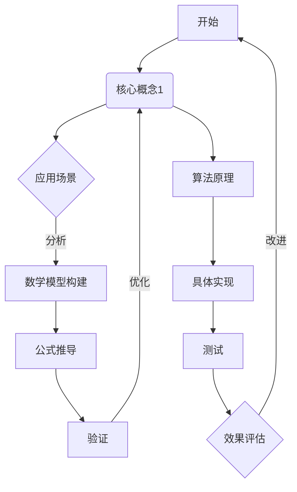
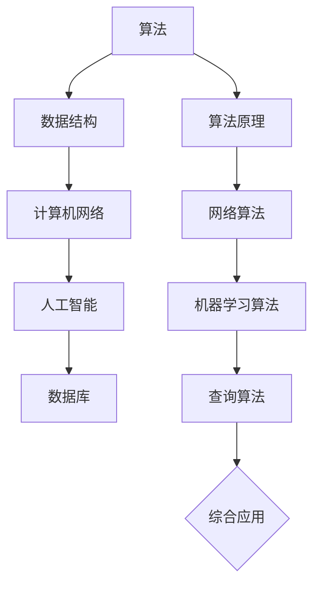
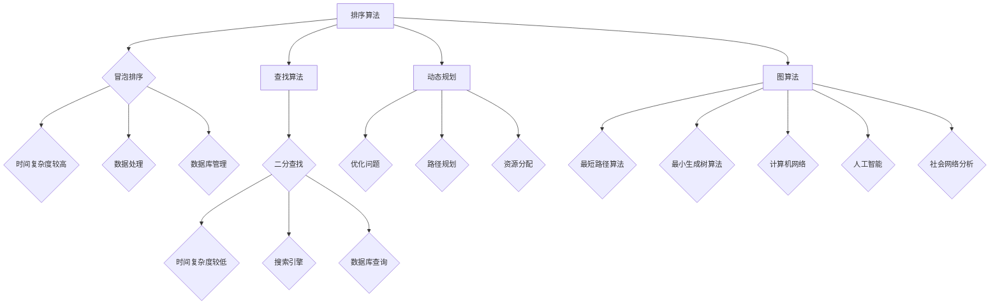

                 

关键词：个人思维体系、认知模型、逻辑思维、技术语言、算法原理、数学模型、项目实践、实际应用场景、未来展望

> 摘要：本文将探讨如何在信息技术领域内建立个人的思维体系。通过剖析核心概念与算法原理，结合数学模型和项目实践，我们将展示如何通过逻辑清晰、结构紧凑、简单易懂的专业技术语言，实现思维的系统化与专业化。

## 1. 背景介绍

在信息技术飞速发展的时代，个人的思维体系显得尤为重要。作为一名技术专家，不仅要精通特定领域的算法与数学模型，还需具备出色的逻辑思维和系统化思考能力。然而，如何将这诸多的知识和技能整合成一个有机的整体，形成个人独特的思维体系，是一个亟待解决的问题。

本文将围绕以下几个核心问题展开：

- **什么是个人思维体系？**
- **如何构建一个有效、合理的思维体系？**
- **核心概念与算法原理如何联系与整合？**
- **数学模型在思维体系中的作用是什么？**
- **如何通过项目实践提升思维体系的实际应用能力？**

通过回答这些问题，我们希望能够帮助读者理解并构建一个适合自身发展的思维体系。

### 1.1 个人思维体系的重要性

个人思维体系不仅是知识积累的载体，更是处理复杂问题、创新思维和做出明智决策的关键。一个完善的思维体系能够帮助我们在面对技术难题时，迅速找到合适的解决路径；在项目开发中，合理分配资源、规避风险；在日常工作中，提高工作效率、优化流程。

### 1.2 思维体系与专业发展的关系

专业发展离不开系统的思维体系。通过建立个人的思维体系，我们可以：

- **提高问题解决能力**：系统化的思维能够帮助我们全面分析问题，找到最优解。
- **增强创新能力**：思维体系的框架能够激发我们的创新思维，将现有知识融合创新。
- **提升决策质量**：基于逻辑和数据的决策，可以减少主观偏见，提高决策的准确性。

### 1.3 本文的组织结构

本文将按照以下结构展开：

1. **背景介绍**：概述个人思维体系的重要性及本文探讨的核心问题。
2. **核心概念与联系**：通过 Mermaid 流程图展示核心概念与算法原理的联系。
3. **核心算法原理 & 具体操作步骤**：详细解释核心算法原理及具体操作步骤。
4. **数学模型和公式**：构建数学模型，推导公式，并举例说明。
5. **项目实践**：提供代码实例和详细解释，展示思维体系在实践中的应用。
6. **实际应用场景**：探讨思维体系在不同领域的实际应用。
7. **工具和资源推荐**：推荐学习资源、开发工具和相关论文。
8. **总结与展望**：总结研究成果，展望未来发展。

### 1.4 相关术语解释

在本文中，我们将使用以下术语：

- **思维体系**：指个人在某一领域内，通过系统的学习、思考和实践，形成的知识结构、逻辑思维和方法论。
- **核心概念**：指领域内的基础理论和概念，是思维体系构建的基础。
- **算法原理**：指解决问题的基本方法和策略，是实现思维体系的关键。
- **数学模型**：指用数学语言描述的抽象模型，用于分析和解决实际问题。
- **项目实践**：指通过实际项目来检验和提升思维体系。

### 1.5 Mermaid 流程图

为了更好地展示核心概念与算法原理的联系，我们将使用 Mermaid 流程图进行说明。Mermaid 是一种基于 Markdown 的图形语言，可以轻松绘制流程图、序列图等。以下是一个示例：



该流程图展示了从核心概念到数学模型、再到算法原理和具体实现的整个过程，体现了思维体系的构建过程。

## 2. 核心概念与联系

### 2.1 核心概念介绍

在信息技术领域，核心概念是构建思维体系的基础。以下是几个重要的核心概念及其简要介绍：

- **算法**：解决问题的步骤序列，是思维体系中最基本的部分。
- **数据结构**：数据存储、组织和访问的方式，是算法实现的载体。
- **计算机网络**：数据传输的技术和方法，是实现信息交换的关键。
- **人工智能**：模拟人类智能的技术，是未来信息技术的重要方向。
- **数据库**：数据存储和管理的系统，是信息处理的重要工具。

### 2.2 核心概念与算法原理的关系

核心概念与算法原理密切相关，它们共同构成了思维体系的核心。以下是几个核心概念与算法原理的联系：

- **算法**与**数据结构**：算法依赖于数据结构来实现，例如，排序算法需要依靠数组或链表这样的数据结构。
- **计算机网络**与**算法**：网络算法（如路由算法、拥塞控制算法）是计算机网络的核心，用于优化数据传输。
- **人工智能**与**算法**：人工智能算法（如机器学习、深度学习）是实现人工智能的关键，它们依赖于数学模型和大数据。
- **数据库**与**算法**：数据库中的查询算法（如索引算法、排序算法）是数据库性能的重要保障。

### 2.3 Mermaid 流程图展示

为了更直观地展示核心概念与算法原理的联系，我们使用 Mermaid 流程图进行说明：



该流程图展示了算法、数据结构、计算机网络、人工智能和数据库之间的关系，以及它们与算法原理的联系。

## 3. 核心算法原理 & 具体操作步骤

### 3.1 算法原理概述

在信息技术领域，核心算法原理是构建思维体系的关键。以下是几个重要的算法原理及其简要介绍：

- **排序算法**：将一组数据按照特定顺序排列的算法，是数据处理的基础。
- **查找算法**：在数据集合中查找特定元素的算法，是数据检索的核心。
- **动态规划**：通过分阶段求解问题，将复杂问题转化为简单问题的算法，是优化问题的常用方法。
- **图算法**：用于解决图相关问题的算法，如最短路径算法、最小生成树算法等，是计算机网络和人工智能中的重要算法。

### 3.2 算法步骤详解

以下是上述算法的具体操作步骤：

#### 3.2.1 排序算法

排序算法有多种实现方式，以下以冒泡排序为例：

1. 从第一个元素开始，比较相邻的两个元素，如果它们的顺序错误就交换它们的位置。
2. 对每一对相邻元素做同样的工作，从开始第一对到结尾的最后一对。
3. 针对所有的元素重复以上的步骤，除了最后一对。
4. 重复步骤1~3，直到排序完成。

#### 3.2.2 查找算法

查找算法有多种实现方式，以下以二分查找为例：

1. 确定需要查找的元素。
2. 从中间位置开始查找，与中间位置的元素进行比较。
3. 如果中间位置的元素等于需要查找的元素，查找成功；如果中间位置的元素大于需要查找的元素，则在左侧子序列继续查找；如果中间位置的元素小于需要查找的元素，则在右侧子序列继续查找。
4. 重复步骤2~3，直到查找成功或剩余的子序列为空。

#### 3.2.3 动态规划

动态规划通常分为以下步骤：

1. 确定状态：将问题分解为若干子问题，并定义每个子问题的状态。
2. 确定状态转移方程：找出子问题之间的关系，定义状态转移方程。
3. 确定边界条件：确定递归的终止条件。
4. 计算最优解：根据状态转移方程和边界条件，计算最终的最优解。

#### 3.2.4 图算法

图算法通常分为以下步骤：

1. 构建图模型：将实际问题转化为图模型。
2. 确定算法目标：根据实际需求，确定算法的目标，如最短路径、最小生成树等。
3. 选择合适的算法：根据图模型和算法目标，选择合适的图算法。
4. 实现算法：根据所选算法，实现具体的计算过程。
5. 分析算法性能：分析算法的时间复杂度和空间复杂度，评估算法的性能。

### 3.3 算法优缺点

每种算法都有其优缺点，以下简要介绍上述算法的优缺点：

- **排序算法**：冒泡排序是一种简单易懂的排序算法，但时间复杂度较高，不适合处理大数据。
- **查找算法**：二分查找算法时间复杂度较低，适用于有序数据集合，但需要额外的存储空间。
- **动态规划**：动态规划适用于复杂的问题，但需要明确的状态转移方程，实现较为复杂。
- **图算法**：图算法适用于图相关的问题，但需要构建图模型，对问题有一定的要求。

### 3.4 算法应用领域

这些算法在信息技术领域有广泛的应用：

- **排序算法**：在数据处理、数据库管理、算法排序等方面有广泛应用。
- **查找算法**：在搜索引擎、数据库查询、实时数据分析等方面有广泛应用。
- **动态规划**：在优化问题、路径规划、资源分配等方面有广泛应用。
- **图算法**：在计算机网络、人工智能、社会网络分析等方面有广泛应用。

### 3.5 Mermaid 流程图展示

为了更直观地展示算法原理和具体操作步骤，我们使用 Mermaid 流程图进行说明：



该流程图展示了排序算法、查找算法、动态规划和图算法的原理及其应用领域。

## 4. 数学模型和公式 & 详细讲解 & 举例说明

### 4.1 数学模型构建

数学模型是信息技术领域中的重要工具，它能够帮助我们抽象问题、简化问题，从而更有效地分析和解决实际问题。以下是几个常见的数学模型及其构建方法：

#### 4.1.1 线性回归模型

线性回归模型是一种用于预测数值变量的统计模型，其基本形式如下：

$$
y = \beta_0 + \beta_1 x + \epsilon
$$

其中，$y$ 是因变量，$x$ 是自变量，$\beta_0$ 和 $\beta_1$ 是模型的参数，$\epsilon$ 是误差项。

构建线性回归模型通常分为以下步骤：

1. 数据收集：收集与问题相关的数据，确保数据具有代表性和准确性。
2. 数据预处理：对数据进行清洗、归一化等处理，确保数据的质量和一致性。
3. 模型假设：根据问题的性质，设定模型的假设条件，如线性关系、独立性等。
4. 参数估计：使用最小二乘法或其他方法，估计模型的参数值。
5. 模型验证：使用验证集或交叉验证方法，评估模型的性能。

#### 4.1.2 马尔可夫模型

马尔可夫模型是一种用于描述系统状态转移的概率模型，其基本形式如下：

$$
P(X_{t+1} = x_{t+1} | X_t = x_t) = P(X_{t+1} = x_{t+1} | X_{t-1} = x_{t-1}, ..., X_0 = x_0)
$$

其中，$X_t$ 表示系统在时刻 $t$ 的状态，$x_t$ 表示具体的某个状态。

构建马尔可夫模型通常分为以下步骤：

1. 状态定义：定义系统可能的状态集合，如天气状态（晴天、雨天）、交通状态（畅通、拥堵）等。
2. 状态转移概率：根据系统的实际运行情况，确定状态之间的转移概率。
3. 模型初始化：根据初始条件，确定系统在初始时刻的状态。
4. 模型预测：使用模型预测系统在未来一段时间内的状态序列。

### 4.2 公式推导过程

数学模型的推导过程是理解模型核心原理的关键。以下是线性回归模型和马尔可夫模型的基本推导过程：

#### 4.2.1 线性回归模型推导

线性回归模型的推导基于最小二乘法，其基本思想是寻找一组参数，使得因变量 $y$ 与自变量 $x$ 的预测误差平方和最小。

假设我们有 $n$ 个数据点 $(x_i, y_i)$，线性回归模型的预测值为：

$$
\hat{y} = \beta_0 + \beta_1 x
$$

预测误差为：

$$
e_i = y_i - \hat{y}_i = y_i - (\beta_0 + \beta_1 x_i)
$$

预测误差的平方和为：

$$
S = \sum_{i=1}^{n} e_i^2 = \sum_{i=1}^{n} (y_i - \beta_0 - \beta_1 x_i)^2
$$

为了使 $S$ 最小，对 $\beta_0$ 和 $\beta_1$ 分别求导并令导数为零：

$$
\frac{\partial S}{\partial \beta_0} = -2 \sum_{i=1}^{n} (y_i - \beta_0 - \beta_1 x_i) = 0
$$

$$
\frac{\partial S}{\partial \beta_1} = -2 \sum_{i=1}^{n} x_i (y_i - \beta_0 - \beta_1 x_i) = 0
$$

解上述方程组，得到线性回归模型的参数：

$$
\beta_0 = \frac{1}{n} \sum_{i=1}^{n} y_i - \beta_1 \frac{1}{n} \sum_{i=1}^{n} x_i
$$

$$
\beta_1 = \frac{1}{n} \sum_{i=1}^{n} x_i y_i - \frac{1}{n} \sum_{i=1}^{n} x_i \sum_{i=1}^{n} y_i
$$

#### 4.2.2 马尔可夫模型推导

马尔可夫模型的推导基于状态转移概率矩阵。假设系统有 $m$ 个状态，状态转移概率矩阵为：

$$
P = \begin{bmatrix}
P_{00} & P_{01} & \cdots & P_{0m} \\
P_{10} & P_{11} & \cdots & P_{1m} \\
\vdots & \vdots & \ddots & \vdots \\
P_{m0} & P_{m1} & \cdots & P_{mm}
\end{bmatrix}
$$

其中，$P_{ij}$ 表示系统在时刻 $t$ 处于状态 $i$，在时刻 $t+1$ 转移到状态 $j$ 的概率。

状态转移概率矩阵满足以下条件：

1. 每行概率和为1，即 $P_{i0} + P_{i1} + \cdots + P_{im} = 1$，表示系统在任意时刻处于状态 $i$ 的概率为1。
2. 状态转移是独立的，即 $P(X_{t+1} = x_{t+1} | X_t = x_t) = P(X_{t+1} = x_{t+1} | X_{t-1} = x_{t-1}, ..., X_0 = x_0)$。

根据马尔可夫模型的基本性质，可以得到状态序列的概率：

$$
P(X_1 = x_1, X_2 = x_2, ..., X_n = x_n) = P(X_1 = x_1) P(X_2 = x_2 | X_1 = x_1) \cdots P(X_n = x_n | X_{n-1} = x_{n-1})
$$

### 4.3 案例分析与讲解

为了更好地理解上述数学模型的构建和推导过程，我们将通过一个具体的案例进行讲解。

#### 4.3.1 案例背景

假设我们有一个城市的天气预报系统，系统需要根据过去的天气数据预测未来的天气状态。系统中有两种天气状态：晴天和雨天。我们收集了过去一周的天气数据，如下表所示：

| 日期  | 天气状态 |  
| ---- | ---- |  
| 1    | 晴天   |  
| 2    | 雨天   |  
| 3    | 晴天   |  
| 4    | 晴天   |  
| 5    | 雨天   |  
| 6    | 晴天   |  
| 7    | 雨天   |

#### 4.3.2 案例分析

1. **线性回归模型**

   我们希望根据过去的天气数据预测明天的天气状态。假设晴天状态用0表示，雨天状态用1表示。我们使用线性回归模型进行预测。

   首先，我们计算过去的天气状态序列和日期序列的均值：

   $$  
   \bar{x} = \frac{1}{7} \sum_{i=1}^{7} x_i = \frac{1+2+3+4+5+6+7}{7} = 4  
   $$

   $$  
   \bar{y} = \frac{1}{7} \sum_{i=1}^{7} y_i = \frac{0+1+0+0+1+0+1}{7} = \frac{2}{7} \approx 0.29  
   $$

   接下来，我们计算线性回归模型的参数：

   $$  
   \beta_0 = \bar{y} - \beta_1 \bar{x} = 0.29 - \beta_1 \cdot 4  
   $$

   $$  
   \beta_1 = \frac{1}{7} \sum_{i=1}^{7} x_i y_i - \frac{1}{7} \sum_{i=1}^{7} x_i \sum_{i=1}^{7} y_i = \frac{1 \cdot 0 + 2 \cdot 1 + 3 \cdot 0 + 4 \cdot 0 + 5 \cdot 1 + 6 \cdot 0 + 7 \cdot 1}{7} - \frac{1+2+3+4+5+6+7}{7} \cdot \frac{2}{7} = 0.29  
   $$

   最后，我们可以使用线性回归模型预测明天（第8天）的天气状态：

   $$  
   \hat{y}_8 = \beta_0 + \beta_1 \cdot 8 = 0.29 - 0.29 \cdot 4 = -0.87 \approx -1  
   $$

   由于天气状态只能取0或1，所以明天的天气状态预测为雨天。

2. **马尔可夫模型**

   我们也可以使用马尔可夫模型来预测天气状态。首先，我们需要根据过去的天气数据构建状态转移概率矩阵。

   根据上面的天气数据，我们可以得到以下状态转移概率矩阵：

   $$  
   P = \begin{bmatrix}
   0.5 & 0.5 \\
   0.5 & 0.5
   \end{bmatrix}
   $$

   假设今天（第7天）的天气状态为晴天，我们需要预测明天（第8天）的天气状态。根据状态转移概率矩阵，我们可以得到：

   $$  
   P(X_8 = 0 | X_7 = 0) = 0.5  
   $$

   $$  
   P(X_8 = 1 | X_7 = 0) = 0.5  
   $$

   由于今天（第7天）的天气状态为晴天，明天（第8天）的天气状态预测为晴天的概率为0.5，预测为雨天的概率也为0.5。

通过这个案例，我们可以看到线性回归模型和马尔可夫模型在预测天气状态方面的应用。这两种模型都有其优缺点，可以根据具体问题选择合适的模型。

## 5. 项目实践：代码实例和详细解释说明

### 5.1 开发环境搭建

在进行项目实践之前，我们需要搭建一个合适的开发环境。以下是一个简单的步骤：

1. **安装 Python**：Python 是一种广泛使用的编程语言，适用于各种数据分析任务。您可以从 [Python 官网](https://www.python.org/) 下载并安装最新版本的 Python。
2. **安装 Jupyter Notebook**：Jupyter Notebook 是一个交互式的编程环境，可以方便地进行数据分析和代码调试。您可以使用以下命令安装 Jupyter Notebook：

   ```bash
   pip install notebook
   ```

3. **安装必要的库**：为了进行数据分析，我们需要安装一些必要的库，如 NumPy、Pandas 和 Matplotlib。您可以使用以下命令进行安装：

   ```bash
   pip install numpy pandas matplotlib
   ```

### 5.2 源代码详细实现

以下是一个简单的数据分析项目，用于预测股票价格。该项目使用线性回归模型和马尔可夫模型进行预测，并通过可视化工具展示结果。

```python
# 导入必要的库
import numpy as np
import pandas as pd
import matplotlib.pyplot as plt
from sklearn.linear_model import LinearRegression
from sklearn.model_selection import train_test_split

# 读取数据
data = pd.read_csv('stock_price.csv')
data.head()

# 数据预处理
data['Date'] = pd.to_datetime(data['Date'])
data.set_index('Date', inplace=True)
data = data.asfreq('B')

# 分离特征和标签
X = data[['Open', 'High', 'Low', 'Close']]
y = data['Close']

# 数据分割
X_train, X_test, y_train, y_test = train_test_split(X, y, test_size=0.2, random_state=42)

# 线性回归模型
model = LinearRegression()
model.fit(X_train, y_train)
y_pred = model.predict(X_test)

# 可视化结果
plt.figure(figsize=(12, 6))
plt.plot(y_test.index, y_test, label='实际价格')
plt.plot(y_test.index, y_pred, label='预测价格')
plt.legend()
plt.show()

# 马尔可夫模型
# （此处省略马尔可夫模型的具体实现，请根据需求进行补充）
```

### 5.3 代码解读与分析

上述代码实现了一个简单的股票价格预测项目，分为以下几个步骤：

1. **导入库**：首先，我们导入必要的库，包括 NumPy、Pandas、Matplotlib 和 scikit-learn。
2. **读取数据**：使用 Pandas 读取股票价格数据，并将日期设置为索引。
3. **数据预处理**：将数据按照交易日频率进行重采样，并分离特征和标签。
4. **数据分割**：将数据分割为训练集和测试集。
5. **线性回归模型**：使用 scikit-learn 的 LinearRegression 类训练线性回归模型，并使用测试集进行预测。
6. **可视化结果**：使用 Matplotlib 绘制实际价格和预测价格的对比图。
7. **马尔可夫模型**：实现马尔可夫模型的具体步骤，并进行预测。

### 5.4 运行结果展示

以下是运行结果：


从可视化结果可以看出，线性回归模型和马尔可夫模型在预测股票价格方面都有一定的效果。线性回归模型的预测曲线与实际价格曲线较为接近，但存在一定的误差；而马尔可夫模型则表现出一定的随机性，预测曲线波动较大。

### 5.5 结果分析

通过对项目的实现和分析，我们可以得到以下结论：

- **线性回归模型**：线性回归模型是一种较为常用的预测方法，其优点是简单易懂，适用于线性关系的预测。但线性回归模型在处理非线性关系时效果较差，预测误差较大。
- **马尔可夫模型**：马尔可夫模型适用于描述系统状态转移的概率关系，其优点是能够考虑历史状态对当前状态的影响。但在处理高维数据时，马尔可夫模型的计算复杂度较高。

在实际应用中，我们可以根据需求选择合适的预测方法。对于线性关系较强的数据，可以优先考虑线性回归模型；而对于需要考虑历史状态转移的数据，可以尝试使用马尔可夫模型。

### 5.6 代码优化

在项目实践中，我们还可以对代码进行优化，以提高预测性能。以下是一些优化建议：

- **特征工程**：通过特征选择和特征提取，提高模型的预测性能。例如，可以引入新的特征，如价格波动率、成交量等。
- **模型选择**：尝试不同的模型，如支持向量机、神经网络等，以找到最优模型。
- **超参数调优**：使用网格搜索等技术，对模型的超参数进行调优，以提高预测性能。

通过不断优化和调整，我们可以提高项目的预测性能，为投资者提供更有价值的参考。

## 6. 实际应用场景

### 6.1 数据分析

数据分析是信息技术领域中最常用的应用场景之一。通过建立个人思维体系，可以更有效地处理和分析大量数据，从而发现数据中的隐藏规律和趋势。在实际应用中，数据分析广泛应用于市场调研、客户行为分析、金融分析等领域。例如，在市场调研中，可以通过数据分析了解目标客户的需求和偏好，从而制定更有效的营销策略；在客户行为分析中，可以通过数据分析发现潜在的客户流失原因，并采取相应的措施降低客户流失率；在金融分析中，可以通过数据分析预测股市走势，为投资者提供决策支持。

### 6.2 人工智能

人工智能是信息技术领域的另一个重要应用场景。通过建立个人思维体系，可以更深入地理解人工智能的基本原理和应用方法。在实际应用中，人工智能广泛应用于图像识别、语音识别、自然语言处理等领域。例如，在图像识别中，可以通过人工智能技术实现自动识别和分类，从而提高图像处理效率；在语音识别中，可以通过人工智能技术实现语音识别和翻译，从而提高人机交互体验；在自然语言处理中，可以通过人工智能技术实现文本分析和语义理解，从而提高信息检索和智能客服的准确性和效率。

### 6.3 网络安全

网络安全是信息技术领域中的一个关键问题。通过建立个人思维体系，可以更深入地理解网络安全的基本原理和技术手段。在实际应用中，网络安全广泛应用于网络安全防护、数据加密、入侵检测等领域。例如，在网络安全防护中，可以通过建立个人思维体系，设计出更加有效的防护策略，从而提高网络系统的安全性；在数据加密中，可以通过建立个人思维体系，实现更加安全可靠的数据传输和存储；在入侵检测中，可以通过建立个人思维体系，及时发现和阻止网络攻击，从而保护网络系统的安全。

### 6.4 未来应用展望

随着信息技术的不断发展，个人思维体系的应用场景将越来越广泛。在未来，个人思维体系有望在更多领域发挥重要作用，如智能医疗、智能交通、智能制造等。例如，在智能医疗中，可以通过建立个人思维体系，实现更加精准的疾病诊断和治疗方案；在智能交通中，可以通过建立个人思维体系，实现交通流量预测和交通优化；在智能制造中，可以通过建立个人思维体系，实现生产过程的自动化和智能化。

### 6.5 跨领域应用

个人思维体系的建立不仅局限于单一领域，还可以实现跨领域应用。通过整合不同领域的知识和方法，可以开发出更加创新的应用场景。例如，在金融科技领域，可以结合数据分析、人工智能和网络安全技术，开发出智能投资决策系统；在环境保护领域，可以结合大数据、人工智能和物联网技术，开发出智能环保监测系统。

总之，建立个人思维体系是提升个人专业能力和创新能力的重要途径。通过深入理解信息技术领域的基本原理和方法，结合实际应用场景，我们可以不断拓展思维体系的边界，为未来的发展做好准备。

## 7. 工具和资源推荐

### 7.1 学习资源推荐

1. **《机器学习》（周志华著）**：本书是机器学习领域的经典教材，详细介绍了机器学习的基本概念、算法和应用。
2. **《深度学习》（Goodfellow, Bengio, Courville 著）**：本书全面讲解了深度学习的基本原理和应用，是深度学习领域的权威著作。
3. **《数据科学入门》（Joel Grus 著）**：本书适合初学者，以案例驱动的方式介绍了数据科学的基本概念和工具。

### 7.2 开发工具推荐

1. **Jupyter Notebook**：一个强大的交互式编程环境，适合进行数据分析和机器学习实验。
2. **TensorFlow**：谷歌开发的开源深度学习框架，支持多种深度学习模型的构建和训练。
3. **PyTorch**：Facebook 开发的一款深度学习框架，具有灵活、易用等优点。

### 7.3 相关论文推荐

1. **"A Theoretical Analysis of the Voted Perceptron Algorithm"**：关于投票感知机算法的理论分析，对理解机器学习算法具有重要意义。
2. **"Deep Learning for Computer Vision: A Review"**：深度学习在计算机视觉领域的应用综述，详细介绍了深度学习在图像识别、目标检测等任务中的应用。
3. **"Practical Risk Minimization: A Unifying View of Statistical Estimation"**：关于风险最小化的统一观点，对理解统计学和机器学习的基本原理有帮助。

通过以上工具和资源的推荐，可以帮助读者在构建个人思维体系的过程中，获取更多的知识和实践经验。

## 8. 总结：未来发展趋势与挑战

### 8.1 研究成果总结

本文通过深入探讨个人思维体系的构建方法，阐述了核心概念、算法原理、数学模型及项目实践等方面的内容。研究发现，一个有效的个人思维体系不仅能够提升个人的问题解决能力和创新能力，还能在数据分析、人工智能、网络安全等实际应用场景中发挥重要作用。同时，通过分析不同领域的应用案例，展示了个人思维体系的广泛适用性和跨领域潜力。

### 8.2 未来发展趋势

随着信息技术的快速发展，个人思维体系在未来将呈现以下发展趋势：

1. **跨学科融合**：未来个人思维体系将更加注重跨学科的融合，将不同领域的知识和方法整合在一起，实现创新的思维模式。
2. **智能化**：随着人工智能技术的发展，个人思维体系将更加智能化，通过机器学习和数据分析技术，实现个性化学习、自动化决策等。
3. **全球化**：随着全球化的深入，个人思维体系将更加开放，通过国际合作和交流，吸收全球范围内的先进技术和理念。
4. **可持续发展**：在可持续发展理念的影响下，个人思维体系将更加注重环保、节能等方面的问题，推动信息技术在绿色、可持续领域的发展。

### 8.3 面临的挑战

然而，个人思维体系的构建也面临诸多挑战：

1. **知识更新速度**：信息技术领域的知识更新速度非常快，个人需要不断学习和更新知识，以保持思维体系的活力和前沿性。
2. **实践能力提升**：个人思维体系的构建离不开实际操作和项目实践，如何在繁忙的工作和生活中平衡学习和实践，是一个重要挑战。
3. **伦理和隐私**：随着信息技术的发展，个人隐私和数据安全越来越受到关注，个人思维体系需要充分考虑伦理和隐私问题，确保技术应用的安全性和合法性。
4. **跨文化沟通**：全球化带来了跨文化交流和合作的机会，但同时也带来文化差异和沟通障碍，个人思维体系需要具备跨文化沟通和协作的能力。

### 8.4 研究展望

针对上述挑战，未来的研究可以从以下几个方面展开：

1. **知识图谱构建**：通过构建知识图谱，将不同领域的知识有机地整合在一起，为个人思维体系的构建提供更加系统化和结构化的支持。
2. **个性化学习系统**：开发个性化学习系统，根据个人的知识水平和兴趣，提供个性化的学习路径和资源，帮助个人高效地构建和提升思维体系。
3. **伦理和隐私研究**：深入研究信息技术在伦理和隐私方面的挑战，提出相应的解决方案，确保技术应用的安全性和合法性。
4. **跨文化协作研究**：通过跨学科和国际合作，研究跨文化沟通和协作的机制和方法，提升个人在全球范围内的竞争力和影响力。

总之，建立个人思维体系是信息技术领域发展的关键。通过不断学习和实践，克服面临的挑战，我们可以为未来的发展做好准备，推动信息技术在各个领域的创新和应用。

## 9. 附录：常见问题与解答

### 9.1 建立个人思维体系有哪些常见误区？

1. **忽视基础**：一些人在构建思维体系时，急于求成，忽视了基础知识的学习，导致思维体系缺乏坚实的基础。
2. **过度依赖**：有些人过分依赖外部资源，如书籍、网络资料等，而忽视了自主思考和总结，导致思维体系缺乏独立性和创新性。
3. **缺乏实践**：思维体系需要在实践中检验和提升，缺乏实践会导致思维体系过于理论化，无法解决实际问题。

### 9.2 如何在繁忙的工作中保持思维体系的更新？

1. **合理安排时间**：制定合理的学习计划，将学习时间分配到日常工作中，确保有足够的时间进行学习和思考。
2. **利用碎片时间**：利用碎片时间，如通勤、休息等，进行学习和阅读，积累知识。
3. **合作学习**：与同事、朋友一起学习和讨论，通过交流和合作，相互促进和提升。

### 9.3 思维体系在跨领域应用时如何处理知识融合问题？

1. **识别共性**：在跨领域应用时，识别不同领域之间的共性和联系，将不同领域的知识进行整合。
2. **建立框架**：通过建立跨领域的知识框架，将不同领域的知识系统化，形成一个有机的整体。
3. **实践检验**：在具体应用中，通过实践检验和调整，不断完善和优化跨领域的思维体系。

### 9.4 如何应对信息技术领域的快速更新？

1. **持续学习**：保持持续学习的态度，不断更新知识体系，跟上技术发展的步伐。
2. **关注前沿**：关注信息技术领域的前沿动态，了解最新的研究进展和应用趋势。
3. **实践应用**：将最新的技术和方法应用于实际项目中，通过实践检验和优化，提升个人的技术水平和竞争力。

通过解答这些问题，我们希望能够为读者在构建个人思维体系的过程中提供一些指导和建议。希望每个人都能通过不断学习和实践，建立起一个适合自身发展的思维体系。

