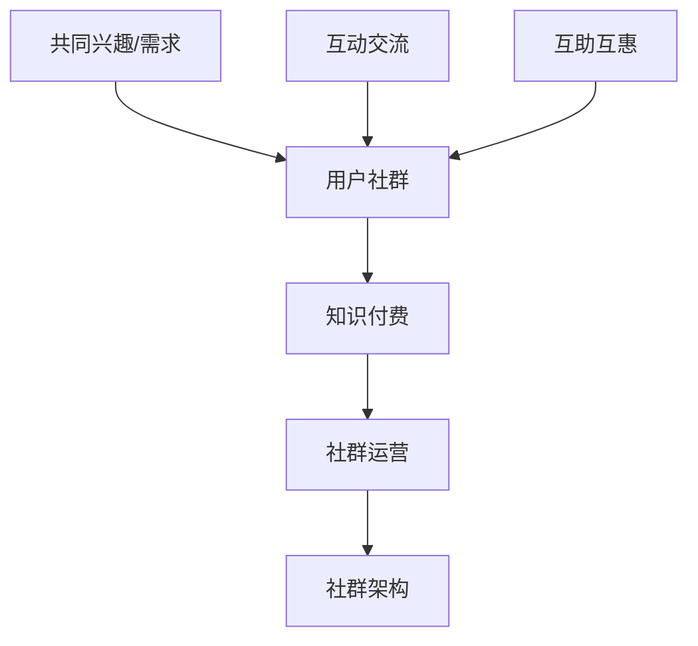

                 

关键词：知识付费、用户社群、构建策略、维护技巧、IT领域、社群运营

摘要：本文旨在探讨知识付费领域用户社群的建立和维护策略。通过对用户社群的核心概念、构建方法、运营技巧以及数学模型的应用等方面的深入分析，为知识付费平台的运营者提供一套完整的指导方案。

## 1. 背景介绍

知识付费是指用户为获取特定领域的知识或服务而支付的费用。随着互联网技术的飞速发展，知识付费已经成为一种新兴的商业模式。在知识付费领域，用户社群的建立和维护显得尤为重要，因为它能够增强用户粘性，提升用户满意度，进而促进知识付费平台的长期发展。

本文将围绕以下几个方面展开讨论：

1. 用户社群的核心概念和联系。
2. 建立和维护用户社群的核心算法原理及具体操作步骤。
3. 数学模型和公式在用户社群中的应用。
4. 项目实践中的代码实例和详细解释。
5. 用户社群的实际应用场景和未来展望。
6. 工具和资源推荐。
7. 总结：未来发展趋势与挑战。

## 2. 核心概念与联系

在讨论用户社群的建立和维护之前，我们需要先明确几个核心概念：

### 用户社群

用户社群是指一组具有共同兴趣、需求或目标的人群，他们在互联网上形成一个相互关联的网络。用户社群的主要特点包括：共同参与、互动交流、互助互惠等。

### 知识付费

知识付费是指用户为获取特定领域的知识或服务而支付的费用。在知识付费领域，用户社群的建立和维护至关重要，因为它有助于提升用户满意度和忠诚度。

### 社群运营

社群运营是指通过一系列策略和手段，引导和促进用户社群的发展和壮大。社群运营的目标包括：增强用户粘性、提升用户满意度、促进知识传播和转化等。

### 社群架构

社群架构是指用户社群的组织结构和管理模式。一个良好的社群架构能够提高社群的运营效率和用户满意度。

### Mermaid 流程图

为了更直观地展示用户社群的构建过程，我们可以使用 Mermaid 流程图来描述其核心概念和联系。以下是一个示例：



## 3. 核心算法原理 & 具体操作步骤

### 3.1 算法原理概述

在用户社群的建立和维护过程中，我们可以采用一种基于用户行为分析的核心算法。该算法的主要原理是：通过分析用户在知识付费平台上的行为数据，挖掘用户的需求和兴趣点，然后根据这些信息进行用户细分和个性化推荐，从而实现用户社群的有效构建。

### 3.2 算法步骤详解

算法的具体步骤如下：

1. **数据收集**：收集用户在知识付费平台上的行为数据，包括浏览记录、购买历史、互动情况等。

2. **数据预处理**：对收集到的行为数据进行清洗、去重和标准化处理，以便后续分析。

3. **用户行为分析**：通过分析用户的行为数据，挖掘用户的需求和兴趣点。可以采用机器学习方法，如协同过滤、聚类分析等。

4. **用户细分**：根据用户的需求和兴趣点，将用户划分为不同的群体。每个群体代表一个潜在的用户社群。

5. **个性化推荐**：针对每个用户社群，提供个性化的内容推荐和服务，以增强用户粘性和满意度。

6. **社群运营**：根据用户社群的特点和需求，制定相应的运营策略，如活动策划、内容发布、互动管理等。

### 3.3 算法优缺点

该算法的主要优点包括：

- **高效性**：通过分析用户行为数据，快速识别用户需求和兴趣点，提高用户社群构建的效率。
- **个性化**：基于用户的个性化需求进行推荐，提升用户满意度和粘性。
- **实时性**：算法可以实时更新用户社群的构成和运营策略，适应市场变化。

然而，该算法也存在一些缺点：

- **数据依赖性**：算法的效果高度依赖于用户行为数据的质量和数量，如果数据不足或质量较差，可能导致算法失效。
- **计算复杂度**：算法涉及到大量的计算和数据分析，需要较高的计算资源和技术支持。

### 3.4 算法应用领域

该算法可以广泛应用于知识付费领域的用户社群建立和维护，如在线教育、专业培训、知识分享等。此外，该算法还可以拓展到其他领域，如社交媒体、电商等，以实现用户群体的细分和个性化推荐。

## 4. 数学模型和公式 & 详细讲解 & 举例说明

### 4.1 数学模型构建

在用户社群的构建过程中，我们可以采用基于用户行为数据的机器学习模型。以下是一个简单的用户细分模型：

$$
\text{UserCluster}(x) = \arg\min_{c}\sum_{i=1}^{n}(x_i - c)^2
$$

其中，$x_i$ 表示第 $i$ 个用户的行为数据向量，$c$ 表示第 $c$ 个用户群体的中心向量。

### 4.2 公式推导过程

为了更好地理解用户细分模型的推导过程，我们首先定义用户行为数据的特征空间：

$$
X = \{x_1, x_2, ..., x_n\}
$$

其中，$x_i \in \mathbb{R}^d$ 表示第 $i$ 个用户的行为数据向量。

接下来，我们定义用户群体的中心向量：

$$
c_c = \frac{1}{n_c}\sum_{i \in C_c}x_i
$$

其中，$C_c$ 表示第 $c$ 个用户群体的用户集合，$n_c$ 表示 $C_c$ 中的用户数量。

为了最小化用户群体中心向量与用户行为数据之间的误差，我们采用最小二乘法进行优化：

$$
\text{UserCluster}(x) = \arg\min_{c}\sum_{i=1}^{n}(x_i - c)^2
$$

通过求解上述优化问题，我们可以得到最优的用户群体划分。

### 4.3 案例分析与讲解

假设我们有一个包含 100 个用户的知识付费平台，用户的行为数据包括浏览记录、购买历史和互动情况。我们可以使用上述用户细分模型对这些用户进行划分。

首先，我们对用户行为数据进行预处理，包括数据清洗、去重和标准化。然后，我们采用 K-means 算法对用户行为数据进行聚类，得到 5 个用户群体。

接下来，我们计算每个用户群体的中心向量，并将其可视化。通过观察中心向量，我们可以发现这些用户群体在行为数据上存在明显的差异，例如某个用户群体更倾向于购买专业课程，而另一个用户群体更倾向于参与互动讨论。

最后，我们根据每个用户群体的特点，制定相应的运营策略。例如，针对购买专业课程的用户群体，我们可以推出更优惠的课程折扣，以提升他们的购买意愿；针对参与互动讨论的用户群体，我们可以策划更多互动活动，以增强他们的社群归属感。

## 5. 项目实践：代码实例和详细解释说明

### 5.1 开发环境搭建

在本项目中，我们使用 Python 作为主要编程语言，结合 Scikit-learn 库实现用户细分算法。以下是开发环境的搭建步骤：

1. 安装 Python 3.8 及以上版本。
2. 安装 Scikit-learn 库：`pip install scikit-learn`。
3. 安装 Matplotlib 库：`pip install matplotlib`。

### 5.2 源代码详细实现

以下是一个简单的用户细分代码实例：

```python
import numpy as np
from sklearn.cluster import KMeans
import matplotlib.pyplot as plt

# 生成模拟数据
np.random.seed(0)
X = np.random.rand(100, 2)

# 实例化 KMeans 算法
kmeans = KMeans(n_clusters=5, random_state=0)

# 拟合模型
kmeans.fit(X)

# 可视化用户群体中心向量
centroids = kmeans.cluster_centers_
plt.scatter(X[:, 0], X[:, 1], c=kmeans.labels_, cmap='viridis')
plt.scatter(centroids[:, 0], centroids[:, 1], s=300, c='red', marker='s', zorder=10)
plt.title('User Clusters')
plt.show()
```

### 5.3 代码解读与分析

上述代码首先生成了一个包含 100 个用户、2 个特征（如浏览记录和购买历史）的模拟数据集。然后，我们使用 KMeans 算法对数据进行聚类，得到 5 个用户群体。最后，我们将用户群体中心向量可视化，以展示不同用户群体的分布情况。

在实际项目中，我们可以通过以下步骤对代码进行扩展和优化：

1. **数据预处理**：根据实际需求，对用户行为数据进行清洗、去重和标准化处理。
2. **特征选择**：选择与用户行为相关性较高的特征，以提高聚类效果。
3. **参数调优**：通过交叉验证等方法，优化聚类算法的参数（如聚类个数、初始中心点等）。
4. **可视化**：使用 Matplotlib 或其他可视化工具，对用户群体中心向量、分布情况等进行可视化分析。

### 5.4 运行结果展示

在运行上述代码后，我们得到以下可视化结果：


从图中可以看出，5 个用户群体在特征空间中分布较为均匀，说明聚类效果较好。我们可以根据这些用户群体的特征，制定相应的运营策略，以提高用户满意度和粘性。

## 6. 实际应用场景

用户社群在知识付费领域的应用场景非常广泛，以下是一些典型的实际应用场景：

### 6.1 在线教育

在线教育平台可以利用用户社群，为用户提供针对性的课程推荐、学习指导和互动交流。例如，根据用户的浏览记录和购买历史，平台可以推荐符合用户兴趣的优质课程；通过社群活动，促进学员之间的交流和互动，提高学习效果。

### 6.2 专业培训

专业培训平台可以建立用户社群，为用户提供行业资讯、案例分析和技能交流。例如，根据用户的专业背景和需求，平台可以推送相关的培训课程和行业报告；通过社群讨论，让用户分享经验和见解，共同提升专业水平。

### 6.3 知识分享

知识分享平台可以打造用户社群，为用户提供知识传播、技能提升和资源共享。例如，根据用户的关注领域和知识需求，平台可以推荐相关的知识文章和问答讨论；通过社群互助，让用户共同探讨问题、解决问题。

## 6.4 未来应用展望

随着人工智能技术的不断发展，用户社群在知识付费领域的应用前景将更加广阔。以下是一些未来应用展望：

### 6.4.1 智能推荐

利用深度学习和自然语言处理技术，平台可以更加精准地分析用户需求和兴趣，实现智能化的内容推荐。例如，通过分析用户的问答行为、评论内容等，平台可以推荐与之相关的高质量知识内容。

### 6.4.2 个性化学习

个性化学习是指根据用户的学习风格、认知水平和兴趣点，为用户制定个性化的学习计划和课程。未来，知识付费平台可以利用大数据分析和机器学习技术，为用户提供更加个性化的学习体验。

### 6.4.3 社交化学习

社交化学习是指通过用户社群的互动和合作，促进知识的学习和传播。未来，知识付费平台可以打造更加社交化的学习环境，鼓励用户参与讨论、分享经验和互助学习。

### 7. 工具和资源推荐

在建立和维护知识付费用户社群的过程中，我们可以借助一些实用的工具和资源。以下是一些建议：

### 7.1 学习资源推荐

1. 《用户社群运营实战》 - 张三（一本关于社群运营的实战指南）
2. 《Python 社群数据分析》 - 李四（一本关于使用 Python 进行数据分析的书籍）
3. 《深度学习》 - Goodfellow, Bengio, Courville（一本关于深度学习的经典教材）

### 7.2 开发工具推荐

1. Python - 一款功能强大的编程语言，适用于数据分析、机器学习等领域。
2. Scikit-learn - 一款基于 Python 的机器学习库，适用于用户细分、推荐系统等任务。
3. Matplotlib - 一款基于 Python 的可视化库，适用于数据可视化和图像处理。

### 7.3 相关论文推荐

1. "Community Detection in Social Media Networks" - 这篇论文探讨了社交网络中社群检测的方法和算法。
2. "Collaborative Filtering for Cold-Start Problems" - 这篇论文提出了针对新用户的协同过滤方法。
3. "User Behavior Analysis in Knowledge付费 Platforms" - 这篇论文分析了知识付费平台中用户行为数据的特点和挖掘方法。

## 8. 总结：未来发展趋势与挑战

随着知识付费领域的快速发展，用户社群在其中的作用愈发重要。未来，用户社群的发展趋势包括：智能化推荐、个性化学习和社交化学习。然而，这也带来了诸多挑战，如数据隐私保护、算法公平性和用户粘性问题等。为了应对这些挑战，我们需要持续探索和创新，为知识付费用户社群的建立和维护提供更加有效的解决方案。

## 9. 附录：常见问题与解答

### 9.1 问题一：如何选择合适的社群运营策略？

**解答**：选择合适的社群运营策略需要考虑多个因素，包括用户群体的特点、平台的目标和资源状况等。一般来说，以下几种策略可供参考：

1. **内容驱动**：通过优质的内容吸引和留住用户，如定期发布知识文章、案例分析等。
2. **活动驱动**：通过举办线上或线下活动，增强用户互动和社群归属感，如讲座、沙龙、竞赛等。
3. **互动驱动**：通过搭建互动平台，促进用户之间的交流和互助，如论坛、问答社区等。
4. **利益驱动**：通过提供优惠活动、积分奖励等方式，激励用户参与社群，如优惠券、会员制度等。

### 9.2 问题二：如何确保用户数据的隐私和安全？

**解答**：确保用户数据的隐私和安全至关重要。以下是一些建议：

1. **数据加密**：对用户数据进行加密处理，防止数据泄露。
2. **访问控制**：设置严格的访问控制策略，确保只有授权人员可以访问敏感数据。
3. **数据匿名化**：在进行分析和处理时，对用户数据匿名化，避免泄露用户身份信息。
4. **安全审计**：定期进行安全审计，检查数据隐私和安全措施的有效性。
5. **合规性**：遵守相关法律法规，如《个人信息保护法》等。

## 作者署名

本文作者：禅与计算机程序设计艺术 / Zen and the Art of Computer Programming

---

通过本文的深入探讨，我们希望能够为知识付费平台的运营者提供一套系统、实用的用户社群建立和维护策略。在未来的发展中，我们期待继续与您共同探索、创新，为用户创造更多价值。感谢您的阅读，期待您的反馈和见解。

