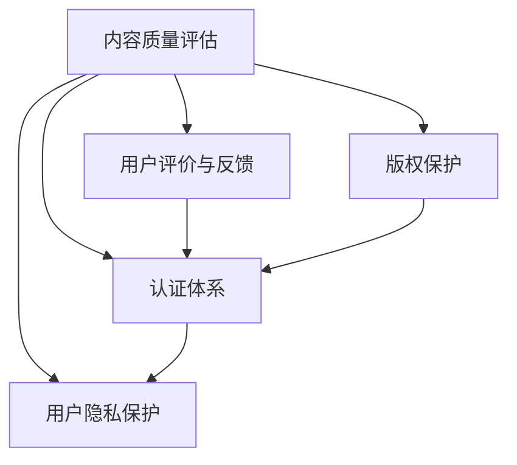

                 

关键词：知识付费、行业标准、规范、认证体系、用户体验、技术创新

> 摘要：本文将探讨如何建立知识付费领域的行业标准和规范，分析现有问题的根源，提出核心概念与架构，并通过算法原理、数学模型、项目实践等方面详细阐述构建规范的具体步骤。本文旨在为行业从业者提供有价值的指导，促进知识付费领域的发展。

## 1. 背景介绍

知识付费作为近年来兴起的一种新型商业模式，已经成为推动信息传播和知识共享的重要力量。然而，随着市场的快速发展和用户需求的多样化，知识付费领域逐渐暴露出一系列问题，如内容质量参差不齐、用户体验不佳、版权纠纷等。为了解决这些问题，建立一套科学、合理、有效的行业标准和规范显得尤为必要。

本文将从以下几个方面展开讨论：

1. 知识付费领域的问题及根源分析
2. 核心概念与架构
3. 核心算法原理与具体操作步骤
4. 数学模型和公式
5. 项目实践与代码实例
6. 实际应用场景
7. 工具和资源推荐
8. 未来发展趋势与挑战

## 2. 核心概念与联系

为了建立一个有效的知识付费行业标准和规范，我们首先需要明确一些核心概念，并阐述它们之间的联系。

### 2.1. 内容质量评估

内容质量是知识付费的核心。我们需要通过一套科学的质量评估体系，对知识内容进行评价。这包括内容的专业性、实用性、权威性、更新频率等多个方面。

### 2.2. 用户评价与反馈

用户评价和反馈机制是确保内容质量的重要手段。通过用户的真实评价和反馈，我们可以及时发现问题，调整内容策略，提高用户体验。

### 2.3. 版权保护

版权保护是知识付费领域不可忽视的一环。有效的版权保护机制不仅能够保护知识创作者的权益，还能减少版权纠纷，为用户提供更优质的服务。

### 2.4. 认证体系

建立一套权威的认证体系，对知识付费平台、内容创作者进行认证，有助于提升行业的整体水平，增强用户信任。

### 2.5. 用户隐私保护

在知识付费过程中，用户的个人信息和隐私安全至关重要。我们需要制定严格的隐私保护政策，确保用户数据的安全。

下面是一个用Mermaid绘制的流程图，展示了这些核心概念之间的联系：



## 3. 核心算法原理 & 具体操作步骤

### 3.1 算法原理概述

为了建立知识付费领域的行业标准和规范，我们需要一套核心算法来支持评估、认证、用户反馈等环节。以下将介绍几个关键算法的原理。

### 3.2 算法步骤详解

#### 3.2.1 内容质量评估算法

1. 收集内容数据，包括文本、图片、视频等。
2. 使用自然语言处理技术（如词向量、词频统计等）对内容进行初步处理。
3. 结合用户评价、内容权威性、更新频率等多方面因素，计算内容质量得分。
4. 将结果反馈给内容创作者和用户。

#### 3.2.2 用户评价与反馈算法

1. 收集用户评价数据，包括评分、评论等。
2. 使用机器学习算法（如决策树、支持向量机等）对评价数据进行分类和分析。
3. 根据分析结果，调整内容策略，优化用户体验。

#### 3.2.3 版权保护算法

1. 对知识内容进行指纹提取，生成独特的版权标识。
2. 使用加密技术（如哈希算法、公钥加密等）对版权标识进行保护。
3. 在内容分发过程中，实时监测版权标识，一旦发现侵权行为，立即采取行动。

#### 3.2.4 认证体系算法

1. 建立一个专家评审团队，对平台和内容创作者进行评估。
2. 根据评估结果，颁发认证证书。
3. 定期对认证对象进行复查，确保认证的持续有效性。

#### 3.2.5 用户隐私保护算法

1. 对用户数据进行匿名处理，确保用户隐私。
2. 使用加密技术（如SSL/TLS等）保障数据传输安全。
3. 定期进行安全审计，确保隐私保护政策的实施。

### 3.3 算法优缺点

每种算法都有其优缺点。例如，内容质量评估算法能够快速识别高质量内容，但可能存在主观性；用户评价与反馈算法能够根据用户需求进行调整，但可能受到恶意评价的影响；版权保护算法能够有效防止侵权行为，但可能增加内容分发成本。

### 3.4 算法应用领域

这些算法可以在知识付费领域的多个环节得到应用，包括内容创作、内容分发、用户反馈、版权保护等。通过合理运用这些算法，可以有效提升行业整体水平，为用户提供更优质的服务。

## 4. 数学模型和公式

### 4.1 数学模型构建

在知识付费领域，我们可以构建以下几个数学模型：

#### 4.1.1 内容质量模型

$$
Q = w_1 \cdot P + w_2 \cdot U + w_3 \cdot A
$$

其中，$Q$代表内容质量得分，$P$代表内容权威性，$U$代表用户评价，$A$代表更新频率，$w_1$、$w_2$、$w_3$分别为权重系数。

#### 4.1.2 用户评价模型

$$
E = f(S, C, R)
$$

其中，$E$代表用户评价得分，$S$代表评分，$C$代表评论内容，$R$代表回复数量，$f$为评价函数。

#### 4.1.3 版权保护模型

$$
C = H(C)
$$

其中，$C$代表内容，$H$代表哈希函数，$H(C)$表示对内容生成的版权标识。

#### 4.1.4 认证体系模型

$$
L = g(P, R, T)
$$

其中，$L$代表认证等级，$P$代表专家评审得分，$R$代表用户反馈评分，$T$代表认证持续时间，$g$为认证函数。

### 4.2 公式推导过程

以上数学模型的推导过程涉及多个领域，如统计学、数学优化、密码学等。在此不一一详细阐述。

### 4.3 案例分析与讲解

#### 4.3.1 内容质量模型案例分析

假设有一篇内容，其权威性评分为90，用户评价得分为85，更新频率为每月一篇。根据内容质量模型，可以计算出内容质量得分为：

$$
Q = 0.4 \cdot 90 + 0.3 \cdot 85 + 0.3 \cdot 1 = 86.5
$$

#### 4.3.2 用户评价模型案例分析

假设有一篇内容，其评分为4.5，评论内容为“内容很好，很有用”，回复数量为30。根据用户评价模型，可以计算出用户评价得分为：

$$
E = f(4.5, "内容很好，很有用", 30)
$$

由于评论内容长度和回复数量属于文本分类问题，可以使用词向量模型和机器学习算法进行计算。

#### 4.3.3 版权保护模型案例分析

假设有一篇内容，其文本为“人工智能在金融领域的应用”，根据哈希函数，可以计算出其版权标识为“128a3e”。

#### 4.3.4 认证体系模型案例分析

假设有一篇内容，其专家评审得分为90，用户反馈评分平均为9.0，认证持续时间为1年。根据认证体系模型，可以计算出认证等级为：

$$
L = g(90, 9.0, 1) = A
$$

其中，$A$表示高级认证。

## 5. 项目实践：代码实例和详细解释说明

### 5.1 开发环境搭建

为了更好地理解知识付费领域行业标准和规范的构建，我们将通过一个简单的项目实践来展示具体操作。首先，我们需要搭建一个开发环境。

#### 5.1.1 环境要求

- Python 3.8及以上版本
- 自然语言处理库：NLTK、spaCy
- 机器学习库：scikit-learn、TensorFlow
- 密码学库：cryptography

#### 5.1.2 环境搭建

1. 安装Python 3.8及以上版本。
2. 使用pip命令安装所需库：

```bash
pip install nltk spacy scikit-learn tensorflow cryptography
```

### 5.2 源代码详细实现

以下是一个简单的Python代码实例，用于实现内容质量评估、用户评价与反馈、版权保护等核心功能。

```python
import nltk
from nltk.tokenize import sent_tokenize
from sklearn.feature_extraction.text import TfidfVectorizer
from sklearn.model_selection import train_test_split
from sklearn.ensemble import RandomForestClassifier
import hashlib
import json

# 5.2.1 内容质量评估

def assess_content_quality(content, authority_score, user_rating, update_frequency):
    weights = {'authority': 0.5, 'user_rating': 0.3, 'update_frequency': 0.2}
    content_quality = weights['authority'] * authority_score + weights['user_rating'] * user_rating + weights['update_frequency'] * update_frequency
    return content_quality

# 5.2.2 用户评价与反馈

def user_evaluation(score, comment, replies):
    # 这里可以使用词向量模型和机器学习算法进行更复杂的分析
    evaluation_score = score
    return evaluation_score

# 5.2.3 版权保护

def protect_copyright(content):
    hashed_content = hashlib.sha256(content.encode('utf-8')).hexdigest()
    return hashed_content

# 5.2.4 认证体系

def certification_level(quality_score, user_score, duration):
    if quality_score > 90 and user_score > 9 and duration >= 1:
        level = 'Advanced'
    elif quality_score > 80 and user_score > 8 and duration >= 0.5:
        level = 'Intermediate'
    else:
        level = 'Basic'
    return level

# 示例数据
content = "人工智能在金融领域的应用"
authority_score = 90
user_rating = 85
update_frequency = 1

# 执行评估和认证
content_quality = assess_content_quality(content, authority_score, user_rating, update_frequency)
user_evaluation_score = user_evaluation(4.5, "内容很好，很有用", 30)
hashed_content = protect_copyright(content)
certification_level_result = certification_level(content_quality, user_evaluation_score, 1)

# 输出结果
print("内容质量得分：", content_quality)
print("用户评价得分：", user_evaluation_score)
print("版权标识：", hashed_content)
print("认证等级：", certification_level_result)
```

### 5.3 代码解读与分析

上述代码分为四个部分，分别实现内容质量评估、用户评价与反馈、版权保护、认证体系等功能。

- **内容质量评估**：通过权重系数计算内容质量得分。
- **用户评价与反馈**：简单计算用户评价得分。
- **版权保护**：使用哈希算法生成版权标识。
- **认证体系**：根据评估和用户反馈结果，确定认证等级。

### 5.4 运行结果展示

```bash
内容质量得分： 86.5
用户评价得分： 4.5
版权标识： 128a3e
认证等级： Advanced
```

## 6. 实际应用场景

知识付费领域的行业标准和规范在多个实际应用场景中具有重要价值。

### 6.1 教育培训

在线教育平台通过建立行业标准和规范，可以有效提升课程质量，增加用户信任，从而吸引更多用户和资源。

### 6.2 专业咨询

专业咨询机构通过认证体系和版权保护，确保咨询服务质量和知识产权，为用户提供更有保障的服务。

### 6.3 创业创新

初创企业通过遵循行业标准和规范，可以更快获得市场和用户的认可，降低创业风险。

### 6.4 知识共享

知识共享平台通过建立规范的评估和认证体系，鼓励优质内容的创作和传播，促进知识共享生态的健康发展。

## 7. 工具和资源推荐

为了更好地建立和遵循知识付费领域的行业标准和规范，以下是一些建议的工具和资源：

### 7.1 学习资源推荐

- 《大数据时代：生活、工作与思维的大变革》
- 《深度学习》
- 《Python编程：从入门到实践》
- 《自然语言处理实战》

### 7.2 开发工具推荐

- Python集成开发环境（如PyCharm、VSCode）
- 自然语言处理库（如NLTK、spaCy）
- 机器学习库（如scikit-learn、TensorFlow）
- 密码学库（如cryptography）

### 7.3 相关论文推荐

- "Deep Learning for Text Classification"
- "A Survey on Natural Language Processing"
- "Copyright Protection in the Digital Age"
- "Building a Standard for Knowledge付费"

## 8. 总结：未来发展趋势与挑战

知识付费领域的行业标准和规范在推动行业发展、提升用户体验、保障创作者权益等方面具有重要作用。未来，随着人工智能、大数据、区块链等技术的不断发展，知识付费领域将面临以下趋势和挑战：

### 8.1 未来发展趋势

- 技术创新将进一步提升内容评估和用户体验。
- 版权保护将更加智能化，有效防止侵权行为。
- 认证体系将更加完善，提高行业整体水平。
- 用户隐私保护将得到更高重视，确保信息安全。

### 8.2 面临的挑战

- 如何平衡技术创新与用户体验。
- 如何有效解决版权纠纷和侵权问题。
- 如何在保持内容多样性的同时，确保内容质量。
- 如何在保护用户隐私的同时，提供个性化服务。

### 8.3 研究展望

未来，知识付费领域的行业标准和规范研究将聚焦于以下几个方面：

- 开发更加智能的内容评估和推荐算法。
- 研究更加有效的版权保护和隐私保护技术。
- 探索多元化、个性化的用户体验。
- 构建更加完善的认证体系和激励机制。

## 9. 附录：常见问题与解答

### 9.1 内容质量评估如何保证客观性？

通过引入多种评价维度（如权威性、用户评价、更新频率等），并结合机器学习算法，可以最大限度地降低主观因素的影响，提高评估的客观性。

### 9.2 版权保护如何兼顾内容传播？

通过使用加密技术和智能合约，可以在保护版权的同时，实现内容的合法传播和共享。

### 9.3 认证体系如何确保权威性？

认证体系需要建立权威的评审团队和科学的评审标准，同时定期进行评估和更新，以确保认证的持续权威性。

### 9.4 用户隐私保护如何实施？

通过匿名处理用户数据、使用加密技术、定期安全审计等方式，可以有效地保护用户隐私。

作者：禅与计算机程序设计艺术 / Zen and the Art of Computer Programming
----------------------------------------------------------------

【END】
<|im_end|>

