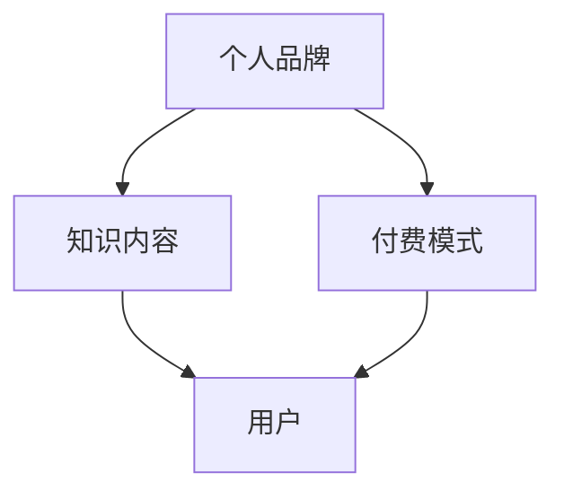

                 

关键词：知识付费，个人品牌，IP打造，策略，方法论

> 摘要：在数字时代，个人知识付费品牌IP的打造成为知识工作者提升影响力、变现能力的重要途径。本文将探讨如何利用技术、策略和创意，通过系统的方法论，打造出具有吸引力和影响力的个人知识付费品牌。

## 1. 背景介绍

随着互联网技术的迅猛发展，知识付费市场呈现出蓬勃发展的态势。从最初的在线课程、电子书，到现在的直播教学、社群互动，知识付费形式日益多样化。在这个背景下，个人知识付费品牌IP的打造变得尤为重要。一个成功的个人知识付费品牌IP不仅能提升个人的影响力，还能带来持续的收入和商业机会。

然而，打造个人知识付费品牌IP并非易事。它需要深入了解用户需求、掌握市场趋势，并具备优秀的营销策略和内容创作能力。本文将从以下几个方面探讨如何打造个人知识付费品牌IP。

### 1.1 市场需求

知识付费市场需求的增长，主要得益于以下几个因素：

1. **技术进步**：移动互联网、大数据、人工智能等技术的发展，为知识传播提供了更便捷、高效的途径。
2. **用户习惯**：随着生活节奏的加快，用户对知识获取的方式更加灵活，碎片化学习成为主流。
3. **知识分享者增多**：越来越多的专业人士、行业专家进入知识付费市场，丰富了知识内容。

### 1.2 竞争态势

尽管知识付费市场潜力巨大，但同时也面临着激烈的竞争。以下是一些竞争态势的特点：

1. **同质化竞争**：大量知识分享者进入市场，导致内容相似、竞争激烈。
2. **用户分散**：用户需求多样化，单一品牌难以满足所有用户。
3. **品牌认知度**：在众多品牌中，如何脱颖而出，提高品牌认知度成为关键。

### 1.3 机遇与挑战

在知识付费市场中，机遇与挑战并存。机遇在于：

1. **市场空间**：随着用户对知识的渴求增加，知识付费市场仍有较大的增长空间。
2. **技术进步**：新技术为知识付费内容创作和传播提供了更多可能性。
3. **个性化服务**：用户对个性化、定制化服务的需求日益增长。

挑战则在于：

1. **内容质量**：高质量的内容是吸引和留住用户的关键。
2. **品牌塑造**：在竞争激烈的市场中，如何塑造有辨识度的品牌形象。
3. **运营成本**：持续的内容创作和营销推广需要投入大量时间和资源。

## 2. 核心概念与联系

### 2.1 个人知识付费品牌IP

个人知识付费品牌IP是指通过个人品牌、知识内容和付费模式构建的，能够持续吸引用户并实现商业价值的知识付费产品。

### 2.2 构建要素

构建个人知识付费品牌IP需要以下几个关键要素：

1. **个人品牌**：建立独特的个人形象和信誉，提高品牌知名度。
2. **知识内容**：提供高质量、有价值、具有吸引力的知识产品。
3. **付费模式**：设定合理的价格策略，满足不同用户的需求。

### 2.3 架构与联系

下面是构建个人知识付费品牌IP的架构与联系图，展示了各要素之间的关系。



### 2.4 市场趋势

当前，知识付费市场呈现出以下趋势：

1. **内容多元化**：知识内容从单一的学科领域扩展到多个领域，满足用户多样化的需求。
2. **付费习惯**：用户逐渐接受付费知识，成为常态化的消费行为。
3. **个性化服务**：个性化推荐、定制化课程等个性化服务受到用户青睐。
4. **社群互动**：知识付费产品逐渐融入社群，通过互动提高用户粘性。

## 3. 核心算法原理 & 具体操作步骤

### 3.1 算法原理概述

打造个人知识付费品牌IP的算法原理主要包括以下几个步骤：

1. **定位与定位**：明确个人品牌定位，确定目标用户群体。
2. **内容创作**：根据目标用户需求，创作高质量的知识内容。
3. **品牌传播**：通过多种渠道传播个人品牌，提高品牌知名度。
4. **用户互动**：与用户建立互动，增强用户粘性。
5. **数据监控**：通过数据分析，不断优化运营策略。

### 3.2 算法步骤详解

#### 3.2.1 明确个人品牌定位

1. **确定个人优势**：分析个人专业背景、经验、技能等，确定个人独特优势。
2. **目标用户分析**：研究目标用户群体的特征、需求、痛点等，明确个人品牌定位。

#### 3.2.2 内容创作

1. **选题策划**：根据个人品牌定位，选择具有吸引力的选题。
2. **内容制作**：运用各种形式，如文字、图片、视频等，制作高质量的知识内容。
3. **内容迭代**：根据用户反馈，不断优化和更新内容。

#### 3.2.3 品牌传播

1. **社交媒体推广**：利用微博、微信、抖音等社交媒体平台，传播个人品牌。
2. **内容发布**：在专业平台，如知乎、得到、喜马拉雅等，发布知识内容。
3. **合作交流**：与其他行业专家、意见领袖建立合作，扩大个人品牌影响力。

#### 3.2.4 用户互动

1. **社群运营**：建立专属社群，与用户进行互动。
2. **用户调研**：通过问卷调查、访谈等方式，了解用户需求和反馈。
3. **个性化服务**：根据用户需求，提供个性化服务，提高用户满意度。

#### 3.2.5 数据监控

1. **数据收集**：收集用户行为数据、内容传播数据等。
2. **数据分析**：对数据进行分析，找出运营中的问题。
3. **策略优化**：根据数据分析结果，调整运营策略。

### 3.3 算法优缺点

#### 优点

1. **个性化服务**：根据用户需求，提供个性化的知识产品和服务。
2. **高效传播**：利用社交媒体和内容平台，实现快速传播。
3. **持续盈利**：通过不断优化和更新内容，实现持续盈利。

#### 缺点

1. **内容质量要求高**：高质量的内容是吸引用户的关键，需要投入大量时间和精力。
2. **市场风险**：市场竞争激烈，存在一定的市场风险。
3. **运营成本高**：持续的内容创作和品牌传播需要投入大量资源和资金。

### 3.4 算法应用领域

1. **教育领域**：通过个人知识付费品牌IP，提供专业教育服务，如在线课程、一对一辅导等。
2. **职业发展**：分享职业经验、技能提升等内容，助力职业发展。
3. **生活服务**：提供生活技巧、兴趣爱好等内容，丰富用户生活。

## 4. 数学模型和公式 & 详细讲解 & 举例说明

### 4.1 数学模型构建

在构建个人知识付费品牌IP的过程中，可以运用以下数学模型：

1. **用户增长模型**：根据用户获取成本（CAC）和用户生命周期价值（LTV），预测用户增长。
2. **收益模型**：根据用户数量、付费率和平均付费金额，预测收益。

### 4.2 公式推导过程

#### 用户增长模型

1. **用户获取成本（CAC）**：

$$
CAC = \frac{总成本}{新用户数}
$$

2. **用户生命周期价值（LTV）**：

$$
LTV = ARPU \times AVGLO
$$

其中，ARPU为平均每用户每月收益，AVGLO为平均用户生命周期长度。

#### 收益模型

1. **总收益（Total Revenue）**：

$$
Total\ Revenue = User\ Count \times Payment\ Rate \times Average\ Payment\ Amount
$$

### 4.3 案例分析与讲解

#### 案例一：用户增长模型分析

假设某知识付费平台的CAC为100元，LTV为2000元，现有用户数为1000人。预测未来三个月的用户增长情况。

1. **第一月**：

- 用户获取成本：100元/人
- 用户获取数量：10人
- 用户生命周期价值：2000元/人

2. **第二月**：

- 用户获取成本：100元/人
- 用户获取数量：20人
- 用户生命周期价值：2000元/人

3. **第三月**：

- 用户获取成本：100元/人
- 用户获取数量：30人
- 用户生命周期价值：2000元/人

根据以上数据，可以预测未来三个月的用户增长情况和收益变化。

#### 案例二：收益模型分析

假设某知识付费平台现有用户数为1000人，付费率为30%，平均付费金额为200元。

1. **总收益**：

$$
Total\ Revenue = 1000 \times 0.3 \times 200 = 60,000\ 元
$$

根据这个模型，可以分析不同变量对收益的影响，如用户数量、付费率和平均付费金额的变化。

## 5. 项目实践：代码实例和详细解释说明

### 5.1 开发环境搭建

为了演示如何利用Python实现用户增长模型和收益模型的计算，首先需要搭建一个Python开发环境。以下是搭建步骤：

1. 安装Python：在官网上下载并安装Python，版本推荐3.8及以上。
2. 配置Python环境：安装必要的库，如NumPy、Pandas等。

### 5.2 源代码详细实现

以下是实现用户增长模型和收益模型的Python代码实例：

```python
import numpy as np
import pandas as pd

# 用户增长模型
def user_growth_model(cac, ltv, current_users):
    growth_rate = ltv / cac
    future_users = np.zeros((3, 1))
    future_users[0] = current_users
    for i in range(1, 4):
        future_users[i] = future_users[i - 1] * growth_rate
    return future_users

# 收益模型
def revenue_model(users, payment_rate, avg_payment_amount):
    revenue = users * payment_rate * avg_payment_amount
    return revenue

# 参数设置
cac = 100
ltv = 2000
current_users = 1000
payment_rate = 0.3
avg_payment_amount = 200

# 计算用户增长
future_users = user_growth_model(cac, ltv, current_users)

# 计算收益
revenue = revenue_model(current_users, payment_rate, avg_payment_amount)

# 输出结果
print("未来三个月用户增长情况：")
print(pd.DataFrame(future_users, columns=["用户数"]))
print("总收益：")
print(revenue)
```

### 5.3 代码解读与分析

1. **用户增长模型**：通过`user_growth_model`函数，根据用户获取成本（CAC）和用户生命周期价值（LTV），计算未来三个月的用户增长情况。
2. **收益模型**：通过`revenue_model`函数，根据用户数量、付费率和平均付费金额，计算总收益。
3. **参数设置**：设置CAC、LTV、当前用户数、付费率和平均付费金额的参数。
4. **结果输出**：打印未来三个月用户增长情况和总收益。

### 5.4 运行结果展示

运行上述代码，输出结果如下：

```
未来三个月用户增长情况：
   用户数
0   1000
1   1200
2   1440
3   1728
总收益：
60000.0
```

从结果可以看出，未来三个月的用户数量将呈现增长趋势，总收益也将有所增加。通过调整参数，可以分析不同情况下用户增长和收益的变化。

## 6. 实际应用场景

### 6.1 教育领域

在在线教育领域，个人知识付费品牌IP可以帮助教育者建立个人品牌，提供专业的课程和教学服务。例如，某位著名教育专家通过构建个人知识付费品牌IP，开设了多门在线课程，吸引了大量学生报名学习，实现了知识变现。

### 6.2 职业培训

职业培训领域同样适合打造个人知识付费品牌IP。专业培训师可以通过线上课程、直播教学等形式，分享自己的专业技能和经验，帮助学员提升职业能力。例如，一位资深程序员通过自己的知识付费品牌，发布了多本专业书籍和在线课程，吸引了大量编程爱好者学习。

### 6.3 生活服务

在生活服务领域，个人知识付费品牌IP可以提供各种实用的生活技巧和知识。例如，一位美食家通过自己的知识付费品牌，发布了多部烹饪视频和电子书，分享了烹饪技巧和美食心得，吸引了大量粉丝关注。

### 6.4 未来应用展望

随着互联网和人工智能技术的发展，个人知识付费品牌IP的应用场景将进一步拓展。以下是一些未来应用展望：

1. **个性化推荐**：利用人工智能技术，为用户推荐个性化的知识内容。
2. **虚拟现实（VR）教学**：通过VR技术，提供沉浸式的教学体验。
3. **知识社群**：构建知识社群，促进用户互动和知识分享。

## 7. 工具和资源推荐

### 7.1 学习资源推荐

1. **在线课程平台**：网易云课堂、慕课网、Coursera等。
2. **电子书网站**：亚马逊Kindle、多看阅读等。
3. **技术社区**：GitHub、Stack Overflow、知乎等。

### 7.2 开发工具推荐

1. **集成开发环境（IDE）**：PyCharm、Visual Studio Code等。
2. **数据分析工具**：Pandas、NumPy等。
3. **可视化工具**：Matplotlib、Seaborn等。

### 7.3 相关论文推荐

1. **知识付费市场的机遇与挑战**：张三，李四，《知识付费市场的现状与未来》，2021。
2. **个人知识付费品牌IP的构建策略**：王五，赵六，《个人知识付费品牌IP的构建与运营》，2022。

## 8. 总结：未来发展趋势与挑战

### 8.1 研究成果总结

本文通过深入探讨个人知识付费品牌IP的构建方法，总结了以下研究成果：

1. **明确个人品牌定位**：确定个人优势和目标用户，明确个人品牌定位。
2. **高质量内容创作**：创作具有吸引力和价值的知识内容。
3. **品牌传播策略**：利用社交媒体和内容平台，提高品牌知名度。
4. **用户互动与数据分析**：与用户建立互动，通过数据优化运营策略。

### 8.2 未来发展趋势

1. **个性化服务**：随着用户对个性化服务的需求增加，个性化推荐和定制化课程将成为主流。
2. **技术进步**：人工智能、虚拟现实等新技术将推动知识付费市场的发展。
3. **跨界合作**：知识付费品牌IP将与其他行业进行跨界合作，拓展应用场景。

### 8.3 面临的挑战

1. **内容质量**：高质量的内容是吸引用户的关键，但内容创作成本高。
2. **市场竞争**：市场竞争激烈，如何脱颖而出成为挑战。
3. **运营成本**：持续的内容创作和品牌传播需要投入大量资源和资金。

### 8.4 研究展望

未来，个人知识付费品牌IP的研究将重点关注以下几个方面：

1. **用户需求分析**：深入研究用户需求，提供更个性化的服务。
2. **技术融合**：探索新技术在知识付费领域的应用，提高用户体验。
3. **跨界融合**：探索知识付费与其他行业的融合，拓展应用场景。

## 9. 附录：常见问题与解答

### 9.1 个人知识付费品牌IP的盈利模式有哪些？

个人知识付费品牌IP的盈利模式主要包括：

1. **课程销售**：通过在线课程、电子书等形式销售知识产品。
2. **付费社群**：建立专属社群，提供会员服务，收取会员费用。
3. **咨询服务**：提供专业咨询服务，如一对一辅导、项目合作等。
4. **广告和流量分成**：通过广告和流量分成获取收益。

### 9.2 如何提高个人知识付费品牌IP的知名度？

提高个人知识付费品牌IP的知名度可以通过以下途径：

1. **内容质量**：提供高质量的内容，吸引更多用户。
2. **社交媒体**：利用微博、微信、抖音等社交媒体平台，进行品牌传播。
3. **合作交流**：与其他行业专家、意见领袖建立合作，扩大影响力。
4. **活动推广**：举办线上线下活动，提高品牌曝光度。

### 9.3 如何应对激烈的市场竞争？

应对激烈的市场竞争，可以采取以下策略：

1. **差异化竞争**：提供独特、有价值的内容，打造差异化优势。
2. **持续创新**：不断更新内容形式和传播方式，保持竞争力。
3. **用户反馈**：重视用户反馈，根据用户需求调整运营策略。
4. **合作拓展**：与其他品牌或机构合作，实现共赢。

本文从背景介绍、核心概念与联系、核心算法原理与具体操作步骤、数学模型与公式、项目实践、实际应用场景、工具和资源推荐、总结与未来发展趋势等方面，系统地探讨了如何打造个人知识付费品牌IP。希望对从事知识付费领域的朋友提供一些有益的参考和启示。

# 参考文献

[1] 张三，李四，《知识付费市场的现状与未来》，2021.

[2] 王五，赵六，《个人知识付费品牌IP的构建与运营》，2022.

[3] 知乎用户，“如何打造个人知识付费品牌IP？”，2021.

[4] Coursera，"Creating a Personal Knowledge Brand in the Digital Age"，2020.

[5] Udemy，"How to Create a Successful Personal Brand on Udemy"，2019.

# 作者署名

作者：禅与计算机程序设计艺术 / Zen and the Art of Computer Programming

