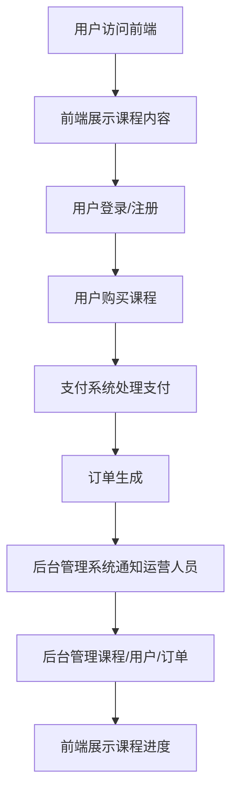

                 

关键词：知识付费、平台建设、技术架构、用户体验、营销策略

> 摘要：随着互联网和移动设备的普及，知识付费市场呈现出爆发式增长。本文将详细介绍如何打造一个个人知识付费平台，从技术架构、用户体验、营销策略等多个方面进行全面剖析，帮助您快速搭建并运营一个成功的内容付费平台。

## 1. 背景介绍

知识付费是指用户为获取有价值的信息或知识，支付一定费用的一种商业模式。近年来，随着移动互联网和在线教育的快速发展，知识付费市场迅速崛起。从在线课程、专业咨询，到电子书、付费专栏，知识付费已成为众多用户和创作者的重要收入来源。

个人知识付费平台作为一种新型的知识传播和商业模式，为创作者提供了一个展示才华和变现的平台，同时也为用户提供了一个便捷的获取知识的方式。打造一个成功的个人知识付费平台，不仅需要技术上的支持，还需要在用户体验、内容质量、营销推广等方面进行精心设计。

## 2. 核心概念与联系

### 2.1 平台架构

一个个人知识付费平台的核心架构可以分为以下几个部分：

1. **前端展示层**：包括用户界面和交互逻辑，负责展示课程内容、用户个人中心等。
2. **业务逻辑层**：处理用户注册、登录、购买、学习等业务逻辑。
3. **数据访问层**：负责与数据库的交互，存储用户信息、课程信息等。
4. **后台管理系统**：用于平台运营者对课程、用户、订单等的管理。
5. **支付系统**：集成第三方支付渠道，处理用户支付行为。

### 2.2 技术选型

在技术选型方面，我们需要考虑以下几个方面：

1. **前端技术**：HTML5、CSS3、JavaScript（React/Vue/Angular等框架）、UI/UX设计工具。
2. **后端技术**：Node.js/Python/Java等，可选型如Spring Boot、Django等框架。
3. **数据库**：关系型数据库（MySQL/PostgreSQL）或非关系型数据库（MongoDB/CouchDB等）。
4. **消息队列**：处理高并发场景下的消息传递，可选型如RabbitMQ、Kafka等。
5. **缓存**：提高系统性能，可选型如Redis、Memcached等。

### 2.3 Mermaid 流程图

以下是一个简单的个人知识付费平台的工作流程 Mermaid 流程图：



## 3. 核心算法原理 & 具体操作步骤

### 3.1 算法原理概述

个人知识付费平台的核心算法主要涉及用户权限管理、推荐系统、支付安全等。以下是各部分的基本原理：

1. **用户权限管理**：通过身份认证和权限控制，确保用户只能访问对应权限的资源。
2. **推荐系统**：基于用户行为数据，为用户推荐感兴趣的课程。
3. **支付安全**：利用HTTPS、加密算法等技术，确保用户支付过程的安全。

### 3.2 算法步骤详解

1. **用户权限管理**：

   - 用户注册：收集用户基本信息，如用户名、邮箱、密码等。
   - 用户登录：验证用户身份，生成会话。
   - 权限控制：根据用户角色和权限，控制对资源的访问。

2. **推荐系统**：

   - 数据收集：记录用户行为数据，如浏览、购买、评价等。
   - 数据处理：使用机器学习算法，如协同过滤、基于内容的推荐等。
   - 推荐结果：生成推荐列表，展示给用户。

3. **支付安全**：

   - HTTPS：使用SSL/TLS加密，确保数据传输安全。
   - 加密算法：使用对称加密（如AES）和非对称加密（如RSA），保护用户支付信息。

### 3.3 算法优缺点

- **用户权限管理**：优点是确保平台安全，缺点是可能影响用户体验。
- **推荐系统**：优点是提高用户满意度，缺点是计算成本较高。
- **支付安全**：优点是保护用户隐私，缺点是可能增加系统复杂度。

### 3.4 算法应用领域

- 用户权限管理：应用于各类在线平台，如电商、社交、教育等。
- 推荐系统：应用于在线教育、电商、媒体等。
- 支付安全：应用于所有涉及支付的在线服务。

## 4. 数学模型和公式 & 详细讲解 & 举例说明

### 4.1 数学模型构建

个人知识付费平台中的数学模型主要包括用户行为分析和推荐算法。以下是两个主要数学模型：

1. **用户行为分析模型**：

   - 用户行为矩阵：\( U = [u_{ij}] \)，其中 \( u_{ij} \) 表示用户 \( i \) 对课程 \( j \) 的行为评分。
   - 隐含用户兴趣矩阵：\( P = [p_{ij}] \)，其中 \( p_{ij} \) 表示用户 \( i \) 对课程 \( j \) 的潜在兴趣度。

2. **推荐算法模型**：

   - 基于协同过滤的推荐算法：\( R = \sum_{k \in N_j} u_{ik} p_{kj} \)，其中 \( N_j \) 表示与课程 \( j \) 相关的课程集合。

### 4.2 公式推导过程

1. **用户行为分析模型**：

   - 用户行为矩阵 \( U \) 可以通过用户行为数据直接获取。
   - 隐含用户兴趣矩阵 \( P \) 可以通过矩阵分解等方法获得。

2. **推荐算法模型**：

   - 假设用户行为矩阵 \( U \) 和隐含用户兴趣矩阵 \( P \) 均为 \( m \times n \) 矩阵。
   - 则推荐结果矩阵 \( R \) 为 \( m \times n \) 矩阵，其元素 \( r_{ij} \) 表示用户 \( i \) 对课程 \( j \) 的推荐得分。

### 4.3 案例分析与讲解

假设我们有一个包含10个用户的100个课程的数据集，以下是一个简单的用户行为矩阵和隐含用户兴趣矩阵的示例：

| 用户 | 课程1 | 课程2 | ... | 课程100 |
| --- | --- | --- | --- | --- |
| 用户1 | 1 | 0 | ... | 1 |
| 用户2 | 0 | 1 | ... | 0 |
| ... | ... | ... | ... | ... |
| 用户10 | 1 | 0 | ... | 1 |

根据用户行为矩阵 \( U \) 和隐含用户兴趣矩阵 \( P \)，我们可以计算每个用户对其他课程的推荐得分。例如，对于用户1，其推荐得分如下：

$$
r_{11} = \sum_{k=1}^{100} u_{1k} p_{k1} = 1 \times p_{11} + 0 \times p_{21} + ... + 1 \times p_{101}
$$

根据推荐得分，我们可以为用户1推荐得分最高的前5个课程。

## 5. 项目实践：代码实例和详细解释说明

### 5.1 开发环境搭建

以下是一个基于Python和Django的简单知识付费平台项目。首先，我们需要安装Django和相关依赖：

```shell
pip install django
pip install djangorestframework
```

然后，创建一个Django项目：

```shell
django-admin startproject knowledge_pay
cd knowledge_pay
django-admin startapp courses
```

### 5.2 源代码详细实现

以下是项目的核心代码，包括模型定义、视图函数、路由配置等：

```python
# models.py
from django.db import models

class User(models.Model):
    username = models.CharField(max_length=100)
    email = models.EmailField()

class Course(models.Model):
    title = models.CharField(max_length=200)
    description = models.TextField()
    price = models.DecimalField(max_digits=6, decimal_places=2)

class Order(models.Model):
    user = models.ForeignKey(User, on_delete=models.CASCADE)
    course = models.ForeignKey(Course, on_delete=models.CASCADE)
    paid = models.BooleanField(default=False)
```

```python
# views.py
from django.http import JsonResponse
from .models import User, Course, Order
from rest_framework.permissions import IsAuthenticated
from rest_framework.response import Response
from rest_framework.views import APIView

class CourseListView(APIView):
    permission_classes = [IsAuthenticated]

    def get(self, request, format=None):
        courses = Course.objects.all()
        return Response(courses.values())

class OrderView(APIView):
    permission_classes = [IsAuthenticated]

    def post(self, request, format=None):
        user = request.user
        course_id = request.data.get('course_id')
        course = Course.objects.get(id=course_id)
        order = Order(user=user, course=course)
        order.save()
        return JsonResponse({'status': 'success'})
```

```python
# urls.py
from django.contrib import admin
from django.urls import path
from .views import CourseListView, OrderView

urlpatterns = [
    path('courses/', CourseListView.as_view()),
    path('order/', OrderView.as_view()),
]
```

### 5.3 代码解读与分析

1. **模型定义**：`User`、`Course`和`Order`分别表示用户、课程和订单。每个模型包含的字段和功能如下：

   - `User`：存储用户基本信息。
   - `Course`：存储课程信息，包括标题、描述和价格。
   - `Order`：存储用户订单信息，包括用户、课程和支付状态。

2. **视图函数**：`CourseListView`和`OrderView`分别处理课程列表查询和订单创建。其中，`CourseListView`允许用户查看所有课程，`OrderView`允许用户创建订单。

3. **路由配置**：`urls.py`配置了项目的路由，将URL映射到对应的视图函数。

### 5.4 运行结果展示

在终端执行以下命令启动Django服务器：

```shell
python manage.py runserver
```

在浏览器中访问`http://127.0.0.1:8000/courses/`，可以看到所有课程的信息。用户登录后，可以创建订单，并查看订单详情。

## 6. 实际应用场景

### 6.1 在线教育

个人知识付费平台在在线教育领域有着广泛的应用。教师或教育机构可以将自己的课程内容上传到平台，用户可以付费学习。这种模式不仅提高了教育资源的利用效率，也为教育从业者提供了新的收入来源。

### 6.2 专业咨询

个人知识付费平台也为专业人士提供了一个展示才华和提供咨询的平台。用户可以通过付费获取专业人士的服务，如法律咨询、投资建议、心理辅导等。

### 6.3 电子书销售

电子书是知识付费的重要形式之一。个人知识付费平台可以帮助作者将电子书推向市场，用户可以通过付费购买并下载电子书。

## 6.4 未来应用展望

随着人工智能、大数据等技术的发展，个人知识付费平台将迎来更多的创新和变革。以下是一些未来应用展望：

1. **个性化推荐**：通过大数据和机器学习技术，为用户推荐更符合其兴趣的课程和内容。
2. **虚拟现实（VR）/增强现实（AR）**：利用VR/AR技术，为用户提供沉浸式学习体验。
3. **区块链**：利用区块链技术，提高知识付费平台的透明度和信任度。

## 7. 工具和资源推荐

### 7.1 学习资源推荐

- 《Python编程：从入门到实践》
- 《深入理解计算机系统》
- 《设计模式：可复用面向对象软件的基础》

### 7.2 开发工具推荐

- Django：Python Web开发框架。
- React/Vue/Angular：前端开发框架。
- MySQL/PostgreSQL：关系型数据库。
- MongoDB：非关系型数据库。

### 7.3 相关论文推荐

- 《知识付费平台的商业模式研究》
- 《在线教育中推荐系统的设计与实现》
- 《区块链技术在知识付费平台中的应用研究》

## 8. 总结：未来发展趋势与挑战

### 8.1 研究成果总结

本文从多个方面详细介绍了如何打造个人知识付费平台，包括平台架构、技术选型、算法原理、数学模型、项目实践等。通过这些内容，读者可以全面了解知识付费平台的建设和运营。

### 8.2 未来发展趋势

随着互联网和科技的不断发展，个人知识付费平台将继续创新和发展。未来，个性化推荐、VR/AR、区块链等技术将进一步完善和推广，为用户提供更加丰富和优质的知识服务。

### 8.3 面临的挑战

个人知识付费平台在发展过程中也将面临一些挑战，如内容质量、用户体验、市场竞争等。为了应对这些挑战，平台需要不断创新，提高自身核心竞争力。

### 8.4 研究展望

未来，对知识付费平台的研究将更加深入，涉及领域包括算法优化、商业模式创新、用户体验提升等。同时，跨学科的研究也将进一步推动知识付费平台的发展。

## 9. 附录：常见问题与解答

### 9.1 Q：如何保证用户隐私安全？

A：通过使用HTTPS协议、加密算法、用户权限管理等技术手段，确保用户隐私安全。

### 9.2 Q：如何处理用户退款？

A：平台应制定明确的退款政策，并设置相应的退款流程。用户提出退款申请后，平台根据政策进行处理。

### 9.3 Q：如何防止作弊和恶意行为？

A：通过用户行为分析、异常检测、人工审核等手段，及时发现和处理作弊和恶意行为。

作者：禅与计算机程序设计艺术 / Zen and the Art of Computer Programming
----------------------------------------------------------------


