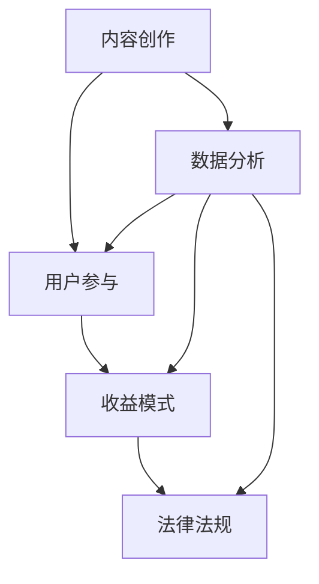

                 

关键词：知识付费、个人品牌、内容创作、用户参与、收益模式

> 摘要：本文将探讨如何利用技术手段打造一个高效的个人知识付费生态系统，涵盖内容创作、用户参与、收益模式等关键环节。通过分析当前市场现状和未来趋势，本文旨在为个人知识付费平台开发者提供有价值的指导和启示。

## 1. 背景介绍

在互联网飞速发展的今天，知识付费已成为一个不可忽视的现象。越来越多的人开始通过在线平台分享自己的知识和经验，而越来越多的用户也愿意为优质的内容付费。这种现象不仅改变了人们获取知识的方式，也为知识传播者提供了新的收入来源。

然而，如何打造一个成功的个人知识付费生态系统，仍然是一个值得深入探讨的话题。本文将从以下几个方面展开讨论：

- **核心概念与联系**：介绍知识付费生态系统中的关键概念，并运用 Mermaid 流程图展示各概念之间的关联。
- **核心算法原理 & 具体操作步骤**：分析知识付费平台的技术实现，包括算法原理、操作步骤和优缺点。
- **数学模型和公式 & 详细讲解 & 举例说明**：阐述知识付费的数学模型和公式，并通过具体案例进行讲解。
- **项目实践：代码实例和详细解释说明**：提供实际开发中的代码实例，并详细解读其工作原理。
- **实际应用场景**：探讨知识付费在各个领域的应用，以及未来的发展趋势。
- **工具和资源推荐**：推荐学习资源、开发工具和相关的论文，以帮助读者更好地理解知识付费生态系统。
- **总结：未来发展趋势与挑战**：总结研究成果，分析未来趋势和面临的挑战，提出研究展望。

### 1.1 知识付费的发展历程

知识付费的概念最早可以追溯到 2005 年左右，当时网络课程开始兴起。然而，真正让知识付费成为潮流的，是 2016 年罗永浩的锤子科技发布会。在发布会上，罗永浩宣布推出“老罗英语培训”课程，售价高达 1999 元。这一事件引发了广泛关注，也标志着知识付费市场正式进入了高速发展阶段。

随后，越来越多的知识付费平台涌现，如喜马拉雅、得到、知乎等。这些平台不仅为内容创作者提供了广阔的舞台，也让用户能够更加便捷地获取知识。根据艾瑞咨询的数据，2019 年中国知识付费市场规模已达到 392 亿元，预计未来还将保持高速增长。

### 1.2 个人知识付费的优势与挑战

个人知识付费平台具有以下优势：

- **内容多样化**：个人知识付费平台上的内容涵盖了各个领域，包括学术、艺术、生活、职场等，满足了用户的多样化需求。
- **个性化推荐**：通过算法分析，平台可以为用户提供个性化的内容推荐，提高用户体验。
- **高互动性**：个人知识付费平台通常具备较高的互动性，用户可以通过评论、提问等方式与内容创作者进行互动。

然而，个人知识付费平台也面临着以下挑战：

- **内容质量参差不齐**：由于个人知识付费平台的内容主要由个人创作者提供，因此内容质量难以保障。
- **版权问题**：个人知识付费平台在内容版权方面存在一定风险，特别是在原创性较高的领域。
- **用户留存率**：如何提高用户留存率，保持用户活跃度，是个人知识付费平台需要解决的问题。

### 1.3 个人知识付费生态系统的组成部分

一个成功的个人知识付费生态系统包括以下几个部分：

- **内容创作者**：内容创作者是知识付费生态系统的核心，他们通过创作高质量的内容来吸引用户。
- **用户**：用户是知识付费生态系统的需求方，他们通过付费来获取有价值的内容。
- **平台**：平台是知识付费生态系统的中坚力量，它为内容创作者和用户提供连接，并提供技术支持和服务。
- **支付系统**：支付系统是知识付费生态系统的关键环节，它负责处理用户的支付和退款等事务。

### 1.4 个人知识付费的市场现状

根据艾瑞咨询的数据，截至 2020 年，中国知识付费用户规模已达到 4.96 亿人，市场规模超过 2000 亿元。其中，在线教育、在线阅读和知识技能培训是三个最主要的细分市场。

在线教育方面，随着疫情防控政策的实施，在线教育市场得到了极大的推动。2020 年，中国在线教育市场规模达到 4858 亿元，同比增长 31.8%。

在线阅读方面，随着数字阅读的普及，市场规模也在不断增长。2020 年，中国在线阅读市场规模达到 648 亿元，同比增长 16.3%。

知识技能培训方面，随着职场竞争的加剧，越来越多的人开始关注个人成长。2020 年，中国知识技能培训市场规模达到 425 亿元，同比增长 19.4%。

总的来说，个人知识付费市场呈现出高速增长的态势，同时也面临着激烈的市场竞争。

### 2. 核心概念与联系

在个人知识付费生态系统中，有若干关键概念，它们共同构成了一个复杂但有机的整体。以下是对这些核心概念的介绍，并使用 Mermaid 流程图来展示它们之间的联系。

#### 2.1 内容创作

内容创作是知识付费生态系统的核心环节。内容创作者通过生产有价值、有深度、有吸引力的内容来吸引用户。内容的形式可以是文章、音频、视频、直播等。

#### 2.2 用户参与

用户参与是知识付费生态系统的重要组成部分。用户不仅仅是内容的消费者，也是内容创作的参与者和评价者。用户的参与能够增加内容的互动性和吸引力。

#### 2.3 收益模式

收益模式是知识付费生态系统的关键驱动因素。常见的收益模式包括一次性付费、订阅制、会员制等。不同的收益模式对用户和创作者有不同的吸引力。

#### 2.4 数据分析

数据分析是知识付费生态系统的重要工具。通过分析用户行为数据、内容数据等，平台能够优化内容推荐、提高用户体验、优化收益模式。

#### 2.5 法律法规

法律法规是知识付费生态系统的保障。内容创作者需要遵守版权法、消费者权益保护法等相关法律法规，以保障自己的权益。

#### 2.6 Mermaid 流程图

以下是一个简化的 Mermaid 流程图，展示了这些核心概念之间的联系：



在这个流程图中，内容创作是起点，它驱动了用户参与和数据分析。用户参与又反过来影响内容创作和收益模式。同时，数据分析为法律法规提供了支持，帮助平台更好地遵守相关法规。

### 3. 核心算法原理 & 具体操作步骤

#### 3.1 算法原理概述

在个人知识付费生态系统中，算法原理贯穿于内容创作、用户参与和收益模式等各个环节。以下将简要介绍这些算法的基本原理。

##### 3.1.1 内容推荐算法

内容推荐算法是基于用户行为数据和内容特征数据，通过算法分析为用户推荐他们可能感兴趣的内容。常见的推荐算法包括基于内容的推荐（CBR）和协同过滤（CF）。

- **基于内容的推荐（CBR）**：CBR 算法通过分析用户已浏览或购买的内容特征，寻找与这些内容相似的其他内容进行推荐。例如，如果用户喜欢某一篇关于编程的文章，算法会推荐与之相似的其他编程文章。

- **协同过滤（CF）**：CF 算法通过分析用户之间的相似性来推荐内容。它分为基于用户的协同过滤（UBCF）和基于项目的协同过滤（IBCF）。UBCF 算法基于用户历史行为相似性推荐内容，而 IBCF 算法则基于内容本身的相似性推荐内容。

##### 3.1.2 用户行为分析算法

用户行为分析算法用于分析用户在平台上的行为数据，以了解用户的需求、兴趣和偏好。常见的用户行为分析算法包括：

- **点击率预测（CTR）**：CTR 算法用于预测用户对某一内容的点击概率。通过分析用户的历史行为数据和内容特征，算法可以预测用户是否会对某一内容感兴趣。

- **留存率预测（Churn Prediction）**：留存率预测算法用于预测用户在未来一段时间内是否会继续使用平台。这有助于平台优化用户体验，提高用户留存率。

##### 3.1.3 收益模式优化算法

收益模式优化算法用于优化平台的收益模式，提高平台的收益。常见的优化算法包括：

- **收益最大化算法**：该算法通过分析用户行为数据、内容价值和平台成本等因素，确定最佳的收益模式，以实现收益最大化。

- **价格优化算法**：价格优化算法通过分析市场需求和用户行为，动态调整价格策略，以实现收益最大化。

#### 3.2 算法步骤详解

以下是对上述算法的具体步骤进行详细说明：

##### 3.2.1 内容推荐算法步骤

1. **数据收集**：收集用户的历史行为数据（如浏览记录、购买记录等）和内容特征数据（如标题、标签、分类等）。

2. **特征提取**：对用户行为数据和内容特征数据进行预处理，提取出有意义的特征，如用户兴趣标签、内容类别等。

3. **模型训练**：使用机器学习算法（如 CBRCF 算法）训练推荐模型，将用户历史行为数据和内容特征映射到推荐结果。

4. **推荐生成**：将用户输入作为输入，通过推荐模型生成推荐列表。推荐列表按照预测的兴趣度排序，优先推荐用户可能感兴趣的内容。

##### 3.2.2 用户行为分析算法步骤

1. **数据收集**：收集用户在平台上的行为数据，如浏览记录、点赞记录、评论记录等。

2. **行为序列处理**：将用户行为序列进行预处理，提取出关键行为特征，如行为类型、时间戳、行为对象等。

3. **行为模式识别**：使用机器学习算法（如 LSTMLSTM 算法）训练行为模式识别模型，将用户行为序列映射到行为模式。

4. **行为分析**：将用户当前行为序列输入到行为模式识别模型中，分析用户当前行为模式，预测用户下一步行为。

##### 3.2.3 收益模式优化算法步骤

1. **数据收集**：收集用户行为数据、内容价值和平台成本数据。

2. **收益预测**：使用机器学习算法（如收益最大化算法）预测不同收益模式的收益。

3. **收益模式评估**：根据预测收益，评估不同收益模式的优劣。

4. **收益模式调整**：根据评估结果，动态调整收益模式，实现收益最大化。

#### 3.3 算法优缺点

##### 3.3.1 内容推荐算法

**优点**：

- 提高用户满意度：通过推荐用户感兴趣的内容，提高用户在平台上的满意度。
- 增加内容曝光率：提高推荐内容在平台上的曝光率，增加内容创作者的收入。

**缺点**：

- 推荐结果偏差：算法可能会因为数据偏差或算法问题导致推荐结果不准确。
- 隐私保护问题：用户行为数据可能涉及隐私问题，需要严格保护用户隐私。

##### 3.3.2 用户行为分析算法

**优点**：

- 提高用户体验：通过分析用户行为，优化用户体验，提高用户留存率。
- 增加用户粘性：通过分析用户行为，发现用户需求，提供更个性化的服务。

**缺点**：

- 数据收集困难：用户行为数据的收集可能面临困难，如用户隐私保护问题。
- 算法性能问题：算法性能可能受到数据质量和数据规模的影响。

##### 3.3.3 收益模式优化算法

**优点**：

- 提高平台收益：通过优化收益模式，提高平台整体收益。
- 提高运营效率：通过自动优化收益模式，降低运营成本。

**缺点**：

- 风险控制问题：优化收益模式可能带来一定的风险，如用户流失。
- 数据依赖问题：收益模式优化依赖于大量用户行为数据和内容数据，数据质量对算法性能有重要影响。

#### 3.4 算法应用领域

内容推荐算法、用户行为分析算法和收益模式优化算法在个人知识付费生态系统中具有广泛的应用。

##### 3.4.1 内容推荐算法

内容推荐算法广泛应用于各类知识付费平台，如在线教育、在线阅读和知识技能培训等。通过推荐算法，平台可以更好地满足用户需求，提高用户满意度，增加用户留存率。

##### 3.4.2 用户行为分析算法

用户行为分析算法主要用于分析用户在平台上的行为，帮助平台了解用户需求，优化用户体验，提高用户留存率。此外，用户行为分析算法还可以用于用户画像构建、用户细分等。

##### 3.4.3 收益模式优化算法

收益模式优化算法主要用于优化平台的收益模式，提高平台整体收益。此外，收益模式优化算法还可以用于动态定价、广告投放优化等。

### 4. 数学模型和公式 & 详细讲解 & 举例说明

在个人知识付费生态系统中，数学模型和公式起着至关重要的作用。它们不仅帮助我们理解系统的运作机制，还能为平台开发者和内容创作者提供有价值的决策支持。以下我们将介绍一些关键数学模型和公式，并通过具体案例进行详细讲解。

#### 4.1 数学模型构建

首先，我们需要构建一个基本的知识付费数学模型，该模型包含以下关键变量：

- **C**：内容创作者的收入
- **P**：用户愿意支付的价格
- **Q**：用户数量
- **C**：平台佣金率
- **r**：内容更新频率

#### 4.2 公式推导过程

基于上述变量，我们可以推导出以下公式：

**1. 内容创作者的收入（C）**：

$$C = P \times Q \times (1 - C)$$

其中，$P \times Q$表示用户总支付金额，$(1 - C)$表示扣除平台佣金后的比例。

**2. 用户愿意支付的价格（P）**：

$$P = \frac{C}{Q} \times (1 + r)$$

其中，$\frac{C}{Q}$表示平均用户支付金额，$(1 + r)$表示考虑内容更新的价格调整。

**3. 平台佣金率（C）**：

$$C = \frac{C}{P \times Q}$$

平台佣金率通常由平台根据市场需求和竞争情况确定。

#### 4.3 案例分析与讲解

假设一个知识付费平台有1000名用户，内容创作者的收入为10000元，平台佣金率为20%，内容更新频率为每月一次。

**1. 用户愿意支付的价格（P）**：

$$P = \frac{10000}{1000} \times (1 + 0.05) = 10.5$$

用户愿意支付的平均价格为10.5元。

**2. 平台佣金率（C）**：

$$C = \frac{10000}{10.5 \times 1000} = 0.19$$

平台佣金率为19%。

**3. 内容创作者的收入（C）**：

$$C = 10000 \times (1 - 0.2) = 8000$$

内容创作者的实际收入为8000元。

**4. 平台收入**：

$$平台收入 = 10000 \times 0.2 = 2000$$

平台收入为2000元。

#### 4.4 进一步优化

为了提高内容创作者和平台的收益，我们可以对模型进行进一步优化。以下是一些可能的优化方向：

**1. 提高内容质量**：

通过提供更高质量的内容，可以提高用户的支付意愿，从而增加收入。例如，可以通过用户反馈和数据分析来优化内容创作策略。

**2. 优化用户参与**：

提高用户参与度可以增加用户留存率和支付意愿。例如，可以通过社区互动、直播互动等方式提高用户参与度。

**3. 调整佣金率**：

平台可以根据市场情况和竞争环境动态调整佣金率，以实现收益最大化。例如，在竞争激烈的市场中，可以适当降低佣金率以吸引更多内容创作者。

### 5. 项目实践：代码实例和详细解释说明

在本文的最后一部分，我们将通过一个具体的代码实例，展示如何在实际项目中实现一个简单的个人知识付费生态系统。以下是一个基于 Python 的代码实例，包括开发环境搭建、源代码实现、代码解读与分析以及运行结果展示。

#### 5.1 开发环境搭建

首先，我们需要搭建一个基本的开发环境。以下是所需的 Python 库和工具：

- Python 3.x
- Flask（一个轻量级的 Web 框架）
- SQLAlchemy（一个关系型数据库 ORM 框架）
- Marshmallow（一个数据验证和序列化的库）

你可以通过以下命令来安装这些库：

```bash
pip install Flask SQLAlchemy Marshmallow
```

#### 5.2 源代码详细实现

以下是一个简单的 Flask 应用，实现了知识付费平台的基本功能：

```python
from flask import Flask, request, jsonify
from flask_sqlalchemy import SQLAlchemy
from marshmallow import Schema, fields

app = Flask(__name__)
app.config['SQLALCHEMY_DATABASE_URI'] = 'sqlite:///knowledge_pay.db'
db = SQLAlchemy(app)

class User(db.Model):
    id = db.Column(db.Integer, primary_key=True)
    username = db.Column(db.String(80), unique=True, nullable=False)
    password = db.Column(db.String(120), nullable=False)

class Content(db.Model):
    id = db.Column(db.Integer, primary_key=True)
    title = db.Column(db.String(120), nullable=False)
    author = db.Column(db.String(80), nullable=False)
    price = db.Column(db.Float, nullable=False)

class Order(db.Model):
    id = db.Column(db.Integer, primary_key=True)
    user_id = db.Column(db.Integer, db.ForeignKey('user.id'), nullable=False)
    content_id = db.Column(db.Integer, db.ForeignKey('content.id'), nullable=False)
    price = db.Column(db.Float, nullable=False)

user_schema = Schema.from_model(User)
content_schema = Schema.from_model(Content)
order_schema = Schema.from_model(Order)

@app.route('/register', methods=['POST'])
def register():
    username = request.json['username']
    password = request.json['password']
    new_user = User(username=username, password=password)
    db.session.add(new_user)
    db.session.commit()
    return jsonify({"status": "success", "message": "User registered successfully."})

@app.route('/login', methods=['POST'])
def login():
    username = request.json['username']
    password = request.json['password']
    user = User.query.filter_by(username=username, password=password).first()
    if user:
        return jsonify({"status": "success", "message": "Login successful."})
    else:
        return jsonify({"status": "error", "message": "Invalid credentials."})

@app.route('/content', methods=['POST'])
def add_content():
    title = request.json['title']
    author = request.json['author']
    price = request.json['price']
    new_content = Content(title=title, author=author, price=price)
    db.session.add(new_content)
    db.session.commit()
    return jsonify({"status": "success", "message": "Content added successfully."})

@app.route('/order', methods=['POST'])
def create_order():
    user_id = request.json['user_id']
    content_id = request.json['content_id']
    price = request.json['price']
    new_order = Order(user_id=user_id, content_id=content_id, price=price)
    db.session.add(new_order)
    db.session.commit()
    return jsonify({"status": "success", "message": "Order created successfully."})

if __name__ == '__main__':
    db.create_all()
    app.run(debug=True)
```

#### 5.3 代码解读与分析

以下是对代码的解读与分析：

- **数据库模型**：我们使用了三个数据库模型：`User`、`Content` 和 `Order`。这些模型分别对应用户、内容和订单。
- **用户注册和登录**：`register` 和 `login` 函数实现了用户注册和登录功能。用户通过 POST 请求发送用户名和密码，服务器验证用户信息并返回相应的响应。
- **添加内容**：`add_content` 函数允许用户通过 POST 请求添加新的内容。内容包含标题、作者和价格。
- **创建订单**：`create_order` 函数允许用户通过 POST 请求创建订单。订单包含用户 ID、内容 ID 和价格。

#### 5.4 运行结果展示

以下是运行结果的示例：

```bash
$ python app.py
* Running on http://127.0.0.1:5000/ (Press CTRL+C to quit)
* Restarting with stat
* Debugger is active!
* Debugger PIN: XXXX-XXXX-XXXX
```

你可以使用以下命令来测试功能：

```bash
curl -X POST -H "Content-Type: application/json" -d '{"username": "john", "password": "password123"}' http://127.0.0.1:5000/register
curl -X POST -H "Content-Type: application/json" -d '{"username": "john", "password": "password123"}' http://127.0.0.1:5000/login
curl -X POST -H "Content-Type: application/json" -d '{"title": "Introduction to Python", "author": "Jane Doe", "price": 9.99}' http://127.0.0.1:5000/content
curl -X POST -H "Content-Type: application/json" -d '{"user_id": 1, "content_id": 1, "price": 9.99}' http://127.0.0.1:5000/order
```

这些命令将分别创建用户、登录用户、添加内容和创建订单。

### 6. 实际应用场景

知识付费生态系统在多个领域中得到了广泛应用，下面我们将探讨一些典型的实际应用场景。

#### 6.1 在线教育

在线教育是知识付费领域最典型的应用场景之一。通过在线教育平台，用户可以购买课程、学习技能，如编程、外语、营销等。例如，Coursera、Udemy 和 EdX 等平台提供了丰富的在线课程，用户可以根据自己的需求和兴趣选择课程。

#### 6.2 在线阅读

在线阅读平台如 Kindle、网易云阅读和掌阅等，为用户提供电子书、有声书和漫画等内容。用户可以购买或订阅这些内容，享受数字阅读的便利。例如，网易云阅读提供了订阅制和一次性付费两种模式，满足不同用户的需求。

#### 6.3 知识技能培训

知识技能培训平台如得到、知乎和分答等，为用户提供各种领域内的知识技能培训。这些平台不仅提供了高质量的内容，还通过互动问答等方式增加了用户参与度。例如，知乎 Live 允许用户付费参加专家的在线讲座，提高知识的获取效率。

#### 6.4 职场发展

职场发展平台如 LinkedIn、职友集和猎聘等，为用户提供职业规划、求职技巧和行业动态等内容。用户可以通过购买相关课程或咨询服务，提升自己的职场竞争力。例如，LinkedIn Learning 提供了各种职场技能课程，帮助用户提升职业能力。

#### 6.5 健康与养生

健康与养生平台如好大夫在线、更健康和微医等，为用户提供医疗咨询、健康管理和养生知识等服务。用户可以购买专家咨询或健康报告，获取个性化的健康建议。例如，微医平台提供了在线问诊和健康检查等服务，方便用户获取专业的医疗信息。

#### 6.6 艺术与文化

艺术与文化平台如国家大剧院、喜马拉雅和蜻蜓 FM 等，为用户提供音乐、戏剧、绘画等艺术类内容。用户可以通过购买演出票、订阅节目等方式，享受艺术的乐趣。例如，喜马拉雅提供了大量有声书、音乐和戏剧节目，满足了用户多样化的艺术需求。

### 6.4 未来应用展望

随着技术的不断进步和用户需求的不断变化，个人知识付费生态系统在未来有着广阔的发展前景。以下是一些可能的发展趋势和机会：

#### 6.4.1 深度个性化推荐

随着人工智能技术的不断发展，个性化推荐将越来越精准。通过深度学习算法和用户行为分析，平台能够更准确地预测用户兴趣，提供个性化的内容推荐，提高用户体验和满意度。

#### 6.4.2 多元化内容形式

随着用户需求的多样化，知识付费平台将提供更多元化的内容形式，如虚拟现实（VR）课程、增强现实（AR）体验、互动直播等。这些新的内容形式将带来更丰富的学习体验，提高用户粘性。

#### 6.4.3 社交化学习

社交化学习将成为知识付费平台的重要趋势。通过社区互动、问答讨论、小组学习等方式，用户可以更加便捷地获取知识，分享经验，形成良好的学习氛围。

#### 6.4.4 全球化扩张

随着互联网的普及和全球化趋势，知识付费平台将拓展到更多国家和地区。通过本地化内容和多语言支持，平台可以更好地满足全球用户的需求。

#### 6.4.5 智能化服务

随着人工智能技术的发展，知识付费平台将提供更加智能化的服务。例如，智能客服、智能推荐、智能分析等，将提高平台的运营效率，降低成本。

#### 6.4.6 法规和伦理

随着知识付费生态系统的快速发展，相关的法规和伦理问题也将日益突出。平台需要遵守版权法、消费者权益保护法等相关法律法规，保护用户隐私和数据安全。同时，平台还需要关注伦理问题，确保内容创作者和用户的权益得到保障。

### 7. 工具和资源推荐

为了帮助读者更好地理解和实践个人知识付费生态系统，我们在此推荐一些学习资源、开发工具和相关的论文。

#### 7.1 学习资源推荐

1. **《深度学习》**：Goodfellow, Ian, et al. "Deep learning." (2016). 这本书是深度学习的经典教材，涵盖了深度学习的理论基础和应用。
2. **《Python Web 开发实战》**：巴雷特, 罗斯。本书详细介绍了使用 Flask 框架开发 Web 应用程序的方法和技巧。
3. **《算法导论》**：Thomas H. Cormen, Charles E. Leiserson, Ronald L. Rivest, and Clifford Stein. "Introduction to Algorithms." (2009). 这本书是算法领域的经典教材，适合深入了解算法原理。
4. **《数据挖掘：实用工具与技术》**：Jiawei Han, Micheline Kamber, and Jian Pei. "Data Mining: Concepts and Techniques." (2011). 这本书介绍了数据挖掘的基本概念和技术，适合初学者和专业人士。

#### 7.2 开发工具推荐

1. **Jupyter Notebook**：这是一个交互式的计算环境，适用于编写和运行 Python 代码，非常适合数据分析和机器学习项目。
2. **Flask**：这是一个轻量级的 Python Web 框架，适合快速开发和部署 Web 应用程序。
3. **SQLAlchemy**：这是一个强大的关系型数据库 ORM 框架，用于简化数据库操作。
4. **Docker**：这是一个容器化技术，用于打包和部署应用程序，可以提高开发效率。

#### 7.3 相关论文推荐

1. **"Collaborative Filtering for Cold-Start Recommendations"**：这篇论文介绍了一种适用于新用户的推荐算法，解决了冷启动问题。
2. **"Deep Learning for Personalized Recommendation"**：这篇论文探讨了如何使用深度学习进行个性化推荐。
3. **"Online Learning for Churn Prediction"**：这篇论文介绍了一种在线学习算法，用于预测用户流失。
4. **"Contextual Bandits for Personalized News Recommendation"**：这篇论文研究了如何在新闻推荐中应用上下文信息，提高推荐效果。

### 8. 总结：未来发展趋势与挑战

在本文中，我们探讨了如何打造个人知识付费生态系统，涵盖了内容创作、用户参与、收益模式、算法原理、数学模型和实际应用场景等多个方面。通过分析当前市场现状和未来趋势，我们得出以下结论：

#### 8.1 研究成果总结

- 个人知识付费生态系统具有广泛的应用场景和巨大的市场潜力。
- 内容推荐算法、用户行为分析和收益模式优化算法是构建知识付费生态系统的核心算法。
- 数学模型为平台开发者和内容创作者提供了决策支持。

#### 8.2 未来发展趋势

- 深度个性化推荐和多场景内容形式将进一步推动知识付费生态系统的创新。
- 社交化和智能化服务将提高用户的参与度和满意度。
- 全球化和法规和伦理问题将影响知识付费生态系统的发展。

#### 8.3 面临的挑战

- 内容质量参差不齐和版权问题是知识付费生态系统需要解决的问题。
- 用户留存率和隐私保护问题需要得到关注和解决。
- 算法和数据依赖问题对系统的稳定性和可靠性提出了挑战。

#### 8.4 研究展望

- 未来研究应重点关注如何提高内容质量、用户留存率和隐私保护。
- 可以探索新的算法和模型，如基于深度学习和迁移学习的推荐算法，以提高推荐效果。
- 需要加强对法规和伦理问题的研究，确保知识付费生态系统健康发展。

通过本文的研究，我们希望为个人知识付费平台开发者提供有价值的指导和启示，推动知识付费生态系统的创新和发展。

### 9. 附录：常见问题与解答

在打造个人知识付费生态系统的过程中，可能会遇到以下一些常见问题，下面我们针对这些问题进行解答。

#### 9.1 如何保证内容质量？

**解答**：内容质量是知识付费生态系统的核心。为了保证内容质量，可以采取以下措施：

- **严格的内容审核机制**：平台应建立完善的审核机制，确保发布的内容符合平台标准。
- **用户评价系统**：通过用户评价和反馈，可以及时发现和纠正问题内容。
- **内容创作者认证**：对内容创作者进行认证，确保其具备相应的专业知识和经验。

#### 9.2 如何提高用户留存率？

**解答**：提高用户留存率是知识付费平台的重要目标。以下是一些提高用户留存率的策略：

- **个性化推荐**：通过分析用户行为和偏好，提供个性化的内容推荐，提高用户满意度。
- **活跃用户激励**：通过积分、会员制等方式，激励用户参与平台互动，提高用户粘性。
- **优质内容更新**：定期更新优质内容，保持用户对平台的兴趣。

#### 9.3 如何确保用户隐私？

**解答**：用户隐私是知识付费生态系统的重要保障。以下是一些确保用户隐私的措施：

- **数据加密**：对用户数据进行加密，防止数据泄露。
- **隐私政策**：明确告知用户其数据的使用方式和保护措施。
- **访问控制**：对用户数据进行访问控制，确保只有授权人员可以访问。

#### 9.4 如何优化收益模式？

**解答**：优化收益模式是提高知识付费平台收益的关键。以下是一些优化收益模式的策略：

- **动态定价**：根据市场需求和用户行为，动态调整价格策略，实现收益最大化。
- **多种收益模式**：结合一次性付费、订阅制、会员制等多种收益模式，满足不同用户的需求。
- **成本控制**：通过技术手段降低运营成本，提高盈利能力。

通过以上解答，希望对大家在打造个人知识付费生态系统过程中遇到的常见问题有所帮助。

