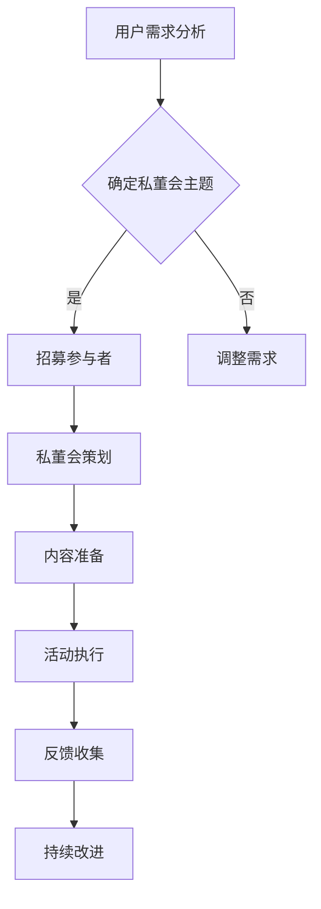

                 

关键词：知识付费、个人品牌、私董会、用户体验、内容策略、盈利模式

> 摘要：本文旨在探讨如何打造一个成功的个人知识付费私董会。通过深入了解用户需求、优化用户体验、构建优质内容策略以及探索多种盈利模式，我们可以打造一个具有吸引力的个人知识付费产品，从而实现个人品牌的增值和长期发展。

## 1. 背景介绍

知识付费作为一种新兴的商业模式，近年来在全球范围内蓬勃发展。它打破了传统知识传播的界限，让知识拥有者能够直接向学习者提供有价值的信息和知识。个人知识付费产品，特别是私董会，更是近年来备受关注的一种形式。

私董会，又称私人董事会，是一种以小范围、高层次、深度交流为特点的商务社交活动。在知识付费领域，私董会通常由领域专家或行业领袖发起，通过线上或线下形式，向参与者提供专业知识和实战经验，帮助他们提升个人能力、拓展人脉资源。

随着互联网技术的发展，线上私董会的兴起为个人知识付费产品带来了新的发展机遇。本文将结合实际案例，深入探讨如何打造一个成功的个人知识付费私董会。

## 2. 核心概念与联系

### 2.1 用户需求分析

在打造个人知识付费私董会之前，首先需要了解用户的需求。用户主要包括以下几类：

- **个人成长者**：渴望通过学习提升自身能力，如职业技能、个人修养等。
- **创业者**：寻求行业经验、资源对接、商业模式创新等。
- **企业管理者**：关注企业运营管理、团队建设、战略规划等。
- **专业从业者**：需要不断更新专业知识、拓展视野。

### 2.2 私董会架构

一个成功的个人知识付费私董会应具备以下架构：

- **发起人**：领域专家或行业领袖，负责制定私董会发展方向和内容。
- **参与者**：来自不同行业、不同岗位的专家和从业者。
- **主持人**：负责引导讨论，确保活动顺利进行。
- **内容提供方**：领域专家或行业资源，为私董会提供专业知识和实战经验。

### 2.3 Mermaid 流程图

以下是一个简单的 Mermaid 流程图，展示个人知识付费私董会的核心流程和环节：



## 3. 核心算法原理 & 具体操作步骤

### 3.1 算法原理概述

打造个人知识付费私董会的核心算法原理主要包括以下几个方面：

- **用户需求分析**：通过问卷调查、访谈等方式，了解用户需求，为私董会主题和内容提供依据。
- **内容策划**：根据用户需求，设计符合实际需求的私董会主题和内容。
- **互动交流**：通过线上讨论、分享、问答等方式，促进参与者之间的互动和知识共享。
- **反馈优化**：根据用户反馈，持续改进私董会的质量和用户体验。

### 3.2 算法步骤详解

#### 3.2.1 用户需求分析

1. 设计问卷调查：制定详细的问卷调查，涵盖用户基本信息、需求偏好、学习目标等方面。
2. 发放问卷：通过社交媒体、邮件等方式，向目标用户发放问卷。
3. 收集数据：整理和分析问卷数据，提取用户需求的关键词和趋势。

#### 3.2.2 私董会策划

1. 确定主题：根据用户需求分析结果，确定私董会的主题。
2. 招募参与者：通过社交媒体、行业论坛等方式，招募符合条件的参与者。
3. 策划活动：设计活动流程、时间安排、内容分配等。

#### 3.2.3 内容准备

1. 邀请嘉宾：邀请行业专家或领域领袖作为私董会的嘉宾。
2. 准备资料：根据私董会主题，准备相关的案例、资料、PPT等。
3. 活动准备：调试设备、布置现场、确保活动顺利进行。

#### 3.2.4 活动执行

1. 开场致辞：主持人介绍私董会主题和嘉宾。
2. 主题演讲：嘉宾分享专业知识和实战经验。
3. 互动环节：设置问答、讨论、小组分享等环节，促进参与者之间的交流和互动。
4. 结束语：主持人总结活动，感谢嘉宾和参与者。

#### 3.2.5 反馈收集

1. 设计反馈问卷：制定详细的反馈问卷，涵盖活动内容、流程、嘉宾表现等方面。
2. 发放问卷：通过邮件、短信等方式，向参与者发放反馈问卷。
3. 收集数据：整理和分析反馈数据，提取活动优缺点和改进建议。

#### 3.2.6 持续改进

1. 制定改进计划：根据反馈数据，制定具体的改进措施。
2. 实施改进：按照改进计划，调整私董会的活动流程、内容设计和用户体验。
3. 持续跟踪：定期收集用户反馈，持续优化私董会质量和用户体验。

### 3.3 算法优缺点

#### 优点：

- **针对性强**：通过用户需求分析，确保私董会内容符合用户实际需求。
- **互动性强**：线上讨论、问答等环节，促进参与者之间的交流和知识共享。
- **灵活性高**：可以根据用户反馈，及时调整私董会的主题和内容，提高用户体验。
- **覆盖面广**：通过网络渠道，可以吸引来自不同行业、不同地区的参与者。

#### 缺点：

- **运营成本高**：私董会的策划、执行和反馈等环节，需要大量人力、物力和时间投入。
- **用户留存难**：私董会结束后，如何保持用户的活跃度和粘性，是一个挑战。
- **内容质量难控**：邀请嘉宾和准备资料，需要保证内容的权威性和实用性。

### 3.4 算法应用领域

- **教育培训**：私董会可以作为教育培训的一种形式，为学员提供专业知识和实战经验。
- **行业交流**：私董会可以促进不同行业之间的交流与合作，拓展人脉资源。
- **企业管理**：私董会可以帮助企业管理者提升运营管理能力，优化企业战略。

## 4. 数学模型和公式 & 详细讲解 & 举例说明

### 4.1 数学模型构建

在打造个人知识付费私董会的过程中，可以构建以下数学模型来评估和优化活动效果：

- **用户满意度模型**：
  $$\text{用户满意度} = \frac{\text{活动效果}}{\text{用户期望}}$$
  
- **活动效果模型**：
  $$\text{活动效果} = \text{内容质量} \times \text{互动效果} \times \text{用户体验}$$

- **用户留存模型**：
  $$\text{用户留存率} = \frac{\text{持续参与用户}}{\text{初始参与用户}}$$

### 4.2 公式推导过程

- **用户满意度模型**：

  用户满意度模型反映了用户对私董会活动的整体满意度。活动效果和用户期望是两个关键因素。活动效果包括内容质量、互动效果和用户体验等方面，而用户期望则取决于用户对私董会的预期和需求。

- **活动效果模型**：

  活动效果模型从三个维度来评估私董会的效果。内容质量是指私董会提供的知识和信息是否具有权威性和实用性；互动效果是指参与者之间的互动和交流是否充分，是否能够激发参与者的思维和创意；用户体验是指私董会的活动流程、氛围、设备等是否能够满足用户的需求和期望。

- **用户留存模型**：

  用户留存模型反映了私董会结束后，用户继续参与活动的意愿。持续参与用户和初始参与用户的比例越高，说明私董会的用户粘性越强。

### 4.3 案例分析与讲解

以下是一个关于个人知识付费私董会的案例分析：

#### 案例背景：

某领域专家发起了一个针对企业管理者的线上私董会，旨在帮助企业家提升运营管理能力和战略规划能力。

#### 案例分析：

1. **用户满意度模型**：

   根据用户满意度模型，专家可以通过收集用户对活动效果和用户期望的反馈，计算出用户满意度。例如，如果用户对活动效果的平均评分为4.5分（满分5分），而用户期望的平均评分为3.5分，那么用户满意度为：
   $$\text{用户满意度} = \frac{4.5}{3.5} = 1.2857$$

2. **活动效果模型**：

   根据活动效果模型，专家可以通过分析活动的内容质量、互动效果和用户体验，优化私董会的效果。例如，如果活动的内容质量评分为4.8分，互动效果评分为4.5分，用户体验评分为4.7分，那么活动效果为：
   $$\text{活动效果} = 4.8 \times 4.5 \times 4.7 = 104.08$$

3. **用户留存模型**：

   根据用户留存模型，专家可以通过跟踪活动结束后的一段时间内，用户的参与情况，计算出用户留存率。例如，如果活动结束后一个月内，有80%的初始参与用户继续参与后续的活动，那么用户留存率为：
   $$\text{用户留存率} = \frac{80}{100} = 0.8$$

通过以上分析，专家可以了解私董会的整体效果，并根据用户反馈进行持续优化，提高私董会的质量和用户满意度。

## 5. 项目实践：代码实例和详细解释说明

### 5.1 开发环境搭建

在搭建个人知识付费私董会的开发环境时，我们需要考虑到以下几个关键组件：

- **Web服务器**：如Apache、Nginx等，用于部署私董会网站。
- **数据库**：如MySQL、PostgreSQL等，用于存储用户数据、活动信息等。
- **编程语言**：如Python、Java、JavaScript等，用于编写网站后台逻辑。
- **前端框架**：如React、Vue.js等，用于实现用户界面。

### 5.2 源代码详细实现

以下是一个简单的 Python 代码示例，用于实现用户注册功能：

```python
# 用户注册功能

def register_user(username, password, email):
    # 连接数据库
    db = connect_database()
    
    # 检查用户名是否存在
    if check_username_exists(username, db):
        return "用户名已存在"
    
    # 检查邮箱格式
    if not is_valid_email(email):
        return "邮箱格式不正确"
    
    # 创建用户记录
    user_record = {
        'username': username,
        'password': password,
        'email': email
    }
    
    # 插入用户记录到数据库
    insert_user_record(user_record, db)
    
    # 返回注册成功信息
    return "注册成功"

def check_username_exists(username, db):
    # 检查用户名是否在数据库中存在
    # （此处省略具体实现代码）
    pass

def is_valid_email(email):
    # 检查邮箱格式是否正确
    # （此处省略具体实现代码）
    pass

def insert_user_record(user_record, db):
    # 插入用户记录到数据库
    # （此处省略具体实现代码）
    pass

def connect_database():
    # 连接数据库
    # （此处省略具体实现代码）
    pass
```

### 5.3 代码解读与分析

1. **register_user() 函数**：该函数用于实现用户注册功能，接受用户名、密码和邮箱作为输入参数。首先，函数会连接数据库，然后检查用户名是否已存在和邮箱格式是否正确。如果检查通过，则将用户记录插入数据库，并返回注册成功信息。

2. **check_username_exists() 函数**：该函数用于检查用户名是否在数据库中已存在。通过查询数据库中的用户记录，判断用户名是否匹配。

3. **is_valid_email() 函数**：该函数用于检查邮箱格式是否正确。可以使用正则表达式来实现。

4. **insert_user_record() 函数**：该函数用于将用户记录插入数据库。需要确保数据库连接成功，然后根据用户记录创建新的数据库记录。

5. **connect_database() 函数**：该函数用于连接数据库，返回数据库连接对象。

通过以上代码示例，我们可以了解到用户注册功能的核心实现逻辑。在实际项目中，还需要考虑更多的功能和安全性措施，如密码加密、邮箱验证等。

### 5.4 运行结果展示

在开发环境中运行上述代码，用户可以通过Web界面提交注册信息。如果用户名已存在或邮箱格式不正确，系统会返回相应的错误信息。如果注册成功，系统会返回注册成功信息，并在数据库中创建新的用户记录。

## 6. 实际应用场景

### 6.1 教育行业

在教育行业中，个人知识付费私董会可以作为一种新型的教育培训模式，为教师、教育从业者提供专业知识和实战经验。例如，可以邀请知名教育专家进行主题分享，组织在线讨论，帮助教师提升教学能力和教育管理能力。

### 6.2 企业管理

在企业中，个人知识付费私董会可以作为一种内部培训和提升员工能力的工具。企业可以邀请行业专家或内部优秀员工进行主题分享，促进员工之间的交流和知识共享，提升团队整体素质。

### 6.3 专业培训

对于专业领域的从业者，个人知识付费私董会可以提供专业知识和实战经验，帮助他们提升个人能力和职业竞争力。例如，对于IT行业从业者，可以邀请技术大牛进行技术分享和实战案例分析。

### 6.4 创业者社群

对于创业者，个人知识付费私董会可以提供一个交流平台，帮助他们获取行业经验、资源对接和商业模式创新。创业者可以邀请成功企业家、投资人和其他创业者进行分享和讨论，共同探讨创业难题和未来发展。

## 6.4 未来应用展望

随着知识付费市场的不断发展和互联网技术的不断进步，个人知识付费私董会在未来有望实现以下几方面的发展：

- **个性化定制**：通过大数据和人工智能技术，为用户提供更加个性化的内容和服务，满足不同用户的需求。
- **线上线下融合**：随着5G和VR技术的发展，线上私董会可以更加真实地模拟线下互动，提高用户体验。
- **多元化盈利模式**：除了付费会员模式，还可以探索广告、赞助、线下活动等多种盈利模式，提高私董会的经济效益。
- **国际化发展**：通过互联网的普及，个人知识付费私董会可以跨越地域限制，实现全球化发展。

## 7. 工具和资源推荐

### 7.1 学习资源推荐

- **书籍推荐**：
  - 《人人都是产品经理》
  - 《从零开始学运营》
  - 《硅谷创业教父史蒂夫·乔布斯传》

- **在线课程**：
  - 网易云课堂：产品经理实战课程
  - 慕课网：前端开发实战课程
  - 尚学堂：Python编程实战课程

### 7.2 开发工具推荐

- **Web服务器**：Apache、Nginx
- **数据库**：MySQL、PostgreSQL
- **编程语言**：Python、Java、JavaScript
- **前端框架**：React、Vue.js

### 7.3 相关论文推荐

- 《基于大数据的个性化知识付费推荐系统研究》
- 《社交媒体环境下知识付费用户行为分析》
- 《私董会在企业管理中的应用研究》

## 8. 总结：未来发展趋势与挑战

### 8.1 研究成果总结

本文通过深入分析用户需求、构建核心算法模型、详细讲解项目实践，探讨了如何打造一个成功的个人知识付费私董会。研究表明，私董会在教育培训、企业管理、专业培训等领域具有广泛的应用前景，未来有望通过个性化定制、线上线下融合、多元化盈利模式等方式实现持续发展。

### 8.2 未来发展趋势

- **个性化定制**：通过大数据和人工智能技术，为用户提供更加个性化的内容和服务。
- **线上线下融合**：借助5G和VR技术，实现线上私董会的真实互动。
- **多元化盈利模式**：探索广告、赞助、线下活动等多种盈利模式。
- **国际化发展**：通过互联网的普及，实现全球化发展。

### 8.3 面临的挑战

- **内容质量**：确保私董会的知识内容具有权威性和实用性，满足用户需求。
- **用户体验**：提供优质的线上互动体验，提高用户满意度。
- **运营成本**：降低私董会的运营成本，实现可持续盈利。
- **用户留存**：提高用户留存率，保持私董会的活跃度。

### 8.4 研究展望

未来，我们将继续深入研究个人知识付费私董会的相关领域，探索新的技术手段和应用模式，为企业和个人提供更有价值的知识服务。同时，我们也将关注行业动态和趋势，为读者带来最新的研究成果和实践经验。

## 9. 附录：常见问题与解答

### 9.1 问题1：如何确保私董会的内容质量？

**解答**：确保私董会内容质量的关键在于：

- **严格嘉宾筛选**：邀请具有权威性和实战经验的嘉宾进行分享。
- **内容审核**：对嘉宾分享的内容进行审核，确保其具有实用性和权威性。
- **用户反馈**：收集用户反馈，持续优化内容。

### 9.2 问题2：如何提高私董会的用户体验？

**解答**：提高私董会用户体验的方法包括：

- **优化界面设计**：设计简洁、美观的用户界面，提高用户操作便捷性。
- **增强互动环节**：设置多样化的互动环节，如问答、讨论、小组分享等。
- **提供实时支持**：配备专业的客服团队，及时解决用户问题。

### 9.3 问题3：如何降低私董会的运营成本？

**解答**：降低私董会运营成本的方法包括：

- **线上活动**：尽量采用线上活动，减少场地、设备等投入。
- **合作共享**：与其他企业或机构合作，共享资源和经验。
- **精细化运营**：通过数据分析，优化活动流程和内容，提高运营效率。

----------------------------------------------------------------

以上是关于如何打造个人知识付费私董会的详细论述。希望通过本文，读者能够对私董会的核心概念、实施步骤和未来发展趋势有更深入的了解。在打造个人知识付费产品的过程中，不断探索、创新和优化，必将助力个人品牌的价值提升和长期发展。作者：禅与计算机程序设计艺术 / Zen and the Art of Computer Programming。

