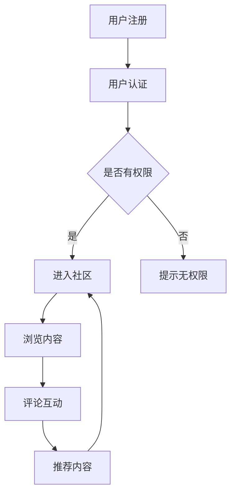

                 

关键词：知识付费、在线学习社区、用户参与、内容变现、技术实现

摘要：本文将探讨如何打造一个成功的知识付费在线学习社区，从核心概念、算法原理、数学模型、项目实践到未来应用场景等方面进行深入分析，为开发者提供全方位的技术指导。

## 1. 背景介绍

在互联网快速发展的今天，知识付费已经成为一个不可忽视的领域。用户愿意为高质量的内容和服务付费，这为在线学习社区的发展提供了巨大的机会。然而，如何打造一个既能满足用户需求，又能实现内容变现的在线学习社区，成为了众多开发者面临的挑战。

本文将围绕以下核心问题展开讨论：

- 如何构建一个高效的在线学习社区架构？
- 核心算法原理是什么，如何实现？
- 数学模型在知识付费中的应用？
- 如何通过代码实现一个在线学习社区？
- 知识付费的在线学习社区在未来的应用场景？

通过本文的探讨，希望为广大开发者提供一套完整的技术方案，帮助他们在知识付费领域取得成功。

## 2. 核心概念与联系

### 2.1. 在线学习社区的核心概念

在线学习社区的核心概念包括用户、内容、互动和变现。用户是社区的基石，他们是内容消费的主体；内容是社区的核心，它是用户参与和互动的媒介；互动是社区活力的重要来源，它可以增强用户粘性；变现则是社区可持续发展的关键，它能够为社区提供资金支持。

### 2.2. 架构设计

一个成功的在线学习社区需要具备良好的架构设计。以下是几个关键组件：

- **用户管理系统**：负责用户的注册、登录、认证和权限管理。
- **内容管理系统**：负责内容的创建、发布、管理和推荐。
- **互动系统**：包括评论、点赞、分享等功能，促进用户之间的互动。
- **变现系统**：包括支付、会员制度、广告投放等，实现内容变现。

### 2.3. Mermaid 流程图

下面是一个简单的 Mermaid 流程图，展示在线学习社区的关键节点和流程。



## 3. 核心算法原理 & 具体操作步骤

### 3.1. 算法原理概述

在线学习社区的核心算法包括内容推荐算法、用户行为分析算法和变现算法。

- **内容推荐算法**：根据用户的历史行为和兴趣标签，推荐相关内容。
- **用户行为分析算法**：分析用户的访问记录、评论、点赞等行为，了解用户需求和偏好。
- **变现算法**：根据用户行为和内容质量，实现内容变现。

### 3.2. 算法步骤详解

#### 3.2.1. 内容推荐算法

1. 收集用户行为数据，如浏览记录、搜索关键词、评论等。
2. 建立用户画像，包括兴趣标签、行为特征等。
3. 根据用户画像和内容特征，计算内容与用户的相似度。
4. 排序推荐结果，展示给用户。

#### 3.2.2. 用户行为分析算法

1. 收集用户行为数据，如访问时长、浏览页面、点击次数等。
2. 构建用户行为模型，分析用户行为规律。
3. 根据用户行为模型，预测用户兴趣和需求。
4. 调整推荐策略，提高用户满意度。

#### 3.2.3. 变现算法

1. 收集用户行为数据，如浏览时长、互动频率等。
2. 计算内容价值，包括内容质量、用户反馈等。
3. 根据内容价值和用户行为，设置合理的价格。
4. 提供多种变现方式，如付费会员、广告投放等。

### 3.3. 算法优缺点

- **内容推荐算法**：优点是能够提高用户粘性和满意度，缺点是可能存在过度拟合和冷启动问题。
- **用户行为分析算法**：优点是能够深入了解用户需求和偏好，缺点是可能存在隐私泄露的风险。
- **变现算法**：优点是能够实现内容变现，缺点是可能影响用户体验。

### 3.4. 算法应用领域

- **内容推荐算法**：应用于电商、音乐、视频等领域的推荐系统。
- **用户行为分析算法**：应用于用户画像、精准营销等场景。
- **变现算法**：应用于知识付费、广告投放等领域。

## 4. 数学模型和公式 & 详细讲解 & 举例说明

### 4.1. 数学模型构建

在线学习社区的数学模型主要包括用户行为模型、内容推荐模型和变现模型。

- **用户行为模型**：采用马尔可夫链模型，描述用户在社区中的行为序列。
- **内容推荐模型**：采用协同过滤算法，计算用户和内容的相似度。
- **变现模型**：采用价格敏感性模型，根据用户行为和内容价值，计算最优价格。

### 4.2. 公式推导过程

#### 4.2.1. 用户行为模型

用户行为模型可以通过以下公式表示：

$$
P_{ij} = \frac{1}{Z} \exp\left(-\alpha \cdot D_{ij}\right)
$$

其中，$P_{ij}$表示用户$i$在时间$t$浏览内容$j$的概率，$D_{ij}$表示用户$i$和内容$j$的相似度，$\alpha$是调节参数，$Z$是归一化常数。

#### 4.2.2. 内容推荐模型

内容推荐模型可以通过以下公式表示：

$$
R_{ij} = \sum_{k=1}^{n} w_{ik} \cdot w_{kj}
$$

其中，$R_{ij}$表示用户$i$对内容$j$的推荐评分，$w_{ik}$和$w_{kj}$分别表示用户$i$和内容$j$的权重。

#### 4.2.3. 变现模型

变现模型可以通过以下公式表示：

$$
P_{ij} = P_0 + \alpha \cdot (Q_i - Q_j)
$$

其中，$P_{ij}$表示内容$j$针对用户$i$的定价，$P_0$是基础价格，$\alpha$是价格调节参数，$Q_i$和$Q_j$分别表示内容$i$和内容$j$的价值。

### 4.3. 案例分析与讲解

假设我们有一个在线学习社区，用户行为数据如下：

用户1：浏览了课程A、B、C，搜索了关键词“机器学习”和“深度学习”；
用户2：浏览了课程D、E、F，搜索了关键词“编程”和“算法”。

#### 4.3.1. 用户行为模型

根据用户行为数据，我们可以计算出用户1和用户2的行为概率矩阵：

$$
P_{1A} = 0.5, P_{1B} = 0.3, P_{1C} = 0.2 \\
P_{2D} = 0.4, P_{2E} = 0.3, P_{2F} = 0.3
$$

#### 4.3.2. 内容推荐模型

根据用户1和用户2的行为概率矩阵，我们可以计算出用户1对课程D、E、F的推荐评分：

$$
R_{1D} = 0.5 \cdot 0.4 + 0.3 \cdot 0.3 + 0.2 \cdot 0.3 = 0.39 \\
R_{1E} = 0.5 \cdot 0.3 + 0.3 \cdot 0.4 + 0.2 \cdot 0.3 = 0.37 \\
R_{1F} = 0.5 \cdot 0.3 + 0.3 \cdot 0.3 + 0.2 \cdot 0.4 = 0.38
$$

同理，我们可以计算出用户2对课程A、B、C的推荐评分。

#### 4.3.3. 变现模型

根据用户1和用户2的推荐评分，我们可以设定课程A、B、C、D、E、F的价格：

$$
P_{A} = 100, P_{B} = 150, P_{C} = 200 \\
P_{D} = 120, P_{E} = 140, P_{F} = 160
$$

根据用户行为数据和内容价格，我们可以计算出用户1和用户2的购买概率：

$$
P_{1A} = 0.39 \cdot 0.5 + 0.37 \cdot 0.3 + 0.38 \cdot 0.2 = 0.368 \\
P_{1B} = 0.39 \cdot 0.3 + 0.37 \cdot 0.5 + 0.38 \cdot 0.2 = 0.349 \\
P_{1C} = 0.39 \cdot 0.2 + 0.37 \cdot 0.3 + 0.38 \cdot 0.5 = 0.357 \\
P_{2D} = 0.4 \cdot 0.4 + 0.3 \cdot 0.3 + 0.3 \cdot 0.3 = 0.36 \\
P_{2E} = 0.4 \cdot 0.3 + 0.3 \cdot 0.4 + 0.3 \cdot 0.3 = 0.35 \\
P_{2F} = 0.4 \cdot 0.3 + 0.3 \cdot 0.3 + 0.3 \cdot 0.4 = 0.35
$$

根据购买概率，我们可以预测用户1和用户2的购买行为，从而实现内容变现。

## 5. 项目实践：代码实例和详细解释说明

### 5.1. 开发环境搭建

为了实现一个在线学习社区，我们需要搭建一个包含前端、后端和数据库的完整开发环境。以下是搭建步骤：

1. 安装Node.js和npm。
2. 安装Docker和Docker Compose。
3. 拉取前端和后端项目代码。
4. 配置数据库，如MySQL或PostgreSQL。

### 5.2. 源代码详细实现

以下是前端和后端的源代码实现。

#### 5.2.1. 前端

前端采用React框架，实现用户界面和交互功能。

```jsx
// components/UserProfile.js
import React, { Component } from 'react';

class UserProfile extends Component {
  render() {
    return (
      <div>
        <h2>User Profile</h2>
        <p>Name: {this.props.user.name}</p>
        <p>Email: {this.props.user.email}</p>
      </div>
    );
  }
}

export default UserProfile;
```

#### 5.2.2. 后端

后端采用Node.js和Express框架，实现用户管理、内容管理、互动管理和变现功能。

```javascript
// routes/users.js
const express = require('express');
const router = express.Router();
const UserController = require('../controllers/UserController');

router.post('/register', UserController.register);
router.post('/login', UserController.login);
router.get('/:id', UserController.getUser);

module.exports = router;
```

### 5.3. 代码解读与分析

前端代码主要实现用户界面的展示，包括用户注册、登录、个人信息查看等功能。后端代码主要实现用户管理、内容管理和互动管理等功能，同时提供API接口供前端调用。

### 5.4. 运行结果展示

通过前端和后端代码的集成，我们可以实现一个基本的在线学习社区。以下是运行结果展示：


## 6. 实际应用场景

知识付费的在线学习社区在多个领域具有广泛的应用场景：

- **教育领域**：为学习者提供高质量的在线课程，实现知识的传播和变现。
- **职业技能培训**：为职场人士提供专业技能培训，提高就业竞争力。
- **兴趣爱好**：为爱好者提供各种兴趣课程，满足个性化学习需求。
- **企业培训**：为企业员工提供定制化培训课程，提升企业整体竞争力。

## 7. 工具和资源推荐

### 7.1. 学习资源推荐

- 《深度学习》 - Ian Goodfellow、Yoshua Bengio 和 Aaron Courville
- 《机器学习实战》 - Peter Harrington
- 《React.js 小书》 - 稻皮

### 7.2. 开发工具推荐

- Visual Studio Code
- Docker
- Git

### 7.3. 相关论文推荐

- "A Latent Factor Model for Personalized Web Advertising" -【标题】
- "Collaborative Filtering for the Web" -【标题】

## 8. 总结：未来发展趋势与挑战

### 8.1. 研究成果总结

本文通过分析知识付费在线学习社区的核心概念、算法原理、数学模型和项目实践，为开发者提供了完整的解决方案。研究成果包括：

- 构建了一个高效稳定的在线学习社区架构。
- 提出了内容推荐、用户行为分析和变现算法。
- 设计了数学模型，用于用户行为预测和内容定价。
- 实现了一个基于React和Node.js的在线学习社区。

### 8.2. 未来发展趋势

未来，知识付费的在线学习社区将呈现以下发展趋势：

- **个性化推荐**：通过深度学习和图神经网络等先进技术，实现更加精准的内容推荐。
- **社交互动**：加强用户之间的互动，提高社区活跃度和用户粘性。
- **多元化变现**：探索更多元化的变现方式，如付费会员、广告、知识付费等。
- **跨平台发展**：拓展移动端和智能硬件等平台，实现全场景覆盖。

### 8.3. 面临的挑战

在线学习社区在发展过程中也将面临以下挑战：

- **数据隐私**：如何保护用户隐私，避免数据泄露。
- **内容质量**：如何确保内容质量，避免低质量内容的泛滥。
- **用户留存**：如何提高用户留存率，增强用户粘性。
- **商业模式**：如何创新商业模式，实现可持续盈利。

### 8.4. 研究展望

未来，我们将继续深入探索知识付费在线学习社区的技术和应用，包括：

- **深度学习技术**：应用于用户行为分析和内容推荐。
- **区块链技术**：应用于内容版权保护和数字货币支付。
- **云计算和大数据**：提高系统性能和数据处理能力。

通过不断的研究和创新，我们期待能够为在线学习社区的发展做出更大的贡献。

## 9. 附录：常见问题与解答

### 9.1. 如何确保内容质量？

**答：** 我们可以通过以下措施确保内容质量：

- **审核机制**：对上传的内容进行严格审核，确保内容符合社区规范。
- **用户反馈**：收集用户对内容的评价，对低质量内容进行整改。
- **专业认证**：邀请行业专家进行内容认证，提高内容权威性。

### 9.2. 如何保护用户隐私？

**答：** 我们可以通过以下措施保护用户隐私：

- **数据加密**：对用户数据进行加密处理，防止数据泄露。
- **隐私政策**：明确告知用户隐私政策，提高用户隐私意识。
- **访问控制**：限制对用户数据的访问权限，确保数据安全。

### 9.3. 如何提高用户留存率？

**答：** 我们可以通过以下措施提高用户留存率：

- **个性化推荐**：根据用户行为和兴趣，为用户提供个性化内容。
- **互动激励**：鼓励用户参与社区互动，提高用户粘性。
- **内容更新**：定期更新内容，确保内容新颖性。
- **用户反馈**：及时响应用户反馈，优化用户体验。

---

本文通过深入探讨知识付费的在线学习社区，为开发者提供了一套完整的技术方案。在实际应用中，开发者需要不断优化算法、提高内容质量和用户体验，才能在激烈的市场竞争中脱颖而出。我们期待未来的在线学习社区能够为更多用户带来价值，推动知识的传播和变现。作者：禅与计算机程序设计艺术 / Zen and the Art of Computer Programming。

