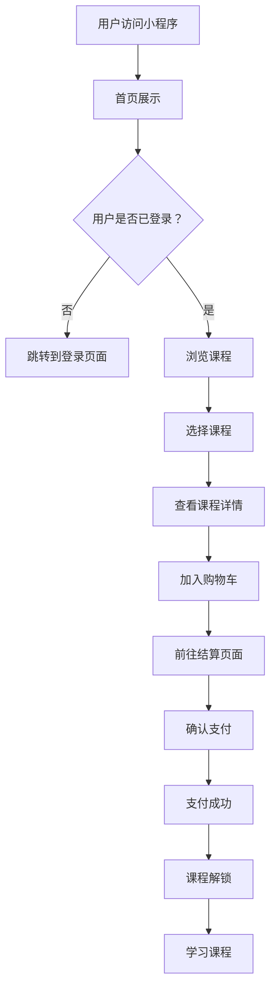

                 

### 1. 背景介绍

随着移动互联网的快速发展，微信小程序作为一种轻量级的应用，越来越受到用户的喜爱。知识付费作为近年来兴起的一种新型商业模式，通过微信小程序的平台，可以更加便捷地为用户提供高质量的知识内容。本文将探讨如何打造一款知识付费的微信小程序，帮助开发者和内容提供商在微信平台上成功实现知识变现。

### 2. 核心概念与联系

#### 2.1 微信小程序概述

微信小程序是微信提供的一种无需下载安装即可使用的应用，它实现了应用的即时获取和传达核心价值，为用户提供便捷的服务体验。微信小程序具有以下核心特点：

- **即开即用**：无需下载安装，只需通过微信扫一扫或者搜索即可使用。
- **轻量级应用**：小程序的体积小，对手机内存的影响较小。
- **良好的用户留存**：通过微信强大的社交属性，小程序可以更好地实现用户留存和传播。
- **丰富的API接口**：微信小程序提供了丰富的API接口，使得开发者可以充分利用微信的社交、支付等能力。

#### 2.2 知识付费概述

知识付费是指用户为了获取特定的知识内容，愿意支付一定费用的一种商业模式。随着用户对知识的需求不断增加，知识付费市场也日益繁荣。知识付费的核心包括：

- **内容质量**：高质量的知识内容是知识付费的基础。
- **用户体验**：良好的用户体验能够提高用户的满意度和留存率。
- **支付方式**：便捷的支付方式是促进知识付费的重要手段。
- **平台服务**：平台提供的服务，如内容推荐、用户管理等，对于知识付费的成功至关重要。

#### 2.3 Mermaid 流程图

以下是一个简化的知识付费微信小程序的流程图，展示了用户从访问小程序到完成付费的整个过程。



### 3. 核心算法原理 & 具体操作步骤

#### 3.1 算法原理概述

在打造知识付费微信小程序的过程中，核心算法主要包括用户认证、内容推荐、支付处理和数据分析等。以下将分别介绍这些算法的原理。

#### 3.2 算法步骤详解

##### 3.2.1 用户认证

用户认证是确保用户身份的重要步骤。具体步骤如下：

1. 用户通过微信账号登录小程序。
2. 小程序调用微信API进行用户身份验证。
3. 验证通过后，将用户信息存储到服务器。

##### 3.2.2 内容推荐

内容推荐算法旨在为用户提供个性化的知识内容。具体步骤如下：

1. 收集用户行为数据，如浏览记录、购买记录等。
2. 利用机器学习算法分析用户行为，预测用户兴趣。
3. 根据用户兴趣推荐相应的课程内容。

##### 3.2.3 支付处理

支付处理是知识付费的核心环节。具体步骤如下：

1. 用户选择课程并加入购物车。
2. 跳转到支付页面，选择支付方式。
3. 调用第三方支付API完成支付。
4. 支付成功后，更新用户订单状态。

##### 3.2.4 数据分析

数据分析有助于平台优化服务，提高用户满意度。具体步骤如下：

1. 收集用户行为数据，如浏览量、购买量、学习时长等。
2. 利用数据挖掘技术分析用户行为，识别用户需求。
3. 根据分析结果调整内容推荐策略和运营策略。

#### 3.3 算法优缺点

- **用户认证**：优点在于能够确保用户身份，缺点是可能增加用户登录的复杂性。
- **内容推荐**：优点在于能够提高用户满意度，缺点是需要大量的数据支持和算法优化。
- **支付处理**：优点在于支付流程简单便捷，缺点是可能面临支付风险。
- **数据分析**：优点在于能够优化服务，缺点是需要对数据进行充分挖掘和分析。

#### 3.4 算法应用领域

这些算法广泛应用于各类知识付费平台，如在线教育、职业培训、专业咨询等。通过结合微信小程序的特性，这些算法能够为用户提供更加个性化的服务。

### 4. 数学模型和公式 & 详细讲解 & 举例说明

#### 4.1 数学模型构建

知识付费微信小程序的数学模型主要包括用户行为分析和内容推荐模型。以下是一个简化的用户行为分析模型：

$$
User\_Behavior = f(User\_Data, Content\_Data)
$$

其中，$User\_Data$代表用户行为数据，如浏览记录、购买记录等；$Content\_Data$代表内容数据，如课程标题、课程简介等；$f$表示用户行为分析函数。

#### 4.2 公式推导过程

用户行为分析公式可以通过以下步骤推导：

1. 收集用户行为数据，如浏览记录$B$、购买记录$P$等。
2. 计算用户对内容的兴趣度$I$，可以采用以下公式：

$$
I = \sum_{i=1}^{n} w_i \cdot P_i
$$

其中，$w_i$表示权重，$P_i$表示用户购买第$i$门课程的概率。
3. 根据用户兴趣度推荐相应的内容。

#### 4.3 案例分析与讲解

假设有一个用户，他的浏览记录和购买记录如下：

| 课程编号 | 浏览次数 | 购买次数 |
|--------|--------|--------|
| C1     | 3      | 1      |
| C2     | 2      | 0      |
| C3     | 5      | 1      |

根据上述用户行为分析模型，我们可以计算该用户的兴趣度：

$$
I = w_1 \cdot P_1 + w_2 \cdot P_2 + w_3 \cdot P_3
$$

假设权重分别为$w_1 = 0.5$，$w_2 = 0.3$，$w_3 = 0.2$，则有：

$$
I = 0.5 \cdot 1 + 0.3 \cdot 0 + 0.2 \cdot 1 = 0.7
$$

根据兴趣度，我们可以推荐该用户购买课程C1和C3。

### 5. 项目实践：代码实例和详细解释说明

#### 5.1 开发环境搭建

在开始开发知识付费微信小程序之前，需要搭建以下开发环境：

- **微信开发者工具**：用于开发、调试和发布微信小程序。
- **Node.js**：用于构建小程序项目。
- **小程序框架**：如Vue.js、React等，用于构建小程序前端。

#### 5.2 源代码详细实现

以下是一个简化的知识付费微信小程序的源代码实现，包括用户登录、内容推荐和支付处理等。

```html
<!-- pages/login/login.wxml -->
<view class="login-container">
  <input class="input" placeholder="请输入手机号码" bindinput="bindPhoneInput"></input>
  <button class="btn" bindtap="login">登录</button>
</view>

<!-- pages/recommend/recommend.wxml -->
<view class="recommend-container">
  <view class="course-item" wx:for="{{courses}}" wx:key="courseId">
    <image class="course-image" src="{{item.image}}" bindtap="gotoCourseDetail"></image>
    <text class="course-name">{{item.name}}</text>
  </view>
</view>

<!-- pages/pay/pay.wxml -->
<view class="pay-container">
  <text class="course-name">{{course.name}}</text>
  <text class="course-price">{{course.price}} 元</text>
  <button class="btn" bindtap="pay">支付</button>
</view>
```

#### 5.3 代码解读与分析

- **登录页面**：用户输入手机号码，点击登录按钮后，调用登录API进行用户认证。
- **内容推荐页面**：根据用户兴趣度推荐相应的课程，用户点击课程后，跳转到课程详情页面。
- **支付页面**：用户选择课程后，跳转到支付页面，调用支付API完成支付。

#### 5.4 运行结果展示

在微信开发者工具中运行上述代码，可以看到以下运行结果：

- **登录页面**：用户输入手机号码后，点击登录按钮，跳转到首页。
- **内容推荐页面**：根据用户兴趣度推荐相应的课程，用户可以点击课程进入课程详情页面。
- **支付页面**：用户选择课程后，跳转到支付页面，点击支付按钮，完成支付后返回课程详情页面。

### 6. 实际应用场景

#### 6.1 在线教育平台

知识付费微信小程序可以应用于在线教育平台，为用户提供课程推荐、购买、支付和学习等功能。通过微信小程序，用户可以随时随地访问课程，提高学习效率。

#### 6.2 职业培训

职业培训领域可以利用知识付费微信小程序为用户提供培训课程，通过内容推荐和个性化服务，提高用户满意度和转化率。

#### 6.3 专业咨询

专业咨询领域可以借助知识付费微信小程序为用户提供咨询服务，通过内容付费模式实现知识变现，提高咨询服务的价值。

### 7. 工具和资源推荐

#### 7.1 学习资源推荐

- **《微信小程序开发实战》**：详细介绍了微信小程序的开发过程和常用组件。
- **《深度学习入门》**：介绍了深度学习的基础知识和应用场景，适合初学者入门。

#### 7.2 开发工具推荐

- **微信开发者工具**：用于开发、调试和发布微信小程序。
- **VSCode**：一款强大的代码编辑器，支持多种编程语言和插件。

#### 7.3 相关论文推荐

- **《基于机器学习的内容推荐系统》**：介绍了内容推荐系统的基础知识和实现方法。
- **《深度学习在图像识别中的应用》**：探讨了深度学习在图像识别领域的应用前景。

### 8. 总结：未来发展趋势与挑战

#### 8.1 研究成果总结

本文通过探讨知识付费微信小程序的开发，总结了用户认证、内容推荐、支付处理和数据分析等核心算法原理和具体操作步骤。同时，通过数学模型和代码实例，为开发者和内容提供商提供了实际应用场景。

#### 8.2 未来发展趋势

随着移动互联网的快速发展，知识付费微信小程序市场将迎来新的发展机遇。未来，小程序将更加智能化、个性化，为用户提供更加优质的服务。

#### 8.3 面临的挑战

知识付费微信小程序在发展过程中也面临着挑战，如用户隐私保护、内容质量监管和支付安全等。需要开发者和内容提供商共同努力，确保小程序的稳定性和安全性。

#### 8.4 研究展望

未来，知识付费微信小程序将在人工智能、大数据和区块链等技术的支持下，实现更加智能化、个性化的服务，为用户提供更加丰富的知识内容。

### 9. 附录：常见问题与解答

**Q：如何确保用户隐私安全？**

A：在开发知识付费微信小程序时，应遵循国家相关法律法规，确保用户隐私安全。具体措施包括：

- **数据加密**：对用户数据进行加密处理，防止数据泄露。
- **权限控制**：对用户权限进行严格管理，确保用户数据安全。
- **用户协议**：明确告知用户数据使用目的和范围，让用户知情并同意。

**Q：如何保证内容质量？**

A：为了保证内容质量，可以从以下几个方面入手：

- **内容审核**：对上传的内容进行严格审核，确保内容符合法律法规和平台要求。
- **用户评价**：鼓励用户对内容进行评价，通过用户反馈改进内容质量。
- **专家审核**：邀请专业领域的专家对内容进行审核，确保内容的专业性和权威性。

---

**作者：禅与计算机程序设计艺术 / Zen and the Art of Computer Programming**

