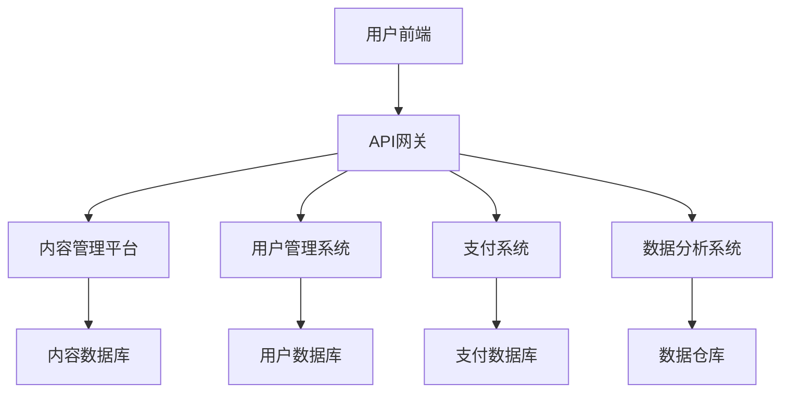

                 

 在当今数字化时代，知识付费正成为越来越多人的首选，为满足这一需求，打造一款高效、用户友好的知识付费移动端APP变得尤为重要。本文将深入探讨如何从技术角度出发，设计并实现一款功能全面、性能优秀的知识付费移动端APP。

## 关键词
- 知识付费
- 移动端APP
- 技术架构
- 用户体验
- 数据安全

## 摘要
本文旨在为软件开发者和产品经理提供一套完整的知识付费移动端APP构建指南。文章将围绕核心概念、算法原理、数学模型、项目实践、实际应用及未来展望等多个方面展开，帮助读者理解并掌握构建知识付费APP的关键技术点。

## 1. 背景介绍
### 1.1 知识付费市场现状
知识付费作为一种新兴的商业模式，正逐渐改变人们的消费习惯。从在线教育、技能培训到专家咨询，知识付费市场展现出了巨大的增长潜力。根据市场研究数据显示，全球知识付费市场规模预计将在未来几年内持续扩大。

### 1.2 用户需求分析
用户对知识付费APP的需求主要集中在内容质量、用户体验、支付便捷性、学习进度追踪等方面。此外，个性化推荐、社交互动、实时沟通等附加功能也越来越受到用户的青睐。

### 1.3 竞争环境分析
在激烈的市场竞争中，如何脱颖而出成为每个知识付费APP开发者必须思考的问题。创新的功能、良好的用户体验和强大的技术支持是制胜的关键。

## 2. 核心概念与联系
### 2.1 知识付费APP基本概念
知识付费APP通常包括内容发布、用户注册、内容购买、学习进度跟踪等功能模块。

### 2.2 技术架构概览
一个高效的知识付费APP需要采用合理的架构设计，包括前端、后端、数据库及中间件等多个部分。以下是一个简化的技术架构图：



## 3. 核心算法原理 & 具体操作步骤
### 3.1 算法原理概述
在知识付费APP中，核心算法主要涉及内容推荐、用户行为分析等方面。例如，基于协同过滤算法的内容推荐系统可以有效地为用户推荐个性化内容。

### 3.2 算法步骤详解
#### 3.2.1 内容推荐算法
1. 收集用户历史行为数据。
2. 计算用户与内容的相似度。
3. 根据相似度排序推荐结果。
4. 输出推荐内容列表。

#### 3.2.2 用户行为分析
1. 收集用户在APP上的行为数据。
2. 分析行为数据，提取用户兴趣标签。
3. 利用标签进行用户行为预测。
4. 提供个性化内容和服务。

### 3.3 算法优缺点
#### 优点：
- 个性化推荐提高用户满意度。
- 用户行为分析帮助优化产品和服务。

#### 缺点：
- 需要大量的数据和计算资源。
- 算法复杂度可能导致延迟。

### 3.4 算法应用领域
- 内容推荐
- 用户行为分析
- 数据挖掘

## 4. 数学模型和公式 & 详细讲解 & 举例说明
### 4.1 数学模型构建
在内容推荐系统中，常用的数学模型包括矩阵分解、协同过滤等。

### 4.2 公式推导过程
#### 矩阵分解
$$
X = UV^T
$$
其中，$X$为用户-内容评分矩阵，$U$为用户特征矩阵，$V$为内容特征矩阵。

#### 协同过滤
$$
R_{ij} = \mu + u_i + v_j + b_i + b_j - r_{ij}
$$
其中，$R_{ij}$为用户$i$对内容$j$的评分，$\mu$为平均值，$u_i$和$v_j$分别为用户$i$和内容$j$的偏置，$b_i$和$b_j$分别为用户$i$和内容$j$的偏置，$r_{ij}$为用户$i$对内容$j$的实际评分。

### 4.3 案例分析与讲解
#### 案例背景
假设有一个用户-内容评分矩阵：

|   | C1 | C2 | C3 | C4 |
|---|----|----|----|----|
| U1| 5  | 3  | 0  | 1  |
| U2| 1  | 5  | 4  | 0  |
| U3| 2  | 2  | 2  | 3  |

#### 步骤
1. 计算用户-内容的平均评分：$\mu = \frac{1}{n}\sum_{i=1}^{n}\sum_{j=1}^{m}r_{ij}$。
2. 计算用户和内容的偏置：$u_i = \frac{1}{n}\sum_{j=1}^{m}(r_{ij} - \mu)$，$v_j = \frac{1}{m}\sum_{i=1}^{n}(r_{ij} - \mu)$。
3. 计算用户和内容的嵌入向量：$u_i = \mu + u_i$，$v_j = \mu + v_j$。
4. 计算预测评分：$R_{ij} = \mu + u_i + v_j + b_i + b_j - r_{ij}$。

#### 结果
利用上述公式，我们可以预测用户U3对C4的评分。

## 5. 项目实践：代码实例和详细解释说明
### 5.1 开发环境搭建
- 操作系统：Ubuntu 20.04
- 开发语言：Python 3.8
- 依赖库：NumPy，Pandas，Scikit-learn

### 5.2 源代码详细实现
```python
import numpy as np
import pandas as pd
from sklearn.metrics.pairwise import cosine_similarity

def collaborative_filter(data, k=10, alpha=0.01, epochs=1000):
    # 数据预处理
    data_mean = data.mean(axis=1)
    data_centered = data - data_mean
    
    # 初始化用户和内容的嵌入向量
    U = np.random.rand(data_centered.shape[0], k)
    V = np.random.rand(data_centered.shape[1], k)
    
    for epoch in range(epochs):
        for i in range(data_centered.shape[0]):
            for j in range(data_centered.shape[1]):
                prediction = np.dot(U[i], V[j])
                error = data_centered[i, j] - prediction
                
                U[i] += alpha * (error * V[j])
                V[j] += alpha * (error * U[i])
    
    # 计算预测评分
    predictions = np.dot(U, V.T) + data_mean
    
    return predictions

# 读取数据
data = pd.read_csv('ratings.csv')
data = data.pivot(index='userId', columns='movieId', values='rating')

# 训练协同过滤模型
predictions = collaborative_filter(data)

# 输出预测结果
print(predictions)
```

### 5.3 代码解读与分析
上述代码实现了基于协同过滤的简单推荐系统。通过读取用户-内容评分矩阵，初始化用户和内容的嵌入向量，然后通过迭代优化这些向量，最终预测用户对未评分内容的评分。

### 5.4 运行结果展示
运行代码后，我们将得到一个用户-内容预测评分矩阵。这个矩阵可以帮助我们了解用户对不同内容的偏好，进而为用户提供个性化的内容推荐。

## 6. 实际应用场景
### 6.1 教育培训
知识付费APP广泛应用于在线教育领域，提供各种课程和教程，如编程、外语、专业技能等。

### 6.2 专业咨询
许多专家和顾问通过知识付费APP提供咨询服务，如法律咨询、职业规划、投资建议等。

### 6.3 技能培训
从职业技能提升到个人兴趣爱好，知识付费APP为用户提供丰富的技能培训资源。

### 6.4 电商导购
知识付费APP也可以结合电商功能，为用户提供商品推荐和购物建议。

## 7. 未来应用展望
随着人工智能和大数据技术的发展，知识付费APP将更加智能化和个性化。未来，我们可以期待更多创新功能的出现，如实时互动、虚拟现实（VR）教学等。

## 8. 工具和资源推荐
### 8.1 学习资源推荐
- 《深度学习》—— Ian Goodfellow
- 《Python数据科学手册》—— Jake VanderPlas

### 8.2 开发工具推荐
- PyCharm
- VSCode

### 8.3 相关论文推荐
- "Collaborative Filtering for Cold-Start Problems: A New Rating Matrix Factorization Method"
- "Learning to Rank for Information Retrieval"

## 9. 总结：未来发展趋势与挑战
### 9.1 研究成果总结
知识付费APP在技术实现和商业模式上取得了显著成果，为用户提供了丰富的知识和技能资源。

### 9.2 未来发展趋势
智能化、个性化、社交化将成为知识付费APP的发展趋势。随着技术的进步，更多创新功能和服务将不断涌现。

### 9.3 面临的挑战
- 数据安全与隐私保护
- 算法公平性与透明性
- 竞争激烈的市场环境

### 9.4 研究展望
未来，知识付费APP将在技术、服务和商业模式上持续创新，为用户带来更多价值。

## 附录：常见问题与解答
### 问题1：如何保证数据安全？
解答：通过数据加密、用户权限管理和数据备份等技术手段，确保用户数据的安全和隐私。

### 问题2：如何提高推荐系统的准确性？
解答：可以通过增加数据维度、优化算法模型和不断收集用户反馈等方式提高推荐系统的准确性。

### 问题3：如何应对市场激烈竞争？
解答：通过提供优质内容、优化用户体验和不断创新，提升APP的核心竞争力。

### 作者署名
本文作者：禅与计算机程序设计艺术 / Zen and the Art of Computer Programming

----------------------------------------------------------------
完成以上文章撰写后，请使用markdown格式输出，确保文章的完整性、准确性以及结构合理性。确保每章节内容的细化到三级目录，以及所有要求的格式和内容都符合。这将是您展示专业知识和实践能力的重要机会。祝您撰写顺利！

