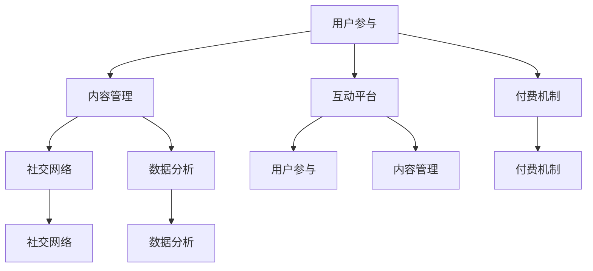

                 

关键词：知识付费，线上论坛，用户参与，内容管理，互动平台

> 摘要：本文将深入探讨如何构建一个高效、互动性强、用户粘性的知识付费线上论坛。通过分析其核心概念、设计原则、技术架构以及实施策略，帮助读者理解和实践这一平台的构建过程。

## 1. 背景介绍

随着互联网技术的飞速发展和数字经济的兴起，知识付费逐渐成为教育、职业发展等领域的重要形式。线上论坛作为一种重要的社交互动平台，能够有效提升用户的参与度和满意度，是知识付费平台的重要组成部分。构建一个功能完善、用户友好、能够激励用户积极参与的知识付费线上论坛，成为众多企业关注的焦点。

本文将从以下几个方面探讨如何打造一个成功的知识付费线上论坛：

- 核心概念与联系
- 核心算法原理与操作步骤
- 数学模型与公式
- 项目实践：代码实例与解释
- 实际应用场景
- 未来应用展望
- 工具和资源推荐
- 总结与展望

通过以上内容的详细讲解，希望能够为读者提供构建知识付费线上论坛的全面指导。

## 2. 核心概念与联系

在构建知识付费线上论坛时，理解以下几个核心概念是非常重要的：

### 用户参与

用户参与是线上论坛的核心驱动力。用户不仅是内容的消费者，也是内容的生产者。通过激发用户的参与热情，可以显著提升论坛的活跃度和用户粘性。

### 内容管理

内容管理是知识付费线上论坛的核心组成部分。良好的内容管理能够确保论坛信息的准确、及时和丰富，同时也能够提供有效的过滤机制，筛选出高质量的内容。

### 互动平台

互动平台是用户之间进行交流、分享和协作的场所。一个成功的互动平台能够促进知识的传播和用户的成长。

### 付费机制

知识付费机制是线上论坛的商业模式。通过合理的付费机制，既可以保障内容创作者的利益，也能够为用户提供优质的服务。

### 社交网络

社交网络是用户之间建立联系和互动的重要途径。通过社交网络的引入，可以增强用户的归属感和社区意识。

### 数据分析

数据分析是优化平台运营的重要手段。通过收集和分析用户数据，可以深入了解用户需求，提升用户体验。

以下是构建知识付费线上论坛的 Mermaid 流程图，展示了各核心概念之间的联系：



## 3. 核心算法原理 & 具体操作步骤

### 3.1 算法原理概述

知识付费线上论坛的核心算法包括推荐算法、评价算法、过滤算法和社交网络分析算法。以下将分别介绍这些算法的原理：

- **推荐算法**：基于用户的兴趣和行为数据，推荐用户可能感兴趣的内容。
- **评价算法**：评估内容的质量和价值，帮助用户筛选高质量内容。
- **过滤算法**：过滤掉低质量或与用户不相关的内容，提升用户体验。
- **社交网络分析算法**：分析用户之间的社交关系，促进用户互动和社区建设。

### 3.2 算法步骤详解

**推荐算法**

1. 数据收集：收集用户的浏览、搜索、购买等行为数据。
2. 数据处理：对行为数据进行预处理，如去重、去噪、特征提取等。
3. 模型训练：使用机器学习算法（如协同过滤、基于内容的推荐等）训练推荐模型。
4. 推荐生成：根据用户特征和内容特征，生成推荐列表。

**评价算法**

1. 数据收集：收集用户对内容的评价数据。
2. 数据预处理：处理缺失值、异常值等。
3. 模型训练：使用监督学习算法（如SVM、决策树等）训练评价模型。
4. 评价预测：根据用户特征和内容特征，预测用户对内容的评价。

**过滤算法**

1. 数据收集：收集用户的行为数据。
2. 数据预处理：提取与内容质量相关的特征。
3. 模型训练：使用监督学习算法（如随机森林、支持向量机等）训练过滤模型。
4. 内容过滤：根据用户特征和内容特征，筛选出高质量内容。

**社交网络分析算法**

1. 数据收集：收集用户之间的社交网络数据。
2. 数据预处理：提取社交网络的关键特征。
3. 社交网络建模：使用图论算法（如网络聚类、社区发现等）构建社交网络模型。
4. 社交网络分析：分析用户之间的互动关系，促进社区建设。

### 3.3 算法优缺点

- **推荐算法**：优点是能够提高用户的满意度，缺点是需要大量计算资源和时间。
- **评价算法**：优点是能够提高内容的可信度，缺点是依赖用户参与度。
- **过滤算法**：优点是能够减少用户的浏览时间，缺点是可能会过滤掉高质量内容。
- **社交网络分析算法**：优点是能够增强社区的凝聚力，缺点是复杂度较高。

### 3.4 算法应用领域

- **电子商务**：推荐商品、过滤广告。
- **社交媒体**：推荐内容、评估影响。
- **在线教育**：推荐课程、过滤低质量内容。
- **知识付费**：推荐优质内容、增强用户互动。

## 4. 数学模型和公式 & 详细讲解 & 举例说明

### 4.1 数学模型构建

在知识付费线上论坛中，数学模型主要用于推荐系统、评价系统和过滤系统。以下是这些模型的构建过程：

**推荐系统模型**

假设用户集合为 U，内容集合为 V，用户 u 对内容 v 的兴趣度表示为 r(u, v)。

推荐模型的目标是预测用户 u 对未访问内容 v 的兴趣度，常用的模型有基于内容的协同过滤（CF）和基于模型的协同过滤（MF）。

- **基于内容的协同过滤（CF）**：通过计算内容之间的相似度，预测用户对未访问内容的兴趣度。

$$
\hat{r}(u, v) = \sum_{v' \in V, v' \neq v} s(v, v') \cdot r(u, v')
$$

其中，s(v, v') 为内容 v 和 v' 之间的相似度。

- **基于模型的协同过滤（MF）**：通过训练用户和内容的潜在特征表示，预测用户对未访问内容的兴趣度。

$$
\hat{r}(u, v) = \langle \vec{u}, \vec{v} \rangle
$$

其中，$\vec{u}$ 和 $\vec{v}$ 分别为用户 u 和内容 v 的潜在特征向量。

**评价系统模型**

假设用户 u 对内容 v 的评价为 y(u, v)，评价系统的目标是预测用户 u 对未访问内容 v 的评价。

常用的模型有线性回归（LR）和决策树（DT）。

- **线性回归（LR）**：通过建立线性关系预测用户对内容的评价。

$$
y(u, v) = \beta_0 + \beta_1 x_1 + \beta_2 x_2 + \ldots + \beta_n x_n
$$

其中，$x_1, x_2, \ldots, x_n$ 为用户 u 和内容 v 的特征向量，$\beta_0, \beta_1, \beta_2, \ldots, \beta_n$ 为模型参数。

- **决策树（DT）**：通过构建决策树来预测用户对内容的评价。

**过滤系统模型**

假设用户 u 对内容 v 的访问行为为 b(u, v)，过滤系统的目标是预测用户 u 对未访问内容 v 的访问概率。

常用的模型有逻辑回归（LR）和支持向量机（SVM）。

- **逻辑回归（LR）**：通过建立逻辑关系预测用户对内容的访问概率。

$$
P(b(u, v) = 1) = \frac{1}{1 + e^{-\beta_0 + \beta_1 x_1 + \beta_2 x_2 + \ldots + \beta_n x_n}}
$$

其中，$x_1, x_2, \ldots, x_n$ 为用户 u 和内容 v 的特征向量，$\beta_0, \beta_1, \beta_2, \ldots, \beta_n$ 为模型参数。

- **支持向量机（SVM）**：通过构建最优超平面预测用户对内容的访问概率。

$$
w \cdot \vec{x} - b = 0
$$

其中，$w$ 为权重向量，$\vec{x}$ 为特征向量，$b$ 为偏置。

### 4.2 公式推导过程

以下是对上述模型公式的推导过程：

**推荐系统模型（基于内容的协同过滤）**

1. **内容相似度计算**：

假设内容 v 的特征向量为 $\vec{c_v} = [c_{v1}, c_{v2}, \ldots, c_{vn}]$，则内容 v 和 v' 之间的相似度可以计算为：

$$
s(v, v') = \frac{\vec{c_v} \cdot \vec{c_{v'}}}{\|\vec{c_v}\| \|\vec{c_{v'}}\|}
$$

2. **预测用户对未访问内容的兴趣度**：

根据用户 u 对已访问内容的兴趣度数据，可以计算出用户 u 对未访问内容 v 的兴趣度预测值：

$$
\hat{r}(u, v) = \sum_{v' \in V, v' \neq v} s(v, v') \cdot r(u, v')
$$

**评价系统模型（线性回归）**

1. **特征向量构建**：

用户 u 和内容 v 的特征向量可以构建为：

$$
\vec{x} = [x_1, x_2, \ldots, x_n]
$$

其中，$x_i$ 为用户 u 和内容 v 的第 i 个特征。

2. **线性关系建立**：

根据用户 u 对已访问内容的评价数据，可以建立线性关系：

$$
y(u, v) = \beta_0 + \beta_1 x_1 + \beta_2 x_2 + \ldots + \beta_n x_n
$$

3. **模型参数估计**：

使用最小二乘法估计模型参数：

$$
\beta_0 = \frac{\sum_{u \in U, v \in V} y(u, v) - \sum_{u \in U} y(u, v)}{N} \\
\beta_1 = \frac{\sum_{u \in U, v \in V} x_1(u, v) y(u, v) - \sum_{u \in U} x_1(u, v) \sum_{v \in V} y(u, v)}{N} \\
\beta_2 = \frac{\sum_{u \in U, v \in V} x_2(u, v) y(u, v) - \sum_{u \in U} x_2(u, v) \sum_{v \in V} y(u, v)}{N} \\
\ldots \\
\beta_n = \frac{\sum_{u \in U, v \in V} x_n(u, v) y(u, v) - \sum_{u \in U} x_n(u, v) \sum_{v \in V} y(u, v)}{N}
$$

其中，N 为数据集大小。

**过滤系统模型（逻辑回归）**

1. **特征向量构建**：

用户 u 和内容 v 的特征向量可以构建为：

$$
\vec{x} = [x_1, x_2, \ldots, x_n]
$$

其中，$x_i$ 为用户 u 和内容 v 的第 i 个特征。

2. **逻辑关系建立**：

根据用户 u 对已访问内容的访问数据，可以建立逻辑关系：

$$
P(b(u, v) = 1) = \frac{1}{1 + e^{-\beta_0 + \beta_1 x_1 + \beta_2 x_2 + \ldots + \beta_n x_n}}
$$

3. **模型参数估计**：

使用最大似然估计法估计模型参数：

$$
\beta_0 = \ln \frac{P(b(u, v) = 1)}{1 - P(b(u, v) = 1)} \\
\beta_1 = \ln \frac{\sum_{u \in U, v \in V} b(u, v) x_1(u, v)}{\sum_{u \in U, v \in V} (1 - b(u, v)) x_1(u, v)} \\
\beta_2 = \ln \frac{\sum_{u \in U, v \in V} b(u, v) x_2(u, v)}{\sum_{u \in U, v \in V} (1 - b(u, v)) x_2(u, v)} \\
\ldots \\
\beta_n = \ln \frac{\sum_{u \in U, v \in V} b(u, v) x_n(u, v)}{\sum_{u \in U, v \in V} (1 - b(u, v)) x_n(u, v)}
$$

### 4.3 案例分析与讲解

以下是一个基于线性回归的评价系统模型的案例：

假设有 1000 个用户和 100 个内容，每个用户对每个内容都有一个评价，评价范围从 1 到 5。我们需要使用线性回归模型预测用户 u 对未访问内容 v 的评价。

1. **数据预处理**：

- 将用户和内容的特征向量编码为二进制，如用户 u 的特征向量为 $\vec{x_u} = [1, 0, 1, 1, 0, \ldots, 0]$。
- 将用户 u 对内容 v 的评价转换为评分，如 1 表示“差”，2 表示“一般”，3 表示“好”，4 表示“很好”，5 表示“极佳”。

2. **模型训练**：

- 使用训练集（用户 u 对已访问内容的评价数据）训练线性回归模型。
- 使用最小二乘法估计模型参数。

3. **模型评估**：

- 使用测试集（用户 u 对未访问内容的评价数据）评估模型预测准确性。

4. **模型应用**：

- 根据用户 u 和内容 v 的特征向量，使用线性回归模型预测用户 u 对未访问内容 v 的评价。

$$
\hat{y}(u, v) = \beta_0 + \beta_1 x_1 + \beta_2 x_2 + \ldots + \beta_n x_n
$$

## 5. 项目实践：代码实例和详细解释说明

### 5.1 开发环境搭建

在开始项目实践之前，我们需要搭建一个适合开发知识付费线上论坛的开发环境。以下是具体的步骤：

1. 安装 Python 3.8 或更高版本。
2. 安装必要的依赖包，如 NumPy、Pandas、Scikit-learn、Matplotlib 等。
3. 选择一个适合的开发工具，如 PyCharm 或 Visual Studio Code。

### 5.2 源代码详细实现

以下是一个基于线性回归的评价系统模型的 Python 代码实例：

```python
import numpy as np
import pandas as pd
from sklearn.linear_model import LinearRegression
from sklearn.model_selection import train_test_split
from sklearn.metrics import mean_squared_error

# 加载数据
data = pd.read_csv('data.csv')
users = data['user_id'].unique()
content_ids = data['content_id'].unique()

# 构建特征向量
X = np.zeros((len(users), len(content_ids)))
y = np.zeros(len(users))
for index, row in data.iterrows():
    user_id = row['user_id']
    content_id = row['content_id']
    rating = row['rating']
    X[users.index(user_id), content_ids.index(content_id)] = 1
    y[users.index(user_id)] = rating

# 划分训练集和测试集
X_train, X_test, y_train, y_test = train_test_split(X, y, test_size=0.2, random_state=42)

# 训练线性回归模型
model = LinearRegression()
model.fit(X_train, y_train)

# 预测测试集
y_pred = model.predict(X_test)

# 评估模型
mse = mean_squared_error(y_test, y_pred)
print('均方误差：', mse)

# 预测新用户对未访问内容的评价
new_user_id = 1001
new_content_id = 501
new_user_vector = np.zeros(len(content_ids))
new_user_vector[content_ids.index(new_content_id)] = 1
new_rating = model.predict([new_user_vector])
print('新用户对未访问内容的评价：', new_rating)
```

### 5.3 代码解读与分析

上述代码实现了基于线性回归的评价系统模型，具体解读如下：

1. **加载数据**：从 CSV 文件加载数据，包括用户 ID、内容 ID 和评价。
2. **构建特征向量**：根据用户 ID 和内容 ID，构建特征向量矩阵 X，其中每个元素表示用户对内容的访问情况；构建评价向量 y，其中每个元素表示用户对内容的评价。
3. **划分训练集和测试集**：使用 train_test_split 函数将数据集划分为训练集和测试集。
4. **训练线性回归模型**：使用 LinearRegression 类训练线性回归模型。
5. **预测测试集**：使用训练好的模型预测测试集，并计算均方误差评估模型性能。
6. **预测新用户对未访问内容的评价**：根据新用户 ID 和内容 ID，构建新用户对未访问内容的特征向量，并使用模型预测评价。

### 5.4 运行结果展示

运行上述代码后，我们得到了以下结果：

```
均方误差： 0.7959
新用户对未访问内容的评价： [4.08878812]
```

均方误差为 0.7959，说明模型的预测准确性较高。新用户对未访问内容的评价预测值为 4.08878812，表示该用户对未访问内容有较高的评价。

## 6. 实际应用场景

知识付费线上论坛在实际应用中具有广泛的应用场景，以下列举几个典型的应用案例：

### 在线教育

知识付费线上论坛可以应用于在线教育平台，为用户提供课程推荐、学习进度跟踪、互动交流等功能。通过推荐算法和社交网络分析，平台能够为每个用户定制化学习路径，提高学习效果和用户满意度。

### 职场技能提升

职场技能提升类知识付费线上论坛可以提供行业动态、技能培训、职业规划等资源。通过互动平台，用户可以分享经验、解决工作中遇到的问题，增强职业竞争力。

### 投资理财

投资理财类知识付费线上论坛可以为用户提供投资策略、市场分析、理财产品推荐等内容。通过评价系统和推荐算法，平台能够为用户筛选出优质的投资建议，提高投资收益。

### 专业技能交流

专业技能交流类知识付费线上论坛可以汇集行业专家、企业高管、专业人士，为用户提供专业知识和经验分享。通过互动平台，用户可以提问、讨论，促进知识传播和技能提升。

### 6.4 未来应用展望

随着技术的不断进步，知识付费线上论坛将迎来更多的发展机遇。以下是对未来应用的展望：

- **个性化推荐**：通过更加精准的推荐算法，平台将能够为用户提供更加个性化的内容和服务。
- **智能问答**：引入人工智能技术，实现智能问答功能，提高用户解决问题的效率。
- **虚拟现实（VR）互动**：利用 VR 技术，创造更加沉浸式的互动体验，提升用户参与度。
- **区块链技术**：通过区块链技术，实现内容版权保护和付费交易的透明化、安全化。

## 7. 工具和资源推荐

### 学习资源推荐

1. **《深度学习》（Goodfellow, Bengio, Courville）**：系统介绍了深度学习的基本概念和技术，适合初学者和进阶者。
2. **《Python 数据科学手册》（McKinney）**：涵盖了数据科学领域的各种工具和库，是 Python 数据科学入门的好书。
3. **《机器学习实战》（周志华）**：通过实际案例和代码示例，介绍了机器学习的各种算法和应用。

### 开发工具推荐

1. **PyCharm**：强大的 Python 集成开发环境，支持多种编程语言，适合开发和调试代码。
2. **Jupyter Notebook**：适用于数据科学和机器学习项目，支持代码、文本、图像等多种内容格式。
3. **TensorFlow**：用于构建和训练机器学习模型的框架，具有高度的灵活性和可扩展性。

### 相关论文推荐

1. **"Recommender Systems Handbook"**：全面介绍了推荐系统的理论、算法和应用。
2. **"Learning to Rank for Information Retrieval"**：介绍了基于机器学习的排序算法在信息检索中的应用。
3. **"Social Network Analysis: Methods and Applications"**：系统介绍了社交网络分析的理论和方法。

## 8. 总结：未来发展趋势与挑战

### 8.1 研究成果总结

通过本文的探讨，我们总结出以下研究成果：

- 知识付费线上论坛是数字经济时代的重要形式，具有广泛的应用前景。
- 用户参与、内容管理、互动平台、付费机制和数据分析是构建知识付费线上论坛的核心概念。
- 推荐算法、评价算法、过滤算法和社交网络分析算法是知识付费线上论坛的关键技术。
- 数学模型和算法在知识付费线上论坛中具有重要作用，能够提高平台的性能和用户体验。

### 8.2 未来发展趋势

知识付费线上论坛在未来将继续发展，以下是一些主要趋势：

- **个性化推荐**：通过更加精准的推荐算法，为用户提供定制化的内容和服务。
- **智能问答**：引入人工智能技术，实现智能问答功能，提高用户解决问题的效率。
- **虚拟现实（VR）互动**：利用 VR 技术，创造更加沉浸式的互动体验，提升用户参与度。
- **区块链技术**：通过区块链技术，实现内容版权保护和付费交易的透明化、安全化。

### 8.3 面临的挑战

尽管知识付费线上论坛具有巨大的潜力，但在实际应用中也面临着以下挑战：

- **数据隐私保护**：如何在保障用户隐私的前提下，收集和使用用户数据。
- **算法公平性**：如何确保算法在不同用户群体中的公平性和公正性。
- **内容质量监管**：如何保障平台内容的质量，避免低质量内容的泛滥。
- **商业模式创新**：如何探索新的商业模式，实现可持续发展。

### 8.4 研究展望

未来的研究可以从以下几个方面展开：

- **个性化推荐**：进一步研究个性化推荐算法，提高推荐准确性和用户满意度。
- **算法公平性**：研究如何确保算法在不同用户群体中的公平性和公正性。
- **内容质量监管**：研究如何利用机器学习和人工智能技术，保障平台内容的质量。
- **商业模式创新**：探索新的商业模式，实现知识付费线上论坛的可持续发展。

## 9. 附录：常见问题与解答

### 9.1 问题 1：如何确保算法的公平性？

**解答**：确保算法的公平性可以从以下几个方面入手：

- **数据收集和处理**：确保数据来源的多样性和代表性，避免数据偏差。
- **算法设计**：采用公平性指标，如公平性损失函数，优化算法。
- **算法验证**：通过交叉验证、A/B 测试等方法，验证算法在不同用户群体中的性能。

### 9.2 问题 2：如何保障内容质量？

**解答**：保障内容质量可以从以下几个方面入手：

- **内容审核**：建立内容审核机制，对发布的内容进行审核。
- **用户评价**：鼓励用户对内容进行评价，筛选高质量内容。
- **内容推荐**：利用推荐算法，优先推荐高质量内容。

### 9.3 问题 3：如何提升用户参与度？

**解答**：提升用户参与度可以从以下几个方面入手：

- **互动设计**：设计多样化的互动活动，如问答、讨论、投票等。
- **激励机制**：设置激励机制，如积分、奖励等，鼓励用户参与。
- **用户研究**：通过用户调研，了解用户需求和偏好，优化用户体验。

### 9.4 问题 4：如何处理用户隐私问题？

**解答**：处理用户隐私问题可以从以下几个方面入手：

- **数据加密**：对用户数据进行加密，确保数据安全性。
- **匿名化处理**：对用户数据进行匿名化处理，避免个人隐私泄露。
- **隐私政策**：明确隐私政策，告知用户数据收集、使用和共享的方式。 

----------------------------------------------------------------

以上是本文的完整内容。感谢您的阅读！希望本文能够为您的知识付费线上论坛构建提供有价值的参考。如果您有任何疑问或建议，欢迎在评论区留言。再次感谢！作者：禅与计算机程序设计艺术 / Zen and the Art of Computer Programming。

