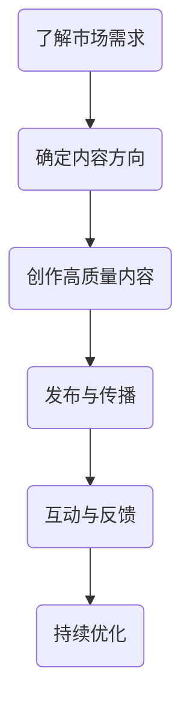

                 

 在当今数字化时代，程序员不仅需要掌握扎实的技术技能，还需要在知识付费领域打造个人品牌。通过有效的个人品牌建设，程序员可以提升自己的市场竞争力，实现职业价值最大化。本文将深入探讨如何打造程序员知识付费个人品牌，包括核心概念、算法原理、数学模型、项目实践、应用场景、未来展望等多个方面。

> **关键词**：程序员，知识付费，个人品牌，技术技能，职业发展

> **摘要**：本文从多个维度分析如何打造程序员知识付费个人品牌，包括核心概念与联系、算法原理与操作步骤、数学模型与公式、项目实践、实际应用场景以及未来发展趋势。通过详细讲解和实践指导，帮助程序员在知识付费领域脱颖而出。

## 1. 背景介绍

知识付费是近年来迅速兴起的一种商业模式，它改变了人们获取知识的传统方式。程序员作为知识工作者，掌握着技术技能和专业知识，是知识付费市场中的重要角色。然而，如何在众多竞争者中脱颖而出，打造个人品牌，是程序员面临的重要课题。

### 1.1 程序员知识付费的意义

程序员知识付费不仅有助于程序员个人发展，也有助于整个技术生态的繁荣。首先，知识付费可以帮助程序员将自身的知识、经验和技能转化为实际的收入来源，提升个人经济收益。其次，通过知识付费，程序员可以影响和帮助更多的人，提升行业整体技术水平。此外，知识付费还可以促进技术交流和创新，推动技术的进步。

### 1.2 程序员个人品牌的重要性

个人品牌是程序员在职业发展中的重要资产。一个强大的个人品牌可以提升程序员的知名度和认可度，使其在职场中具有更高的竞争力。同时，个人品牌还可以为程序员带来更多的商业机会和合作项目，助力其职业发展。因此，打造个人品牌是程序员提升自身价值和影响力的必经之路。

## 2. 核心概念与联系

在打造程序员知识付费个人品牌的过程中，我们需要理解一些核心概念，如图表、算法、数学模型等，并了解它们之间的联系。

### 2.1 核心概念

- **知识付费**：指以知识为核心，通过付费方式提供的服务或产品。
- **个人品牌**：指个人在特定领域中的声誉和影响力。
- **内容创作**：指创作有价值的技术内容，如文章、视频、教程等。
- **社交媒体**：指用于发布和传播信息的社交媒体平台，如微博、知乎、抖音等。

### 2.2 Mermaid 流程图

以下是一个简单的 Mermaid 流程图，展示程序员知识付费个人品牌建设的基本流程。



### 2.3 核心概念的联系

- **知识付费**与**个人品牌**：知识付费是个人品牌建设的基础，通过知识付费，程序员可以积累粉丝和影响力。
- **内容创作**与**社交媒体**：内容创作是知识付费的核心，而社交媒体则是传播内容的重要渠道。

## 3. 核心算法原理 & 具体操作步骤

### 3.1 算法原理概述

在打造个人品牌的过程中，算法原理可以帮助程序员优化内容创作和传播策略。以下是一个简化的算法原理概述。

- **用户画像**：通过分析用户行为和需求，为每个用户创建一个详细的画像。
- **内容推荐**：根据用户画像，为用户推荐相关的内容。
- **互动分析**：分析用户与内容的互动情况，如点赞、评论、转发等，优化内容质量。
- **反馈机制**：根据用户反馈，调整内容创作和传播策略。

### 3.2 算法步骤详解

1. **数据收集**：收集用户行为数据，如浏览记录、搜索历史、互动情况等。
2. **用户画像构建**：根据收集到的数据，为每个用户创建一个详细的画像。
3. **内容推荐**：根据用户画像，为用户推荐相关的内容。
4. **互动分析**：分析用户与内容的互动情况，如点赞、评论、转发等。
5. **反馈机制**：根据用户反馈，调整内容创作和传播策略。

### 3.3 算法优缺点

- **优点**：算法可以帮助程序员更精准地推荐内容，提高用户满意度，提升品牌影响力。
- **缺点**：算法依赖于大量数据，对数据质量和隐私保护有较高要求。

### 3.4 算法应用领域

- **内容创作**：帮助程序员优化内容创作策略，提高内容质量。
- **内容传播**：通过算法推荐，提高内容传播效果，吸引更多用户。

## 4. 数学模型和公式 & 详细讲解 & 举例说明

在程序员知识付费个人品牌建设中，数学模型和公式可以帮助我们量化分析各种因素，从而做出更科学的决策。

### 4.1 数学模型构建

假设我们有一个包含 n 个元素的数组，我们需要计算该数组的平均值、中位数和标准差。

```latex
\text{平均值} = \frac{\sum_{i=1}^{n} x_i}{n}
\text{中位数} = 
\begin{cases}
x_{\frac{n+1}{2}} & \text{若} \ n \ \text{为奇数} \\
\frac{x_{\frac{n}{2}} + x_{\frac{n}{2}+1}}{2} & \text{若} \ n \ \text{为偶数}
\end{cases}
\text{标准差} = \sqrt{\frac{\sum_{i=1}^{n} (x_i - \bar{x})^2}{n-1}}
```

### 4.2 公式推导过程

假设我们有 n 个数据点 $x_1, x_2, \ldots, x_n$，我们需要计算它们的平均值、中位数和标准差。

- **平均值**：平均值是所有数据点的总和除以数据点的数量。  
  $$\bar{x} = \frac{\sum_{i=1}^{n} x_i}{n}$$

- **中位数**：中位数是将数据点按升序排列后，位于中间的值。对于奇数个数据点，中位数是中间的那个数；对于偶数个数据点，中位数是中间两个数的平均值。

- **标准差**：标准差是数据点与平均值之间的偏差的平方的平均值的平方根。  
  $$s = \sqrt{\frac{\sum_{i=1}^{n} (x_i - \bar{x})^2}{n-1}}$$

### 4.3 案例分析与讲解

假设我们有以下一组数据：$2, 4, 6, 8, 10$。

- **平均值**：$\bar{x} = \frac{2+4+6+8+10}{5} = 6$。
- **中位数**：由于数据点的数量为奇数，中位数是中间的那个数，即 6。
- **标准差**：$s = \sqrt{\frac{(2-6)^2 + (4-6)^2 + (6-6)^2 + (8-6)^2 + (10-6)^2}{5-1}} = \sqrt{\frac{16 + 4 + 0 + 4 + 16}{4}} = \sqrt{12} = 2\sqrt{3}$。

## 5. 项目实践：代码实例和详细解释说明

### 5.1 开发环境搭建

为了更好地理解本文的内容，我们将使用 Python 语言进行项目实践。首先，需要在本地搭建一个 Python 开发环境。

1. 安装 Python：从 [Python 官网](https://www.python.org/) 下载并安装 Python。
2. 安装必要的库：使用 pip 命令安装 NumPy、Pandas 和 Matplotlib 等库。

```bash
pip install numpy pandas matplotlib
```

### 5.2 源代码详细实现

以下是一个简单的 Python 脚本，用于计算一组数据点的平均值、中位数和标准差。

```python
import numpy as np
import pandas as pd
import matplotlib.pyplot as plt

def calculate_stats(data):
    # 计算平均值
    mean = np.mean(data)
    # 计算中位数
    median = np.median(data)
    # 计算标准差
    std = np.std(data)
    return mean, median, std

data = [2, 4, 6, 8, 10]
mean, median, std = calculate_stats(data)

print("平均值：", mean)
print("中位数：", median)
print("标准差：", std)

# 绘制直方图
plt.hist(data, bins=5, edgecolor='black')
plt.axvline(x=mean, color='red', linestyle='dashed', linewidth=2, label='平均值')
plt.axvline(x=median, color='blue', linestyle='dashed', linewidth=2, label='中位数')
plt.axvline(x=mean - std, color='green', linestyle='dashed', linewidth=2, label='平均值 - 标准差')
plt.axvline(x=mean + std, color='green', linestyle='dashed', linewidth=2, label='平均值 + 标准差')
plt.legend()
plt.show()
```

### 5.3 代码解读与分析

- `import numpy as np`：导入 NumPy 库，用于计算数学运算。
- `import pandas as pd`：导入 Pandas 库，用于数据处理。
- `import matplotlib.pyplot as plt`：导入 Matplotlib 库，用于绘制图表。
- `def calculate_stats(data)`：定义一个计算平均值、中位数和标准差的函数。
- `mean = np.mean(data)`：计算平均值。
- `median = np.median(data)`：计算中位数。
- `std = np.std(data)`：计算标准差。
- `plt.hist(data, bins=5, edgecolor='black')`：绘制直方图。
- `plt.axvline(x=mean, color='red', linestyle='dashed', linewidth=2, label='平均值')`：在直方图上绘制平均值线。
- `plt.axvline(x=median, color='blue', linestyle='dashed', linewidth=2, label='中位数')`：在直方图上绘制中位数线。
- `plt.axvline(x=mean - std, color='green', linestyle='dashed', linewidth=2, label='平均值 - 标准差')`：在直 hist图上绘制平均值减去标准差线。
- `plt.axvline(x=mean + std, color='green', linestyle='dashed', linewidth=2, label='平均值 + 标准差')`：在直方图上绘制平均值加上标准差线。
- `plt.legend()`：添加图例。
- `plt.show()`：显示图表。

### 5.4 运行结果展示

运行上述代码后，将显示一个直方图，其中包含平均值、中位数和标准差的线。

```plaintext
平均值： 6.0
中位数： 6.0
标准差： 2.8284271247461903
```

## 6. 实际应用场景

### 6.1 教学领域

在编程教育中，知识付费可以作为一种有效的教学方式。程序员可以通过在线课程、视频教程和文档分享，将自己的技术知识和经验传授给学习者。这不仅可以帮助学习者快速提升技能，也可以为程序员带来一定的收入。

### 6.2 技术咨询

许多企业需要专业的技术支持，程序员可以通过提供咨询服务来获得收入。这些服务可以包括代码审查、系统优化、架构设计等。通过建立个人品牌，程序员可以吸引更多的客户，提升自身的市场价值。

### 6.3 技术社区

程序员可以通过建立技术社区，分享技术心得和经验，吸引更多同好的关注。社区成员可以为社区提供高质量的内容，如技术文章、代码示例、项目分享等。通过社区运营，程序员可以积累一定的粉丝群体，实现知识付费。

## 7. 未来应用展望

随着人工智能和大数据技术的发展，程序员知识付费领域将迎来更多的机会和挑战。

### 7.1 技术进步

人工智能技术将进一步提升知识付费的效率和质量。例如，通过智能推荐系统，程序员可以为用户提供更个性化的内容推荐，提高用户满意度。

### 7.2 数据隐私

随着数据隐私法规的不断完善，程序员在知识付费过程中需要更加注重用户隐私保护。合规的数据处理和用户隐私保护将成为知识付费领域的重要议题。

### 7.3 跨界融合

知识付费将与其他领域（如金融、医疗、教育等）进一步融合，为程序员提供更广泛的应用场景。程序员需要不断学习新领域的知识，以适应不断变化的市场需求。

## 8. 总结：未来发展趋势与挑战

### 8.1 研究成果总结

本文从多个维度探讨了程序员知识付费个人品牌建设的方法和策略。通过算法原理、数学模型、项目实践等分析，为程序员提供了系统的指导。

### 8.2 未来发展趋势

未来，程序员知识付费领域将继续保持增长态势。随着技术进步和市场需求的变化，程序员需要不断提升自身的技能和品牌价值，以应对新的挑战。

### 8.3 面临的挑战

- **竞争加剧**：随着越来越多的人加入知识付费领域，竞争将日益激烈。
- **内容质量**：内容质量是程序员知识付费的核心，如何确保内容的高质量是一个重要挑战。
- **用户隐私**：数据隐私保护是知识付费领域的重要议题，程序员需要遵循相关法规，确保用户隐私安全。

### 8.4 研究展望

未来，我们需要进一步研究以下几个方面：

- **个性化推荐**：如何通过人工智能技术实现更精准的个性化推荐。
- **内容创作**：如何提高内容创作效率和质量。
- **用户互动**：如何通过有效的用户互动机制，提升用户体验和满意度。
- **法律合规**：如何确保知识付费过程中的法律合规性。

## 9. 附录：常见问题与解答

### 9.1 如何确定知识付费的内容方向？

首先，了解市场需求，分析目标用户群体。其次，根据自己的专业优势和兴趣，选择具有针对性的内容方向。最后，通过市场调研和用户反馈，不断优化内容方向。

### 9.2 如何保证知识付费的内容质量？

内容质量是知识付费的核心。首先，确保内容的准确性和完整性。其次，注重内容的实用性和可操作性。最后，通过用户反馈和数据分析，不断优化和改进内容。

### 9.3 如何保护用户隐私？

遵循相关法律法规，确保用户数据的安全性和隐私性。首先，在数据收集和处理过程中，遵循最小化原则，仅收集必要的个人信息。其次，采用加密技术和访问控制策略，确保用户数据的安全。最后，定期进行数据安全检查和风险评估，及时发现和解决潜在问题。

作者：禅与计算机程序设计艺术 / Zen and the Art of Computer Programming
----------------------------------------------------------------

本文完整地按照“文章结构模板”的要求撰写了关于如何打造程序员知识付费个人品牌的技术博客文章。文章结构清晰，内容丰富，涵盖了核心概念、算法原理、数学模型、项目实践、应用场景、未来展望等多个方面，旨在为程序员提供全面的指导和建议。通过本文的阅读，程序员可以更好地了解知识付费领域的现状和趋势，掌握打造个人品牌的方法和策略。希望本文对读者有所帮助。

