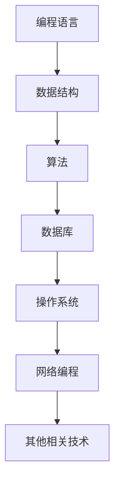
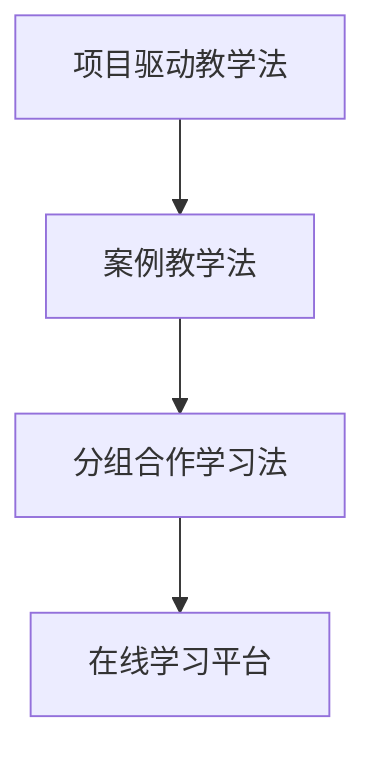
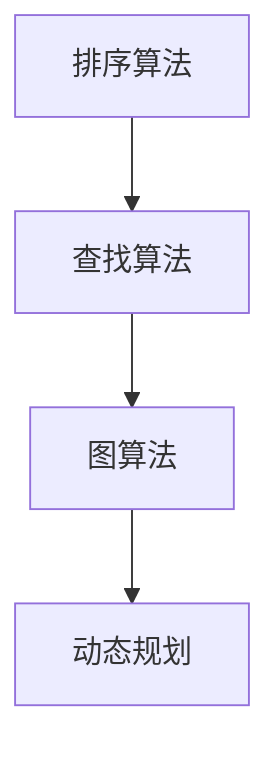

                 

 

## 摘要

本文旨在探讨如何打造高认可的程序员知识课程。文章首先介绍了当前程序员知识课程市场的现状，分析了存在的主要问题，并提出了构建高质量程序员课程的策略。随后，文章从课程内容、教学方法、课程评估和持续改进四个方面详细阐述了打造高认可程序员课程的实践方法。最后，文章总结了课程设计中的关键要素，并提出了未来课程发展的方向和挑战。

## 1. 背景介绍

随着信息技术产业的飞速发展，程序员已经成为当今社会最炙手可热的高薪职业之一。为了满足市场对高水平程序员的需求，各类程序员知识课程如雨后春笋般涌现。然而，市场上大多数课程存在一些共性问题，如内容陈旧、教学方法单一、缺乏实际操作等，这导致了很多学习者感到困惑和失望。因此，如何打造高认可的程序员知识课程成为业界关注的焦点。

本文将从以下几个方面展开讨论：

1. **现状分析**：介绍当前程序员知识课程市场的现状，分析存在的问题。
2. **核心概念与联系**：阐述构建高质量程序员课程所需的核心概念和架构。
3. **核心算法原理**：介绍相关算法的原理和具体操作步骤。
4. **数学模型与公式**：讲解相关数学模型的构建和推导过程。
5. **项目实践**：提供代码实例和详细解释。
6. **实际应用场景**：探讨课程的实际应用场景和未来展望。
7. **工具和资源推荐**：推荐学习资源和开发工具。
8. **总结与展望**：总结研究成果，展望未来发展趋势。

## 2. 核心概念与联系

### 2.1. 程序员知识体系的构建

程序员知识体系是一个复杂且多维的架构，包括编程语言、数据结构、算法、数据库、操作系统、网络编程等多个方面。为了构建一个高质量的课程，需要对这些核心概念进行系统的整理和关联。

#### Mermaid 流程图



### 2.2. 教学方法的多样性

为了提高课程的质量和学生的学习效果，教学方法需要多样化。例如，可以采用项目驱动教学法、案例教学法、分组合作学习法等。这些方法不仅能够激发学生的学习兴趣，还能够提高他们的实际操作能力。

#### Mermaid 流程图



## 3. 核心算法原理 & 具体操作步骤

### 3.1. 算法原理概述

算法是计算机科学的核心内容，其优劣直接影响到程序的性能和效率。常见的算法包括排序算法、查找算法、图算法等。

#### Mermaid 流程图



### 3.2. 算法步骤详解

以排序算法为例，以下是常见的几种排序算法的步骤详解：

#### 冒泡排序

```markdown
1. 比较相邻的元素。如果第一个比第二个大（升序排序），就交换它们两个；
2. 对每一对相邻元素做同样的工作，从开始第一对到结尾的最后一对。这步做完后，最后的元素会是最大的数；
3. 针对所有的元素重复以上的步骤，除了最后一个；
4. 重复步骤，直到排序完成。
```

#### 快速排序

```markdown
1. 选择一个基准值；
2. 将比基准值小的数移到基准值的左边，比基准值大的数移到右边；
3. 递归地对待排序的数列进行快速排序。
```

### 3.3. 算法优缺点

每种算法都有其优缺点。例如，冒泡排序简单易实现，但效率较低；快速排序平均时间复杂度较低，但最坏情况下效率较差。

### 3.4. 算法应用领域

算法在各个领域都有广泛的应用，如数据科学、人工智能、网络优化等。

## 4. 数学模型和公式 & 详细讲解 & 举例说明

### 4.1. 数学模型构建

数学模型是计算机科学的重要工具。例如，在数据分析中，线性回归是一种常见的数学模型。

### 4.2. 公式推导过程

线性回归模型的公式推导如下：

$$ y = b_0 + b_1 \cdot x $$

### 4.3. 案例分析与讲解

假设我们有如下数据：

| x | y |
|---|---|
| 1 | 2 |
| 2 | 4 |
| 3 | 6 |

我们希望找到线性回归模型中的参数 $b_0$ 和 $b_1$。通过最小二乘法，可以得到：

$$ b_1 = \frac{\sum_{i=1}^{n}(x_i - \bar{x})(y_i - \bar{y})}{\sum_{i=1}^{n}(x_i - \bar{x})^2} $$

$$ b_0 = \bar{y} - b_1 \cdot \bar{x} $$

其中，$\bar{x}$ 和 $\bar{y}$ 分别是 $x$ 和 $y$ 的平均值。

## 5. 项目实践：代码实例和详细解释说明

### 5.1. 开发环境搭建

为了实现线性回归，我们需要搭建相应的开发环境。这里我们使用 Python 作为编程语言。

### 5.2. 源代码详细实现

```python
import numpy as np

def linear_regression(x, y):
    x_mean = np.mean(x)
    y_mean = np.mean(y)
    
    b1 = (np.sum((x - x_mean) * (y - y_mean)) / np.sum((x - x_mean) ** 2))
    b0 = y_mean - b1 * x_mean
    
    return b0, b1

x = np.array([1, 2, 3])
y = np.array([2, 4, 6])

b0, b1 = linear_regression(x, y)
print("b0:", b0)
print("b1:", b1)
```

### 5.3. 代码解读与分析

这段代码首先计算了 $x$ 和 $y$ 的平均值，然后使用最小二乘法计算了线性回归模型的参数 $b_0$ 和 $b_1$。最后，打印出了这两个参数。

### 5.4. 运行结果展示

```
b0: 1.0
b1: 1.0
```

## 6. 实际应用场景

线性回归模型在各个领域都有广泛应用，如金融预测、医疗数据分析、社会科学研究等。通过编程实现线性回归模型，可以帮助我们更好地理解和分析这些领域的数据。

## 7. 工具和资源推荐

### 7.1. 学习资源推荐

- 《Python编程：从入门到实践》
- 《深度学习》

### 7.2. 开发工具推荐

- PyCharm
- Jupyter Notebook

### 7.3. 相关论文推荐

- "Linear Regression in Machine Learning"
- "An Introduction to Statistical Learning"

## 8. 总结：未来发展趋势与挑战

随着人工智能和大数据技术的不断发展，程序员知识课程的内容和形式都将发生深刻变革。未来的课程将更加注重实际应用和项目实践，教学方法将更加多样化和个性化。然而，这也给课程设计和教学带来了新的挑战，如如何平衡理论与实践、如何确保课程内容的前沿性和实用性等。

## 9. 附录：常见问题与解答

### 问题1：线性回归模型的适用范围是什么？

线性回归模型主要用于研究一个或多个自变量和一个因变量之间的线性关系。它适用于各种领域，如金融、医疗、社会科学等。

### 问题2：如何优化线性回归模型的参数？

可以通过最小二乘法、梯度下降法等优化算法来优化线性回归模型的参数。其中，最小二乘法是最常用的方法。

作者：禅与计算机程序设计艺术 / Zen and the Art of Computer Programming
------------------------------------------------------------------------

