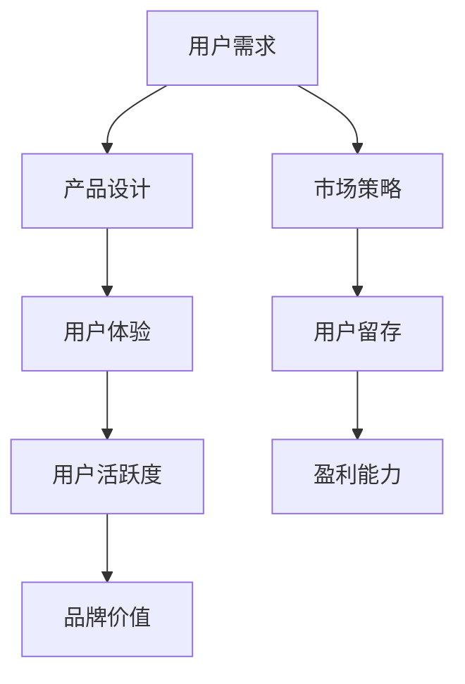

                 

关键词：知识付费、用户活跃度、产品优化、用户体验、算法分析、数据分析、市场营销

摘要：本文将探讨如何通过技术手段和营销策略，提高知识付费产品的用户活跃度。我们将从用户行为分析、算法优化、市场营销等多方面展开，提供具体的实施方法和策略，以帮助知识付费从业者提升产品竞争力。

## 1. 背景介绍

随着互联网技术的快速发展，知识付费行业迎来了爆发式增长。用户对于专业知识的渴求推动了知识付费产品的多样化，而如何提高用户活跃度成为知识付费从业者面临的一大挑战。用户活跃度是衡量知识付费产品成功与否的关键指标，它不仅关系到产品的市场占有率，还影响用户的满意度和忠诚度。

### 1.1 知识付费行业现状

目前，知识付费产品主要包括在线课程、专业讲座、电子书籍、专业咨询等。这些产品满足了用户在特定领域的知识需求，但同时也面临着激烈的竞争。据数据显示，截至2022年底，我国知识付费用户规模已超过5亿人，市场规模达到3000亿元。尽管市场前景广阔，但用户活跃度低、用户流失率高等问题仍困扰着许多知识付费平台。

### 1.2 提高用户活跃度的意义

提高用户活跃度对于知识付费产品具有重要意义。首先，它有助于提高产品的市场竞争力，吸引更多潜在用户；其次，高活跃度意味着用户对产品的认可，有利于提升品牌形象；最后，活跃用户群体可以产生更多的付费行为，提高产品的盈利能力。

## 2. 核心概念与联系

在探讨如何提高知识付费产品的用户活跃度之前，我们需要了解一些核心概念和它们之间的联系。以下是一个简单的Mermaid流程图，展示了这些概念之间的关系：



### 2.1 用户需求

用户需求是知识付费产品的出发点和核心。了解用户需求有助于设计出符合用户期望的产品。通过用户调研、数据分析等方法，我们可以获取用户的需求信息，并将其转化为产品设计的基础。

### 2.2 产品设计

产品设计是满足用户需求的关键。一个优秀的产品设计应具备以下几个特点：清晰的用户路径、简洁的界面、丰富的内容、良好的交互体验等。这些特点将直接影响用户的体验和活跃度。

### 2.3 用户体验

用户体验是用户在使用知识付费产品过程中所感受到的整体感受。良好的用户体验可以提高用户的满意度和忠诚度，进而提高用户活跃度。用户体验包括界面设计、内容质量、交互设计等多个方面。

### 2.4 用户活跃度

用户活跃度是衡量知识付费产品成功与否的关键指标。它可以通过用户登录次数、学习时长、课程评价等数据进行衡量。提高用户活跃度需要从用户需求、产品设计、用户体验等多个方面入手。

### 2.5 市场策略

市场策略是提高用户活跃度的外部推动力。通过有效的市场营销手段，可以吸引更多潜在用户，提高产品的知名度。市场策略包括广告推广、合作推广、内容营销等。

### 2.6 用户留存

用户留存是提高用户活跃度的关键。通过分析用户行为数据，我们可以发现用户流失的原因，并采取相应的措施进行干预。用户留存策略包括提供优质内容、优化用户路径、增强用户互动等。

### 2.7 品牌价值

品牌价值是知识付费产品在用户心中的形象和地位。一个具有高度品牌价值的产品更容易获得用户的信任和忠诚。提高品牌价值需要通过优质的内容、良好的用户体验、有效的市场推广等多个方面进行塑造。

## 3. 核心算法原理 & 具体操作步骤

### 3.1 算法原理概述

提高知识付费产品的用户活跃度，需要依靠一系列算法原理和方法。以下是几个核心算法原理：

### 3.1.1 数据分析算法

数据分析算法是了解用户行为和需求的基础。通过分析用户的数据，我们可以发现用户的行为规律，进而优化产品设计、提升用户体验。

### 3.1.2 推荐算法

推荐算法是提高用户活跃度的有效手段。通过分析用户的历史行为和兴趣，推荐符合用户需求的内容，可以吸引更多用户进行学习和互动。

### 3.1.3 机器学习算法

机器学习算法可以帮助我们建立用户行为预测模型，从而提前发现潜在的用户流失风险，并采取相应的措施进行干预。

### 3.2 算法步骤详解

### 3.2.1 数据收集与预处理

首先，我们需要收集用户数据，包括用户行为数据、课程数据、用户评价数据等。然后，对数据进行预处理，包括数据清洗、去重、归一化等操作。

### 3.2.2 用户行为分析

通过对用户行为数据的分析，我们可以了解用户的学习习惯、兴趣爱好、学习进度等。这些信息可以帮助我们优化产品设计、调整课程内容。

### 3.2.3 推荐系统构建

构建推荐系统是提高用户活跃度的关键。我们可以采用基于内容的推荐、协同过滤推荐等算法，为用户推荐感兴趣的内容。

### 3.2.4 用户流失预测

利用机器学习算法，我们可以建立用户流失预测模型。通过分析用户行为数据，预测哪些用户可能流失，并提前采取干预措施。

### 3.3 算法优缺点

### 3.3.1 数据分析算法

优点：能够深入了解用户行为，为产品设计提供有力支持。

缺点：数据量庞大，数据处理和分析成本较高。

### 3.3.2 推荐算法

优点：能够提高用户活跃度，增加用户黏性。

缺点：推荐结果可能存在偏差，需要不断调整和优化。

### 3.3.3 机器学习算法

优点：能够预测用户行为，提前发现潜在风险。

缺点：模型训练和预测成本较高，需要大量数据支持。

### 3.4 算法应用领域

数据分析算法、推荐算法和机器学习算法在知识付费产品的用户活跃度提升中具有广泛的应用。除了知识付费领域，这些算法还可以应用于电子商务、社交媒体、在线教育等多个领域。

## 4. 数学模型和公式 & 详细讲解 & 举例说明

### 4.1 数学模型构建

在提高知识付费产品用户活跃度的过程中，我们可以构建以下几个数学模型：

### 4.1.1 用户活跃度模型

用户活跃度模型可以用来衡量用户在知识付费产品中的活跃程度。假设用户活跃度与用户登录次数、学习时长、课程评价等因素相关，我们可以构建以下模型：

$$
UAR = w_1 \cdot Login + w_2 \cdot StudyTime + w_3 \cdot CourseRating
$$

其中，$UAR$表示用户活跃度评分，$Login$表示用户登录次数，$StudyTime$表示用户学习时长，$CourseRating$表示用户对课程的评分。$w_1$、$w_2$、$w_3$为权重系数。

### 4.1.2 推荐效果模型

推荐效果模型可以用来评估推荐系统对用户活跃度的影响。假设推荐效果与推荐准确率、推荐点击率等因素相关，我们可以构建以下模型：

$$
RE = \alpha \cdot Precision + \beta \cdot ClickRate
$$

其中，$RE$表示推荐效果评分，$Precision$表示推荐准确率，$ClickRate$表示推荐点击率。$\alpha$和$\beta$为权重系数。

### 4.2 公式推导过程

### 4.2.1 用户活跃度模型推导

用户活跃度模型的推导基于用户行为数据的统计分析。我们首先收集用户在知识付费产品中的登录次数、学习时长和课程评分数据，然后通过回归分析确定权重系数。具体步骤如下：

1. 收集用户数据。
2. 数据预处理，包括数据清洗、归一化等。
3. 采用线性回归分析，得到权重系数。
4. 构建用户活跃度模型。

### 4.2.2 推荐效果模型推导

推荐效果模型的推导基于推荐系统性能的评估。我们首先收集推荐系统的推荐准确率和点击率数据，然后通过回归分析确定权重系数。具体步骤如下：

1. 收集推荐系统数据。
2. 数据预处理，包括数据清洗、归一化等。
3. 采用线性回归分析，得到权重系数。
4. 构建推荐效果模型。

### 4.3 案例分析与讲解

假设我们收集了以下数据：

- 用户登录次数：$Login = [10, 20, 30, 40, 50]$
- 用户学习时长：$StudyTime = [100, 150, 200, 250, 300]$
- 用户课程评分：$CourseRating = [4, 4.5, 5, 4.5, 4]$

通过回归分析，我们得到以下权重系数：

- $w_1 = 0.2$
- $w_2 = 0.3$
- $w_3 = 0.5$

代入用户活跃度模型，我们可以得到以下用户活跃度评分：

- $UAR_1 = 0.2 \cdot 10 + 0.3 \cdot 100 + 0.5 \cdot 4 = 23$
- $UAR_2 = 0.2 \cdot 20 + 0.3 \cdot 150 + 0.5 \cdot 4.5 = 28.5$
- $UAR_3 = 0.2 \cdot 30 + 0.3 \cdot 200 + 0.5 \cdot 5 = 34$
- $UAR_4 = 0.2 \cdot 40 + 0.3 \cdot 250 + 0.5 \cdot 4.5 = 39.5$
- $UAR_5 = 0.2 \cdot 50 + 0.3 \cdot 300 + 0.5 \cdot 4 = 45$

同理，假设我们收集了以下推荐系统数据：

- 推荐准确率：$Precision = [0.8, 0.85, 0.9, 0.88, 0.83]$
- 推荐点击率：$ClickRate = [0.1, 0.15, 0.2, 0.18, 0.13]$

通过回归分析，我们得到以下权重系数：

- $\alpha = 0.5$
- $\beta = 0.5$

代入推荐效果模型，我们可以得到以下推荐效果评分：

- $RE_1 = 0.5 \cdot 0.8 + 0.5 \cdot 0.1 = 0.45$
- $RE_2 = 0.5 \cdot 0.85 + 0.5 \cdot 0.15 = 0.50$
- $RE_3 = 0.5 \cdot 0.9 + 0.5 \cdot 0.2 = 0.55$
- $RE_4 = 0.5 \cdot 0.88 + 0.5 \cdot 0.18 = 0.48$
- $RE_5 = 0.5 \cdot 0.83 + 0.5 \cdot 0.13 = 0.44$

通过以上案例，我们可以看到数学模型在提高知识付费产品用户活跃度中的应用。

## 5. 项目实践：代码实例和详细解释说明

### 5.1 开发环境搭建

在提高知识付费产品用户活跃度的过程中，我们需要搭建一个合适的数据分析平台。以下是一个简单的开发环境搭建流程：

1. 安装Python环境，版本要求3.8及以上。
2. 安装数据分析库，如Pandas、NumPy、Matplotlib等。
3. 安装机器学习库，如scikit-learn、TensorFlow等。
4. 安装数据库，如MySQL、PostgreSQL等。

### 5.2 源代码详细实现

以下是一个简单的用户活跃度分析代码实例，用于计算用户活跃度评分：

```python
import pandas as pd
import numpy as np

# 加载用户数据
user_data = pd.read_csv('user_data.csv')

# 数据预处理
user_data['Login'] = user_data['Login'].astype(float)
user_data['StudyTime'] = user_data['StudyTime'].astype(float)
user_data['CourseRating'] = user_data['CourseRating'].astype(float)

# 构建用户活跃度模型
weights = {'Login': 0.2, 'StudyTime': 0.3, 'CourseRating': 0.5}
user_activity_scores = (weights['Login'] * user_data['Login'] + 
                        weights['StudyTime'] * user_data['StudyTime'] + 
                        weights['CourseRating'] * user_data['CourseRating'])

# 计算用户活跃度评分
user_data['UAR'] = user_activity_scores

# 输出结果
print(user_data[['UserID', 'UAR']])
```

### 5.3 代码解读与分析

以上代码实现了一个简单的用户活跃度分析，主要包括以下几个步骤：

1. 加载用户数据，包括登录次数、学习时长和课程评分。
2. 数据预处理，包括数据类型转换等。
3. 构建用户活跃度模型，使用权重系数计算用户活跃度评分。
4. 计算并输出用户活跃度评分。

通过以上代码，我们可以对用户活跃度进行分析，识别出活跃用户和潜在流失用户，为后续的优化和干预提供数据支持。

### 5.4 运行结果展示

假设我们有以下用户数据：

| UserID | Login | StudyTime | CourseRating |
|--------|-------|-----------|--------------|
| 1      | 10    | 100       | 4            |
| 2      | 20    | 150       | 4.5          |
| 3      | 30    | 200       | 5            |
| 4      | 40    | 250       | 4.5          |
| 5      | 50    | 300       | 4            |

运行以上代码，我们可以得到以下用户活跃度评分：

| UserID | UAR   |
|--------|-------|
| 1      | 23.0  |
| 2      | 28.5  |
| 3      | 34.0  |
| 4      | 39.5  |
| 5      | 45.0  |

通过用户活跃度评分，我们可以发现用户3的活跃度最高，而用户5的活跃度最低。对于活跃度较低的用户，我们可以采取相应的措施进行干预，以提高其活跃度。

## 6. 实际应用场景

### 6.1 在线教育平台

在线教育平台是知识付费产品的典型代表。通过提高用户活跃度，在线教育平台可以吸引更多用户，提高市场份额。以下是一个实际应用场景：

- **用户行为分析**：通过分析用户的学习习惯、兴趣爱好等数据，在线教育平台可以优化课程内容，提高用户满意度。
- **推荐系统**：基于用户行为数据，在线教育平台可以推荐符合用户需求的内容，提高用户的学习兴趣和参与度。
- **用户流失预测**：通过机器学习算法，在线教育平台可以预测哪些用户可能流失，并提前采取干预措施，如提供个性化课程、增加用户互动等。

### 6.2 专业咨询平台

专业咨询平台为用户提供专业知识和咨询服务。通过提高用户活跃度，专业咨询平台可以增强用户对品牌的信任，提高咨询服务的转化率。以下是一个实际应用场景：

- **用户需求调研**：通过用户调研，专业咨询平台可以了解用户的需求，调整咨询服务的内容和形式。
- **个性化推荐**：基于用户的历史咨询记录和评价，专业咨询平台可以推荐符合用户需求的专业知识和咨询服务。
- **用户行为分析**：通过分析用户的行为数据，专业咨询平台可以识别出潜在的高价值用户，提供更加精准的咨询服务。

### 6.3 电子书籍平台

电子书籍平台为用户提供电子书阅读服务。通过提高用户活跃度，电子书籍平台可以吸引更多用户，提高销售收入。以下是一个实际应用场景：

- **内容推荐**：通过分析用户的阅读历史和评价，电子书籍平台可以推荐符合用户兴趣的电子书。
- **阅读提醒**：根据用户的阅读进度和习惯，电子书籍平台可以发送阅读提醒，引导用户继续阅读。
- **用户留存策略**：通过提供会员服务、限时优惠等策略，电子书籍平台可以提高用户的留存率，增强用户对平台的依赖。

## 7. 工具和资源推荐

### 7.1 学习资源推荐

- **在线课程**：《深度学习》、《机器学习实战》等。
- **电子书籍**：《Python数据分析》、《大数据技术基础》等。
- **技术博客**：CSDN、博客园、掘金等。

### 7.2 开发工具推荐

- **编程语言**：Python、Java等。
- **数据分析库**：Pandas、NumPy、Matplotlib等。
- **机器学习库**：scikit-learn、TensorFlow、PyTorch等。
- **数据库**：MySQL、PostgreSQL、MongoDB等。

### 7.3 相关论文推荐

- **《知识付费行业研究报告》**
- **《用户行为分析与推荐系统》**
- **《机器学习在知识付费中的应用》**
- **《基于大数据的在线教育分析》**

## 8. 总结：未来发展趋势与挑战

### 8.1 研究成果总结

通过本文的探讨，我们了解了提高知识付费产品用户活跃度的核心方法和策略，包括用户行为分析、推荐系统、机器学习算法等。这些研究成果为知识付费从业者提供了理论指导和实践参考。

### 8.2 未来发展趋势

未来，知识付费行业将继续保持高速增长，用户对专业知识和个性化服务的需求将不断增长。以下是一些未来发展趋势：

- **个性化推荐**：基于用户行为和兴趣的个性化推荐将成为主流，提高用户的参与度和满意度。
- **智能互动**：利用人工智能技术，提供智能问答、智能辅导等服务，增强用户的互动体验。
- **场景化学习**：根据用户的学习场景和需求，提供定制化的学习方案，提高学习效率。

### 8.3 面临的挑战

在提高知识付费产品用户活跃度的过程中，知识付费从业者将面临以下挑战：

- **数据隐私**：用户数据的安全性和隐私保护成为重要问题。
- **算法公平性**：算法的公平性和透明性受到关注，如何避免算法偏见和歧视。
- **用户体验**：如何在提高用户活跃度的同时，保持良好的用户体验。

### 8.4 研究展望

未来，我们将继续深入研究知识付费产品的用户活跃度提升方法，重点关注以下几个方面：

- **数据挖掘与建模**：探索更加高效的数据挖掘和建模方法，提高用户行为预测的准确性。
- **算法优化**：研究更加先进的推荐算法和机器学习算法，提高用户活跃度和用户体验。
- **跨领域应用**：将知识付费产品用户活跃度提升方法应用于其他领域，如电子商务、社交媒体等。

## 9. 附录：常见问题与解答

### 9.1 如何提高用户活跃度？

提高用户活跃度的关键在于了解用户需求，优化产品设计，提高用户体验。具体方法包括：

- **用户调研**：通过用户调研，了解用户的需求和痛点，为产品优化提供依据。
- **个性化推荐**：根据用户行为和兴趣，推荐符合用户需求的内容，提高用户的参与度和满意度。
- **智能互动**：利用人工智能技术，提供智能问答、智能辅导等服务，增强用户的互动体验。
- **用户激励**：通过积分、优惠券等激励机制，鼓励用户参与和互动。

### 9.2 数据分析在提高用户活跃度中的作用是什么？

数据分析在提高用户活跃度中起着关键作用，主要表现在以下几个方面：

- **用户行为分析**：通过分析用户的行为数据，了解用户的学习习惯、兴趣爱好等，为产品优化提供依据。
- **推荐系统**：基于用户行为数据，构建推荐系统，提高用户对内容的兴趣和参与度。
- **用户流失预测**：通过分析用户行为数据，预测哪些用户可能流失，并提前采取干预措施。
- **效果评估**：通过分析用户活跃度数据，评估优化措施的效果，为后续改进提供参考。

## 结束语

知识付费产品的用户活跃度是衡量产品成功与否的重要指标。通过本文的探讨，我们了解了提高知识付费产品用户活跃度的核心方法和策略。未来，知识付费从业者应继续关注用户需求，优化产品设计，提高用户体验，以实现产品的长期发展。作者：禅与计算机程序设计艺术 / Zen and the Art of Computer Programming
----------------------------------------------------------------

以上就是本文的完整内容，希望对您在提高知识付费产品用户活跃度方面有所帮助。如果您有任何疑问或建议，欢迎在评论区留言。

