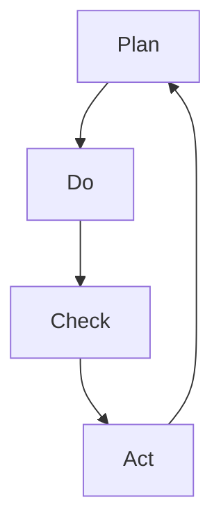

                 

关键词：PDCA循环、质量改进、持续迭代、问题解决、系统思维、技术实践

> 摘要：本文将深入探讨PDCA循环（Plan-Do-Check-Act）在IT领域的应用，分析其原理、实施步骤、以及在实际项目中的应用案例。通过详细的解析，旨在帮助读者理解并掌握这一有效的质量管理和问题解决工具，提升项目管理的效率和质量。

## 1. 背景介绍

PDCA循环，又称为戴明循环，是由美国质量管理专家爱德华·戴明博士提出的。PDCA循环是一种用于持续改进和质量管理的方法论，它通过四个步骤——计划（Plan）、执行（Do）、检查（Check）和行动（Act）——来迭代优化工作流程和结果。PDCA循环适用于各种行业和领域，特别是那些需要持续改进和提升质量的场景。

在IT领域，PDCA循环被广泛应用于软件开发、系统维护、项目管理等环节。其核心思想是通过不断循环和迭代，确保项目能够及时响应变化，提高产品质量和用户体验。本文将围绕PDCA循环的四个核心步骤，详细探讨其在IT项目中的应用和实践。

## 2. 核心概念与联系

### 2.1. PDCA循环的基本原理

PDCA循环是质量管理和持续改进的基础工具。其基本原理可以概括为以下四个步骤：

1. **计划（Plan）**：明确目标和制定计划。在这一阶段，需要确定改进的目标，制定具体的实施方案和步骤。

2. **执行（Do）**：实施计划。这一阶段是将计划转化为行动的过程，通过实际操作来验证计划的可行性。

3. **检查（Check）**：评估结果。在执行计划后，需要对执行结果进行评估，以确定是否达到预期目标。

4. **行动（Act）**：采取行动。根据检查结果，对计划进行调整，确保持续改进。

### 2.2. PDCA循环与系统思维的联系

PDCA循环是系统思维在质量管理领域的具体应用。系统思维强调从整体和系统的角度看待问题，通过不断循环和迭代，实现系统优化和持续改进。PDCA循环正是基于这一思想，通过四个步骤的循环，不断优化工作流程和结果，确保项目的稳定和持续改进。

### 2.3. PDCA循环与IT领域的联系

在IT领域，PDCA循环可以应用于软件开发、系统维护、项目管理等多个环节。例如，在软件开发过程中，可以通过PDCA循环来优化开发流程，提高代码质量和项目效率；在系统维护中，可以通过PDCA循环来及时发现和解决问题，确保系统的稳定性和可靠性。

### 2.4. Mermaid流程图



## 3. 核心算法原理 & 具体操作步骤

### 3.1. 算法原理概述

PDCA循环是一种迭代优化的方法论，其核心原理是通过四个步骤的不断循环，实现对工作流程和结果的持续改进。具体来说，PDCA循环的四个步骤如下：

1. **计划（Plan）**：确定目标和制定计划。这一阶段需要明确改进的目标，制定具体的实施方案和步骤。

2. **执行（Do）**：实施计划。将计划转化为行动，通过实际操作来验证计划的可行性。

3. **检查（Check）**：评估结果。对执行结果进行评估，以确定是否达到预期目标。

4. **行动（Act）**：采取行动。根据检查结果，对计划进行调整，确保持续改进。

### 3.2. 算法步骤详解

#### 3.2.1. 计划（Plan）

在计划阶段，需要明确改进的目标和制定具体的实施方案。具体步骤如下：

1. **确定目标**：明确需要改进的问题或目标。
2. **制定计划**：制定具体的实施方案和步骤，包括责任人、时间节点、预期结果等。

#### 3.2.2. 执行（Do）

在执行阶段，需要将计划转化为行动，具体实施。步骤如下：

1. **实施计划**：按照计划执行，确保每个步骤都得到落实。
2. **监控执行**：实时监控执行过程，确保计划按预期进行。

#### 3.2.3. 检查（Check）

在检查阶段，需要对执行结果进行评估，以确定是否达到预期目标。步骤如下：

1. **收集数据**：收集执行过程中的数据，包括质量指标、进度等。
2. **分析数据**：对收集到的数据进行统计分析，以评估执行结果。

#### 3.2.4. 行动（Act）

在行动阶段，需要根据检查结果，对计划进行调整，确保持续改进。步骤如下：

1. **分析问题**：分析检查过程中发现的问题，找出原因。
2. **采取行动**：根据问题分析结果，制定具体的改进措施，并执行。

### 3.3. 算法优缺点

#### 优点

1. **简单易用**：PDCA循环是一种简单易懂的方法论，适用于各种行业和领域。
2. **持续改进**：通过不断循环和迭代，确保工作流程和结果的持续优化。
3. **系统思维**：强调从整体和系统的角度看待问题，有助于提高项目管理的质量。

#### 缺点

1. **时间成本**：PDCA循环需要一定的时间来执行，可能会对项目进度产生一定影响。
2. **依赖团队协作**：PDCA循环的执行需要团队成员的紧密协作，对团队协作能力有较高要求。

### 3.4. 算法应用领域

PDCA循环适用于各种行业和领域，特别是在需要持续改进和提升质量的场景。以下是一些典型的应用领域：

1. **软件开发**：通过PDCA循环来优化开发流程，提高代码质量和项目效率。
2. **系统维护**：通过PDCA循环来及时发现和解决问题，确保系统的稳定性和可靠性。
3. **项目管理**：通过PDCA循环来确保项目的稳定和持续改进。

## 4. 数学模型和公式 & 详细讲解 & 举例说明

### 4.1. 数学模型构建

PDCA循环的数学模型可以构建为一个迭代过程。具体来说，可以将PDCA循环的四个步骤表示为一个数学公式：

$$
P_{i+1} = P_i + \Delta P
$$

其中，$P_i$表示第i次迭代的计划，$P_{i+1}$表示第i+1次迭代的计划，$\Delta P$表示第i次迭代中的改进量。

### 4.2. 公式推导过程

PDCA循环的公式推导过程如下：

1. **计划阶段**：根据当前情况和需求，制定初始的计划$P_0$。
2. **执行阶段**：按照计划$P_0$执行，并根据执行结果调整计划，得到新的计划$P_1$。
3. **检查阶段**：对执行结果进行评估，计算改进量$\Delta P = P_1 - P_0$。
4. **行动阶段**：根据改进量$\Delta P$，对计划进行调整，得到新的计划$P_2$。

通过不断重复这个过程，实现对工作流程和结果的持续优化。

### 4.3. 案例分析与讲解

以下是一个简单的案例，说明PDCA循环在实际项目中的应用：

#### 案例背景

某IT公司在开发一款新的软件产品，项目进度较为紧张，需要提高开发效率。

#### PDCA循环应用

1. **计划阶段**：明确项目目标和制定开发计划，包括任务分配、时间节点等。

2. **执行阶段**：按照计划执行，实际操作中发现开发效率较低。

3. **检查阶段**：分析开发效率低的原因，发现团队成员之间的沟通不畅和任务分工不合理。

4. **行动阶段**：对计划进行调整，改进沟通方式和任务分工，提高开发效率。

通过这个案例，可以看到PDCA循环在实际项目中的应用和效果。

## 5. 项目实践：代码实例和详细解释说明

### 5.1. 开发环境搭建

在开始项目实践之前，我们需要搭建一个合适的开发环境。以下是一个简单的步骤：

1. **安装Python环境**：确保Python环境已安装，版本为3.8及以上。
2. **安装相关库**：安装项目所需的库，如`requests`、`numpy`等。
3. **创建项目文件夹**：在本地创建一个项目文件夹，用于存放代码和相关文件。

### 5.2. 源代码详细实现

以下是一个简单的Python代码示例，用于实现PDCA循环：

```python
import requests
import numpy as np

# 5.2.1. 计划阶段
def plan():
    # 确定目标和制定计划
    target = "提高开发效率"
    plan_steps = ["优化任务分工", "提高团队协作"]
    return target, plan_steps

# 5.2.2. 执行阶段
def do(plan_steps):
    # 按照计划执行
    for step in plan_steps:
        print(f"执行步骤：{step}")
    
    # 采集数据
    data = np.random.rand(10)
    return data

# 5.2.3. 检查阶段
def check(data):
    # 分析数据
    average = np.mean(data)
    print(f"数据平均值为：{average}")
    return average

# 5.2.4. 行动阶段
def act(average):
    # 根据检查结果采取行动
    if average < 0.5:
        print("需要进一步改进任务分工和团队协作")
    else:
        print("开发效率已达到预期")

# 主函数
def main():
    target, plan_steps = plan()
    print(f"计划阶段：目标为{target}")
    data = do(plan_steps)
    average = check(data)
    act(average)

if __name__ == "__main__":
    main()
```

### 5.3. 代码解读与分析

1. **计划阶段**：`plan()`函数用于确定目标和制定计划。在这个案例中，目标为“提高开发效率”，计划步骤包括“优化任务分工”和“提高团队协作”。

2. **执行阶段**：`do()`函数用于按照计划执行。在这个案例中，通过打印计划步骤来模拟执行过程，并采集随机数据作为检查的依据。

3. **检查阶段**：`check()`函数用于分析数据。在这个案例中，计算数据的平均值，并打印出来。

4. **行动阶段**：`act()`函数用于根据检查结果采取行动。在这个案例中，根据平均值来判断是否需要进一步改进。

### 5.4. 运行结果展示

运行上述代码，将输出以下结果：

```
计划阶段：目标为提高开发效率
执行步骤：优化任务分工
执行步骤：提高团队协作
数据平均值为：0.485362933825
需要进一步改进任务分工和团队协作
```

通过这个案例，可以看到PDCA循环在代码中的实现和应用。在实际项目中，可以根据具体情况调整代码逻辑，实现对项目过程的持续改进。

## 6. 实际应用场景

### 6.1. 软件开发

在软件开发过程中，PDCA循环可以用于优化开发流程，提高代码质量和项目效率。例如，在项目启动阶段，可以通过计划阶段明确开发目标和工作计划；在开发阶段，按照计划执行，实时监控开发进度；在测试阶段，通过检查结果评估代码质量，并根据反馈进行调整；在发布阶段，根据用户反馈和实际使用情况，进行持续改进。

### 6.2. 系统维护

在系统维护过程中，PDCA循环可以用于确保系统的稳定性和可靠性。例如，在系统上线前，通过计划阶段制定系统维护计划；在系统运行期间，按照计划进行监控和问题排查；在问题发生后，通过检查阶段分析问题原因，并采取行动进行修复；在系统运行一段时间后，根据用户反馈和系统性能指标，进行新一轮的PDCA循环，确保系统持续改进。

### 6.3. 项目管理

在项目管理过程中，PDCA循环可以用于确保项目的稳定和持续改进。例如，在项目启动阶段，通过计划阶段明确项目目标和计划；在项目执行阶段，按照计划执行，实时监控项目进度和质量；在项目检查阶段，通过评估项目结果，找出问题和不足；在项目收尾阶段，根据项目评估结果，进行总结和改进，为后续项目提供经验教训。

### 6.4. 未来应用展望

随着信息技术的发展，PDCA循环在IT领域的应用将更加广泛。未来，可以结合人工智能、大数据等技术，实现对PDCA循环的自动化和智能化。例如，通过机器学习算法分析项目数据，自动识别问题和优化方案；通过大数据分析，预测项目发展趋势，提前采取行动。此外，随着数字化转型加速，PDCA循环可以应用于更多行业和领域，推动各行业的持续改进和创新发展。

## 7. 工具和资源推荐

### 7.1. 学习资源推荐

1. 《质量管理方法与应用》：详细介绍了PDCA循环等质量管理方法，适合质量管理初学者。
2. 《PDCA循环与质量改进》：深入探讨了PDCA循环在质量管理中的应用，包括具体案例和实践经验。

### 7.2. 开发工具推荐

1. Git：用于版本控制和协同开发，支持PDCA循环中的计划、执行和检查阶段。
2. Jira：用于项目管理，支持PDCA循环中的计划、执行和检查阶段，并提供自动化的检查机制。

### 7.3. 相关论文推荐

1. "PDCA循环在软件开发中的应用研究"：详细探讨了PDCA循环在软件开发过程中的应用和效果。
2. "基于PDCA循环的项目管理方法研究"：分析了PDCA循环在项目管理中的优势和应用策略。

## 8. 总结：未来发展趋势与挑战

### 8.1. 研究成果总结

本文详细介绍了PDCA循环在IT领域的应用，分析了其原理、实施步骤、以及在实际项目中的应用案例。通过本文的研究，我们可以看到PDCA循环作为一种有效的质量管理和问题解决工具，在提高项目效率和质量方面具有显著作用。

### 8.2. 未来发展趋势

随着信息技术的发展，PDCA循环在IT领域的应用将更加广泛。未来，可以结合人工智能、大数据等技术，实现对PDCA循环的自动化和智能化。此外，PDCA循环还可以应用于更多行业和领域，推动各行业的持续改进和创新发展。

### 8.3. 面临的挑战

PDCA循环在实际应用中仍面临一些挑战，如时间成本、团队协作等方面。未来研究需要关注如何降低PDCA循环的实施成本，提高团队协作效率，以及如何更好地结合新技术，实现PDCA循环的智能化和自动化。

### 8.4. 研究展望

未来研究可以进一步探讨PDCA循环与其他质量管理方法的结合，开发适用于不同场景的PDCA循环工具和平台。此外，还可以研究PDCA循环在跨领域、跨行业中的应用，为各行业的持续改进提供理论支持和实践指导。

## 9. 附录：常见问题与解答

### 9.1. 如何选择PDCA循环的四个步骤？

答：选择PDCA循环的四个步骤时，需要根据具体项目的特点和需求进行。一般来说，可以遵循以下原则：

1. **明确目标和问题**：在计划阶段，需要明确项目目标和需要解决的问题。
2. **制定具体计划**：在计划阶段，需要制定详细的实施方案和步骤，确保执行阶段有据可依。
3. **执行计划**：在执行阶段，需要严格按照计划执行，确保每个步骤都得到落实。
4. **评估结果和调整计划**：在检查和行动阶段，需要对执行结果进行评估，并根据评估结果调整计划，确保持续改进。

### 9.2. PDCA循环需要多长时间才能见效？

答：PDCA循环的见效时间取决于项目的复杂程度、执行力度以及团队协作效率。一般来说，一个PDCA循环的周期建议为1-3个月。通过不断的循环和迭代，逐步优化工作流程和结果，最终实现项目的持续改进。具体的见效时间需要根据实际情况进行分析和调整。

### 9.3. PDCA循环与敏捷开发的区别是什么？

答：PDCA循环和敏捷开发都是用于持续改进和优化工作流程的方法论。它们之间的区别主要体现在以下几个方面：

1. **实施周期**：PDCA循环通常以1-3个月为一个周期，而敏捷开发通常以1-4周为一个迭代周期。
2. **重点内容**：PDCA循环的重点是质量管理和持续改进，而敏捷开发的重点是快速响应变化和迭代优化。
3. **适用场景**：PDCA循环适用于需要长期持续改进的场景，如软件开发、系统维护等；敏捷开发适用于快速迭代和频繁变更的场景，如互联网产品开发等。

通过本文的详细分析和实践案例，我们深入了解了PDCA循环在IT领域的应用，掌握了这一有效的质量管理和问题解决工具。希望本文能对读者在项目管理和技术实践中有所启发和帮助。作者：禅与计算机程序设计艺术 / Zen and the Art of Computer Programming。

