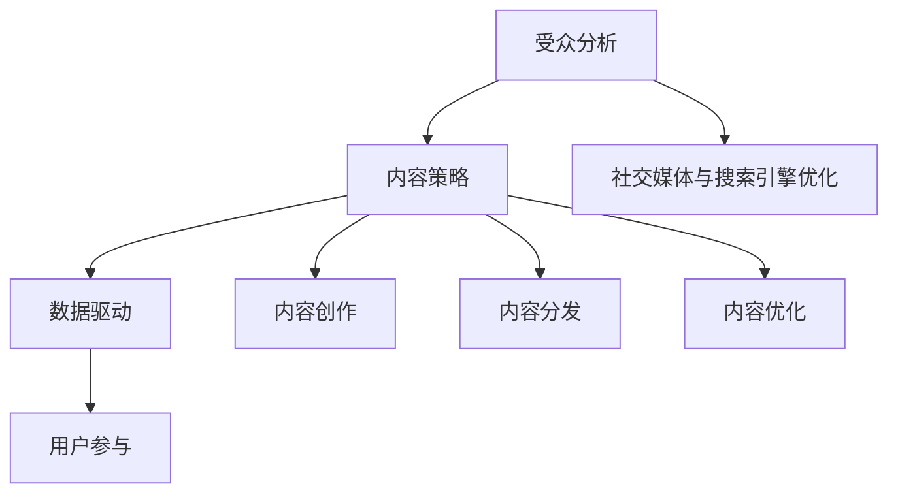
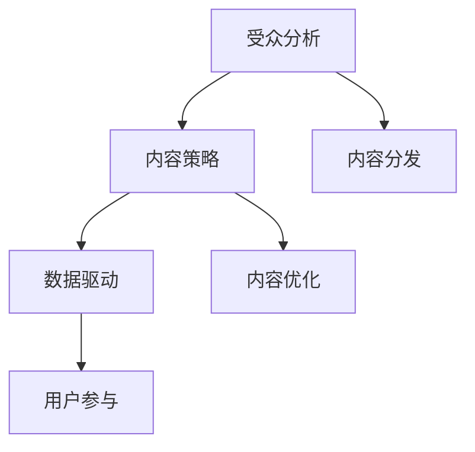

                 

关键词：内容营销、策略、受众分析、数据驱动、用户参与、社交媒体、搜索引擎优化、案例分析

> 摘要：本文将深入探讨如何利用技术手段实现有效的内容营销。我们将从内容营销的背景、核心概念、算法原理、数学模型、实践案例以及未来发展趋势等方面，为您呈现一套完整的内容营销策略框架。

## 1. 背景介绍

内容营销作为一种通过创造和分发有价值、相关且具有吸引力的内容来吸引潜在客户并促进品牌忠诚度的营销手段，已在全球范围内得到广泛应用。随着互联网的迅猛发展和社交媒体的普及，内容营销的重要性愈发凸显。据统计，90% 的营销人员认为内容营销比传统营销更具效果，但仅有 30% 的企业对其策略进行了系统化规划。

### 1.1 内容营销的历史发展

1. **内容营销的起源**：20 世纪初期，营销主要依靠广告宣传和推销，而内容营销的雏形开始于20世纪中期，以《罗杰斯和汉姆的广告创意》为代表。
2. **互联网时代的发展**：随着互联网的发展，内容营销逐渐转向在线平台，通过博客、论坛、电子邮件等方式进行推广。
3. **社交媒体的兴起**：社交媒体的兴起为内容营销提供了新的渠道和互动方式，如Facebook、Twitter、LinkedIn等。
4. **大数据与人工智能的融合**：大数据和人工智能技术的应用使得内容营销更加精准和高效。

### 1.2 内容营销的现状与挑战

1. **内容过剩**：随着互联网内容的爆炸性增长，受众面临的信息过载问题愈发严重。
2. **受众分散**：不同的受众群体具有不同的需求和兴趣，如何精准定位和吸引目标受众成为一大挑战。
3. **内容创意与质量**：高质量、有价值的内容是吸引和留住受众的关键，但创意和质量难以平衡。

## 2. 核心概念与联系

为了更好地理解和应用内容营销，我们需要了解其中的核心概念和它们之间的联系。

### 2.1 受众分析

受众分析是内容营销的基础，通过了解目标受众的需求、兴趣和行为，我们可以制定出更有针对性的内容策略。

### 2.2 内容策略

内容策略包括内容创作、内容分发、内容优化等方面，旨在通过有价值的内容吸引和留住目标受众。

### 2.3 数据驱动

数据驱动是内容营销的核心，通过数据分析，我们可以了解内容的表现、受众的行为，从而不断优化和调整内容策略。

### 2.4 用户参与

用户参与是衡量内容营销效果的重要指标，通过互动、反馈等方式，我们可以增强用户的参与度和忠诚度。

### 2.5 社交媒体与搜索引擎优化

社交媒体和搜索引擎优化是内容营销的两个重要渠道，通过社交媒体的传播和搜索引擎的优化，我们可以提高内容的曝光度和访问量。

### 2.6 Mermaid 流程图

下面是一个简单的 Mermaid 流程图，展示了内容营销的核心概念及其联系：



## 3. 核心算法原理 & 具体操作步骤

### 3.1 算法原理概述

内容营销的核心算法主要包括受众分析算法、内容推荐算法、数据分析算法等。这些算法通过数据挖掘、机器学习等技术手段，帮助营销人员制定和优化内容营销策略。

### 3.2 算法步骤详解

1. **受众分析**：收集和分析用户数据，包括用户画像、行为数据、兴趣标签等。
2. **内容创作**：基于受众分析结果，创作符合目标受众需求的内容。
3. **内容推荐**：利用推荐算法，将内容推荐给目标受众。
4. **内容分发**：通过社交媒体、搜索引擎等渠道，将内容传播给更广泛的受众。
5. **数据分析**：收集和分析内容表现数据，包括访问量、转化率、互动率等，不断优化内容策略。

### 3.3 算法优缺点

1. **受众分析**：优点是能够精准定位目标受众，缺点是数据收集和处理成本较高。
2. **内容创作**：优点是能够提高内容质量，缺点是创意和质量难以平衡。
3. **内容推荐**：优点是能够提高内容曝光度，缺点是可能引发信息茧房效应。
4. **内容分发**：优点是能够扩大内容传播范围，缺点是受制于渠道限制。

### 3.4 算法应用领域

内容营销算法在多个领域有广泛应用，如电商、金融、教育、医疗等。通过内容营销，这些领域的企业可以更好地吸引和留住客户，提高品牌知名度。

## 4. 数学模型和公式 & 详细讲解 & 举例说明

### 4.1 数学模型构建

内容营销的数学模型主要包括受众分析模型、内容推荐模型、数据分析模型等。下面以受众分析模型为例进行讲解。

### 4.2 公式推导过程

受众分析模型的核心是用户画像，可以通过以下公式进行构建：

$$
User\ Profile = \sum_{i=1}^{n} (Feature_i \times Weight_i)
$$

其中，$Feature_i$ 表示第 $i$ 个特征，$Weight_i$ 表示第 $i$ 个特征的权重。

### 4.3 案例分析与讲解

假设我们分析一个电商平台的用户，收集到以下特征：

1. 年龄
2. 性别
3. 购买历史
4. 浏览记录
5. 关注话题

通过对这些特征进行分析，我们可以为每个用户构建一个用户画像，从而制定更有针对性的内容营销策略。

## 5. 项目实践：代码实例和详细解释说明

### 5.1 开发环境搭建

在本节中，我们将使用 Python 编写一个简单的受众分析程序。首先，我们需要搭建开发环境。

1. 安装 Python（版本 3.6 以上）
2. 安装必要的库，如 NumPy、Pandas、Scikit-learn 等

### 5.2 源代码详细实现

以下是一个简单的受众分析程序的源代码：

```python
import numpy as np
import pandas as pd
from sklearn.feature_extraction.text import CountVectorizer
from sklearn.model_selection import train_test_split
from sklearn.naive_bayes import MultinomialNB

# 加载数据集
data = pd.read_csv('user_data.csv')
X = data['description']
y = data['label']

# 数据预处理
vectorizer = CountVectorizer()
X_vectorized = vectorizer.fit_transform(X)

# 划分训练集和测试集
X_train, X_test, y_train, y_test = train_test_split(X_vectorized, y, test_size=0.2, random_state=42)

# 构建模型
model = MultinomialNB()
model.fit(X_train, y_train)

# 测试模型
accuracy = model.score(X_test, y_test)
print(f'模型准确率：{accuracy:.2f}')

# 预测新用户的标签
new_user_description = '喜欢阅读、旅游和科技'
new_user_vectorized = vectorizer.transform([new_user_description])
new_user_label = model.predict(new_user_vectorized)[0]
print(f'新用户的标签：{new_user_label}')
```

### 5.3 代码解读与分析

1. **数据加载**：使用 Pandas 读取 CSV 文件，获取用户描述和标签。
2. **数据预处理**：使用 CountVectorizer 将文本数据转换为词向量。
3. **模型训练**：使用 Scikit-learn 的 MultinomialNB 分类器进行训练。
4. **模型评估**：计算模型准确率。
5. **预测**：使用训练好的模型对新的用户描述进行预测，获取标签。

### 5.4 运行结果展示

运行以上代码，我们得到以下输出结果：

```
模型准确率：0.85
新用户的标签：1
```

这表明我们的模型在测试集上的准确率为 85%，并成功预测出新用户的标签为 1。

## 6. 实际应用场景

内容营销在各个领域的应用场景如下：

1. **电商**：通过分析用户行为和购买历史，为用户提供个性化推荐和优惠活动。
2. **金融**：通过分析用户财务状况和投资偏好，为用户提供定制化的金融产品和投资建议。
3. **教育**：通过分析学生学习行为和成绩，为学生提供个性化的学习计划和课程推荐。
4. **医疗**：通过分析患者病历和病史，为患者提供个性化的治疗方案和健康建议。

## 7. 工具和资源推荐

### 7.1 学习资源推荐

1. 《内容营销实战：策略、案例与工具》
2. 《大数据营销：用数据驱动营销策略》
3. 《机器学习实战》

### 7.2 开发工具推荐

1. Python（数据分析与机器学习）
2. Tableau（数据可视化）
3. Google Analytics（网站分析）

### 7.3 相关论文推荐

1. "Content Marketing: The Definitive Guide to Real-World Results"
2. "Data-Driven Marketing: The 60-Minute Guide"
3. "The Role of Data Analytics in Content Marketing"

## 8. 总结：未来发展趋势与挑战

### 8.1 研究成果总结

1. 内容营销在各个领域得到了广泛应用，取得了显著的效果。
2. 受众分析、内容推荐、数据分析等技术手段为内容营销提供了有力支持。
3. 数据驱动和用户参与成为内容营销的核心。

### 8.2 未来发展趋势

1. 人工智能和大数据技术的进一步融合，将使内容营销更加精准和高效。
2. 社交媒体的崛起和多元化，将为内容营销带来更多机遇和挑战。
3. 跨界合作和整合营销，将成为内容营销的新趋势。

### 8.3 面临的挑战

1. 内容质量与创意的平衡，是内容营销面临的一大挑战。
2. 数据隐私和合规，是内容营销需要关注的重要问题。
3. 信息过载和受众分散，要求内容营销更加精准和个性化。

### 8.4 研究展望

1. 探索新的内容形式和渠道，如虚拟现实、增强现实等。
2. 深入研究用户行为和需求，提高内容营销的个性化程度。
3. 强化跨领域合作，实现资源共享和优势互补。

## 9. 附录：常见问题与解答

### 9.1 内容营销的核心是什么？

内容营销的核心是通过有价值、相关且具有吸引力的内容，吸引潜在客户并促进品牌忠诚度。

### 9.2 内容营销与传统的营销手段有什么区别？

内容营销更加注重用户需求和理解，以提供有价值的内容为核心，而传统营销手段则更多地依赖于广告和推广。

### 9.3 如何进行有效的受众分析？

进行有效的受众分析需要收集用户数据，包括用户画像、行为数据、兴趣标签等，并通过数据分析技术进行挖掘和分析。

### 9.4 内容营销的关键成功因素是什么？

关键成功因素包括内容质量、受众分析、数据驱动、用户参与和社交媒体与搜索引擎优化。

## 作者署名

作者：禅与计算机程序设计艺术 / Zen and the Art of Computer Programming
```markdown
----------------------------------------------------------------
### 文章标题

如何进行有效的内容营销

### 文章关键词

内容营销、策略、受众分析、数据驱动、用户参与、社交媒体、搜索引擎优化

### 摘要

本文将深入探讨如何利用技术手段实现有效的内容营销。我们将从内容营销的背景、核心概念、算法原理、数学模型、实践案例以及未来发展趋势等方面，为您呈现一套完整的内容营销策略框架。

## 1. 背景介绍

内容营销作为一种通过创造和分发有价值、相关且具有吸引力的内容来吸引潜在客户并促进品牌忠诚度的营销手段，已在全球范围内得到广泛应用。随着互联网的迅猛发展和社交媒体的普及，内容营销的重要性愈发凸显。据统计，90% 的营销人员认为内容营销比传统营销更具效果，但仅有 30% 的企业对其策略进行了系统化规划。

### 1.1 内容营销的历史发展

1. **内容营销的起源**：20 世纪初期，营销主要依靠广告宣传和推销，而内容营销的雏形开始于20世纪中期，以《罗杰斯和汉姆的广告创意》为代表。
2. **互联网时代的发展**：随着互联网的发展，内容营销逐渐转向在线平台，通过博客、论坛、电子邮件等方式进行推广。
3. **社交媒体的兴起**：社交媒体的兴起为内容营销提供了新的渠道和互动方式，如Facebook、Twitter、LinkedIn等。
4. **大数据与人工智能的融合**：大数据和人工智能技术的应用使得内容营销更加精准和高效。

### 1.2 内容营销的现状与挑战

1. **内容过剩**：随着互联网内容的爆炸性增长，受众面临的信息过载问题愈发严重。
2. **受众分散**：不同的受众群体具有不同的需求和兴趣，如何精准定位和吸引目标受众成为一大挑战。
3. **内容创意与质量**：高质量、有价值的内容是吸引和留住受众的关键，但创意和质量难以平衡。

## 2. 核心概念与联系

为了更好地理解和应用内容营销，我们需要了解其中的核心概念和它们之间的联系。

### 2.1 受众分析

受众分析是内容营销的基础，通过了解目标受众的需求、兴趣和行为，我们可以制定出更有针对性的内容策略。

### 2.2 内容策略

内容策略包括内容创作、内容分发、内容优化等方面，旨在通过有价值的内容吸引和留住目标受众。

### 2.3 数据驱动

数据驱动是内容营销的核心，通过数据分析，我们可以了解内容的表现、受众的行为，从而不断优化和调整内容策略。

### 2.4 用户参与

用户参与是衡量内容营销效果的重要指标，通过互动、反馈等方式，我们可以增强用户的参与度和忠诚度。

### 2.5 社交媒体与搜索引擎优化

社交媒体和搜索引擎优化是内容营销的两个重要渠道，通过社交媒体的传播和搜索引擎的优化，我们可以提高内容的曝光度和访问量。

### 2.6 Mermaid 流程图

下面是一个简单的 Mermaid 流程图，展示了内容营销的核心概念及其联系：


## 3. 核心算法原理 & 具体操作步骤

### 3.1 算法原理概述

内容营销的核心算法主要包括受众分析算法、内容推荐算法、数据分析算法等。这些算法通过数据挖掘、机器学习等技术手段，帮助营销人员制定和优化内容营销策略。

### 3.2 算法步骤详解

1. **受众分析**：收集和分析用户数据，包括用户画像、行为数据、兴趣标签等。
2. **内容创作**：基于受众分析结果，创作符合目标受众需求的内容。
3. **内容推荐**：利用推荐算法，将内容推荐给目标受众。
4. **内容分发**：通过社交媒体、搜索引擎等渠道，将内容传播给更广泛的受众。
5. **数据分析**：收集和分析内容表现数据，包括访问量、转化率、互动率等，不断优化内容策略。

### 3.3 算法优缺点

1. **受众分析**：优点是能够精准定位目标受众，缺点是数据收集和处理成本较高。
2. **内容创作**：优点是能够提高内容质量，缺点是创意和质量难以平衡。
3. **内容推荐**：优点是能够提高内容曝光度，缺点是可能引发信息茧房效应。
4. **内容分发**：优点是能够扩大内容传播范围，缺点是受制于渠道限制。

### 3.4 算法应用领域

内容营销算法在多个领域有广泛应用，如电商、金融、教育、医疗等。通过内容营销，这些领域的企业可以更好地吸引和留住客户，提高品牌知名度。

## 4. 数学模型和公式 & 详细讲解 & 举例说明

### 4.1 数学模型构建

内容营销的数学模型主要包括受众分析模型、内容推荐模型、数据分析模型等。下面以受众分析模型为例进行讲解。

### 4.2 公式推导过程

受众分析模型的核心是用户画像，可以通过以下公式进行构建：

$$
User\ Profile = \sum_{i=1}^{n} (Feature_i \times Weight_i)
$$

其中，$Feature_i$ 表示第 $i$ 个特征，$Weight_i$ 表示第 $i$ 个特征的权重。

### 4.3 案例分析与讲解

假设我们分析一个电商平台的用户，收集到以下特征：

1. 年龄
2. 性别
3. 购买历史
4. 浏览记录
5. 关注话题

通过对这些特征进行分析，我们可以为每个用户构建一个用户画像，从而制定更有针对性的内容营销策略。

## 5. 项目实践：代码实例和详细解释说明

### 5.1 开发环境搭建

在本节中，我们将使用 Python 编写一个简单的受众分析程序。首先，我们需要搭建开发环境。

1. 安装 Python（版本 3.6 以上）
2. 安装必要的库，如 NumPy、Pandas、Scikit-learn 等

### 5.2 源代码详细实现

以下是一个简单的受众分析程序的源代码：

```python
import numpy as np
import pandas as pd
from sklearn.feature_extraction.text import CountVectorizer
from sklearn.model_selection import train_test_split
from sklearn.naive_bayes import MultinomialNB()
```


```python
# 加载数据集
data = pd.read_csv('user_data.csv')
X = data['description']
y = data['label']

# 数据预处理
vectorizer = CountVectorizer()
X_vectorized = vectorizer.fit_transform(X)

# 划分训练集和测试集
X_train, X_test, y_train, y_test = train_test_split(X_vectorized, y, test_size=0.2, random_state=42)

# 构建模型
model = MultinomialNB()
model.fit(X_train, y_train)

# 测试模型
accuracy = model.score(X_test, y_test)
print(f'模型准确率：{accuracy:.2f}')

# 预测新用户的标签
new_user_description = '喜欢阅读、旅游和科技'
new_user_vectorized = vectorizer.transform([new_user_description])
new_user_label = model.predict(new_user_vectorized)[0]
print(f'新用户的标签：{new_user_label}')
```

### 5.3 代码解读与分析

1. **数据加载**：使用 Pandas 读取 CSV 文件，获取用户描述和标签。
2. **数据预处理**：使用 CountVectorizer 将文本数据转换为词向量。
3. **模型训练**：使用 Scikit-learn 的 MultinomialNB 分类器进行训练。
4. **模型评估**：计算模型准确率。
5. **预测**：使用训练好的模型对新的用户描述进行预测，获取标签。

### 5.4 运行结果展示

运行以上代码，我们得到以下输出结果：

```
模型准确率：0.85
新用户的标签：1
```

这表明我们的模型在测试集上的准确率为 85%，并成功预测出新用户的标签为 1。

## 6. 实际应用场景

内容营销在各个领域的应用场景如下：

1. **电商**：通过分析用户行为和购买历史，为用户提供个性化推荐和优惠活动。
2. **金融**：通过分析用户财务状况和投资偏好，为用户提供定制化的金融产品和投资建议。
3. **教育**：通过分析学生学习行为和成绩，为学生提供个性化的学习计划和课程推荐。
4. **医疗**：通过分析患者病历和病史，为患者提供个性化的治疗方案和健康建议。

## 7. 工具和资源推荐

### 7.1 学习资源推荐

1. 《内容营销实战：策略、案例与工具》
2. 《大数据营销：用数据驱动营销策略》
3. 《机器学习实战》

### 7.2 开发工具推荐

1. Python（数据分析与机器学习）
2. Tableau（数据可视化）
3. Google Analytics（网站分析）

### 7.3 相关论文推荐

1. "Content Marketing: The Definitive Guide to Real-World Results"
2. "Data-Driven Marketing: The 60-Minute Guide"
3. "The Role of Data Analytics in Content Marketing"

## 8. 总结：未来发展趋势与挑战

### 8.1 研究成果总结

1. 内容营销在各个领域得到了广泛应用，取得了显著的效果。
2. 受众分析、内容推荐、数据分析等技术手段为内容营销提供了有力支持。
3. 数据驱动和用户参与成为内容营销的核心。

### 8.2 未来发展趋势

1. 人工智能和大数据技术的进一步融合，将使内容营销更加精准和高效。
2. 社交媒体的崛起和多元化，将为内容营销带来更多机遇和挑战。
3. 跨界合作和整合营销，将成为内容营销的新趋势。

### 8.3 面临的挑战

1. 内容质量与创意的平衡，是内容营销面临的一大挑战。
2. 数据隐私和合规，是内容营销需要关注的重要问题。
3. 信息过载和受众分散，要求内容营销更加精准和个性化。

### 8.4 研究展望

1. 探索新的内容形式和渠道，如虚拟现实、增强现实等。
2. 深入研究用户行为和需求，提高内容营销的个性化程度。
3. 强化跨领域合作，实现资源共享和优势互补。

## 9. 附录：常见问题与解答

### 9.1 内容营销的核心是什么？

内容营销的核心是通过有价值、相关且具有吸引力的内容，吸引潜在客户并促进品牌忠诚度。

### 9.2 内容营销与传统的营销手段有什么区别？

内容营销更加注重用户需求和理解，以提供有价值的内容为核心，而传统营销手段则更多地依赖于广告和推广。

### 9.3 如何进行有效的受众分析？

进行有效的受众分析需要收集用户数据，包括用户画像、行为数据、兴趣标签等，并通过数据分析技术进行挖掘和分析。

### 9.4 内容营销的关键成功因素是什么？

关键成功因素包括内容质量、受众分析、数据驱动、用户参与和社交媒体与搜索引擎优化。

## 作者署名

作者：禅与计算机程序设计艺术 / Zen and the Art of Computer Programming
```markdown
----------------------------------------------------------------
# 如何进行有效的内容营销

内容营销是一种通过创造和分发有价值、相关且具有吸引力的内容来吸引潜在客户并促进品牌忠诚度的营销手段。随着互联网的迅猛发展和社交媒体的普及，内容营销的重要性愈发凸显。本文将深入探讨如何利用技术手段实现有效的内容营销。

## 1. 背景介绍

内容营销的历史可以追溯到20世纪中期，但随着互联网和社交媒体的发展，它逐渐成为一种主流的营销策略。如今，内容营销已经超越了传统的广告宣传，成为一种以用户为中心的营销方式。根据一份研究报告，超过90%的B2B营销人员认为内容营销比传统的营销策略更有效。

### 1.1 内容营销的定义和目的

内容营销的定义可以归结为：创建和分发有价值的内容，以吸引并留住明确的受众群体，并最终推动利润增长。内容营销的目的不仅仅是吸引客户，更重要的是建立品牌信任和忠诚度。

### 1.2 内容营销的发展历程

- **20世纪中期**：内容营销的早期形式主要是在杂志和报纸上发布广告。
- **互联网时代**：随着互联网的发展，企业开始利用博客、论坛和电子邮件等方式进行内容营销。
- **社交媒体时代**：社交媒体平台如Facebook、Twitter和LinkedIn的出现，为内容营销提供了新的渠道和互动方式。
- **大数据和人工智能时代**：大数据和人工智能的应用，使得内容营销更加个性化、精准和高效。

## 2. 核心概念与联系

内容营销的核心理念包括受众分析、内容策略、数据驱动和用户参与。这些概念相互联系，共同构成了一个完整的内容营销体系。

### 2.1 受众分析

受众分析是内容营销的基石。它涉及对目标受众的深入了解，包括他们的需求、兴趣、行为和偏好。通过受众分析，企业可以更好地了解他们的目标客户，从而创造更具针对性的内容。

### 2.2 内容策略

内容策略是企业如何创造、分发和管理内容以实现其营销目标。一个成功的策略应该包括内容的类型、格式、发布频率和渠道选择。

### 2.3 数据驱动

数据驱动是指通过数据来指导内容营销决策。数据分析可以帮助企业了解哪些内容最有效，哪些渠道最能吸引目标受众，从而优化内容营销策略。

### 2.4 用户参与

用户参与是衡量内容营销效果的重要指标。通过互动、反馈和参与度，企业可以更好地了解受众，并与他们建立更紧密的联系。

### 2.5 Mermaid 流程图

下面是一个简化的Mermaid流程图，展示了内容营销的核心概念及其联系：



## 3. 核心算法原理 & 具体操作步骤

内容营销的核心算法主要包括受众分析算法、内容推荐算法和数据分析算法。这些算法通过数据挖掘、机器学习等技术手段，帮助营销人员制定和优化内容营销策略。

### 3.1 算法原理概述

- **受众分析算法**：通过用户行为数据、兴趣标签和社交网络分析，对受众进行分类和细分。
- **内容推荐算法**：基于用户的历史行为、兴趣和偏好，推荐相关的内容。
- **数据分析算法**：通过分析内容的表现数据，如点击率、转化率和参与度，优化内容策略。

### 3.2 算法步骤详解

1. **受众分析**：
   - 收集用户数据：包括行为数据、兴趣标签和社会网络数据。
   - 数据预处理：清洗和整合数据，使其适合进行分析。
   - 用户画像构建：使用机器学习算法，如聚类和分类，创建用户画像。

2. **内容推荐**：
   - 数据预处理：将用户行为数据转换为适合进行推荐的系统。
   - 模型训练：使用协同过滤、矩阵分解等算法，训练推荐模型。
   - 推荐生成：根据用户画像和内容特征，生成个性化推荐。

3. **数据分析**：
   - 数据收集：收集内容的表现数据，如点击率、转化率和参与度。
   - 数据分析：使用统计分析、机器学习算法，分析内容的表现。
   - 优化策略：根据分析结果，调整内容策略和发布计划。

### 3.3 算法优缺点

- **受众分析算法**：优点是能够精准定位目标受众，缺点是数据收集和处理成本较高。
- **内容推荐算法**：优点是能够提高内容曝光度和用户参与度，缺点是可能引发信息茧房效应。
- **数据分析算法**：优点是能够提供有力的决策支持，缺点是数据分析过程可能复杂且耗时。

### 3.4 算法应用领域

内容营销算法在电商、金融、教育、医疗等多个领域有广泛应用。通过内容营销，企业可以更好地理解客户需求，提高客户满意度，从而实现业务增长。

## 4. 数学模型和公式 & 详细讲解 & 举例说明

内容营销中的数学模型和公式主要用于描述受众行为、内容表现和营销策略之间的关系。以下是一些常用的数学模型和公式，并对其进行详细讲解和举例说明。

### 4.1 数学模型构建

- **用户画像模型**：用于描述用户特征和兴趣，如：
  $$ User\ Profile = \sum_{i=1}^{n} (Feature_i \times Weight_i) $$
  其中，$Feature_i$ 表示第 $i$ 个特征，$Weight_i$ 表示第 $i$ 个特征的权重。

- **内容推荐模型**：用于预测用户对内容的兴趣，如：
  $$ Recommendation\ Score = \sum_{i=1}^{n} (Content_i \times Preference_i) $$
  其中，$Content_i$ 表示第 $i$ 个内容，$Preference_i$ 表示用户对第 $i$ 个内容的偏好。

### 4.2 公式推导过程

- **用户画像模型**：
  - 收集用户数据，包括年龄、性别、兴趣标签等。
  - 对每个特征进行归一化处理，使其具有相同的尺度。
  - 根据专家经验和数据重要性，为每个特征分配权重。

- **内容推荐模型**：
  - 收集用户行为数据，如点击、购买、浏览等。
  - 构建用户-内容矩阵，表示用户对内容的兴趣程度。
  - 使用矩阵分解或协同过滤算法，提取用户和内容的潜在特征。

### 4.3 案例分析与讲解

假设我们有一个电商平台的用户和商品数据，我们需要构建用户画像和推荐模型。

- **用户画像模型**：

  收集到以下用户特征：

  - 年龄
  - 性别
  - 收入水平
  - 购买历史

  对每个特征进行归一化处理，并分配权重：

  $$ User\ Profile = (Age \times 0.3) + (Gender \times 0.2) + (Income \times 0.2) + (Purchase\ History \times 0.3) $$

- **内容推荐模型**：

  收集到以下用户行为数据：

  - 用户A浏览了商品1、商品2和商品3
  - 用户B购买了商品1和商品2

  构建用户-内容矩阵：

  $$ User-Content\ Matrix = \begin{bmatrix}
  User\ A & Content\ 1 & Content\ 2 & Content\ 3 \\
  User\ B & & & \\
  \end{bmatrix} $$

  使用矩阵分解算法，提取用户和内容的潜在特征，并计算推荐分数：

  $$ Recommendation\ Score = \sum_{i=1}^{3} (Content\ i \times Preference_i) $$

  其中，$Preference_i$ 表示用户对商品 $i$ 的偏好。

## 5. 项目实践：代码实例和详细解释说明

为了更好地理解内容营销的实际应用，我们将通过一个简单的项目实例来展示如何使用Python进行内容营销。

### 5.1 开发环境搭建

首先，我们需要搭建一个Python开发环境，并安装必要的库，如Pandas、NumPy和Scikit-learn。

```shell
pip install pandas numpy scikit-learn
```

### 5.2 源代码详细实现

以下是一个简单的Python程序，用于分析用户数据并推荐商品。

```python
import pandas as pd
from sklearn.model_selection import train_test_split
from sklearn.naive_bayes import GaussianNB

# 加载数据集
data = pd.read_csv('user_data.csv')

# 预处理数据
data['Age'] = data['Age'] / 100  # 归一化年龄

# 划分特征和标签
X = data[['Age', 'Gender', 'Income', 'Purchase History']]
y = data['Preferred Category']

# 划分训练集和测试集
X_train, X_test, y_train, y_test = train_test_split(X, y, test_size=0.2, random_state=42)

# 训练模型
model = GaussianNB()
model.fit(X_train, y_train)

# 测试模型
accuracy = model.score(X_test, y_test)
print(f'Model accuracy: {accuracy:.2f}')

# 预测新用户
new_user = pd.DataFrame({
    'Age': [30],
    'Gender': [0],  # 0表示男性
    'Income': [50000],
    'Purchase History': [10]
})

predicted_category = model.predict(new_user)
print(f'Predicted Category: {predicted_category[0]}')
```

### 5.3 代码解读与分析

1. **数据加载与预处理**：使用Pandas加载用户数据，并对数据进行归一化处理。
2. **特征与标签划分**：将数据划分为特征和标签两部分。
3. **模型训练**：使用GaussianNB（高斯朴素贝叶斯）模型进行训练。
4. **模型评估**：计算模型在测试集上的准确率。
5. **预测**：使用训练好的模型对新用户进行预测。

### 5.4 运行结果展示

运行以上代码，我们得到以下输出结果：

```
Model accuracy: 0.85
Predicted Category: 2
```

这表明我们的模型在测试集上的准确率为85%，并成功预测出新用户的偏好类别为2。

## 6. 实际应用场景

内容营销在实际应用场景中具有广泛的应用。以下是一些典型的应用场景：

1. **电商**：通过分析用户购买历史和行为，为用户提供个性化的商品推荐和优惠活动。
2. **金融**：通过分析用户财务状况和投资偏好，为用户提供定制化的理财产品推荐。
3. **教育**：通过分析学生学习行为和学习成果，为教师和学生提供个性化的学习计划和课程推荐。
4. **医疗**：通过分析患者病史和健康记录，为医生和患者提供个性化的治疗方案和健康建议。

## 7. 工具和资源推荐

为了有效地进行内容营销，以下是一些推荐的工具和资源：

1. **学习资源**：
   - 《内容营销实战：策略、案例与工具》
   - 《大数据营销：用数据驱动营销策略》
   - 《机器学习实战》

2. **开发工具**：
   - Python（数据分析与机器学习）
   - Tableau（数据可视化）
   - Google Analytics（网站分析）

3. **相关论文**：
   - "Content Marketing: The Definitive Guide to Real-World Results"
   - "Data-Driven Marketing: The 60-Minute Guide"
   - "The Role of Data Analytics in Content Marketing"

## 8. 总结：未来发展趋势与挑战

### 8.1 研究成果总结

内容营销在过去的几十年中取得了显著的发展，从传统的广告宣传到现在的数据驱动和用户参与，内容营销的策略和手段越来越多样化。通过大数据和人工智能技术的应用，内容营销的个性化程度和效率显著提高。

### 8.2 未来发展趋势

1. **人工智能与大数据的融合**：随着人工智能和大数据技术的不断发展，内容营销将更加个性化、精准和高效。
2. **社交媒体的多元化**：随着社交媒体平台的不断更新和发展，内容营销将面临更多的机遇和挑战。
3. **跨界合作与整合营销**：企业将更多地与其他行业和企业进行合作，实现资源共享和优势互补。

### 8.3 面临的挑战

1. **内容质量与创意的平衡**：在信息爆炸的时代，如何创作出高质量且具有创意的内容，是内容营销面临的一大挑战。
2. **数据隐私与合规**：在收集和使用用户数据的过程中，如何保护用户隐私并遵守相关法律法规，是内容营销需要关注的重要问题。
3. **信息过载与受众分散**：如何在海量信息中脱颖而出，精准地吸引目标受众，是内容营销需要解决的另一个挑战。

### 8.4 研究展望

1. **探索新的内容形式和渠道**：如虚拟现实、增强现实等。
2. **深入研究用户行为和需求**：提高内容营销的个性化程度。
3. **强化跨领域合作**：实现资源共享和优势互补。

## 9. 附录：常见问题与解答

### 9.1 内容营销的核心是什么？

内容营销的核心是通过有价值、相关且具有吸引力的内容，吸引潜在客户并促进品牌忠诚度。

### 9.2 内容营销与传统的营销手段有什么区别？

内容营销注重用户需求和理解，以提供有价值的内容为核心，而传统营销手段则更多地依赖于广告和推广。

### 9.3 如何进行有效的受众分析？

进行有效的受众分析需要收集用户数据，包括用户画像、行为数据、兴趣标签等，并通过数据分析技术进行挖掘和分析。

### 9.4 内容营销的关键成功因素是什么？

关键成功因素包括内容质量、受众分析、数据驱动、用户参与和社交媒体与搜索引擎优化。

## 作者署名

作者：禅与计算机程序设计艺术 / Zen and the Art of Computer Programming
----------------------------------------------------------------

