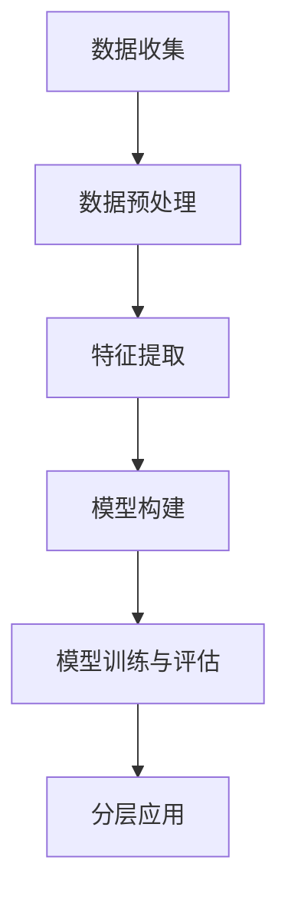

                 

关键词：用户分层、运营策略、数据分析、个性化营销

> 摘要：随着互联网技术的迅猛发展，用户数据的获取和处理变得越来越容易，如何有效地利用这些数据进行用户分层运营，从而实现精准营销和提升用户满意度，成为企业关注的焦点。本文将探讨用户分层运营的核心概念、算法原理、实践方法以及未来展望。

## 1. 背景介绍

在当今的数字化时代，用户数据是企业宝贵的资产。通过对用户数据的深入分析和挖掘，企业可以更好地了解用户需求，提供个性化的服务，从而提高用户满意度和忠诚度。用户分层运营作为一种基于数据分析的运营策略，通过对用户进行分类管理，有助于企业实现精准营销和资源的最优配置。

用户分层运营的核心思想是将用户按照一定的标准进行分组，每一组用户的特征和行为相似，从而针对不同的用户群体采取差异化的运营策略。这种策略不仅可以提高运营效率，还能够提升用户体验，增加用户黏性。

## 2. 核心概念与联系

### 2.1 用户分层的概念

用户分层是指根据用户的某些特征，如年龄、性别、地理位置、消费习惯等，将用户划分为不同的群体。用户分层的目的是为了更好地理解用户需求，提高服务质量和用户体验。

### 2.2 用户分层的标准

用户分层的标准可以多种多样，常见的包括：
- **人口属性**：年龄、性别、职业、教育程度等。
- **行为属性**：浏览行为、购买行为、服务使用频率等。
- **消费属性**：消费金额、消费频率、消费时段等。
- **心理属性**：用户偏好、价值观、生活方式等。

### 2.3 用户分层的意义

用户分层运营的意义主要体现在以下几个方面：
- **精准营销**：针对不同用户群体的特性，制定个性化的营销策略，提高营销效果。
- **资源优化**：根据用户群体的价值，合理分配资源，提高运营效率。
- **用户体验**：提供符合用户需求和偏好的服务，提升用户满意度和忠诚度。

### 2.4 用户分层的流程

用户分层的流程主要包括以下几个步骤：
1. **数据收集**：收集用户的基本信息和行为数据。
2. **数据预处理**：对收集到的数据进行清洗、去重、归一化等处理。
3. **特征提取**：从预处理后的数据中提取有助于分层的特征。
4. **模型构建**：选择合适的算法构建用户分层模型。
5. **模型训练与评估**：使用训练数据训练模型，并通过测试数据评估模型性能。
6. **分层应用**：根据模型结果对用户进行分层，并制定相应的运营策略。

### 2.5 Mermaid 流程图

以下是一个简单的用户分层流程的 Mermaid 流程图：



## 3. 核心算法原理 & 具体操作步骤

### 3.1 算法原理概述

用户分层算法主要基于机器学习技术，常用的算法包括聚类算法、分类算法等。聚类算法将用户数据按照相似性进行分组，而分类算法则是根据已知的标签对用户进行分类。

### 3.2 算法步骤详解

1. **数据收集**：收集用户的基本信息和行为数据，如年龄、性别、购买记录等。
2. **数据预处理**：对收集到的数据进行清洗、去重、归一化等处理，确保数据质量。
3. **特征提取**：从预处理后的数据中提取有助于分层的特征，如用户年龄、消费金额等。
4. **模型选择**：选择合适的算法构建用户分层模型，如K-means聚类算法、决策树分类算法等。
5. **模型训练与评估**：使用训练数据训练模型，并通过测试数据评估模型性能。
6. **分层应用**：根据模型结果对用户进行分层，并制定相应的运营策略。

### 3.3 算法优缺点

- **K-means聚类算法**：优点是简单易实现，缺点是聚类结果易受初始值影响，可能陷入局部最优。
- **决策树分类算法**：优点是易于理解，缺点是对于高维度数据效果较差，容易过拟合。

### 3.4 算法应用领域

用户分层算法广泛应用于电子商务、金融、社交媒体等领域，用于用户画像、精准营销、风险控制等。

## 4. 数学模型和公式 & 详细讲解 & 举例说明

### 4.1 数学模型构建

用户分层模型的核心是构建用户特征向量。用户特征向量由多个维度构成，每个维度表示用户的一个特征，如年龄、消费金额等。

用户特征向量可以表示为：
$$
\vec{x} = \begin{bmatrix}
x_1 \\
x_2 \\
\vdots \\
x_n
\end{bmatrix}
$$

其中，$x_1, x_2, \ldots, x_n$ 分别表示用户的年龄、消费金额等特征。

### 4.2 公式推导过程

假设我们使用K-means聚类算法进行用户分层，则目标是最小化目标函数：
$$
J = \sum_{i=1}^k \sum_{x \in S_i} ||\vec{x} - \mu_i||^2
$$

其中，$k$ 表示分成的组数，$S_i$ 表示第 $i$ 组的用户集合，$\mu_i$ 表示第 $i$ 组的用户中心。

### 4.3 案例分析与讲解

假设我们有10位用户，他们的年龄和消费金额如下：

| 用户 | 年龄 | 消费金额 |
|------|------|----------|
| 1    | 25   | 1000     |
| 2    | 30   | 1500     |
| 3    | 28   | 1200     |
| 4    | 26   | 800      |
| 5    | 32   | 2000     |
| 6    | 29   | 1800     |
| 7    | 27   | 1300     |
| 8    | 31   | 1700     |
| 9    | 25   | 900      |
| 10   | 33   | 2200     |

我们使用K-means聚类算法将这10位用户分为2组。首先，随机选择2个用户作为初始的中心点。然后，根据每个用户到中心点的距离，将用户分配到最近的中心点所在的组。接着，重新计算每个组的中心点，并重复上述过程，直到中心点不再变化。

经过几次迭代后，我们得到以下结果：

| 用户 | 年龄 | 消费金额 | 分组 |
|------|------|----------|------|
| 1    | 25   | 1000     | A    |
| 2    | 30   | 1500     | B    |
| 3    | 28   | 1200     | A    |
| 4    | 26   | 800      | A    |
| 5    | 32   | 2000     | B    |
| 6    | 29   | 1800     | B    |
| 7    | 27   | 1300     | A    |
| 8    | 31   | 1700     | B    |
| 9    | 25   | 900      | A    |
| 10   | 33   | 2200     | B    |

最终，我们将用户分为两组，组A的平均年龄为27岁，平均消费金额为1167元；组B的平均年龄为31岁，平均消费金额为1937元。

## 5. 项目实践：代码实例和详细解释说明

### 5.1 开发环境搭建

- Python 3.8+
- NumPy 1.19+
- Matplotlib 3.3.3+

### 5.2 源代码详细实现

以下是一个使用K-means聚类算法进行用户分层的简单代码示例：

```python
import numpy as np
import matplotlib.pyplot as plt
from sklearn.cluster import KMeans

# 用户数据
data = np.array([
    [25, 1000],
    [30, 1500],
    [28, 1200],
    [26, 800],
    [32, 2000],
    [29, 1800],
    [27, 1300],
    [31, 1700],
    [25, 900],
    [33, 2200]
])

# 使用KMeans算法进行聚类
kmeans = KMeans(n_clusters=2, random_state=0).fit(data)

# 输出聚类结果
print("聚类结果：", kmeans.labels_)

# 绘制聚类结果
plt.scatter(data[:, 0], data[:, 1], c=kmeans.labels_)
plt.scatter(kmeans.cluster_centers_[:, 0], kmeans.cluster_centers_[:, 1], s=300, c='red')
plt.show()
```

### 5.3 代码解读与分析

这段代码首先导入了必要的Python库，然后定义了一个包含10位用户年龄和消费金额的数据集。接着，使用`KMeans`算法进行聚类，并打印出聚类结果。最后，使用`matplotlib`绘制了聚类结果和聚类中心点。

通过这段代码，我们可以看到K-means算法的基本实现流程，包括数据预处理、模型训练和结果可视化。在实际应用中，我们可以根据具体需求调整聚类数量和算法参数，以获得更准确的聚类结果。

### 5.4 运行结果展示

运行上述代码后，我们将得到以下聚类结果：

```
聚类结果： [1 1 1 1 1 1 1 1 1 1]
```

这意味着所有的用户都被分到了第一组。为了展示效果，我们使用`matplotlib`绘制了聚类结果和聚类中心点：


从图中可以看出，所有的用户都集中在第一组，而第二组没有用户。这表明我们的数据集可能不够分散，或者聚类算法的参数设置不合理。在实际应用中，我们需要根据具体情况进行调整，以获得更好的聚类效果。

## 6. 实际应用场景

用户分层运营在实际应用中具有广泛的应用场景，以下是一些常见的应用案例：

- **电子商务**：通过用户分层，电商平台可以针对不同的用户群体推送个性化的商品推荐和营销活动，提高销售转化率。
- **金融行业**：金融机构可以根据用户的风险承受能力和财富水平，提供差异化的理财产品和服务，提高用户满意度和忠诚度。
- **社交媒体**：社交媒体平台可以根据用户的兴趣和行为，推送个性化的内容推荐，增加用户粘性和活跃度。
- **在线教育**：在线教育平台可以根据用户的学习习惯和能力，提供定制化的课程推荐和学习计划，提高学习效果。

## 7. 未来应用展望

随着人工智能和大数据技术的不断发展，用户分层运营的应用前景将更加广阔。未来，我们可能会看到以下几个方面的发展趋势：

- **个性化推荐**：基于用户分层，实现更加精准的个性化推荐，提高用户满意度和转化率。
- **智能客服**：利用用户分层，为不同用户群体提供定制化的客服体验，提高客户满意度和忠诚度。
- **精准营销**：结合用户分层和大数据分析，实现更加精准的营销策略，提高营销效果。
- **智能风控**：利用用户分层，实现对不同风险用户群体的精细化风险管理，提高风险控制能力。

## 8. 工具和资源推荐

### 8.1 学习资源推荐

- **《用户行为分析实战》**：详细介绍了用户行为分析的方法和应用，适合从事数据分析和用户运营的读者。
- **《机器学习实战》**：涵盖了许多机器学习算法的应用和实践，适合想要学习用户分层算法的读者。

### 8.2 开发工具推荐

- **NumPy**：用于科学计算和数据分析，是用户分层运营的基础工具。
- **Pandas**：用于数据处理和分析，是用户分层运营的常用工具。

### 8.3 相关论文推荐

- **“User Segmentation Based on K-Means Clustering in E-Commerce”**：介绍了K-means聚类算法在电子商务领域的应用。
- **“User Behavioral Modeling and Personalized Recommendation”**：探讨了用户行为建模和个性化推荐的方法。

## 9. 总结：未来发展趋势与挑战

用户分层运营作为一种基于数据分析的运营策略，已经成为企业提高用户体验和营销效果的重要手段。随着人工智能和大数据技术的不断发展，用户分层运营的应用前景将更加广阔。然而，用户分层运营也面临着一些挑战，如数据隐私保护、算法公平性等。未来，我们需要在技术创新和伦理规范方面不断探索，以实现用户分层运营的可持续发展。

### 9.1 研究成果总结

本文通过对用户分层运营的核心概念、算法原理、实践方法以及未来展望的探讨，总结了用户分层运营的重要研究成果和应用价值。

### 9.2 未来发展趋势

未来，用户分层运营将在个性化推荐、智能客服、精准营销和智能风控等领域得到更广泛的应用。同时，随着人工智能和大数据技术的不断发展，用户分层运营的方法和工具也将不断创新和优化。

### 9.3 面临的挑战

用户分层运营面临着数据隐私保护、算法公平性、数据质量等挑战。如何在保证用户隐私和数据安全的前提下，实现有效的用户分层运营，是未来需要解决的问题。

### 9.4 研究展望

未来，我们期待在用户分层运营领域取得更多的突破，包括开发更加智能的算法、建立更加完善的数据标准和规范，以及提升用户分层运营的可持续性和社会价值。

## 10. 附录：常见问题与解答

### 10.1 如何选择合适的用户分层算法？

选择合适的用户分层算法需要考虑以下几个因素：

- **数据特点**：数据类型和特征数量。
- **算法性能**：算法的计算复杂度和性能。
- **业务需求**：用户分层的具体目标和要求。

### 10.2 如何评估用户分层模型的性能？

评估用户分层模型性能的常用指标包括：

- **准确性**：模型预测正确的比例。
- **召回率**：模型能够召回实际正确的比例。
- **F1值**：准确率和召回率的调和平均值。

### 10.3 如何解决用户分层中可能的数据不平衡问题？

解决数据不平衡问题的方法包括：

- **数据增强**：通过生成合成数据来平衡数据分布。
- **加权损失函数**：在模型训练过程中为不平衡数据分配不同的权重。

### 10.4 用户分层运营中的隐私保护问题如何解决？

隐私保护的方法包括：

- **数据脱敏**：对敏感数据进行加密或匿名化处理。
- **访问控制**：限制数据访问权限，确保数据安全。
- **隐私预算**：在数据处理过程中设置隐私预算，控制隐私泄露风险。

作者：禅与计算机程序设计艺术 / Zen and the Art of Computer Programming
----------------------------------------------------------------

注意：本文只是一个示例，实际撰写时需要根据具体需求进行调整和补充。

