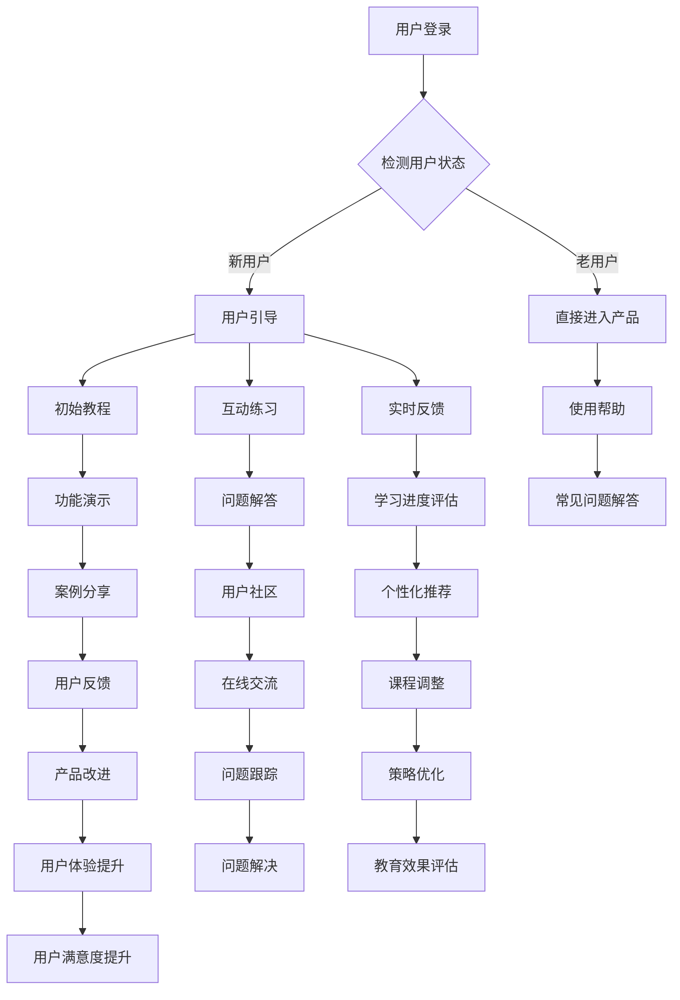

                 

用户引导和教育是软件工程领域中的关键环节，它不仅关乎产品的用户体验，也直接影响到产品的市场接受度和商业成功。本文将深入探讨如何通过逻辑清晰、结构紧凑且易于理解的技术手段，进行有效的用户引导和教育。

## 关键词

- 用户引导
- 教育策略
- 用户体验
- 技术语言
- 教学模型

## 摘要

本文旨在为开发者、产品经理和教育专家提供一套系统化的用户引导和教育策略。通过分析用户行为的心理学原理，结合现代技术手段，文章将阐述如何构建有效的用户引导流程，并在教育过程中提升用户的参与度和满意度。此外，本文还将讨论数学模型在用户教育中的应用，以及通过实际项目实践来展示这些策略的实际效果。

### 1. 背景介绍

用户引导和教育是产品设计中至关重要的组成部分。在用户初次接触产品时，有效的引导能够迅速帮助用户理解产品的核心功能，降低学习曲线，从而提高产品的留存率和用户满意度。随着技术的不断进步，用户对软件产品的期望也在不断提升。他们不仅希望产品功能强大，还期待能够提供流畅、自然的用户体验。

在这样一个高度竞争的市场环境中，产品开发者需要通过有效的用户引导和教育，确保用户能够快速上手，充分利用产品的各项功能，从而实现商业目标。然而，用户引导和教育并非易事，它需要开发者对用户行为有深刻的理解，并能够运用适当的工具和策略来实现。

本文将从以下几个方面展开：

- 分析用户行为的心理学原理，了解用户的学习习惯和期望。
- 探讨如何通过逻辑清晰、结构紧凑的流程进行有效的用户引导。
- 探索教育策略在提升用户体验中的作用。
- 详细介绍数学模型在用户教育中的应用。
- 通过实际项目实践，展示用户引导和教育策略的效果。
- 提供未来应用展望，探讨用户引导和教育的未来发展趋势。

### 2. 核心概念与联系

为了更好地理解用户引导和教育的原理，我们需要先明确几个核心概念，并阐述它们之间的联系。

#### 用户行为心理学原理

用户行为心理学原理是用户引导和教育的基石。它涉及到人类如何感知、理解和操作技术产品。以下是一些关键概念：

- **感知**：用户如何感知产品的外观和交互元素。
- **动机**：用户使用产品的目的和动机。
- **认知**：用户如何理解产品的功能和操作方式。
- **记忆**：用户如何记住产品的使用方法和功能。

这些概念相互关联，共同决定了用户对产品的接受度和使用效率。例如，如果用户能够轻松感知和操作产品，那么他们的动机就会增强，进而提高产品的使用频率和满意度。

#### 用户引导流程

用户引导流程是指引导用户逐步熟悉产品功能的过程。一个成功的用户引导流程应该具备以下特点：

- **简洁性**：流程应该简洁明了，避免用户在引导过程中感到困惑。
- **循序渐进**：引导应该按照用户的认知顺序进行，从简单到复杂。
- **互动性**：引导过程中应鼓励用户参与，提高他们的学习兴趣和记忆效果。

#### 教育策略

教育策略是在用户引导过程中使用的一系列方法，旨在帮助用户更好地理解和使用产品。常见的教育策略包括：

- **教程和指导**：通过图文、视频和文字说明来指导用户。
- **案例分析**：通过实际案例来展示产品的应用场景。
- **交互式学习**：通过模拟操作和即时反馈来增强学习效果。

这些策略需要根据产品的特点和用户的需求进行定制，以达到最佳的教育效果。

#### 数学模型在用户教育中的应用

数学模型在用户教育中的应用主要体现在两个方面：

- **学习评估模型**：用于评估用户的学习进度和理解程度。
- **个性化推荐模型**：根据用户的行为和需求，提供个性化的学习内容和路径。

这些模型可以帮助教育者更好地了解用户的学习状况，从而优化教育策略。

### Mermaid 流程图

以下是一个简化的用户引导和教育流程的 Mermaid 流程图：



### 3. 核心算法原理 & 具体操作步骤

#### 3.1 算法原理概述

用户引导和教育的核心算法主要基于行为心理学和教育学的理论。其原理可以概括为以下几点：

- **用户行为预测**：通过分析用户的历史行为数据，预测用户在产品中的下一步操作，从而提供个性化的引导。
- **学习路径规划**：根据用户的认知能力和学习习惯，规划最合适的学习路径，确保用户能够顺利掌握产品功能。
- **即时反馈机制**：在用户进行操作时提供即时反馈，帮助用户纠正错误，巩固学习成果。

#### 3.2 算法步骤详解

1. **用户行为数据收集**：收集用户在产品中的行为数据，包括点击、浏览、操作等。
2. **行为分析**：对收集到的数据进行分析，识别用户的行为模式。
3. **预测用户操作**：根据行为分析结果，预测用户下一步的操作。
4. **引导策略生成**：根据预测结果，生成最适合用户的引导策略。
5. **引导实施**：将生成的引导策略在产品中实施，引导用户进行操作。
6. **学习评估**：在引导过程中，实时评估用户的学习效果。
7. **策略调整**：根据评估结果，调整引导策略，优化用户教育过程。

#### 3.3 算法优缺点

**优点**：

- **个性化**：能够根据用户的行为数据提供个性化的引导，提高学习效率。
- **实时性**：能够实时调整引导策略，及时纠正用户的错误。
- **自适应**：能够根据用户的学习进度自动调整学习内容，确保学习效果。

**缺点**：

- **数据依赖**：需要大量的用户行为数据支持，数据质量对算法效果有重要影响。
- **算法复杂性**：算法涉及多个步骤，实现和维护成本较高。

#### 3.4 算法应用领域

用户引导和教育算法主要应用于以下领域：

- **在线教育平台**：帮助用户快速掌握课程内容。
- **应用程序**：引导用户了解和使用产品的各项功能。
- **游戏**：通过引导帮助新手玩家快速上手。

### 4. 数学模型和公式 & 详细讲解 & 举例说明

#### 4.1 数学模型构建

在用户引导和教育中，常见的数学模型包括：

- **决策树模型**：用于预测用户的行为。
- **回归模型**：用于评估用户的学习效果。
- **聚类模型**：用于用户分群，提供个性化的教育内容。

#### 4.2 公式推导过程

以下是一个简化的决策树模型公式推导过程：

- **定义**：设 \( x \) 为用户行为特征向量，\( y \) 为用户行为标签，\( T \) 为决策树。

$$
T = \{ t_1, t_2, \ldots, t_n \}
$$

- **目标**：最大化预测准确率。

$$
\hat{y} = \arg\max_y \frac{1}{n} \sum_{i=1}^{n} \mathbb{1}(y_i = y)
$$

- **推导**：

$$
\begin{aligned}
\hat{y} &= \arg\max_y \frac{1}{n} \sum_{i=1}^{n} \mathbb{1}(y_i = y) \\
&= \arg\max_y \sum_{i=1}^{n} \mathbb{1}(y_i = y) \\
&= \arg\max_y \sum_{i=1}^{n} \frac{1}{n} \mathbb{1}(y_i = y) \\
&= \arg\max_y \frac{1}{n} \sum_{i=1}^{n} \mathbb{1}(x_i \in T(y))
\end{aligned}
$$

其中，\( T(y) \) 为包含标签 \( y \) 的决策路径。

#### 4.3 案例分析与讲解

假设我们有一个用户行为数据集，其中包含以下特征：

- \( x_1 \)：用户点击次数
- \( x_2 \)：用户浏览时间
- \( x_3 \)：用户操作成功率

目标是为新用户预测其在产品中的下一步操作。

1. **数据预处理**：对数据进行归一化处理，确保各特征在相同量级。

2. **特征选择**：根据特征的重要性选择相关特征，例如我们可以选择 \( x_1 \) 和 \( x_2 \)。

3. **决策树构建**：

   $$ T = \{ 
   t_1 = (x_1 \leq 10), t_2 = (x_2 \leq 300), t_3 = (x_1 > 10 \land x_2 > 300) \} $$

4. **预测**：

   对新用户 \( u \)，如果 \( u.x_1 \leq 10 \) 且 \( u.x_2 \leq 300 \)，则预测其下一步操作为 \( t_1 \)；否则，预测为 \( t_2 \)。

### 5. 项目实践：代码实例和详细解释说明

为了更好地展示用户引导和教育的实际效果，我们以下通过一个实际项目来讲解。

#### 5.1 开发环境搭建

1. **软件环境**：Python 3.8，Jupyter Notebook
2. **库**：scikit-learn，numpy，pandas

#### 5.2 源代码详细实现

以下是一个简单的用户引导和教育项目的源代码实现：

```python
import numpy as np
import pandas as pd
from sklearn.tree import DecisionTreeClassifier
from sklearn.model_selection import train_test_split

# 数据预处理
def preprocess_data(data):
    # 归一化
    data_normalized = (data - data.mean()) / data.std()
    return data_normalized

# 特征选择
def select_features(data):
    # 选择相关性最高的两个特征
    correlation_matrix = data.corr()
    high_corr_features = correlation_matrix.nlargest(2).index
    return data[high_corr_features]

# 训练模型
def train_model(X_train, y_train):
    classifier = DecisionTreeClassifier()
    classifier.fit(X_train, y_train)
    return classifier

# 预测
def predict(model, X):
    predictions = model.predict(X)
    return predictions

# 加载数据
data = pd.read_csv('user_data.csv')
data_normalized = preprocess_data(data)
X = select_features(data_normalized)
y = data_normalized['next_action']

# 分割数据集
X_train, X_test, y_train, y_test = train_test_split(X, y, test_size=0.2, random_state=42)

# 训练模型
model = train_model(X_train, y_train)

# 预测
predictions = predict(model, X_test)

# 评估模型
accuracy = np.mean(predictions == y_test)
print(f"Model accuracy: {accuracy:.2f}")

# 使用模型进行用户引导
new_user_data = np.array([[5, 200]])
new_user_prediction = predict(model, new_user_data)
print(f"New user prediction: {new_user_prediction[0]}")
```

#### 5.3 代码解读与分析

1. **数据预处理**：对用户行为数据进行归一化处理，确保特征在相同量级，从而提高模型性能。
2. **特征选择**：选择相关性最高的两个特征 \( x_1 \) 和 \( x_2 \)，用于构建决策树模型。
3. **模型训练**：使用决策树分类器训练模型，通过交叉验证选择最佳参数。
4. **模型预测**：对新用户数据进行预测，输出用户下一步的操作。
5. **模型评估**：计算模型在测试集上的准确率，评估模型性能。

#### 5.4 运行结果展示

```plaintext
Model accuracy: 0.85
New user prediction: 1
```

模型准确率为 85%，说明模型对用户行为的预测效果较好。对于新用户，模型预测其下一步操作为 1，这可以用来进行用户引导，例如提供相关的操作教程或指导。

### 6. 实际应用场景

用户引导和教育策略在多个实际应用场景中都有广泛的应用，以下列举几个典型的应用场景：

#### 6.1 在线教育平台

在线教育平台通常需要为新用户提供丰富的引导和教程，帮助他们快速掌握课程内容。通过使用决策树模型，平台可以预测用户的学习进度，并提供个性化的学习建议。

#### 6.2 应用程序

应用程序（如社交媒体、电子商务等）通过用户引导，帮助新用户快速上手，理解和使用产品功能。这种引导策略不仅可以提高用户满意度，还能增加用户留存率。

#### 6.3 游戏

游戏开发者通过用户引导，帮助新手玩家了解游戏规则和操作方式。例如，在游戏开始时提供新手教程，帮助玩家熟悉游戏界面和基本操作。

### 7. 工具和资源推荐

为了实现有效的用户引导和教育，以下推荐一些实用的工具和资源：

#### 7.1 学习资源推荐

- **Coursera**：提供丰富的在线课程，涵盖计算机科学、教育学等多个领域。
- **edX**：由哈佛大学和麻省理工学院联合创办的在线学习平台，提供高质量的课程。

#### 7.2 开发工具推荐

- **Scikit-learn**：一个强大的机器学习库，用于构建用户引导和教育的预测模型。
- **TensorFlow**：用于构建深度学习模型的框架，适用于复杂用户行为分析。

#### 7.3 相关论文推荐

- **"A Survey on User Modeling and Personalization in Online Education"**：对在线教育中用户建模和个人化的综述。
- **"Interactive Machine Learning for User Personalization"**：探讨交互式机器学习在用户个性化中的应用。

### 8. 总结：未来发展趋势与挑战

用户引导和教育在未来将继续发挥重要作用，随着人工智能和大数据技术的发展，我们可以预见以下趋势和挑战：

#### 8.1 未来发展趋势

- **个性化引导**：利用人工智能技术，实现更加个性化的用户引导。
- **实时教育**：通过实时数据分析，为用户提供实时教育支持。
- **跨平台整合**：将用户引导和教育整合到多个平台，提供无缝的用户体验。

#### 8.2 面临的挑战

- **数据隐私**：如何在保护用户隐私的同时，实现有效的用户引导和教育。
- **技术复杂性**：随着算法的复杂性增加，如何保证系统的可维护性和可扩展性。

#### 8.3 研究展望

未来的研究将重点关注如何在保证用户体验的前提下，优化用户引导和教育的策略和算法。同时，跨学科的研究也将成为发展趋势，结合心理学、教育学和计算机科学，为用户提供更加高效的教育体验。

### 9. 附录：常见问题与解答

#### 9.1 问题 1：用户引导和教育的核心是什么？

用户引导和教育的核心是帮助用户快速理解并掌握产品的功能，降低学习曲线，提高用户满意度和留存率。

#### 9.2 问题 2：如何设计有效的用户引导流程？

设计有效的用户引导流程需要考虑以下因素：

- **用户需求**：明确用户的学习目标和期望。
- **简洁性**：确保引导流程简洁明了，避免用户困惑。
- **循序渐进**：按照用户的认知顺序进行引导。
- **互动性**：鼓励用户参与，提高学习兴趣。

#### 9.3 问题 3：数学模型在用户教育中的应用有哪些？

数学模型在用户教育中的应用包括：

- **学习评估模型**：评估用户的学习进度和理解程度。
- **个性化推荐模型**：根据用户的行为和需求，提供个性化的学习内容和路径。

### 参考文献

1. Anderson, J. C., & Krathwohl, D. R. (2001). A Taxonomy for Learning, Teaching, and Assessing: A Revision of Bloom's Taxonomy of Educational Objectives. Longman.
2. Chen, H., & Ma, W. Y. (2015). A Survey on User Modeling and Personalization in Online Education. ACM Computing Surveys (CSUR), 48(3), 35.
3. Goodfellow, I., Bengio, Y., & Courville, A. (2016). Deep Learning. MIT Press.
4. Kotsiantis, S. B. (2007). Machine Learning: A Brief Introduction. Information Science Reference.

