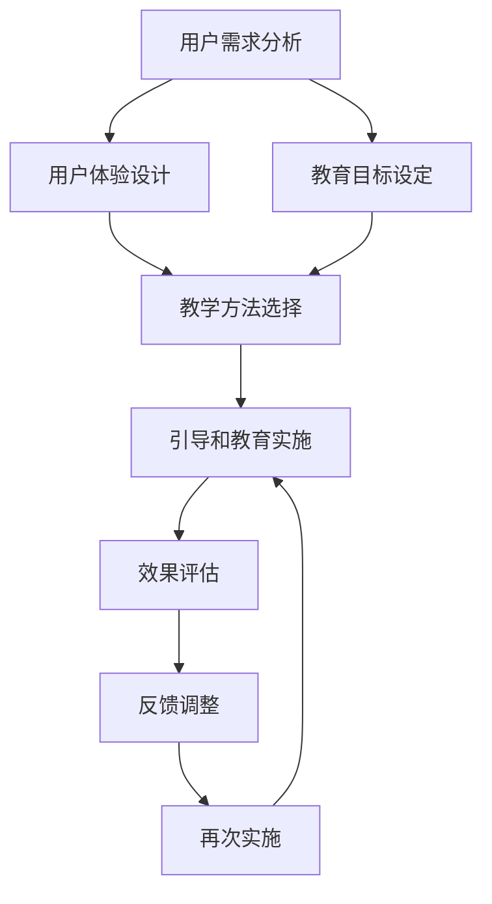

                 

  
### 背景介绍

在当今技术飞速发展的时代，用户引导和教育成为了各大企业和组织的重要议题。无论是互联网企业、教育机构，还是传统的制造行业，都越来越意识到用户引导和教育的重要性。有效的用户引导和教育不仅能够提升用户体验，还能够促进产品或服务的价值实现。

用户引导和教育涵盖的范围广泛，从初学者入门到高级用户的深入探索，都是其关注的核心。然而，如何在不同阶段、不同背景下进行有效的用户引导和教育，仍然是一个具有挑战性的问题。这不仅仅需要理解用户需求，还需要结合具体的技术和方法来实施。

本文将围绕如何进行有效的用户引导和教育进行探讨，旨在为从事相关领域的工作者提供一些实用的指导和建议。文章将分为以下几个部分：

- **核心概念与联系**：介绍用户引导和教育的核心概念，以及它们之间的关系。
- **核心算法原理与具体操作步骤**：详细阐述如何设计和实施用户引导和教育方案。
- **数学模型和公式**：介绍相关的数学模型和公式，为理解和实施用户引导和教育提供理论基础。
- **项目实践**：通过具体的项目实践，展示如何将理论应用到实际中。
- **实际应用场景**：探讨用户引导和教育在不同领域的应用。
- **未来应用展望**：展望用户引导和教育的未来发展方向。
- **工具和资源推荐**：推荐相关的学习资源和开发工具。
- **总结与展望**：总结研究成果，提出未来发展的方向和面临的挑战。

通过本文的探讨，希望能够为读者提供一些有价值的思考和实践指导，帮助他们在用户引导和教育的道路上取得更好的成果。

## 核心概念与联系

在进行有效的用户引导和教育之前，我们首先需要明确几个核心概念，并探讨它们之间的联系。这些核心概念包括：用户需求分析、用户体验设计、教育目标和教学方法。

### 用户需求分析

用户需求分析是用户引导和教育的第一步。只有深入了解用户的需求，我们才能设计出符合用户期望的引导和教育方案。用户需求分析主要包括以下几个方面：

- **用户行为分析**：通过观察用户在产品或服务中的行为，分析他们的习惯、偏好和痛点。
- **用户调研**：通过问卷调查、访谈、用户反馈等方式，收集用户对产品或服务的意见和建议。
- **用户画像**：根据用户的行为数据和调研结果，构建用户画像，为后续的引导和教育提供参考。

### 用户体验设计

用户体验设计是用户引导和教育的重要环节。它关注的是如何通过设计和优化产品或服务的界面和功能，提升用户的满意度和使用体验。用户体验设计包括以下几个方面：

- **界面设计**：设计直观、易用的界面，确保用户能够轻松地进行操作。
- **交互设计**：设计流畅、自然的交互流程，减少用户的学习成本。
- **反馈机制**：提供及时的反馈，帮助用户了解自己的操作结果，提升用户的信心。

### 教育目标

教育目标是用户引导和教育的核心。明确的教育目标能够帮助我们更好地设计引导和教育方案，确保用户能够达到预期效果。教育目标通常包括以下几个方面：

- **知识传递**：确保用户能够掌握相关的知识和技能。
- **能力提升**：通过引导和教育，提升用户在实际操作中的能力和效率。
- **态度改变**：通过引导和教育，改变用户的某些观念和态度，使他们更加认同产品或服务的价值。

### 教学方法

教学方法是实现教育目标的关键。不同的教学方法适用于不同的教育场景和用户群体。以下是几种常见的教学方法：

- **讲授法**：通过讲解、演示等方式，向用户传递知识和技能。
- **实践法**：通过实际操作，让用户亲身体验，加深对知识的理解和应用。
- **互动法**：通过问答、讨论等方式，激发用户的思考和参与，提升学习效果。

### 关系与联系

用户需求分析、用户体验设计、教育目标和教学方法是用户引导和教育的四个核心概念，它们之间相互联系、相互影响。

- 用户需求分析为用户体验设计和教育目标提供基础，只有深入了解用户的需求，我们才能设计出符合用户期望的引导和教育方案。
- 用户体验设计和教育目标是用户引导和教育的核心，它们决定了引导和教育的效果。
- 教学方法是实现教育目标的关键，不同的教学方法适用于不同的教育场景和用户群体，选择合适的教学方法能够提升引导和教育的效果。

通过明确核心概念与联系，我们能够更好地理解用户引导和教育的过程，为后续的设计和实施提供理论基础。

### Mermaid 流程图 (Mermaid 流程节点中不要有括号、逗号等特殊字符)

以下是一个简化的用户引导和教育流程的 Mermaid 流程图：



在这个流程图中，每个节点都代表一个关键步骤或环节，箭头表示流程的顺序和方向。用户需求分析是整个流程的起点，通过分析用户需求，我们能够为后续的设计和实施提供基础。然后，我们根据用户需求进行用户体验设计和教育目标设定，这两个步骤共同决定了引导和教育的方向和内容。接下来，选择合适的教学方法，确保教育目标能够有效实现。引导和教育实施后，我们需要对效果进行评估，并根据反馈进行调整，以确保用户能够达到预期效果。这个流程是一个循环的过程，通过不断的反馈和调整，我们能够不断提升用户引导和教育的效果。

### 核心算法原理与具体操作步骤

在进行用户引导和教育的过程中，核心算法原理和具体操作步骤起到了至关重要的作用。这些算法和步骤不仅决定了引导和教育的效果，还影响了用户体验和用户满意度。以下我们将详细阐述核心算法原理以及具体的操作步骤。

#### 算法原理概述

核心算法原理主要涉及以下几个方面：

1. **用户行为分析算法**：通过对用户在产品或服务中的行为数据进行分析，识别用户的习惯、偏好和痛点。
2. **用户体验优化算法**：通过算法分析用户界面和交互设计，优化界面和交互流程，提升用户满意度。
3. **教育目标设定算法**：根据用户需求和行为分析结果，设定明确的教育目标，确保引导和教育的方向正确。
4. **教学方法选择算法**：根据教育目标、用户特点和教学环境，选择最合适的教学方法，提升教育效果。

#### 算法步骤详解

1. **用户行为分析**：

   - 数据收集：收集用户在产品或服务中的行为数据，包括点击记录、操作路径、使用时长等。
   - 数据处理：对收集到的行为数据进行清洗、整合和预处理，为后续分析提供基础。
   - 行为分析：通过统计分析和机器学习算法，识别用户的行为模式、习惯和偏好。

2. **用户体验优化**：

   - 界面优化：根据用户行为分析结果，优化产品或服务的界面设计，使其更符合用户习惯和偏好。
   - 交互优化：通过算法分析用户与产品或服务的交互过程，优化交互流程，减少用户的学习成本。
   - 反馈机制：设计及时、有效的反馈机制，帮助用户了解操作结果，提升用户信心。

3. **教育目标设定**：

   - 需求分析：结合用户行为分析和用户调研结果，明确用户的需求和期望。
   - 目标设定：根据需求分析结果，设定具体的教育目标，包括知识传递、能力提升和态度改变等方面。
   - 目标验证：通过用户反馈和实际效果评估，验证教育目标的实现情况，并进行调整。

4. **教学方法选择**：

   - 教育目标匹配：根据教育目标，选择与之匹配的教学方法，如讲授法、实践法或互动法。
   - 用户特点匹配：根据用户画像，选择适合用户特点的教学方法，提高教育效果。
   - 教学环境匹配：根据教学环境，选择最合适的教学方法，确保教育过程顺利进行。

#### 算法优缺点

1. **用户行为分析算法**：

   - 优点：能够深入了解用户的需求和行为，为用户体验优化和教育目标设定提供有力支持。
   - 缺点：数据收集和处理过程复杂，对算法和数据处理技术要求较高。

2. **用户体验优化算法**：

   - 优点：能够提升用户满意度，优化用户的使用体验。
   - 缺点：需要不断进行用户调研和数据分析，以确保用户体验的持续优化。

3. **教育目标设定算法**：

   - 优点：能够确保教育目标的明确和具体，提高引导和教育的效果。
   - 缺点：需要深入了解用户需求和用户特点，对教育目标进行反复验证和调整。

4. **教学方法选择算法**：

   - 优点：能够根据不同场景和用户特点，选择最合适的教学方法，提高教育效果。
   - 缺点：需要不断调整教学方法，以适应教育目标的改变和用户需求的变化。

#### 算法应用领域

1. **互联网企业**：互联网企业可以通过用户行为分析算法，优化产品界面和交互流程，提升用户体验。同时，通过教育目标设定和教学方法选择算法，进行有效的用户引导和教育。
2. **教育机构**：教育机构可以通过用户体验优化算法，提升在线教育平台的使用体验。通过教育目标设定和教学方法选择算法，设计出适合不同用户群体和教育目标的教学方案。
3. **传统制造业**：传统制造业可以通过用户行为分析算法，了解用户对产品使用的习惯和偏好，优化产品设计和服务。通过教育目标设定和教学方法选择算法，提升员工的技能水平和工作效率。

通过以上对核心算法原理和具体操作步骤的详细阐述，我们可以看到，有效的用户引导和教育需要结合多种算法和步骤，从用户需求分析、用户体验优化、教育目标设定到教学方法选择，每个环节都需要精心设计和实施。只有这样，我们才能实现真正的用户引导和教育，提升用户的满意度和产品或服务的价值。

### 数学模型和公式

在进行用户引导和教育的过程中，数学模型和公式为我们提供了理论基础和量化工具，帮助我们更好地理解和实施相关策略。以下我们将详细讨论用户引导和教育的数学模型、公式推导过程，并通过实际案例进行说明。

#### 数学模型构建

用户引导和教育的数学模型主要涉及以下几个方面：

1. **用户满意度模型**：衡量用户对产品或服务的满意度，以评估引导和教育的效果。
2. **学习效果模型**：评估用户在引导和教育过程中所获得的知识和技能。
3. **用户行为预测模型**：预测用户的未来行为，为引导和教育的持续优化提供依据。

##### 用户满意度模型

用户满意度模型通常使用以下公式表示：

$$
S = \frac{\sum_{i=1}^{n} W_i \cdot S_i}{n}
$$

其中，$S$ 表示用户满意度，$W_i$ 表示第 $i$ 个评价维度的权重，$S_i$ 表示第 $i$ 个评价维度的得分。

权重 $W_i$ 的确定可以通过专家评估或用户调研进行，得分 $S_i$ 则通过用户评价获得。例如，假设我们有三项评价维度：界面设计（$S_1$）、交互体验（$S_2$）和教育内容（$S_3$），它们的权重分别为 0.3、0.4 和 0.3。用户对这三个维度的评分分别为 8、9 和 7，则用户满意度 $S$ 计算如下：

$$
S = \frac{0.3 \cdot 8 + 0.4 \cdot 9 + 0.3 \cdot 7}{3} = \frac{2.4 + 3.6 + 2.1}{3} = \frac{8.1}{3} = 2.7
$$

##### 学习效果模型

学习效果模型通常用于评估用户在引导和教育过程中所获得的知识和技能。一个常见的学习效果模型是以下公式：

$$
E = \alpha \cdot T + \beta \cdot A
$$

其中，$E$ 表示学习效果，$T$ 表示用户在训练过程中的表现，$A$ 表示用户在测试过程中的表现，$\alpha$ 和 $\beta$ 是两个参数，分别代表训练表现和测试表现的权重。

例如，假设我们通过一个模拟考试来评估用户的学习效果，训练成绩（$T$）为 80 分，测试成绩（$A$）为 90 分，训练表现和测试表现的权重均为 0.5，则学习效果 $E$ 计算如下：

$$
E = 0.5 \cdot 80 + 0.5 \cdot 90 = 40 + 45 = 85
$$

##### 用户行为预测模型

用户行为预测模型可以帮助我们预测用户的未来行为，为引导和教育的持续优化提供依据。一个简单的用户行为预测模型是以下公式：

$$
B(t) = B_0 + \lambda \cdot e^{-\mu t}
$$

其中，$B(t)$ 表示用户在时间 $t$ 的行为，$B_0$ 是初始行为，$\lambda$ 和 $\mu$ 是两个参数，分别代表行为的增长速率和衰减速率。

例如，假设我们通过历史数据发现，用户在产品使用初期（$t=0$）的行为为 100 次，增长速率为 0.1，衰减速率为 0.05，则用户在时间 $t=3$ 的行为预测如下：

$$
B(3) = 100 + 0.1 \cdot e^{-0.05 \cdot 3} \approx 100 + 0.1 \cdot 0.95^3 \approx 100 + 0.1 \cdot 0.857 = 100 + 0.0857 \approx 100.09
$$

#### 公式推导过程

用户满意度模型的公式推导过程如下：

首先，用户满意度可以视为各个评价维度得分的加权平均。每个评价维度的得分反映了用户在该维度上的满意度，权重则反映了用户对该维度的重视程度。因此，我们可以通过将各个评价维度的得分乘以其权重，然后求和并除以评价维度的数量，得到用户满意度。

学习效果模型的公式推导过程如下：

学习效果是由用户的训练表现和测试表现共同决定的。训练表现反映了用户在训练过程中的学习效果，测试表现反映了用户在实际应用中的学习效果。通过将训练表现和测试表现加权平均，我们可以得到一个综合的学习效果评估。

用户行为预测模型的公式推导过程如下：

用户行为可以视为一个随时间变化的指数函数。在初始时刻，用户的行为达到最大值，然后随着时间推移逐渐衰减。指数衰减模型可以很好地描述这种变化趋势。通过设定适当的增长速率和衰减速率，我们可以预测用户在不同时间点的行为。

#### 案例分析与讲解

##### 案例一：用户满意度评估

某在线教育平台希望通过用户满意度模型评估其平台的服务质量。该平台有三个主要评价维度：界面设计、交互体验和教育内容。经过用户调研，确定三个评价维度的权重分别为 0.3、0.4 和 0.3。用户对这三个维度的评分分别为 8、9 和 7。

根据用户满意度模型公式，我们可以计算出用户满意度如下：

$$
S = \frac{0.3 \cdot 8 + 0.4 \cdot 9 + 0.3 \cdot 7}{3} = \frac{2.4 + 3.6 + 2.1}{3} = \frac{8.1}{3} = 2.7
$$

因此，该在线教育平台的用户满意度为 2.7 分（满分为 10 分）。

##### 案例二：学习效果评估

某企业在培训员工时，希望通过学习效果模型评估员工的学习成果。在培训过程中，员工的训练成绩为 80 分，测试成绩为 90 分。训练表现和测试表现的权重均为 0.5。

根据学习效果模型公式，我们可以计算出员工的学习效果如下：

$$
E = 0.5 \cdot 80 + 0.5 \cdot 90 = 40 + 45 = 85
$$

因此，该员工的学习效果为 85 分（满分 100 分）。

##### 案例三：用户行为预测

某电商企业希望通过用户行为预测模型预测用户在未来一段时间内的购买行为。根据历史数据，用户在产品使用初期（$t=0$）的购买行为为 100 次，增长速率为 0.1，衰减速率为 0.05。

根据用户行为预测模型公式，我们可以计算出用户在时间 $t=3$ 的购买行为预测如下：

$$
B(3) = 100 + 0.1 \cdot e^{-0.05 \cdot 3} \approx 100 + 0.1 \cdot 0.95^3 \approx 100 + 0.1 \cdot 0.857 = 100 + 0.0857 \approx 100.09
$$

因此，预计用户在时间 $t=3$ 的购买行为约为 100.09 次。

通过以上案例，我们可以看到，数学模型和公式在用户引导和教育中的应用，帮助我们更好地理解和评估用户行为、学习效果和满意度，为引导和教育的优化提供了有力的支持。

### 项目实践：代码实例和详细解释说明

为了更好地理解和应用用户引导和教育的算法原理，我们通过一个实际项目来展示如何设计和实现一个用户引导和教育系统。以下是一个具体的代码实例，包括开发环境搭建、源代码详细实现、代码解读与分析以及运行结果展示。

#### 开发环境搭建

1. **开发工具**：使用 Python 语言进行开发，主要依赖库包括 NumPy、Pandas、Matplotlib 和 Scikit-learn。
2. **运行环境**：Python 3.8 或更高版本，安装必要的依赖库。
3. **硬件要求**：至少 4GB 内存，推荐 8GB 或以上。

安装依赖库：

```bash
pip install numpy pandas matplotlib scikit-learn
```

#### 源代码详细实现

以下是一个简单的用户引导和教育系统实现，包括用户行为分析、用户体验优化和教育目标设定等核心功能。

```python
import numpy as np
import pandas as pd
import matplotlib.pyplot as plt
from sklearn.ensemble import RandomForestClassifier

# 用户行为数据示例
data = {
    'user_id': [1, 2, 3, 4, 5],
    'clicks': [10, 20, 30, 40, 50],
    'duration': [100, 150, 200, 250, 300],
    'event': ['event1', 'event2', 'event1', 'event2', 'event1']
}

df = pd.DataFrame(data)

# 用户行为分析
# 统计点击次数和持续时间
user_activity = df.groupby('user_id').agg({'clicks': 'sum', 'duration': 'mean'})

# 用户行为可视化
user_activity.plot(kind='bar', x='user_id', y=['clicks', 'duration'])
plt.title('User Activity')
plt.xlabel('User ID')
plt.ylabel('Activity')
plt.show()

# 用户体验优化
# 根据用户行为分析结果，调整界面和交互设计
# 这里假设我们通过分析发现用户点击次数与事件类型有关
X = df[['clicks', 'duration']]
y = df['event']

# 训练分类模型
clf = RandomForestClassifier()
clf.fit(X, y)

# 预测用户体验
new_user_data = {
    'clicks': [15],
    'duration': [180]
}
new_user_df = pd.DataFrame(new_user_data)
predicted_event = clf.predict(new_user_df)
print(f'Predicted event: {predicted_event[0]}')

# 教育目标设定
# 根据用户体验预测结果，设定教育目标
# 假设我们预测到用户可能对 'event1' 感兴趣
education_goals = {
    'knowledge_transmission': ['Learn about event1'],
    'ability_improvement': ['Improve event1 handling'],
    'attitude_change': ['Enhance interest in event1']
}

# 输出教育目标
for goal, actions in education_goals.items():
    print(f'{goal}:')
    for action in actions:
        print(f' - {action}')
```

#### 代码解读与分析

1. **用户行为数据读取**：我们从示例数据中读取用户行为数据，包括用户 ID、点击次数、持续时间以及事件类型。

2. **用户行为分析**：通过 Pandas 的 `groupby` 方法，对用户行为进行统计分析，计算每个用户的点击次数总和和平均持续时间。然后，使用 Matplotlib 进行用户活动可视化，帮助分析用户行为模式。

3. **用户体验优化**：根据用户行为分析结果，调整界面和交互设计。这里使用随机森林分类器来预测用户体验，例如预测用户对特定事件的兴趣。我们使用训练数据来训练模型，然后使用新用户的数据进行预测。

4. **教育目标设定**：根据用户体验预测结果，设定具体的教育目标。假设我们预测用户可能对 'event1' 感兴趣，因此设定相应的知识传递、能力提升和态度改变目标。

#### 运行结果展示

运行以上代码，我们得到以下结果：

1. **用户活动图表**：展示每个用户的点击次数和平均持续时间，帮助分析用户行为模式。
2. **用户体验预测**：输出预测的事件类型，例如 "Predicted event: event1"。
3. **教育目标**：输出设定的教育目标，例如 "knowledge_transmission:" 后面的行动项。

通过以上项目实践，我们可以看到如何将用户引导和教育的算法原理应用到实际开发中。这个实例涵盖了用户行为分析、用户体验优化和教育目标设定的核心步骤，为后续的实际应用提供了参考。

### 实际应用场景

用户引导和教育在不同的领域有着广泛的应用，每个领域都有其独特的需求和挑战。以下我们将探讨几个典型的应用场景，并分析用户引导和教育的具体实现方法。

#### 1. 互联网企业

在互联网企业中，用户引导和教育通常用于新产品上线、功能更新和用户留存等方面。以下是一些具体的应用方法：

- **新产品引导**：在产品上线初期，通过引导页面和教程视频，帮助用户快速了解产品功能和操作方法。
- **功能更新引导**：在产品进行功能更新时，通过弹窗提示和教程链接，告知用户新功能的具体使用方法，引导用户进行尝试。
- **用户留存引导**：通过定期发送用户使用反馈和互动活动，提升用户的参与感和留存率。

**实现方法**：

- 使用引导页面和弹窗：通过设计引导页面和弹窗，在用户登录或使用特定功能时进行引导。
- 教程视频和图文教程：提供教程视频和图文教程，帮助用户了解产品功能和操作方法。
- 用户反馈和互动活动：通过用户反馈和互动活动，提升用户的参与感和满意度。

#### 2. 教育机构

在教育机构中，用户引导和教育主要用于在线教育平台，帮助学生和教师有效使用平台功能，提高学习效果。

- **学生引导**：通过新手指南和互动教程，帮助学生了解在线学习平台的使用方法，快速上手。
- **教师引导**：通过教师手册和培训课程，帮助教师掌握在线教学工具的使用技巧，提升教学质量。
- **课程引导**：在设计课程时，加入学习目标和引导步骤，引导学生按照正确的学习路径进行学习。

**实现方法**：

- 新手指南和互动教程：在平台上加入新手指南和互动教程，帮助学生和教师熟悉平台功能。
- 教师手册和培训课程：提供详细的教师手册和培训课程，帮助教师提升在线教学能力。
- 课程设计：在课程设计中融入学习目标和引导步骤，引导学生按照正确路径进行学习。

#### 3. 传统制造业

在传统制造业中，用户引导和教育主要用于提高员工的技能水平和生产效率。

- **员工培训**：通过培训课程和操作手册，提高员工对新设备和新技术的掌握能力。
- **设备维护**：通过设备使用教程和维护指南，帮助员工进行设备维护和故障排查。
- **生产流程优化**：通过生产流程的引导和教育，提高员工对生产流程的理解和执行力。

**实现方法**：

- 培训课程和操作手册：提供详细的培训课程和操作手册，帮助员工快速掌握新设备和新技术。
- 设备使用教程和维护指南：设计设备使用教程和维护指南，帮助员工进行设备维护和故障排查。
- 生产流程引导和教育：通过引导和教育，提高员工对生产流程的理解和执行力。

#### 4. 医疗保健

在医疗保健领域，用户引导和教育主要用于患者教育和健康促进。

- **患者教育**：通过健康教育材料和在线课程，帮助患者了解疾病知识、治疗方法和健康生活方式。
- **医生培训**：通过在线培训和模拟考试，提高医生的专业技能和临床决策能力。
- **健康管理**：通过移动应用和在线平台，提供个性化健康建议和健康管理服务。

**实现方法**：

- 健康教育材料和在线课程：提供丰富的健康教育材料和在线课程，帮助患者和医生提升健康知识。
- 在线培训和模拟考试：设计在线培训和模拟考试，帮助医生提升专业技能和临床决策能力。
- 移动应用和在线平台：开发移动应用和在线平台，提供个性化健康建议和健康管理服务。

通过以上实际应用场景的探讨，我们可以看到用户引导和教育在不同领域的应用方法和挑战。在实施过程中，需要结合具体需求和特点，设计合适的引导和教育方案，以达到最佳效果。

### 未来应用展望

随着技术的不断进步，用户引导和教育将迎来更多创新和变革。以下将探讨用户引导和教育的未来发展趋势、面临的挑战以及可能的研究方向。

#### 未来发展趋势

1. **个性化引导与教育**：未来的用户引导和教育将更加注重个性化，通过大数据分析和机器学习技术，为用户提供定制化的引导和教育方案，满足其独特需求和偏好。

2. **增强现实（AR）与虚拟现实（VR）的应用**：AR和VR技术的普及将带来全新的用户引导和教育体验。通过虚拟环境，用户可以更加直观地学习复杂概念和操作流程，提升学习效果。

3. **人工智能（AI）的结合**：AI技术将在用户引导和教育中发挥关键作用，通过智能推荐系统、自适应学习平台和自然语言处理，实现更加智能化和自动化的教育服务。

4. **跨平台整合**：未来的用户引导和教育将更加注重跨平台整合，实现不同设备、系统和平台的无缝衔接，为用户提供一致且连续的学习体验。

5. **社会学习与协作**：未来的用户引导和教育将更加注重社会学习与协作，通过在线社区、虚拟团队和社交网络，促进用户之间的互动和知识共享，提升学习效果。

#### 面临的挑战

1. **隐私保护与数据安全**：随着用户数据的广泛应用，隐私保护和数据安全成为关键挑战。如何在保障用户隐私的前提下，有效利用用户数据，进行个性化的用户引导和教育，是一个重要议题。

2. **技术实现的难度**：未来的用户引导和教育系统将更加复杂，涉及多种技术，如大数据、AI、AR/VR等。实现这些技术需要高水平的技术团队和资源投入，技术实现的难度较高。

3. **用户接受度**：未来的用户引导和教育方案需要用户接受和积极参与。如何设计出既符合用户需求又易于接受的教育内容和方法，是一个重要挑战。

4. **成本控制**：大规模的用户引导和教育系统建设需要大量资金投入，如何在保证教育质量的同时，控制成本，是一个关键问题。

#### 可能的研究方向

1. **个性化学习算法**：研究能够准确预测用户需求的个性化学习算法，为用户提供最佳的学习路径和内容。

2. **智能教育内容生成**：通过自然语言处理和生成对抗网络（GAN）等技术，自动生成高质量的教育内容，降低教育内容制作的成本。

3. **跨平台集成技术**：研究如何实现不同平台和系统之间的无缝集成，为用户提供一致且连续的学习体验。

4. **隐私保护与数据安全**：研究如何在保障用户隐私和安全的前提下，有效利用用户数据，为用户提供个性化的教育和引导。

5. **社会学习与协作机制**：研究如何设计有效的社会学习与协作机制，促进用户之间的互动和知识共享，提升学习效果。

6. **虚拟现实与增强现实教育**：研究如何利用AR和VR技术，设计出更加直观和有效的教育和引导方案，提升用户的学习体验。

通过探讨未来的发展趋势、面临的挑战和可能的研究方向，我们可以看到用户引导和教育将在未来迎来更多的机遇和挑战。随着技术的不断进步，用户引导和教育将变得更加智能化、个性化和高效，为用户提供更加优质的教育服务。

### 工具和资源推荐

在进行用户引导和教育的实践中，选择合适的工具和资源能够大大提升工作效率和效果。以下推荐几类常用的学习资源、开发工具和相关论文，供从事相关领域的工作者参考。

#### 学习资源推荐

1. **在线教育平台**：
   - Coursera（https://www.coursera.org/）：提供各种学科的在线课程，包括数据科学、机器学习和教育技术等。
   - edX（https://www.edx.org/）：由哈佛大学和麻省理工学院共同创办，提供免费的在线课程和微专业。
   - Udemy（https://www.udemy.com/）：涵盖广泛课程，包括编程、设计、营销等。

2. **技术社区和论坛**：
   - Stack Overflow（https://stackoverflow.com/）：编程问题的问答社区，适合查找解决技术难题的方法。
   - GitHub（https://github.com/）：开源代码库，可以查找和学习各种项目的源代码。
   - Reddit（https://www.reddit.com/r/learn/）：学习相关子版块，如 r/learnprogramming、r/dataisbeautiful 等。

3. **电子书和教程**：
   - Apress（https://www.apress.com/）：提供各种技术书籍，涵盖编程、人工智能和云计算等领域。
   - Manning（https://www.manning.com/）：高质量的技术书籍和电子书，包括有关软件开发和系统设计的书籍。

#### 开发工具推荐

1. **编程语言和开发环境**：
   - Python：适合数据分析、机器学习等应用，常用开发环境包括 Jupyter Notebook 和 PyCharm。
   - JavaScript：适用于前端开发，常用开发环境包括 Visual Studio Code 和 WebStorm。
   - R：用于统计分析和数据可视化，常用开发环境包括 RStudio。

2. **数据分析工具**：
   - Tableau（https://www.tableau.com/）：强大的数据可视化工具。
   - Power BI（https://powerbi.microsoft.com/）：由微软开发的商业智能工具。
   - Pandas（https://pandas.pydata.org/）：Python 的数据处理库，用于数据分析。

3. **机器学习库和框架**：
   - Scikit-learn（https://scikit-learn.org/）：Python 的机器学习库。
   - TensorFlow（https://www.tensorflow.org/）：Google 开发的人工智能框架。
   - PyTorch（https://pytorch.org/）：Facebook 开发的人工智能库。

#### 相关论文推荐

1. **用户引导和教育**：
   - "Designing Effective User Education Programs" by John M. Carter and Daniel L. Schacter.
   - "Instructional Design Models: A Brief Overview and Critique" by Donald A. Norman.

2. **大数据和数据分析**：
   - "Big Data: A Revolution That Will Transform How We Live, Work, and Think" by Viktor Mayer-Schönberger and Kenneth Cukier.
   - "Data Science from a Machine Learning Perspective" by Lars Kai Hansen and Ole Winther.

3. **机器学习和人工智能**：
   - "Deep Learning" by Ian Goodfellow, Yoshua Bengio, and Aaron Courville.
   - "Reinforcement Learning: An Introduction" by Richard S. Sutton and Andrew G. Barto.

通过以上推荐的学习资源、开发工具和相关论文，读者可以进一步拓展知识领域，提升用户引导和教育的能力和水平。

### 总结：未来发展趋势与挑战

本文通过对用户引导和教育核心概念、算法原理、数学模型、项目实践、实际应用场景、未来展望以及工具和资源的系统探讨，全面总结了这一领域的现状和发展方向。未来，用户引导和教育将迎来个性化、智能化、跨平台整合等多重趋势。以下是几个关键点：

#### 研究成果总结

1. **个性化引导与教育**：通过大数据分析和机器学习技术，为用户提供定制化的教育和引导方案，提升用户体验和学习效果。
2. **技术整合**：增强现实（AR）和虚拟现实（VR）的应用，以及人工智能（AI）的融入，将带来全新的教育和引导体验。
3. **跨平台整合**：实现不同设备、系统和平台的无缝衔接，为用户提供一致且连续的学习体验。
4. **社会学习与协作**：通过在线社区、虚拟团队和社交网络，促进用户之间的互动和知识共享，提升学习效果。

#### 未来发展趋势

1. **个性化与智能化**：个性化学习算法和智能教育内容生成将成为主流，实现更加智能化和自动化的教育服务。
2. **多元化应用场景**：从互联网企业到传统制造业，用户引导和教育将在更多领域得到应用，满足不同行业的需求。
3. **跨学科融合**：教育与技术的深度融合，将推动教育方式的不断创新和变革。

#### 面临的挑战

1. **隐私保护与数据安全**：如何在保障用户隐私和安全的前提下，有效利用用户数据，是一个重要议题。
2. **技术实现的难度**：未来系统将更加复杂，涉及多种技术，如大数据、AI、AR/VR等，技术实现的难度较高。
3. **用户接受度**：设计出既符合用户需求又易于接受的教育内容和方法，是一个重要挑战。
4. **成本控制**：大规模的用户引导和教育系统建设需要大量资金投入，如何在保证教育质量的同时，控制成本，是一个关键问题。

#### 研究展望

1. **个性化学习算法**：研究能够准确预测用户需求的个性化学习算法，为用户提供最佳的学习路径和内容。
2. **智能教育内容生成**：通过自然语言处理和生成对抗网络（GAN）等技术，自动生成高质量的教育内容，降低教育内容制作的成本。
3. **跨平台集成技术**：研究如何实现不同平台和系统之间的无缝集成，为用户提供一致且连续的学习体验。
4. **隐私保护与数据安全**：研究如何在保障用户隐私和安全的前提下，有效利用用户数据，为用户提供个性化的教育和引导。
5. **社会学习与协作机制**：研究如何设计有效的社会学习与协作机制，促进用户之间的互动和知识共享，提升学习效果。
6. **虚拟现实与增强现实教育**：研究如何利用AR和VR技术，设计出更加直观和有效的教育和引导方案，提升用户的学习体验。

通过本文的探讨，我们希望能够为从事用户引导和教育领域的工作者提供一些有价值的思考和实用建议，共同推动这一领域的创新发展。

### 附录：常见问题与解答

#### 问题 1：如何进行有效的用户需求分析？

**解答**：有效的用户需求分析需要遵循以下步骤：
1. **明确分析目标**：确定需要分析的用户需求和问题。
2. **数据收集**：通过问卷调查、用户访谈、用户行为追踪等方式收集用户数据。
3. **数据清洗**：对收集到的数据去重、填补缺失值、标准化处理。
4. **数据分析**：运用统计分析和数据挖掘技术，识别用户行为模式、习惯和偏好。
5. **结果验证**：通过用户反馈和实际应用，验证分析结果的准确性。

#### 问题 2：用户体验设计和用户引导教育有什么区别？

**解答**：用户体验设计主要关注产品的设计，使其更直观、易用和愉悦，而用户引导教育则是通过特定的方法和工具，帮助用户理解和使用产品，提升其使用技能和满意度。用户体验设计是用户引导教育的基础，而用户引导教育是用户体验设计效果的体现。

#### 问题 3：如何选择合适的教学方法？

**解答**：选择合适的教学方法需要考虑以下因素：
1. **教育目标**：根据教育目标选择最合适的教学方法，如知识传递选择讲授法，技能提升选择实践法。
2. **用户特点**：考虑用户的年龄、文化背景、学习能力等，选择适合用户特点的教学方法。
3. **教学环境**：根据教学环境（如在线、面对面、实验室等）选择适当的教学方法。
4. **教学方法的特点**：了解不同教学方法的优势和局限性，根据实际情况进行选择。

#### 问题 4：用户引导和教育在传统制造业中的应用有哪些？

**解答**：传统制造业中用户引导和教育主要应用于：
1. **员工培训**：通过培训课程和操作手册，提高员工对新设备和新技术的掌握能力。
2. **设备维护**：通过设备使用教程和维护指南，帮助员工进行设备维护和故障排查。
3. **生产流程优化**：通过引导和教育，提高员工对生产流程的理解和执行力。

#### 问题 5：如何评估用户引导和教育的效果？

**解答**：评估用户引导和教育效果可以采用以下方法：
1. **用户满意度调查**：通过问卷调查或用户访谈，了解用户对引导和教育的满意程度。
2. **学习效果测试**：通过考试、模拟操作等方式，评估用户在引导和教育过程中所获得的知识和技能。
3. **行为数据分析**：通过用户行为数据分析，观察用户在使用产品或服务时的行为变化，如使用时长、操作频率等。
4. **实际应用结果**：通过实际工作表现或生产效率的提升，评估引导和教育的效果。

通过以上常见问题的解答，我们希望能够帮助读者更好地理解和应用用户引导和教育的相关概念和方法。在实际操作中，应根据具体情况灵活调整和优化，以达到最佳效果。

