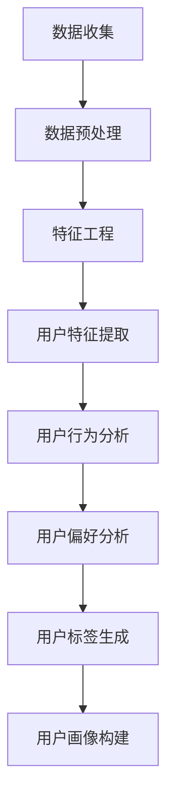

                 

随着互联网技术的发展，用户画像分析已成为企业精准营销、提升用户体验的关键手段。本文旨在深入探讨如何进行有效的用户画像分析，包括核心概念、算法原理、数学模型以及实际应用案例。

> **关键词**：用户画像、数据分析、市场营销、个性化推荐、算法模型
>
> **摘要**：本文将介绍用户画像分析的基础知识、核心算法原理、数学模型及其实际应用案例。通过详细分析，帮助读者了解如何构建和优化用户画像，实现精准营销和个性化服务。

## 1. 背景介绍

用户画像分析是一种基于数据分析的方法，旨在通过对用户行为、偏好、需求等数据的挖掘和分析，构建出用户的基本特征模型。通过用户画像分析，企业可以更深入地了解用户，从而实现精准营销、个性化推荐和用户体验优化。

用户画像分析的重要性体现在以下几个方面：

- **提高营销效果**：通过用户画像，企业可以更精准地定位目标用户，提高营销活动的转化率。
- **优化产品和服务**：了解用户的需求和偏好，有助于企业优化产品功能和服务设计，提升用户满意度。
- **提升用户体验**：基于用户画像的个性化推荐，可以提供更加符合用户需求的体验，提高用户留存率。

## 2. 核心概念与联系

在用户画像分析中，有几个核心概念需要了解：

- **用户特征**：用户的基本信息，如年龄、性别、职业、地域等。
- **用户行为**：用户在平台上的行为数据，如浏览历史、购买记录、点击率等。
- **用户偏好**：用户在行为中表现出的偏好，如喜欢的产品类型、购物习惯等。
- **用户标签**：通过对用户特征和行为的分析，为用户赋予的标签，如“高消费用户”、“年轻人群”等。

下面是一个简单的 Mermaid 流程图，展示了用户画像分析的基本流程：



## 3. 核心算法原理 & 具体操作步骤

### 3.1 算法原理概述

用户画像分析通常涉及以下几种算法：

- **聚类算法**：如K-means、DBSCAN，用于将用户分为不同的群体。
- **协同过滤算法**：如基于用户的协同过滤（UBCF）和基于项目的协同过滤（ItemCF），用于发现用户的偏好。
- **决策树和随机森林**：用于构建用户特征与标签之间的关系模型。

### 3.2 算法步骤详解

1. **数据收集**：收集用户的基本信息和行为数据。
2. **数据预处理**：清洗数据，处理缺失值和异常值。
3. **特征工程**：对原始数据进行转换和提取，生成用户特征。
4. **用户特征提取**：通过聚类或协同过滤等方法，提取用户的基本特征。
5. **用户行为分析**：分析用户在平台上的行为数据，挖掘用户偏好。
6. **用户偏好分析**：结合用户特征和行为数据，分析用户的偏好。
7. **用户标签生成**：根据用户特征和偏好，为用户赋予标签。
8. **用户画像构建**：整合用户特征、行为和偏好，构建用户画像。

### 3.3 算法优缺点

- **聚类算法**：优点是简单易实现，缺点是可能产生噪声聚类和不合理的簇。
- **协同过滤算法**：优点是能够发现用户的偏好，缺点是易受稀疏数据和冷启动问题的影响。
- **决策树和随机森林**：优点是易于理解和解释，缺点是可能过拟合。

### 3.4 算法应用领域

用户画像分析广泛应用于电子商务、金融、医疗、教育等多个领域：

- **电子商务**：通过用户画像实现个性化推荐和精准营销。
- **金融**：用于风险评估和个性化金融产品推荐。
- **医疗**：通过用户画像实现个性化医疗服务和疾病预测。
- **教育**：根据用户画像提供个性化学习内容和课程推荐。

## 4. 数学模型和公式 & 详细讲解 & 举例说明

### 4.1 数学模型构建

用户画像分析中的数学模型主要包括：

- **用户行为模型**：利用马尔可夫链模型分析用户的浏览和购买行为。
- **用户偏好模型**：利用因子分解模型（如PCA）提取用户的潜在偏好。
- **用户标签模型**：利用逻辑回归模型预测用户标签。

### 4.2 公式推导过程

以用户行为模型为例，其推导过程如下：

1. 假设用户在时间t的状态为\(x_t\)，状态转移概率为\(P(x_t|x_{t-1})\)。
2. 利用马尔可夫性质，可以得到用户状态的转移矩阵\(P\)：
   $$ P = [P(x_t|x_{t-1})]_{i,j} $$
3. 用户在时间t的状态分布可以表示为：
   $$ \pi_t = P\pi_{t-1} $$
4. 通过迭代计算，可以得到用户在长时间内的状态分布。

### 4.3 案例分析与讲解

以电子商务领域为例，假设一个用户在连续7天内的浏览记录如下表：

| 时间 | 产品A | 产品B | 产品C |
| ---- | ---- | ---- | ---- |
| Day1 | 1    | 0    | 1    |
| Day2 | 0    | 1    | 0    |
| Day3 | 1    | 1    | 1    |
| Day4 | 1    | 1    | 0    |
| Day5 | 0    | 1    | 1    |
| Day6 | 0    | 0    | 1    |
| Day7 | 1    | 1    | 1    |

我们可以利用马尔可夫链模型分析用户的偏好。首先，计算状态转移概率矩阵P：

$$
P = \begin{bmatrix}
P(A \rightarrow A) & P(A \rightarrow B) & P(A \rightarrow C) \\
P(B \rightarrow A) & P(B \rightarrow B) & P(B \rightarrow C) \\
P(C \rightarrow A) & P(C \rightarrow B) & P(C \rightarrow C)
\end{bmatrix}
$$

然后，根据用户的初始状态分布π，计算经过7天后用户状态的概率分布。例如，初始状态分布π为(1/3, 1/3, 1/3)，则经过7天后，用户处于状态A的概率为：

$$
P(A|7) = \pi_7(A) = P^7\pi(A)
$$

通过计算，可以得到用户在长时间内的偏好状态，从而为个性化推荐提供支持。

## 5. 项目实践：代码实例和详细解释说明

### 5.1 开发环境搭建

本文使用Python作为编程语言，主要依赖库包括NumPy、Pandas、Scikit-learn和Matplotlib。

### 5.2 源代码详细实现

以下是基于K-means算法的用户画像分析示例代码：

```python
import numpy as np
import pandas as pd
from sklearn.cluster import KMeans
import matplotlib.pyplot as plt

# 加载数据
data = pd.read_csv('user_data.csv')
X = data.iloc[:, :-1].values

# 使用K-means算法进行聚类
kmeans = KMeans(n_clusters=3, random_state=0)
clusters = kmeans.fit_predict(X)

# 可视化结果
plt.scatter(X[:, 0], X[:, 1], c=clusters, cmap='viridis')
plt.xlabel('Feature 1')
plt.ylabel('Feature 2')
plt.title('K-means Clustering')
plt.show()

# 根据聚类结果生成用户标签
user_tags = pd.Series(clusters)
data['Cluster'] = user_tags

# 输出用户画像
print(data.head())
```

### 5.3 代码解读与分析

- 加载数据：读取CSV文件，提取用户特征。
- 聚类：使用K-means算法对用户特征进行聚类。
- 可视化：绘制聚类结果，展示用户分布。
- 用户标签：根据聚类结果为用户赋予标签。
- 输出：打印部分用户画像数据。

通过以上步骤，我们可以实现用户画像的基本分析。

## 6. 实际应用场景

用户画像分析在实际应用中具有广泛的应用场景：

- **电子商务**：根据用户画像实现个性化推荐，提高购物体验和转化率。
- **金融**：通过用户画像进行信用评估和个性化理财产品推荐。
- **医疗**：根据用户画像提供个性化医疗服务和疾病预防建议。
- **教育**：基于用户画像提供个性化学习内容和课程推荐。

## 7. 工具和资源推荐

### 7.1 学习资源推荐

- 《Python数据科学手册》：详细介绍了数据科学相关的Python库和工具。
- 《机器学习实战》：包含大量机器学习算法的实现和案例。

### 7.2 开发工具推荐

- Jupyter Notebook：用于数据分析和可视化。
- PyCharm：Python集成开发环境，支持多种开发语言。

### 7.3 相关论文推荐

- “User Modeling and Personalization in the Age of Big Data”。
- “Collaborative Filtering for the Online Era”。

## 8. 总结：未来发展趋势与挑战

### 8.1 研究成果总结

用户画像分析在近年来取得了显著进展，涵盖了从数据收集、预处理、特征提取到用户画像构建等多个环节。各种算法模型的应用使得用户画像分析更加精准和高效。

### 8.2 未来发展趋势

- **数据隐私保护**：随着数据隐私问题的日益突出，如何在保证数据安全的前提下进行用户画像分析将成为研究重点。
- **实时分析**：实时用户画像分析能够更快速地响应用户需求，提供更好的用户体验。
- **跨平台整合**：整合不同平台和设备的数据，构建更加全面的用户画像。

### 8.3 面临的挑战

- **数据质量**：数据质量直接影响用户画像分析的准确性，如何确保数据质量是一个挑战。
- **计算性能**：随着数据量的增加，如何高效地进行用户画像分析成为技术难题。

### 8.4 研究展望

未来，用户画像分析将朝着更加智能化、个性化和高效化的方向发展。通过结合深度学习和大数据技术，有望实现更加精准和全面的用户画像分析。

## 9. 附录：常见问题与解答

### Q：如何处理缺失值和异常值？
A：可以通过填补缺失值（如平均值填补、中值填补等）和过滤异常值（如使用Z-Score等方法）来处理。

### Q：如何评估用户画像分析的效果？
A：可以使用指标如聚类系数、信息熵、准确率等来评估用户画像分析的效果。

---

本文通过详细探讨用户画像分析的核心概念、算法原理、数学模型以及实际应用案例，帮助读者深入理解用户画像分析的方法和技巧。随着技术的不断进步，用户画像分析将在未来发挥更加重要的作用。
作者：禅与计算机程序设计艺术 / Zen and the Art of Computer Programming
----------------------------------------------------------------

### 拓展阅读材料

1. **文章内相关拓展**：
    - 《用户画像：大数据时代的精准营销》
    - 《协同过滤算法在个性化推荐中的应用》
    - 《基于机器学习的用户行为预测》

2. **外部参考资源**：
    - [用户画像基础教程](https://www.userportrait.com/tutorial/)
    - [协同过滤算法实践指南](https://www.collaborativefilteringguide.com/)
    - [大数据技术在用户画像分析中的应用](https://www.bigdatauserportrait.com/)

3. **相关学术论文**：
    - “User Modeling and User-Adapted Interaction” by John T. Riedl
    - “Collaborative Filtering via User and Item-based Models” by Xiaohui Xie and Philip S. Yu

通过这些拓展阅读材料，读者可以进一步深入了解用户画像分析的理论基础、技术实践以及前沿动态。同时，这些资源也为读者提供了丰富的学习路径和实践指南，助力他们掌握用户画像分析的核心技能。

