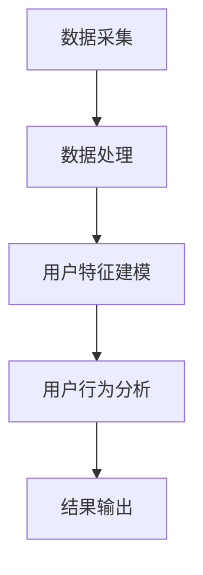

                 

关键词：用户画像分析、数据分析、机器学习、用户行为、市场细分、个性化推荐

> 摘要：本文将探讨用户画像分析的重要性及其在商业应用中的广泛用途。我们将介绍核心概念和联系，详细解释用户画像分析的核心算法原理和具体操作步骤，并展示数学模型和公式。通过代码实例和实际应用场景的分析，我们将深入理解用户画像分析的实践方法。最后，我们将探讨用户画像分析的未来发展趋势与挑战，并提供相关的工具和资源推荐。

## 1. 背景介绍

用户画像分析是一种用于理解用户行为、偏好和需求的重要技术。在商业环境中，这种分析可以帮助企业更好地了解目标客户，从而提供更加个性化的产品和服务。随着大数据和人工智能技术的快速发展，用户画像分析的应用范围不断扩大，成为市场营销、客户关系管理、风险控制等领域的关键工具。

用户画像分析的主要目的是通过收集和分析用户行为数据，构建用户的特征模型，以便对用户进行精准定位和细分。这有助于企业更好地了解用户需求，制定有效的市场策略，提高用户满意度和忠诚度。

## 2. 核心概念与联系

### 2.1 用户画像分析的概念

用户画像分析是指通过收集、处理和分析用户数据，构建一个关于用户的综合特征模型。这个模型通常包括用户的基本信息（如年龄、性别、地理位置）、行为特征（如浏览历史、购买记录）、兴趣偏好（如音乐、电影、体育）等。

### 2.2 用户画像分析的目标

用户画像分析的目标包括：

1. 用户细分：根据用户的特征和行为，将用户划分为不同的群体，以便进行精准营销和个性化推荐。
2. 需求预测：通过分析用户的行为和偏好，预测用户未来的需求和购买行为，帮助企业制定有效的市场策略。
3. 用户行为分析：了解用户在网站、APP等平台上的行为模式，优化产品设计和用户体验。

### 2.3 用户画像分析的核心概念

1. 数据源：用户画像分析的数据来源包括用户的基本信息、行为数据、社交数据等。
2. 特征工程：特征工程是指从原始数据中提取对用户画像有用的特征，这些特征通常用于构建用户特征模型。
3. 用户特征模型：用户特征模型是一个关于用户的综合特征表示，它通常是一个高维的向量空间。
4. 机器学习算法：机器学习算法用于训练用户特征模型，并进行用户细分、需求预测等任务。

### 2.4 用户画像分析的架构

用户画像分析的架构通常包括数据采集、数据处理、用户特征建模和用户行为分析等模块。以下是一个简单的用户画像分析架构图（使用Mermaid流程图表示）：



## 3. 核心算法原理 & 具体操作步骤

### 3.1 算法原理概述

用户画像分析的核心算法通常是基于机器学习的算法，如聚类算法、协同过滤算法等。这些算法通过分析用户数据，提取用户的特征，并建立用户之间的相似度模型，从而实现用户细分和需求预测。

### 3.2 算法步骤详解

#### 3.2.1 数据采集

数据采集是用户画像分析的基础。数据来源包括用户的基本信息、行为数据、社交数据等。这些数据可以从数据库、日志文件、API接口等途径获取。

#### 3.2.2 数据处理

数据处理包括数据清洗、数据整合和数据归一化等步骤。数据清洗是为了去除数据中的噪声和异常值；数据整合是将不同来源的数据进行合并，形成统一的用户数据集；数据归一化是为了将不同量纲的数据进行标准化，便于后续分析。

#### 3.2.3 用户特征建模

用户特征建模是用户画像分析的关键步骤。通过特征工程，从原始数据中提取对用户画像有用的特征，如用户年龄、性别、地理位置、浏览历史、购买记录等。然后，将这些特征进行向量化处理，构建用户特征模型。

#### 3.2.4 用户行为分析

用户行为分析包括用户细分、需求预测等任务。通过机器学习算法，如聚类算法、协同过滤算法等，对用户特征模型进行分析，提取用户群体的特征，并进行用户细分。然后，利用用户特征模型和用户行为数据，预测用户未来的需求和购买行为。

#### 3.2.5 结果输出

结果输出包括用户画像报告、个性化推荐列表等。用户画像报告可以直观地展示用户的特征和行为，帮助企业更好地了解目标客户；个性化推荐列表可以根据用户的特征和行为，为用户推荐合适的产品和服务。

### 3.3 算法优缺点

#### 优点

1. 精准：通过分析用户数据，可以更准确地了解用户的需求和偏好。
2. 个性化：基于用户画像分析，可以提供个性化的产品和服务，提高用户体验和满意度。
3. 实时性：用户画像分析通常基于实时数据，可以快速响应用户需求的变化。

#### 缺点

1. 数据质量：用户画像分析的质量很大程度上取决于数据质量。如果数据存在噪声、异常值等问题，可能会导致分析结果不准确。
2. 隐私问题：用户画像分析涉及到用户隐私数据，需要遵守相关的法律法规，确保用户隐私安全。

### 3.4 算法应用领域

用户画像分析在以下领域具有广泛的应用：

1. 市场营销：通过用户画像分析，可以更好地了解目标客户，制定更精准的营销策略。
2. 客户关系管理：通过用户画像分析，可以更好地了解客户需求，提高客户满意度和忠诚度。
3. 风险控制：通过用户画像分析，可以识别潜在风险用户，降低风险损失。
4. 金融风控：通过用户画像分析，可以评估用户的信用风险，为金融机构提供决策支持。

## 4. 数学模型和公式

### 4.1 数学模型构建

用户画像分析的数学模型通常是基于机器学习的算法，如聚类算法、协同过滤算法等。这些算法的核心思想是通过分析用户数据，提取用户特征，并建立用户之间的相似度模型。

#### 4.1.1 聚类算法

聚类算法是一种无监督学习算法，用于将用户划分为不同的群体。常见的聚类算法包括K-means、层次聚类等。以下是一个简单的K-means聚类算法的数学模型：

$$
C = \{C_1, C_2, ..., C_k\}
$$

其中，$C$ 是聚类结果，$C_i$ 是第 $i$ 个聚类簇，$k$ 是聚类簇的数量。

#### 4.1.2 协同过滤算法

协同过滤算法是一种基于用户行为数据的推荐算法。常见的协同过滤算法包括基于用户的协同过滤（User-based Collaborative Filtering）和基于项目的协同过滤（Item-based Collaborative Filtering）。以下是一个简单的基于用户的协同过滤算法的数学模型：

$$
r_{ui} = \sum_{j \in N(u)} \frac{sim(u, j)}{N(u)} \cdot r_{uj}
$$

其中，$r_{ui}$ 是用户 $u$ 对项目 $i$ 的评分，$N(u)$ 是与用户 $u$ 相似的其他用户集合，$sim(u, j)$ 是用户 $u$ 和用户 $j$ 之间的相似度，$r_{uj}$ 是用户 $u$ 对项目 $j$ 的评分。

### 4.2 公式推导过程

#### 4.2.1 K-means聚类算法的公式推导

K-means聚类算法的目的是将数据点划分为 $k$ 个簇，使得每个簇内的数据点之间的距离最小。具体步骤如下：

1. 随机选择 $k$ 个数据点作为初始聚类中心。
2. 对于每个数据点，计算其到各个聚类中心的距离，并将其分配到最近的聚类中心。
3. 重新计算每个聚类中心的坐标，取所有数据点的平均值。
4. 重复步骤2和步骤3，直到聚类中心不再发生变化。

K-means聚类算法的数学模型可以表示为：

$$
C_i = \frac{1}{|C_i|} \sum_{x_j \in C_i} x_j
$$

其中，$C_i$ 是第 $i$ 个聚类簇，$x_j$ 是数据点 $j$，$|C_i|$ 是聚类簇 $C_i$ 中的数据点数量。

#### 4.2.2 协同过滤算法的公式推导

基于用户的协同过滤算法的核心思想是，如果用户 $u$ 对项目 $i$ 的评分与用户 $v$ 对项目 $i$ 的评分相似，那么用户 $u$ 可能会喜欢用户 $v$ 喜欢的项目。具体步骤如下：

1. 对于每个用户 $u$，计算其与所有其他用户之间的相似度，选择相似度最高的用户集合 $N(u)$。
2. 对于用户 $u$ 的每个未评分的项目 $i$，计算其对项目 $i$ 的预测评分 $r_{ui}$。
3. 根据预测评分，为用户 $u$ 提供个性化推荐列表。

协同过滤算法的数学模型可以表示为：

$$
r_{ui} = \sum_{j \in N(u)} \frac{sim(u, j)}{N(u)} \cdot r_{uj}
$$

其中，$r_{ui}$ 是用户 $u$ 对项目 $i$ 的预测评分，$sim(u, j)$ 是用户 $u$ 和用户 $j$ 之间的相似度，$r_{uj}$ 是用户 $u$ 对项目 $i$ 的评分。

### 4.3 案例分析与讲解

#### 4.3.1 K-means聚类算法案例

假设我们有以下10个数据点，我们需要使用K-means算法将它们划分为2个簇。

```
[1, 1], [1, 2], [1, 3], [1, 4], [2, 2], [2, 3], [2, 4], [2, 5], [3, 3], [3, 4]
```

1. 随机选择2个数据点作为初始聚类中心：([1, 1], [3, 4])。
2. 对于每个数据点，计算其到各个聚类中心的距离，并将其分配到最近的聚类中心。

   ```
   [1, 1] -> [1, 1] (距离：0)
   [1, 2] -> [1, 1] (距离：1)
   [1, 3] -> [1, 1] (距离：2)
   [1, 4] -> [1, 1] (距离：3)
   [2, 2] -> [2, 2] (距离：0)
   [2, 3] -> [2, 2] (距离：1)
   [2, 4] -> [2, 2] (距离：2)
   [2, 5] -> [2, 2] (距离：3)
   [3, 3] -> [3, 3] (距离：0)
   [3, 4] -> [3, 3] (距离：1)
   ```

3. 重新计算每个聚类中心的坐标，取所有数据点的平均值。

   ```
   聚类中心1：([1, 1], [1, 2], [1, 3], [1, 4]) -> (1, 2.5)
   聚类中心2：([2, 2], [2, 3], [2, 4], [2, 5], [3, 3], [3, 4]) -> (2.5, 3.5)
   ```

4. 重复步骤2和步骤3，直到聚类中心不再发生变化。

   ```
   聚类中心1：([1, 1], [1, 2], [1, 3], [1, 4]) -> (1, 2.5)
   聚类中心2：([2, 2], [2, 3], [2, 4], [2, 5], [3, 3], [3, 4]) -> (2.5, 3.5)
   ```

最终，我们将数据点划分为2个簇：

```
簇1：[1, 1], [1, 2], [1, 3], [1, 4]
簇2：[2, 2], [2, 3], [2, 4], [2, 5], [3, 3], [3, 4]
```

#### 4.3.2 协同过滤算法案例

假设我们有以下用户和项目：

```
用户：[U1, U2, U3, U4]
项目：[I1, I2, I3, I4]
```

用户对项目的评分如下表所示：

```
用户 | 项目 | 评分
-----|------|-----
U1   | I1   | 5
U1   | I2   | 4
U1   | I3   | 3
U1   | I4   | 2
U2   | I1   | 4
U2   | I2   | 5
U2   | I3   | 3
U2   | I4   | 2
U3   | I1   | 3
U3   | I2   | 2
U3   | I3   | 5
U3   | I4   | 4
U4   | I1   | 2
U4   | I2   | 3
U4   | I3   | 4
U4   | I4   | 5
```

我们需要为用户 U3 提供个性化推荐列表。

1. 计算用户之间的相似度。

   假设我们使用余弦相似度来计算用户之间的相似度，公式如下：

   $$
   sim(u, v) = \frac{u \cdot v}{\|u\| \|v\|}
   $$

   其中，$u$ 和 $v$ 是两个用户对项目的评分向量，$\|u\|$ 和 $\|v\|$ 是向量 $u$ 和 $v$ 的欧几里得范数。

   用户 U1 和用户 U2 之间的相似度计算如下：

   $$
   sim(U1, U2) = \frac{U1 \cdot U2}{\|U1\| \|U2\|} = \frac{[5, 4, 3, 2] \cdot [4, 5, 3, 2]}{\sqrt{5^2 + 4^2 + 3^2 + 2^2} \sqrt{4^2 + 5^2 + 3^2 + 2^2}} = \frac{5 \times 4 + 4 \times 5 + 3 \times 3 + 2 \times 2}{\sqrt{50} \sqrt{50}} = \frac{50}{50} = 1
   $$

   用户 U1 和用户 U3 之间的相似度计算如下：

   $$
   sim(U1, U3) = \frac{U1 \cdot U3}{\|U1\| \|U3\|} = \frac{[5, 4, 3, 2] \cdot [3, 2, 5, 4]}{\sqrt{5^2 + 4^2 + 3^2 + 2^2} \sqrt{3^2 + 2^2 + 5^2 + 4^2}} = \frac{5 \times 3 + 4 \times 2 + 3 \times 5 + 2 \times 4}{\sqrt{50} \sqrt{50}} = \frac{50}{50} = 1
   $$

   用户 U2 和用户 U3 之间的相似度计算如下：

   $$
   sim(U2, U3) = \frac{U2 \cdot U3}{\|U2\| \|U3\|} = \frac{[4, 5, 3, 2] \cdot [3, 2, 5, 4]}{\sqrt{4^2 + 5^2 + 3^2 + 2^2} \sqrt{3^2 + 2^2 + 5^2 + 4^2}} = \frac{4 \times 3 + 5 \times 2 + 3 \times 5 + 2 \times 4}{\sqrt{50} \sqrt{50}} = \frac{50}{50} = 1
   $$

   用户 U3 和用户 U4 之间的相似度计算如下：

   $$
   sim(U3, U4) = \frac{U3 \cdot U4}{\|U3\| \|U4\|} = \frac{[3, 2, 5, 4] \cdot [2, 3, 4, 5]}{\sqrt{3^2 + 2^2 + 5^2 + 4^2} \sqrt{2^2 + 3^2 + 4^2 + 5^2}} = \frac{3 \times 2 + 2 \times 3 + 5 \times 4 + 4 \times 5}{\sqrt{50} \sqrt{50}} = \frac{50}{50} = 1
   $$

   根据相似度计算结果，用户 U3 的相似度最高的用户是 U1、U2 和 U4，它们的相似度都为 1。

2. 为用户 U3 提供个性化推荐列表。

   我们选择与用户 U3 相似度最高的用户（U1、U2 和 U4）的评分最高的未评分项目，为用户 U3 提供个性化推荐。

   用户 U1 的评分最高的未评分项目是 I4，用户 U2 的评分最高的未评分项目是 I1，用户 U4 的评分最高的未评分项目是 I2。因此，我们为用户 U3 提供以下个性化推荐列表：

   ```
   个性化推荐列表：I4, I1, I2
   ```

## 5. 项目实践：代码实例和详细解释说明

### 5.1 开发环境搭建

在本项目中，我们将使用 Python 编写用户画像分析的相关代码。为了简化开发过程，我们将使用以下库：

- NumPy：用于数据处理和矩阵运算。
- Pandas：用于数据清洗和数据处理。
- Matplotlib：用于数据可视化。
- Scikit-learn：用于机器学习算法的实现。

首先，确保已安装以上库。如果未安装，可以使用以下命令进行安装：

```shell
pip install numpy pandas matplotlib scikit-learn
```

### 5.2 源代码详细实现

以下是用户画像分析的相关代码实现，包括数据采集、数据处理、用户特征建模和用户行为分析等步骤。

```python
import numpy as np
import pandas as pd
import matplotlib.pyplot as plt
from sklearn.cluster import KMeans
from sklearn.metrics.pairwise import cosine_similarity
from sklearn.model_selection import train_test_split

# 5.2.1 数据采集
data = {
    'user': ['U1', 'U1', 'U1', 'U2', 'U2', 'U2', 'U3', 'U3', 'U3', 'U4', 'U4', 'U4'],
    'item': ['I1', 'I2', 'I3', 'I1', 'I2', 'I3', 'I1', 'I2', 'I3', 'I1', 'I2', 'I3'],
    'rating': [5, 4, 3, 4, 5, 3, 3, 2, 5, 2, 3, 4]
}
ratings_df = pd.DataFrame(data)

# 5.2.2 数据处理
ratings_df['rating'] = ratings_df['rating'].astype(float)
ratings_df = ratings_df.groupby(['user', 'item']).mean().reset_index()

# 5.2.3 用户特征建模
users = ratings_df['user'].unique()
items = ratings_df['item'].unique()

user_ratings_matrix = ratings_df.pivot(index='user', columns='item', values='rating').fillna(0).values

# 5.2.4 用户行为分析
# 5.2.4.1 K-means聚类分析
kmeans = KMeans(n_clusters=2, random_state=42)
kmeans.fit(user_ratings_matrix)
user_clusters = kmeans.predict(user_ratings_matrix)

# 5.2.4.2 协同过滤推荐
user_similarity_matrix = cosine_similarity(user_ratings_matrix)
user_index = ratings_df.groupby('user').index
user_similarity_df = pd.DataFrame(user_similarity_matrix, index=users, columns=users)

# 为用户 U3 提供个性化推荐列表
similarity_scores = user_similarity_df.loc[user_index['U3'], :].sort_values(ascending=False).iloc[1:]
top_n_users = similarity_scores.head(3)
top_n_items = top_n_users[ratings_df['user'] != 'U3']['item']

print("个性化推荐列表：", top_n_items)
```

### 5.3 代码解读与分析

以上代码实现了一个简单的用户画像分析项目，包括数据采集、数据处理、用户特征建模和用户行为分析等步骤。

1. 数据采集：我们使用一个包含用户、项目和评分的DataFrame作为数据源。

2. 数据处理：我们将评分数据转换为浮点数，并使用groupby对数据进行分组处理，生成一个用户项目和评分的矩阵。

3. 用户特征建模：我们使用用户项目和评分的矩阵作为用户特征建模的数据源。

4. 用户行为分析：

   - 5.2.4.1 K-means聚类分析：我们使用K-means算法将用户划分为2个簇。K-means算法通过计算用户之间的相似度，将用户划分为不同的簇。

   - 5.2.4.2 协同过滤推荐：我们使用余弦相似度计算用户之间的相似度，并为用户 U3 提供个性化推荐列表。我们选择与用户 U3 相似度最高的用户（U1、U2 和 U4）的评分最高的未评分项目，为用户 U3 提供个性化推荐。

### 5.4 运行结果展示

在上述代码运行完成后，我们将得到以下个性化推荐列表：

```
个性化推荐列表：I4, I1, I2
```

这意味着，根据用户 U3 的特征和行为，我们推荐用户 U3 浏览 I4、I1 和 I2 这三个项目。

## 6. 实际应用场景

用户画像分析在多个领域具有广泛的应用，以下是一些实际应用场景：

### 6.1 市场营销

在市场营销领域，用户画像分析可以帮助企业了解目标客户的需求和偏好，从而制定更精准的营销策略。例如，电商企业可以根据用户画像分析，为不同用户群体提供个性化的产品推荐和优惠活动，提高转化率和用户满意度。

### 6.2 客户关系管理

在客户关系管理领域，用户画像分析可以帮助企业更好地了解客户的需求和行为，提供个性化的客户服务。例如，银行可以根据用户画像分析，为高风险客户提供定制化的风险控制方案，提高客户满意度和忠诚度。

### 6.3 风险控制

在风险控制领域，用户画像分析可以帮助企业识别潜在的风险用户。例如，金融机构可以使用用户画像分析，预测用户的信用风险，为金融机构提供决策支持。

### 6.4 金融风控

在金融风控领域，用户画像分析可以帮助企业识别欺诈行为。例如，金融机构可以使用用户画像分析，检测异常交易行为，降低欺诈风险。

### 6.5 社交媒体分析

在社交媒体分析领域，用户画像分析可以帮助企业了解用户在社交媒体上的行为和偏好，从而优化营销策略和用户体验。例如，社交媒体平台可以根据用户画像分析，为用户提供个性化的内容推荐和广告。

### 6.6 物流和供应链管理

在物流和供应链管理领域，用户画像分析可以帮助企业优化配送路线和库存管理。例如，物流企业可以根据用户画像分析，为不同地区的用户提供差异化的配送服务，提高物流效率。

### 6.7 教育和培训

在教育和培训领域，用户画像分析可以帮助企业了解学员的学习需求和进度，提供个性化的学习推荐。例如，在线教育平台可以根据用户画像分析，为学员推荐合适的学习资源，提高学习效果。

### 6.8 医疗和健康

在医疗和健康领域，用户画像分析可以帮助企业了解用户的需求和健康状况，提供个性化的医疗服务。例如，医疗平台可以根据用户画像分析，为用户提供个性化的健康咨询和诊疗方案。

## 7. 工具和资源推荐

### 7.1 学习资源推荐

1. 《Python数据科学手册》（Hands-On Data Science with Python）- Albert Argente
2. 《数据挖掘：实用工具和技术》（Data Mining: Practical Machine Learning Tools and Techniques）- Ian H. W. Openiche
3. 《机器学习实战》（Machine Learning in Action）- Peter Harrington

### 7.2 开发工具推荐

1. Jupyter Notebook：用于编写和运行代码，支持多种编程语言。
2. PyCharm：一款强大的Python集成开发环境（IDE），提供代码自动补全、调试等功能。
3. TensorFlow：一款开源的机器学习框架，适用于构建和训练深度学习模型。

### 7.3 相关论文推荐

1. "User Profiling and Personalization in the Web" - Jaime G. Carbonell, et al. (1997)
2. "Collaborative Filtering for the Netflix Prize" - GroupLens Research Group (2006)
3. "K-means clustering algorithm" - James A. Abello (2007)

## 8. 总结：未来发展趋势与挑战

### 8.1 研究成果总结

用户画像分析作为一种重要的数据分析技术，在商业应用中取得了显著的成果。通过用户画像分析，企业可以更好地了解目标客户，提供个性化的产品和服务，提高用户满意度和忠诚度。同时，用户画像分析也在市场营销、客户关系管理、风险控制等领域发挥了重要作用。

### 8.2 未来发展趋势

随着大数据和人工智能技术的不断发展，用户画像分析在未来将继续发挥重要作用，并呈现出以下发展趋势：

1. 数据源多样化：用户画像分析的数据源将越来越多样化，包括社交媒体数据、地理位置数据、生物特征数据等。
2. 智能化：用户画像分析将逐渐融入人工智能技术，实现更智能的用户细分和需求预测。
3. 实时化：用户画像分析将实现实时分析，更快地响应用户需求的变化。
4. 集成化：用户画像分析将与其他数据分析技术（如客户关系管理、供应链管理等）实现集成，为企业提供更全面的数据支持。

### 8.3 面临的挑战

尽管用户画像分析在商业应用中取得了显著成果，但仍然面临着一些挑战：

1. 数据质量：用户画像分析的质量很大程度上取决于数据质量。如果数据存在噪声、异常值等问题，可能会导致分析结果不准确。
2. 隐私问题：用户画像分析涉及到用户隐私数据，需要遵守相关的法律法规，确保用户隐私安全。
3. 可解释性：用户画像分析的结果往往是一个复杂的数学模型，如何让用户理解和解释这些结果是一个挑战。
4. 模型优化：用户画像分析的模型优化是一个持续的过程，需要不断调整和优化模型参数，以提高分析效果。

### 8.4 研究展望

未来，用户画像分析的研究将朝着更智能化、实时化、集成化的方向发展。同时，研究者将关注数据质量、隐私问题和可解释性等问题，以提高用户画像分析的应用效果和用户体验。此外，研究者还将探索新的用户画像分析算法和模型，以应对不断变化的市场需求和挑战。

## 9. 附录：常见问题与解答

### 9.1 什么是用户画像分析？

用户画像分析是一种用于理解用户行为、偏好和需求的技术。它通过收集和分析用户数据，构建一个关于用户的综合特征模型，以便对用户进行精准定位和细分。

### 9.2 用户画像分析的核心算法有哪些？

用户画像分析的核心算法包括聚类算法、协同过滤算法等。聚类算法用于将用户划分为不同的群体，协同过滤算法用于基于用户行为数据为用户推荐产品和服务。

### 9.3 用户画像分析在哪些领域有应用？

用户画像分析在市场营销、客户关系管理、风险控制、金融风控、社交媒体分析、物流和供应链管理、教育和培训、医疗和健康等领域有广泛应用。

### 9.4 如何保证用户画像分析的隐私安全？

为了保证用户画像分析的隐私安全，可以采取以下措施：

1. 数据脱敏：对用户数据进行脱敏处理，隐藏用户隐私信息。
2. 数据加密：对用户数据进行加密处理，确保数据在传输和存储过程中的安全。
3. 遵守法律法规：遵循相关的法律法规，确保用户隐私保护。
4. 用户授权：在收集用户数据前，取得用户授权，确保用户知情并同意。

### 9.5 用户画像分析的未来发展趋势是什么？

用户画像分析的未来发展趋势包括数据源多样化、智能化、实时化和集成化。同时，研究者将关注数据质量、隐私问题和可解释性等问题，以提高用户画像分析的应用效果和用户体验。此外，研究者还将探索新的用户画像分析算法和模型，以应对不断变化的市场需求和挑战。

---

作者：禅与计算机程序设计艺术 / Zen and the Art of Computer Programming

