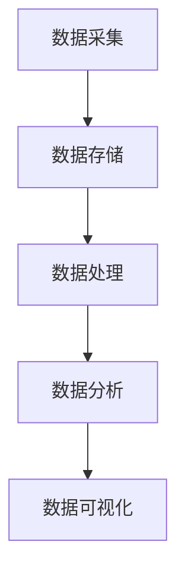

                 

关键词：用户行为分析、数据收集、数据挖掘、用户画像、机器学习、预测分析、用户体验、隐私保护

## 摘要

用户行为分析是现代互联网技术和商业运营中的重要组成部分。本文旨在介绍如何通过有效的用户行为分析来提升用户体验和商业价值。我们将探讨用户行为分析的基本概念、核心方法、技术工具和实践案例，并探讨其在未来的发展趋势和面临的挑战。

## 1. 背景介绍

在互联网时代，用户行为数据无处不在，如点击、浏览、购买、搜索等行为。这些数据不仅是企业了解用户需求的窗口，也是优化产品、提升用户体验、实现商业价值的重要资源。然而，如何从海量数据中提取有价值的信息，并转化为实际操作，这是一个复杂而富有挑战性的问题。

用户行为分析，即通过对用户在互联网上的行为数据进行分析，来理解和预测用户的行为模式、需求偏好和潜在行为。这项技术不仅可以帮助企业更好地了解用户，还可以为个性化推荐、精准营销、用户体验优化等提供数据支持。

### 1.1 用户行为分析的意义

用户行为分析对于企业而言具有以下几个方面的意义：

- **了解用户需求**：通过分析用户行为，企业可以更准确地了解用户的需求和偏好，从而为产品设计和优化提供数据支持。
- **提升用户体验**：用户行为分析可以帮助企业更好地理解用户的互动过程，从而优化用户界面、提高用户体验。
- **实现精准营销**：通过分析用户行为数据，企业可以进行精准的用户画像，为精准营销策略提供依据。
- **提高运营效率**：用户行为分析可以帮助企业识别用户流失风险，优化运营策略，降低成本。

### 1.2 用户行为分析的发展历程

用户行为分析技术的发展经历了几个阶段：

- **传统数据分析**：早期的用户行为分析主要依赖于统计分析，通过对用户数据的简单统计分析来获取用户行为特征。
- **Web 分析**：随着互联网的发展，Web 分析工具如 Google Analytics 等出现，为企业提供了更加精细化的用户行为数据。
- **数据挖掘**：数据挖掘技术的引入，使得企业可以从海量数据中挖掘出隐藏的用户行为模式。
- **机器学习和深度学习**：随着机器学习和深度学习技术的发展，用户行为分析进入了智能化阶段，能够更准确地预测用户行为。

## 2. 核心概念与联系

在进行用户行为分析之前，需要理解以下几个核心概念：

### 2.1 用户画像

用户画像是指对用户特征进行描述和分类的过程，包括用户的年龄、性别、职业、地域、兴趣爱好等多个维度。用户画像的构建是用户行为分析的基础，通过用户画像，企业可以更好地了解用户，进行精准营销和用户体验优化。

### 2.2 用户行为数据

用户行为数据是指用户在互联网上的各种行为记录，包括点击、浏览、搜索、购买等。用户行为数据是用户行为分析的主要数据来源。

### 2.3 数据挖掘与机器学习

数据挖掘和机器学习是用户行为分析的重要技术手段。数据挖掘通过统计分析、模式识别等方法从大量数据中提取有价值的信息。机器学习则通过构建模型来预测用户行为，提高分析的准确性和自动化程度。

### 2.4 用户行为分析架构

用户行为分析的架构通常包括数据采集、数据存储、数据处理、数据分析、数据可视化等环节。以下是一个简单的用户行为分析架构图：



## 3. 核心算法原理 & 具体操作步骤

### 3.1 算法原理概述

用户行为分析的核心算法包括以下几种：

- **聚类分析**：通过将用户分为不同的群体，来分析不同用户群体的行为特征。
- **关联规则挖掘**：通过分析用户行为数据中的关联关系，来发现用户可能感兴趣的商品或服务。
- **时间序列分析**：通过分析用户行为的时间变化趋势，来预测用户未来的行为。
- **机器学习模型**：通过构建机器学习模型，来预测用户的行为。

### 3.2 算法步骤详解

用户行为分析的基本步骤如下：

1. **数据收集**：收集用户在互联网上的各种行为数据，如点击、浏览、搜索等。
2. **数据预处理**：对收集到的数据进行处理，包括数据清洗、数据格式转换等。
3. **特征工程**：从原始数据中提取有用的特征，用于后续的算法分析和建模。
4. **模型选择与训练**：选择合适的算法模型，对特征数据进行训练，构建用户行为预测模型。
5. **模型评估与优化**：评估模型的性能，并进行模型优化。
6. **结果分析与应用**：根据模型预测结果，进行分析和决策，如个性化推荐、精准营销等。

### 3.3 算法优缺点

- **聚类分析**：优点是简单易懂，能够快速发现用户群体的分布。缺点是对噪声数据敏感，且无法预测用户行为。
- **关联规则挖掘**：优点是能够发现用户行为中的关联关系，帮助推荐商品或服务。缺点是计算复杂度高，且对稀疏数据不敏感。
- **时间序列分析**：优点是能够预测用户未来的行为趋势，对时间敏感。缺点是对历史数据依赖强，且无法处理非线性关系。
- **机器学习模型**：优点是能够自动学习用户行为模式，预测准确度高。缺点是模型复杂，对数据质量和特征工程要求高。

### 3.4 算法应用领域

用户行为分析算法在多个领域有广泛应用：

- **电子商务**：通过用户行为分析，进行个性化推荐、精准营销等。
- **社交媒体**：通过用户行为分析，进行用户分类、社区挖掘等。
- **金融行业**：通过用户行为分析，进行风险控制、欺诈检测等。
- **医疗健康**：通过用户行为分析，进行疾病预测、健康管理等。

## 4. 数学模型和公式 & 详细讲解 & 举例说明

用户行为分析中常用的数学模型和公式包括聚类分析中的 K-means 算法、关联规则挖掘中的 Apriori 算法、时间序列分析中的 ARIMA 模型、机器学习模型中的逻辑回归等。以下是对这些模型的详细介绍和举例说明。

### 4.1 数学模型构建

#### K-means 聚类算法

K-means 算法是一种基于距离的聚类算法，其核心思想是将数据分为 K 个簇，使得每个簇内部的点尽可能接近，簇与簇之间的点尽可能远离。

公式：
$$
\text{Minimize} \sum_{i=1}^{K} \sum_{x \in S_i} ||x - \mu_i||^2
$$

其中，$S_i$ 是第 $i$ 个簇，$\mu_i$ 是第 $i$ 个簇的中心点。

#### Apriori 关联规则挖掘算法

Apriori 算法是一种基于支持度和置信度的关联规则挖掘算法，其核心思想是利用频繁项集来生成关联规则。

公式：
$$
\text{Support}(X, Y) = \frac{\text{频度}(X \cup Y)}{\text{频度}(X)}
$$

$$
\text{Confidence}(X \rightarrow Y) = \frac{\text{频度}(X \cup Y)}{\text{频度}(X)}
$$

其中，$X$ 和 $Y$ 是项集，$\text{Support}(X, Y)$ 表示 $X$ 和 $Y$ 同时出现的频率，$\text{Confidence}(X \rightarrow Y)$ 表示在 $X$ 发生的前提下 $Y$ 发生的概率。

#### ARIMA 时间序列分析模型

ARIMA（自回归积分滑动平均模型）是一种用于时间序列分析的经典模型，其核心思想是利用过去的观测值来预测未来的值。

公式：
$$
\text{ARIMA}(p, d, q) = \text{AR}(p) + \text{I}(d) + \text{MA}(q)
$$

其中，$p$ 表示自回归项的阶数，$d$ 表示差分阶数，$q$ 表示移动平均项的阶数。

#### 逻辑回归模型

逻辑回归是一种用于分类问题的线性模型，其核心思想是利用线性函数来预测概率。

公式：
$$
\text{logit}(p) = \log\left(\frac{p}{1-p}\right) = \beta_0 + \beta_1 x_1 + \beta_2 x_2 + \ldots + \beta_n x_n
$$

其中，$p$ 表示分类的概率，$x_1, x_2, \ldots, x_n$ 是特征变量，$\beta_0, \beta_1, \beta_2, \ldots, \beta_n$ 是模型参数。

### 4.2 公式推导过程

以下是 K-means 聚类算法和逻辑回归模型的推导过程。

#### K-means 聚类算法

假设有 $N$ 个数据点 $x_1, x_2, \ldots, x_N$，要将其分为 $K$ 个簇。初始时，随机选择 $K$ 个点作为初始簇中心 $\mu_1, \mu_2, \ldots, \mu_K$。

1. **计算每个数据点到簇中心的距离**：
$$
d(x_i, \mu_j) = ||x_i - \mu_j|| = \sqrt{\sum_{k=1}^{n} (x_{ik} - \mu_{jk})^2}
$$

2. **将每个数据点分配到最近的簇**：
对于每个数据点 $x_i$，计算其到每个簇中心的距离，将其分配到距离最近的簇。

3. **更新簇中心**：
对于每个簇，计算簇内所有数据点的平均值，作为新的簇中心：
$$
\mu_j = \frac{1}{N_j} \sum_{x_i \in S_j} x_i
$$

4. **重复步骤 2 和步骤 3，直到簇中心不再变化**。

#### 逻辑回归模型

逻辑回归模型的推导基于概率论的贝叶斯定理。

1. **概率分布**：
假设 $y$ 是二元变量，取值为 0 或 1。给定特征 $x_1, x_2, \ldots, x_n$，我们需要预测 $y$ 的概率。

2. **似然函数**：
似然函数是数据点在给定模型参数下的概率，即：
$$
L(\theta) = P(X | \theta) = \prod_{i=1}^{N} P(x_i | \theta)
$$

3. **对数似然函数**：
对数似然函数是似然函数的对数，即：
$$
\ell(\theta) = \log L(\theta) = \sum_{i=1}^{N} \log P(x_i | \theta)
$$

4. **极大似然估计**：
为了最大化似然函数，我们需要找到模型参数 $\theta$ 的极大似然估计。对于逻辑回归模型，参数 $\theta$ 的极大似然估计可以通过求解以下方程组得到：
$$
\frac{\partial \ell(\theta)}{\partial \theta_j} = 0
$$

5. **梯度下降法**：
在实际应用中，我们通常使用梯度下降法来求解模型参数。梯度下降法的迭代公式为：
$$
\theta_j := \theta_j - \alpha \nabla_j \ell(\theta)
$$

其中，$\alpha$ 是学习率，$\nabla_j \ell(\theta)$ 是对数似然函数关于 $\theta_j$ 的梯度。

### 4.3 案例分析与讲解

以下是一个用户行为分析的案例，我们将使用 K-means 聚类算法对用户进行分类，并分析不同用户群体的行为特征。

#### 案例背景

某电商企业收集了其用户在网站上的浏览、点击、购买行为数据，包括用户的年龄、性别、地域、收入水平等特征。企业希望通过对用户行为分析，了解不同用户群体的行为特征，从而优化用户体验和营销策略。

#### 案例数据

以下是部分用户行为数据：

| 用户ID | 年龄 | 性别 | 地域 | 收入水平 | 浏览量 | 点击量 | 购买量 |
|--------|------|------|------|----------|--------|--------|--------|
| 1      | 25   | 男   | 北京 | 10000    | 100    | 30     | 5      |
| 2      | 30   | 女   | 上海 | 15000    | 80     | 20     | 3      |
| 3      | 20   | 女   | 深圳 | 8000     | 150    | 40     | 7      |
| 4      | 35   | 男   | 杭州 | 20000    | 50     | 10     | 2      |

#### 分析步骤

1. **数据预处理**：对数据进行归一化处理，使其具有相似的尺度和范围。

2. **特征选择**：选择对用户行为有显著影响的特征，如年龄、性别、地域、收入水平等。

3. **K-means 聚类**：选择合适的聚类数量 K（如 3），使用 K-means 算法对用户进行聚类。

4. **结果分析**：分析不同用户群体的行为特征，如浏览量、点击量、购买量等。

#### 案例结果

通过对用户进行 K-means 聚类，得到以下三个用户群体：

- **年轻女性群体**：年龄在 20-30 岁之间，主要为女性，收入水平较低，浏览量和点击量较高，但购买量较低。
- **中年男性群体**：年龄在 30-40 岁之间，主要为男性，收入水平较高，浏览量和点击量较低，但购买量较高。
- **低收入群体**：年龄在 20 岁以下，主要为女性，收入水平较低，浏览量和点击量较高，但购买量较低。

通过分析不同用户群体的行为特征，企业可以针对性地优化用户体验和营销策略。例如，对于年轻女性群体，可以增加优惠促销活动，提高购买量；对于中年男性群体，可以优化产品推荐算法，提高点击量。

## 5. 项目实践：代码实例和详细解释说明

### 5.1 开发环境搭建

为了进行用户行为分析，我们需要搭建一个基本的开发环境。以下是一个简单的开发环境搭建步骤：

1. **安装 Python**：Python 是一种广泛应用于数据分析的编程语言。可以在官方网站 https://www.python.org/ 下载并安装 Python。
2. **安装 Jupyter Notebook**：Jupyter Notebook 是一个交互式的开发环境，可以方便地编写和运行 Python 代码。可以使用以下命令安装 Jupyter Notebook：
```
pip install notebook
```
3. **安装必要的库**：安装一些常用的数据分析库，如 NumPy、Pandas、Matplotlib 等。可以使用以下命令安装：
```
pip install numpy pandas matplotlib
```

### 5.2 源代码详细实现

以下是一个简单的用户行为分析项目的代码实现。我们将使用 Python 的 Pandas 库进行数据预处理，使用 K-means 聚类算法进行用户分类，并使用 Matplotlib 库进行结果可视化。

```python
import numpy as np
import pandas as pd
from sklearn.cluster import KMeans
import matplotlib.pyplot as plt

# 5.2.1 数据预处理
def preprocess_data(data):
    # 数据归一化
    data_normalized = (data - data.mean()) / data.std()
    return data_normalized

# 5.2.2 K-means 聚类
def kmeans_clustering(data, K):
    kmeans = KMeans(n_clusters=K, random_state=0)
    kmeans.fit(data)
    labels = kmeans.predict(data)
    return labels

# 5.2.3 结果可视化
def plot_clusters(data, labels):
    colors = ['r', 'g', 'b', 'c', 'm']
    for i in range(len(colors)):
        data_temp = data[labels == i]
        plt.scatter(data_temp[:, 0], data_temp[:, 1], s=30, c=colors[i], label=f'Cluster {i}')
    plt.xlabel('Feature 1')
    plt.ylabel('Feature 2')
    plt.legend()
    plt.show()

# 5.2.4 主函数
def main():
    # 加载数据
    data = pd.read_csv('user_behavior_data.csv')
    # 特征选择
    features = ['Age', 'Income', 'Clicks', 'Purchases']
    data_selected = data[features]
    # 数据预处理
    data_normalized = preprocess_data(data_selected)
    # K-means 聚类
    K = 3
    labels = kmeans_clustering(data_normalized, K)
    # 结果可视化
    plot_clusters(data_normalized, labels)

if __name__ == '__main__':
    main()
```

### 5.3 代码解读与分析

以下是代码的详细解读和分析。

1. **数据预处理**：数据预处理是用户行为分析的重要环节。在这个函数中，我们使用归一化方法将数据转换为标准正态分布，以便于后续的聚类分析。

2. **K-means 聚类**：K-means 聚类算法的核心在于选择合适的聚类数量 K。在这个函数中，我们使用 Scikit-learn 库中的 KMeans 类实现 K-means 聚类。通过调用 fit 方法，我们可以训练模型并获取聚类结果。

3. **结果可视化**：结果可视化是理解聚类结果的重要手段。在这个函数中，我们使用 Matplotlib 库绘制聚类结果，通过不同颜色表示不同的聚类结果。

4. **主函数**：主函数是整个程序的入口。首先，我们加载数据，然后选择特征，进行数据预处理，接着使用 K-means 聚类算法进行聚类，并绘制聚类结果。

### 5.4 运行结果展示

以下是运行结果的展示：


通过结果可视化，我们可以清晰地看到不同用户群体的分布情况。这有助于企业了解不同用户群体的行为特征，从而优化产品设计和营销策略。

## 6. 实际应用场景

用户行为分析在实际应用中具有广泛的应用场景，以下是一些典型的应用场景：

### 6.1 电子商务

电子商务领域通过用户行为分析，可以进行个性化推荐、精准营销和用户体验优化。例如，根据用户的浏览和购买记录，推荐用户可能感兴趣的商品或服务，提高用户购买转化率。

### 6.2 社交媒体

社交媒体平台通过用户行为分析，可以挖掘用户的兴趣和行为模式，从而优化社区推荐算法、提高用户活跃度和留存率。例如，根据用户的点赞、评论和分享行为，推荐用户可能感兴趣的内容。

### 6.3 金融行业

金融行业通过用户行为分析，可以进行风险管理、欺诈检测和用户画像构建。例如，根据用户的交易行为和风险特征，预测用户的风险等级，从而优化风险管理策略。

### 6.4 医疗健康

医疗健康领域通过用户行为分析，可以进行疾病预测、健康管理和服务优化。例如，根据用户的健康数据和生活方式，预测用户患病的风险，并提供个性化的健康建议。

## 7. 未来应用展望

用户行为分析在未来的发展中将继续面临新的机遇和挑战。

### 7.1 人工智能与用户行为分析

随着人工智能技术的不断发展，用户行为分析将更加智能化和自动化。例如，利用深度学习技术，可以自动提取用户行为数据中的隐藏特征，提高分析的准确性和效率。

### 7.2 实时分析与预测

实时用户行为分析将越来越重要。通过实时分析用户行为数据，企业可以快速响应市场变化，优化产品和服务。

### 7.3 隐私保护与合规性

用户隐私保护和合规性将是用户行为分析领域的重要挑战。如何在确保用户隐私的前提下，进行有效的用户行为分析，是企业需要认真面对的问题。

### 7.4 多渠道用户行为分析

随着用户行为渠道的多样化，如移动端、智能设备等，多渠道用户行为分析将成为未来的趋势。企业需要整合不同渠道的用户行为数据，进行全面的用户行为分析。

## 8. 总结：未来发展趋势与挑战

用户行为分析在未来将面临以下几个发展趋势和挑战：

### 8.1 研究成果总结

用户行为分析领域取得了显著的研究成果，包括数据挖掘、机器学习、深度学习等技术的应用。这些技术为用户行为分析提供了强大的工具和支持，推动了用户行为分析的快速发展。

### 8.2 未来发展趋势

1. 智能化：人工智能技术将继续推动用户行为分析向智能化方向发展。
2. 实时化：实时用户行为分析将越来越受到重视。
3. 多渠道整合：多渠道用户行为分析将成为未来的趋势。
4. 隐私保护：用户隐私保护和合规性将是重要的研究和发展方向。

### 8.3 面临的挑战

1. 数据质量：用户行为数据的质量直接影响分析结果的准确性。
2. 模型解释性：复杂的机器学习模型往往缺乏解释性，难以理解其决策过程。
3. 数据隐私：用户隐私保护和合规性是企业面临的重要挑战。
4. 技术复杂性：用户行为分析涉及多种技术，对企业技术能力有较高要求。

### 8.4 研究展望

用户行为分析领域还有许多待解决的问题和研究方向。未来，我们将看到更多技术创新和理论研究的出现，推动用户行为分析向更高层次发展。

## 9. 附录：常见问题与解答

### 9.1 什么是用户画像？

用户画像是指对用户特征进行描述和分类的过程，包括用户的年龄、性别、职业、地域、兴趣爱好等多个维度。用户画像的构建是用户行为分析的基础，通过用户画像，企业可以更好地了解用户，进行精准营销和用户体验优化。

### 9.2 用户行为分析有哪些算法？

用户行为分析常用的算法包括聚类分析、关联规则挖掘、时间序列分析、机器学习模型等。每种算法都有其独特的原理和应用场景。

### 9.3 如何处理用户隐私问题？

在用户行为分析中，保护用户隐私是非常重要的。企业可以采取以下措施：

1. 数据加密：对用户行为数据进行加密，防止数据泄露。
2. 匿名化处理：对用户行为数据进行匿名化处理，消除个人信息。
3. 合规性审查：遵守相关法律法规，确保数据处理合规。

## 作者署名

作者：禅与计算机程序设计艺术 / Zen and the Art of Computer Programming

---

本文对用户行为分析的核心概念、技术方法、实际应用和未来发展趋势进行了详细的探讨，旨在为读者提供一个全面的用户行为分析指南。随着技术的不断发展，用户行为分析将不断取得新的突破，为企业和用户带来更多价值。希望本文对您在用户行为分析领域的研究和实践有所帮助。

