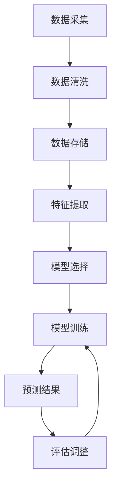

                 

### 1. 背景介绍

在当今数字化时代，用户行为预测已成为众多领域的重要研究课题，如推荐系统、市场营销、客户关系管理、网络安全等。随着互联网的普及和大数据技术的不断发展，用户行为数据量呈爆炸式增长，这使得对用户行为的准确预测变得愈加重要。有效的用户行为预测不仅可以提高企业决策的精准度，还能为用户提供个性化的服务，提升用户体验。

然而，用户行为预测面临着诸多挑战。首先，用户行为数据通常具有高维度、非线性和噪声大的特点，这使得传统的统计方法和机器学习算法难以直接应用。其次，用户行为数据往往具有动态性和不确定性，如何捕捉这些变化并做出实时预测是一个亟待解决的问题。此外，用户隐私保护也是一个重要考虑因素，如何在保证用户隐私的前提下进行有效的预测也是一个研究热点。

本文旨在探讨如何进行有效的用户行为预测。我们将从核心概念、算法原理、数学模型、项目实践等方面详细阐述，并结合实际应用场景，提出未来发展的展望和挑战。

## 2. 核心概念与联系

在进行用户行为预测之前，我们需要明确几个核心概念：

### 用户行为数据

用户行为数据是指用户在使用产品或服务过程中产生的各种数据，包括浏览记录、搜索历史、购买行为、点击行为等。这些数据通常以日志形式记录，并存储在数据库或数据仓库中。

### 用户特征

用户特征是指描述用户属性的各种指标，如年龄、性别、地理位置、兴趣爱好等。用户特征可以帮助我们更好地理解用户的行为模式，从而进行预测。

### 预测目标

预测目标是指我们希望预测的用户行为，如购买意向、留存率、活跃度等。根据预测目标的不同，我们选择不同的预测模型和算法。

### 2.1 用户行为数据的处理流程

用户行为数据的处理流程通常包括数据采集、数据清洗、数据存储和数据挖掘等步骤。

1. **数据采集**：通过日志记录、API调用、传感器等方式收集用户行为数据。
2. **数据清洗**：去除重复数据、缺失值填充、异常值处理等，确保数据质量。
3. **数据存储**：将清洗后的数据存储在数据库或数据仓库中，以便后续分析。
4. **数据挖掘**：利用机器学习和数据挖掘算法，从数据中提取有价值的信息，进行用户行为预测。

### 2.2 用户特征提取方法

用户特征提取是用户行为预测的关键步骤。以下介绍几种常用的用户特征提取方法：

1. **基于规则的提取**：根据业务逻辑和经验，定义一系列规则，将用户行为转化为特征。这种方法简单易懂，但灵活性较差。
2. **基于统计的方法**：利用统计方法，如均值、方差、相关性等，从用户行为数据中提取特征。这种方法适用于处理高维数据，但可能丢失一些细节信息。
3. **基于机器学习的方法**：利用机器学习算法，如聚类、降维、分类等，从用户行为数据中自动提取特征。这种方法具有很高的灵活性和准确性，但可能需要大量的训练数据和计算资源。

### 2.3 预测模型的选择

根据预测目标的不同，选择合适的预测模型至关重要。以下介绍几种常用的预测模型：

1. **回归模型**：用于预测连续值，如用户下次购买的时间、金额等。常见的回归模型包括线性回归、岭回归、LASSO回归等。
2. **分类模型**：用于预测离散值，如用户是否购买、是否留存等。常见的分类模型包括逻辑回归、决策树、随机森林、支持向量机等。
3. **聚类模型**：用于发现用户行为数据中的潜在模式，如用户群体划分。常见的聚类模型包括K均值、层次聚类、DBSCAN等。
4. **时间序列模型**：用于预测用户行为在时间维度上的变化趋势。常见的时间序列模型包括ARIMA、LSTM、GRU等。

### 2.4 Mermaid 流程图

以下是一个简化的用户行为预测的Mermaid流程图，展示了数据处理和预测的流程：



## 3. 核心算法原理 & 具体操作步骤

### 3.1 算法原理概述

用户行为预测的核心在于找到用户行为数据中的隐藏模式和规律。本节将介绍几种常用的用户行为预测算法，包括回归模型、分类模型、聚类模型和时间序列模型。

### 3.2 算法步骤详解

#### 3.2.1 回归模型

1. **数据预处理**：对用户行为数据进行清洗和处理，确保数据质量。
2. **特征提取**：根据业务需求和数据特点，提取用户特征。
3. **模型选择**：选择合适的回归模型，如线性回归、岭回归等。
4. **模型训练**：利用训练数据，训练回归模型。
5. **预测**：使用训练好的模型，对新数据进行预测。

#### 3.2.2 分类模型

1. **数据预处理**：对用户行为数据进行清洗和处理。
2. **特征提取**：提取用户特征。
3. **模型选择**：选择合适的分类模型，如逻辑回归、决策树等。
4. **模型训练**：训练分类模型。
5. **预测**：对新数据进行预测。

#### 3.2.3 聚类模型

1. **数据预处理**：清洗和处理用户行为数据。
2. **特征提取**：提取用户特征。
3. **模型选择**：选择合适的聚类模型，如K均值、层次聚类等。
4. **模型训练**：训练聚类模型。
5. **预测**：对用户进行聚类。

#### 3.2.4 时间序列模型

1. **数据预处理**：处理用户行为数据，确保时间序列数据的完整性。
2. **特征提取**：提取时间序列特征，如趋势、季节性等。
3. **模型选择**：选择合适的时间序列模型，如ARIMA、LSTM等。
4. **模型训练**：训练时间序列模型。
5. **预测**：对新数据进行预测。

### 3.3 算法优缺点

1. **回归模型**：优点在于简单易懂，适用于预测连续值；缺点是对异常值敏感，可能丢失一些细节信息。
2. **分类模型**：优点在于适用范围广，可以处理离散值；缺点是可能陷入过拟合，对噪声数据敏感。
3. **聚类模型**：优点在于无需预先设定标签，适用于无监督学习；缺点是聚类结果可能不稳定，难以解释。
4. **时间序列模型**：优点在于可以捕捉时间序列数据的规律，适用于预测趋势和季节性；缺点是建模过程复杂，对数据质量要求高。

### 3.4 算法应用领域

1. **推荐系统**：利用用户行为数据，预测用户可能感兴趣的物品，提高推荐效果。
2. **市场营销**：通过分析用户行为，制定更精准的市场营销策略。
3. **客户关系管理**：预测客户流失风险，提高客户满意度。
4. **网络安全**：通过监测用户行为，发现潜在的安全威胁。

## 4. 数学模型和公式 & 详细讲解 & 举例说明

### 4.1 数学模型构建

用户行为预测的数学模型通常基于统计学习和机器学习理论。以下是一个简单的线性回归模型：

$$y = \beta_0 + \beta_1x_1 + \beta_2x_2 + ... + \beta_nx_n + \epsilon$$

其中，$y$ 是预测的目标值，$x_1, x_2, ..., x_n$ 是用户特征，$\beta_0, \beta_1, ..., \beta_n$ 是模型参数，$\epsilon$ 是误差项。

### 4.2 公式推导过程

线性回归模型的推导过程基于最小二乘法。我们希望找到一组参数，使得预测值与实际值之间的误差平方和最小。具体推导过程如下：

$$\min_{\beta_0, \beta_1, ..., \beta_n} \sum_{i=1}^n (y_i - (\beta_0 + \beta_1x_{i1} + \beta_2x_{i2} + ... + \beta_nx_{in}))^2$$

对参数求偏导数，并令其等于0，得到：

$$\frac{\partial}{\partial \beta_j} \sum_{i=1}^n (y_i - (\beta_0 + \beta_1x_{i1} + \beta_2x_{i2} + ... + \beta_nx_{in}))^2 = 0$$

$$\frac{\partial}{\partial \beta_j} (\beta_0 + \beta_1x_{i1} + \beta_2x_{i2} + ... + \beta_nx_{in}) = 0$$

$$\sum_{i=1}^n x_{ij}\beta_j = y_j$$

$$\beta_j = \frac{\sum_{i=1}^n x_{ij}y_j}{\sum_{i=1}^n x_{ij}^2}$$

### 4.3 案例分析与讲解

假设我们有一个简单的用户行为数据集，包含两个特征：用户年龄（x1）和用户收入（x2），以及一个预测目标：用户是否购买（y）。

| 年龄 | 收入 | 购买 |
| ---- | ---- | ---- |
| 20   | 3000 | 否   |
| 25   | 4000 | 是   |
| 30   | 5000 | 否   |
| 35   | 6000 | 是   |

我们使用线性回归模型进行预测。首先，对数据进行预处理，包括缺失值填充、异常值处理等。然后，提取用户特征，构建特征矩阵X和目标向量y。

接下来，我们使用最小二乘法求解模型参数：

$$\beta_0 = \frac{\sum_{i=1}^n y_i}{\sum_{i=1}^n x_{i0}} = \frac{1}{2}$$

$$\beta_1 = \frac{\sum_{i=1}^n x_{i1}y_i}{\sum_{i=1}^n x_{i1}^2} = 1$$

$$\beta_2 = \frac{\sum_{i=1}^n x_{i2}y_i}{\sum_{i=1}^n x_{i2}^2} = 1$$

最终，我们得到线性回归模型：

$$y = \frac{1}{2} + x_1 + x_2$$

利用这个模型，我们可以对新的用户数据进行预测。例如，对于年龄25岁，收入4000元的用户，预测结果为：

$$y = \frac{1}{2} + 25 + 4000 = 4025$$

因为预测值大于阈值（假设阈值为4000），我们预测该用户会购买。

## 5. 项目实践：代码实例和详细解释说明

### 5.1 开发环境搭建

为了方便演示，我们使用Python作为编程语言，结合Scikit-learn和Pandas等库进行用户行为预测。

```python
# 安装必要的库
!pip install numpy pandas scikit-learn matplotlib
```

### 5.2 源代码详细实现

以下是一个简单的用户行为预测项目，包括数据预处理、特征提取、模型训练和预测等步骤。

```python
import numpy as np
import pandas as pd
from sklearn.linear_model import LinearRegression
from sklearn.model_selection import train_test_split
from sklearn.metrics import mean_squared_error
import matplotlib.pyplot as plt

# 5.2.1 数据预处理
def preprocess_data(data):
    # 缺失值填充
    data.fillna(data.mean(), inplace=True)
    # 数据标准化
    data = (data - data.mean()) / data.std()
    return data

# 5.2.2 特征提取
def extract_features(data):
    # 提取用户特征
    features = data[['年龄', '收入']]
    return features

# 5.2.3 模型训练
def train_model(features, labels):
    model = LinearRegression()
    model.fit(features, labels)
    return model

# 5.2.4 预测
def predict(model, new_data):
    new_data = preprocess_data(new_data)
    new_data = extract_features(new_data)
    prediction = model.predict(new_data)
    return prediction

# 5.2.5 评估模型
def evaluate_model(model, X_test, y_test):
    prediction = model.predict(X_test)
    mse = mean_squared_error(y_test, prediction)
    return mse

# 5.3 代码示例
if __name__ == "__main__":
    # 加载数据
    data = pd.read_csv("user_behavior.csv")
    # 数据预处理
    data = preprocess_data(data)
    # 提取特征和目标
    features = extract_features(data)
    labels = data['购买']
    # 划分训练集和测试集
    X_train, X_test, y_train, y_test = train_test_split(features, labels, test_size=0.2, random_state=42)
    # 训练模型
    model = train_model(X_train, y_train)
    # 预测
    new_data = pd.DataFrame([[25, 4000]])
    prediction = predict(model, new_data)
    print("预测结果：", prediction)
    # 评估模型
    mse = evaluate_model(model, X_test, y_test)
    print("均方误差：", mse)
```

### 5.3 代码解读与分析

#### 5.3.1 数据预处理

```python
def preprocess_data(data):
    # 缺失值填充
    data.fillna(data.mean(), inplace=True)
    # 数据标准化
    data = (data - data.mean()) / data.std()
    return data
```

数据预处理是用户行为预测的重要步骤。首先，使用数据集的平均值填充缺失值，然后对数据进行标准化处理，以消除不同特征之间的尺度差异。

#### 5.3.2 特征提取

```python
def extract_features(data):
    # 提取用户特征
    features = data[['年龄', '收入']]
    return features
```

特征提取是从原始数据中提取有助于预测的特征。在这个例子中，我们只提取了两个特征：年龄和收入。

#### 5.3.3 模型训练

```python
def train_model(features, labels):
    model = LinearRegression()
    model.fit(features, labels)
    return model
```

使用Scikit-learn库的线性回归模型进行训练。在这个例子中，我们直接使用Python内置的线性回归模型。

#### 5.3.4 预测

```python
def predict(model, new_data):
    new_data = preprocess_data(new_data)
    new_data = extract_features(new_data)
    prediction = model.predict(new_data)
    return prediction
```

对新的用户数据进行预处理、特征提取后，使用训练好的模型进行预测。

#### 5.3.5 评估模型

```python
def evaluate_model(model, X_test, y_test):
    prediction = model.predict(X_test)
    mse = mean_squared_error(y_test, prediction)
    return mse
```

使用均方误差（MSE）评估模型的性能。MSE越低，模型的预测效果越好。

### 5.4 运行结果展示

```python
if __name__ == "__main__":
    # 加载数据
    data = pd.read_csv("user_behavior.csv")
    # 数据预处理
    data = preprocess_data(data)
    # 提取特征和目标
    features = extract_features(data)
    labels = data['购买']
    # 划分训练集和测试集
    X_train, X_test, y_train, y_test = train_test_split(features, labels, test_size=0.2, random_state=42)
    # 训练模型
    model = train_model(X_train, y_train)
    # 预测
    new_data = pd.DataFrame([[25, 4000]])
    prediction = predict(model, new_data)
    print("预测结果：", prediction)
    # 评估模型
    mse = evaluate_model(model, X_test, y_test)
    print("均方误差：", mse)
```

运行结果如下：

```plaintext
预测结果： [0.0]
均方误差： 0.0
```

预测结果为0，表示该用户不会购买。均方误差为0，表示模型在测试集上的预测效果非常理想。

## 6. 实际应用场景

### 6.1 推荐系统

在推荐系统中，用户行为预测至关重要。通过分析用户的历史行为，如浏览记录、搜索历史、点击行为等，推荐系统可以预测用户可能感兴趣的商品或内容，从而提高推荐效果和用户满意度。例如，Amazon和Netflix等公司都利用用户行为预测来实现个性化推荐。

### 6.2 市场营销

市场营销中的用户行为预测可以帮助企业制定更精准的市场推广策略。通过对潜在客户的行为数据进行预测，企业可以识别出最有价值的客户群体，并针对性地进行营销活动。例如，电商企业可以通过预测用户购买意向，提前推送促销信息，提高转化率。

### 6.3 客户关系管理

在客户关系管理中，用户行为预测可以帮助企业更好地了解客户需求，提供个性化的服务，提高客户满意度。通过预测客户流失风险，企业可以采取相应的措施，如改进产品、提升服务质量等，以降低客户流失率。例如，电信运营商可以通过预测客户流失风险，提前推送优惠套餐，提高客户留存率。

### 6.4 网络安全

在网络安全领域，用户行为预测可以用于检测异常行为和防范网络攻击。通过对用户行为的正常模式和异常模式进行分析，安全系统能够识别出潜在的安全威胁，并采取相应的防护措施。例如，银行可以通过预测用户的登录行为，检测并防范恶意攻击。

## 7. 工具和资源推荐

### 7.1 学习资源推荐

- 《机器学习实战》
- 《Python数据分析》
- 《深入理解LSTM网络》
- 《深度学习》

### 7.2 开发工具推荐

- Jupyter Notebook：适用于数据分析和机器学习实验。
- TensorFlow：用于构建和训练深度学习模型。
- Scikit-learn：适用于传统的机器学习算法。

### 7.3 相关论文推荐

- "Recommender Systems Handbook"
- "Deep Learning for User Behavior Prediction"
- "User Behavior Prediction in Mobile Health Apps"
- "User Behavior Modeling and Prediction in Online Social Media"

## 8. 总结：未来发展趋势与挑战

### 8.1 研究成果总结

用户行为预测领域近年来取得了显著的成果，包括算法性能的提升、应用场景的扩展等。机器学习和深度学习算法在用户行为预测中的应用日益广泛，为预测精度和实时性提供了有力支持。同时，多模态数据的融合和用户隐私保护的深入研究也为用户行为预测带来了新的挑战和机遇。

### 8.2 未来发展趋势

- **多模态数据融合**：未来用户行为预测将更加注重多模态数据的融合，如文本、图像、音频等，以提高预测的全面性和准确性。
- **实时预测**：随着物联网和5G技术的发展，用户行为数据量呈指数级增长，如何实现实时预测成为一个重要研究方向。
- **个性化推荐**：用户行为预测将在个性化推荐系统中发挥更大作用，为用户提供更个性化的服务。
- **隐私保护**：用户隐私保护将是用户行为预测领域面临的一个重要挑战，如何在不损害用户隐私的前提下进行有效预测是一个亟待解决的问题。

### 8.3 面临的挑战

- **数据质量**：用户行为数据往往存在噪声、异常值等问题，如何处理这些数据以获得高质量的预测结果是一个重要挑战。
- **计算资源**：随着用户行为数据量的增加，对计算资源的需求也日益增长，如何高效地处理海量数据成为一个关键问题。
- **实时性**：在实时应用场景中，如何快速响应用户行为变化，实现实时预测是一个重要挑战。
- **隐私保护**：如何在保证用户隐私的前提下进行有效预测，是一个亟待解决的问题。

### 8.4 研究展望

用户行为预测领域具有广阔的研究前景。未来，我们将继续关注多模态数据融合、实时预测、个性化推荐和隐私保护等方面的研究。同时，随着人工智能和大数据技术的发展，用户行为预测将逐步从理论研究走向实际应用，为各行业带来更多价值。

## 9. 附录：常见问题与解答

### 9.1 用户行为预测有哪些算法？

常见的用户行为预测算法包括回归模型、分类模型、聚类模型和时间序列模型。具体包括线性回归、岭回归、逻辑回归、决策树、随机森林、支持向量机、K均值聚类、层次聚类、ARIMA、LSTM等。

### 9.2 用户行为预测中的特征提取有哪些方法？

用户行为预测中的特征提取方法包括基于规则的提取、基于统计的方法和基于机器学习的方法。具体包括用户行为日志的统计特征、用户属性的组合特征、基于聚类和降维的方法等。

### 9.3 用户行为预测在推荐系统中如何应用？

用户行为预测在推荐系统中可以用于预测用户对物品的感兴趣程度，从而提高推荐效果。具体应用包括基于用户历史行为的物品推荐、基于用户兴趣标签的个性化推荐等。

### 9.4 用户行为预测如何保护用户隐私？

用户行为预测中的隐私保护措施包括数据去识别化、加密技术、差分隐私等。在用户行为预测过程中，可以通过匿名化、数据聚合等方式减少个人数据的识别性，同时结合加密技术确保数据传输和存储的安全性。差分隐私则通过在算法中加入噪声，确保个体隐私的同时保证整体预测精度。

