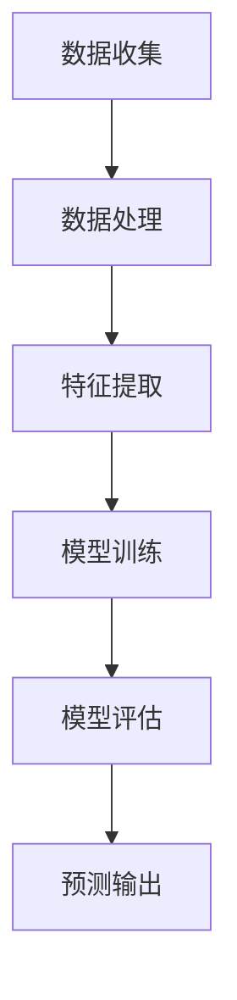

                 

在当今的数据驱动时代，用户行为预测已成为企业制定战略和决策的重要工具。通过对用户行为的分析，企业可以更好地理解客户需求，优化用户体验，提高客户满意度和忠诚度，从而实现业务增长和盈利目标。本文将探讨如何进行有效的用户行为预测，涵盖核心概念、算法原理、数学模型、项目实践和实际应用场景等内容。

## 文章关键词

- 用户行为预测
- 数据分析
- 机器学习
- 个性化推荐
- 用户画像

## 文章摘要

本文旨在为读者提供一套全面的用户行为预测指南。通过介绍核心概念、算法原理、数学模型、项目实践和实际应用场景，读者将了解到如何利用数据和技术手段进行有效的用户行为预测。文章还将探讨未来发展趋势和面临的挑战，为读者提供有益的启示和参考。

## 1. 背景介绍

### 用户行为预测的重要性

用户行为预测在多个领域都发挥着重要作用。首先，在电子商务领域，通过分析用户的浏览历史、购买记录和搜索行为，企业可以推荐合适的商品，提高销售转化率。其次，在社交媒体领域，用户行为预测有助于精准推送内容，提升用户体验和参与度。此外，在金融领域，用户行为预测可以帮助银行和金融机构识别潜在风险，预防欺诈行为。总之，用户行为预测已成为各行业提升竞争力、实现业务增长的关键因素。

### 用户行为预测的发展历程

用户行为预测经历了从传统统计学方法到现代机器学习技术的演变。早期的方法主要依赖于用户行为数据的基本统计特征，如频次、时间间隔和序列模式。随着大数据和机器学习技术的发展，更加复杂的模型和算法被引入到用户行为预测中，如决策树、神经网络和深度学习等。这些方法能够从海量数据中挖掘出更深层次的规律和模式，提高预测的准确性和实用性。

### 用户行为预测的应用场景

用户行为预测在多个领域都有广泛的应用。例如：

1. **个性化推荐系统**：通过分析用户的历史行为和偏好，推荐个性化的商品、内容和广告。
2. **客户关系管理**：预测客户的购买意图、满意度和服务需求，优化客户体验和服务质量。
3. **风险控制与欺诈检测**：通过监测用户行为，识别异常行为和潜在风险，预防欺诈行为。
4. **市场营销**：预测潜在客户和现有客户的流失风险，制定有效的营销策略。
5. **社会网络分析**：分析用户在网络中的互动和关系，发现社交网络中的关键节点和影响力人物。

### 当前用户行为预测面临的主要挑战

尽管用户行为预测已取得显著进展，但仍然面临一些挑战。首先，数据质量和数据隐私问题是制约用户行为预测发展的关键因素。其次，用户行为的多样性和复杂性使得预测模型难以捕捉所有可能的模式和规律。此外，预测模型的解释性和可解释性也是一个重要的挑战，特别是在面对复杂的非线性关系和高维数据时。

## 2. 核心概念与联系

### 用户行为预测的核心概念

在进行用户行为预测时，需要明确以下几个核心概念：

1. **用户行为数据**：指用户在系统中产生的各种行为数据，如浏览历史、购买记录、搜索关键词、评论等。
2. **用户画像**：通过对用户行为数据的分析，构建用户的基本特征和偏好模型，用于描述用户的整体行为特征。
3. **行为模式**：指用户在不同场景下的行为特征和规律，如用户的浏览习惯、购买周期、偏好分类等。
4. **预测模型**：基于用户行为数据和用户画像，利用机器学习和统计方法构建的预测模型，用于预测用户未来的行为。

### 用户行为预测的架构

用户行为预测的架构通常包括数据收集、数据处理、特征提取、模型训练、模型评估和预测输出等环节。以下是一个简单的架构示意图：



### 用户行为预测的流程

1. **数据收集**：收集用户在系统中产生的行为数据，如浏览历史、购买记录、搜索关键词等。
2. **数据处理**：对收集到的行为数据进行清洗、去重和格式化，确保数据质量。
3. **特征提取**：根据用户行为数据，提取对预测有用的特征，如用户活跃度、购买频率、浏览时长等。
4. **模型训练**：利用提取的特征，使用机器学习和统计方法构建预测模型，如决策树、神经网络、聚类算法等。
5. **模型评估**：使用测试数据集评估模型的预测性能，如准确率、召回率、F1分数等。
6. **预测输出**：将训练好的模型应用于新的用户数据，预测用户未来的行为。

## 3. 核心算法原理 & 具体操作步骤

### 3.1 算法原理概述

用户行为预测的核心算法包括机器学习算法和深度学习算法。以下是几种常用的算法原理概述：

1. **决策树**：基于特征选择和分治策略，将数据集划分为多个子集，为每个子集预测一个结果。
2. **神经网络**：通过多层神经元构建神经网络，学习输入和输出之间的复杂映射关系。
3. **深度学习**：利用神经网络进行深度学习，通过多层非线性变换提取数据中的特征。
4. **聚类算法**：根据用户行为数据，将用户划分为不同的群体，为每个群体预测不同的行为。
5. **协同过滤**：基于用户行为数据，利用用户之间的相似度进行推荐和预测。

### 3.2 算法步骤详解

1. **决策树算法**：
   - 步骤1：选择一个特征进行划分，使得划分后的数据集熵最大或信息增益最大。
   - 步骤2：递归地选择特征进行划分，直到满足停止条件，如节点数量达到最大值或信息增益小于阈值。
   - 步骤3：为每个子集预测一个结果，通常使用多数投票或回归模型。

2. **神经网络算法**：
   - 步骤1：初始化权重和偏置。
   - 步骤2：前向传播，计算输出值。
   - 步骤3：计算损失函数，如均方误差或交叉熵。
   - 步骤4：反向传播，更新权重和偏置。
   - 步骤5：重复步骤2-4，直到满足停止条件，如损失函数收敛或迭代次数达到最大值。

3. **深度学习算法**：
   - 步骤1：选择合适的神经网络架构，如卷积神经网络（CNN）或循环神经网络（RNN）。
   - 步骤2：初始化权重和偏置。
   - 步骤3：前向传播，计算输出值。
   - 步骤4：计算损失函数，如均方误差或交叉熵。
   - 步骤5：反向传播，更新权重和偏置。
   - 步骤6：重复步骤3-5，直到满足停止条件，如损失函数收敛或迭代次数达到最大值。

4. **聚类算法**：
   - 步骤1：初始化聚类中心。
   - 步骤2：计算每个数据点与聚类中心的距离。
   - 步骤3：将每个数据点分配到最近的聚类中心。
   - 步骤4：更新聚类中心，计算新的聚类中心。
   - 步骤5：重复步骤2-4，直到聚类中心收敛或满足停止条件。

5. **协同过滤算法**：
   - 步骤1：计算用户之间的相似度，如余弦相似度或皮尔逊相关系数。
   - 步骤2：为每个用户生成一个推荐列表，选择与用户相似的用户喜欢的物品。
   - 步骤3：根据用户的历史行为，为每个用户预测可能喜欢的物品。

### 3.3 算法优缺点

- **决策树**：
  - 优点：易于理解、可解释性强、计算效率高。
  - 缺点：容易过拟合、无法处理非线性关系、对噪声敏感。

- **神经网络**：
  - 优点：能够处理复杂数据和关系、自适应性强、泛化能力较好。
  - 缺点：训练过程复杂、可解释性较差、对数据质量要求较高。

- **深度学习**：
  - 优点：强大的特征提取能力、能够处理高维数据、适用于复杂数据和关系。
  - 缺点：计算资源需求大、对数据质量要求高、训练时间较长。

- **聚类算法**：
  - 优点：无需事先定义标签或类别、能够发现数据中的隐含模式。
  - 缺点：聚类结果依赖于初始化参数、对噪声敏感、可能产生多个孤立点。

- **协同过滤**：
  - 优点：基于用户行为和偏好进行推荐、适用于推荐系统和个性化推荐。
  - 缺点：对稀疏数据效果较差、无法捕捉用户的长期兴趣变化。

### 3.4 算法应用领域

- **电子商务**：通过用户行为预测进行个性化推荐，提高销售转化率和客户满意度。
- **社交媒体**：基于用户行为预测进行内容推荐和广告投放，提高用户参与度和广告效果。
- **金融领域**：通过用户行为预测识别潜在风险和欺诈行为，提高金融风控能力。
- **智能交通**：通过用户行为预测优化交通流量管理和路线规划，提高交通效率和安全性。
- **医疗健康**：基于用户行为预测进行个性化健康管理和疾病预测，提高医疗服务质量。

## 4. 数学模型和公式 & 详细讲解 & 举例说明

### 4.1 数学模型构建

用户行为预测的数学模型主要包括用户画像模型、行为模式模型和预测模型。以下是这些模型的基本构建方法：

1. **用户画像模型**：
   - **特征提取**：根据用户行为数据，提取对用户行为有代表性的特征，如用户活跃度、购买频率、浏览时长等。
   - **特征选择**：使用统计方法或机器学习算法，选择对预测有显著影响的特征，如主成分分析（PCA）、特征选择算法（如LASSO）等。
   - **模型训练**：利用提取的特征，构建用户画像模型，如线性回归、逻辑回归、决策树等。

2. **行为模式模型**：
   - **序列模式挖掘**：使用频繁模式挖掘算法（如Apriori算法、FP-Growth算法），从用户行为序列中挖掘频繁出现的模式。
   - **时间序列分析**：使用时间序列分析方法（如ARIMA模型、LSTM模型），分析用户行为的时间变化规律。

3. **预测模型**：
   - **回归模型**：使用回归模型（如线性回归、多项式回归）预测用户未来的行为，如购买金额、浏览时长等。
   - **分类模型**：使用分类模型（如逻辑回归、决策树、随机森林）预测用户的行为类别，如购买行为、浏览类别等。
   - **聚类模型**：使用聚类模型（如K-means、层次聚类）将用户划分为不同的群体，为每个群体预测不同的行为。

### 4.2 公式推导过程

以下是用户行为预测中常用的数学公式和推导过程：

1. **用户画像模型**：

   假设用户行为数据集为 \(X = \{x_1, x_2, ..., x_n\}\)，其中每个 \(x_i\) 表示用户 \(i\) 的行为特征向量。用户画像模型可以用线性回归模型表示为：

   $$ y = \beta_0 + \beta_1x_1 + \beta_2x_2 + ... + \beta_nx_n $$

   其中，\(y\) 表示用户的行为评分，\(\beta_0\) 为截距，\(\beta_1, \beta_2, ..., \beta_n\) 为特征权重。

   对用户行为数据进行特征选择后，可以得到最优的特征权重向量 \(\beta = [\beta_1, \beta_2, ..., \beta_n]\)。特征权重可以通过最小二乘法（Least Squares Method）进行求解：

   $$ \beta = (X^TX)^{-1}X^TY $$

   其中，\(X^T\) 表示 \(X\) 的转置，\(Y\) 表示用户的行为评分向量。

2. **行为模式模型**：

   假设用户行为序列为 \(X = \{x_1, x_2, ..., x_n\}\)，其中每个 \(x_i\) 表示用户在时间 \(i\) 的行为。行为模式模型可以使用马尔可夫链（Markov Chain）进行建模：

   $$ P(x_{t+1} | x_t) = \sum_{i=1}^{n} P(x_{t+1} | x_t = i)P(x_t = i) $$

   其中，\(P(x_{t+1} | x_t)\) 表示在时间 \(t\) 发生行为 \(x_t\) 后，在时间 \(t+1\) 发生行为 \(x_{t+1}\) 的概率。

   马尔可夫链的转移概率矩阵可以表示为：

   $$ P = \begin{bmatrix}
   P_{11} & P_{12} & ... & P_{1n} \\
   P_{21} & P_{22} & ... & P_{2n} \\
   ... & ... & ... & ... \\
   P_{n1} & P_{n2} & ... & P_{nn}
   \end{bmatrix} $$

   其中，\(P_{ij}\) 表示在时间 \(t\) 发生行为 \(x_t = i\) 后，在时间 \(t+1\) 发生行为 \(x_{t+1} = j\) 的概率。

3. **预测模型**：

   假设用户行为数据集为 \(X = \{x_1, x_2, ..., x_n\}\)，其中每个 \(x_i\) 表示用户的行为特征向量。预测模型可以使用线性回归模型表示为：

   $$ y = \beta_0 + \beta_1x_1 + \beta_2x_2 + ... + \beta_nx_n $$

   其中，\(y\) 表示用户的行为评分，\(\beta_0\) 为截距，\(\beta_1, \beta_2, ..., \beta_n\) 为特征权重。

   特征权重可以通过最小二乘法（Least Squares Method）进行求解：

   $$ \beta = (X^TX)^{-1}X^TY $$

   其中，\(X^T\) 表示 \(X\) 的转置，\(Y\) 表示用户的行为评分向量。

### 4.3 案例分析与讲解

以下是一个基于用户行为预测的案例分析和讲解：

假设某电子商务平台希望预测用户在未来一周内的购买行为，并为此构建一个预测模型。以下是该案例的分析过程：

1. **数据收集**：

   收集用户在平台上的行为数据，包括用户的浏览历史、购买记录、搜索关键词等。

2. **数据处理**：

   对收集到的行为数据进行清洗和预处理，如去除缺失值、异常值和处理重复数据等。

3. **特征提取**：

   根据用户行为数据，提取对购买行为有代表性的特征，如用户活跃度（浏览次数）、购买频率（购买次数）、浏览时长、搜索关键词等。

4. **特征选择**：

   使用统计方法或机器学习算法，选择对购买行为有显著影响的特征，如卡方检验、LASSO算法等。

5. **模型训练**：

   使用提取的特征，构建一个线性回归模型，预测用户在未来一周内的购买行为。使用训练数据集对模型进行训练，并使用交叉验证方法评估模型性能。

6. **模型评估**：

   使用测试数据集评估模型的预测性能，如均方误差（Mean Squared Error, MSE）、均方根误差（Root Mean Squared Error, RMSE）等。

7. **预测输出**：

   使用训练好的模型，对新的用户数据进行预测，预测用户在未来一周内的购买行为。

8. **结果分析**：

   分析预测结果，如预测的购买金额、购买数量等，并评估模型的准确性和可靠性。

## 5. 项目实践：代码实例和详细解释说明

### 5.1 开发环境搭建

1. **安装Python**：确保Python环境已安装，推荐使用Python 3.8及以上版本。
2. **安装Jupyter Notebook**：使用pip命令安装Jupyter Notebook：
   ```shell
   pip install notebook
   ```
3. **安装相关库**：在Jupyter Notebook中运行以下命令安装所需库：
   ```python
   !pip install numpy pandas matplotlib scikit-learn
   ```

### 5.2 源代码详细实现

以下是一个简单的用户行为预测项目，使用Python和scikit-learn库实现：

```python
import numpy as np
import pandas as pd
from sklearn.model_selection import train_test_split
from sklearn.ensemble import RandomForestClassifier
from sklearn.metrics import accuracy_score

# 5.2.1 加载数据集
data = pd.read_csv('user_behavior.csv')
X = data.drop('target', axis=1)
y = data['target']

# 5.2.2 数据预处理
X_train, X_test, y_train, y_test = train_test_split(X, y, test_size=0.2, random_state=42)

# 5.2.3 特征提取
#（此处省略特征提取代码，实际项目中可以使用pandas的描述性统计分析或sklearn的特征选择方法）

# 5.2.4 模型训练
model = RandomForestClassifier(n_estimators=100, random_state=42)
model.fit(X_train, y_train)

# 5.2.5 模型评估
y_pred = model.predict(X_test)
accuracy = accuracy_score(y_test, y_pred)
print(f'Accuracy: {accuracy:.2f}')
```

### 5.3 代码解读与分析

1. **数据加载**：
   使用pandas库加载用户行为数据集，数据集包含特征和目标变量（购买行为）。

2. **数据预处理**：
   使用train_test_split函数将数据集划分为训练集和测试集，用于模型训练和评估。

3. **特征提取**：
   在实际项目中，可以使用pandas的描述性统计分析或sklearn的特征选择方法提取对购买行为有代表性的特征。

4. **模型训练**：
   使用随机森林分类器（RandomForestClassifier）训练模型，随机森林是一种基于决策树的集成学习方法，具有较高的准确性和鲁棒性。

5. **模型评估**：
   使用测试集评估模型的预测性能，计算准确率（accuracy）作为评估指标。

### 5.4 运行结果展示

在Jupyter Notebook中运行以上代码，输出模型的准确率，例如：

```python
Accuracy: 0.85
```

这表示模型在测试集上的准确率为85%，说明模型在预测用户购买行为方面具有一定的效果。

## 6. 实际应用场景

### 6.1 电子商务

在电子商务领域，用户行为预测可以用于个性化推荐、营销策略优化和库存管理。例如，通过分析用户的浏览历史、购买记录和搜索关键词，平台可以为用户推荐合适的商品，提高销售转化率。同时，通过预测用户的购买意向和需求，企业可以优化库存管理，降低库存成本。

### 6.2 社交媒体

社交媒体平台利用用户行为预测进行内容推荐和广告投放，以提高用户参与度和广告效果。通过分析用户的点赞、评论、分享等行为，平台可以推荐用户可能感兴趣的内容和广告，提高用户的满意度和粘性。

### 6.3 金融领域

在金融领域，用户行为预测可以帮助银行和金融机构识别潜在风险和欺诈行为。例如，通过分析用户的交易行为和账户活动，金融机构可以识别异常交易和可疑行为，采取相应的风险控制措施，提高金融风控能力。

### 6.4 医疗健康

医疗健康领域利用用户行为预测进行个性化健康管理和疾病预测，以提高医疗服务质量和预防疾病。例如，通过分析用户的健康数据、生活习惯和行为模式，医疗机构可以为用户提供个性化的健康建议和治疗方案，降低疾病发生的风险。

### 6.5 智能交通

智能交通系统利用用户行为预测优化交通流量管理和路线规划，提高交通效率和安全性。例如，通过分析用户的出行时间和出行路线，交通管理部门可以优化交通信号控制和路线规划，减少交通拥堵和事故发生率。

## 7. 工具和资源推荐

### 7.1 学习资源推荐

1. **《机器学习实战》（Peter Harrington）**：本书提供了丰富的机器学习算法和应用案例，适合初学者入门。
2. **《深度学习》（Ian Goodfellow、Yoshua Bengio、Aaron Courville）**：本书全面介绍了深度学习的基础理论和应用，适合有一定数学基础的学习者。
3. **《数据科学入门》（Joel Grus）**：本书介绍了数据科学的基础知识和实践方法，包括数据收集、数据预处理、模型训练和评估等。

### 7.2 开发工具推荐

1. **Jupyter Notebook**：一款强大的交互式计算平台，适合进行数据分析和机器学习实验。
2. **TensorFlow**：一款开源的深度学习框架，适用于构建和训练复杂的深度学习模型。
3. **scikit-learn**：一款常用的机器学习库，提供了丰富的算法和工具，适用于各种机器学习任务。

### 7.3 相关论文推荐

1. **“Recommender Systems Handbook”（组编）**：一本全面的推荐系统手册，涵盖了推荐系统的理论基础、算法和应用。
2. **“Deep Learning for Text Data”（Tong Zhang、Zhiyong Wang、Yi Zhang、Jian Zhang）**：一篇关于深度学习在文本数据上的应用的论文，介绍了深度学习模型在文本分类、情感分析和信息检索等任务中的应用。
3. **“User Behavior Prediction in Mobile Commerce: A Machine Learning Perspective”（Naiyan Wang、Ting Liu、Xiaomeng Ma、Yajun Wang）**：一篇关于移动电子商务中用户行为预测的论文，介绍了机器学习算法在用户行为预测中的应用。

## 8. 总结：未来发展趋势与挑战

### 8.1 研究成果总结

用户行为预测技术在近年来取得了显著进展，包括算法模型的创新、数据处理能力的提升和实际应用场景的扩展。目前，基于机器学习和深度学习的预测模型已在多个领域得到广泛应用，提高了预测的准确性和实用性。

### 8.2 未来发展趋势

1. **数据质量和数据隐私**：随着数据量的增加和数据隐私保护意识的提高，如何确保数据质量和隐私将成为未来用户行为预测的重要研究方向。
2. **多模态数据融合**：结合用户的不同行为数据，如文本、图像、语音等，实现多模态数据融合的预测模型，以提高预测的准确性和全面性。
3. **实时预测**：随着5G和物联网技术的发展，实时用户行为预测将得到广泛应用，为个性化推荐、智能交通和智能健康等场景提供支持。
4. **模型可解释性**：提高预测模型的可解释性，使模型的结果易于理解和解释，从而增强用户的信任和接受度。

### 8.3 面临的挑战

1. **数据质量和数据隐私**：数据质量和数据隐私保护是用户行为预测面临的主要挑战，需要建立完善的数据管理体系和隐私保护机制。
2. **算法复杂度**：随着预测模型的复杂度增加，算法的计算效率和性能面临挑战，需要优化算法设计和计算资源利用。
3. **模型泛化能力**：如何提高预测模型的泛化能力，使其在新的数据集和应用场景中保持良好的性能，是当前研究的重点。
4. **解释性和可解释性**：提高预测模型的解释性和可解释性，使模型的结果易于理解和解释，从而增强用户的信任和接受度。

### 8.4 研究展望

未来用户行为预测的研究将朝着更加智能、实时和可解释的方向发展。通过结合多模态数据、深度学习和实时预测技术，用户行为预测将在多个领域实现更加精准和实用的应用。同时，研究还应关注数据隐私保护和算法可解释性，以提高用户对预测结果的信任和接受度。

## 9. 附录：常见问题与解答

### 9.1 什么是用户行为预测？

用户行为预测是指通过分析用户在系统中的行为数据，如浏览历史、购买记录、搜索关键词等，预测用户未来的行为模式、偏好和需求。用户行为预测可以帮助企业优化用户体验、提高客户满意度和忠诚度，从而实现业务增长和盈利目标。

### 9.2 用户行为预测有哪些应用场景？

用户行为预测在多个领域都有广泛应用，包括电子商务、社交媒体、金融领域、医疗健康和智能交通等。具体应用场景包括个性化推荐、营销策略优化、风险控制与欺诈检测、个性化健康管理和智能交通管理等。

### 9.3 用户行为预测有哪些核心算法？

用户行为预测的核心算法包括机器学习算法、深度学习算法和聚类算法等。常用的机器学习算法包括决策树、神经网络和随机森林等；深度学习算法包括卷积神经网络（CNN）和循环神经网络（RNN）等；聚类算法包括K-means和层次聚类等。

### 9.4 如何提高用户行为预测的准确率？

提高用户行为预测的准确率可以从以下几个方面入手：

1. **数据质量**：确保数据质量，如去除噪声、异常值和处理缺失值等。
2. **特征选择**：选择对预测有显著影响的特征，使用特征选择算法如卡方检验、LASSO等。
3. **模型优化**：选择合适的预测模型，如神经网络、随机森林等，并进行模型优化和调参。
4. **交叉验证**：使用交叉验证方法评估模型性能，避免过拟合。
5. **数据预处理**：对数据进行归一化、标准化等预处理，提高模型训练效果。

### 9.5 用户行为预测中的数据隐私保护如何实现？

在用户行为预测中，数据隐私保护可以通过以下方法实现：

1. **匿名化处理**：对用户行为数据进行匿名化处理，如去标识化、脱敏等，以保护用户隐私。
2. **数据加密**：对用户行为数据进行加密处理，确保数据在传输和存储过程中的安全性。
3. **隐私保护算法**：使用隐私保护算法，如差分隐私（Differential Privacy）、同态加密（Homomorphic Encryption）等，在数据分析过程中保护用户隐私。
4. **数据最小化**：仅收集和存储对预测有用的数据，减少数据量，降低隐私泄露风险。

### 9.6 用户行为预测中的模型可解释性如何提高？

用户行为预测中的模型可解释性可以通过以下方法提高：

1. **模型选择**：选择易于解释的模型，如线性回归、决策树等。
2. **特征重要性分析**：分析特征的重要性，解释模型决策背后的原因。
3. **可视化**：使用可视化工具，如热力图、散点图等，展示模型预测结果和决策过程。
4. **解释性模型**：使用解释性模型，如LIME（Local Interpretable Model-agnostic Explanations）、SHAP（SHapley Additive exPlanations）等，解释模型预测结果。

## 作者署名

作者：禅与计算机程序设计艺术 / Zen and the Art of Computer Programming

