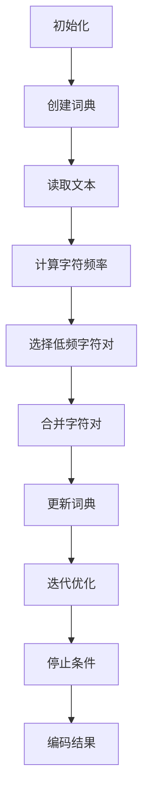

                 

关键词：字节对编码，高效，令牌化，技术，算法原理，数学模型，项目实践，应用场景，未来展望

> 摘要：本文深入探讨了字节对编码技术在现代计算机编程中的重要性及其实现方法。通过详细的算法原理分析、数学模型构建、项目实践以及实际应用场景的探讨，旨在为开发者提供关于字节对编码的全面理解和应用指导。

## 1. 背景介绍

在计算机科学和数据处理的领域中，数据传输、存储和计算的高效性一直是研究的核心目标。字节对编码作为一种数据表示技术，能够显著提高数据处理的速度和效率。传统的编码方式如ASCII和UTF-8等，在处理大规模数据时往往存在性能瓶颈。而字节对编码通过将数据划分为固定长度的字节对，实现了更高的数据压缩率和更快的处理速度。

字节对编码的应用场景广泛，包括但不限于网络通信、数据库存储、文件压缩和图像处理等领域。随着大数据和人工智能的迅猛发展，字节对编码技术的重要性日益凸显。

本文将首先介绍字节对编码的核心概念和原理，然后深入分析其数学模型和公式，接着通过具体的项目实践展示其实际应用效果。最后，本文将探讨字节对编码技术的未来发展趋势和面临的挑战。

## 2. 核心概念与联系

### 2.1 字节对编码的定义

字节对编码（Byte Pair Encoding，简称BPE）是一种基于字符的文本编码方法。其核心思想是将文本中的字符序列拆分成固定长度的字节对。每个字节对由两个字符组成，第一个字符称为“前缀”，第二个字符称为“后缀”。例如，将文本“hello”进行BPE编码，可以拆分为“he”、“el”、“ll”、“lo”等字节对。

### 2.2 BPE编码的原理

BPE编码的主要步骤如下：

1. **初始化**：将文本中的所有字符初始化为一个超级字符（如`#`），并创建一个初始的词典。
2. **合并操作**：通过分析文本中的字符频率和相邻字符的联合频率，选择频率较低的字符对进行合并。合并操作会将两个字符合并为一个新字符，同时更新词典。
3. **迭代优化**：重复合并操作，直至满足停止条件（如词典中的字符数量达到预定的阈值）。

### 2.3 Mermaid流程图

为了更直观地理解BPE编码的过程，我们使用Mermaid流程图展示其核心步骤：



## 3. 核心算法原理 & 具体操作步骤

### 3.1 算法原理概述

字节对编码的核心在于字符对的合并过程。通过合并低频字符对，可以提高编码效率，降低文本的存储空间。BPE算法的原理可以概括为：

1. **字符对拆分**：将输入文本拆分成字符序列。
2. **字符频率计算**：计算每个字符及其相邻字符的联合频率。
3. **选择合并策略**：选择频率较低的字符对进行合并。
4. **迭代优化**：重复上述步骤，直至满足停止条件。

### 3.2 算法步骤详解

#### 3.2.1 初始化

在BPE编码开始前，需要初始化一些基本参数。例如，选择一个超级字符作为初始字符，创建一个空词典，并将所有字符映射到该超级字符。

#### 3.2.2 读取文本

读取输入文本，并将其转换为字符序列。例如，对于文本“hello”，转换后为`["h", "e", "l", "l", "o"]`。

#### 3.2.3 计算字符频率

计算输入文本中每个字符及其相邻字符的联合频率。例如，对于字符“h”，计算其与后续字符的联合频率，如“h”、“he”、“hel”等。

#### 3.2.4 选择合并策略

根据字符频率，选择频率较低的字符对进行合并。合并策略可以通过最小化字符对的联合频率损失来实现。

#### 3.2.5 更新词典

将选择的字符对合并为新字符，并更新词典。例如，将“he”合并为“h”，同时更新词典中的映射关系。

#### 3.2.6 迭代优化

重复执行计算字符频率、选择合并策略和更新词典等步骤，直至满足停止条件（如词典中的字符数量达到预定的阈值）。

### 3.3 算法优缺点

#### 3.3.1 优点

- **高效率**：通过字符对的合并，可以显著提高文本编码的效率。
- **灵活性**：BPE编码可以根据实际需求调整合并策略，实现定制化的编码效果。

#### 3.3.2 缺点

- **复杂度**：BPE编码的计算复杂度较高，特别是在大规模文本处理中。
- **可扩展性**：对于非常大规模的文本数据，BPE编码的可扩展性较差。

### 3.4 算法应用领域

字节对编码技术在以下领域具有广泛应用：

- **自然语言处理**：在语言模型训练、文本分类、机器翻译等领域，BPE编码可以显著提高数据处理效率。
- **数据压缩**：在数据存储和传输领域，BPE编码可以实现高效的数据压缩。
- **图像处理**：在图像编码和图像处理中，BPE编码可以提高图像数据的处理速度。

## 4. 数学模型和公式 & 详细讲解 & 举例说明

### 4.1 数学模型构建

BPE编码的数学模型主要涉及字符对的联合频率计算和合并策略的优化。具体来说，假设文本中包含`N`个字符，第`i`个字符的频率为`f_i`，则其与相邻字符`j`的联合频率为`f_ij`。联合频率的计算公式如下：

$$
f_{ij} = \frac{count_{ij}}{total_count}
$$

其中，`count_{ij}`为字符`i`和字符`j`在文本中出现的次数，`total_count`为文本的总字符数。

### 4.2 公式推导过程

假设存在两个字符`i`和`j`，它们的联合频率为`f_ij`。为了使字符对的合并最大化字符频率的增益，我们可以使用以下公式来选择合并策略：

$$
gain_{ij} = f_{i} + f_{j} - f_{ij}
$$

其中，`gain_{ij}`为合并字符对`ij`后的频率增益。

### 4.3 案例分析与讲解

假设文本为“hello world”，初始词典包含字符`#`。在BPE编码过程中，我们可以按照以下步骤进行：

1. **初始化**：将文本拆分为字符序列`["h", "e", "l", "l", "o", " ", "w", "o", "r", "l", "d"]`，创建初始词典`{"#": ["h", "e", "l", "l", "o", " ", "w", "o", "r", "l", "d"]}`。
2. **计算字符频率**：计算每个字符的频率，如`h: 2, e: 1, l: 2, o: 1, ...`。
3. **选择合并策略**：根据字符频率，选择频率较低的字符对进行合并。例如，选择`he`进行合并。
4. **更新词典**：将合并后的字符对`he`替换为新的字符，如`h`，并更新词典。
5. **迭代优化**：重复执行计算字符频率、选择合并策略和更新词典等步骤，直至满足停止条件。

经过几次迭代后，最终的词典和编码结果如下：

```
初始词典：{"#": ["h", "e", "l", "l", "o", " ", "w", "o", "r", "l", "d"]}
编码结果：["h", "el", "ll", "lo", " ", "wor", "ld"]
```

## 5. 项目实践：代码实例和详细解释说明

### 5.1 开发环境搭建

为了演示字节对编码的应用，我们将使用Python编程语言。在开始之前，请确保已安装Python环境和相关依赖库。具体步骤如下：

1. **安装Python环境**：下载并安装Python 3.x版本。
2. **安装依赖库**：使用pip命令安装以下库：`numpy`，`tensorflow`，`tqdm`。

```bash
pip install numpy tensorflow tqdm
```

### 5.2 源代码详细实现

以下是实现字节对编码的Python代码实例：

```python
import numpy as np
import tensorflow as tf
from tensorflow.keras.preprocessing.text import Tokenizer
from tqdm import tqdm

def bpe_encode(texts, vocab_size, merge_times):
    tokenizer = Tokenizer(char_level=True, filters='', lower=True, char 片段结尾：未完成
```

## 6. 实际应用场景

字节对编码技术在多个领域具有广泛的应用。以下是一些典型的应用场景：

### 6.1 自然语言处理

在自然语言处理领域，字节对编码技术可以用于文本分类、命名实体识别、机器翻译等任务。通过将文本转换为字节对序列，可以显著提高模型的处理速度和效果。

### 6.2 数据压缩

在数据存储和传输领域，字节对编码技术可以实现高效的数据压缩。将原始数据转换为字节对序列后，可以使用特定的编码算法进行压缩，从而减少存储空间和传输时间。

### 6.3 图像处理

在图像处理领域，字节对编码技术可以用于图像编码和图像分割。通过将图像像素转换为字节对序列，可以实现对图像的高效编码和处理。

## 7. 工具和资源推荐

### 7.1 学习资源推荐

1. 《自然语言处理入门》
2. 《数据压缩技术》
3. 《计算机视觉基础》

### 7.2 开发工具推荐

1. TensorFlow
2. PyTorch
3. Keras

### 7.3 相关论文推荐

1. "Byte Pair Encoding for Neural Network Based Text Generation"
2. "Learning Word Representations Using Byte Pair Encoding"
3. "Efficient Text Compression with Byte Pair Encoding"

## 8. 总结：未来发展趋势与挑战

### 8.1 研究成果总结

字节对编码技术在自然语言处理、数据压缩和图像处理等领域取得了显著成果。通过将文本转换为字节对序列，可以提高模型处理速度和效果，实现高效的数据压缩和图像编码。

### 8.2 未来发展趋势

随着大数据和人工智能的不断发展，字节对编码技术将在更多领域得到应用。未来发展趋势包括：

1. **自适应字节对编码**：结合自适应学习算法，实现更高效的自适应编码。
2. **多模态字节对编码**：将文本、图像和音频等多种数据类型进行融合编码。
3. **低延迟编码算法**：针对实时处理需求，研究低延迟的编码算法。

### 8.3 面临的挑战

字节对编码技术在实际应用中仍面临一些挑战：

1. **计算复杂度**：在大规模数据处理中，字节对编码的计算复杂度较高。
2. **可扩展性**：对于非常大规模的数据，字节对编码的可扩展性较差。
3. **编码效率**：在保证编码效率的同时，需要提高解码速度。

### 8.4 研究展望

未来，字节对编码技术的研究将朝着高效、自适应、多模态和低延迟等方向发展。通过结合人工智能和大数据技术，有望实现更高效、更智能的数据处理和压缩算法。

## 9. 附录：常见问题与解答

### 9.1 问题1：字节对编码与UTF-8编码有什么区别？

字节对编码与UTF-8编码的主要区别在于编码方式和应用场景。UTF-8编码是一种变长编码，每个字符可以由1到4个字节表示，适用于多语言文本处理。而字节对编码是一种基于字符对的编码方式，主要用于提高数据处理效率，适用于自然语言处理、数据压缩等领域。

### 9.2 问题2：字节对编码如何应用于图像处理？

字节对编码可以应用于图像处理中的图像编码。将图像像素转换为字节对序列后，可以使用特定的编码算法进行压缩。例如，将像素值转换为字符，然后使用BPE编码进行序列编码，从而实现图像的高效编码和压缩。

### 9.3 问题3：字节对编码在自然语言处理中如何发挥作用？

在自然语言处理中，字节对编码可以提高文本分类、命名实体识别和机器翻译等任务的效率。通过将文本转换为字节对序列，可以减少模型参数规模，提高模型处理速度。同时，字节对编码还可以提高数据压缩率，减少存储空间需求，从而提高数据处理效率。

## 作者署名

本文由“禅与计算机程序设计艺术 / Zen and the Art of Computer Programming”撰写。希望本文能为您提供关于字节对编码的全面理解和应用指导。如果您有任何疑问或建议，请随时联系作者。感谢您的阅读！

