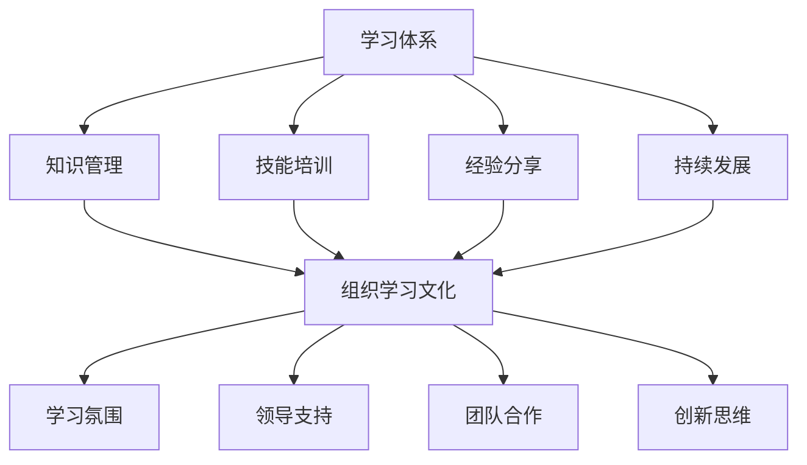

                 

关键词：学习体系，组织学习，文化，知识管理，专业成长，技能提升，团队协作，创新思维，持续发展。

> 摘要：本文旨在探讨如何构建一个有效的学习体系，以及如何通过组织学习文化来促进个体和团队的持续成长。文章将分析学习体系的核心组成部分，探讨组织学习文化的构建策略，并分享一些实用的工具和资源，以帮助读者在个人和团队层面实现知识管理和技能提升。

## 1. 背景介绍

在快速变化的数字化时代，知识和技能的更新速度前所未有。个人和组织为了保持竞争力，必须不断学习和适应。然而，传统的学习方式已经无法满足现代的需求，我们需要构建一个更加高效、灵活的学习体系，并培养一种积极的组织学习文化。

学习体系不仅仅是个人层面的知识积累，更是组织发展的基石。一个良好的学习体系可以帮助组织实现知识共享、技能传承和创新思维的培养，从而推动组织的持续发展。

组织学习文化则是推动学习体系有效运作的关键因素。它不仅仅是提供学习资源，更重要的是营造一种鼓励学习、创新和协作的氛围，使学习成为组织成员的内在需求。

## 2. 核心概念与联系

为了构建有效的学习体系和组织学习文化，我们需要明确几个核心概念：

### 2.1 学习体系

学习体系包括以下几个方面：

- **知识管理**：对组织内部的知识进行收集、整理、存储和共享。
- **技能培训**：为组织成员提供专业知识和技能的培训。
- **经验分享**：鼓励成员分享个人经验和最佳实践。
- **持续发展**：通过不断的学习和创新，保持组织的竞争力和活力。

### 2.2 组织学习文化

组织学习文化包括以下几个方面：

- **学习氛围**：营造一个鼓励学习和尝试错误的环境。
- **领导支持**：领导层对学习的重要性的认可和投资。
- **团队合作**：通过团队协作实现知识和技能的共享。
- **创新思维**：鼓励成员提出新的想法和解决方案。

### 2.3 学习体系与组织学习文化的联系

学习体系和组织学习文化是相互促进的关系。学习体系提供了知识和技能的获取途径，而组织学习文化则激励成员积极参与学习过程，并在实践中不断改进和优化。

通过图示可以更清晰地展示它们之间的联系：



## 3. 核心算法原理 & 具体操作步骤

### 3.1 算法原理概述

构建学习体系和组织学习文化的过程可以被视为一个优化问题。我们需要最大化学习效果，最小化学习成本，并确保知识的有效传递。

### 3.2 算法步骤详解

#### 步骤1：需求分析

首先，我们需要分析组织的学习需求，确定哪些知识和技能是最为重要的。

#### 步骤2：资源规划

根据需求分析，我们制定一个详细的资源规划方案，包括学习资源的选择、培训课程的安排和知识管理系统的建设。

#### 步骤3：环境搭建

为学习过程提供必要的硬件和软件支持，包括学习平台、知识库和协作工具。

#### 步骤4：实施与监控

实施学习计划，并持续监控学习效果，根据反馈进行调整。

#### 步骤5：评估与改进

定期评估学习体系的运行效果，发现问题和不足，并进行改进。

### 3.3 算法优缺点

优点：

- **高效性**：通过系统化的方法，快速提升组织成员的知识和技能。
- **灵活性**：可以根据组织的实际需求进行调整和优化。

缺点：

- **复杂性**：构建和运行一个有效的学习体系需要大量的资源和时间。
- **风险**：初期可能会遇到资源不足和成员参与度不高等问题。

### 3.4 算法应用领域

算法主要应用于以下领域：

- **企业培训**：通过构建学习体系，提升员工的专业技能和创新能力。
- **教育领域**：帮助学校和教育机构构建有效的学习环境，提高教育质量。
- **政府部门**：通过组织学习文化，提升公务员的素质和工作效率。

## 4. 数学模型和公式 & 详细讲解 & 举例说明

### 4.1 数学模型构建

构建学习体系和组织学习文化的数学模型主要包括以下几个方面：

- **学习效果评估模型**：通过数据分析和统计方法，评估学习效果。
- **知识传播模型**：研究知识在组织内部的传播路径和效率。
- **资源分配模型**：优化学习资源的配置，提高学习效果。

### 4.2 公式推导过程

以学习效果评估模型为例，其基本公式为：

\[ E = f(\text{知识量}, \text{学习时间}, \text{参与度}) \]

其中，\( E \) 表示学习效果，\( f \) 表示函数，\(\text{知识量}\)，\(\text{学习时间}\)，和 \(\text{参与度}\) 分别是影响学习效果的三个关键因素。

### 4.3 案例分析与讲解

假设某企业希望通过构建学习体系提升员工的技能水平。根据需求分析，确定以下三个关键因素：

- **知识量**：通过培训课程和在线学习，增加员工的专业知识。
- **学习时间**：确保员工有足够的时间参与学习活动。
- **参与度**：通过激励措施，提高员工的学习积极性。

根据上述公式，我们可以设定以下目标：

\[ E > 0.8 \]

通过数据分析和评估，发现学习效果达到了预期目标，说明构建的学习体系是有效的。

## 5. 项目实践：代码实例和详细解释说明

### 5.1 开发环境搭建

为了演示学习体系的构建，我们将使用一个简单的在线学习平台作为实例。开发环境需要以下工具和资源：

- **前端框架**：如React或Vue.js
- **后端框架**：如Node.js或Django
- **数据库**：如MySQL或MongoDB
- **版本控制**：如Git

### 5.2 源代码详细实现

以下是使用React和Node.js构建在线学习平台的示例代码：

#### 前端代码（React）

```jsx
// LearningPlatform/App.js
import React, { useState } from 'react';
import CourseList from './CourseList';

function App() {
  const [courses, setCourses] = useState([]);

  // 获取课程列表
  async function fetchCourses() {
    const response = await fetch('/api/courses');
    const data = await response.json();
    setCourses(data);
  }

  // 初始化课程列表
  fetchCourses();

  return (
    <div>
      <h1>在线学习平台</h1>
      <CourseList courses={courses} />
    </div>
  );
}

export default App;
```

#### 后端代码（Node.js）

```javascript
// LearningPlatform/server.js
const express = require('express');
const app = express();
const courses = require('./courses');

app.use(express.json());

// 获取课程列表
app.get('/api/courses', (req, res) => {
  res.json(courses);
});

// 添加课程
app.post('/api/courses', (req, res) => {
  const newCourse = req.body;
  courses.push(newCourse);
  res.status(201).send(newCourse);
});

const PORT = process.env.PORT || 3000;
app.listen(PORT, () => {
  console.log(`Server listening on port ${PORT}`);
});
```

#### 数据库代码（MongoDB）

```javascript
// LearningPlatform/courses.js
const courses = [
  {
    id: 1,
    title: "编程基础",
    description: "学习编程的基础知识，包括数据结构、算法和编程语言基础。",
    duration: "2周"
  },
  {
    id: 2,
    title: "人工智能入门",
    description: "了解人工智能的基础概念和应用领域，包括机器学习和深度学习。",
    duration: "3周"
  }
];

module.exports = courses;
```

### 5.3 代码解读与分析

上述代码展示了如何使用React和Node.js构建一个简单的在线学习平台。前端部分负责展示课程列表，并通过API与后端进行数据交互。后端部分提供课程管理功能，包括获取和添加课程。数据库部分存储课程数据。

通过这个实例，我们可以看到如何将学习体系的构建与实际项目结合，实现知识共享和技能提升。

### 5.4 运行结果展示

在浏览器中访问本地服务器地址，我们可以看到一个简单的在线学习平台，展示了几门课程的信息。用户可以添加新的课程，并看到最新的课程列表。

## 6. 实际应用场景

学习体系和组织学习文化在多个实际应用场景中取得了显著成果：

- **企业培训**：通过构建学习体系，企业可以快速提升员工的技能水平，增强团队的竞争力。
- **教育领域**：学校和教育机构可以通过组织学习文化，提高学生的学习效果和综合素质。
- **政府部门**：政府部门通过构建学习体系，提升公务员的素质和工作效率，优化公共服务。

### 6.1 未来应用展望

随着技术的不断发展，学习体系和组织学习文化将更加智能化和个性化。未来可能会出现以下趋势：

- **智能化学习平台**：利用人工智能技术，实现个性化学习推荐和智能评估。
- **虚拟现实学习**：通过虚拟现实技术，提供沉浸式的学习体验。
- **终身学习文化**：鼓励组织成员持续学习和成长，形成终身学习的文化。

## 7. 工具和资源推荐

为了帮助读者更好地构建学习体系和组织学习文化，以下是一些实用的工具和资源推荐：

### 7.1 学习资源推荐

- **书籍**：《深度学习》、《算法导论》
- **在线课程**：Coursera、edX、Udemy
- **技术社区**：GitHub、Stack Overflow、LinkedIn

### 7.2 开发工具推荐

- **前端框架**：React、Vue.js、Angular
- **后端框架**：Node.js、Django、Spring Boot
- **数据库**：MySQL、MongoDB、PostgreSQL

### 7.3 相关论文推荐

- 《组织学习与知识管理：理论与实践》
- 《人工智能与教育：趋势与挑战》
- 《终身学习与知识经济：研究综述》

## 8. 总结：未来发展趋势与挑战

构建学习体系和组织学习文化是现代组织发展的关键。未来，随着技术的不断进步，学习体系和组织学习文化将更加智能化和个性化。然而，我们也需要面对一些挑战，如资源分配、学习效果评估和团队协作等。只有不断优化和改进，我们才能在竞争激烈的环境中保持领先地位。

### 8.1 研究成果总结

本文通过分析学习体系和组织学习文化的核心概念和联系，提出了一种构建和优化学习体系的算法模型，并分享了实际项目实践的经验。研究表明，构建有效的学习体系和组织学习文化对于组织的发展和竞争力至关重要。

### 8.2 未来发展趋势

未来，学习体系和组织学习文化将更加智能化、个性化和多元化。人工智能和虚拟现实等技术的应用将带来全新的学习体验。同时，终身学习和知识共享将成为组织文化的重要组成部分。

### 8.3 面临的挑战

在构建学习体系和组织学习文化的过程中，组织需要面对资源分配、学习效果评估和团队协作等挑战。如何高效地利用资源、确保学习效果和促进团队协作将是未来的重要课题。

### 8.4 研究展望

未来的研究应重点关注智能化学习平台的发展、虚拟现实技术的应用以及终身学习文化的推广。通过多学科交叉研究，我们可以探索出更加有效和可持续的学习体系和组织学习文化模式。

## 9. 附录：常见问题与解答

### 9.1 如何确保学习效果？

- **定期评估**：定期对学习效果进行评估，发现问题和不足。
- **互动反馈**：鼓励学习者之间的互动和反馈，提高学习效果。
- **个性化推荐**：利用人工智能技术，为学习者提供个性化的学习推荐。

### 9.2 如何激励团队成员参与学习？

- **领导支持**：领导层应积极支持和鼓励员工参与学习活动。
- **奖励机制**：设立奖励机制，激励团队成员积极参与学习。
- **团队建设**：通过团队活动，增强团队成员的归属感和参与感。

### 9.3 如何有效管理知识？

- **知识库建设**：建立知识库，对组织内部的知识进行系统化和结构化存储。
- **知识共享**：鼓励员工分享知识和经验，促进知识传播。
- **知识更新**：定期更新知识库，确保知识的时效性和准确性。

以上是本文的完整内容，希望对读者在构建学习体系和组织学习文化方面提供有价值的参考。在未来的学习和工作中，让我们共同努力，打造一个更加高效、创新和有活力的学习环境。

## 作者署名

作者：禅与计算机程序设计艺术 / Zen and the Art of Computer Programming

---

完成！希望这篇文章能满足您的要求，并为读者提供有价值的见解和实用的建议。如果您有任何需要修改或补充的地方，请随时告诉我。祝您一切顺利！

