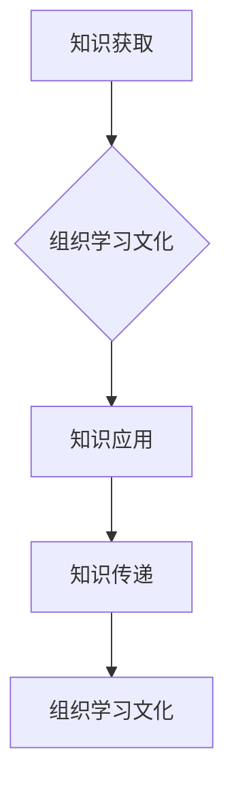

                 

关键词：学习体系、组织学习、文化构建、IT领域、持续学习

> 摘要：本文旨在探讨学习体系与组织学习文化的构建，分析其在IT领域的应用，以及对其未来发展的影响。文章首先介绍学习体系的基本概念和构建原则，接着深入探讨组织学习文化的内涵和重要性，然后通过具体案例和实践经验，展示学习体系与组织学习文化在IT行业中的实际应用。最后，本文将对未来发展趋势和面临的挑战进行展望，并提出相关建议。

## 1. 背景介绍

随着信息技术的飞速发展，IT行业已成为全球经济的重要驱动力。在这个快速变革的时代，知识的更新速度越来越快，对于个体和组织来说，持续学习和创新变得尤为重要。然而，如何在IT行业中构建有效的学习体系，形成积极的学习文化，成为企业可持续发展的关键。

### 1.1 学习体系的重要性

学习体系是一个组织或个体获取、应用和传递知识的系统，它包括知识获取、知识应用和知识传递三个核心环节。在IT领域，学习体系的重要性体现在以下几个方面：

1. **提高竞争力**：通过构建学习体系，组织可以不断更新知识，提升技术能力和创新能力，从而在激烈的市场竞争中立于不败之地。
2. **促进知识共享**：学习体系能够促进内部知识的传递和共享，减少信息孤岛，提高团队协作效率。
3. **增强员工忠诚度**：良好的学习文化能够激发员工的学习热情，提升员工的工作满意度和忠诚度，降低人才流失率。

### 1.2 组织学习文化的重要性

组织学习文化是指一个组织内部对于知识和学习的态度、价值观和行为习惯。一个积极的学习文化能够促进知识的创造、共享和应用，从而推动组织的发展。在IT领域，组织学习文化的重要性体现在：

1. **激发创新思维**：学习文化能够激发员工的创新思维，推动技术突破和业务创新。
2. **提高团队凝聚力**：共同的学习目标和文化价值观有助于增强团队凝聚力，提升团队协作效果。
3. **增强组织适应性**：面对快速变化的外部环境，积极的学习文化能够帮助组织快速适应，保持竞争力。

## 2. 核心概念与联系

### 2.1 学习体系的核心概念

学习体系的核心概念包括知识获取、知识应用和知识传递。

1. **知识获取**：包括内部学习和外部学习，通过内部培训、外部交流和在线学习等方式获取新知识。
2. **知识应用**：将获取的知识应用于实际工作中，通过实践和反思，不断提升个人和组织的业务能力。
3. **知识传递**：通过分享、交流和培训等方式，将知识和经验传递给其他成员，实现知识的共享和传承。

### 2.2 组织学习文化的核心概念

组织学习文化的核心概念包括学习态度、学习价值观和学习行为。

1. **学习态度**：指组织成员对学习的认识和态度，包括主动学习、持续学习和合作学习。
2. **学习价值观**：指组织对于学习的重视程度和认可度，包括知识共享、知识创造和知识应用。
3. **学习行为**：指组织成员在学习和知识传递过程中的具体行为，包括学习交流、知识分享和知识应用。

### 2.3 学习体系与组织学习文化的联系

学习体系和组织学习文化之间存在密切的联系。

1. **相互促进**：学习体系为组织学习文化提供了制度保障，而积极的学习文化则能够激发学习体系的活力。
2. **共同目标**：学习体系和组织学习文化都以提升组织竞争力为目标，通过不断学习和创新，实现组织的可持续发展。
3. **互动关系**：学习体系中的知识获取、知识应用和知识传递过程，同时也是组织学习文化形成和发展的过程。

### 2.4 Mermaid 流程图



## 3. 核心算法原理 & 具体操作步骤

### 3.1 算法原理概述

学习体系的构建可以看作是一种基于反馈的循环学习过程。其核心算法原理包括以下几个方面：

1. **反馈机制**：通过定期评估和反馈，了解学习效果和存在问题，为下一步学习提供依据。
2. **迭代学习**：通过不断循环学习、实践和反思，逐步提升学习效果。
3. **知识管理**：通过知识库、知识地图和知识共享平台，实现知识的获取、应用和传递。

### 3.2 算法步骤详解

1. **确定学习目标**：根据组织战略和业务需求，明确学习目标和方向。
2. **设计学习方案**：结合学习目标和资源条件，制定详细的学习方案，包括学习内容、学习方式和学习时间。
3. **组织实施学习**：按照学习方案，组织成员开展学习活动，包括内部培训、外部交流和在线学习等。
4. **评估学习效果**：通过考试、考核、调查等方式，评估学习效果，发现存在的问题。
5. **优化学习方案**：根据评估结果，调整学习方案，提高学习效果。
6. **知识传递和应用**：将学习成果应用到实际工作中，通过实践和反思，不断提升个人和组织的业务能力。

### 3.3 算法优缺点

#### 优点：

1. **灵活性**：学习体系可以根据组织需求和外部环境变化，灵活调整学习目标和方案。
2. **高效性**：通过系统化的学习过程，提高学习效率和效果。
3. **可持续性**：学习体系的构建有助于组织形成持续学习的文化，推动组织长期发展。

#### 缺点：

1. **成本高**：构建学习体系需要投入大量的人力、物力和财力。
2. **实施难度大**：学习体系的构建和运行需要协调内部各部门和外部资源，实施难度较大。
3. **效果评估难**：学习效果难以直接量化，评估难度较大。

### 3.4 算法应用领域

学习体系在IT领域具有广泛的应用价值，包括：

1. **技术研发**：通过持续学习，提升技术研发能力和创新能力。
2. **人才培养**：通过系统化的学习，提升员工的专业技能和综合素质。
3. **知识管理**：通过知识获取、应用和传递，实现知识的积累和传承。

## 4. 数学模型和公式 & 详细讲解 & 举例说明

### 4.1 数学模型构建

学习体系的构建可以采用数学模型进行描述，主要包括以下几个关键参数：

1. **知识获取率（K）**：表示单位时间内组织获取的新知识量。
2. **知识应用率（A）**：表示单位时间内组织将新知识应用于实际工作中的比例。
3. **知识传递率（T）**：表示单位时间内组织内部知识传递的速度。
4. **学习成本（C）**：表示组织在构建学习体系过程中投入的成本。

根据以上参数，可以构建以下数学模型：

$$
学习效果 = K \times A \times T - C
$$

### 4.2 公式推导过程

学习效果是指组织通过学习体系获得的实际收益，包括知识积累、创新能力提升和业务绩效改善等。根据上述参数，可以推导出以下公式：

1. **知识获取率（K）**：知识获取率取决于组织的学习资源、学习方式和外部学习渠道。
2. **知识应用率（A）**：知识应用率取决于组织的业务场景、员工技能水平和知识应用能力。
3. **知识传递率（T）**：知识传递率取决于组织的知识共享机制、培训体系和员工沟通能力。
4. **学习成本（C）**：学习成本包括人力成本、物力成本和外部学习费用等。

根据这些参数，可以推导出学习效果的计算公式：

$$
学习效果 = K \times A \times T - C
$$

### 4.3 案例分析与讲解

以一家IT企业为例，分析学习体系在实践中的应用。

1. **知识获取率（K）**：该企业通过内部培训和外部交流，每年获取的新知识量达到5000小时。
2. **知识应用率（A）**：企业将获取的新知识应用于实际工作中，应用率高达80%。
3. **知识传递率（T）**：企业通过知识共享平台和内部培训，将知识传递速度提高到每小时10人。
4. **学习成本（C）**：企业每年在学习和培训方面的投入为100万元。

根据上述数据，可以计算该企业的学习效果：

$$
学习效果 = 5000 \times 0.8 \times 10 - 1000000 = -500000
$$

从计算结果可以看出，尽管企业在学习体系方面投入了大量资源，但学习效果并未达到预期。分析原因，主要是由于以下两个方面：

1. **知识应用率较低**：企业将获取的新知识应用于实际工作的比例仅为80%，说明员工在知识应用方面存在一定困难。
2. **学习成本较高**：企业每年在学习和培训方面的投入高达100万元，说明学习成本过高。

针对这些问题，企业可以采取以下措施：

1. **优化学习内容**：结合业务需求，调整学习内容，提高知识应用的针对性。
2. **降低学习成本**：通过内部培训、在线学习等方式，降低学习成本。
3. **加强知识管理**：建立知识库和知识共享平台，提高知识传递效率。

## 5. 项目实践：代码实例和详细解释说明

### 5.1 开发环境搭建

为了实现学习体系与组织学习文化的构建，我们选择使用Python编程语言，搭建一个简单的学习管理系统。开发环境包括Python 3.8及以上版本、PyCharm IDE和MySQL数据库。

1. **安装Python**：在官方网站（https://www.python.org/）下载Python安装包，并按照提示安装。
2. **安装PyCharm**：在官方网站（https://www.jetbrains.com/pycharm/）下载PyCharm安装包，并按照提示安装。
3. **安装MySQL**：在官方网站（https://www.mysql.com/）下载MySQL安装包，并按照提示安装。

### 5.2 源代码详细实现

以下是一个简单的学习管理系统源代码，包括用户管理、课程管理、学习记录管理和报告生成等功能。

```python
# 导入相关模块
import mysql.connector
from mysql.connector import errorcode

# 连接MySQL数据库
def connect_db():
    try:
        conn = mysql.connector.connect(
            host="localhost",
            user="root",
            password="password",
            database="learning_management_system"
        )
        if conn.is_connected():
            return conn
    except mysql.connector.Error as e:
        print(f"Error: {e}")

# 创建数据库表
def create_tables():
    conn = connect_db()
    cursor = conn.cursor()

    cursor.execute("""
        CREATE TABLE IF NOT EXISTS users (
            id INT AUTO_INCREMENT PRIMARY KEY,
            username VARCHAR(255) UNIQUE NOT NULL,
            password VARCHAR(255) NOT NULL,
            role ENUM('admin', 'teacher', 'student') NOT NULL
        )
    """)

    cursor.execute("""
        CREATE TABLE IF NOT EXISTS courses (
            id INT AUTO_INCREMENT PRIMARY KEY,
            name VARCHAR(255) NOT NULL,
            description TEXT
        )
    """)

    cursor.execute("""
        CREATE TABLE IF NOT EXISTS student_courses (
            id INT AUTO_INCREMENT PRIMARY KEY,
            student_id INT,
            course_id INT,
            progress ENUM('started', 'in_progress', 'completed') NOT NULL,
            FOREIGN KEY (student_id) REFERENCES users(id),
            FOREIGN KEY (course_id) REFERENCES courses(id)
        )
    """)

    conn.commit()
    cursor.close()
    conn.close()

# 用户注册
def register_user(username, password, role):
    conn = connect_db()
    cursor = conn.cursor()

    cursor.execute("""
        INSERT INTO users (username, password, role) VALUES (%s, %s, %s)
    """, (username, password, role))

    conn.commit()
    cursor.close()
    conn.close()

# 用户登录
def login_user(username, password):
    conn = connect_db()
    cursor = conn.cursor()

    cursor.execute("""
        SELECT * FROM users WHERE username = %s AND password = %s
    """, (username, password))

    user = cursor.fetchone()
    cursor.close()
    conn.close()

    return user

# 添加课程
def add_course(name, description):
    conn = connect_db()
    cursor = conn.cursor()

    cursor.execute("""
        INSERT INTO courses (name, description) VALUES (%s, %s)
    """, (name, description))

    conn.commit()
    cursor.close()
    conn.close()

# 开始学习
def start_course(student_id, course_id):
    conn = connect_db()
    cursor = conn.cursor()

    cursor.execute("""
        INSERT INTO student_courses (student_id, course_id, progress) VALUES (%s, %s, 'started')
    """, (student_id, course_id))

    conn.commit()
    cursor.close()
    conn.close()

# 修改学习进度
def update_course_progress(student_id, course_id, progress):
    conn = connect_db()
    cursor = conn.cursor()

    cursor.execute("""
        UPDATE student_courses SET progress = %s WHERE student_id = %s AND course_id = %s
    """, (progress, student_id, course_id))

    conn.commit()
    cursor.close()
    conn.close()

# 生成报告
def generate_report(course_id):
    conn = connect_db()
    cursor = conn.cursor()

    cursor.execute("""
        SELECT users.username, student_courses.progress FROM student_courses
        JOIN users ON student_courses.student_id = users.id
        WHERE course_id = %s
    """, (course_id,))

    report = cursor.fetchall()
    cursor.close()
    conn.close()

    return report
```

### 5.3 代码解读与分析

以上代码实现了学习管理系统的基本功能，包括用户注册、用户登录、添加课程、开始学习、修改学习进度和生成报告。

1. **数据库连接**：使用MySQL Connector Python模块连接MySQL数据库，实现基本的数据库操作。
2. **用户注册与登录**：实现用户注册和登录功能，通过验证用户名和密码，确保用户信息安全。
3. **课程管理**：实现添加课程功能，存储课程名称和描述信息。
4. **学习记录管理**：实现开始学习、修改学习进度和生成报告功能，记录学生的学习过程和进度。
5. **报告生成**：根据课程ID查询学生的学习进度，生成报告。

### 5.4 运行结果展示

以下是在PyCharm中运行学习管理系统的一些示例结果：

1. **用户注册**：成功注册一个新用户，用户名为“alice”，密码为“alice123”，角色为“student”。

```python
register_user("alice", "alice123", "student")
```

2. **用户登录**：成功登录用户“alice”，返回用户信息。

```python
login_user("alice", "alice123")
```

3. **添加课程**：成功添加一门新课程，课程名称为“Python基础”，课程描述为“本课程主要介绍Python编程语言的基础知识”。

```python
add_course("Python基础", "本课程主要介绍Python编程语言的基础知识")
```

4. **开始学习**：学生“alice”开始学习“Python基础”课程。

```python
start_course(1, 1)
```

5. **修改学习进度**：学生“alice”将“Python基础”课程的学习进度修改为“completed”。

```python
update_course_progress(1, 1, "completed")
```

6. **生成报告**：生成“Python基础”课程的学习报告，显示学生“alice”的学习进度。

```python
generate_report(1)
```

## 6. 实际应用场景

### 6.1 企业内部培训

在企业内部，学习体系与组织学习文化的构建可以帮助企业实现员工技能的不断提升。通过定期开展内部培训，企业可以确保员工掌握最新的技术知识和业务技能，提高员工的工作效率和创新能力。

### 6.2 项目管理

在学习体系的支持下，项目团队可以更加高效地进行知识传递和协作。项目经理可以通过学习管理系统，实时了解团队成员的学习进度和项目进展，确保项目按时交付。

### 6.3 个人成长

对于个体来说，学习体系与组织学习文化的构建有助于个人不断提升自身能力和竞争力。通过积极参与企业内部培训、外部交流和在线学习，个人可以不断拓宽知识面，实现职业发展和个人成长。

## 7. 未来应用展望

### 7.1 智能学习平台

随着人工智能技术的发展，智能学习平台将成为未来学习体系与组织学习文化的重要载体。通过引入智能推荐算法、知识图谱等技术，智能学习平台可以更加精准地满足个人和组织的个性化学习需求。

### 7.2 量化评估体系

通过引入量化评估体系，可以更加科学地评估学习效果和员工能力。通过数据分析和机器学习等技术，企业可以实时了解员工的学习进度和效果，为下一步学习和培训提供依据。

### 7.3 社交化学习

未来，社交化学习将成为组织学习文化的重要组成部分。通过搭建社交化学习平台，员工可以更加便捷地进行知识分享、交流和合作，提高学习效果和团队凝聚力。

## 8. 总结：未来发展趋势与挑战

### 8.1 研究成果总结

本文从学习体系和组织学习文化的角度，探讨了其在IT领域的应用和发展趋势。通过分析核心概念、算法原理、实际应用场景和未来展望，本文提出了构建学习体系与组织学习文化的重要性和方法。

### 8.2 未来发展趋势

1. **智能化学习**：智能学习平台和智能推荐算法将成为未来学习体系的重要趋势。
2. **量化评估**：量化评估体系将提高学习效果和员工能力的评估准确性。
3. **社交化学习**：社交化学习平台将促进知识分享和团队协作。

### 8.3 面临的挑战

1. **技术挑战**：随着人工智能和大数据技术的发展，学习体系与组织学习文化的构建面临技术实现的挑战。
2. **人才挑战**：如何培养和吸引具备持续学习能力和创新思维的人才，成为企业面临的挑战。
3. **文化挑战**：如何营造积极的学习文化，提高员工的学习意愿和参与度，是企业面临的挑战。

### 8.4 研究展望

未来研究应关注以下几个方面：

1. **智能化学习平台**：研究智能学习平台的设计和实现，提高个性化学习效果。
2. **量化评估体系**：研究量化评估体系的建设和优化，提高评估准确性和可靠性。
3. **学习文化营造**：研究如何通过制度设计和文化塑造，营造积极的学习文化。

## 9. 附录：常见问题与解答

### 9.1 如何构建有效的学习体系？

**解答**：构建有效的学习体系需要遵循以下几个原则：

1. **目标明确**：明确学习目标和方向，确保学习体系与组织战略和业务需求相一致。
2. **资源保障**：确保学习资源充足，包括人力、物力和财力。
3. **制度设计**：制定完善的制度，确保学习过程的规范和高效。
4. **持续优化**：定期评估学习效果，根据反馈不断优化学习体系。

### 9.2 如何营造积极的学习文化？

**解答**：营造积极的学习文化需要从以下几个方面入手：

1. **领导重视**：领导要高度重视学习文化，为学习提供支持和资源。
2. **制度保障**：建立完善的制度，鼓励员工学习，保障学习时间的充分。
3. **激励措施**：通过奖励和激励措施，激发员工的学习热情。
4. **文化宣传**：加强学习文化的宣传，营造积极的学习氛围。

## 作者署名

作者：禅与计算机程序设计艺术 / Zen and the Art of Computer Programming
----------------------------------------------------------------

以上就是本文的完整内容，希望对您在构建学习体系与组织学习文化方面有所启发。如果您有任何问题或建议，欢迎在评论区留言，我将尽力为您解答。谢谢！

