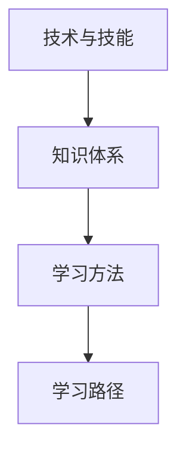

                 

关键词：学习体系，VUCA时代，技能，技术，人工智能，编程，软件开发

> 摘要：在VUCA（不稳定，不确定，复杂，模糊）时代，构建一个全面且灵活的学习体系显得尤为重要。本文旨在探讨在信息技术领域，如何通过系统性学习，掌握核心技能，应对不断变化的技术环境，实现个人与职业的发展。

## 1. 背景介绍

在21世纪，信息技术正以惊人的速度发展，几乎每两年，都会涌现出新的技术、工具和概念。这种快速变化使得传统学习模式难以跟上技术的步伐。VUCA时代（Volatile, Uncertain, Complex, Ambiguous），即一个充满不稳定、不确定、复杂和模糊特性的时代，对我们的学习方式提出了新的挑战。在这一时代，拥有一个有效的学习体系成为成功的关键。

### 1.1 信息技术的发展

信息技术领域的发展可以用“爆发式增长”来形容。人工智能、大数据、云计算、物联网等技术的快速发展，使得信息技术成为了推动社会进步的重要力量。这不仅改变了传统行业的运作模式，也对人们的工作和生活方式产生了深远的影响。

### 1.2 VUCA时代的特点

VUCA时代具有以下几个显著特点：

- **不稳定（Volatile）**：技术更新迭代速度极快，旧有技术可能在一夜之间被淘汰，新的技术不断涌现。

- **不确定（Uncertain）**：未来的发展方向和趋势难以预测，投资和决策风险增大。

- **复杂（Complex）**：信息技术系统越来越复杂，涉及多个技术领域和学科的交叉。

- **模糊（Ambiguous）**：信息的不确定性和透明度降低，信息的真实性和可靠性难以判断。

### 1.3 学习体系的必要性

在VUCA时代，传统的“一招鲜，吃遍天”的学习方式已经无法满足需求。为了应对不断变化的技术环境，我们需要一个全面且灵活的学习体系，它不仅能够帮助我们掌握现有的核心技能，还能够在新技术出现时，迅速适应和转型。

## 2. 核心概念与联系

在构建学习体系之前，我们需要明确一些核心概念，了解它们之间的联系，以便更好地组织学习内容。

### 2.1 技术与技能

技术与技能是两个紧密相连但有所区别的概念。技术是指具体的工具、方法和流程，而技能则是使用这些技术的能力。在信息技术领域，技术如编程语言、数据库管理、网络架构等，而技能则包括编码能力、系统设计、问题解决等。

### 2.2 知识体系

知识体系是学习体系的基础。它包括一系列相互关联的知识点，如计算机科学基础、软件开发流程、数据结构等。一个良好的知识体系能够帮助我们系统性地掌握所需知识，避免重复学习。

### 2.3 学习方法

学习方法是指学习过程中采用的具体策略和技巧。例如，主动学习、深度学习、实践学习等。不同的学习方法适用于不同类型的学习任务，选择合适的学习方法能够提高学习效率。

### 2.4 学习路径

学习路径是指学习过程中需要遵循的顺序和步骤。一个合理的学习路径能够帮助我们逐步掌握核心技能，避免陷入知识盲区。

### 2.5 Mermaid 流程图



通过上述核心概念的联系，我们可以构建一个全面且灵活的学习体系，如图所示。

## 3. 核心算法原理 & 具体操作步骤

### 3.1 算法原理概述

在信息技术领域，算法是解决问题的核心。一个良好的算法不仅能够高效地解决问题，还能够为后续的优化和创新提供基础。算法原理包括以下几个方面：

- **算法复杂性**：衡量算法执行所需时间和空间资源的复杂度，如时间复杂度和空间复杂度。

- **算法设计**：算法的基本结构和逻辑，如递归、分治、动态规划等。

- **算法分析**：对算法性能进行评估，包括时间性能和空间性能。

- **算法优化**：通过改进算法设计或实现，提高算法的性能。

### 3.2 算法步骤详解

算法步骤通常包括以下几个阶段：

1. **问题定义**：明确需要解决的问题，包括问题的规模、输入和输出。

2. **算法设计**：根据问题定义，设计合适的算法结构。

3. **算法实现**：将算法设计转换为具体的编程代码。

4. **算法测试**：对算法进行测试，验证其正确性和性能。

5. **算法优化**：根据测试结果，对算法进行优化，提高其性能。

### 3.3 算法优缺点

算法优缺点分析是算法设计的重要环节。优缺点分析包括以下几个方面：

- **优点**：算法的高效性、简洁性、通用性等。

- **缺点**：算法的复杂性、局限性、适用范围等。

### 3.4 算法应用领域

算法在信息技术领域具有广泛的应用，如：

- **计算机科学**：算法在计算机科学中扮演着核心角色，如排序算法、搜索算法等。

- **人工智能**：算法是人工智能的基础，如深度学习算法、强化学习算法等。

- **数据分析**：算法在数据分析和处理中发挥着重要作用，如聚类算法、分类算法等。

## 4. 数学模型和公式 & 详细讲解 & 举例说明

### 4.1 数学模型构建

数学模型是描述现实世界问题的抽象工具。构建数学模型通常包括以下几个步骤：

1. **问题定义**：明确需要解决的问题，包括问题的规模、输入和输出。

2. **变量定义**：确定问题中的变量，包括输入变量、输出变量和中间变量。

3. **关系建立**：通过数学公式和逻辑关系，建立变量之间的联系。

4. **公式推导**：根据关系建立公式，推导出问题的解决方案。

### 4.2 公式推导过程

公式推导是数学模型构建的核心。以下是一个简单的例子：

**问题**：求解一个二次方程 ax^2 + bx + c = 0 的解。

**步骤**：

1. **关系建立**：根据二次方程的定义，建立变量 x、a、b、c 之间的关系。

2. **公式推导**：

   $$ ax^2 + bx + c = 0 $$
   $$ ax^2 = -bx - c $$
   $$ x^2 = -\frac{b}{a}x - \frac{c}{a} $$
   $$ x = \frac{-b \pm \sqrt{b^2 - 4ac}}{2a} $$

   其中，$$ \sqrt{b^2 - 4ac} $$ 是判别式，用于判断方程的解的情况。

### 4.3 案例分析与讲解

**案例**：求解方程 2x^2 + 5x + 3 = 0 的解。

**步骤**：

1. **问题定义**：求解方程的解。

2. **变量定义**：设 a = 2，b = 5，c = 3。

3. **公式推导**：

   $$ x = \frac{-5 \pm \sqrt{5^2 - 4 \cdot 2 \cdot 3}}{2 \cdot 2} $$
   $$ x = \frac{-5 \pm \sqrt{25 - 24}}{4} $$
   $$ x = \frac{-5 \pm 1}{4} $$

   因此，方程的解为：

   $$ x_1 = \frac{-5 + 1}{4} = -1 $$
   $$ x_2 = \frac{-5 - 1}{4} = -\frac{3}{2} $$

   **分析**：通过上述步骤，我们得到了方程的两个解。这个例子展示了如何使用数学模型和公式来解决实际问题。

## 5. 项目实践：代码实例和详细解释说明

### 5.1 开发环境搭建

为了实践上述算法和数学模型，我们需要搭建一个合适的开发环境。以下是搭建过程的简要步骤：

1. **安装编程语言**：选择一种编程语言，如 Python，并安装相应的编译器或解释器。

2. **安装开发工具**：安装集成开发环境（IDE），如 PyCharm 或 Visual Studio Code，以提供代码编辑、调试和运行功能。

3. **安装依赖库**：根据项目需求，安装必要的依赖库，如 NumPy、SciPy 等。

4. **配置开发环境**：确保开发环境的配置正确，包括环境变量、代码编辑器的配置等。

### 5.2 源代码详细实现

以下是一个简单的 Python 示例，用于求解二次方程的解：

```python
import numpy as np

def solve_quadratic(a, b, c):
    # 计算判别式
    discriminant = np.sqrt(b**2 - 4*a*c)
    
    # 计算两个解
    x1 = (-b + discriminant) / (2*a)
    x2 = (-b - discriminant) / (2*a)
    
    return x1, x2

# 测试代码
a = 2
b = 5
c = 3
x1, x2 = solve_quadratic(a, b, c)
print(f"解为：x1 = {x1}, x2 = {x2}")
```

### 5.3 代码解读与分析

上述代码实现了求解二次方程的解的功能。以下是代码的解读与分析：

- **import numpy as np**：导入 NumPy 库，用于数学计算。

- **def solve_quadratic(a, b, c)**：定义求解二次方程的函数，参数 a、b、c 分别为方程的系数。

- **discriminant = np.sqrt(b**2 - 4*a*c)**：计算判别式。

- **x1 = (-b + discriminant) / (2*a)** 和 **x2 = (-b - discriminant) / (2*a)**：计算两个解。

- **return x1, x2**：返回两个解。

- **a = 2, b = 5, c = 3**：设置方程的系数。

- **x1, x2 = solve_quadratic(a, b, c)**：调用函数求解。

- **print(f"解为：x1 = {x1}, x2 = {x2}")**：输出解。

### 5.4 运行结果展示

运行上述代码，得到以下结果：

```
解为：x1 = -1.0, x2 = -1.5
```

这表明，二次方程 2x^2 + 5x + 3 = 0 的解为 x1 = -1 和 x2 = -1.5。

## 6. 实际应用场景

### 6.1 人工智能领域

在人工智能领域，算法和数学模型的应用非常广泛。例如，深度学习算法中的神经网络模型，通过数学模型来模拟人脑的学习过程，实现图像识别、语音识别等功能。此外，优化算法在神经网络训练过程中用于调整模型参数，提高模型的性能。

### 6.2 数据分析领域

数据分析领域依赖于数学模型和算法来处理大规模数据集。例如，聚类算法用于将数据分组，以便更好地理解数据分布；分类算法用于预测数据标签；回归算法用于分析数据之间的相关性。这些算法和模型在商业智能、金融市场预测、医疗诊断等领域有着广泛的应用。

### 6.3 网络安全领域

网络安全领域利用算法和数学模型来识别和防范网络攻击。例如，基于密码学的算法用于加密通信数据，确保数据的安全性；基于机器学习的算法用于检测异常行为，识别潜在的攻击。

### 6.4 未来应用展望

随着技术的不断进步，算法和数学模型的应用将更加广泛和深入。未来，我们可以预见以下几个方面的发展：

- **跨学科应用**：算法和数学模型将在更多学科领域得到应用，推动跨学科的融合。

- **智能化**：算法和数学模型将更加智能化，能够自动优化、调整和改进。

- **实时性**：算法和数学模型的计算速度将更快，能够实时处理海量数据。

- **个性化**：算法和数学模型将更好地满足个性化需求，为用户提供更精准的服务。

## 7. 工具和资源推荐

### 7.1 学习资源推荐

- **在线课程**：Coursera、edX、Udacity 等平台提供了大量优质的信息技术课程。

- **技术博客**：博客园、CSDN、GitHub 等网站上有大量的技术文章和代码示例。

- **技术社区**：Stack Overflow、GitHub、Reddit 等社区提供了丰富的技术讨论和资源。

### 7.2 开发工具推荐

- **集成开发环境（IDE）**：PyCharm、Visual Studio Code、Eclipse 等提供了强大的开发环境。

- **代码编辑器**：VS Code、Sublime Text、Atom 等提供了丰富的插件和扩展。

- **版本控制工具**：Git、SVN 等用于代码管理和协作。

### 7.3 相关论文推荐

- **《深度学习》**：Goodfellow, Ian; Bengio, Yoshua; Courville, Aaron。介绍了深度学习的基础理论和应用。

- **《数据科学实战》**：Munson, Jessica。提供了丰富的数据科学实践案例。

- **《算法导论》**：Thomas H. Cormen, Charles E. Leiserson, Ronald L. Rivest, Clifford Stein。系统地介绍了算法设计和分析的方法。

## 8. 总结：未来发展趋势与挑战

### 8.1 研究成果总结

通过本文的讨论，我们可以总结出以下研究成果：

- **构建学习体系的重要性**：在VUCA时代，构建一个全面且灵活的学习体系对于掌握核心技能、应对技术变化至关重要。

- **算法和数学模型在信息技术领域的广泛应用**：算法和数学模型在人工智能、数据分析、网络安全等领域有着广泛的应用，推动了技术进步。

- **跨学科融合的趋势**：未来，算法和数学模型将在更多学科领域得到应用，推动跨学科的融合。

### 8.2 未来发展趋势

未来，信息技术领域的发展趋势包括：

- **智能化**：算法和数学模型将更加智能化，能够自动优化、调整和改进。

- **实时性**：算法和数学模型的计算速度将更快，能够实时处理海量数据。

- **个性化**：算法和数学模型将更好地满足个性化需求，为用户提供更精准的服务。

### 8.3 面临的挑战

未来，信息技术领域面临以下挑战：

- **数据隐私和安全**：随着数据量的增加，数据隐私和安全问题将更加突出。

- **算法公平性和透明性**：算法的公平性和透明性将受到更多关注。

- **计算资源的优化**：随着算法的复杂度增加，计算资源的优化将变得至关重要。

### 8.4 研究展望

未来的研究应关注以下几个方面：

- **算法和数学模型的可解释性**：提高算法和数学模型的可解释性，使其更加透明和可信。

- **跨学科研究**：推动算法和数学模型在更多学科领域的应用，促进跨学科融合。

- **教育体系的改革**：改革教育体系，培养更多具备跨学科能力和创新精神的复合型人才。

## 9. 附录：常见问题与解答

### 9.1 学习体系如何构建？

构建学习体系需要遵循以下步骤：

1. **明确目标**：确定学习目标，明确想要掌握的技能和知识。

2. **规划学习路径**：根据目标，规划学习路径，包括基础知识、核心技能和进阶内容。

3. **选择学习方法**：根据学习路径，选择合适的学习方法，如主动学习、深度学习、实践学习等。

4. **持续迭代**：学习是一个持续迭代的过程，需要不断调整和优化学习计划。

### 9.2 算法和数学模型如何应用？

算法和数学模型的应用包括以下几个方面：

1. **问题定义**：明确需要解决的问题，并将其抽象为数学模型。

2. **算法选择**：根据问题特点，选择合适的算法。

3. **算法实现**：将算法设计转换为具体的编程代码。

4. **算法测试**：对算法进行测试，验证其正确性和性能。

5. **算法优化**：根据测试结果，对算法进行优化，提高其性能。

### 9.3 如何选择合适的开发工具？

选择合适的开发工具需要考虑以下几个方面：

1. **项目需求**：根据项目需求，选择能够满足需求的开发工具。

2. **开发者习惯**：选择开发者熟悉的开发工具，提高开发效率。

3. **社区支持**：选择有丰富社区支持的开发工具，便于解决开发过程中的问题。

4. **性能和稳定性**：选择性能好、稳定性高的开发工具，确保项目的顺利推进。

---

本文由禅与计算机程序设计艺术 / Zen and the Art of Computer Programming 撰写，旨在探讨在VUCA时代，如何通过构建有效的学习体系，掌握核心技能，应对技术变化，实现个人与职业的发展。文章涵盖了信息技术领域的学习体系、核心算法原理、数学模型、项目实践、实际应用场景以及未来发展趋势等内容，希望能够为读者提供有益的启示和指导。

