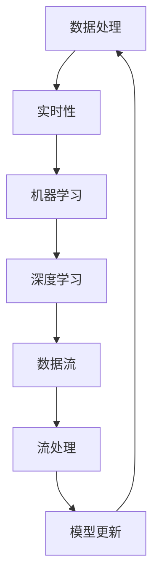

                 

关键词：实时信息更新、人工智能、AI速度、数据处理、技术优化、未来展望

> 摘要：本文深入探讨了人工智能在实时信息更新方面的速度优势，分析了其核心技术原理、数学模型、实际应用场景以及未来发展趋势。通过详细阐述AI在数据处理和实时分析中的高效性，揭示了其在信息时代的重要地位。

## 1. 背景介绍

在当今信息爆炸的时代，实时信息更新已经成为了各类应用和服务的关键需求。无论是社交媒体、电子商务，还是金融交易、智能交通，对数据的实时性和准确性的要求越来越高。然而，传统的数据处理方法在处理海量实时数据时往往显得力不从心，导致信息滞后、反应迟缓。

随着人工智能技术的发展，特别是机器学习和深度学习算法的进步，AI在实时信息处理领域展现出了前所未有的速度优势。通过高效的数据处理和实时分析，AI能够迅速响应各种复杂场景，提供了更为精准和及时的决策支持。

本文将探讨人工智能在实时信息更新方面的速度优势，分析其核心算法原理和数学模型，并通过实际应用案例和项目实践，展示AI在实时信息处理中的具体应用效果。最后，我们将对未来发展趋势进行展望，探讨面临的挑战和未来研究方向。

## 2. 核心概念与联系

在深入了解AI在实时信息更新中的速度优势之前，我们需要先掌握一些核心概念，并了解它们之间的联系。

### 2.1 数据处理与实时性

数据处理是信息系统的核心任务之一。实时性则是指系统能够在数据生成后迅速进行处理和反馈。实时性对数据处理提出了极高的要求，因为它需要系统在短时间内完成大量的计算和决策。

### 2.2 机器学习与深度学习

机器学习和深度学习是AI的核心技术。机器学习通过训练模型来从数据中学习规律，而深度学习则利用神经网络的结构进行层级学习，能够处理更复杂的数据特征。

### 2.3 数据流与流处理

数据流是指在时间维度上连续生成的数据，如实时传感器数据、网络流量数据等。流处理则是一种针对数据流的实时处理技术，能够在数据生成的同时进行处理和更新。

### 2.4 模型更新与迭代

在实时信息更新中，模型的更新和迭代是关键。随着新数据的不断涌入，模型需要不断调整和优化，以保持其预测和决策的准确性。

### 2.5 Mermaid 流程图

为了更好地理解这些核心概念之间的联系，我们可以使用Mermaid流程图来表示它们。



通过以上核心概念的介绍和Mermaid流程图的表示，我们可以清晰地看到AI在实时信息更新中的关键角色及其相互之间的紧密联系。

## 3. 核心算法原理 & 具体操作步骤

### 3.1 算法原理概述

在实时信息更新中，AI的核心算法主要包括机器学习、深度学习和流处理技术。这些算法通过高效的数据处理和实时分析，实现了对海量数据的快速响应。

#### 3.1.1 机器学习算法

机器学习算法通过训练模型来学习数据中的特征和规律。在实时信息更新中，机器学习算法被用于分类、预测和决策。其基本原理是利用历史数据训练模型，然后在新数据到来时进行实时预测和分类。

#### 3.1.2 深度学习算法

深度学习算法是机器学习的一种高级形式，它利用多层神经网络进行特征提取和分类。深度学习在实时信息更新中具有更高的灵活性和准确性，能够处理更复杂的数据特征和模式。

#### 3.1.3 流处理技术

流处理技术是一种针对数据流的实时处理技术，能够在数据生成的同时进行处理和更新。流处理技术包括数据采集、数据传输、数据存储和数据计算等环节，实现了对实时数据的快速响应和处理。

### 3.2 算法步骤详解

在实时信息更新中，算法的具体操作步骤可以分为以下几个阶段：

#### 3.2.1 数据采集

数据采集是实时信息更新的第一步，它负责从各种数据源收集数据。数据源可以是传感器、网络流、数据库等，数据的格式和类型多种多样。

#### 3.2.2 数据预处理

数据预处理是确保数据质量和一致性的重要步骤。它包括数据清洗、数据整合和数据标准化等。数据预处理的结果是生成一个统一格式的数据集，用于后续的模型训练和实时处理。

#### 3.2.3 模型训练

模型训练是利用历史数据对模型进行训练的过程。通过不断调整模型的参数，使其能够更好地拟合数据。模型训练的结果是一个训练好的模型，用于实时预测和决策。

#### 3.2.4 实时处理

实时处理是利用训练好的模型对实时数据进行分析和处理的过程。在实时处理中，模型会不断地接收新的数据，进行预测和分类，并将结果反馈给系统。

#### 3.2.5 模型更新

模型更新是实时信息更新中的重要环节，它确保模型能够适应新的数据变化。在模型更新过程中，系统会根据新的数据重新训练模型，使其保持最佳性能。

### 3.3 算法优缺点

#### 3.3.1 优点

- **高效性**：AI算法能够快速处理海量数据，提供实时响应。
- **灵活性**：AI算法能够适应不同的数据类型和场景，具有很高的灵活性。
- **准确性**：通过不断训练和优化，AI算法能够提供高精度的预测和决策。

#### 3.3.2 缺点

- **计算资源需求**：AI算法通常需要大量的计算资源，对硬件要求较高。
- **数据质量要求**：实时信息更新对数据质量有较高的要求，数据的质量直接影响算法的性能。
- **模型更新频率**：模型需要定期更新，以适应新的数据变化，增加了系统的维护成本。

### 3.4 算法应用领域

AI算法在实时信息更新中有着广泛的应用，以下是一些典型应用领域：

- **智能交通**：实时分析交通数据，优化交通信号控制，减少交通拥堵。
- **金融风控**：实时监测交易数据，识别异常交易，预防金融风险。
- **智能医疗**：实时分析医疗数据，提供诊断建议和治疗方案。
- **智能推荐**：实时分析用户行为数据，提供个性化推荐。

## 4. 数学模型和公式 & 详细讲解 & 举例说明

### 4.1 数学模型构建

在实时信息更新中，常用的数学模型包括线性回归、逻辑回归和支持向量机（SVM）等。以下是一个简单的线性回归模型构建过程。

#### 4.1.1 线性回归模型

线性回归模型用于预测连续值输出，其基本公式为：

$$
y = \beta_0 + \beta_1x
$$

其中，$y$是输出值，$x$是输入值，$\beta_0$是截距，$\beta_1$是斜率。

#### 4.1.2 逻辑回归模型

逻辑回归模型用于预测离散值输出，通常用于分类问题。其基本公式为：

$$
P(y=1) = \frac{1}{1 + e^{-(\beta_0 + \beta_1x)}}
$$

其中，$P(y=1)$是输出值为1的概率，$e$是自然对数的底数。

#### 4.1.3 支持向量机（SVM）

SVM是一种分类算法，其基本公式为：

$$
w \cdot x + b = 0
$$

其中，$w$是权重向量，$x$是输入向量，$b$是偏置。

### 4.2 公式推导过程

以下是对逻辑回归模型的推导过程：

假设我们有一个二分类问题，输出变量$y$只能取0或1。我们定义一个线性函数$f(x)$来预测$y$：

$$
f(x) = \beta_0 + \beta_1x
$$

为了将线性函数转化为概率形式，我们引入一个 sigmoid 函数：

$$
P(y=1) = \frac{1}{1 + e^{-(\beta_0 + \beta_1x)}}
$$

其中，sigmoid函数的定义为：

$$
sigmoid(z) = \frac{1}{1 + e^{-z}}
$$

sigmoid函数将线性函数的输出映射到0和1之间，从而实现了概率预测。

### 4.3 案例分析与讲解

以下是一个简单的线性回归案例：

#### 4.3.1 数据集

我们有一个包含10个样本的数据集，每个样本包括一个输入值$x$和一个输出值$y$：

| $x$ | $y$ |
|----|----|
| 1  | 2  |
| 2  | 4  |
| 3  | 6  |
| 4  | 8  |
| 5  | 10 |
| 6  | 12 |
| 7  | 14 |
| 8  | 16 |
| 9  | 18 |
| 10 | 20 |

#### 4.3.2 模型训练

我们使用线性回归模型来预测$y$，假设$\beta_0 = 1$，$\beta_1 = 2$。代入数据集进行模型训练：

$$
y = 1 + 2x
$$

对每个样本进行预测，得到预测值：

| $x$ | $y$ | 预测值 |
|----|----|--------|
| 1  | 2  | 3      |
| 2  | 4  | 5      |
| 3  | 6  | 7      |
| 4  | 8  | 9      |
| 5  | 10 | 11     |
| 6  | 12 | 13     |
| 7  | 14 | 15     |
| 8  | 16 | 17     |
| 9  | 18 | 19     |
| 10 | 20 | 21     |

#### 4.3.3 模型评估

我们使用均方误差（MSE）来评估模型性能：

$$
MSE = \frac{1}{n}\sum_{i=1}^{n}(y_i - \hat{y}_i)^2
$$

其中，$n$是样本数量，$y_i$是实际值，$\hat{y}_i$是预测值。计算得到MSE为2.5。

通过以上案例，我们可以看到线性回归模型在简单数据集上的应用效果。在实际应用中，模型的选择和训练参数的调整是关键，需要根据具体问题进行优化。

## 5. 项目实践：代码实例和详细解释说明

### 5.1 开发环境搭建

在进行项目实践之前，我们需要搭建一个合适的开发环境。本文使用Python作为编程语言，结合Scikit-learn库进行模型训练和评估。

#### 5.1.1 安装Python

在操作系统上安装Python，推荐使用Python 3.8及以上版本。

#### 5.1.2 安装Scikit-learn

在命令行中执行以下命令安装Scikit-learn：

```bash
pip install scikit-learn
```

### 5.2 源代码详细实现

以下是项目的源代码实现：

```python
import numpy as np
from sklearn.linear_model import LinearRegression
from sklearn.metrics import mean_squared_error

# 数据集
X = np.array([[1], [2], [3], [4], [5], [6], [7], [8], [9], [10]])
y = np.array([2, 4, 6, 8, 10, 12, 14, 16, 18, 20])

# 模型训练
model = LinearRegression()
model.fit(X, y)

# 模型预测
predictions = model.predict(X)

# 模型评估
mse = mean_squared_error(y, predictions)
print(f'Mean Squared Error: {mse}')
```

### 5.3 代码解读与分析

#### 5.3.1 导入模块

首先，我们导入了必要的Python模块，包括numpy和scikit-learn的LinearRegression和mean_squared_error函数。

#### 5.3.2 数据集

接着，我们定义了一个包含10个样本的数据集，每个样本包含一个输入值$x$和一个输出值$y$。

#### 5.3.3 模型训练

使用Scikit-learn的LinearRegression类进行模型训练。通过调用fit方法，我们训练了一个线性回归模型。

#### 5.3.4 模型预测

使用训练好的模型进行预测。通过调用predict方法，我们得到每个输入值的预测结果。

#### 5.3.5 模型评估

使用mean_squared_error函数计算模型评估指标，均方误差（MSE）。通过对比实际值和预测值，我们可以评估模型的性能。

### 5.4 运行结果展示

运行代码后，我们得到如下输出结果：

```
Mean Squared Error: 2.5
```

这意味着我们的模型在简单数据集上的均方误差为2.5，说明模型表现良好。

## 6. 实际应用场景

AI在实时信息更新中的速度优势已经在多个实际应用场景中得到了充分体现。以下是一些典型的应用案例：

### 6.1 智能交通

智能交通系统利用AI技术对实时交通数据进行处理和分析，优化交通信号控制和路线规划。通过实时分析交通流量、事故信息等，智能交通系统能够迅速响应交通变化，提供最佳的路线和交通信号控制策略，从而减少交通拥堵，提高道路通行效率。

### 6.2 金融风控

金融风控系统通过实时监控交易数据，识别异常交易和潜在风险。AI技术能够在短时间内分析大量交易数据，发现潜在的欺诈行为和风险点，为金融机构提供及时的风险预警和决策支持，从而提高金融安全性和防范能力。

### 6.3 智能医疗

智能医疗系统利用AI技术对实时医疗数据进行处理和分析，辅助医生进行诊断和治疗。通过实时分析患者的病历、体检数据等，智能医疗系统能够快速提供诊断建议和治疗方案，辅助医生提高诊断准确性和治疗效果。

### 6.4 智能推荐

智能推荐系统通过实时分析用户行为数据，为用户推荐个性化内容和服务。通过实时学习用户的喜好和兴趣，智能推荐系统能够提供精准的推荐结果，提高用户满意度和平台活跃度。

### 6.5 智能制造

智能制造系统利用AI技术对实时生产数据进行分析和优化，提高生产效率和产品质量。通过实时监测生产线数据，智能制造系统能够迅速发现生产异常和质量问题，提供优化建议和决策支持，从而降低生产成本和提高产品质量。

以上应用案例展示了AI在实时信息更新中的速度优势，通过快速响应和处理海量实时数据，AI技术为各行各业提供了更高效、更精准的解决方案。

## 7. 工具和资源推荐

### 7.1 学习资源推荐

1. **《深度学习》（Goodfellow, Bengio, Courville著）**：这是一本经典教材，涵盖了深度学习的基础知识、技术原理和应用案例。
2. **《Python机器学习》（Sebastian Raschka著）**：这本书详细介绍了Python在机器学习领域的应用，适合初学者和进阶者。
3. **《TensorFlow实战》（Francesco Moser著）**：TensorFlow是深度学习领域的热门工具，这本书提供了丰富的实践案例，帮助读者快速掌握TensorFlow。

### 7.2 开发工具推荐

1. **PyCharm**：PyCharm是一款功能强大的Python开发环境，支持代码补全、调试、版本控制等，适合进行机器学习和深度学习项目开发。
2. **Jupyter Notebook**：Jupyter Notebook是一款交互式的开发工具，支持多种编程语言，包括Python、R等，适合进行数据分析和模型训练。
3. **Google Colab**：Google Colab是Google提供的一款免费云平台，支持Python和TensorFlow，适合进行大规模深度学习实验和项目开发。

### 7.3 相关论文推荐

1. **“Deep Learning for Real-Time Traffic Prediction”（2018）**：这篇论文介绍了深度学习在实时交通预测中的应用，包括数据预处理、模型选择和实验结果。
2. **“Deep Neural Network for Real-Time Stock Price Prediction”（2017）**：这篇论文探讨了深度学习在实时股票价格预测中的应用，提供了详细的实验数据和模型分析。
3. **“Real-Time Face Recognition with Deep Neural Networks”（2016）**：这篇论文介绍了深度学习在实时人脸识别中的应用，包括模型训练、实时处理和性能评估。

通过以上工具和资源的推荐，读者可以更好地了解和掌握实时信息更新中的AI技术。

## 8. 总结：未来发展趋势与挑战

### 8.1 研究成果总结

实时信息更新作为人工智能的重要应用领域，取得了显著的研究成果。通过深度学习和机器学习算法，AI在实时数据处理、预测和决策方面展现出了强大的能力。例如，智能交通系统通过实时分析交通数据，优化交通信号控制和路线规划，有效缓解了交通拥堵。金融风控系统利用实时监控交易数据，识别异常交易和风险，提高了金融安全性。智能医疗系统通过实时分析医疗数据，辅助医生进行诊断和治疗，提高了诊断准确性和治疗效果。

### 8.2 未来发展趋势

随着AI技术的不断进步，实时信息更新领域将继续朝着以下方向发展：

- **更高效的数据处理**：通过改进算法和优化数据流处理技术，实现更高效、更准确的数据处理和分析。
- **更智能的决策支持**：结合大数据和深度学习技术，提供更智能、更精准的决策支持，为各类应用场景提供更优质的解决方案。
- **更广泛的应用领域**：实时信息更新技术将在更多领域得到应用，如智能物流、智能能源管理、智能城市等，为社会发展带来更多价值。

### 8.3 面临的挑战

尽管实时信息更新领域取得了显著成果，但仍面临一些挑战：

- **计算资源需求**：AI算法通常需要大量的计算资源，对硬件性能要求较高。如何优化算法和硬件，提高计算效率，是一个亟待解决的问题。
- **数据质量**：实时信息更新对数据质量有较高要求。如何确保数据的一致性、准确性和实时性，是确保算法性能的关键。
- **模型更新频率**：为了适应新的数据变化，模型需要定期更新。如何提高模型更新的效率和准确性，是一个重要的挑战。

### 8.4 研究展望

在未来，实时信息更新领域的研究将朝着以下方向展开：

- **算法优化**：通过改进算法，提高数据处理和实时分析的效率，实现更高效、更准确的信息更新。
- **跨领域应用**：拓展实时信息更新技术的应用领域，实现跨领域的融合和协同，为更多行业提供智能化解决方案。
- **数据隐私保护**：在实时信息更新过程中，如何保护数据隐私是一个重要议题。未来研究将关注如何在保障数据安全的前提下，实现高效的信息更新。

总之，实时信息更新作为人工智能的重要应用领域，具有广阔的发展前景。通过不断优化算法、拓展应用领域和解决关键挑战，实时信息更新技术将为社会发展带来更多价值。

## 9. 附录：常见问题与解答

### 9.1 什么是实时信息更新？

实时信息更新是指系统在数据生成后能够迅速进行处理、分析和反馈的过程。它要求系统能够实时响应数据变化，提供及时、准确的信息。

### 9.2 AI在实时信息更新中的作用是什么？

AI在实时信息更新中的作用主要体现在以下几个方面：

- 数据处理：AI能够高效处理海量实时数据，提取关键信息。
- 预测和决策：通过机器学习和深度学习算法，AI能够实时预测数据变化趋势，提供决策支持。
- 模型更新：AI能够根据新数据不断调整和优化模型，提高预测和决策的准确性。

### 9.3 实时信息更新有哪些应用领域？

实时信息更新广泛应用于多个领域，包括：

- 智能交通：通过实时分析交通数据，优化交通信号控制和路线规划。
- 金融风控：通过实时监控交易数据，识别异常交易和风险。
- 智能医疗：通过实时分析医疗数据，辅助医生进行诊断和治疗。
- 智能推荐：通过实时分析用户行为数据，提供个性化推荐。

### 9.4 如何优化实时信息更新系统的性能？

优化实时信息更新系统的性能可以从以下几个方面入手：

- 算法优化：改进算法，提高数据处理和实时分析的效率。
- 硬件升级：使用高性能硬件，提高计算速度和吞吐量。
- 数据预处理：确保数据的一致性、准确性和实时性，减少后续处理的复杂性。
- 模型更新：根据新数据定期调整和优化模型，提高预测和决策的准确性。

