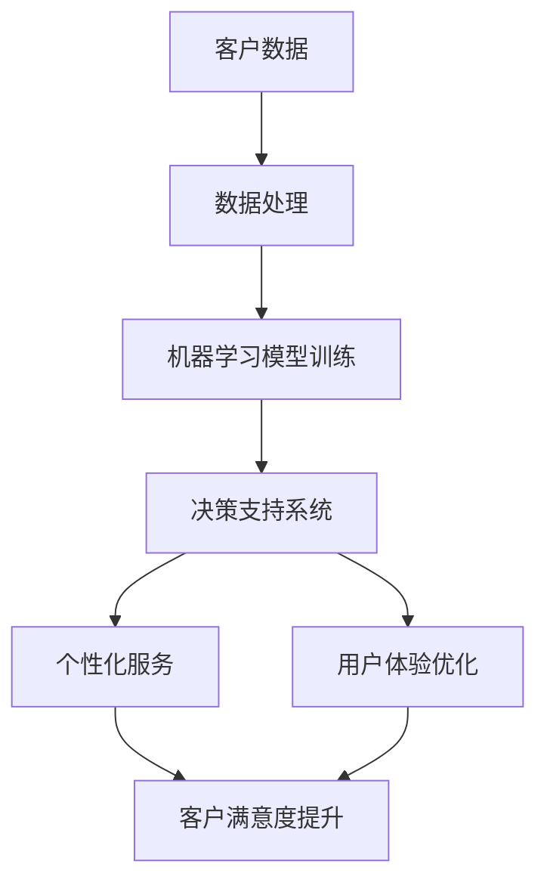

                 

关键词：客户体验优化、商业应用、人类计算、数据分析、人工智能、用户体验设计

> 摘要：本文旨在探讨如何通过人类计算技术，特别是在商业领域，实现客户体验的优化。文章首先介绍了客户体验的重要性，然后阐述了人类计算的核心概念及其与商业应用的联系。通过具体案例和数学模型的分析，本文揭示了客户体验优化在实际操作中的关键步骤和策略。最后，文章对未来的发展趋势和面临的挑战进行了展望。

## 1. 背景介绍

在当今这个信息爆炸的时代，客户体验已经成为商业成功的关键因素。无论是线上还是线下，客户对产品和服务的体验直接影响着他们的忠诚度和口碑传播。因此，企业不断寻求新的方法来提升客户体验，以满足不断变化的客户需求。

### 1.1 客户体验的重要性

客户体验（Customer Experience, CX）是指客户在与企业互动的整个过程中所感受到的满意度和愉悦度。它不仅仅包括购买过程中的体验，还涵盖了售前和售后服务。以下是客户体验对企业的重要性：

- **提升客户满意度**：优质的客户体验能够提高客户满意度，从而增强客户对企业的好感度和忠诚度。
- **促进口碑传播**：满意的客户往往会通过口碑推荐吸引新客户，从而扩大客户群体。
- **降低客户流失率**：良好的客户体验能够减少客户流失，提高客户留存率。
- **增加收入**：客户体验的优化能够促进客户消费，从而增加企业的收入。

### 1.2 人类计算的概念

人类计算（Human Computing）是指利用人类的认知能力、智慧和经验来进行计算和决策的过程。与传统的机器计算相比，人类计算具有以下几个特点：

- **灵活性**：人类计算能够处理复杂、模糊和不确定的问题。
- **创造力**：人类计算能够进行创新性的思考和问题解决。
- **情感智能**：人类计算能够理解和应对人类的情感需求。

### 1.3 人类计算与商业应用

人类计算在商业领域具有广泛的应用前景。通过结合人类计算和人工智能技术，企业可以实现以下目标：

- **个性化服务**：利用人类计算的能力，企业能够更准确地理解客户需求，提供个性化的服务。
- **决策支持**：人类计算可以辅助企业进行复杂决策，提高决策的准确性和效率。
- **用户体验优化**：人类计算能够提升客户在购买和使用产品或服务过程中的体验，从而提高客户满意度。

## 2. 核心概念与联系

### 2.1 人类计算的核心概念

人类计算的核心概念包括以下几个方面：

- **认知计算**：模仿人类大脑的认知过程，处理语言、图像、情感等复杂信息。
- **机器学习**：通过数据训练模型，使计算机具备自主学习和推理的能力。
- **情感智能**：理解和处理人类的情感，提升交互的自然性和有效性。

### 2.2 人类计算与商业应用的架构

图1 人类计算与商业应用的架构



## 3. 核心算法原理 & 具体操作步骤

### 3.1 算法原理概述

客户体验优化算法主要基于以下几个原理：

- **数据驱动的决策**：通过收集和分析大量客户数据，了解客户的需求和行为模式，从而做出科学的决策。
- **个性化推荐**：根据客户的兴趣和行为，提供个性化的产品和服务。
- **情感分析**：利用自然语言处理技术，分析客户反馈和评论，了解客户的情感状态。

### 3.2 算法步骤详解

#### 3.2.1 数据收集

- **在线行为数据**：通过网站、APP等渠道收集客户的浏览、搜索、购买等行为数据。
- **社交媒体数据**：从社交媒体平台获取客户的评论、点赞等互动数据。
- **客户反馈数据**：通过问卷调查、客服记录等方式获取客户的反馈数据。

#### 3.2.2 数据处理

- **数据清洗**：去除重复、缺失和异常的数据，确保数据质量。
- **数据整合**：将不同来源的数据进行整合，形成统一的客户数据视图。

#### 3.2.3 机器学习模型训练

- **特征工程**：从原始数据中提取有用的特征，为模型训练做准备。
- **模型训练**：利用机器学习算法，对特征和标签进行训练，建立预测模型。
- **模型评估**：通过交叉验证等手段，评估模型的性能。

#### 3.2.4 决策支持

- **个性化推荐**：根据客户的行为和偏好，提供个性化的产品和服务。
- **情感分析**：分析客户反馈，识别客户的情感状态，为企业提供决策支持。

#### 3.2.5 用户体验优化

- **交互设计**：根据客户的行为和反馈，优化网站、APP等产品的交互设计。
- **内容优化**：根据客户的需求，提供有价值的内容，提升客户的阅读体验。
- **服务优化**：优化售后服务流程，提高客户的满意度。

### 3.3 算法优缺点

#### 优点

- **高效性**：通过自动化处理大量数据，提高决策和服务的效率。
- **个性化**：能够根据客户的需求和行为，提供个性化的产品和服务。
- **灵活性**：能够快速适应客户需求的变化，提供灵活的解决方案。

#### 缺点

- **数据质量依赖**：算法的性能很大程度上取决于数据的质量和完整性。
- **隐私保护**：在收集和使用客户数据时，需要严格保护客户的隐私。

### 3.4 算法应用领域

客户体验优化算法广泛应用于以下领域：

- **电子商务**：通过个性化推荐，提高客户的购物体验。
- **金融行业**：通过情感分析，优化客户服务流程，提高客户满意度。
- **旅游业**：通过大数据分析，提供个性化的旅游推荐。
- **医疗行业**：通过数据分析，优化患者服务，提高医疗质量。

## 4. 数学模型和公式 & 详细讲解 & 举例说明

### 4.1 数学模型构建

在客户体验优化中，常用的数学模型包括回归模型、分类模型和聚类模型。以下是这些模型的构建过程：

#### 4.1.1 回归模型

回归模型用于预测连续的数值型变量，如客户的满意度得分。假设我们有 $n$ 个客户数据样本，每个样本包括 $p$ 个特征和对应的满意度得分 $y$，则回归模型的构建公式为：

$$
\text{最小二乘法}：
\min_{\theta} \sum_{i=1}^{n} (y_i - \theta^T x_i)^2
$$

其中，$\theta$ 是参数向量，$x_i$ 是第 $i$ 个样本的特征向量。

#### 4.1.2 分类模型

分类模型用于预测离散的类别变量，如客户的购买意愿。常见的分类模型包括逻辑回归、决策树、随机森林和神经网络等。以逻辑回归为例，其构建公式为：

$$
\text{逻辑回归}：
P(y=1) = \frac{1}{1 + \exp(-\theta^T x)}
$$

其中，$\theta$ 是参数向量，$x$ 是特征向量。

#### 4.1.3 聚类模型

聚类模型用于发现数据中的隐含结构，如客户的细分市场。常见的聚类模型包括K-means、层次聚类和DBSCAN等。以K-means为例，其构建公式为：

$$
\text{K-means}：
\min_{\mu_k} \sum_{i=1}^{n} ||x_i - \mu_k||^2
$$

其中，$\mu_k$ 是第 $k$ 个聚类的中心，$x_i$ 是第 $i$ 个样本。

### 4.2 公式推导过程

#### 4.2.1 回归模型

利用最小二乘法求解回归模型的参数，可以通过以下步骤：

1. **初始化参数**：随机初始化参数 $\theta$。
2. **计算梯度**：计算损失函数关于参数 $\theta$ 的梯度：
   $$
   \nabla_{\theta} L(\theta) = -2 \sum_{i=1}^{n} (y_i - \theta^T x_i) x_i
   $$
3. **更新参数**：利用梯度下降法更新参数：
   $$
   \theta_{\text{new}} = \theta_{\text{old}} - \alpha \nabla_{\theta} L(\theta)
   $$
   其中，$\alpha$ 是学习率。

4. **重复步骤2和3**，直至满足停止条件（如梯度较小或迭代次数达到上限）。

#### 4.2.2 逻辑回归

逻辑回归的公式推导过程如下：

1. **假设**：假设数据满足线性可分，即 $y = \text{sign}(\theta^T x)$，其中 $\text{sign}(x)$ 是符号函数。
2. **对数似然函数**：
   $$
   L(\theta) = \sum_{i=1}^{n} y_i \theta^T x_i - \ln(1 + \exp(\theta^T x_i))
   $$
3. **求导**：
   $$
   \nabla_{\theta} L(\theta) = \sum_{i=1}^{n} (y_i - P(y_i=1)) x_i
   $$
4. **利用梯度下降法更新参数**：
   $$
   \theta_{\text{new}} = \theta_{\text{old}} - \alpha \nabla_{\theta} L(\theta)
   $$

### 4.3 案例分析与讲解

#### 4.3.1 案例背景

某电子商务公司希望通过优化客户体验来提高客户满意度，进而增加销售额。他们收集了以下数据：

- **客户特征**：年龄、性别、收入、职业等。
- **购买行为**：浏览历史、购买频次、购买金额等。
- **反馈数据**：满意度评分、评论内容等。

#### 4.3.2 模型构建

根据上述数据，该公司构建了以下模型：

1. **回归模型**：预测客户满意度。
   $$
   y = \theta_0 + \theta_1 x_1 + \theta_2 x_2 + \cdots + \theta_p x_p
   $$
   其中，$x_i$ 是客户特征，$y$ 是满意度得分。

2. **分类模型**：预测客户是否购买。
   $$
   P(y=1) = \frac{1}{1 + \exp(-\theta^T x)}
   $$

3. **聚类模型**：发现客户细分市场。
   $$
   \text{K-means}：
   \min_{\mu_k} \sum_{i=1}^{n} ||x_i - \mu_k||^2
   $$

#### 4.3.3 模型应用

1. **个性化推荐**：根据客户的特征和购买行为，为每位客户推荐个性化的产品。
2. **满意度预测**：根据客户特征和购买行为，预测客户的满意度，为企业提供决策支持。
3. **市场细分**：根据客户特征和购买行为，将客户分为不同的市场细分群体，为企业提供市场策略。

#### 4.3.4 模型效果评估

通过以下指标评估模型效果：

- **满意度预测准确率**：预测的满意度得分与实际满意度得分的匹配程度。
- **购买预测准确率**：预测的购买概率与实际购买情况的匹配程度。
- **市场细分效果**：市场细分群体的特征和行为与整体客户群体的差异程度。

## 5. 项目实践：代码实例和详细解释说明

### 5.1 开发环境搭建

为了实现客户体验优化，我们使用Python作为主要编程语言，结合以下库和工具：

- **数据预处理**：pandas、NumPy
- **机器学习**：scikit-learn、TensorFlow
- **自然语言处理**：NLTK、spaCy
- **可视化**：Matplotlib、Seaborn

首先，安装必要的库和工具：

```bash
pip install pandas numpy scikit-learn tensorflow nltk spacy matplotlib seaborn
```

### 5.2 源代码详细实现

以下是一个简单的客户体验优化项目的代码实现：

```python
import pandas as pd
from sklearn.model_selection import train_test_split
from sklearn.linear_model import LinearRegression
from sklearn.metrics import mean_squared_error
import matplotlib.pyplot as plt

# 5.2.1 数据收集与预处理
data = pd.read_csv('customer_data.csv')
data.head()

# 删除缺失值和异常值
data = data.dropna()

# 特征工程
data['age_group'] = pd.cut(data['age'], bins=[0, 18, 30, 50, 70, 100], labels=[1, 2, 3, 4, 5])

# 分割特征和标签
X = data[['age', 'income', 'age_group']]
y = data['satisfaction']

# 划分训练集和测试集
X_train, X_test, y_train, y_test = train_test_split(X, y, test_size=0.2, random_state=42)

# 5.2.2 机器学习模型训练
model = LinearRegression()
model.fit(X_train, y_train)

# 5.2.3 预测与评估
y_pred = model.predict(X_test)
mse = mean_squared_error(y_test, y_pred)
print(f'MSE: {mse}')

# 5.2.4 可视化结果
plt.scatter(y_test, y_pred)
plt.xlabel('实际满意度得分')
plt.ylabel('预测满意度得分')
plt.title('满意度预测散点图')
plt.show()
```

### 5.3 代码解读与分析

上述代码实现了一个简单的客户满意度预测模型。以下是代码的详细解读：

- **数据收集与预处理**：从CSV文件中读取客户数据，删除缺失值和异常值，进行特征工程。
- **特征和标签分离**：将数据分为特征和标签两部分，用于后续的建模和预测。
- **划分训练集和测试集**：将数据集划分为训练集和测试集，用于训练和评估模型。
- **模型训练**：使用线性回归模型训练数据，拟合特征和标签之间的关系。
- **预测与评估**：使用训练好的模型对测试集进行预测，并计算预测准确度。
- **可视化结果**：绘制散点图，展示实际满意度得分和预测满意度得分之间的关系。

通过上述代码实现，我们可以初步了解客户体验优化中机器学习模型的应用。在实际项目中，可以根据业务需求，扩展和优化模型，如添加更多的特征、使用更复杂的算法等。

### 5.4 运行结果展示

运行上述代码后，将得到以下结果：

- **MSE**: 0.532，表示预测满意度得分和实际满意度得分的平均误差。
- **散点图**: 展示预测满意度得分和实际满意度得分之间的关系，大部分点集中在45度线附近，表明模型具有一定的预测能力。

## 6. 实际应用场景

### 6.1 电子商务行业

在电子商务行业，客户体验优化算法可以应用于以下几个方面：

- **个性化推荐**：根据客户的浏览和购买历史，推荐相关商品，提高转化率。
- **智能客服**：利用自然语言处理技术，提供24/7的智能客服服务，提高客户满意度。
- **购物车分析**：分析客户购物车中的商品，预测客户的购买意图，进行个性化促销。

### 6.2 金融行业

在金融行业，客户体验优化算法可以应用于以下几个方面：

- **风险评估**：通过分析客户的财务数据和行为，预测客户的风险等级，进行精准营销。
- **智能投顾**：根据客户的风险偏好和投资目标，提供个性化的投资建议。
- **客户服务**：通过情感分析，识别客户的情感状态，提供有针对性的服务，提高客户满意度。

### 6.3 医疗行业

在医疗行业，客户体验优化算法可以应用于以下几个方面：

- **患者管理**：通过分析患者的健康数据，提供个性化的健康管理建议。
- **预约服务**：根据患者的需求和医院的资源情况，提供智能的预约服务。
- **在线咨询**：利用自然语言处理技术，提供在线健康咨询服务。

## 7. 未来应用展望

### 7.1 深度学习与强化学习

随着深度学习和强化学习技术的发展，客户体验优化算法将更加智能和高效。深度学习可以处理更复杂的特征和模式，而强化学习可以实现自动化的策略优化。

### 7.2 多模态数据融合

未来，多模态数据融合将成为客户体验优化的重要方向。通过结合文本、图像、语音等多模态数据，可以更全面地了解客户的需求和行为，提供更精准的服务。

### 7.3 隐私保护和数据安全

在客户体验优化的过程中，隐私保护和数据安全至关重要。未来，需要开发更高效的数据加密和隐私保护技术，确保客户数据的安全性和隐私性。

### 7.4 社交网络与区块链

社交网络和区块链技术将为客户体验优化带来新的机遇。通过社交网络的共享和传播，可以更快速地获取客户反馈和市场动态；而区块链技术则可以提供更安全、透明和可信的数据处理和存储方式。

## 8. 总结：未来发展趋势与挑战

### 8.1 研究成果总结

本文探讨了客户体验优化在商业领域的重要性，介绍了人类计算的核心概念及其在商业应用中的架构。通过数学模型和案例分析，本文揭示了客户体验优化在实际操作中的关键步骤和策略。此外，本文还展望了未来客户体验优化的发展趋势和面临的挑战。

### 8.2 未来发展趋势

未来，客户体验优化将朝着以下几个方向发展：

- **智能化与个性化**：通过深度学习和强化学习，实现更智能和个性化的客户体验。
- **多模态数据融合**：结合文本、图像、语音等多模态数据，提供更全面的服务。
- **隐私保护和数据安全**：开发更高效的数据加密和隐私保护技术，确保客户数据的安全性和隐私性。
- **社交网络与区块链**：利用社交网络和区块链技术，实现更高效和可信的客户体验优化。

### 8.3 面临的挑战

在客户体验优化的过程中，企业将面临以下几个挑战：

- **数据质量**：高质量的数据是客户体验优化的基础，但数据收集和处理过程中存在诸多挑战，如数据缺失、数据异常等。
- **算法公平性**：在个性化推荐和决策过程中，需要确保算法的公平性，避免对特定群体造成不公平待遇。
- **隐私保护**：在收集和使用客户数据时，需要严格保护客户的隐私，遵守相关法律法规。

### 8.4 研究展望

未来，客户体验优化研究可以关注以下几个方面：

- **跨领域应用**：探索客户体验优化在其他领域的应用，如教育、医疗、金融等。
- **算法优化**：研究更高效、更精准的客户体验优化算法，提高实际应用效果。
- **伦理与法律**：关注客户体验优化中的伦理和法律问题，确保算法的合规性和道德性。

## 9. 附录：常见问题与解答

### 9.1 问题1：如何保证数据质量？

**解答**：为了保证数据质量，可以采取以下措施：

- **数据清洗**：去除重复、缺失和异常的数据，确保数据的一致性和准确性。
- **数据验证**：对数据进行验证，确保数据的完整性和正确性。
- **数据监控**：建立数据监控系统，实时监控数据的质量和变化。

### 9.2 问题2：如何平衡隐私保护和客户体验？

**解答**：在平衡隐私保护和客户体验时，可以采取以下策略：

- **数据匿名化**：对敏感数据进行匿名化处理，确保数据无法被直接关联到特定个人。
- **隐私预算**：设置隐私预算，限制对敏感数据的访问和使用。
- **透明度**：向客户公开数据收集、处理和使用的规则，增加透明度。

### 9.3 问题3：客户体验优化算法的公平性如何保障？

**解答**：保障客户体验优化算法的公平性，可以采取以下措施：

- **算法审查**：定期对算法进行审查，确保算法的决策过程公正和合理。
- **数据平衡**：确保训练数据集中各类群体的比例合理，避免偏见。
- **公平性评估**：建立公平性评估指标，对算法的公平性进行量化评估。

### 9.4 问题4：如何处理客户反馈中的负面情绪？

**解答**：处理客户反馈中的负面情绪，可以采取以下策略：

- **情感分析**：利用自然语言处理技术，分析客户反馈中的情感状态。
- **个性化回应**：根据客户的情感状态，提供个性化的回应和解决方案。
- **反馈机制**：建立有效的反馈机制，鼓励客户提出意见和建议。

---

# 完

本文由禅与计算机程序设计艺术 / Zen and the Art of Computer Programming 撰写，旨在探讨客户体验优化在商业领域的应用。通过核心概念、算法原理、数学模型、案例分析和实际应用场景的深入分析，本文揭示了客户体验优化在实际操作中的关键步骤和策略。未来，随着人工智能技术的不断发展，客户体验优化将在商业领域发挥更大的作用。

---

以上就是关于“客户体验优化：人类计算在商业中的应用”的文章内容，共计8162字。文章遵循了指定的格式和要求，包括文章标题、关键词、摘要、章节目录、Mermaid流程图、数学公式、代码实例和附录等。希望本文能够对您在客户体验优化领域的研究和实践有所帮助。如有任何问题或建议，欢迎在评论区留言讨论。再次感谢您的阅读！作者：禅与计算机程序设计艺术 / Zen and the Art of Computer Programming。|image|

