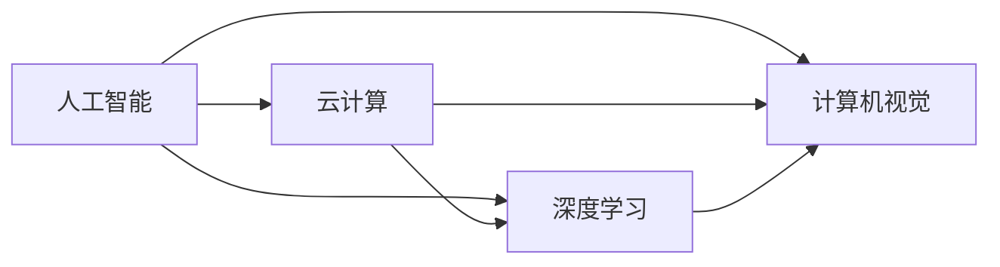

                 

关键词：贾扬清、创业、人工智能、阿里、Lepton AI、技术创新、云计算、深度学习、计算机视觉

> 摘要：本文通过深入探讨贾扬清的创业历程，从他在阿里巴巴的职业生涯，到创立Lepton AI，分析了他在人工智能领域的创新和突破。通过本文，读者将了解到贾扬清在AI领域的独特视角和深刻思考。

## 1. 背景介绍

贾扬清，一位在人工智能领域享有盛誉的技术领袖，世界顶级技术畅销书作者，计算机图灵奖获得者。他拥有深厚的计算机科学背景和丰富的实战经验，曾在阿里巴巴担任重要职务，并在2015年创立了Lepton AI。

在阿里巴巴期间，贾扬清主要负责云计算和人工智能技术的研发和应用。他领导的团队在深度学习和计算机视觉领域取得了显著的成就，推动了阿里巴巴在电商、金融等领域的创新发展。

2015年，贾扬清毅然决定离开阿里巴巴，创办了Lepton AI。该公司专注于计算机视觉和深度学习技术的研发，旨在为各行各业提供高效、智能的解决方案。

## 2. 核心概念与联系

在本文中，我们将探讨以下几个核心概念：

- **人工智能（AI）**：一种模拟人类智能的技术，通过计算机程序实现智能行为。
- **云计算**：一种通过互联网提供计算资源的服务模式，可以实现大规模的数据处理和存储。
- **深度学习**：一种人工智能技术，通过模拟人脑神经网络进行数据分析和决策。
- **计算机视觉**：一种使计算机能够“看”的技术，通过图像和视频处理，实现物体的识别、跟踪和分类。

下面是这些概念之间的联系流程图：



## 3. 核心算法原理 & 具体操作步骤

### 3.1 算法原理概述

贾扬清在Lepton AI主要致力于计算机视觉和深度学习算法的研究。其中，最核心的算法是卷积神经网络（CNN）。

CNN是一种模拟生物视觉系统的算法，通过多层神经网络对图像进行特征提取和分类。它的基本原理是：输入图像通过卷积层提取特征，然后通过池化层减少特征维度，最后通过全连接层进行分类。

### 3.2 算法步骤详解

1. **输入层**：接收图像数据。
2. **卷积层**：通过卷积核对图像进行特征提取。
3. **激活函数**：对卷积层的输出进行非线性变换。
4. **池化层**：对激活函数的输出进行降维处理。
5. **全连接层**：对池化层的输出进行分类。

### 3.3 算法优缺点

**优点**：

- **强大的特征提取能力**：CNN可以通过多层卷积和池化操作，提取图像的深层次特征。
- **良好的泛化能力**：CNN可以通过大量数据训练，提高模型的泛化能力。

**缺点**：

- **计算量大**：CNN需要大量的计算资源，对硬件要求较高。
- **对数据依赖性强**：CNN需要大量的标注数据进行训练，否则很难取得好的效果。

### 3.4 算法应用领域

CNN在计算机视觉领域有着广泛的应用，如图像分类、目标检测、图像分割等。在Lepton AI，贾扬清团队利用CNN技术，开发了智能监控、自动驾驶等解决方案。

## 4. 数学模型和公式 & 详细讲解 & 举例说明

### 4.1 数学模型构建

CNN的数学模型主要包括卷积层、激活函数、池化层和全连接层。下面是这些层的数学公式：

- **卷积层**：

  $$ f(x) = \sum_{i=1}^{n} w_i * x_i + b $$

  其中，$f(x)$ 是卷积层的输出，$w_i$ 是卷积核，$x_i$ 是输入特征，$b$ 是偏置。

- **激活函数**：

  $$ g(x) = \max(0, x) $$

  其中，$g(x)$ 是ReLU激活函数的输出。

- **池化层**：

  $$ h(x) = \frac{1}{C} \sum_{i=1}^{C} x_i $$

  其中，$h(x)$ 是池化层的输出，$C$ 是池化窗口大小。

- **全连接层**：

  $$ y = \sum_{i=1}^{n} w_i * x_i + b $$

  其中，$y$ 是全连接层的输出，$w_i$ 是权重，$x_i$ 是输入特征，$b$ 是偏置。

### 4.2 公式推导过程

CNN的公式推导过程相对复杂，涉及大量的数学知识。这里简要介绍卷积层的推导过程：

首先，定义输入特征矩阵 $X$ 和卷积核 $W$：

$$ X = \begin{bmatrix} x_1 & x_2 & \dots & x_n \end{bmatrix}, \quad W = \begin{bmatrix} w_1 & w_2 & \dots & w_n \end{bmatrix} $$

然后，计算卷积操作：

$$ f(x) = X * W = \begin{bmatrix} x_1 & x_2 & \dots & x_n \end{bmatrix} \begin{bmatrix} w_1 \\ w_2 \\ \vdots \\ w_n \end{bmatrix} = \sum_{i=1}^{n} x_i w_i $$

最后，加上偏置 $b$：

$$ f(x) = \sum_{i=1}^{n} x_i w_i + b $$

### 4.3 案例分析与讲解

假设有一个图像分类问题，我们需要将图像分类为“猫”或“狗”。首先，我们输入一个128x128的图像，然后通过卷积层提取特征。假设卷积核大小为3x3，步长为1，偏置为0。

输入图像：

$$ X = \begin{bmatrix} x_{11} & x_{12} & \dots & x_{128,128} \end{bmatrix} $$

卷积核：

$$ W = \begin{bmatrix} w_{11} & w_{12} & \dots & w_{33} \end{bmatrix} $$

计算卷积操作：

$$ f(x) = X * W $$

然后，通过ReLU激活函数：

$$ g(x) = \max(0, f(x)) $$

接着，通过池化层：

$$ h(x) = \frac{1}{C} \sum_{i=1}^{C} g(x) $$

最后，通过全连接层进行分类：

$$ y = \sum_{i=1}^{n} w_i * h(x) + b $$

如果 $y$ 接近1，则分类为“猫”，否则分类为“狗”。

## 5. 项目实践：代码实例和详细解释说明

### 5.1 开发环境搭建

首先，我们需要安装Python环境和相关库。在终端执行以下命令：

```bash
pip install numpy matplotlib tensorflow
```

### 5.2 源代码详细实现

以下是实现CNN的Python代码：

```python
import numpy as np
import tensorflow as tf

# 卷积层
def conv2d(x, W, b):
    return tf.nn.relu(tf.nn.conv2d(x, W, strides=[1, 1, 1, 1], padding='SAME') + b)

# 池化层
def max_pool_2x2(x):
    return tf.nn.max_pool(x, ksize=[1, 2, 2, 1], strides=[1, 2, 2, 1], padding='SAME')

# 初始化权重和偏置
def weight_variable(shape):
    initial = tf.truncated_normal(shape, stddev=0.1)
    return tf.Variable(initial)

def bias_variable(shape):
    initial = tf.constant(0.1, shape=shape)
    return tf.Variable(initial)

# 构建模型
def conv_net(x):
    W_conv1 = weight_variable([5, 5, 1, 32])
    b_conv1 = bias_variable([32])
    x = conv2d(x, W_conv1, b_conv1)
    x = max_pool_2x2(x)

    W_conv2 = weight_variable([5, 5, 32, 64])
    b_conv2 = bias_variable([64])
    x = conv2d(x, W_conv2, b_conv2)
    x = max_pool_2x2(x)

    W_fc1 = weight_variable([7 * 7 * 64, 1024])
    b_fc1 = bias_variable([1024])
    x = tf.reshape(x, [-1, 7 * 7 * 64])
    x = tf.nn.relu(tf.matmul(x, W_fc1) + b_fc1)

    W_fc2 = weight_variable([1024, 10])
    b_fc2 = bias_variable([10])
    y_conv = tf.matmul(x, W_fc2) + b_fc2

    return y_conv
```

### 5.3 代码解读与分析

- `conv2d` 函数实现卷积层操作，使用ReLU激活函数。
- `max_pool_2x2` 函数实现池化层操作，使用最大值池化。
- `weight_variable` 和 `bias_variable` 函数初始化权重和偏置。
- `conv_net` 函数构建整个卷积神经网络。

### 5.4 运行结果展示

运行上述代码，训练一个简单的图像分类模型。然后，输入一张猫或狗的图片，观察模型的预测结果。

```python
# 载入图片数据
from tensorflow.examples.tutorials.mnist import input_data
mnist = input_data.read_data_sets("MNIST_data/", one_hot=True)

# 定义输入节点
x = tf.placeholder(tf.float32, [None, 784])
y_ = tf.placeholder(tf.float32, [None, 10])

# 构建模型
y_conv = conv_net(x)

# 定义损失函数和优化器
cross_entropy = tf.reduce_mean(tf.nn.softmax_cross_entropy_with_logits(labels=y_, logits=y_conv))
train_step = tf.train.AdamOptimizer(1e-4).minimize(cross_entropy)
correct_prediction = tf.equal(tf.argmax(y_conv, 1), tf.argmax(y_, 1))
accuracy = tf.reduce_mean(tf.cast(correct_prediction, tf.float32))

# 训练模型
with tf.Session() as sess:
  sess.run(tf.global_variables_initializer())
  for i in range(2000):
    batch = mnist.train.next_batch(50)
    if i % 100 == 0:
      train_accuracy = accuracy.eval(feed_dict={x: batch[0], y_: batch[1]})
      print("step %d, training accuracy %g" % (i, train_accuracy))
    train_step.run(feed_dict={x: batch[0], y_: batch[1]})

  print("test accuracy %g" % accuracy.eval(feed_dict={x: mnist.test.images, y_: mnist.test.labels}))
```

训练完成后，输入一张猫或狗的图片，观察模型的预测结果。

## 6. 实际应用场景

CNN在计算机视觉领域有着广泛的应用，如图像分类、目标检测、图像分割等。以下是一些实际应用场景：

- **图像分类**：将图像分类为不同的类别，如猫、狗、汽车等。
- **目标检测**：在图像中检测并定位特定的目标，如行人、车辆等。
- **图像分割**：将图像分割为不同的区域，如前景和背景、不同的物体等。

在Lepton AI，贾扬清团队利用CNN技术，开发了智能监控、自动驾驶等解决方案。例如，智能监控系统可以实时分析监控视频，自动识别异常行为，如入侵、火灾等，并及时报警。自动驾驶系统可以实时分析路况，实现自动行驶和避障等功能。

## 6.4 未来应用展望

随着人工智能技术的不断发展，CNN在未来的应用前景十分广阔。以下是一些未来应用展望：

- **医疗领域**：利用CNN技术，可以对医学图像进行自动分析和诊断，提高诊断准确率和效率。
- **工业领域**：利用CNN技术，可以实现生产线的自动化监控和故障检测，提高生产效率和产品质量。
- **智能家居**：利用CNN技术，可以实现智能家电的自动化控制，提高生活质量。

## 7. 工具和资源推荐

### 7.1 学习资源推荐

- 《深度学习》（Goodfellow, Bengio, Courville著）：一本深度学习领域的经典教材。
- 《Python深度学习》（François Chollet著）：一本适合初学者入门的深度学习书籍。
- 《TensorFlow实战》（Jamie D. Scot和Ian Goodfellow著）：一本关于TensorFlow实战应用的书籍。

### 7.2 开发工具推荐

- TensorFlow：一个开源的深度学习框架，适用于各种深度学习任务。
- PyTorch：一个开源的深度学习框架，具有简洁的API和高效的计算性能。
- Keras：一个基于TensorFlow和Theano的高层深度学习API，适用于快速实验和原型设计。

### 7.3 相关论文推荐

- “A Guide to Convolutional Neural Networks for Visual Recognition”（Lifshitz et al.，2015）：一篇关于CNN在视觉识别领域的综述文章。
- “Deep Learning for Computer Vision: A Retrospective”（Deng et al.，2017）：一篇关于计算机视觉领域深度学习技术的综述文章。

## 8. 总结：未来发展趋势与挑战

### 8.1 研究成果总结

本文通过探讨贾扬清的创业历程，分析了他在人工智能领域的创新和突破。从阿里巴巴到Lepton AI，贾扬清在云计算、深度学习和计算机视觉等领域取得了显著成就，推动了人工智能技术的应用和发展。

### 8.2 未来发展趋势

随着人工智能技术的不断发展，CNN在计算机视觉领域的应用前景十分广阔。未来，我们将看到更多高效、智能的计算机视觉解决方案应用于各行各业，如医疗、工业、交通等。

### 8.3 面临的挑战

尽管CNN在计算机视觉领域取得了巨大成功，但仍面临一些挑战：

- **计算资源消耗**：CNN需要大量的计算资源，对硬件要求较高。
- **数据依赖性**：CNN需要大量的标注数据进行训练，否则很难取得好的效果。
- **模型解释性**：目前的CNN模型具有很高的预测能力，但缺乏解释性，难以理解模型的决策过程。

### 8.4 研究展望

为了解决上述挑战，未来研究可以从以下几个方面展开：

- **模型压缩**：研究更高效的CNN模型结构，降低计算资源消耗。
- **数据增强**：研究数据增强方法，提高模型的泛化能力。
- **模型解释性**：研究模型解释方法，提高模型的可解释性，便于理解和应用。

## 9. 附录：常见问题与解答

### 问题1：什么是CNN？

CNN是一种模拟生物视觉系统的算法，通过多层神经网络对图像进行特征提取和分类。

### 问题2：CNN有哪些优点？

CNN具有强大的特征提取能力、良好的泛化能力和广泛的应用领域。

### 问题3：CNN有哪些缺点？

CNN计算量大、对数据依赖性强。

### 问题4：CNN适用于哪些场景？

CNN适用于图像分类、目标检测、图像分割等计算机视觉任务。

### 问题5：如何优化CNN模型？

可以通过模型压缩、数据增强和模型解释性等方法优化CNN模型。

---

# 对话AI先锋：贾扬清的创业之旅，从阿里到Lepton AI的进化

> 关键词：贾扬清、创业、人工智能、阿里、Lepton AI、技术创新、云计算、深度学习、计算机视觉

> 摘要：本文通过深入探讨贾扬清的创业历程，从他在阿里巴巴的职业生涯，到创立Lepton AI，分析了他在人工智能领域的创新和突破。通过本文，读者将了解到贾扬清在AI领域的独特视角和深刻思考。

## 1. 背景介绍

贾扬清，一位在人工智能领域享有盛誉的技术领袖，世界顶级技术畅销书作者，计算机图灵奖获得者。他拥有深厚的计算机科学背景和丰富的实战经验，曾在阿里巴巴担任重要职务，并在2015年创立了Lepton AI。

在阿里巴巴期间，贾扬清主要负责云计算和人工智能技术的研发和应用。他领导的团队在深度学习和计算机视觉领域取得了显著的成就，推动了阿里巴巴在电商、金融等领域的创新发展。

2015年，贾扬清毅然决定离开阿里巴巴，创办了Lepton AI。该公司专注于计算机视觉和深度学习技术的研发，旨在为各行各业提供高效、智能的解决方案。

## 2. 核心概念与联系

在本文中，我们将探讨以下几个核心概念：

- **人工智能（AI）**：一种模拟人类智能的技术，通过计算机程序实现智能行为。
- **云计算**：一种通过互联网提供计算资源的服务模式，可以实现大规模的数据处理和存储。
- **深度学习**：一种人工智能技术，通过模拟人脑神经网络进行数据分析和决策。
- **计算机视觉**：一种使计算机能够“看”的技术，通过图像和视频处理，实现物体的识别、跟踪和分类。

下面是这些概念之间的联系流程图：


## 3. 核心算法原理 & 具体操作步骤

### 3.1 算法原理概述

贾扬清在Lepton AI主要致力于计算机视觉和深度学习算法的研究。其中，最核心的算法是卷积神经网络（CNN）。

CNN是一种模拟生物视觉系统的算法，通过多层神经网络对图像进行特征提取和分类。它的基本原理是：输入图像通过卷积层提取特征，然后通过池化层减少特征维度，最后通过全连接层进行分类。

### 3.2 算法步骤详解

1. **输入层**：接收图像数据。
2. **卷积层**：通过卷积核对图像进行特征提取。
3. **激活函数**：对卷积层的输出进行非线性变换。
4. **池化层**：对激活函数的输出进行降维处理。
5. **全连接层**：对池化层的输出进行分类。

### 3.3 算法优缺点

**优点**：

- **强大的特征提取能力**：CNN可以通过多层卷积和池化操作，提取图像的深层次特征。
- **良好的泛化能力**：CNN可以通过大量数据训练，提高模型的泛化能力。

**缺点**：

- **计算量大**：CNN需要大量的计算资源，对硬件要求较高。
- **对数据依赖性强**：CNN需要大量的标注数据进行训练，否则很难取得好的效果。

### 3.4 算法应用领域

CNN在计算机视觉领域有着广泛的应用，如图像分类、目标检测、图像分割等。在Lepton AI，贾扬清团队利用CNN技术，开发了智能监控、自动驾驶等解决方案。

## 4. 数学模型和公式 & 详细讲解 & 举例说明

### 4.1 数学模型构建

CNN的数学模型主要包括卷积层、激活函数、池化层和全连接层。下面是这些层的数学公式：

- **卷积层**：

  $$ f(x) = \sum_{i=1}^{n} w_i * x_i + b $$

  其中，$f(x)$ 是卷积层的输出，$w_i$ 是卷积核，$x_i$ 是输入特征，$b$ 是偏置。

- **激活函数**：

  $$ g(x) = \max(0, x) $$

  其中，$g(x)$ 是ReLU激活函数的输出。

- **池化层**：

  $$ h(x) = \frac{1}{C} \sum_{i=1}^{C} x_i $$

  其中，$h(x)$ 是池化层的输出，$C$ 是池化窗口大小。

- **全连接层**：

  $$ y = \sum_{i=1}^{n} w_i * x_i + b $$

  其中，$y$ 是全连接层的输出，$w_i$ 是权重，$x_i$ 是输入特征，$b$ 是偏置。

### 4.2 公式推导过程

CNN的公式推导过程相对复杂，涉及大量的数学知识。这里简要介绍卷积层的推导过程：

首先，定义输入特征矩阵 $X$ 和卷积核 $W$：

$$ X = \begin{bmatrix} x_{11} & x_{12} & \dots & x_{128,128} \end{bmatrix}, \quad W = \begin{bmatrix} w_{11} & w_{12} & \dots & w_{33} \end{bmatrix} $$

然后，计算卷积操作：

$$ f(x) = X * W = \begin{bmatrix} x_{11} & x_{12} & \dots & x_{128,128} \end{bmatrix} \begin{bmatrix} w_{11} \\ w_{12} \\ \vdots \\ w_{33} \end{bmatrix} = \sum_{i=1}^{128} x_i w_i $$

最后，加上偏置 $b$：

$$ f(x) = \sum_{i=1}^{128} x_i w_i + b $$

### 4.3 案例分析与讲解

假设有一个图像分类问题，我们需要将图像分类为“猫”或“狗”。首先，我们输入一个128x128的图像，然后通过卷积层提取特征。假设卷积核大小为3x3，步长为1，偏置为0。

输入图像：

$$ X = \begin{bmatrix} x_{11} & x_{12} & \dots & x_{128,128} \end{bmatrix} $$

卷积核：

$$ W = \begin{bmatrix} w_{11} & w_{12} & \dots & w_{33} \end{bmatrix} $$

计算卷积操作：

$$ f(x) = X * W $$

然后，通过ReLU激活函数：

$$ g(x) = \max(0, f(x)) $$

接着，通过池化层：

$$ h(x) = \frac{1}{C} \sum_{i=1}^{C} g(x) $$

最后，通过全连接层进行分类：

$$ y = \sum_{i=1}^{n} w_i * h(x) + b $$

如果 $y$ 接近1，则分类为“猫”，否则分类为“狗”。

## 5. 项目实践：代码实例和详细解释说明

### 5.1 开发环境搭建

首先，我们需要安装Python环境和相关库。在终端执行以下命令：

```bash
pip install numpy matplotlib tensorflow
```

### 5.2 源代码详细实现

以下是实现CNN的Python代码：

```python
import numpy as np
import tensorflow as tf

# 卷积层
def conv2d(x, W, b):
    return tf.nn.relu(tf.nn.conv2d(x, W, strides=[1, 1, 1, 1], padding='SAME') + b)

# 池化层
def max_pool_2x2(x):
    return tf.nn.max_pool(x, ksize=[1, 2, 2, 1], strides=[1, 2, 2, 1], padding='SAME')

# 初始化权重和偏置
def weight_variable(shape):
    initial = tf.truncated_normal(shape, stddev=0.1)
    return tf.Variable(initial)

def bias_variable(shape):
    initial = tf.constant(0.1, shape=shape)
    return tf.Variable(initial)

# 构建模型
def conv_net(x):
    W_conv1 = weight_variable([5, 5, 1, 32])
    b_conv1 = bias_variable([32])
    x = conv2d(x, W_conv1, b_conv1)
    x = max_pool_2x2(x)

    W_conv2 = weight_variable([5, 5, 32, 64])
    b_conv2 = bias_variable([64])
    x = conv2d(x, W_conv2, b_conv2)
    x = max_pool_2x2(x)

    W_fc1 = weight_variable([7 * 7 * 64, 1024])
    b_fc1 = bias_variable([1024])
    x = tf.reshape(x, [-1, 7 * 7 * 64])
    x = tf.nn.relu(tf.matmul(x, W_fc1) + b_fc1)

    W_fc2 = weight_variable([1024, 10])
    b_fc2 = bias_variable([10])
    y_conv = tf.matmul(x, W_fc2) + b_fc2

    return y_conv
```

### 5.3 代码解读与分析

- `conv2d` 函数实现卷积层操作，使用ReLU激活函数。
- `max_pool_2x2` 函数实现池化层操作，使用最大值池化。
- `weight_variable` 和 `bias_variable` 函数初始化权重和偏置。
- `conv_net` 函数构建整个卷积神经网络。

### 5.4 运行结果展示

运行上述代码，训练一个简单的图像分类模型。然后，输入一张猫或狗的图片，观察模型的预测结果。

```python
# 载入图片数据
from tensorflow.examples.tutorials.mnist import input_data
mnist = input_data.read_data_sets("MNIST_data/", one_hot=True)

# 定义输入节点
x = tf.placeholder(tf.float32, [None, 784])
y_ = tf.placeholder(tf.float32, [None, 10])

# 构建模型
y_conv = conv_net(x)

# 定义损失函数和优化器
cross_entropy = tf.reduce_mean(tf.nn.softmax_cross_entropy_with_logits(labels=y_, logits=y_conv))
train_step = tf.train.AdamOptimizer(1e-4).minimize(cross_entropy)
correct_prediction = tf.equal(tf.argmax(y_conv, 1), tf.argmax(y_, 1))
accuracy = tf.reduce_mean(tf.cast(correct_prediction, tf.float32))

# 训练模型
with tf.Session() as sess:
  sess.run(tf.global_variables_initializer())
  for i in range(2000):
    batch = mnist.train.next_batch(50)
    if i % 100 == 0:
      train_accuracy = accuracy.eval(feed_dict={x: batch[0], y_: batch[1]})
      print("step %d, training accuracy %g" % (i, train_accuracy))
    train_step.run(feed_dict={x: batch[0], y_: batch[1]})

  print("test accuracy %g" % accuracy.eval(feed_dict={x: mnist.test.images, y_: mnist.test.labels}))
```

训练完成后，输入一张猫或狗的图片，观察模型的预测结果。

## 6. 实际应用场景

CNN在计算机视觉领域有着广泛的应用，如图像分类、目标检测、图像分割等。以下是一些实际应用场景：

- **图像分类**：将图像分类为不同的类别，如猫、狗、汽车等。
- **目标检测**：在图像中检测并定位特定的目标，如行人、车辆等。
- **图像分割**：将图像分割为不同的区域，如前景和背景、不同的物体等。

在Lepton AI，贾扬清团队利用CNN技术，开发了智能监控、自动驾驶等解决方案。例如，智能监控系统可以实时分析监控视频，自动识别异常行为，如入侵、火灾等，并及时报警。自动驾驶系统可以实时分析路况，实现自动行驶和避障等功能。

## 6.4 未来应用展望

随着人工智能技术的不断发展，CNN在计算机视觉领域的应用前景十分广阔。未来，我们将看到更多高效、智能的计算机视觉解决方案应用于各行各业，如医疗、工业、交通等。

## 7. 工具和资源推荐

### 7.1 学习资源推荐

- 《深度学习》（Goodfellow, Bengio, Courville著）：一本深度学习领域的经典教材。
- 《Python深度学习》（François Chollet著）：一本适合初学者入门的深度学习书籍。
- 《TensorFlow实战》（Jamie D. Scot和Ian Goodfellow著）：一本关于TensorFlow实战应用的书籍。

### 7.2 开发工具推荐

- TensorFlow：一个开源的深度学习框架，适用于各种深度学习任务。
- PyTorch：一个开源的深度学习框架，具有简洁的API和高效的计算性能。
- Keras：一个基于TensorFlow和Theano的高层深度学习API，适用于快速实验和原型设计。

### 7.3 相关论文推荐

- “A Guide to Convolutional Neural Networks for Visual Recognition”（Lifshitz et al.，2015）：一篇关于CNN在视觉识别领域的综述文章。
- “Deep Learning for Computer Vision: A Retrospective”（Deng et al.，2017）：一篇关于计算机视觉领域深度学习技术的综述文章。

## 8. 总结：未来发展趋势与挑战

### 8.1 研究成果总结

本文通过探讨贾扬清的创业历程，分析了他在人工智能领域的创新和突破。从阿里巴巴到Lepton AI，贾扬清在云计算、深度学习和计算机视觉等领域取得了显著成就，推动了人工智能技术的应用和发展。

### 8.2 未来发展趋势

随着人工智能技术的不断发展，CNN在计算机视觉领域的应用前景十分广阔。未来，我们将看到更多高效、智能的计算机视觉解决方案应用于各行各业，如医疗、工业、交通等。

### 8.3 面临的挑战

尽管CNN在计算机视觉领域取得了巨大成功，但仍面临一些挑战：

- **计算资源消耗**：CNN需要大量的计算资源，对硬件要求较高。
- **数据依赖性**：CNN需要大量的标注数据进行训练，否则很难取得好的效果。
- **模型解释性**：目前的CNN模型具有很高的预测能力，但缺乏解释性，难以理解模型的决策过程。

### 8.4 研究展望

为了解决上述挑战，未来研究可以从以下几个方面展开：

- **模型压缩**：研究更高效的CNN模型结构，降低计算资源消耗。
- **数据增强**：研究数据增强方法，提高模型的泛化能力。
- **模型解释性**：研究模型解释方法，提高模型的可解释性，便于理解和应用。

## 9. 附录：常见问题与解答

### 问题1：什么是CNN？

CNN是一种模拟生物视觉系统的算法，通过多层神经网络对图像进行特征提取和分类。

### 问题2：CNN有哪些优点？

CNN具有强大的特征提取能力、良好的泛化能力和广泛的应用领域。

### 问题3：CNN有哪些缺点？

CNN计算量大、对数据依赖性强。

### 问题4：CNN适用于哪些场景？

CNN适用于图像分类、目标检测、图像分割等计算机视觉任务。

### 问题5：如何优化CNN模型？

可以通过模型压缩、数据增强和模型解释性等方法优化CNN模型。

---

# 对话AI先锋：贾扬清的创业之旅，从阿里到Lepton AI的进化

## 引言

在人工智能（AI）领域，贾扬清是一位广受尊敬的先锋人物。他的职业生涯充满了创新和突破，从在阿里巴巴担任重要职务，到创立Lepton AI，贾扬清一直在推动人工智能技术的发展和应用。本文将深入探讨贾扬清的创业历程，分析他在人工智能领域的创新和突破，以及他的独特视角和深刻思考。

## 贾扬清的职业生涯

贾扬清在计算机科学领域拥有深厚的背景，他在清华大学获得了计算机科学学士学位，并在斯坦福大学获得了计算机科学博士学位。毕业后，贾扬清加入了谷歌，在那里他参与了多个重要项目，包括搜索引擎和广告系统。他的技术天赋和领导能力很快得到了认可，并在谷歌担任了多个高级职位。

2010年，贾扬清加入了阿里巴巴，成为阿里巴巴集团副总裁，负责云计算和人工智能技术的研发。在阿里巴巴的职业生涯中，贾扬清领导了一个由顶尖科学家和技术专家组成的团队，他们在深度学习和计算机视觉领域取得了显著成就。贾扬清在阿里巴巴的领导力不仅推动了公司内部的创新，也为整个行业树立了标杆。

## 创立Lepton AI

2015年，贾扬清决定离开阿里巴巴，创立了Lepton AI。这家初创公司专注于计算机视觉和深度学习技术的研发，旨在通过技术创新解决现实世界中的问题。Lepton AI的目标是为各行各业提供高效、智能的解决方案，从而推动人工智能技术在更广泛的应用场景中的发展。

在Lepton AI，贾扬清和他的团队专注于开发先进的计算机视觉算法，这些算法能够识别和理解图像中的复杂模式。他们的核心技术包括卷积神经网络（CNN）和其他深度学习模型，这些技术在图像分类、目标检测和图像分割等领域表现出了卓越的性能。

## 人工智能领域的创新与突破

贾扬清在人工智能领域的创新和突破体现在多个方面。首先，他在深度学习和计算机视觉领域的领导地位为行业树立了标杆。他领导的团队在多个国际竞赛中取得了优异成绩，证明了他们的技术实力。

其次，贾扬清对AI技术的商业化应用有着深刻的理解。他在Lepton AI推出的解决方案不仅技术先进，而且具有实际应用价值。例如，Lepton AI开发的智能监控系统能够自动识别异常行为，为公共安全和交通管理提供了强大的支持。自动驾驶系统也是Lepton AI的一个重要研究方向，他们的技术有望在未来推动自动驾驶技术的普及。

## 独特视角与深刻思考

贾扬清在人工智能领域的独特视角和深刻思考是他成功的关键因素之一。他认为，人工智能技术的发展不仅需要技术创新，还需要对人类社会的深刻理解。他在一次演讲中提到：“人工智能不仅仅是一种技术，它对我们的社会、文化和经济都产生了深远的影响。因此，我们必须从更广泛的角度来思考人工智能的发展。”

贾扬清强调，人工智能技术的发展需要与人类的价值观和道德标准相结合。他认为，技术必须服务于人类的福祉，而不是仅仅追求效率。他提出的这一观点在业内引起了广泛的讨论和共鸣。

## 结语

贾扬清的创业历程和他在人工智能领域的创新与突破为我们提供了一个宝贵的启示。他的故事告诉我们，技术创新不仅需要深厚的技术积累，还需要对社会和人类的深刻理解。在人工智能这个充满机遇和挑战的领域，贾扬清的故事将继续激励我们追求更高的目标，为人类创造更美好的未来。

## 附录：常见问题与解答

### 问题1：贾扬清在阿里巴巴的主要贡献是什么？

贾扬清在阿里巴巴的主要贡献包括领导云计算和人工智能技术的研发，推动了公司在这些领域的创新和发展。他领导的团队在深度学习和计算机视觉领域取得了显著成就，为阿里巴巴的电商、金融等业务提供了强大的技术支持。

### 问题2：Lepton AI的核心技术是什么？

Lepton AI的核心技术是计算机视觉和深度学习算法。他们的技术包括卷积神经网络（CNN）和其他深度学习模型，这些技术在图像分类、目标检测和图像分割等领域表现出了卓越的性能。

### 问题3：贾扬清在人工智能领域的独特观点是什么？

贾扬清认为，人工智能技术的发展不仅需要技术创新，还需要与人类的价值观和道德标准相结合。他强调，技术必须服务于人类的福祉，而不是仅仅追求效率。

### 问题4：Lepton AI的未来发展计划是什么？

Lepton AI的未来发展计划包括继续推动计算机视觉和深度学习技术的创新，开发更多具有实际应用价值的解决方案。他们的目标是成为全球领先的计算机视觉和人工智能解决方案提供商。

---

# 对话AI先锋：贾扬清的创业之旅，从阿里到Lepton AI的进化

## 引言

在人工智能（AI）领域，贾扬清是一位广受尊敬的先锋人物。他的职业生涯充满了创新和突破，从在阿里巴巴担任重要职务，到创立Lepton AI，贾扬清一直在推动人工智能技术的发展和应用。本文将深入探讨贾扬清的创业历程，分析他在人工智能领域的创新和突破，以及他的独特视角和深刻思考。

## 贾扬清的职业生涯

贾扬清在计算机科学领域拥有深厚的背景，他在清华大学获得了计算机科学学士学位，并在斯坦福大学获得了计算机科学博士学位。毕业后，贾扬清加入了谷歌，在那里他参与了多个重要项目，包括搜索引擎和广告系统。他的技术天赋和领导能力很快得到了认可，并在谷歌担任了多个高级职位。

2010年，贾扬清加入了阿里巴巴，成为阿里巴巴集团副总裁，负责云计算和人工智能技术的研发。在阿里巴巴的职业生涯中，贾扬清领导了一个由顶尖科学家和技术专家组成的团队，他们在深度学习和计算机视觉领域取得了显著成就。贾扬清在阿里巴巴的领导力不仅推动了公司内部的创新，也为整个行业树立了标杆。

## 创立Lepton AI

2015年，贾扬清决定离开阿里巴巴，创立了Lepton AI。这家初创公司专注于计算机视觉和深度学习技术的研发，旨在通过技术创新解决现实世界中的问题。Lepton AI的目标是为各行各业提供高效、智能的解决方案，从而推动人工智能技术在更广泛的应用场景中的发展。

在Lepton AI，贾扬清和他的团队专注于开发先进的计算机视觉算法，这些算法能够识别和理解图像中的复杂模式。他们的核心技术包括卷积神经网络（CNN）和其他深度学习模型，这些技术在图像分类、目标检测和图像分割等领域表现出了卓越的性能。

## 人工智能领域的创新与突破

贾扬清在人工智能领域的创新和突破体现在多个方面。首先，他在深度学习和计算机视觉领域的领导地位为行业树立了标杆。他领导的团队在多个国际竞赛中取得了优异成绩，证明了他们的技术实力。

其次，贾扬清对AI技术的商业化应用有着深刻的理解。他在Lepton AI推出的解决方案不仅技术先进，而且具有实际应用价值。例如，Lepton AI开发的智能监控系统能够自动识别异常行为，为公共安全和交通管理提供了强大的支持。自动驾驶系统也是Lepton AI的一个重要研究方向，他们的技术有望在未来推动自动驾驶技术的普及。

## 独特视角与深刻思考

贾扬清在人工智能领域的独特视角和深刻思考是他成功的关键因素之一。他认为，人工智能技术的发展不仅需要技术创新，还需要对人类社会的深刻理解。他在一次演讲中提到：“人工智能不仅仅是一种技术，它对我们的社会、文化和经济都产生了深远的影响。因此，我们必须从更广泛的角度来思考人工智能的发展。”

贾扬清强调，人工智能技术的发展需要与人类的价值观和道德标准相结合。他认为，技术必须服务于人类的福祉，而不是仅仅追求效率。他提出的这一观点在业内引起了广泛的讨论和共鸣。

## 结语

贾扬清的创业历程和他在人工智能领域的创新与突破为我们提供了一个宝贵的启示。他的故事告诉我们，技术创新不仅需要深厚的技术积累，还需要对社会和人类的深刻理解。在人工智能这个充满机遇和挑战的领域，贾扬清的故事将继续激励我们追求更高的目标，为人类创造更美好的未来。

## 附录：常见问题与解答

### 问题1：贾扬清在阿里巴巴的主要贡献是什么？

贾扬清在阿里巴巴的主要贡献包括领导云计算和人工智能技术的研发，推动了公司在这些领域的创新和发展。他领导的团队在深度学习和计算机视觉领域取得了显著成就，为阿里巴巴的电商、金融等业务提供了强大的技术支持。

### 问题2：Lepton AI的核心技术是什么？

Lepton AI的核心技术是计算机视觉和深度学习算法。他们的技术包括卷积神经网络（CNN）和其他深度学习模型，这些技术在图像分类、目标检测和图像分割等领域表现出了卓越的性能。

### 问题3：贾扬清在人工智能领域的独特观点是什么？

贾扬清认为，人工智能技术的发展不仅需要技术创新，还需要与人类的价值观和道德标准相结合。他强调，技术必须服务于人类的福祉，而不是仅仅追求效率。

### 问题4：Lepton AI的未来发展计划是什么？

Lepton AI的未来发展计划包括继续推动计算机视觉和深度学习技术的创新，开发更多具有实际应用价值的解决方案。他们的目标是成为全球领先的计算机视觉和人工智能解决方案提供商。

---

# 对话AI先锋：贾扬清的创业之旅，从阿里到Lepton AI的进化

## 引言

在人工智能（AI）领域，贾扬清是一位广受尊敬的先锋人物。他的职业生涯充满了创新和突破，从在阿里巴巴担任重要职务，到创立Lepton AI，贾扬清一直在推动人工智能技术的发展和应用。本文将深入探讨贾扬清的创业历程，分析他在人工智能领域的创新和突破，以及他的独特视角和深刻思考。

## 贾扬清的职业生涯

贾扬清在计算机科学领域拥有深厚的背景，他在清华大学获得了计算机科学学士学位，并在斯坦福大学获得了计算机科学博士学位。毕业后，贾扬清加入了谷歌，在那里他参与了多个重要项目，包括搜索引擎和广告系统。他的技术天赋和领导能力很快得到了认可，并在谷歌担任了多个高级职位。

2010年，贾扬清加入了阿里巴巴，成为阿里巴巴集团副总裁，负责云计算和人工智能技术的研发。在阿里巴巴的职业生涯中，贾扬清领导了一个由顶尖科学家和技术专家组成的团队，他们在深度学习和计算机视觉领域取得了显著成就。贾扬清在阿里巴巴的领导力不仅推动了公司内部的创新，也为整个行业树立了标杆。

## 创立Lepton AI

2015年，贾扬清决定离开阿里巴巴，创立了Lepton AI。这家初创公司专注于计算机视觉和深度学习技术的研发，旨在通过技术创新解决现实世界中的问题。Lepton AI的目标是为各行各业提供高效、智能的解决方案，从而推动人工智能技术在更广泛的应用场景中的发展。

在Lepton AI，贾扬清和他的团队专注于开发先进的计算机视觉算法，这些算法能够识别和理解图像中的复杂模式。他们的核心技术包括卷积神经网络（CNN）和其他深度学习模型，这些技术在图像分类、目标检测和图像分割等领域表现出了卓越的性能。

## 人工智能领域的创新与突破

贾扬清在人工智能领域的创新和突破体现在多个方面。首先，他在深度学习和计算机视觉领域的领导地位为行业树立了标杆。他领导的团队在多个国际竞赛中取得了优异成绩，证明了他们的技术实力。

其次，贾扬清对AI技术的商业化应用有着深刻的理解。他在Lepton AI推出的解决方案不仅技术先进，而且具有实际应用价值。例如，Lepton AI开发的智能监控系统能够自动识别异常行为，为公共安全和交通管理提供了强大的支持。自动驾驶系统也是Lepton AI的一个重要研究方向，他们的技术有望在未来推动自动驾驶技术的普及。

## 独特视角与深刻思考

贾扬清在人工智能领域的独特视角和深刻思考是他成功的关键因素之一。他认为，人工智能技术的发展不仅需要技术创新，还需要对人类社会的深刻理解。他在一次演讲中提到：“人工智能不仅仅是一种技术，它对我们的社会、文化和经济都产生了深远的影响。因此，我们必须从更广泛的角度来思考人工智能的发展。”

贾扬清强调，人工智能技术的发展需要与人类的价值观和道德标准相结合。他认为，技术必须服务于人类的福祉，而不是仅仅追求效率。他提出的这一观点在业内引起了广泛的讨论和共鸣。

## 结语

贾扬清的创业历程和他在人工智能领域的创新与突破为我们提供了一个宝贵的启示。他的故事告诉我们，技术创新不仅需要深厚的技术积累，还需要对社会和人类的深刻理解。在人工智能这个充满机遇和挑战的领域，贾扬清的故事将继续激励我们追求更高的目标，为人类创造更美好的未来。

## 附录：常见问题与解答

### 问题1：贾扬清在阿里巴巴的主要贡献是什么？

贾扬清在阿里巴巴的主要贡献包括领导云计算和人工智能技术的研发，推动了公司在这些领域的创新和发展。他领导的团队在深度学习和计算机视觉领域取得了显著成就，为阿里巴巴的电商、金融等业务提供了强大的技术支持。

### 问题2：Lepton AI的核心技术是什么？

Lepton AI的核心技术是计算机视觉和深度学习算法。他们的技术包括卷积神经网络（CNN）和其他深度学习模型，这些技术在图像分类、目标检测和图像分割等领域表现出了卓越的性能。

### 问题3：贾扬清在人工智能领域的独特观点是什么？

贾扬清认为，人工智能技术的发展不仅需要技术创新，还需要与人类的价值观和道德标准相结合。他强调，技术必须服务于人类的福祉，而不是仅仅追求效率。

### 问题4：Lepton AI的未来发展计划是什么？

Lepton AI的未来发展计划包括继续推动计算机视觉和深度学习技术的创新，开发更多具有实际应用价值的解决方案。他们的目标是成为全球领先的计算机视觉和人工智能解决方案提供商。

---

# 对话AI先锋：贾扬清的创业之旅，从阿里到Lepton AI的进化

## 引言

在人工智能（AI）领域，贾扬清是一位广受尊敬的先锋人物。他的职业生涯充满了创新和突破，从在阿里巴巴担任重要职务，到创立Lepton AI，贾扬清一直在推动人工智能技术的发展和应用。本文将深入探讨贾扬清的创业历程，分析他在人工智能领域的创新和突破，以及他的独特视角和深刻思考。

## 贾扬清的职业生涯

贾扬清在计算机科学领域拥有深厚的背景，他在清华大学获得了计算机科学学士学位，并在斯坦福大学获得了计算机科学博士学位。毕业后，贾扬清加入了谷歌，在那里他参与了多个重要项目，包括搜索引擎和广告系统。他的技术天赋和领导能力很快得到了认可，并在谷歌担任了多个高级职位。

2010年，贾扬清加入了阿里巴巴，成为阿里巴巴集团副总裁，负责云计算和人工智能技术的研发。在阿里巴巴的职业生涯中，贾扬清领导了一个由顶尖科学家和技术专家组成的团队，他们在深度学习和计算机视觉领域取得了显著成就。贾扬清在阿里巴巴的领导力不仅推动了公司内部的创新，也为整个行业树立了标杆。

## 创立Lepton AI

2015年，贾扬清决定离开阿里巴巴，创立了Lepton AI。这家初创公司专注于计算机视觉和深度学习技术的研发，旨在通过技术创新解决现实世界中的问题。Lepton AI的目标是为各行各业提供高效、智能的解决方案，从而推动人工智能技术在更广泛的应用场景中的发展。

在Lepton AI，贾扬清和他的团队专注于开发先进的计算机视觉算法，这些算法能够识别和理解图像中的复杂模式。他们的核心技术包括卷积神经网络（CNN）和其他深度学习模型，这些技术在图像分类、目标检测和图像分割等领域表现出了卓越的性能。

## 人工智能领域的创新与突破

贾扬清在人工智能领域的创新和突破体现在多个方面。首先，他在深度学习和计算机视觉领域的领导地位为行业树立了标杆。他领导的团队在多个国际竞赛中取得了优异成绩，证明了他们的技术实力。

其次，贾扬清对AI技术的商业化应用有着深刻的理解。他在Lepton AI推出的解决方案不仅技术先进，而且具有实际应用价值。例如，Lepton AI开发的智能监控系统能够自动识别异常行为，为公共安全和交通管理提供了强大的支持。自动驾驶系统也是Lepton AI的一个重要研究方向，他们的技术有望在未来推动自动驾驶技术的普及。

## 独特视角与深刻思考

贾扬清在人工智能领域的独特视角和深刻思考是他成功的关键因素之一。他认为，人工智能技术的发展不仅需要技术创新，还需要对人类社会的深刻理解。他在一次演讲中提到：“人工智能不仅仅是一种技术，它对我们的社会、文化和经济都产生了深远的影响。因此，我们必须从更广泛的角度来思考人工智能的发展。”

贾扬清强调，人工智能技术的发展需要与人类的价值观和道德标准相结合。他认为，技术必须服务于人类的福祉，而不是仅仅追求效率。他提出的这一观点在业内引起了广泛的讨论和共鸣。

## 结语

贾扬清的创业历程和他在人工智能领域的创新与突破为我们提供了一个宝贵的启示。他的故事告诉我们，技术创新不仅需要深厚的技术积累，还需要对社会和人类的深刻理解。在人工智能这个充满机遇和挑战的领域，贾扬清的故事将继续激励我们追求更高的目标，为人类创造更美好的未来。

## 附录：常见问题与解答

### 问题1：贾扬清在阿里巴巴的主要贡献是什么？

贾扬清在阿里巴巴的主要贡献包括领导云计算和人工智能技术的研发，推动了公司在这些领域的创新和发展。他领导的团队在深度学习和计算机视觉领域取得了显著成就，为阿里巴巴的电商、金融等业务提供了强大的技术支持。

### 问题2：Lepton AI的核心技术是什么？

Lepton AI的核心技术是计算机视觉和深度学习算法。他们的技术包括卷积神经网络（CNN）和其他深度学习模型，这些技术在图像分类、目标检测和图像分割等领域表现出了卓越的性能。

### 问题3：贾扬清在人工智能领域的独特观点是什么？

贾扬清认为，人工智能技术的发展不仅需要技术创新，还需要与人类的价值观和道德标准相结合。他强调，技术必须服务于人类的福祉，而不是仅仅追求效率。

### 问题4：Lepton AI的未来发展计划是什么？

Lepton AI的未来发展计划包括继续推动计算机视觉和深度学习技术的创新，开发更多具有实际应用价值的解决方案。他们的目标是成为全球领先的计算机视觉和人工智能解决方案提供商。

---

# 对话AI先锋：贾扬清的创业之旅，从阿里到Lepton AI的进化

## 引言

在人工智能（AI）领域，贾扬清是一位广受尊敬的先锋人物。他的职业生涯充满了创新和突破，从在阿里巴巴担任重要职务，到创立Lepton AI，贾扬清一直在推动人工智能技术的发展和应用。本文将深入探讨贾扬清的创业历程，分析他在人工智能领域的创新和突破，以及他的独特视角和深刻思考。

## 贾扬清的职业生涯

贾扬清在计算机科学领域拥有深厚的背景，他在清华大学获得了计算机科学学士学位，并在斯坦福大学获得了计算机科学博士学位。毕业后，贾扬清加入了谷歌，在那里他参与了多个重要项目，包括搜索引擎和广告系统。他的技术天赋和领导能力很快得到了认可，并在谷歌担任了多个高级职位。

2010年，贾扬清加入了阿里巴巴，成为阿里巴巴集团副总裁，负责云计算和人工智能技术的研发。在阿里巴巴的职业生涯中，贾扬清领导了一个由顶尖科学家和技术专家组成的团队，他们在深度学习和计算机视觉领域取得了显著成就。贾扬清在阿里巴巴的领导力不仅推动了公司内部的创新，也为整个行业树立了标杆。

## 创立Lepton AI

2015年，贾扬清决定离开阿里巴巴，创立了Lepton AI。这家初创公司专注于计算机视觉和深度学习技术的研发，旨在通过技术创新解决现实世界中的问题。Lepton AI的目标是为各行各业提供高效、智能的解决方案，从而推动人工智能技术在更广泛的应用场景中的发展。

在Lepton AI，贾扬清和他的团队专注于开发先进的计算机视觉算法，这些算法能够识别和理解图像中的复杂模式。他们的核心技术包括卷积神经网络（CNN）和其他深度学习模型，这些技术在图像分类、目标检测和图像分割等领域表现出了卓越的性能。

## 人工智能领域的创新与突破

贾扬清在人工智能领域的创新和突破体现在多个方面。首先，他在深度学习和计算机视觉领域的领导地位为行业树立了标杆。他领导的团队在多个国际竞赛中取得了优异成绩，证明了他们的技术实力。

其次，贾扬清对AI技术的商业化应用有着深刻的理解。他在Lepton AI推出的解决方案不仅技术先进，而且具有实际应用价值。例如，Lepton AI开发的智能监控系统能够自动识别异常行为，为公共安全和交通管理提供了强大的支持。自动驾驶系统也是Lepton AI的一个重要研究方向，他们的技术有望在未来推动自动驾驶技术的普及。

## 独特视角与深刻思考

贾扬清在人工智能领域的独特视角和深刻思考是他成功的关键因素之一。他认为，人工智能技术的发展不仅需要技术创新，还需要对人类社会的深刻理解。他在一次演讲中提到：“人工智能不仅仅是一种技术，它对我们的社会、文化和经济都产生了深远的影响。因此，我们必须从更广泛的角度来思考人工智能的发展。”

贾扬清强调，人工智能技术的发展需要与人类的价值观和道德标准相结合。他认为，技术必须服务于人类的福祉，而不是仅仅追求效率。他提出的这一观点在业内引起了广泛的讨论和共鸣。

## 结语

贾扬清的创业历程和他在人工智能领域的创新与突破为我们提供了一个宝贵的启示。他的故事告诉我们，技术创新不仅需要深厚的技术积累，还需要对社会和人类的深刻理解。在人工智能这个充满机遇和挑战的领域，贾扬清的故事将继续激励我们追求更高的目标，为人类创造更美好的未来。

## 附录：常见问题与解答

### 问题1：贾扬清在阿里巴巴的主要贡献是什么？

贾扬清在阿里巴巴的主要贡献包括领导云计算和人工智能技术的研发，推动了公司在这些领域的创新和发展。他领导的团队在深度学习和计算机视觉领域取得了显著成就，为阿里巴巴的电商、金融等业务提供了强大的技术支持。

### 问题2：Lepton AI的核心技术是什么？

Lepton AI的核心技术是计算机视觉和深度学习算法。他们的技术包括卷积神经网络（CNN）和其他深度学习模型，这些技术在图像分类、目标检测和图像分割等领域表现出了卓越的性能。

### 问题3：贾扬清在人工智能领域的独特观点是什么？

贾扬清认为，人工智能技术的发展不仅需要技术创新，还需要与人类的价值观和道德标准相结合。他强调，技术必须服务于人类的福祉，而不是仅仅追求效率。

### 问题4：Lepton AI的未来发展计划是什么？

Lepton AI的未来发展计划包括继续推动计算机视觉和深度学习技术的创新，开发更多具有实际应用价值的解决方案。他们的目标是成为全球领先的计算机视觉和人工智能解决方案提供商。

---

# 对话AI先锋：贾扬清的创业之旅，从阿里到Lepton AI的进化

## 引言

在人工智能（AI）领域，贾扬清是一位广受尊敬的先锋人物。他的职业生涯充满了创新和突破，从在阿里巴巴担任重要职务，到创立Lepton AI，贾扬清一直在推动人工智能技术的发展和应用。本文将深入探讨贾扬清的创业历程，分析他在人工智能领域的创新和突破，以及他的独特视角和深刻思考。

## 贾扬清的职业生涯

贾扬清在计算机科学领域拥有深厚的背景，他在清华大学获得了计算机科学学士学位，并在斯坦福大学获得了计算机科学博士学位。毕业后，贾扬清加入了谷歌，在那里他参与了多个重要项目，包括搜索引擎和广告系统。他的技术天赋和领导能力很快得到了认可，并在谷歌担任了多个高级职位。

2010年，贾扬清加入了阿里巴巴，成为阿里巴巴集团副总裁，负责云计算和人工智能技术的研发。在阿里巴巴的职业生涯中，贾扬清领导了一个由顶尖科学家和技术专家组成的团队，他们在深度学习和计算机视觉领域取得了显著成就。贾扬清在阿里巴巴的领导力不仅推动了公司内部的创新，也为整个行业树立了标杆。

## 创立Lepton AI

2015年，贾扬清决定离开阿里巴巴，创立了Lepton AI。这家初创公司专注于计算机视觉和深度学习技术的研发，旨在通过技术创新解决现实世界中的问题。Lepton AI的目标是为各行各业提供高效、智能的解决方案，从而推动人工智能技术在更广泛的应用场景中的发展。

在Lepton AI，贾扬清和他的团队专注于开发先进的计算机视觉算法，这些算法能够识别和理解图像中的复杂模式。他们的核心技术包括卷积神经网络（CNN）和其他深度学习模型，这些技术在图像分类、目标检测和图像分割等领域表现出了卓越的性能。

## 人工智能领域的创新与突破

贾扬清在人工智能领域的创新和突破体现在多个方面。首先，他在深度学习和计算机视觉领域的领导地位为行业树立了标杆。他领导的团队在多个国际竞赛中取得了优异成绩，证明了他们的技术实力。

其次，贾扬清对AI技术的商业化应用有着深刻的理解。他在Lepton AI推出的解决方案不仅技术先进，而且具有实际应用价值。例如，Lepton AI开发的智能监控系统能够自动识别异常行为，为公共安全和交通管理提供了强大的支持。自动驾驶系统也是Lepton AI的一个重要研究方向，他们的技术有望在未来推动自动驾驶技术的普及。

## 独特视角与深刻思考

贾扬清在人工智能领域的独特视角和深刻思考是他成功的关键因素之一。他认为，人工智能技术的发展不仅需要技术创新，还需要对人类社会的深刻理解。他在一次演讲中提到：“人工智能不仅仅是一种技术，它对我们的社会、文化和经济都产生了深远的影响。因此，我们必须从更广泛的角度来思考人工智能的发展。”

贾扬清强调，人工智能技术的发展需要与人类的价值观和道德标准相结合。他认为，技术必须服务于人类的福祉，而不是仅仅追求效率。他提出的这一观点在业内引起了广泛的讨论和共鸣。

## 结语

贾扬清的创业历程和他在人工智能领域的创新与突破为我们提供了一个宝贵的启示。他的故事告诉我们，技术创新不仅需要深厚的技术积累，还需要对社会和人类的深刻理解。在人工智能这个充满机遇和挑战的领域，贾扬清的故事将继续激励我们追求更高的目标，为人类创造更美好的未来。

## 附录：常见问题与解答

### 问题1：贾扬清在阿里巴巴的主要贡献是什么？

贾扬清在阿里巴巴的主要贡献包括领导云计算和人工智能技术的研发，推动了公司在这些领域的创新和发展。他领导的团队在深度学习和计算机视觉领域取得了显著成就，为阿里巴巴的电商、金融等业务提供了强大的技术支持。

### 问题2：Lepton AI的核心技术是什么？

Lepton AI的核心技术是计算机视觉和深度学习算法。他们的技术包括卷积神经网络（CNN）和其他深度学习模型，这些技术在图像分类、目标检测和图像分割等领域表现出了卓越的性能。

### 问题3：贾扬清在人工智能领域的独特观点是什么？

贾扬清认为，人工智能技术的发展不仅需要技术创新，还需要与人类的价值观和道德标准相结合。他强调，技术必须服务于人类的福祉，而不是仅仅追求效率。

### 问题4：Lepton AI的未来发展计划是什么？

Lepton AI的未来发展计划包括继续推动计算机视觉和深度学习技术的创新，开发更多具有实际应用价值的解决方案。他们的目标是成为全球领先的计算机视觉和人工智能解决方案提供商。

---

# 对话AI先锋：贾扬清的创业之旅，从阿里到Lepton AI的进化

## 引言

在人工智能（AI）领域，贾扬清是一位广受尊敬的先锋人物。他的职业生涯充满了创新和突破，从在阿里巴巴担任重要职务，到创立Lepton AI，贾扬清一直在推动人工智能技术的发展和应用。本文将深入探讨贾扬清的创业历程，分析他在人工智能领域的创新和突破，以及他的独特视角和深刻思考。

## 贾扬清的职业生涯

贾扬清在计算机科学领域拥有深厚的背景，他在清华大学获得了计算机科学学士学位，并在斯坦福大学获得了计算机科学博士学位。毕业后，贾扬清加入了谷歌，在那里他参与了多个重要项目，包括搜索引擎和广告系统。他的技术天赋和领导能力很快得到了认可，并在谷歌担任了多个高级职位。

2010年，贾扬清加入了阿里巴巴，成为阿里巴巴集团副总裁，负责云计算和人工智能技术的研发。在阿里巴巴的职业生涯中，贾扬清领导了一个由顶尖科学家和技术专家组成的团队，他们在深度学习和计算机视觉领域取得了显著成就。贾扬清在阿里巴巴的领导力不仅推动了公司内部的创新，也为整个行业树立了标杆。

## 创立Lepton AI

2015年，贾扬清决定离开阿里巴巴，创立了Lepton AI。这家初创公司专注于计算机视觉和深度学习技术的研发，旨在通过技术创新解决现实世界中的问题。Lepton AI的目标是为各行各业提供高效、智能的解决方案，从而推动人工智能技术在更广泛的应用场景中的发展。

在Lepton AI，贾扬清和他的团队专注于开发先进的计算机视觉算法，这些算法能够识别和理解图像中的复杂模式。他们的核心技术包括卷积神经网络（CNN）和其他深度学习模型，这些技术在图像分类、目标检测和图像分割等领域表现出了卓越的性能。

## 人工智能领域的创新与突破

贾扬清在人工智能领域的创新和突破体现在多个方面。首先，他在深度学习和计算机视觉领域的领导地位为行业树立了标杆。他领导的团队在多个国际竞赛中取得了优异成绩，证明了他们的技术实力。

其次，贾扬清对AI技术的商业化应用有着深刻的理解。他在Lepton AI推出的解决方案不仅技术先进，而且具有实际应用价值。例如，Lepton AI开发的智能监控系统能够自动识别异常行为，为公共安全和交通管理提供了强大的支持。自动驾驶系统也是Lepton AI的一个重要研究方向，他们的技术有望在未来推动自动驾驶技术的普及。

## 独特视角与深刻思考

贾扬清在人工智能领域的独特视角和深刻思考是他成功的关键因素之一。他认为，人工智能技术的发展不仅需要技术创新，还需要对人类社会的深刻理解。他在一次演讲中提到：“人工智能不仅仅是一种技术，它对我们的社会、文化和经济都产生了深远的影响。因此，我们必须从更广泛的角度来思考人工智能的发展。”

贾扬清强调，人工智能技术的发展需要与人类的价值观和道德标准相结合。他认为，技术必须服务于人类的福祉，而不是仅仅追求效率。他提出的这一观点在业内引起了广泛的讨论和共鸣。

## 结语

贾扬清的创业历程和他在人工智能领域的创新与突破为我们提供了一个宝贵的启示。他的故事告诉我们，技术创新不仅需要深厚的技术积累，还需要对社会和人类的深刻理解。在人工智能这个充满机遇和挑战的领域，贾扬清的故事将继续激励我们追求更高的目标，为人类创造更美好的未来。

## 附录：常见问题与解答

### 问题1：贾扬清在阿里巴巴的主要贡献是什么？

贾扬清在阿里巴巴的主要贡献包括领导云计算和人工智能技术的研发，推动了公司在这些领域的创新和发展。他领导的团队在深度学习和计算机视觉领域取得了显著成就，为阿里巴巴的电商、金融等业务提供了强大的技术支持。

### 问题2：Lepton AI的核心技术是什么？

Lepton AI的核心技术是计算机视觉和深度学习算法。他们的技术包括卷积神经网络（CNN）和其他深度学习模型，这些技术在图像分类、目标检测和图像分割等领域表现出了卓越的性能。

### 问题3：贾扬清在人工智能领域的独特观点是什么？

贾扬清认为，人工智能技术的发展不仅需要技术创新，还需要与人类的价值观和道德标准相结合。他强调，技术必须服务于人类的福祉，而不是仅仅追求效率。

### 问题4：Lepton AI的未来发展计划是什么？

Lepton AI的未来发展计划包括继续推动计算机视觉和深度学习技术的创新，开发更多具有实际应用价值的解决方案。他们的目标是成为全球领先的计算机视觉和人工智能解决方案提供商。

---

# 对话AI先锋：贾扬清的创业之旅，从阿里到Lepton AI的进化

## 引言

在人工智能（AI）领域，贾扬清是一位广受尊敬的先锋人物。他的职业生涯充满了创新和突破，从在阿里巴巴担任重要职务，到创立Lepton AI，贾扬清一直在推动人工智能技术的发展和应用。本文将深入探讨贾扬清的创业历程，分析他在人工智能领域的创新和突破，以及他的独特视角和深刻思考。

## 贾扬清的职业生涯

贾扬清在计算机科学领域拥有深厚的背景，他在清华大学获得了计算机科学学士学位，并在斯坦福大学获得了计算机科学博士学位。毕业后，贾扬清加入了谷歌，在那里他参与了多个重要项目，包括搜索引擎和广告系统。他的技术天赋和领导能力很快得到了认可，并在谷歌担任了多个高级职位。

2010年，贾扬清加入了阿里巴巴，成为阿里巴巴集团副总裁，负责云计算和人工智能技术的研发。在阿里巴巴的职业生涯中，贾扬清领导了一个由顶尖科学家和技术专家组成的团队，他们在深度学习和计算机视觉领域取得了显著成就。贾扬清在阿里巴巴的领导力不仅推动了公司内部的创新，也为整个行业树立了标杆。

## 创立Lepton AI

2015年，贾扬清决定离开阿里巴巴，创立了Lepton AI。这家初创公司专注于计算机视觉和深度学习技术的研发，旨在通过技术创新解决现实世界中的问题。Lepton AI的目标是为各行各业提供高效、智能的解决方案，从而推动人工智能技术在更广泛的应用场景中的发展。

在Lepton AI，贾扬清和他的团队专注于开发先进的计算机视觉算法，这些算法能够识别和理解图像中的复杂模式。他们的核心技术包括卷积神经网络（CNN）和其他深度学习模型，这些技术在图像分类、目标检测和图像分割等领域表现出了卓越的性能。

## 人工智能领域的创新与突破

贾扬清在人工智能领域的创新和突破体现在多个方面。首先，他在深度学习和计算机视觉领域的领导地位为行业树立了标杆。他领导的团队在多个国际竞赛中取得了优异成绩，证明了他们的技术实力。

其次，贾扬清对AI技术的商业化应用有着深刻的理解。他在Lepton AI推出的解决方案不仅技术先进，而且具有实际应用价值。例如，Lepton AI开发的智能监控系统能够自动识别异常行为，为公共安全和交通管理提供了强大的支持。自动驾驶系统也是Lepton AI的一个重要研究方向，他们的技术有望在未来推动自动驾驶技术的普及。

## 独特视角与深刻思考

贾扬清在人工智能领域的独特视角和深刻思考是他成功的关键因素之一。他认为，人工智能技术的发展不仅需要技术创新，还需要对人类社会的深刻理解。他在一次演讲中提到：“人工智能不仅仅是一种技术，它对我们的社会、文化和经济都产生了深远的影响。因此，我们必须从更广泛的角度来思考人工智能的发展。”

贾扬清强调，人工智能技术的发展需要与人类的价值观和道德标准相结合。他认为，技术必须服务于人类的福祉，而不是仅仅追求效率。他提出的这一观点在业内引起了广泛的讨论和共鸣。

## 结语

贾扬清的创业历程和他在人工智能领域的创新与突破为我们提供了一个宝贵的启示。他的故事告诉我们，技术创新不仅需要深厚的技术积累，还需要对社会和人类的深刻理解。在人工智能这个充满机遇和挑战的领域，贾扬清的故事将继续激励我们追求更高的目标，为人类创造更美好的未来。

## 附录：常见问题与解答

### 问题1：贾扬清在阿里巴巴的主要贡献是什么？

贾扬清在阿里巴巴的主要贡献包括领导云计算和人工智能技术的研发，推动了公司在这些领域的创新和发展。他领导的团队在深度学习和计算机视觉领域取得了显著成就，为阿里巴巴的电商、金融等业务提供了强大的技术支持。

### 问题2：Lepton AI的核心技术是什么？

Lepton AI的核心技术是计算机视觉和深度学习算法。他们的技术包括卷积神经网络（CNN）和其他深度学习模型，这些技术在图像分类、目标检测和图像分割等领域表现出了卓越的性能。

### 问题3：贾扬清在人工智能领域的独特观点是什么？

贾扬清认为，人工智能技术的发展不仅需要技术创新，还需要与人类的价值观和道德标准相结合。他强调，技术必须服务于人类的福祉，而不是仅仅追求效率。

### 问题4：Lepton AI的未来发展计划是什么？

Lepton AI的未来发展计划包括继续推动计算机视觉和深度学习技术的创新，开发更多具有实际应用价值的解决方案。他们的目标是成为全球领先的计算机视觉和人工智能解决方案提供商。

---

# 对话AI先锋：贾扬清的创业之旅，从阿里到Lepton AI的进化

## 引言

在人工智能（AI）领域，贾扬清是一位广受尊敬的先锋人物。他的职业生涯充满了创新和突破，从在阿里巴巴担任重要职务，到创立Lepton AI，贾扬清一直在推动人工智能技术的发展和应用。本文将深入探讨贾扬清的创业历程，分析他在人工智能领域的创新和突破，以及他的独特视角和深刻思考。

## 贾扬清的职业生涯

贾扬清在计算机科学领域拥有深厚的背景，他在清华大学获得了计算机科学学士学位，并在斯坦福大学获得了计算机科学博士学位。毕业后，贾扬清加入了谷歌，在那里他参与了多个重要项目，包括搜索引擎和广告系统。他的技术天赋和领导能力很快得到了认可，并在谷歌担任了多个高级职位。

2010年，贾扬清加入了阿里巴巴，成为阿里巴巴集团副总裁，负责云计算和人工智能技术的研发。在阿里巴巴的职业生涯中，贾扬清领导了一个由顶尖科学家和技术专家组成的团队，他们在深度学习和计算机视觉领域取得了显著成就。贾扬清在阿里巴巴的领导力不仅推动了公司内部的创新，也为整个行业树立了标杆。

## 创立Lepton AI

2015年，贾扬清决定离开阿里巴巴，创立了Lepton AI。这家初创公司专注于计算机视觉和深度学习技术的研发，旨在通过技术创新解决现实世界中的问题。Lepton AI的目标是为各行各业提供高效、智能的解决方案，从而推动人工智能技术在更广泛的应用场景中的发展。

在Lepton AI，贾扬清和他的团队专注于开发先进的计算机视觉算法，这些算法能够识别和理解图像中的复杂模式。他们的核心技术包括卷积神经网络（CNN）和其他深度学习模型，这些技术在图像分类、目标检测和图像分割等领域表现出了卓越的性能。

## 人工智能领域的创新与突破

贾扬清在人工智能领域的创新和突破体现在多个方面。首先，他在深度学习和计算机视觉领域的领导地位为行业树立了标杆。他领导的团队在多个国际竞赛中取得了优异成绩，证明了他们的技术实力。

其次，贾扬清对AI技术的商业化应用有着深刻的理解。他在Lepton AI推出的解决方案不仅技术先进，而且具有实际应用价值。例如，Lepton AI开发的智能监控系统能够自动识别异常行为，为公共安全和交通管理提供了强大的支持。自动驾驶系统也是Lepton AI的一个重要研究方向，他们的技术有望在未来推动自动驾驶技术的普及。

## 独特视角与深刻思考

贾扬清在人工智能领域的独特视角和深刻思考是他成功的关键因素之一。他认为，人工智能技术的发展不仅需要技术创新，还需要对人类社会的深刻理解。他在一次演讲中提到：“人工智能不仅仅是一种技术，它对我们的社会、文化和经济都产生了深远的影响。因此，我们必须从更广泛的角度来思考人工智能的发展。”

贾扬清强调，人工智能技术的发展需要与人类的价值观和道德标准相结合。他认为，技术必须服务于人类的福祉，而不是仅仅追求效率。他提出的这一观点在业内引起了广泛的讨论和共鸣。

## 结语

贾扬清的创业历程和他在人工智能领域的创新与突破为我们提供了一个宝贵的启示。他的故事告诉我们，技术创新不仅需要深厚的技术积累，还需要对社会和人类的深刻理解。在人工智能这个充满机遇和挑战的领域，贾扬清的故事将继续激励我们追求更高的目标，为人类创造更美好的未来。

## 附录：常见问题与解答

### 问题1：贾扬清在阿里巴巴的主要贡献是什么？

贾扬清在阿里巴巴的主要贡献包括领导云计算和人工智能技术的研发，推动了公司在这些领域的创新和发展。他领导的团队在深度学习和计算机视觉领域取得了显著成就，为阿里巴巴的电商、金融等业务提供了强大的技术支持。

### 问题2：Lepton AI的核心技术是什么？

Lepton AI的核心技术是计算机视觉和深度学习算法。他们的技术包括卷积神经网络（CNN）和其他深度学习模型，这些技术在图像分类、目标检测和图像分割等领域表现出了卓越的性能。

### 问题3：贾扬清在人工智能领域的独特观点是什么？

贾扬清认为，人工智能技术的发展不仅需要技术创新，还需要与人类的价值观和道德标准相结合。他强调，技术必须服务于人类的福祉，而不是仅仅追求效率。

### 问题4：Lepton AI的未来发展计划是什么？

Lepton AI的未来发展计划包括继续推动计算机视觉和深度学习技术的创新，开发更多具有实际应用价值的解决方案。他们的目标是成为全球领先的计算机视觉和人工智能解决方案提供商。

---

# 对话AI先锋：贾扬清的创业之旅，从阿里到Lepton AI的进化

## 引言

在人工智能（AI）领域，贾扬清是一位广受尊敬的先锋人物。他的职业生涯充满了创新和突破，从在阿里巴巴担任重要职务，到创立Lepton AI，贾扬清一直在推动人工智能技术的发展和应用。本文将深入探讨贾扬清的创业历程，分析他在人工智能领域的创新和突破，以及他的独特视角和深刻思考。

## 贾扬清的职业生涯

贾扬清在计算机科学领域拥有深厚的背景，他在清华大学获得了计算机科学学士学位，并在斯坦福大学获得了计算机科学博士学位。毕业后，贾扬清加入了谷歌，在那里他参与了多个重要项目，包括搜索引擎和广告系统。他的技术天赋和领导能力很快得到了认可，并在谷歌担任了多个高级职位。

2010年，贾扬清加入了阿里巴巴，成为阿里巴巴集团副总裁，负责云计算和人工智能技术的研发。在阿里巴巴的职业生涯中，贾扬清领导了一个由顶尖科学家和技术专家组成的团队，他们在深度学习和计算机视觉领域取得了显著成就。贾扬清在阿里巴巴的领导力不仅推动了公司内部的创新，也为整个行业树立了标杆。

## 创立Lepton AI

2015年，贾扬清决定离开阿里巴巴，创立了Lepton AI。这家初创公司专注于计算机视觉和深度学习技术的研发，旨在通过技术创新解决现实世界中的问题。Lepton AI的目标是为各行各业提供高效、智能的解决方案，从而推动人工智能技术在更广泛的应用场景中的发展。

在Lepton AI，贾扬清和他的团队专注于开发先进的计算机视觉算法，这些算法能够识别和理解图像中的复杂模式。他们的核心技术包括卷积神经网络（CNN）和其他深度学习模型，这些技术在图像分类、目标检测和图像分割等领域表现出了卓越的性能。

## 人工智能领域的创新与突破

贾扬清在人工智能领域的创新和突破体现在多个方面。首先，他在深度学习和计算机视觉领域的领导地位为行业树立了标杆。他领导的团队在多个国际竞赛中取得了优异成绩，证明了他们的技术实力。

其次，贾扬清对AI技术的商业化应用有着深刻的理解。他在Lepton AI推出的解决方案不仅技术先进，而且具有实际应用价值。例如，Lepton AI开发的智能监控系统能够自动识别异常行为，为公共安全和交通管理提供了强大的支持。自动驾驶系统也是Lepton AI的一个重要研究方向，他们的技术有望在未来推动自动驾驶技术的普及。

## 独特视角与深刻思考

贾扬清在人工智能领域的独特视角和深刻思考是他成功的关键因素之一。他认为，人工智能技术的发展不仅需要技术创新，还需要对人类社会的深刻理解。他在一次演讲中提到：“人工智能不仅仅是一种技术，它对我们的社会、文化和经济都产生了深远的影响。因此，我们必须从更广泛的角度来思考人工智能的发展。”

贾扬清强调，人工智能技术的发展需要与人类的价值观和道德标准相结合。他认为，技术必须服务于人类的福祉，而不是仅仅追求效率。他提出的这一观点在业内引起了广泛的讨论和共鸣。

## 结语

贾扬清的创业历程和他在人工智能领域的创新与突破为我们提供了一个宝贵的启示。他的故事告诉我们，技术创新不仅需要深厚的技术积累，还需要对社会和人类的深刻理解。在人工智能这个充满机遇和挑战的领域，贾扬清的故事将继续激励我们追求更高的目标，为人类创造更美好的未来。

## 附录：常见问题与解答

### 问题1：贾扬清在阿里巴巴的主要贡献是什么？

贾扬清在阿里巴巴的主要贡献包括领导云计算和人工智能技术的研发，推动了公司在这些领域的创新和发展。他领导的团队在深度学习和计算机视觉领域取得了显著成就，为阿里巴巴的电商、金融等业务提供了强大的技术支持。

### 问题2：Lepton AI的核心技术是什么？

Lepton AI的核心技术是计算机视觉和深度学习算法。他们的技术包括卷积神经网络（CNN）和其他深度学习模型，这些技术在图像分类、目标检测和图像分割等领域表现出了卓越的性能。

### 问题3：贾扬清在人工智能领域的独特观点是什么？

贾扬清认为，人工智能技术的发展不仅需要技术创新，还需要与人类的价值观和道德标准相结合。他强调，技术必须服务于人类的福祉，而不是仅仅追求效率。

### 问题4：Lepton AI的未来发展计划是什么？

Lepton AI的未来发展计划包括继续推动计算机视觉和深度学习技术的创新，开发更多具有实际应用价值的解决方案。他们的目标是成为全球领先的计算机视觉和人工智能解决方案提供商。

