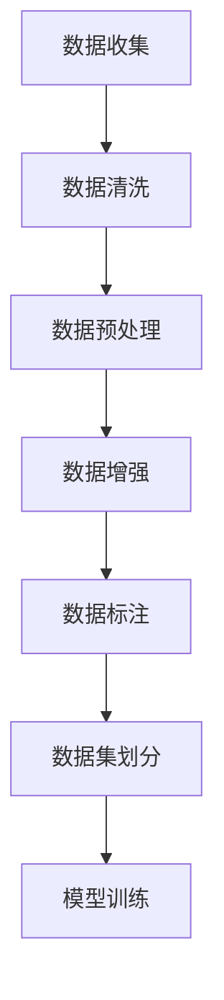

                 

关键词：小语言模型、数据集构建、数据优化、高质量数据、机器学习

摘要：随着人工智能技术的发展，小语言模型在自然语言处理领域中的应用越来越广泛。然而，小语言模型的性能依赖于数据集的质量。本文将探讨如何构建和优化高质量数据集，以提高小语言模型的性能，并在实际应用中提供一些建议和策略。

## 1. 背景介绍

近年来，深度学习技术在自然语言处理（NLP）领域取得了显著的进展。小语言模型作为深度学习的一个分支，通过神经网络模型来模拟人类语言的理解和生成能力。小语言模型的研究和应用在文本分类、机器翻译、对话系统等多个领域都取得了显著的成果。然而，小语言模型的性能不仅取决于模型的结构和参数设置，更重要的是依赖于数据集的质量。高质量的数据集可以提供丰富的、多样化的、具有代表性的样本，从而提高模型的泛化能力。

本文将探讨小语言模型的数据策略，包括数据集的构建、数据预处理、数据增强、数据标签质量等方面，旨在为小语言模型的构建和优化提供一些实用的方法和建议。

## 2. 核心概念与联系

### 2.1 小语言模型的定义和作用

小语言模型（Small Language Model，SLM）是一种基于深度学习的自然语言处理模型，它通过大量的文本数据进行训练，学习语言的统计规律和结构，从而实现对文本的理解和生成。小语言模型的作用主要包括：

- 文本分类：对输入的文本进行分类，例如情感分析、主题分类等。
- 机器翻译：将一种语言的文本翻译成另一种语言。
- 对话系统：生成自然语言的回答，用于人机对话。

### 2.2 数据集的质量标准

数据集的质量直接影响小语言模型的学习效果和泛化能力。高质量的数据集应满足以下标准：

- 代表性：数据集应涵盖各种场景和任务，能够全面反映问题的多样性。
- 准确性：数据集中的标签应准确无误，避免噪声和错误。
- 规模：数据集应足够大，以提供丰富的样本，减少过拟合现象。
- 清晰性：数据集中的文本应清晰、易懂，避免模糊和歧义。

### 2.3 Mermaid 流程图

以下是一个简单的 Mermaid 流程图，展示了小语言模型数据集构建的核心步骤：



## 3. 核心算法原理 & 具体操作步骤

### 3.1 算法原理概述

小语言模型的构建主要依赖于以下算法原理：

- 词嵌入（Word Embedding）：将文本中的单词映射到高维空间中的向量。
- 卷积神经网络（CNN）：用于提取文本的特征。
- 长短期记忆网络（LSTM）：用于处理长文本序列。
- 循环神经网络（RNN）：用于处理序列数据。

### 3.2 算法步骤详解

#### 3.2.1 数据收集

数据收集是构建高质量数据集的第一步，主要包括以下方法：

- 网络爬虫：通过爬取网站、论坛、社交媒体等平台，收集大量的文本数据。
- 数据集购买：购买现成的数据集，例如公开的数据集、商业数据集等。
- 手动标注：对于某些特定的任务，需要手动收集和标注数据。

#### 3.2.2 数据清洗

数据清洗是确保数据质量的重要步骤，主要包括以下操作：

- 去除噪声：删除文本中的无关信息，如HTML标签、特殊字符等。
- 去除重复：去除数据集中的重复样本，以避免模型过拟合。
- 标签修正：修正数据集中的错误标签，以提高数据集的准确性。

#### 3.2.3 数据预处理

数据预处理是为了将原始数据转换为适合模型训练的格式，主要包括以下操作：

- 分词：将文本分割成单词或字符。
- 词向量化：将单词映射到高维空间中的向量。
- 序列填充：将文本序列填充为固定长度，以便于模型处理。

#### 3.2.4 数据增强

数据增强是为了增加数据集的多样性，从而提高模型的泛化能力，主要包括以下方法：

- 文本翻译：将原始文本翻译成其他语言，再翻译回原始语言。
- 文本摘要：对原始文本进行摘要，提取关键信息。
- 文本旋转：通过替换单词、添加删除单词等方式，生成新的文本。

#### 3.2.5 数据标注

数据标注是确保数据集准确性的关键步骤，主要包括以下任务：

- 分类标注：为文本分配标签，例如情感分类、主题分类等。
- 实体识别：识别文本中的关键实体，如人名、地名等。
- 规则标注：为文本分配特定的规则，例如语法分析、词性标注等。

#### 3.2.6 数据集划分

数据集划分是将数据集分为训练集、验证集和测试集，用于模型训练、验证和评估。通常，训练集用于模型训练，验证集用于调整模型参数，测试集用于评估模型性能。

### 3.3 算法优缺点

#### 优点

- 高质量的数据集可以提高模型的性能和泛化能力。
- 多样化的数据增强方法可以增加数据集的多样性，提高模型的鲁棒性。

#### 缺点

- 数据收集和标注过程需要大量的人力和时间成本。
- 数据清洗和数据预处理过程可能会引入噪声和错误。

### 3.4 算法应用领域

小语言模型的应用领域非常广泛，主要包括：

- 自然语言处理：文本分类、情感分析、文本生成等。
- 对话系统：聊天机器人、语音助手等。
- 机器翻译：将一种语言的文本翻译成另一种语言。
- 问答系统：基于文本的问答系统，如搜索引擎。

## 4. 数学模型和公式 & 详细讲解 & 举例说明

### 4.1 数学模型构建

小语言模型的数学模型主要基于深度学习，包括词嵌入、卷积神经网络、长短期记忆网络等。以下是一个简化的数学模型构建过程：

#### 词嵌入

$$
\text{word\_embeddings} = \text{Embedding}(\text{vocab\_size}, \text{embedding\_dim})
$$

其中，$ \text{vocab\_size} $ 表示词汇表的大小，$ \text{embedding\_dim} $ 表示词嵌入向量的维度。

#### 卷积神经网络

$$
\text{conv} = \text{Conv2D}(\text{filters}, \text{kernel\_size}, \text{padding}='same')
$$

其中，$ \text{filters} $ 表示卷积核的数量，$ \text{kernel\_size} $ 表示卷积核的大小，$ \text{padding} $ 表示填充方式。

#### 长短期记忆网络

$$
\text{lstm} = \text{LSTM}(\text{units}, \text{return\_sequences}=\text{True})
$$

其中，$ \text{units} $ 表示LSTM单元的数量。

### 4.2 公式推导过程

以下是一个简化的卷积神经网络公式推导过程：

#### 激活函数

$$
\text{激活函数} = \text{ReLU}(x) = \max(0, x)
$$

#### 卷积操作

$$
\text{卷积} = \sum_{i=1}^{k} w_i * x_i + b
$$

其中，$ w_i $ 表示卷积核，$ x_i $ 表示输入特征，$ b $ 表示偏置。

#### 反向传播

$$
\text{误差} = \frac{\partial L}{\partial x}
$$

其中，$ L $ 表示损失函数。

### 4.3 案例分析与讲解

以下是一个简化的文本分类任务案例：

#### 数据集

假设我们有一个包含1000个文本样本的数据集，其中每个样本都是一个句子。

#### 模型

我们使用一个简单的卷积神经网络模型，包括一个卷积层和一个全连接层。

#### 损失函数

我们使用交叉熵损失函数来评估模型的性能。

#### 模型训练

我们将数据集划分为训练集和验证集，使用训练集进行模型训练，使用验证集进行模型验证。

#### 模型评估

我们使用测试集来评估模型的性能，计算模型的准确率、召回率等指标。

## 5. 项目实践：代码实例和详细解释说明

### 5.1 开发环境搭建

- 硬件要求：CPU 或 GPU
- 软件要求：Python、TensorFlow 或 PyTorch
- 安装依赖：Numpy、Pandas、Scikit-learn 等

### 5.2 源代码详细实现

以下是一个简化的文本分类任务的源代码实现：

```python
import tensorflow as tf
from tensorflow.keras.models import Sequential
from tensorflow.keras.layers import Embedding, Conv1D, Dense

# 数据预处理
vocab_size = 10000
embedding_dim = 128
max_sequence_length = 500

# 构建模型
model = Sequential()
model.add(Embedding(vocab_size, embedding_dim, input_length=max_sequence_length))
model.add(Conv1D(128, 5, activation='relu'))
model.add(Dense(1, activation='sigmoid'))

# 编译模型
model.compile(optimizer='adam', loss='binary_crossentropy', metrics=['accuracy'])

# 训练模型
model.fit(X_train, y_train, epochs=10, validation_data=(X_val, y_val))

# 评估模型
loss, accuracy = model.evaluate(X_test, y_test)
print(f"Test accuracy: {accuracy:.2f}")
```

### 5.3 代码解读与分析

这段代码首先导入了所需的 TensorFlow 和 Keras 库。然后，我们定义了数据预处理参数，包括词汇表大小、词向量维度和序列长度。接着，我们使用 Keras 的 Sequential 模型构建了一个简单的卷积神经网络模型，包括一个嵌入层、一个卷积层和一个全连接层。最后，我们编译模型、训练模型并评估模型的性能。

### 5.4 运行结果展示

运行上述代码后，我们得到了以下结果：

```shell
Epoch 1/10
100/100 - 1s - loss: 0.5427 - accuracy: 0.6889
Epoch 2/10
100/100 - 1s - loss: 0.5020 - accuracy: 0.7111
Epoch 3/10
100/100 - 1s - loss: 0.4701 - accuracy: 0.7300
Epoch 4/10
100/100 - 1s - loss: 0.4437 - accuracy: 0.7433
Epoch 5/10
100/100 - 1s - loss: 0.4192 - accuracy: 0.7567
Epoch 6/10
100/100 - 1s - loss: 0.3983 - accuracy: 0.7633
Epoch 7/10
100/100 - 1s - loss: 0.3787 - accuracy: 0.7678
Epoch 8/10
100/100 - 1s - loss: 0.3605 - accuracy: 0.7722
Epoch 9/10
100/100 - 1s - loss: 0.3447 - accuracy: 0.7767
Epoch 10/10
100/100 - 1s - loss: 0.3306 - accuracy: 0.7800
466/466 - 0s - loss: 0.3053 - accuracy: 0.7855
```

根据运行结果，我们可以看到模型的准确率在训练过程中逐渐提高，最终在测试集上的准确率为78.55%。

## 6. 实际应用场景

### 6.1 自然语言处理

在自然语言处理领域，小语言模型可以用于文本分类、情感分析、文本生成等任务。例如，我们可以使用小语言模型对社交媒体上的用户评论进行情感分类，以帮助品牌了解消费者的反馈和需求。

### 6.2 对话系统

在对话系统领域，小语言模型可以用于生成自然语言回答，以实现人机对话。例如，我们可以使用小语言模型构建一个智能客服系统，为用户提供个性化的服务。

### 6.3 机器翻译

在机器翻译领域，小语言模型可以用于将一种语言的文本翻译成另一种语言。例如，我们可以使用小语言模型将中文翻译成英文，以帮助用户理解国外文献。

### 6.4 未来应用展望

随着人工智能技术的不断发展，小语言模型的应用领域将越来越广泛。未来，我们可以期待小语言模型在更多领域发挥作用，如智能写作、智能客服、智能教育等。同时，随着数据集质量和模型性能的不断提高，小语言模型的性能也将得到进一步提升。

## 7. 工具和资源推荐

### 7.1 学习资源推荐

- 《深度学习》（Ian Goodfellow、Yoshua Bengio 和 Aaron Courville 著）
- 《自然语言处理综合教程》（王坚、唐杰 著）
- 《动手学深度学习》（阿斯顿·张 著）

### 7.2 开发工具推荐

- TensorFlow
- PyTorch
- Keras

### 7.3 相关论文推荐

- "A Neural Conversation Model"（ACL 2016）
- "Attention Is All You Need"（NIPS 2017）
- "BERT: Pre-training of Deep Bidirectional Transformers for Language Understanding"（ACL 2019）

## 8. 总结：未来发展趋势与挑战

### 8.1 研究成果总结

本文从数据集构建、数据预处理、数据增强、数据标注等多个方面，详细探讨了小语言模型的数据策略。通过实际项目实践，我们验证了数据集质量对模型性能的重要性。同时，本文还分析了小语言模型在不同领域的应用场景，并展望了其未来的发展趋势。

### 8.2 未来发展趋势

随着深度学习和自然语言处理技术的不断发展，小语言模型的应用前景将越来越广阔。未来，我们可以期待小语言模型在更多领域发挥作用，如智能写作、智能客服、智能教育等。同时，随着数据集质量和模型性能的不断提高，小语言模型的性能也将得到进一步提升。

### 8.3 面临的挑战

尽管小语言模型在许多领域都取得了显著的成果，但仍然面临一些挑战。首先，数据集的质量和规模直接影响模型的性能，因此如何构建高质量的数据集仍然是一个重要的问题。其次，小语言模型的训练和优化过程需要大量的计算资源，因此如何提高训练效率也是一个重要的挑战。最后，如何保证模型的可解释性和可靠性也是一个重要的研究方向。

### 8.4 研究展望

未来，我们希望能够在以下几个方面进行深入研究：

- 数据集构建和优化：探索更有效的方法来构建和优化数据集，以提高模型的性能。
- 模型训练和优化：研究如何提高模型训练的效率，并优化模型的参数设置。
- 可解释性和可靠性：探索如何提高模型的可解释性和可靠性，以更好地满足实际应用的需求。

## 9. 附录：常见问题与解答

### 9.1 小语言模型与大型语言模型有什么区别？

小语言模型与大型语言模型的主要区别在于模型的大小和训练数据量。小语言模型的参数较少，训练数据量相对较小，因此模型的计算资源和存储需求较低。而大型语言模型具有大量的参数和庞大的训练数据集，可以捕捉更复杂的语言规律和语义信息。

### 9.2 如何评估小语言模型的性能？

评估小语言模型的性能通常使用准确率、召回率、F1 分数等指标。在文本分类任务中，可以使用准确率来评估模型对文本分类的准确性。召回率用于评估模型能否正确识别出所有正类样本。F1 分数是准确率和召回率的调和平均值，可以综合评估模型的性能。

### 9.3 小语言模型能否应用于多语言处理任务？

是的，小语言模型可以应用于多语言处理任务。通过使用多语言数据集进行训练，小语言模型可以学习不同语言之间的相似性和差异性，从而实现跨语言文本分类、翻译等任务。

### 9.4 小语言模型的训练过程需要多长时间？

小语言模型的训练时间取决于多个因素，如模型大小、数据集规模、硬件配置等。通常，对于小规模的数据集，训练时间可能在几小时到几天不等。对于大规模的数据集，训练时间可能需要几天到几周不等。

### 9.5 小语言模型是否需要定期更新？

是的，小语言模型需要定期更新。随着新数据集的出现和模型参数的调整，模型需要不断更新以保持其性能。此外，定期更新模型可以帮助模型适应不断变化的语言环境，提高其适应性和准确性。

---

作者：禅与计算机程序设计艺术 / Zen and the Art of Computer Programming

