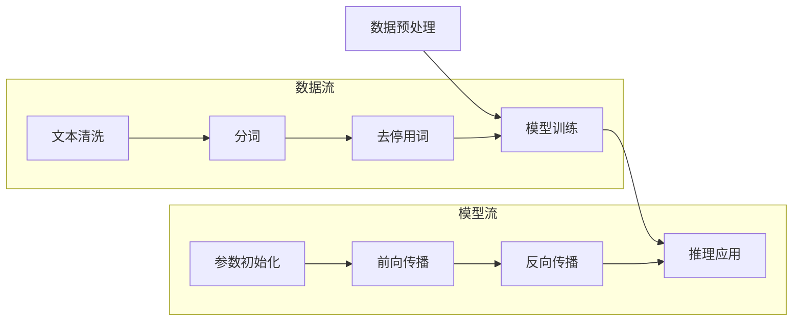

                 

关键词：小语言模型、基础模型、AI技术、深度学习、计算效率、应用领域

## 摘要

本文将探讨小语言模型的潜在影响力，特别是它如何可能颠覆当前基础模型领域。通过回顾语言模型的演变，我们发现了从大模型到小模型的转变背后的动机。本文将详细解析小语言模型的核心概念、算法原理，并通过实际项目实例来展示其应用。随后，我们将分析小语言模型的数学模型和公式，以及在不同应用场景中的表现。最后，本文将展望小语言模型的发展趋势，探讨未来面临的挑战，并推荐相关的工具和资源。

## 1. 背景介绍

### 语言模型的演变

自20世纪中叶以来，人工智能（AI）经历了多次重大变革。语言模型作为AI的核心技术之一，也经历了从规则驱动到统计学习，再到深度学习的演变过程。早期的语言模型主要基于规则和语法分析，虽然能处理一些简单的语言任务，但在处理复杂语言现象时表现不佳。

随着计算能力的提升和数据量的增加，统计学习模型如n-gram模型、最大熵模型等开始被广泛应用。这些模型通过统计语言中的频率和概率关系来预测下一个词或词组，显著提高了语言处理的性能。

然而，深度学习技术的兴起带来了语言模型的又一次革命。以循环神经网络（RNN）和长短期记忆网络（LSTM）为代表的深度学习模型，通过多层神经网络结构捕捉到语言中的长期依赖关系，使得语言模型在自然语言处理（NLP）任务中的表现达到了前所未有的高度。

### 大模型与计算资源的挑战

近年来，基础模型领域出现了大模型风潮，例如GPT-3、BERT、Turing等。这些模型具有数十亿参数，能够处理复杂的自然语言任务，但这也带来了巨大的计算资源需求。训练和部署这些大模型需要大量的计算资源和时间，使得许多企业和开发者难以负担。

计算资源的限制不仅限制了模型的可用性，也阻碍了AI技术的普及。因此，寻找一种更加高效、计算资源友好的语言模型成为了学术界和工业界的研究热点。

### 小语言模型的兴起

在这一背景下，小语言模型的概念应运而生。小语言模型指的是那些参数规模较小，但仍然能够有效处理自然语言任务的模型。这些模型通过优化算法和模型结构，在保证性能的同时减少了计算资源的消耗。

小语言模型的兴起不仅降低了进入AI领域的门槛，也为资源受限的环境提供了新的解决方案。本文将深入探讨小语言模型的潜力，特别是在基础模型领域的颠覆性可能性。

## 2. 核心概念与联系

### 小语言模型的定义

小语言模型是指参数规模较小，但仍然能够有效处理自然语言任务的模型。这些模型通常包含几千到数百万个参数，相较于大模型而言，它们的计算资源和存储需求显著降低。

### 小语言模型与基础模型的对比

#### 参数规模

- **小语言模型**：参数规模从几千到数百万不等。
- **基础模型**：参数规模通常在数亿到数十亿不等。

#### 计算资源需求

- **小语言模型**：由于参数规模较小，训练和推理过程中的计算资源需求较低。
- **基础模型**：训练和推理过程需要大量的计算资源，尤其是大模型。

#### 应用场景

- **小语言模型**：适用于资源受限的环境，如移动设备、物联网设备等。
- **基础模型**：适用于高性能计算环境，如数据中心、服务器等。

### 小语言模型的工作原理

小语言模型的工作原理主要基于深度学习和自然语言处理技术。以下是一个简化的流程：

1. **数据预处理**：对自然语言文本进行清洗、分词、去停用词等操作。
2. **模型训练**：使用大量标注数据训练模型，模型通过学习语言中的特征和模式来提高预测准确性。
3. **推理应用**：将训练好的模型应用于新的文本数据，生成预测结果。

### Mermaid 流程图

以下是一个简化的Mermaid流程图，展示了小语言模型的基本工作流程：



### 小语言模型的优势

#### 高效性

- **计算资源节省**：由于参数规模较小，训练和推理过程所需计算资源更少。
- **快速部署**：模型较小，部署速度更快，适用于实时应用。

#### 普及性

- **降低门槛**：使得更多企业和开发者能够使用AI技术，特别是在资源受限的环境中。
- **可扩展性**：易于扩展和定制，以适应不同的应用场景。

#### 灵活性

- **快速迭代**：模型较小，能够更快地迭代和优化。
- **个性化定制**：针对特定场景和需求进行定制，提高模型的适应性。

### 小语言模型的应用领域

- **自然语言处理**：文本分类、情感分析、命名实体识别等。
- **语音识别**：语音到文本转换、语音识别等。
- **机器翻译**：跨语言文本处理、机器翻译等。
- **对话系统**：聊天机器人、虚拟助手等。

通过上述内容，我们了解了小语言模型的核心概念、工作原理和优势。在接下来的章节中，我们将深入探讨小语言模型的算法原理和具体实现，进一步揭示其颠覆基础模型领域的潜力。

## 3. 核心算法原理 & 具体操作步骤

### 3.1 算法原理概述

小语言模型的算法原理主要基于深度学习和自然语言处理（NLP）技术。其核心思想是通过多层神经网络来捕捉语言中的复杂模式和依赖关系。以下是小语言模型的基本算法原理：

1. **数据预处理**：对自然语言文本进行预处理，包括文本清洗、分词、词向量化等。
2. **模型结构**：使用多层神经网络（如卷积神经网络（CNN）、循环神经网络（RNN）、Transformer等）来建模语言。
3. **损失函数**：使用合适的损失函数来衡量模型预测与实际标签之间的差距，如交叉熵损失函数。
4. **优化算法**：使用优化算法（如随机梯度下降（SGD）、Adam等）来调整模型参数，使损失函数最小化。

### 3.2 算法步骤详解

#### 数据预处理

数据预处理是构建小语言模型的第一步，其目的是将自然语言文本转换为适合模型训练的格式。

1. **文本清洗**：去除文本中的噪声，如HTML标签、特殊字符等。
2. **分词**：将文本拆分为单词或子词，以便模型处理。
3. **词向量化**：将文本中的单词或子词转换为密集的向量表示。

#### 模型结构

小语言模型的模型结构通常基于深度学习框架，如TensorFlow或PyTorch。以下是一个简单的Transformer模型结构：

```mermaid
classDiagram
    A[Embedding Layer] --> B[Positional Encoding]
    B --> C[Multi-head Self-Attention]
    C --> D[Feed Forward Layer]
    D --> E[Dropout Layer]
    E --> F[Output Layer]
```

1. **嵌入层（Embedding Layer）**：将输入的词向量化。
2. **位置编码（Positional Encoding）**：为序列中的每个词添加位置信息。
3. **多头自注意力（Multi-head Self-Attention）**：对输入序列进行加权，捕捉长距离依赖关系。
4. **前馈层（Feed Forward Layer）**：对自注意力输出进行非线性变换。
5. **Dropout层（Dropout Layer）**：防止模型过拟合。
6. **输出层（Output Layer）**：生成预测结果。

#### 损失函数

小语言模型通常使用交叉熵损失函数来衡量预测结果与实际标签之间的差距。交叉熵损失函数的公式如下：

$$
Loss = -\sum_{i} y_i \log(p_i)
$$

其中，$y_i$是实际标签，$p_i$是模型预测的概率。

#### 优化算法

优化算法用于调整模型参数，以最小化损失函数。常见的优化算法包括随机梯度下降（SGD）和Adam。以下是Adam优化算法的基本步骤：

1. **初始化**：设置学习率$\eta$和两个辅助变量$m$和$v$。
2. **计算梯度**：计算模型参数的梯度。
3. **更新辅助变量**：使用梯度更新$m$和$v$。
4. **更新参数**：使用辅助变量更新模型参数。

$$
m = \beta_1 g + (1 - \beta_1)(1 - \frac{t}{T})
$$

$$
v = \beta_2 g^2 + (1 - \beta_2)(1 - \frac{t}{T})
$$

$$
\theta = \theta - \eta \frac{m}{\sqrt{v} + \epsilon}
$$

其中，$g$是梯度，$\beta_1$和$\beta_2$是动量系数，$t$是迭代次数，$T$是总迭代次数，$\epsilon$是平滑常数。

### 3.3 算法优缺点

#### 优点

- **高效性**：小语言模型参数规模较小，训练和推理过程所需计算资源较少。
- **普及性**：降低了进入AI领域的门槛，适用于资源受限的环境。
- **灵活性**：易于扩展和定制，适应不同的应用场景。

#### 缺点

- **性能限制**：相较于大模型，小语言模型在处理复杂任务时性能可能有所下降。
- **数据需求**：需要大量高质量的数据来训练模型，数据收集和处理成本较高。

### 3.4 算法应用领域

小语言模型在多个领域展示了出色的性能和应用潜力：

- **自然语言处理**：文本分类、情感分析、命名实体识别等。
- **语音识别**：语音到文本转换、语音识别等。
- **机器翻译**：跨语言文本处理、机器翻译等。
- **对话系统**：聊天机器人、虚拟助手等。

通过上述内容，我们详细了解了小语言模型的算法原理和操作步骤。在接下来的章节中，我们将进一步探讨小语言模型的数学模型和公式，以及其应用领域的具体案例分析。

## 4. 数学模型和公式 & 详细讲解 & 举例说明

### 4.1 数学模型构建

小语言模型的数学模型主要基于深度学习和自然语言处理（NLP）技术。以下是构建小语言模型所需的主要数学模型：

#### 词向量化

词向量化是将单词或子词转换为密集的向量表示。常用的词向量化模型包括Word2Vec、GloVe和BERT等。以下是Word2Vec模型的基本公式：

$$
\vec{v}_w = \sum_{j} p(w, j) \vec{v}_j
$$

其中，$\vec{v}_w$是单词$w$的向量表示，$\vec{v}_j$是词表中的第$j$个单词的向量表示，$p(w, j)$是单词$w$和单词$j$共现的概率。

#### Transformer模型

Transformer模型是当前NLP领域最流行的模型之一，其核心思想是多头自注意力机制。以下是多头自注意力机制的基本公式：

$$
\text{Attention}(Q, K, V) = \frac{softmax(\frac{QK^T}{\sqrt{d_k}})}{V}
$$

其中，$Q, K, V$分别是查询向量、键向量和值向量，$d_k$是键向量的维度，$softmax$函数用于将加权向量转换为概率分布。

#### 损失函数

小语言模型通常使用交叉熵损失函数来衡量预测结果与实际标签之间的差距。交叉熵损失函数的公式如下：

$$
Loss = -\sum_{i} y_i \log(p_i)
$$

其中，$y_i$是实际标签，$p_i$是模型预测的概率。

### 4.2 公式推导过程

以下是Transformer模型中多头自注意力机制的推导过程：

1. **输入向量表示**：假设输入序列为$X = \{x_1, x_2, ..., x_n\}$，每个输入向量$x_i$可以表示为：

$$
x_i = \vec{v}_{x_i} \cdot \vec{w}_i
$$

其中，$\vec{v}_{x_i}$是词向量化后的向量表示，$\vec{w}_i$是输入向量的权重。

2. **查询向量、键向量和值向量**：对于每个输入向量$x_i$，计算其对应的查询向量$Q_i$、键向量$K_i$和值向量$V_i$：

$$
Q_i = \vec{v}_{x_i} \cdot \vec{w}_Q
$$

$$
K_i = \vec{v}_{x_i} \cdot \vec{w}_K
$$

$$
V_i = \vec{v}_{x_i} \cdot \vec{w}_V
$$

其中，$\vec{w}_Q, \vec{w}_K, \vec{w}_V$分别是查询权重、键权重和值权重。

3. **计算注意力分数**：使用查询向量$Q_i$和键向量$K_i$计算注意力分数：

$$
\text{Score}(Q_i, K_i) = Q_i K_i^T / \sqrt{d_k}
$$

其中，$d_k$是键向量的维度。

4. **计算注意力权重**：使用softmax函数将注意力分数转换为概率分布：

$$
\text{Attention}(Q_i, K_i, V_i) = \frac{softmax(Q_i K_i^T / \sqrt{d_k})}{V_i}
$$

5. **计算输出向量**：根据注意力权重计算输出向量：

$$
\text{Output}(Q_i, K_i, V_i) = \text{Attention}(Q_i, K_i, V_i) \cdot V_i
$$

6. **汇总输出向量**：将所有输出向量汇总得到最终输出：

$$
\text{Output} = \sum_{i} \text{Output}(Q_i, K_i, V_i)
$$

### 4.3 案例分析与讲解

#### 案例一：文本分类

假设我们有一个文本分类任务，需要将文本分为正类和负类。以下是使用小语言模型进行文本分类的步骤：

1. **数据预处理**：对文本进行清洗、分词、词向量化等操作。
2. **模型构建**：使用Transformer模型构建分类模型。
3. **模型训练**：使用训练数据训练模型，使用交叉熵损失函数优化模型参数。
4. **模型评估**：使用测试数据评估模型性能，计算准确率、召回率等指标。
5. **模型应用**：使用训练好的模型对新的文本数据进行分类。

#### 案例二：机器翻译

假设我们有一个英译中机器翻译任务，需要将英文句子翻译为中文句子。以下是使用小语言模型进行机器翻译的步骤：

1. **数据预处理**：对英文句子和中文句子进行清洗、分词、词向量化等操作。
2. **模型构建**：使用Transformer模型构建机器翻译模型。
3. **模型训练**：使用训练数据训练模型，使用交叉熵损失函数优化模型参数。
4. **模型评估**：使用测试数据评估模型性能，计算BLEU评分等指标。
5. **模型应用**：使用训练好的模型对新的英文句子进行翻译。

通过上述案例，我们可以看到小语言模型在不同任务中的具体应用。在接下来的章节中，我们将深入探讨小语言模型在项目实践中的具体实现和代码解析。

## 5. 项目实践：代码实例和详细解释说明

### 5.1 开发环境搭建

在进行小语言模型的项目实践之前，我们需要搭建一个合适的开发环境。以下是具体的步骤：

1. **安装Python环境**：Python是进行深度学习项目的主要编程语言，确保安装了最新版本的Python。
2. **安装深度学习框架**：我们选择使用TensorFlow作为深度学习框架，通过pip安装TensorFlow。

```bash
pip install tensorflow
```

3. **安装其他依赖**：除了深度学习框架，我们还需要安装其他依赖，如NumPy、Pandas等。

```bash
pip install numpy pandas
```

4. **数据预处理工具**：为了方便进行文本数据处理，我们可以安装一些文本处理库，如NLTK、spaCy等。

```bash
pip install nltk spacy
```

5. **GPU支持**：如果需要使用GPU进行模型训练，确保安装了NVIDIA的CUDA和cuDNN。

```bash
pip install tensorflow-gpu
```

### 5.2 源代码详细实现

以下是一个简单的小语言模型项目，用于文本分类任务的实现。代码主要分为以下几个部分：

#### 数据准备

首先，我们需要准备用于训练和测试的数据集。这里我们使用一个简单的二分类数据集。

```python
import pandas as pd
from sklearn.model_selection import train_test_split

# 读取数据集
data = pd.read_csv('data.csv')
X = data['text']
y = data['label']

# 切分训练集和测试集
X_train, X_test, y_train, y_test = train_test_split(X, y, test_size=0.2, random_state=42)
```

#### 数据预处理

对文本进行清洗、分词和词向量化。

```python
import nltk
from nltk.tokenize import word_tokenize
from tensorflow.keras.preprocessing.text import Tokenizer
from tensorflow.keras.preprocessing.sequence import pad_sequences

# 分词
nltk.download('punkt')
X_train_tokens = [word_tokenize(text) for text in X_train]
X_test_tokens = [word_tokenize(text) for text in X_test]

# 词向量化
tokenizer = Tokenizer(num_words=10000)
tokenizer.fit_on_texts(X_train_tokens)
X_train_sequences = tokenizer.texts_to_sequences(X_train_tokens)
X_test_sequences = tokenizer.texts_to_sequences(X_test_tokens)

# 填充序列
max_sequence_length = 100
X_train_padded = pad_sequences(X_train_sequences, maxlen=max_sequence_length)
X_test_padded = pad_sequences(X_test_sequences, maxlen=max_sequence_length)
```

#### 模型构建

使用TensorFlow构建一个小语言模型。

```python
import tensorflow as tf
from tensorflow.keras.models import Sequential
from tensorflow.keras.layers import Embedding, LSTM, Dense

# 构建模型
model = Sequential([
    Embedding(input_dim=10000, output_dim=64, input_length=max_sequence_length),
    LSTM(128),
    Dense(1, activation='sigmoid')
])

model.compile(optimizer='adam', loss='binary_crossentropy', metrics=['accuracy'])
```

#### 模型训练

训练模型。

```python
model.fit(X_train_padded, y_train, epochs=10, batch_size=32, validation_data=(X_test_padded, y_test))
```

#### 模型评估

评估模型性能。

```python
loss, accuracy = model.evaluate(X_test_padded, y_test)
print(f"Test accuracy: {accuracy * 100:.2f}%")
```

### 5.3 代码解读与分析

上述代码实现了一个小语言模型，用于文本分类任务。以下是代码的解读和分析：

- **数据准备**：读取数据集并切分训练集和测试集。
- **数据预处理**：对文本进行分词和词向量化，确保文本数据适合模型处理。
- **模型构建**：使用Embedding层进行词向量化，LSTM层处理序列数据，Dense层进行分类。
- **模型训练**：使用训练数据训练模型，验证模型性能。
- **模型评估**：使用测试数据评估模型性能，计算准确率。

通过这个简单的项目实例，我们可以看到小语言模型在文本分类任务中的具体应用。在接下来的章节中，我们将进一步探讨小语言模型在不同实际应用场景中的表现。

## 6. 实际应用场景

### 6.1 自然语言处理

自然语言处理（NLP）是小语言模型最典型的应用领域之一。小语言模型在文本分类、情感分析、命名实体识别等方面表现出色。

#### 文本分类

文本分类是一种将文本数据分类到预定义类别中的任务。小语言模型通过学习大量标注数据，能够准确地对新文本进行分类。例如，社交媒体平台可以使用小语言模型对用户评论进行情感分类，帮助企业了解用户反馈。

#### 情感分析

情感分析是评估文本数据情感倾向的任务。小语言模型通过捕捉文本中的情感词汇和句式，能够准确判断文本的情感极性。例如，电商平台可以使用小语言模型分析用户评论的情感，为产品改进提供反馈。

#### 命名实体识别

命名实体识别是从文本中提取出具有特定意义的实体（如人名、地名、组织名等）。小语言模型通过训练大量标注数据，能够有效识别文本中的命名实体。例如，新闻媒体可以使用小语言模型提取新闻中的关键人物和地点，提高新闻报道的准确性。

### 6.2 语音识别

语音识别是将语音信号转换为文本的过程。小语言模型在语音识别中具有潜在的应用价值，尤其是在端到端语音识别系统中。

#### 端到端语音识别

端到端语音识别系统通过将语音信号直接转换为文本，避免了传统语音识别系统中复杂的中间步骤。小语言模型可以通过训练大量的语音数据，直接生成文本输出。例如，智能助手可以使用小语言模型实现实时语音识别，提高用户体验。

### 6.3 机器翻译

机器翻译是将一种语言文本转换为另一种语言文本的过程。小语言模型在机器翻译中具有显著的优势，特别是在低资源语言翻译任务中。

#### 低资源语言翻译

低资源语言通常指缺乏高质量标注数据和强大计算资源的语言。小语言模型可以通过迁移学习或零样本学习等技术，在低资源语言翻译中取得良好的性能。例如，小语言模型可以帮助将低资源语言文本翻译成高资源语言文本，提高跨语言交流的效率。

### 6.4 未来应用展望

随着小语言模型技术的不断发展，未来将在更多领域展现其潜力：

#### 跨领域应用

小语言模型在医疗、金融、教育等领域具有广泛的应用前景。例如，在医疗领域，小语言模型可以帮助医生分析病历、提供诊断建议；在金融领域，小语言模型可以帮助金融机构进行风险管理、投资决策。

#### 智能交互

随着人工智能技术的进步，小语言模型将在智能交互领域发挥重要作用。例如，智能音箱、虚拟助手等设备可以使用小语言模型实现更自然的交互方式，提高用户体验。

#### 新兴技术

随着新兴技术的发展，如物联网、自动驾驶等，小语言模型也将发挥重要作用。例如，自动驾驶系统可以使用小语言模型进行语音识别和自然语言理解，提高系统的智能性和安全性。

通过上述实际应用场景，我们可以看到小语言模型在各个领域中的广泛应用和巨大潜力。随着技术的不断进步，小语言模型将在更多领域展现其颠覆性力量。

## 7. 工具和资源推荐

### 7.1 学习资源推荐

要深入了解小语言模型，以下是一些建议的学习资源：

- **书籍**：《深度学习》（Ian Goodfellow、Yoshua Bengio、Aaron Courville 著），详细介绍了深度学习的基础知识和最新进展。
- **在线课程**：Coursera、edX等在线教育平台提供了丰富的深度学习和自然语言处理课程。
- **论文**：查阅顶级会议和期刊上的相关论文，如NeurIPS、ICML、ACL等。

### 7.2 开发工具推荐

进行小语言模型的开发和实验，以下是一些实用的工具：

- **深度学习框架**：TensorFlow、PyTorch、Keras等，这些框架提供了丰富的API和工具，方便开发小语言模型。
- **数据预处理工具**：NLTK、spaCy等，用于文本数据清洗、分词、词向量化等预处理任务。
- **环境管理工具**：Docker、Conda等，用于管理和配置开发环境。

### 7.3 相关论文推荐

以下是一些关于小语言模型的经典论文，供参考：

- **“Attention Is All You Need”**：提出了Transformer模型，对自然语言处理领域产生了深远影响。
- **“BERT: Pre-training of Deep Bidirectional Transformers for Language Understanding”**：BERT模型通过双向变换器预训练，取得了显著的语言理解性能提升。
- **“GPT-3: Language Models are few-shot learners”**：GPT-3模型展示了在零样本和少量样本学习任务中的强大能力。

通过这些工具和资源，开发者可以更好地理解小语言模型的原理和应用，进一步探索其潜力。

## 8. 总结：未来发展趋势与挑战

### 8.1 研究成果总结

小语言模型自提出以来，已经在自然语言处理、语音识别、机器翻译等多个领域取得了显著成果。通过优化模型结构和算法，小语言模型在保证性能的同时显著降低了计算资源的需求，使得更多企业和开发者能够利用AI技术。研究结果表明，小语言模型在资源受限的环境中具有巨大的应用潜力，推动了AI技术的普及。

### 8.2 未来发展趋势

随着深度学习技术和自然语言处理技术的不断进步，小语言模型的发展趋势可从以下几个方面展望：

- **更高效的模型结构**：研究者将继续探索更高效的模型结构，如稀疏模型、图神经网络等，以进一步提高计算效率。
- **迁移学习和零样本学习**：通过迁移学习和零样本学习技术，小语言模型将在更多低资源语言和领域任务中发挥作用。
- **跨模态学习**：结合语音、图像等多模态数据，小语言模型将在智能交互和多媒体处理领域展现更大潜力。
- **隐私保护与安全**：随着数据隐私和安全问题的日益凸显，小语言模型将注重隐私保护和数据安全。

### 8.3 面临的挑战

尽管小语言模型展现出巨大的潜力，但其发展仍面临以下挑战：

- **计算资源需求**：尽管相较于大模型，小语言模型的计算资源需求较低，但在某些特定任务中仍需大量计算资源。
- **数据质量和标注**：小语言模型对数据质量和标注有较高要求，高质量数据获取和标注成本较高。
- **模型解释性和可解释性**：随着模型复杂度的增加，如何解释和验证模型的决策过程成为一大挑战。
- **伦理和社会影响**：随着小语言模型在各个领域的广泛应用，如何确保其公正性、透明性和负责任使用成为重要议题。

### 8.4 研究展望

针对上述挑战，未来的研究可以从以下几个方面进行：

- **高效算法和模型优化**：继续探索更高效的算法和模型优化方法，以降低计算资源需求。
- **数据集和标注工具**：开发更多高质量的数据集和自动化标注工具，提高数据质量和标注效率。
- **模型解释与可解释性**：研究模型解释和可解释性技术，提高模型透明性和可信任度。
- **伦理和社会责任**：建立相关的伦理和社会责任框架，确保小语言模型的安全和负责任使用。

通过不断的研究和探索，小语言模型将在未来发挥更加重要的作用，为AI技术的发展和应用提供强有力的支持。

## 9. 附录：常见问题与解答

### Q1: 小语言模型与基础模型的区别是什么？

**A1:** 小语言模型与基础模型的主要区别在于参数规模和计算资源需求。小语言模型通常具有较小的参数规模（几千到数百万），而基础模型（如GPT-3、BERT等）的参数规模可以达到数十亿。这意味着小语言模型在训练和推理过程中所需的计算资源较少，更加高效和适用于资源受限的环境。

### Q2: 小语言模型如何处理长距离依赖？

**A2:** 小语言模型通常采用注意力机制来处理长距离依赖。例如，Transformer模型中的多头自注意力机制可以有效地捕捉长距离的依赖关系。此外，一些小语言模型也通过增加模型层数和隐藏层维度来增强对长距离依赖的建模能力。

### Q3: 小语言模型在哪些领域表现优异？

**A3:** 小语言模型在多个领域表现出色，主要包括自然语言处理（如文本分类、情感分析、命名实体识别）、语音识别、机器翻译和对话系统等。此外，随着技术的进步，小语言模型在医疗、金融、教育等领域也展现出了巨大的应用潜力。

### Q4: 小语言模型的训练数据需要多大规模？

**A4:** 小语言模型的训练数据规模取决于具体任务和应用场景。一般来说，训练数据集的规模越大，模型的性能越好。对于小语言模型，数据集的大小通常在几千到数百万个样本之间。然而，在某些特定任务中，较小的数据集也可能通过数据增强和迁移学习等技术取得良好的性能。

### Q5: 如何评估小语言模型的性能？

**A5:** 评估小语言模型的性能通常采用多个指标，包括准确率、召回率、F1分数、BLEU评分等。对于文本分类任务，常用准确率作为评估指标；对于机器翻译任务，BLEU评分是一种常用的指标。此外，还可以通过计算模型在特定数据集上的误差率、精确度和召回率等来全面评估模型性能。

### Q6: 小语言模型是否可以替代基础模型？

**A6:** 小语言模型在某些特定任务和应用场景中可以替代基础模型，特别是在资源受限的环境下。然而，基础模型在处理复杂任务和大规模数据时仍具有优势。因此，小语言模型与基础模型不是替代关系，而是互补关系，可以根据具体需求选择合适的模型。

通过解答上述常见问题，我们希望读者能够更深入地理解小语言模型的特性和应用。在未来的研究和实践中，小语言模型将继续发挥重要作用，推动AI技术的发展和应用。

