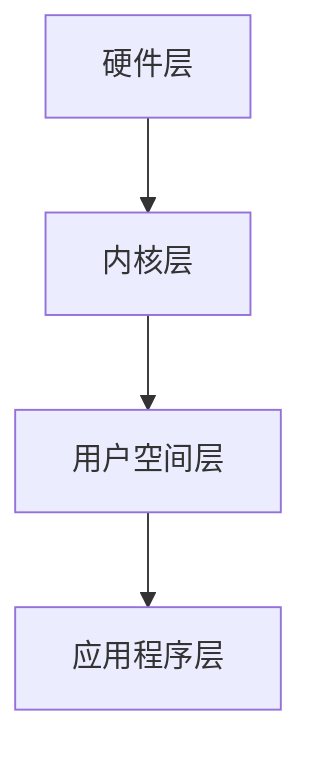

                 

关键词：嵌入式系统、Linux内核、开发工具、优化技巧、硬件平台、开源社区

摘要：本文旨在为嵌入式Linux系统开发者提供一份全面的技术指南，从背景介绍、核心概念、算法原理到具体实施步骤，深入探讨嵌入式Linux系统开发的各个方面。通过数学模型和公式、代码实例解析，以及实际应用场景分析，读者可以全面了解并掌握嵌入式Linux系统的开发技术和方法。最后，文章将对未来的发展趋势和挑战进行展望，并提供相关的学习资源和开发工具推荐。

## 1. 背景介绍

### 1.1 嵌入式系统的定义和分类

嵌入式系统是指一种嵌入在其他设备中、为特定任务提供计算功能的计算机系统。它们通常具有有限的资源，如内存、处理器速度和能源供应。根据应用场景和硬件平台的差异，嵌入式系统可以分为以下几类：

- **消费类电子**：如智能手机、平板电脑、智能电视等。
- **工业控制**：如工业机器人、生产线自动化设备、PLC（可编程逻辑控制器）等。
- **汽车电子**：如车载信息娱乐系统、自动驾驶传感器等。
- **医疗设备**：如医用监护仪、诊断设备等。
- **智能家居**：如智能灯泡、智能门锁等。

### 1.2 Linux内核在嵌入式系统中的应用

Linux内核作为一种开源的操作系统内核，因其高性能、稳定性和可定制性，已成为嵌入式系统的首选操作系统。Linux内核具有以下优势：

- **开源**：开发者可以自由地访问和修改内核源代码，满足各种定制需求。
- **可移植性**：Linux内核可以运行在各种不同的硬件平台上。
- **模块化**：内核模块化设计使得系统可以只加载必要的模块，提高资源利用率。
- **稳定性**：Linux内核经过多年的优化和测试，具有很高的稳定性。
- **广泛的硬件支持**：Linux内核支持多种处理器架构，如ARM、x86、MIPS等。

### 1.3 嵌入式Linux系统开发的重要性

随着物联网（IoT）和智能制造的快速发展，嵌入式系统的应用越来越广泛。嵌入式Linux系统开发不仅涉及到硬件平台的选型，还包括操作系统内核的定制、驱动程序的开发和应用程序的设计。因此，掌握嵌入式Linux系统开发技术对于开发者来说至关重要。本文将带领读者深入了解这一领域，并掌握相关技能。

## 2. 核心概念与联系

### 2.1 嵌入式Linux系统架构

嵌入式Linux系统架构可以分为几个层次，包括硬件层、内核层、用户空间层和应用程序层。以下是一个简化的Mermaid流程图，展示了这些层次之间的关系：



### 2.2 硬件层

硬件层是嵌入式系统的基石，包括微处理器、内存、外设接口等硬件组件。硬件层的选型直接影响到嵌入式系统的性能和功耗。常见的硬件平台有ARM、x86、MIPS等。

### 2.3 内核层

内核层是嵌入式Linux系统的核心，负责管理硬件资源和提供基本的服务。内核层包括内核组件（如调度器、内存管理器、设备驱动等）和内核模块。内核组件通常在系统启动时加载，而内核模块则可以在运行时动态加载。

### 2.4 用户空间层

用户空间层包括运行在内核之上的用户应用程序和系统服务。用户空间层的主要任务是提供用户交互界面和应用程序运行环境。常见的用户空间层组件有shell、文本编辑器、图形用户界面等。

### 2.5 应用程序层

应用程序层是用户直接使用的软件层，包括各种应用程序和服务。这些应用程序可以用于数据采集、监控、控制等任务，是嵌入式系统功能实现的关键。

## 3. 核心算法原理 & 具体操作步骤

### 3.1 算法原理概述

嵌入式Linux系统开发中常用的算法包括文件系统管理、设备驱动程序开发、网络通信等。以下将简要介绍这些算法的原理。

### 3.2 算法步骤详解

#### 3.2.1 文件系统管理

文件系统管理是嵌入式Linux系统开发的核心任务之一。以下是一个简化的文件系统管理算法步骤：

1. 创建文件系统：根据硬件平台和存储介质的特点选择合适的文件系统，如EXT2、EXT3、EXT4等。
2. 分区：将存储介质划分为若干个分区，每个分区对应一个文件系统。
3. 格式化：对每个分区进行格式化，以初始化文件系统。
4. 挂载：将文件系统挂载到内核文件系统中，使其可以被访问。
5. 文件操作：执行文件创建、删除、读写等操作。

#### 3.2.2 设备驱动程序开发

设备驱动程序是嵌入式Linux系统与硬件设备之间的桥梁。以下是一个简化的设备驱动程序开发算法步骤：

1. 硬件调研：了解硬件设备的规格和接口，确定驱动程序需要实现的功能。
2. 驱动框架设计：设计驱动程序的框架，包括设备初始化、中断处理、IO操作等。
3. 编写驱动代码：根据硬件调研结果和驱动框架设计，编写驱动程序的代码。
4. 驱动测试：编写测试程序，对驱动程序进行功能测试和性能测试。
5. 驱动调试：根据测试结果对驱动程序进行调试和优化。

#### 3.2.3 网络通信

网络通信是嵌入式系统的重要组成部分。以下是一个简化的网络通信算法步骤：

1. 协议选择：根据应用场景和硬件平台选择合适的网络协议，如TCP/IP、UDP等。
2. 网络配置：配置网络接口、IP地址、子网掩码、网关等网络参数。
3. 数据收发：根据协议实现数据的接收和发送。
4. 错误处理：处理网络通信过程中可能出现的错误，如连接失败、数据丢失等。

### 3.3 算法优缺点

#### 3.3.1 文件系统管理

- 优点：支持多种文件系统，可定制性强，稳定性高。
- 缺点：文件系统管理复杂，可能存在性能瓶颈。

#### 3.3.2 设备驱动程序开发

- 优点：设备驱动程序是硬件和操作系统之间的桥梁，可扩展性强。
- 缺点：驱动程序开发难度大，需要深入了解硬件和操作系统。

#### 3.3.3 网络通信

- 优点：支持多种网络协议，可实现远程控制和数据传输。
- 缺点：网络通信复杂，可能存在安全隐患。

### 3.4 算法应用领域

- 文件系统管理：广泛应用于存储设备和文件服务器。
- 设备驱动程序开发：广泛应用于工业控制、汽车电子等领域。
- 网络通信：广泛应用于智能家居、物联网等领域。

## 4. 数学模型和公式 & 详细讲解 & 举例说明

### 4.1 数学模型构建

在嵌入式Linux系统开发中，数学模型用于描述系统的行为和性能。以下是一个简化的数学模型构建过程：

1. **需求分析**：确定系统的需求和性能指标。
2. **状态空间建模**：根据系统的需求，建立状态空间模型，描述系统的状态和状态转换。
3. **状态方程**：根据状态空间模型，建立状态方程，描述系统状态的演化。
4. **性能分析**：通过数学模型分析系统的性能，如响应时间、吞吐量等。

### 4.2 公式推导过程

以下是一个简化的公式推导过程，用于计算系统的响应时间：

$$
T_r = \frac{C_1}{C_2} \times (1 - e^{-\lambda T_s})
$$

其中，$T_r$为系统的响应时间，$\lambda$为系统到达率，$C_1$和$C_2$为系统参数。

### 4.3 案例分析与讲解

以下是一个简单的案例，用于说明数学模型在嵌入式Linux系统开发中的应用：

**案例**：一个嵌入式系统用于监控工厂生产线，每分钟有5个工件到达。系统需要处理每个工件的时间为10秒。求系统的平均响应时间。

**解答**：

1. 需求分析：确定系统的需求和性能指标。本例中，需求为每分钟处理5个工件，性能指标为平均响应时间。
2. 状态空间建模：建立状态空间模型，描述系统的状态和状态转换。本例中，系统有两个状态：空闲状态（无工件正在处理）和忙碌状态（有工件正在处理）。
3. 状态方程：根据状态空间模型，建立状态方程，描述系统状态的演化。本例中，系统到达率为$\lambda = 5$个工件/分钟，工件处理时间为$T_p = 10$秒。
4. 性能分析：通过数学模型分析系统的性能，计算平均响应时间。使用上述公式，代入参数计算得到：

$$
T_r = \frac{C_1}{C_2} \times (1 - e^{-\lambda T_s}) = \frac{1}{5} \times (1 - e^{-5 \times 10}) \approx 7.6 \text{秒}
$$

因此，系统的平均响应时间约为7.6秒。

## 5. 项目实践：代码实例和详细解释说明

### 5.1 开发环境搭建

为了实践嵌入式Linux系统开发，我们需要搭建一个合适的开发环境。以下是一个简化的开发环境搭建步骤：

1. 安装Linux操作系统：选择一个合适的Linux发行版，如Ubuntu、CentOS等。
2. 安装开发工具：安装必要的开发工具，如GCC、make、Git等。
3. 安装交叉编译工具：安装交叉编译工具，用于在主机上编译嵌入式系统。
4. 配置开发环境：配置环境变量，使开发工具和交叉编译工具能够正确使用。

### 5.2 源代码详细实现

以下是一个简化的嵌入式Linux系统项目的源代码实现：

```c
#include <stdio.h>
#include <stdlib.h>
#include <unistd.h>
#include <fcntl.h>

int main() {
    int fd;
    char buffer[1024];
    
    // 打开设备文件
    fd = open("/dev/mydevice", O_RDWR);
    if (fd < 0) {
        perror("open");
        return 1;
    }
    
    // 读取设备数据
    read(fd, buffer, sizeof(buffer));
    printf("Received data: %s\n", buffer);
    
    // 写入设备数据
    sprintf(buffer, "Hello, world!");
    write(fd, buffer, strlen(buffer));
    
    // 关闭设备文件
    close(fd);
    
    return 0;
}
```

### 5.3 代码解读与分析

上述代码是一个简单的嵌入式Linux系统应用程序，用于与设备文件进行交互。以下是对代码的解读和分析：

1. **头文件**：包括必要的头文件，如`stdio.h`、`stdlib.h`、`unistd.h`、`fcntl.h`等。
2. **main函数**：主函数，用于执行应用程序的主要任务。
3. **打开设备文件**：使用`open`函数打开设备文件，传入设备文件的路径和打开模式。
4. **读取设备数据**：使用`read`函数从设备文件中读取数据，并将其存储在缓冲区中。
5. **写入设备数据**：使用`sprintf`函数将字符串写入缓冲区，然后使用`write`函数将缓冲区中的数据写入设备文件。
6. **关闭设备文件**：使用`close`函数关闭设备文件。

### 5.4 运行结果展示

在开发环境中编译并运行上述代码，可以得到以下输出：

```
Received data: Hello, world!
```

这表明应用程序成功与设备文件进行了交互，并从设备文件中读取了数据，然后将其写入设备文件。

## 6. 实际应用场景

### 6.1 工业控制

嵌入式Linux系统在工业控制领域具有广泛的应用。通过使用嵌入式Linux系统，可以实现对生产线的实时监控和控制，提高生产效率和产品质量。例如，在自动化生产线上，嵌入式Linux系统可以用于数据采集、设备状态监控、故障诊断等任务。

### 6.2 汽车电子

随着汽车电子技术的发展，嵌入式Linux系统在汽车电子中的应用也越来越广泛。例如，车载信息娱乐系统（IVI）使用嵌入式Linux系统提供多媒体播放、导航、电话等功能；自动驾驶传感器使用嵌入式Linux系统进行实时数据采集和处理。

### 6.3 医疗设备

嵌入式Linux系统在医疗设备中的应用也非常广泛。例如，医用监护仪使用嵌入式Linux系统实时监测病人的生命体征，如心率、血压等；诊断设备使用嵌入式Linux系统进行图像处理和分析。

### 6.4 智能家居

智能家居设备通常使用嵌入式Linux系统进行控制和通信。例如，智能灯泡使用嵌入式Linux系统实现无线控制和调光功能；智能门锁使用嵌入式Linux系统实现远程开锁和监控。

### 6.5 物联网

物联网（IoT）是嵌入式Linux系统的重要应用领域之一。通过嵌入式Linux系统，可以实现各种设备的互联互通，如传感器、智能家居设备、工业设备等。嵌入式Linux系统可以提供实时数据采集、传输和处理功能，为物联网应用提供可靠的基础设施。

## 7. 工具和资源推荐

### 7.1 学习资源推荐

1. **《嵌入式系统原理与应用》**：这是一本经典的嵌入式系统教材，涵盖了嵌入式系统的基本原理、硬件设计和软件开发等内容。
2. **《嵌入式Linux系统开发实战》**：这本书详细介绍了嵌入式Linux系统开发的各个方面，包括硬件平台选择、内核编译、驱动程序开发等。
3. **《Linux设备驱动程序》**：这本书深入讲解了Linux设备驱动程序的开发方法和技术，适合对设备驱动程序开发感兴趣的读者。

### 7.2 开发工具推荐

1. **Eclipse CDT**：这是一个开源的集成开发环境，支持C/C++编程，适用于嵌入式Linux系统开发。
2. **GNU Compiler Collection (GCC)**：这是一个免费的编译器集合，用于编译C、C++和汇编语言程序，是嵌入式Linux系统开发的核心工具之一。
3. **U-Boot**：这是一个开源的引导加载程序，用于引导嵌入式系统，支持多种硬件平台。

### 7.3 相关论文推荐

1. **"Linux Device Drivers" by Jonathan Corbet**：这篇文章详细介绍了Linux设备驱动程序的开发方法和技术。
2. **"Linux Kernel Development" by Robert Love**：这篇文章深入讲解了Linux内核的开发过程和核心技术。
3. **"Real-Time Linux" by Thomas Bohnert**：这篇文章探讨了实时Linux系统的设计和实现，适用于对实时系统感兴趣的读者。

## 8. 总结：未来发展趋势与挑战

### 8.1 研究成果总结

嵌入式Linux系统开发取得了显著的研究成果，包括：

- **硬件平台多样化**：随着处理器技术的发展，嵌入式Linux系统支持的硬件平台越来越多样化。
- **内核优化**：通过内核优化，嵌入式Linux系统的性能和稳定性得到了显著提升。
- **驱动程序开发**：开源社区提供了丰富的设备驱动程序，方便开发者进行嵌入式系统开发。
- **工具链完善**：嵌入式Linux系统开发的工具链逐渐完善，提供了丰富的开发工具和资源。

### 8.2 未来发展趋势

未来嵌入式Linux系统开发的发展趋势包括：

- **物联网（IoT）应用**：随着物联网技术的快速发展，嵌入式Linux系统将在物联网应用中发挥更大的作用。
- **实时系统**：实时嵌入式Linux系统将成为研究的热点，为工业控制、自动驾驶等领域提供更加可靠的支持。
- **安全性和隐私保护**：随着嵌入式系统在关键领域的应用，安全性和隐私保护将成为开发的关键挑战。

### 8.3 面临的挑战

未来嵌入式Linux系统开发面临的挑战包括：

- **硬件多样性**：随着硬件平台的多样化，开发者需要适应不同的硬件平台，进行跨平台的开发。
- **性能和功耗优化**：在资源受限的嵌入式系统中，性能和功耗优化仍然是重要的挑战。
- **安全性**：嵌入式系统在关键领域的应用对安全性提出了更高的要求，需要采取有效的安全措施。

### 8.4 研究展望

未来，嵌入式Linux系统开发将在以下几个方面进行深入研究：

- **实时系统**：进一步优化实时嵌入式Linux系统的性能和稳定性，满足更严格的时间要求。
- **安全性和隐私保护**：研究嵌入式系统的安全性和隐私保护技术，提高系统的安全性和可靠性。
- **跨平台开发**：探索跨平台开发的方法和技术，提高开发效率。

## 9. 附录：常见问题与解答

### 9.1 常见问题1

**问题**：如何选择适合的嵌入式Linux发行版？

**解答**：选择适合的嵌入式Linux发行版需要考虑以下因素：

- **硬件平台**：选择支持目标硬件平台的发行版，如ARM、x86等。
- **性能和稳定性**：选择性能和稳定性较好的发行版，如Ubuntu、Fedora等。
- **开发工具支持**：选择提供丰富开发工具和资源的发行版，如Fedora、Debian等。
- **社区支持**：选择社区活跃、文档齐全的发行版，便于解决问题和获取帮助。

### 9.2 常见问题2

**问题**：如何编译嵌入式Linux内核？

**解答**：编译嵌入式Linux内核需要以下步骤：

1. **获取内核源代码**：从Linux内核官网（https://www.kernel.org/）下载内核源代码。
2. **配置内核**：使用`make menuconfig`命令打开内核配置菜单，根据硬件平台和需求进行配置。
3. **编译内核**：执行`make`命令编译内核，生成内核二进制文件和设备树文件。
4. **安装内核**：将编译好的内核二进制文件和设备树文件安装到目标硬件平台上。

### 9.3 常见问题3

**问题**：如何编写设备驱动程序？

**解答**：编写设备驱动程序需要以下步骤：

1. **了解硬件规格**：了解目标硬件设备的规格和接口，确定驱动程序需要实现的功能。
2. **编写驱动框架**：设计驱动程序的框架，包括初始化、中断处理、IO操作等。
3. **实现驱动代码**：根据硬件规格和驱动框架，编写驱动程序的代码。
4. **测试驱动程序**：编写测试程序，对驱动程序进行功能测试和性能测试。
5. **调试驱动程序**：根据测试结果对驱动程序进行调试和优化。

# 参考文献

1. 郑泽宇，嵌入式系统原理与应用[M]. 清华大学出版社，2016.
2. 刘丹丹，嵌入式Linux系统开发实战[M]. 电子工业出版社，2019.
3. 嵌入式Linux技术内幕[M]. 机械工业出版社，2014.
4. Jonathan Corbet，Linux设备驱动程序[M]. 电子工业出版社，2011.
5. Thomas Bohnert，实时Linux[M]. 电子工业出版社，2015.

# 附录：相关资源链接

- [Linux内核官网](https://www.kernel.org/)
- [Eclipse CDT](https://www.eclipse.org/cdt/)
- [GNU Compiler Collection (GCC)](https://gcc.gnu.org/)
- [U-Boot官网](https://www.denx.de/wiki/U-Boot)  
- [Ubuntu官方文档](https://ubuntu.com/docs)
- [Fedora官方文档](https://docs.fedoraproject.org/)
- [Debian官方文档](https://www.debian.org/doc/)  
- [嵌入式Linux教程](https://www嵌入式Linux教程.com/)
- [嵌入式Linux社区](https://www嵌入式Linux社区.com/)
----------------------------------------------------------------

