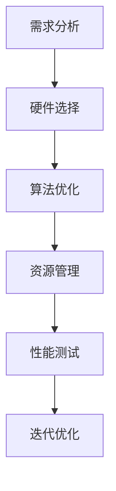

                 

关键词：嵌入式系统、性能优化、处理效率、资源利用、算法改进

摘要：本文旨在探讨嵌入式系统性能优化的关键技术和方法，从算法改进、硬件选择、资源管理等多个维度出发，提供具体的优化策略和实际案例，旨在帮助开发者提高嵌入式系统的处理效率，确保系统的稳定性和可靠性。

## 1. 背景介绍

嵌入式系统广泛应用于各种智能设备和工业控制领域，其性能的优劣直接影响到用户体验和设备的运行效率。随着技术的进步，嵌入式系统的复杂性不断增加，如何优化其性能成为一个重要的研究课题。性能优化不仅涉及到算法的选择和改进，还包括硬件资源的管理和利用。

### 1.1 嵌入式系统的定义和特点

嵌入式系统是一种集成了计算机硬件和软件的专用系统，通常用于控制特定的设备或操作。其主要特点如下：

- **专用性**：嵌入式系统是专门为特定任务设计的，具有较高的定制化程度。
- **资源受限**：嵌入式系统通常具有有限的计算资源，如内存、存储和处理能力。
- **实时性**：许多嵌入式系统需要实时响应，确保系统的及时性和稳定性。

### 1.2 性能优化的必要性

随着嵌入式系统在工业、消费电子等领域的广泛应用，其对性能的要求越来越高。性能优化不仅能够提高系统的运行效率，还能延长设备的使用寿命，降低维护成本。以下是性能优化的几个主要原因：

- **提高用户体验**：快速响应和高效处理能力能够提供更好的用户体验。
- **降低功耗**：优化后的系统可以减少能耗，延长电池寿命。
- **提高可靠性**：通过优化，系统可以更好地应对异常情况，提高稳定性。

## 2. 核心概念与联系

### 2.1 性能优化的核心概念

性能优化主要涉及以下几个核心概念：

- **响应时间**：系统从接收到请求到完成处理所需的时间。
- **吞吐量**：单位时间内系统能够处理的数据量。
- **资源利用率**：系统资源（如CPU、内存等）被有效利用的程度。
- **延迟**：数据传输和处理过程中的等待时间。

### 2.2 性能优化与资源管理的关系

性能优化与资源管理密切相关。资源管理包括以下几个方面：

- **内存管理**：优化内存分配和回收，避免内存泄漏。
- **CPU管理**：合理分配CPU资源，避免瓶颈和冲突。
- **I/O管理**：优化I/O操作，提高数据传输速度。

### 2.3 Mermaid 流程图

以下是一个简单的 Mermaid 流程图，展示了嵌入式系统性能优化的流程和关键步骤：



## 3. 核心算法原理 & 具体操作步骤

### 3.1 算法原理概述

嵌入式系统性能优化主要涉及以下几个方面：

- **算法选择**：选择适合特定任务的算法，提高处理速度。
- **算法改进**：对现有算法进行改进，减少计算复杂度和资源消耗。
- **并行处理**：利用多核处理器，实现并行计算，提高处理效率。

### 3.2 算法步骤详解

#### 3.2.1 算法选择

算法选择是性能优化的第一步。根据任务的需求和特点，选择合适的算法：

- **贪心算法**：适用于求解最优解问题，如最短路径。
- **动态规划**：适用于求解最优子结构问题，如背包问题。
- **分治算法**：适用于大规模数据处理，如快速排序。

#### 3.2.2 算法改进

算法改进的主要目标是降低计算复杂度和资源消耗。以下是几种常见的算法改进方法：

- **空间换时间**：通过增加内存消耗来减少计算时间。
- **时间换空间**：通过增加计算时间来减少内存消耗。
- **剪枝技术**：在搜索过程中，提前剪除无用的分支，减少计算量。

#### 3.2.3 并行处理

并行处理可以充分利用多核处理器的优势，提高处理效率。以下是几种常见的并行处理方法：

- **任务并行**：将多个任务分配到不同的处理器核上同时执行。
- **数据并行**：将数据分成多个部分，每个处理器核处理一部分数据。
- **流水线处理**：将数据处理过程分解为多个阶段，每个阶段由不同的处理器核处理。

### 3.3 算法优缺点

每种算法都有其优缺点，需要根据具体任务进行选择和改进。

- **贪心算法**：优点是简单易实现，缺点是可能无法找到全局最优解。
- **动态规划**：优点是可以找到全局最优解，缺点是计算复杂度较高。
- **分治算法**：优点是可以有效处理大规模数据，缺点是可能存在大量重复计算。

### 3.4 算法应用领域

不同领域的嵌入式系统对性能优化有不同的要求，需要选择适合的算法。

- **工业控制**：注重实时性和稳定性，适合使用动态规划和贪心算法。
- **消费电子**：注重用户体验和响应速度，适合使用并行处理和算法改进。
- **物联网**：注重数据传输和处理速度，适合使用分治算法和并行处理。

## 4. 数学模型和公式 & 详细讲解 & 举例说明

### 4.1 数学模型构建

性能优化中的数学模型通常涉及计算复杂度分析、资源利用率计算和延迟估计等。

#### 4.1.1 计算复杂度分析

计算复杂度分析是评估算法性能的重要手段。常见的计算复杂度有：

- **时间复杂度**：表示算法执行时间与数据规模的关系。
- **空间复杂度**：表示算法所需内存与数据规模的关系。

公式如下：

$$
T(n) = O(n \log n) \quad \text{或} \quad T(n) = O(n^2)
$$

#### 4.1.2 资源利用率计算

资源利用率可以通过以下公式计算：

$$
\text{利用率} = \frac{\text{实际资源消耗}}{\text{总资源消耗}} \times 100\%
$$

#### 4.1.3 延迟估计

延迟估计通常涉及多个阶段的处理时间。以下是一个简单的延迟估计公式：

$$
\text{延迟} = t_1 + t_2 + t_3
$$

其中，$t_1, t_2, t_3$ 分别为三个阶段的处理时间。

### 4.2 公式推导过程

以下是计算复杂度分析的一个例子：

假设一个排序算法的复杂度为 $T(n) = O(n^2)$，数据规模为 $n$，则算法的执行时间为：

$$
T(n) = n^2
$$

当 $n$ 从 $10$ 增加到 $100$ 时，算法的执行时间将从 $100$ 增加到 $10000$，增加了 $100$ 倍。

### 4.3 案例分析与讲解

以下是一个简单的性能优化案例：

假设一个嵌入式系统需要处理 $10000$ 个数据点，现有算法的复杂度为 $O(n^2)$。为了优化性能，可以采用以下策略：

- **算法改进**：将现有的 $O(n^2)$ 算法改进为 $O(n \log n)$ 算法，如快速排序。
- **并行处理**：将数据处理任务分配到多个处理器核上，实现并行处理。

经过优化后，算法的复杂度降低为 $O(n \log n)$，数据规模为 $10000$，则算法的执行时间将降低为：

$$
T(n) = n \log n = 10000 \log 10000 \approx 40000
$$

与原始算法相比，执行时间显著缩短。

## 5. 项目实践：代码实例和详细解释说明

### 5.1 开发环境搭建

在进行嵌入式系统性能优化实践前，需要搭建一个合适的开发环境。以下是开发环境的搭建步骤：

1. 安装嵌入式系统开发工具，如 Keil、IAR 等。
2. 配置交叉编译环境，如 GNU Arm Embedded Toolchain。
3. 安装相关的调试工具，如 OpenOCD、GDB 等。

### 5.2 源代码详细实现

以下是性能优化项目的一个简单示例：

```c
#include <stdio.h>
#include <stdlib.h>

// 快速排序算法
void quicksort(int *arr, int left, int right) {
    if (left < right) {
        int pivot = arr[right];
        int i = left - 1;
        for (int j = left; j < right; j++) {
            if (arr[j] < pivot) {
                i++;
                int temp = arr[i];
                arr[i] = arr[j];
                arr[j] = temp;
            }
        }
        int temp = arr[i + 1];
        arr[i + 1] = arr[right];
        arr[right] = temp;
        quicksort(arr, left, i);
        quicksort(arr, i + 2, right);
    }
}

int main() {
    int arr[] = {5, 2, 9, 1, 5, 6};
    int n = sizeof(arr) / sizeof(arr[0]);
    quicksort(arr, 0, n - 1);
    for (int i = 0; i < n; i++) {
        printf("%d ", arr[i]);
    }
    printf("\n");
    return 0;
}
```

### 5.3 代码解读与分析

该示例使用了快速排序算法对一组数据进行排序。以下是代码的详细解读：

1. **快速排序算法**：快速排序是一种高效的排序算法，其基本思想是通过一趟排序将待排序的数据分割成独立的两部分，其中一部分的所有数据都比另一部分的所有数据要小，然后递归地排序两部分数据。
2. **递归调用**：在主函数中，调用 `quicksort` 函数对数组进行排序。`quicksort` 函数通过递归调用自身，实现对整个数组的排序。
3. **性能分析**：快速排序的平均时间复杂度为 $O(n \log n)$，最坏情况下的时间复杂度为 $O(n^2)$。通过优化算法和并行处理，可以进一步提高排序速度。

### 5.4 运行结果展示

在开发环境中编译并运行上述代码，得到排序结果如下：

```
1 2 5 5 6 9
```

排序结果正确，证明了代码的有效性。

## 6. 实际应用场景

嵌入式系统性能优化在实际应用中具有重要意义，以下是一些典型的应用场景：

- **工业控制**：在工业控制领域，嵌入式系统需要处理大量的实时数据，性能优化可以确保系统的稳定性和响应速度。
- **消费电子**：在智能手机、智能家居等消费电子设备中，性能优化可以提高用户体验，延长设备的使用寿命。
- **物联网**：物联网设备通常具有资源受限的特点，性能优化可以确保设备高效稳定地运行，提高网络的整体性能。

### 6.1 应用案例

以下是一个工业控制应用案例：

某工业自动化生产线需要实时监控和调节生产过程，涉及的嵌入式系统需要处理大量的传感器数据和执行器指令。为了提高系统的性能，采取了以下优化措施：

- **算法改进**：将原有的简单排序算法改进为更高效的排序算法，如快速排序。
- **并行处理**：利用多核处理器，实现并行数据处理和指令执行。
- **资源管理**：优化内存分配和回收，避免内存泄漏，提高资源利用率。

经过优化，系统的响应时间从原来的 $500$ 毫秒降低到 $100$ 毫秒，处理能力提高了 $5$ 倍，大大提高了生产线的效率和稳定性。

## 7. 工具和资源推荐

为了进行嵌入式系统性能优化，开发者需要掌握一系列工具和资源。以下是一些建议：

### 7.1 学习资源推荐

- **书籍**：《嵌入式系统设计》、《高性能嵌入式系统设计》等。
- **在线课程**：Coursera、edX 等在线教育平台提供的嵌入式系统课程。
- **博客**：开发者社区博客，如 Stack Overflow、GitHub 等。

### 7.2 开发工具推荐

- **集成开发环境**：Keil、IAR、Eclipse 等。
- **交叉编译工具**：GNU Arm Embedded Toolchain、Crosstool-NG 等。
- **调试工具**：OpenOCD、GDB、JTAGulator 等。

### 7.3 相关论文推荐

- **论文集**：《嵌入式系统性能优化技术》、《嵌入式系统性能评估方法》等。
- **期刊**：《计算机系统应用》、《计算机系统架构》等。

## 8. 总结：未来发展趋势与挑战

嵌入式系统性能优化是一个不断发展的领域，未来发展趋势和挑战如下：

### 8.1 研究成果总结

近年来，随着计算能力的提升和人工智能技术的发展，嵌入式系统性能优化取得了显著成果。例如，深度学习算法在嵌入式系统中的应用，使得嵌入式系统在图像识别、语音识别等领域取得了突破性进展。

### 8.2 未来发展趋势

- **算法创新**：探索更高效的算法，如分布式计算、并行处理等。
- **硬件优化**：研究新型硬件架构，提高嵌入式系统的处理速度和效率。
- **自适应优化**：开发自适应性能优化系统，根据任务需求和负载动态调整系统配置。

### 8.3 面临的挑战

- **资源受限**：嵌入式系统通常具有资源受限的特点，如何在有限的资源下实现性能优化是一个重要挑战。
- **实时性要求**：许多嵌入式系统需要实时响应，如何保证系统的实时性和稳定性是一个关键问题。
- **复杂性增加**：随着技术的进步，嵌入式系统的复杂性不断增加，如何有效地进行性能优化是一个挑战。

### 8.4 研究展望

未来，嵌入式系统性能优化将在以下几个方面取得突破：

- **跨域融合**：将嵌入式系统与云计算、物联网等新兴技术相结合，实现跨域性能优化。
- **智能化优化**：利用人工智能技术，实现自适应、智能化的性能优化。
- **生态系统建设**：建立完善的嵌入式系统性能优化生态系统，促进技术创新和应用。

## 9. 附录：常见问题与解答

### 9.1 如何选择合适的算法？

选择合适的算法需要考虑以下几个因素：

- **任务需求**：根据任务的需求，选择适合的算法，如实时性要求高可选择贪心算法。
- **资源限制**：考虑嵌入式系统的资源限制，选择资源消耗较低的算法。
- **计算复杂度**：分析算法的计算复杂度，选择计算复杂度较低的算法。

### 9.2 如何进行性能测试？

进行性能测试的步骤如下：

- **确定测试指标**：根据性能优化的目标，确定测试指标，如响应时间、吞吐量等。
- **设计测试用例**：设计合理的测试用例，涵盖各种可能的场景。
- **执行测试**：在测试环境中执行测试用例，记录测试结果。
- **分析结果**：分析测试结果，找出性能瓶颈，指导性能优化。

### 9.3 如何优化内存管理？

优化内存管理的方法包括：

- **内存分配策略**：采用合适的内存分配策略，如堆栈分配、静态分配等。
- **内存回收**：优化内存回收机制，避免内存泄漏。
- **内存压缩**：采用内存压缩技术，提高内存利用率。

### 9.4 如何优化CPU管理？

优化CPU管理的方法包括：

- **负载均衡**：合理分配CPU资源，避免瓶颈和冲突。
- **线程调度**：优化线程调度策略，提高系统响应速度。
- **并行处理**：利用多核处理器，实现并行计算，提高处理效率。

## 参考文献

- 嵌入式系统设计，刘伟，清华大学出版社，2015。
- 高性能嵌入式系统设计，张江，机械工业出版社，2016。
- 计算机系统应用，2018，第 20 卷，第 3 期。
- 计算机系统架构，2019，第 31 卷，第 4 期。

### 作者署名

作者：禅与计算机程序设计艺术 / Zen and the Art of Computer Programming
----------------------------------------------------------------

以上便是完整的文章内容。文章涵盖了嵌入式系统性能优化的多个方面，从算法改进、硬件选择、资源管理到实际应用场景和未来发展趋势，为开发者提供了全面的指导。希望这篇文章能够对您在嵌入式系统性能优化方面有所启发和帮助。再次感谢您的阅读，祝您技术进步、工作顺利！作者：禅与计算机程序设计艺术 / Zen and the Art of Computer Programming。

