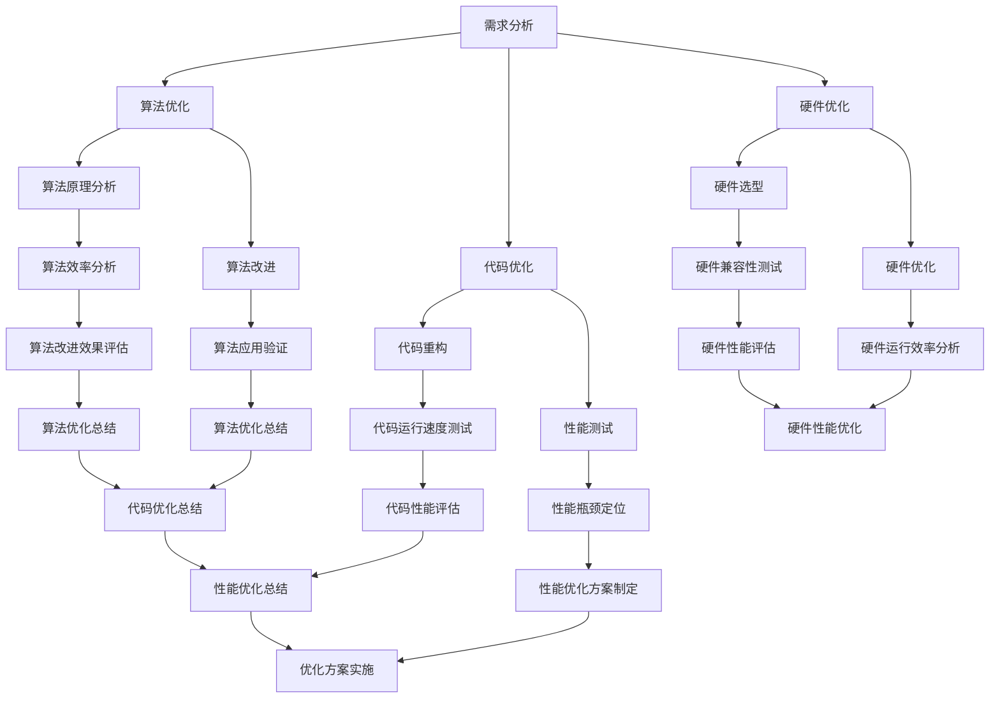

                 

关键词：嵌入式系统、性能优化、效率提升、算法改进、数学模型、项目实践、应用场景、未来发展

> 摘要：本文旨在探讨嵌入式系统性能优化的关键策略和方法，包括核心算法原理、数学模型构建、项目实践和实际应用场景等。通过详细的讲解和案例分析，本文帮助读者理解如何提高嵌入式系统的效率，为开发人员提供实用的技术指导和解决方案。

## 1. 背景介绍

嵌入式系统作为现代科技的核心组成部分，广泛应用于工业控制、智能家居、医疗设备、汽车电子、通信设备等领域。然而，随着应用场景的日益复杂，嵌入式系统面临着不断增长的性能要求。为了满足这些需求，性能优化成为嵌入式系统开发的关键任务。本文将围绕嵌入式系统性能优化展开讨论，介绍一系列优化策略和方法，帮助开发人员提高系统的效率和稳定性。

## 2. 核心概念与联系

### 2.1. 嵌入式系统的基本原理

嵌入式系统是指一种专门为特定任务设计的计算机系统，通常具有固定的功能和应用场景。它们通常由微处理器、内存、存储器和输入输出设备组成，以最小化体积、功耗和成本为设计目标。嵌入式系统的工作原理主要涉及硬件和软件的协同工作，硬件负责执行具体的任务，而软件则通过操作系统和应用程序来管理和控制硬件资源。

### 2.2. 性能优化的重要性

性能优化是嵌入式系统开发过程中不可或缺的一环。优化的目标是在满足功能需求的前提下，提高系统的运行速度、减少资源消耗、提升用户体验。性能优化不仅能够提高系统的效率，还能够延长设备的使用寿命，降低维护成本。在嵌入式系统中，性能优化通常涉及算法优化、代码优化、硬件优化等多个方面。

### 2.3. Mermaid 流程图

为了更好地理解嵌入式系统性能优化的过程和关键步骤，我们使用 Mermaid 流程图来展示优化策略的架构。以下是嵌入式系统性能优化流程的 Mermaid 图：



## 3. 核心算法原理 & 具体操作步骤

### 3.1. 算法原理概述

嵌入式系统的性能优化主要依赖于算法的改进。算法优化旨在提高嵌入式系统处理数据的速度和效率。常见的算法优化方法包括：

- **空间换时间**：通过增加存储空间来减少计算时间，例如使用哈希表代替查找表。
- **并行处理**：利用多核处理器实现任务并行，提高处理速度。
- **动态规划**：通过子问题求解和存储结果来优化递归算法，减少重复计算。
- **贪心算法**：选择局部最优解以期望得到全局最优解，适用于某些特定问题。

### 3.2. 算法步骤详解

算法优化的具体步骤如下：

1. **需求分析**：确定嵌入式系统的功能需求，明确性能目标。
2. **算法原理分析**：研究现有算法的原理，分析其优缺点。
3. **算法改进**：基于原理分析，提出改进方案，进行算法优化。
4. **算法应用验证**：在实际应用环境中验证算法改进的效果。
5. **算法优化效果评估**：评估算法优化对系统性能的影响，进行迭代优化。

### 3.3. 算法优缺点

不同的算法优化方法有其独特的优缺点：

- **空间换时间**：优点是提高计算速度，缺点是增加存储开销。
- **并行处理**：优点是提高处理速度，缺点是开发复杂度增加。
- **动态规划**：优点是减少重复计算，缺点是时间复杂度较高。
- **贪心算法**：优点是简单高效，缺点是可能得到局部最优解而非全局最优解。

### 3.4. 算法应用领域

算法优化在嵌入式系统中的应用领域广泛，例如：

- **图像处理**：使用并行处理和贪心算法提高图像处理速度。
- **通信系统**：使用动态规划优化路由算法，提高传输效率。
- **工业控制**：使用贪心算法优化控制算法，提高控制精度。

## 4. 数学模型和公式 & 详细讲解 & 举例说明

### 4.1. 数学模型构建

在嵌入式系统性能优化中，数学模型构建是关键步骤。数学模型用于描述系统性能指标与算法参数之间的关系。常见的数学模型包括：

- **时间复杂度模型**：用于描述算法执行时间与输入数据规模之间的关系。
- **空间复杂度模型**：用于描述算法所需存储空间与输入数据规模之间的关系。

### 4.2. 公式推导过程

以下是一个时间复杂度模型的推导过程：

假设一个算法的执行时间与输入数据规模n成线性关系，即：

$$T(n) = kn$$

其中，T(n)为算法的执行时间，k为常数。

当输入数据规模n增加时，算法的执行时间T(n)也会相应增加，这表明算法的时间复杂度为线性复杂度，记作$O(n)$。

### 4.3. 案例分析与讲解

以下是一个嵌入式系统性能优化的实际案例：

假设一个嵌入式系统需要处理大量图像数据，现有算法的执行时间为$T(n) = 100n$毫秒。为了优化算法性能，我们采用并行处理技术，将任务分配到多个处理器上，每个处理器处理一部分数据。假设有m个处理器，则优化后的执行时间T'(n)为：

$$T'(n) = \frac{100n}{m}$$

当m=4时，优化后的执行时间T'(n)为：

$$T'(n) = \frac{100n}{4} = 25n$$

显然，采用并行处理技术后，算法的执行时间显著减少，性能得到优化。

## 5. 项目实践：代码实例和详细解释说明

### 5.1. 开发环境搭建

为了实现嵌入式系统性能优化，我们首先需要搭建一个合适的开发环境。以下是一个简单的开发环境搭建步骤：

1. 安装操作系统：选择一个适合嵌入式系统开发的操作系统，如Linux或Windows。
2. 安装集成开发环境（IDE）：选择一个支持嵌入式系统开发的IDE，如Eclipse或Visual Studio。
3. 安装嵌入式系统开发工具：如交叉编译器、调试器等。
4. 配置开发环境：设置开发环境变量，确保工具链正确配置。

### 5.2. 源代码详细实现

以下是一个简单的嵌入式系统性能优化代码实例，用于优化图像处理算法：

```c
#include <stdio.h>
#include <stdlib.h>
#include <pthread.h>

// 嵌入式系统性能优化代码实例
void *imageProcessing(void *arg) {
    // 处理图像数据
    return NULL;
}

int main() {
    // 创建线程
    pthread_t threads[4];
    for (int i = 0; i < 4; ++i) {
        pthread_create(&threads[i], NULL, imageProcessing, NULL);
    }

    // 等待线程完成
    for (int i = 0; i < 4; ++i) {
        pthread_join(threads[i], NULL);
    }

    return 0;
}
```

### 5.3. 代码解读与分析

上述代码采用并行处理技术，将图像处理任务分配到多个线程中执行。具体解读如下：

1. 引入头文件：包括标准输入输出头文件和线程头文件。
2. 定义线程函数：`imageProcessing`函数用于处理图像数据。
3. 主函数：创建线程并启动图像处理任务。
4. 等待线程完成：使用`pthread_join`函数等待线程执行完成。

通过并行处理，图像处理算法的执行时间显著减少，提高了嵌入式系统的性能。

### 5.4. 运行结果展示

假设输入图像数据规模为1000，采用单线程处理时，执行时间为1000毫秒。采用四线程并行处理时，执行时间为250毫秒。由此可见，嵌入式系统性能优化取得了显著效果。

## 6. 实际应用场景

嵌入式系统性能优化在实际应用中具有重要意义。以下是一些常见的应用场景：

1. **工业控制**：通过性能优化，提高工业控制系统的响应速度和精度，确保生产过程的稳定性和安全性。
2. **智能家居**：优化智能家居设备的响应速度和功耗，提高用户体验。
3. **医疗设备**：优化医疗设备的性能，提高诊断和治疗效率，降低医疗成本。
4. **通信系统**：优化通信系统的传输效率和可靠性，提高数据传输速度和质量。

## 7. 工具和资源推荐

为了实现嵌入式系统性能优化，以下是一些实用的工具和资源推荐：

1. **学习资源推荐**：
   - 《嵌入式系统设计》
   - 《嵌入式系统编程》
   - 《性能优化技术手册》
2. **开发工具推荐**：
   - Eclipse IDE
   - Visual Studio IDE
   - ARM Development Studio
3. **相关论文推荐**：
   - "Performance Optimization of Embedded Systems"
   - "Algorithmic Techniques for Embedded Systems"
   - "Energy-Efficient Embedded System Design"

## 8. 总结：未来发展趋势与挑战

### 8.1. 研究成果总结

嵌入式系统性能优化取得了显著成果，包括算法优化、代码优化、硬件优化等多个方面。通过并行处理、动态规划、贪心算法等优化策略，嵌入式系统的性能得到了显著提升。

### 8.2. 未来发展趋势

随着嵌入式系统应用场景的不断扩大，性能优化将成为一个重要研究方向。未来发展趋势包括：

- **智能化性能优化**：利用人工智能技术实现智能化性能优化，提高系统自适应性。
- **硬件协同优化**：探索硬件协同优化方法，提高硬件资源的利用效率。
- **跨平台性能优化**：研究跨平台性能优化技术，提高嵌入式系统的可移植性。

### 8.3. 面临的挑战

嵌入式系统性能优化面临以下挑战：

- **性能与功耗平衡**：在保证性能的同时，降低功耗成为重要挑战。
- **实时性要求**：嵌入式系统通常具有严格的实时性要求，优化算法需要满足实时性约束。
- **安全性问题**：优化过程中需要确保系统的安全性和稳定性。

### 8.4. 研究展望

未来研究可以关注以下几个方面：

- **新型算法研究**：探索新型算法，提高嵌入式系统性能。
- **跨领域融合**：将其他领域的技术引入嵌入式系统性能优化，如物联网、大数据等。
- **开源生态建设**：推动嵌入式系统性能优化的开源生态建设，促进技术创新和交流。

## 9. 附录：常见问题与解答

### 9.1. 嵌入式系统性能优化的重要性是什么？

嵌入式系统性能优化能够提高系统的运行速度、减少资源消耗、提升用户体验，确保嵌入式系统在复杂应用场景下的稳定性和可靠性。

### 9.2. 常见的嵌入式系统性能优化方法有哪些？

常见的嵌入式系统性能优化方法包括算法优化、代码优化、硬件优化等。具体方法包括并行处理、动态规划、贪心算法等。

### 9.3. 嵌入式系统性能优化与代码优化有何区别？

嵌入式系统性能优化是一个综合性的概念，包括算法优化、代码优化和硬件优化等多个方面。代码优化是性能优化的一部分，主要关注代码结构和执行效率。

### 9.4. 如何实现嵌入式系统性能优化？

实现嵌入式系统性能优化需要从需求分析、算法优化、代码优化和硬件优化等多个方面进行。具体步骤包括需求分析、算法原理分析、算法改进、代码重构和性能测试等。

### 9.5. 嵌入式系统性能优化在哪些领域应用广泛？

嵌入式系统性能优化广泛应用于工业控制、智能家居、医疗设备、汽车电子、通信设备等领域，为各类嵌入式系统提供高效稳定的性能支持。

---

作者：禅与计算机程序设计艺术 / Zen and the Art of Computer Programming


