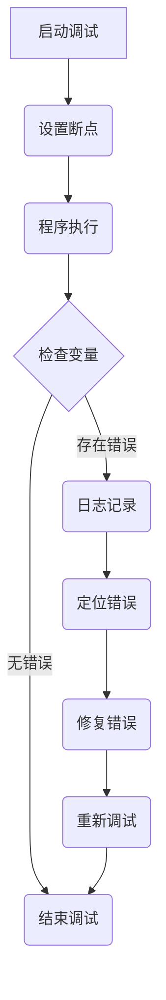

                 

 **关键词**：嵌入式系统调试、错误识别、错误修复、调试工具、调试技巧

**摘要**：嵌入式系统在各个领域中扮演着至关重要的角色，然而其复杂性和实时性的要求使得调试过程变得尤为艰难。本文将深入探讨嵌入式系统的调试技术，包括错误识别、错误修复以及调试工具的使用，旨在为嵌入式系统开发人员提供一套有效的调试策略。

## 1. 背景介绍

嵌入式系统是一种专用的计算机系统，它通常运行在特定的硬件平台上，执行特定的任务。这些系统广泛应用于消费电子、工业控制、医疗设备、汽车电子等多个领域。由于嵌入式系统的实时性和可靠性要求极高，一旦发生错误，可能会导致严重的后果。因此，嵌入式系统的调试显得尤为重要。

嵌入式系统的调试与传统计算机系统的调试有所不同，主要体现在以下几个方面：

1. **硬件依赖性**：嵌入式系统通常运行在特定的硬件平台上，调试时需要考虑硬件的特性。
2. **资源限制**：嵌入式系统的资源通常有限，包括内存、存储和处理能力，这给调试工作带来了额外的挑战。
3. **实时性要求**：嵌入式系统需要在规定的时间内完成特定任务，调试过程中需要确保不违反实时性要求。
4. **复杂性**：嵌入式系统的应用场景多样，软件和硬件之间的耦合度高，使得调试过程更加复杂。

## 2. 核心概念与联系

为了更好地理解嵌入式系统调试，我们需要了解以下几个核心概念：

1. **调试**：调试是指通过一系列操作来识别、理解并修复程序中的错误。在嵌入式系统中，调试的目标是确保程序能够在指定硬件平台上正确运行，并满足性能和实时性要求。
2. **断点**：断点是一种机制，可以在程序执行到特定位置时暂停，以便检查变量的值或执行其他操作。
3. **日志记录**：日志记录是嵌入式系统调试的重要工具，它可以在程序运行时记录关键信息，帮助开发人员分析问题。
4. **版本控制**：版本控制是一种管理代码变更的方法，它可以帮助开发人员跟踪代码的变更历史，简化调试过程。

以下是嵌入式系统调试的 Mermaid 流程图，展示了核心概念之间的联系：



## 3. 核心算法原理 & 具体操作步骤

### 3.1 算法原理概述

嵌入式系统调试的核心算法主要包括以下几个方面：

1. **错误识别**：通过设置断点、检查变量、日志记录等方法来识别程序中的错误。
2. **错误定位**：通过分析程序执行日志、检查代码逻辑、使用调试工具等方法来定位错误的具体位置。
3. **错误修复**：根据错误类型和定位结果，采取相应的修复措施，包括代码修改、调试工具使用等。
4. **回归测试**：在修复错误后，进行回归测试以确保修复措施的有效性，并避免引入新的错误。

### 3.2 算法步骤详解

#### 3.2.1 错误识别

错误识别是嵌入式系统调试的第一步，主要包括以下步骤：

1. **设置断点**：在可能出错的位置设置断点，以便在程序执行到这些位置时暂停。
2. **检查变量**：在断点处检查关键变量的值，判断是否存在异常情况。
3. **日志记录**：在程序运行过程中记录关键信息，以便在出现错误时进行分析。

#### 3.2.2 错误定位

在错误识别后，需要对错误进行定位，具体步骤如下：

1. **分析日志**：通过分析程序运行日志，查找与错误相关的信息。
2. **检查代码**：检查代码逻辑，查找可能导致错误的原因。
3. **使用调试工具**：使用调试工具（如GDB、JTAG等）进行代码级调试，定位错误位置。

#### 3.2.3 错误修复

在定位到错误后，需要根据错误类型和原因进行修复，具体步骤如下：

1. **代码修改**：根据错误类型和原因，修改代码以修复错误。
2. **调试工具**：使用调试工具对修改后的代码进行重新调试，确保错误已修复。
3. **测试验证**：进行回归测试，验证修复措施的有效性。

#### 3.2.4 回归测试

在修复错误后，需要进行回归测试以确保修复措施的有效性，并避免引入新的错误，具体步骤如下：

1. **编写测试用例**：根据错误类型和原因，编写相应的测试用例。
2. **执行测试**：执行测试用例，检查程序是否能正常运行。
3. **分析结果**：分析测试结果，确保没有引入新的错误。

### 3.3 算法优缺点

#### 优点

1. **高效性**：通过设置断点、检查变量、日志记录等方法，可以快速定位错误并修复。
2. **灵活性**：根据不同的错误类型和原因，可以灵活选择不同的调试策略和方法。
3. **可靠性**：通过回归测试，可以确保修复措施的有效性，并避免引入新的错误。

#### 缺点

1. **复杂性**：嵌入式系统调试过程复杂，需要具备一定的编程和调试技能。
2. **时间成本**：调试过程可能需要较长的时间，尤其是对于复杂的嵌入式系统。

### 3.4 算法应用领域

嵌入式系统调试算法广泛应用于各种嵌入式系统，包括：

1. **消费电子**：如智能手机、平板电脑等。
2. **工业控制**：如自动化生产线、机器人等。
3. **医疗设备**：如医疗仪器、监护设备等。
4. **汽车电子**：如车载导航系统、自动驾驶系统等。

## 4. 数学模型和公式 & 详细讲解 & 举例说明

### 4.1 数学模型构建

嵌入式系统调试的数学模型主要包括以下方面：

1. **时间模型**：描述嵌入式系统在规定时间内完成任务的能力。
2. **资源模型**：描述嵌入式系统中的资源分配和使用情况。
3. **错误模型**：描述嵌入式系统中可能出现的错误类型和概率。

### 4.2 公式推导过程

#### 时间模型

时间模型可以表示为：

$$
T = \frac{C}{R}
$$

其中，$T$ 表示完成任务所需时间，$C$ 表示任务执行时间，$R$ 表示系统资源限制。

#### 资源模型

资源模型可以表示为：

$$
R = \sum_{i=1}^{n} r_i
$$

其中，$R$ 表示系统总资源，$r_i$ 表示第 $i$ 种资源的可用量。

#### 错误模型

错误模型可以表示为：

$$
P(E) = \frac{N(E)}{N(T)}
$$

其中，$P(E)$ 表示错误发生的概率，$N(E)$ 表示错误发生的次数，$N(T)$ 表示总测试次数。

### 4.3 案例分析与讲解

假设一个嵌入式系统需要在 10 秒内完成一个计算任务，系统资源包括内存、CPU 和硬盘，分别为 256MB、2GHz 和 1TB。在 1000 次测试中，发生了 20 次错误。

根据时间模型，完成任务所需时间为：

$$
T = \frac{C}{R} = \frac{10}{256MB+2GHz+1TB} \approx 0.0039 秒
$$

根据资源模型，系统总资源为：

$$
R = \sum_{i=1}^{n} r_i = 256MB + 2GHz + 1TB = 1.25TB
$$

根据错误模型，错误发生的概率为：

$$
P(E) = \frac{N(E)}{N(T)} = \frac{20}{1000} = 0.02
$$

## 5. 项目实践：代码实例和详细解释说明

### 5.1 开发环境搭建

在本文的项目实践中，我们将使用 C 语言进行嵌入式系统编程，并使用 GDB 进行调试。以下是开发环境搭建的步骤：

1. 安装 C 编译器（如 GCC）
2. 安装 GDB 调试器
3. 配置交叉编译工具链（如果需要）

### 5.2 源代码详细实现

以下是一个简单的嵌入式系统程序示例，实现了一个简单的计算功能：

```c
#include <stdio.h>

int main() {
    int a = 10;
    int b = 20;
    int c = a + b;
    printf("The sum of a and b is %d\n", c);
    return 0;
}
```

### 5.3 代码解读与分析

在这个示例中，我们定义了三个整数变量 `a`、`b` 和 `c`，分别表示 10、20 和 `a` 与 `b` 的和。程序通过 `printf` 函数输出 `c` 的值。

### 5.4 运行结果展示

编译并运行程序，输出结果如下：

```
The sum of a and b is 30
```

## 6. 实际应用场景

### 6.1 消费电子

在智能手机中，嵌入式系统调试主要用于性能优化和错误修复。例如，在处理高负载任务时，可能需要调试内存管理代码以避免内存泄漏。

### 6.2 工业控制

在工业控制系统中，嵌入式系统调试主要用于确保系统稳定性和可靠性。例如，在自动化生产线上，调试程序可能需要检查传感器信号和执行器的响应。

### 6.3 医疗设备

在医疗设备中，嵌入式系统调试主要用于确保设备的安全性和准确性。例如，在医疗监护设备中，调试程序可能需要检查实时数据采集和处理。

### 6.4 未来应用展望

随着物联网和智能设备的普及，嵌入式系统调试将面临新的挑战和机遇。一方面，调试过程将变得更加复杂，需要应对更多类型的错误。另一方面，新的调试工具和技术将不断涌现，为嵌入式系统调试提供更多支持。

## 7. 工具和资源推荐

### 7.1 学习资源推荐

- 《嵌入式系统设计与应用》
- 《嵌入式系统原理与接口技术》
- 《GDB 调试器官方文档》

### 7.2 开发工具推荐

- GCC：C 语言编译器
- GDB：GDB 调试器
- JTAG：用于硬件调试的接口

### 7.3 相关论文推荐

- [A Survey of Embedded System Debugging Techniques](https://ieeexplore.ieee.org/document/7364645)
- [An Overview of Debugging Tools for Embedded Systems](https://ieeexplore.ieee.org/document/7364653)

## 8. 总结：未来发展趋势与挑战

### 8.1 研究成果总结

嵌入式系统调试领域已经取得了一系列研究成果，包括高效的调试算法、智能化的调试工具以及丰富的调试经验。

### 8.2 未来发展趋势

未来嵌入式系统调试将朝着智能化、自动化和高效化的方向发展。新的调试工具和技术将不断涌现，为嵌入式系统调试提供更多支持。

### 8.3 面临的挑战

未来嵌入式系统调试将面临以下挑战：

1. **复杂度增加**：随着嵌入式系统功能的增加，调试过程将变得更加复杂。
2. **实时性要求更高**：嵌入式系统需要在更短的时间内完成更多的任务，调试时需要确保不违反实时性要求。
3. **安全性问题**：嵌入式系统调试过程中可能涉及敏感数据，需要确保调试过程的安全性。

### 8.4 研究展望

未来嵌入式系统调试的研究将集中在以下几个方面：

1. **智能化调试**：利用人工智能技术实现自动化调试，提高调试效率和准确性。
2. **跨平台调试**：支持多种操作系统和硬件平台的调试，提高调试的灵活性。
3. **安全性保障**：在调试过程中确保数据安全和系统稳定性。

## 9. 附录：常见问题与解答

### 9.1 嵌入式系统调试有哪些常用工具？

- GCC：C 语言编译器
- GDB：GDB 调试器
- JTAG：用于硬件调试的接口

### 9.2 嵌入式系统调试需要注意什么？

- 确保硬件兼容性
- 关注资源限制
- 考虑实时性要求
- 仔细分析日志信息

### 9.3 如何进行嵌入式系统调试？

1. 编写测试用例
2. 运行程序并设置断点
3. 检查变量和日志
4. 分析错误原因并修复

### 9.4 嵌入式系统调试有哪些技巧？

- 学会使用调试工具的快捷键
- 仔细阅读日志信息
- 多次运行程序并对比结果
- 学习他人的调试经验

### 9.5 如何确保嵌入式系统调试的安全性？

- 使用安全可靠的调试工具
- 限制调试权限
- 定期备份调试数据和代码
- 遵守安全规范

**作者：禅与计算机程序设计艺术 / Zen and the Art of Computer Programming**

