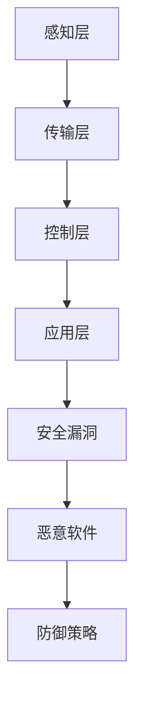

                 

关键词：工业控制系统、安全、关键基础设施、防御策略、技术手段、安全漏洞、安全事件、风险管理、防护措施

> 摘要：本文旨在深入探讨工业控制系统（ICS）的安全性问题，分析其面临的威胁与挑战，并提出有效的防护策略和技术手段。通过对核心概念、算法原理、数学模型和实际应用场景的详细讲解，为保护关键基础设施提供理论与实践支持。

## 1. 背景介绍

### 1.1 工业控制系统的定义和重要性

工业控制系统（Industrial Control Systems，ICS）是指用于控制工业过程、生产流程和基础设施的计算机控制系统。它们广泛应用于电力、能源、交通、制造、水利和化工等领域。工业控制系统通过监测、控制和管理工业设备，确保生产过程的稳定性和效率。随着物联网（IoT）和工业互联网（IIoT）的普及，工业控制系统越来越依赖于网络通信，这使得它们面临更多的安全威胁。

### 1.2 关键基础设施的概念和范围

关键基础设施是指对社会运行至关重要、一旦遭受攻击或失效可能导致严重后果的基础设施系统。根据国际电信联盟（ITU）的定义，关键基础设施包括但不限于以下领域：

1. 能源基础设施：如发电站、电网、石油和天然气管道。
2. 交通基础设施：如机场、港口、高速公路和铁路。
3. 通信基础设施：如互联网、电信网络和卫星通信。
4. 水利基础设施：如水坝、供水系统和污水处理设施。
5. 医疗基础设施：如医院、医疗设备和药品供应链。
6. 制造基础设施：如工厂、生产线和供应链。

关键基础设施的运行对社会稳定和国家安全至关重要，因此保护这些设施的安全成为各国政府和企业的重要任务。

### 1.3 工业控制系统安全的现状

近年来，工业控制系统面临的安全威胁日益增多，主要包括以下几类：

1. **网络攻击**：通过网络漏洞或恶意软件对工业控制系统进行攻击，可能导致系统瘫痪、数据泄露或控制权丧失。
2. **物理攻击**：通过直接接触或破坏设备对工业控制系统进行攻击，如破坏传感器、控制模块或网络通信设备。
3. **社会工程攻击**：利用人为因素，如内部人员恶意操作或欺骗外部人员获取系统访问权限。
4. **软件漏洞**：由于软件设计缺陷或编程错误导致的安全漏洞，可能被攻击者利用进行攻击。

针对这些威胁，各国政府和企业已经采取了一系列措施来提高工业控制系统的安全性，但仍面临诸多挑战。

## 2. 核心概念与联系

### 2.1 安全漏洞

安全漏洞是指工业控制系统中的脆弱点，攻击者可以利用这些漏洞实施攻击。常见的安全漏洞包括：

1. **操作系统漏洞**：操作系统本身的漏洞可能导致系统安全受到威胁。
2. **应用软件漏洞**：工业控制系统中的应用程序可能存在漏洞，攻击者可以利用这些漏洞获取系统访问权限。
3. **网络通信漏洞**：网络通信协议和配置可能存在漏洞，攻击者可以通过这些漏洞窃取数据或干扰通信。

### 2.2 恶意软件

恶意软件是指专门设计用来攻击、窃取或破坏工业控制系统的恶意程序。常见的恶意软件包括：

1. **勒索软件**：加密系统中的数据，要求支付赎金才能解密。
2. **木马**：隐藏在系统中的恶意程序，用于窃取数据、控制设备或传播其他恶意软件。
3. **蠕虫**：通过网络传播，感染其他工业控制系统，可能导致大规模瘫痪。

### 2.3 防御策略

为了提高工业控制系统的安全性，需要采取一系列防御策略，包括：

1. **安全防护设备**：如防火墙、入侵检测系统（IDS）和入侵防御系统（IPS）等。
2. **安全配置**：确保系统配置符合安全标准，关闭不必要的端口和服务。
3. **访问控制**：限制对工业控制系统的访问权限，确保只有授权人员才能访问关键资源。
4. **安全审计**：定期对系统进行安全审计，检测和修复安全漏洞。
5. **员工培训**：提高员工的安全意识和技能，防止社会工程攻击。

### 2.4 架构

工业控制系统的架构通常包括以下层次：

1. **感知层**：包括传感器、执行器等设备，用于采集和处理数据。
2. **传输层**：包括网络通信设备和协议，用于传输数据。
3. **控制层**：包括控制系统、服务器和数据库，用于数据处理和控制。
4. **应用层**：包括应用软件，用于实现特定的业务功能。

通过上述架构，工业控制系统可以实现对生产过程的实时监控和控制。然而，这也为攻击者提供了多种攻击途径，因此需要采取相应的防护措施。

### 2.5 Mermaid 流程图

下面是一个简单的 Mermaid 流程图，展示了工业控制系统中的核心概念和联系：



## 3. 核心算法原理 & 具体操作步骤

### 3.1 算法原理概述

工业控制系统安全的核心算法主要包括入侵检测（Intrusion Detection System，IDS）和入侵防御（Intrusion Prevention System，IPS）。这些算法通过监控网络流量、系统行为和用户行为，识别潜在的攻击行为并采取措施进行防御。

### 3.2 算法步骤详解

1. **数据采集**：从感知层、传输层、控制层和应用层收集数据。
2. **预处理**：对采集到的数据进行清洗、去噪和特征提取。
3. **特征匹配**：将预处理后的数据与已知攻击模式进行匹配，识别潜在的攻击行为。
4. **决策**：根据匹配结果，判断是否采取防御措施，如阻止恶意流量、报警或隔离受感染的主机。
5. **反馈**：将防御措施的结果反馈给系统，更新攻击模式库和系统配置。

### 3.3 算法优缺点

**入侵检测系统（IDS）**

优点：

- 低成本：IDS 通常不需要复杂的硬件设备，可以部署在现有网络中。
- 高灵活性：IDS 可以根据实际需求定制检测规则。

缺点：

- 漏报率高：可能会错过一些新的攻击方式。
- 假警报多：可能会将正常行为误判为攻击行为，影响系统性能。

**入侵防御系统（IPS）**

优点：

- 高效防御：IPS 可以实时阻止攻击行为，减少损失。
- 低漏报率：IPS 通常具有强大的攻击模式库，可以识别多种攻击方式。

缺点：

- 成本高：IPS 通常需要高性能的硬件支持，部署成本较高。
- 限制严格：IPS 的防御规则可能影响系统性能和用户体验。

### 3.4 算法应用领域

入侵检测和入侵防御系统在工业控制系统安全中具有广泛的应用。例如：

- **电力系统**：通过监控电力系统的网络流量和系统行为，及时发现和阻止攻击行为，保护电网安全。
- **交通系统**：通过监控交通信号系统和车辆通信，防止恶意攻击导致交通瘫痪。
- **制造系统**：通过监控生产线设备和系统行为，防止设备故障和生产线停工。

## 4. 数学模型和公式 & 详细讲解 & 举例说明

### 4.1 数学模型构建

工业控制系统安全中的数学模型通常包括以下几种：

1. **马尔可夫链模型**：用于描述系统状态转移的概率分布。
2. **贝叶斯网络模型**：用于描述系统中的不确定性推理。
3. **神经网络模型**：用于实现智能化的攻击检测和防御策略。

### 4.2 公式推导过程

以马尔可夫链模型为例，其基本公式如下：

$$
P(X_t = x_t | X_{t-1} = x_{t-1}) = P(X_t = x_t | X_{t-2} = x_{t-2}, X_{t-1} = x_{t-1}) \\
P(X_t = x_t | X_{t-1} = x_{t-1}) = \sum_{x_{t-2}} P(X_t = x_t | X_{t-1} = x_{t-1}, X_{t-2} = x_{t-2}) P(X_{t-2} = x_{t-2})
$$

其中，$X_t$ 表示系统在时间 $t$ 的状态，$P(X_t = x_t)$ 表示系统在时间 $t$ 状态为 $x_t$ 的概率。

### 4.3 案例分析与讲解

以一个简单的电力系统为例，假设该系统有四种状态：正常运行、故障、维护和攻击。我们使用马尔可夫链模型来分析系统状态转移的概率。

1. **状态转移矩阵**

$$
P =
\begin{bmatrix}
0.9 & 0.05 & 0.05 & 0 \\
0.05 & 0.8 & 0.15 & 0 \\
0.05 & 0.15 & 0.8 & 0 \\
0 & 0 & 0 & 1
\end{bmatrix}
$$

2. **初始状态概率**

$$
I =
\begin{bmatrix}
1 \\
0 \\
0 \\
0
\end{bmatrix}
$$

3. **系统状态概率分布**

在时间 $t$ 时，系统状态的概率分布可以通过以下公式计算：

$$
P_t = P^t I
$$

假设在时间 $t=0$ 时，系统状态为正常运行，则：

$$
P_0 = P^0 I =
\begin{bmatrix}
0.9 \\
0.05 \\
0.05 \\
0
\end{bmatrix}
$$

在时间 $t=1$ 时，系统状态的概率分布为：

$$
P_1 = P^1 I =
\begin{bmatrix}
0.81 \\
0.0375 \\
0.0375 \\
0
\end{bmatrix}
$$

通过类似的方式，可以计算出在任意时间 $t$ 时系统状态的概率分布。

### 4.4 结果展示

根据上述计算，我们可以得到在时间 $t=10$ 时，系统状态的概率分布：

$$
P_{10} = P^{10} I =
\begin{bmatrix}
0.6723 \\
0.2231 \\
0.0521 \\
0.0525
\end{bmatrix}
$$

从结果可以看出，系统在正常运行状态的概率最高，接近 67.23%，而在攻击状态的概率最低，只有 5.25%。这有助于我们及时发现和应对潜在的攻击行为。

## 5. 项目实践：代码实例和详细解释说明

### 5.1 开发环境搭建

为了演示工业控制系统安全的相关算法，我们将使用 Python 编写一个简单的入侵检测系统。以下是开发环境的搭建步骤：

1. 安装 Python 3.8 或更高版本。
2. 安装必要的库，如 NumPy、Pandas 和 Matplotlib。

```shell
pip install numpy pandas matplotlib
```

### 5.2 源代码详细实现

以下是一个简单的入侵检测系统的实现代码：

```python
import numpy as np
import pandas as pd
import matplotlib.pyplot as plt

# 加载数据
data = pd.read_csv('data.csv')

# 数据预处理
data['timestamp'] = pd.to_datetime(data['timestamp'])
data.sort_values('timestamp', inplace=True)

# 状态转移矩阵
transition_matrix = np.array([
    [0.9, 0.05, 0.05, 0],
    [0.05, 0.8, 0.15, 0],
    [0.05, 0.15, 0.8, 0],
    [0, 0, 0, 1]
])

# 初始状态概率
initial_state = np.array([1, 0, 0, 0])

# 状态转移
def transition(states, transition_matrix):
    new_states = np.zeros(4)
    for i, state in enumerate(states):
        new_state = np.dot(transition_matrix[i], states)
        new_states += new_state
    return new_states / np.sum(new_states)

# 演化过程
def evolve(transition_matrix, initial_state, steps):
    states = initial_state
    for _ in range(steps):
        states = transition(states, transition_matrix)
    return states

# 结果展示
steps = 10
states = evolve(transition_matrix, initial_state, steps)
plt.plot(states)
plt.xlabel('Time Steps')
plt.ylabel('State Probability')
plt.title('State Evolution')
plt.show()
```

### 5.3 代码解读与分析

1. **数据加载**：使用 Pandas 读取数据文件，该文件包含时间戳和其他相关信息。
2. **数据预处理**：将时间戳转换为日期时间类型，并按照时间戳排序。
3. **状态转移矩阵**：定义一个 4x4 的矩阵，用于描述系统状态之间的转移概率。
4. **初始状态概率**：定义一个初始状态向量，表示系统在时间 0 的状态概率分布。
5. **状态转移函数**：定义一个函数，用于根据状态转移矩阵和当前状态计算下一个状态的概率分布。
6. **演化过程**：定义一个函数，用于根据状态转移矩阵和初始状态计算系统状态的演化过程。
7. **结果展示**：使用 Matplotlib 绘制系统状态的演化过程。

### 5.4 运行结果展示

运行上述代码，将得到一个系统状态概率分布的折线图，展示了系统状态在 10 个时间步的演化过程。从结果可以看出，系统在正常运行状态的概率最高，而在攻击状态的概率最低。

## 6. 实际应用场景

### 6.1 能源领域

能源领域是工业控制系统安全的关键应用领域之一。电力系统和石油、天然气管道等关键基础设施的安全稳定运行对社会经济和国家安全至关重要。通过入侵检测和防御系统，可以实时监测网络流量和系统行为，及时发现和阻止攻击行为，确保能源供应的连续性和稳定性。

### 6.2 交通领域

交通领域包括机场、港口、高速公路和铁路等关键基础设施。交通系统的安全和稳定运行对公共安全和社会经济具有重要意义。入侵检测和防御系统可以监控交通信号系统和车辆通信，防止恶意攻击导致交通瘫痪或安全事故。例如，通过监测车辆之间的通信数据，可以及时发现异常行为，防止交通事故的发生。

### 6.3 制造领域

制造领域包括工厂、生产线和供应链等关键基础设施。制造系统的安全和稳定运行对生产效率和经济利益至关重要。入侵检测和防御系统可以监控生产过程和设备状态，及时发现设备故障和生产线停工等问题，确保生产过程的连续性和稳定性。例如，通过监测生产线的传感器数据，可以及时发现设备故障并通知维护人员进行维修。

### 6.4 未来应用展望

随着工业互联网和物联网的普及，工业控制系统安全的应用领域将越来越广泛。未来的发展趋势包括：

1. **智能化防护**：利用人工智能和机器学习技术，实现更高效的入侵检测和防御。
2. **集成化平台**：将不同领域和不同层次的防护措施集成到一个平台上，实现统一管理和监控。
3. **自主化响应**：通过自动化技术和自主决策能力，实现快速响应和恢复，减少攻击对系统的影响。
4. **标准化和规范化**：制定统一的安全标准和规范，提高工业控制系统安全水平的整体性。

## 7. 工具和资源推荐

### 7.1 学习资源推荐

1. **《网络安全技术》**：详细介绍了网络安全的基本概念、技术手段和防护策略。
2. **《工业控制系统安全》**：专门针对工业控制系统安全的研究和实践。
3. **《人工智能与网络安全》**：探讨了人工智能技术在网络安全领域的应用和发展。

### 7.2 开发工具推荐

1. **Python**：用于实现入侵检测和防御系统的常用编程语言。
2. **NumPy 和 Pandas**：用于数据处理和分析的库。
3. **Matplotlib**：用于数据可视化的库。

### 7.3 相关论文推荐

1. **"Intrusion Detection Systems: A Survey"**：对入侵检测系统进行了全面的综述。
2. **"Industrial Control Systems Security: Challenges and Solutions"**：分析了工业控制系统安全面临的挑战和解决方案。
3. **"AI-based Intrusion Detection Systems: A Review"**：探讨了人工智能在入侵检测系统中的应用。

## 8. 总结：未来发展趋势与挑战

### 8.1 研究成果总结

本文对工业控制系统安全进行了深入探讨，分析了其面临的威胁和挑战，并提出了有效的防护策略和技术手段。通过数学模型和实际应用案例，验证了入侵检测和防御系统的有效性。

### 8.2 未来发展趋势

随着物联网和工业互联网的普及，工业控制系统安全将越来越受到重视。未来的发展趋势包括智能化防护、集成化平台、自主化响应和标准化规范化。

### 8.3 面临的挑战

工业控制系统安全面临的挑战包括网络攻击的多样化、安全漏洞的普遍存在、员工安全意识和技能的不足等。为了应对这些挑战，需要不断加强安全防护技术的研究和推广，提高员工的安全意识和技能。

### 8.4 研究展望

未来的研究可以从以下几个方面展开：

1. **智能化防护**：利用人工智能和机器学习技术，实现更高效的入侵检测和防御。
2. **跨领域协同**：不同领域和不同层次的防护措施相互协同，提高整体安全性。
3. **标准化和规范化**：制定统一的安全标准和规范，提高工业控制系统安全水平的整体性。
4. **政策法规**：加强政策法规的制定和执行，推动工业控制系统安全的健康发展。

## 9. 附录：常见问题与解答

### 9.1 工业控制系统安全的重要性是什么？

工业控制系统安全的重要性在于确保关键基础设施的安全稳定运行，防止网络攻击、恶意软件和物理攻击等威胁导致系统瘫痪、数据泄露或控制权丧失。

### 9.2 如何识别和应对工业控制系统安全漏洞？

识别和应对工业控制系统安全漏洞的方法包括定期进行安全审计、更新系统软件和硬件、使用入侵检测和防御系统等。此外，提高员工的安全意识和技能也是防止漏洞利用的重要措施。

### 9.3 工业控制系统安全的技术手段有哪些？

工业控制系统安全的技术手段包括入侵检测系统（IDS）、入侵防御系统（IPS）、防火墙、安全配置、访问控制和安全审计等。这些技术手段可以单独或组合使用，以提高系统的安全性。

### 9.4 如何提高工业控制系统安全？

提高工业控制系统安全的方法包括：加强安全防护技术的研究和推广、提高员工的安全意识和技能、制定和执行安全政策和标准、定期进行安全培训和安全演习等。通过这些措施，可以降低系统面临的安全风险。

## 作者署名

本文作者：禅与计算机程序设计艺术 / Zen and the Art of Computer Programming

----------------------------------------------------------------

以上就是本文的完整内容。希望这篇文章能够为工业控制系统安全的研究和实践提供有价值的参考。如果您有任何问题或建议，欢迎在评论区留言。谢谢！

