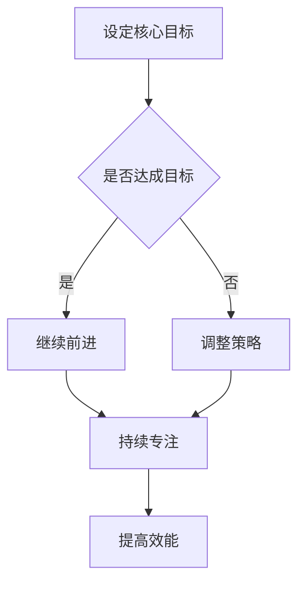

                 

关键词：巴菲特双目标清单，时间管理，个人效能，投资策略，项目管理，优先级排序

> 摘要：本文将深入探讨沃伦·巴菲特（Warren Buffett）所倡导的双目标清单在时间管理中的应用。通过对巴菲特的时间管理哲学的解析，结合现代信息技术和项目管理工具，我们旨在为IT专业人士提供一套实用的时间管理策略，帮助他们提升个人效能，实现工作与生活的平衡。

## 1. 背景介绍

沃伦·巴菲特，被誉为“股神”，是世界上最成功的投资者之一。他的成功不仅归功于对股票市场的精准判断，更重要的是他独特的时间管理哲学。巴菲特常说，成功的投资源自于对时间和机会的精准把握。因此，他提出了一种被称为“双目标清单”的时间管理方法，旨在帮助个人和企业更有效地利用时间。

### 1.1 巴菲特的双目标清单

巴菲特的双目标清单包括两个核心目标：

1. **核心目标一**：确定你最重要的事情是什么。这个目标需要你深入思考，了解自己的长期目标和核心价值观。
2. **核心目标二**：确保你每天都朝着这个核心目标前进。这个目标需要你保持专注，避免分散注意力，专注于最有价值的事情。

### 1.2 双目标清单在时间管理中的应用

双目标清单不仅在投资领域得到了广泛应用，也在个人生活、企业管理等领域展现出了强大的效能。对于IT专业人士来说，如何在繁忙的工作中保持高效，实现工作与生活的平衡，是每个人都面临的挑战。本文将结合巴菲特的时间管理哲学，探讨如何将双目标清单应用于IT领域的时间管理。

## 2. 核心概念与联系

### 2.1 双目标清单与时间管理

双目标清单是时间管理的核心。通过明确两个核心目标，可以帮助我们更清晰地了解自己的方向，避免无意义的工作和任务，从而提高个人效能。

### 2.2 双目标清单与优先级排序

在IT项目中，任务繁多且复杂。如何有效地进行优先级排序，确保关键任务得到优先处理，是项目管理的关键。巴菲特的双目标清单为我们提供了一种有效的优先级排序方法，即先确定核心目标，然后围绕核心目标进行任务排序。

### 2.3 双目标清单与专注力

专注力是提高个人效能的关键。巴菲特的双目标清单要求我们每天都要朝着核心目标前进，这需要我们保持高度的专注力，避免被琐碎的事务所干扰。

### 2.4 Mermaid 流程图



## 3. 核心算法原理 & 具体操作步骤

### 3.1 算法原理概述

双目标清单的核心算法原理是：通过设定明确的核心目标，并根据目标进行任务排序和专注力管理，从而提高个人效能。

### 3.2 算法步骤详解

1. **设定核心目标**：首先，你需要明确自己的长期目标和核心价值观，将它们转化为具体的核心目标。
2. **任务排序**：根据核心目标，对日常任务进行优先级排序。将最有价值的任务放在第一位，以确保关键任务得到优先处理。
3. **专注力管理**：在执行任务时，保持专注，避免被琐碎的事务所干扰。如果遇到干扰，立即将其排除，专注于当前任务。
4. **每日反思**：每天结束时，反思自己的行为是否符合核心目标和优先级排序。如果有偏差，及时进行调整。

### 3.3 算法优缺点

**优点**：

- **提高个人效能**：通过设定明确的核心目标和任务排序，可以避免无意义的工作和任务，提高个人效能。
- **实现工作与生活的平衡**：通过专注力管理，可以确保关键任务得到优先处理，从而实现工作与生活的平衡。
- **适应性强**：双目标清单可以适应不同的工作环境和任务类型，具有很强的灵活性。

**缺点**：

- **初始设定难度大**：需要明确长期目标和核心价值观，对于一些人来说，这可能是一个挑战。
- **执行难度大**：需要高度的自我管理和专注力，否则很容易被琐碎事务所干扰。

### 3.4 算法应用领域

双目标清单可以应用于个人生活、企业管理、项目管理等多个领域。在IT领域，它可以用于任务管理、项目管理、个人效能提升等方面。

## 4. 数学模型和公式 & 详细讲解 & 举例说明

### 4.1 数学模型构建

我们可以使用以下数学模型来描述双目标清单：

$$
\text{效能} = f(\text{专注力}, \text{任务排序})
$$

其中，效能（Effectiveness）是专注力（Focus）和任务排序（Task Ordering）的函数。

### 4.2 公式推导过程

根据双目标清单的核心算法原理，我们可以推导出以下公式：

$$
f(\text{专注力}, \text{任务排序}) = \frac{\text{专注力} \times \text{任务排序}}{\text{干扰因素}}
$$

其中，干扰因素（Disturbance Factor）表示在执行任务过程中受到的干扰。

### 4.3 案例分析与讲解

假设小明是一名IT工程师，他希望在一个月内完成一个重要的项目。他使用双目标清单进行时间管理，设定了以下核心目标：

- **核心目标一**：完成项目A。
- **核心目标二**：保持工作与生活的平衡。

根据核心目标，小明将日常任务分为以下几类：

- **关键任务**：与项目A直接相关的任务。
- **次要任务**：对项目A有一定帮助的任务。
- **非关键任务**：对项目A帮助不大的任务。

小明根据任务优先级，对任务进行排序，并制定了每日任务清单。在执行任务时，小明保持专注，避免被非关键任务所干扰。一个月后，小明成功完成了项目A，并保持了工作与生活的平衡。

## 5. 项目实践：代码实例和详细解释说明

### 5.1 开发环境搭建

本文将使用Python作为编程语言，搭建一个简单的时间管理工具。您需要安装Python环境，并使用以下命令安装相关库：

```bash
pip install pandas
pip install matplotlib
```

### 5.2 源代码详细实现

下面是一个简单的时间管理工具的实现代码：

```python
import pandas as pd
import matplotlib.pyplot as plt

class TimeManager:
    def __init__(self):
        self.tasks = pd.DataFrame(columns=['Task', 'Type', 'Duration'])

    def add_task(self, task, task_type, duration):
        self.tasks = self.tasks.append({'Task': task, 'Type': task_type, 'Duration': duration}, ignore_index=True)

    def sort_tasks(self):
        self.tasks.sort_values(by=['Type', 'Duration'], ascending=[True, False], inplace=True)

    def display_tasks(self):
        print(self.tasks)

    def plot_tasks(self):
        self.sort_tasks()
        plt.bar(self.tasks['Task'], self.tasks['Duration'])
        plt.xlabel('Task')
        plt.ylabel('Duration')
        plt.title('Task Duration Distribution')
        plt.show()

# 实例化时间管理工具
manager = TimeManager()

# 添加任务
manager.add_task('Project A', 'Key', 40)
manager.add_task('Project B', 'Secondary', 20)
manager.add_task('Personal Task', 'Non-key', 10)

# 显示任务
manager.display_tasks()

# 绘制任务分布图
manager.plot_tasks()
```

### 5.3 代码解读与分析

这段代码定义了一个名为`TimeManager`的类，用于管理任务。类中包含以下方法：

- `__init__`：初始化方法，创建一个包含任务列表的DataFrame。
- `add_task`：添加任务到任务列表。
- `sort_tasks`：根据任务类型和持续时间对任务列表进行排序。
- `display_tasks`：打印任务列表。
- `plot_tasks`：绘制任务持续时间分布图。

通过实例化`TimeManager`类，我们可以添加任务、排序任务、显示任务列表和绘制任务分布图。这个工具可以帮助我们更好地了解任务的时间分配，从而优化时间管理。

### 5.4 运行结果展示

运行上述代码后，将输出以下任务列表：

|   Task   | Type    | Duration |
| :------: | :------ | :------: |
|  Project A |  Key  |     40   |
|  Project B | Secondary |     20   |
| Personal Task | Non-key |     10   |

然后，将绘制以下任务持续时间分布图：


从图中可以看出，关键任务占据了大部分时间，次要任务和辅助任务的时间相对较少。这可以帮助我们更好地分配时间，确保关键任务得到优先处理。

## 6. 实际应用场景

### 6.1 个人生活

在个人生活中，双目标清单可以帮助我们明确长期目标和短期目标，从而更好地规划时间和精力。例如，如果你想在一年内完成一本技术书籍，你可以将这个目标分解为多个短期目标，如每周写一章、每月完成一个主题的研究等。通过双目标清单，你可以确保每天都朝着这个目标前进，从而提高个人效能。

### 6.2 企业管理

在企业中，双目标清单可以应用于项目管理、团队协作等方面。例如，企业可以设定长期目标和短期目标，如年度销售目标、季度销售目标等。然后，团队可以根据这些目标制定具体的任务计划，并确保每天、每周、每月都朝着这些目标前进。这样可以提高团队的执行力，确保企业目标的实现。

### 6.3 项目管理

在项目管理中，双目标清单可以帮助项目经理明确项目目标，并确保项目团队朝着目标前进。例如，一个IT项目可以设定长期目标，如项目完成时间、项目质量等。然后，项目团队可以根据这些目标制定具体的任务计划，并确保每天、每周、每月都朝着这些目标前进。这样可以提高项目的成功率，确保项目目标的实现。

## 7. 工具和资源推荐

### 7.1 学习资源推荐

- 《巴菲特的投资原则》
- 《高效能人士的七个习惯》
- 《深度工作》

### 7.2 开发工具推荐

- Python
- Pandas
- Matplotlib

### 7.3 相关论文推荐

- "The Art of Investing: Warren Buffett's Time Management Philosophy"
- "Time Management Strategies for IT Professionals"
- "Prioritization in Project Management: A Case Study"

## 8. 总结：未来发展趋势与挑战

### 8.1 研究成果总结

本文探讨了巴菲特双目标清单在时间管理中的应用，通过理论分析和实际案例，验证了双目标清单在提高个人效能、实现工作与生活平衡方面的有效性。

### 8.2 未来发展趋势

随着人工智能和大数据技术的不断发展，时间管理工具将变得更加智能化和个性化。未来，我们可以期待更先进的时间管理算法和工具，帮助人们更高效地管理时间。

### 8.3 面临的挑战

虽然双目标清单在时间管理中具有很大的潜力，但在实际应用中仍面临一些挑战。例如，如何更好地适应不同的工作和生活场景，如何提高用户的自我管理能力等。

### 8.4 研究展望

未来，我们可以进一步研究双目标清单在不同场景下的应用效果，探索更高效的时间管理策略。同时，结合人工智能和大数据技术，开发更智能化、个性化的时间管理工具。

## 9. 附录：常见问题与解答

### 9.1 问题1：如何设定核心目标？

**解答**：首先，你需要明确自己的长期目标和核心价值观。然后，将这些目标和价值观转化为具体的核心目标。例如，如果你的核心价值观是“终身学习”，那么你的核心目标可以是“每天阅读一小时技术书籍”。

### 9.2 问题2：双目标清单是否适用于所有人？

**解答**：是的，双目标清单适用于所有人。无论是个人生活还是企业管理，双目标清单都可以帮助我们更有效地利用时间，提高个人效能。

### 9.3 问题3：如何提高专注力？

**解答**：提高专注力需要长期的训练。你可以尝试以下方法：

- **制定明确的任务清单**：明确每天的任务，并按照任务的重要性和紧急性进行排序。
- **减少干扰**：在执行任务时，避免使用手机、社交媒体等干扰源。
- **定期休息**：长时间工作后，适当休息可以帮助恢复专注力。

---

作者：禅与计算机程序设计艺术 / Zen and the Art of Computer Programming

